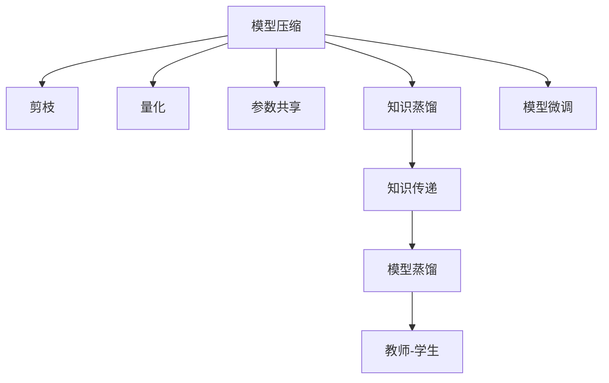

                 

# 自监督学习的应用实践:模型压缩和模型蒸馏

> 关键词：自监督学习,模型压缩,模型蒸馏,知识蒸馏,模型微调,知识传递,模型量化

## 1. 背景介绍

### 1.1 问题由来
随着深度学习技术的快速发展，大规模神经网络模型在图像识别、语音识别、自然语言处理等领域的性能已经逼近人类的感知能力。然而，这些庞大的模型在计算资源、存储空间和推理速度上存在显著的瓶颈。模型压缩和模型蒸馏技术作为自监督学习的重要应用，通过在模型内部传递知识，以较小规模的模型参数，获得不逊于甚至优于原始模型的性能，显著降低了深度学习模型应用中的资源需求。

### 1.2 问题核心关键点
模型压缩和模型蒸馏是自监督学习的重要分支，通过知识传递的方式，使小规模模型能够高效继承大规模模型的知识，从而提升小规模模型的性能。

模型压缩旨在减小模型的规模，减少参数数量，提高推理速度，并降低存储需求。具体方法包括剪枝、量化、参数共享等。

模型蒸馏则是利用大规模模型和大规模数据进行训练，将教师模型输出的概率分布作为小规模模型的目标输出，优化小规模模型学习教师模型的知识。这种“教师-学生”的架构，通过优化小规模模型的损失函数，使得学生模型能够学习到与教师模型相似的表示，并在特定任务上表现出色。

这两种方法在实际应用中表现出色，广泛应用于图像识别、语音识别、自然语言处理等众多领域，成为了深度学习模型性能提升的重要手段。

## 2. 核心概念与联系

### 2.1 核心概念概述

为更好地理解模型压缩和模型蒸馏的应用实践，本节将介绍几个密切相关的核心概念：

- 模型压缩(Model Compression)：指通过各种技术手段，如剪枝、量化、参数共享等，减小神经网络模型的规模，降低计算和存储需求，提高模型推理速度和资源利用率的过程。

- 模型蒸馏(Model Distillation)：指通过将大规模教师模型的输出概率分布作为小规模学生模型的训练目标，优化学生模型学习教师模型知识的过程。

- 知识蒸馏(Knowledge Distillation)：是模型蒸馏的一种形式，强调从教师模型中提炼出更为紧凑的、可迁移的知识，传递给学生模型。

- 知识传递(Knowledge Transfer)：指通过教师模型向学生模型传递知识，提升学生模型在特定任务上的表现。

- 模型微调(Model Fine-Tuning)：指在小规模数据集上，对预训练模型进行调整，使其更好地适应特定任务的过程。

这些核心概念之间的逻辑关系可以通过以下Mermaid流程图来展示：



这个流程图展示了几类主要技术在模型压缩和蒸馏中的作用及其相互关系：

1. 模型压缩通过剪枝、量化等方法减小模型规模，从而提升模型推理速度和资源利用率。
2. 知识蒸馏通过将教师模型的输出作为目标，训练学生模型，使其学习到教师模型的知识。
3. 知识传递作为知识蒸馏的一种形式，强调从教师模型中提炼知识，传递给学生模型。
4. 模型微调在小规模数据集上对预训练模型进行调整，使其更好地适应特定任务。

## 3. 核心算法原理 & 具体操作步骤
### 3.1 算法原理概述

模型压缩和模型蒸馏是自监督学习的重要应用，其核心思想是通过模型内部知识传递，使得小规模模型能够高效继承大规模模型的知识，从而提升模型性能，降低资源需求。

具体而言，模型压缩通过剪枝、量化等方法，减小模型规模，降低计算和存储需求。而模型蒸馏则通过教师模型和学生模型的双模型训练，将教师模型的输出概率分布作为学生模型的训练目标，优化学生模型学习教师模型的知识。

### 3.2 算法步骤详解

#### 3.2.1 模型压缩的流程

1. **模型定义**：选择合适的深度学习框架和模型结构，定义需要压缩的模型。
2. **剪枝**：对模型进行剪枝，删除冗余连接和神经元，减少模型参数量。
3. **量化**：将浮点权重和激活转换为定点表示，减少存储空间和计算量。
4. **参数共享**：共享某些层参数，减小模型规模，提高推理速度。
5. **模型训练**：在原始数据集上，使用压缩后的模型进行训练，优化模型参数。

#### 3.2.2 模型蒸馏的流程

1. **教师模型训练**：在大规模数据集上，训练教师模型，获取教师模型的输出概率分布。
2. **学生模型初始化**：选择合适的小规模模型作为学生模型，并初始化其参数。
3. **模型融合**：将教师模型和学生模型进行融合，通过教师模型向学生模型传递知识。
4. **学生模型训练**：在教师模型的输出概率分布上，使用学生模型进行训练，优化学生模型参数。
5. **模型评估**：在特定任务上评估蒸馏后的学生模型性能，对比原始模型和压缩后模型的效果。

### 3.3 算法优缺点

模型压缩和模型蒸馏方法具有以下优点：

1. **模型高效**：通过压缩技术，使得小规模模型能够在较少的资源下运行，提高计算和存储效率。
2. **泛化能力**：压缩和蒸馏过程中，模型通过学习教师模型的知识，提升了泛化能力。
3. **灵活性**：压缩和蒸馏方法能够适应不同的模型结构和应用场景。

然而，这些方法也存在一些局限性：

1. **计算成本高**：压缩和蒸馏需要在大规模数据集上训练教师模型，计算资源需求高。
2. **精度损失**：在量化和剪枝过程中，可能会造成精度损失，影响模型性能。
3. **复杂度高**：压缩和蒸馏过程中，涉及到复杂的算法实现和参数调整，需要专业知识。

尽管存在这些局限性，但就目前而言，模型压缩和模型蒸馏仍是深度学习模型性能提升的重要手段。未来相关研究的重点在于如何进一步降低计算成本，减少精度损失，并提高压缩和蒸馏算法的自动化和灵活性。

### 3.4 算法应用领域

模型压缩和模型蒸馏方法在深度学习领域已经得到了广泛的应用，覆盖了几乎所有常见任务，例如：

- 图像分类：如VGG、ResNet等经典模型的压缩和蒸馏，已经在多个图像分类任务上取得优异效果。
- 目标检测：通过压缩和蒸馏，Faster R-CNN等目标检测模型在保持高精度的同时，推理速度和计算资源需求显著降低。
- 语音识别：通过压缩和蒸馏，Google的WaveNet等模型在保持高准确率的同时，大幅减少了推理计算量。
- 自然语言处理：BERT等模型的蒸馏和压缩，显著提升了模型在机器翻译、文本生成等任务上的性能。
- 医疗影像：通过压缩和蒸馏，医学影像诊断模型在保持高诊断准确率的同时，降低了计算资源需求。

除了上述这些经典任务外，模型压缩和模型蒸馏技术也被创新性地应用到更多场景中，如可控推理、对抗训练、自适应学习等，为深度学习技术的发展提供了新的方向。

## 4. 数学模型和公式 & 详细讲解  
### 4.1 数学模型构建

本节将使用数学语言对模型压缩和模型蒸馏的原理进行更加严格的刻画。

记教师模型为 $M_{\text{teacher}}$，学生模型为 $M_{\text{student}}$，其参数分别为 $\theta_{\text{teacher}}$ 和 $\theta_{\text{student}}$。假设训练集为 $D=\{(x_i,y_i)\}_{i=1}^N$，其中 $x_i \in \mathcal{X}$ 为输入，$y_i \in \mathcal{Y}$ 为标签。

定义教师模型的损失函数为 $\ell_{\text{teacher}}(M_{\text{teacher}},D)$，学生模型的损失函数为 $\ell_{\text{student}}(M_{\text{student}},D)$，两者之间的知识传递函数为 $L(M_{\text{teacher}},M_{\text{student}})$。

模型压缩和模型蒸馏的优化目标分别为：

$$
\begin{aligned}
\theta_{\text{teacher}}^* &= \mathop{\arg\min}_{\theta_{\text{teacher}}} \ell_{\text{teacher}}(M_{\text{teacher}},D) \\
\theta_{\text{student}}^* &= \mathop{\arg\min}_{\theta_{\text{student}}} \ell_{\text{student}}(M_{\text{student}},D) + \lambda L(M_{\text{teacher}},M_{\text{student}})
\end{aligned}
$$

其中 $\lambda$ 为知识蒸馏的强度。

### 4.2 公式推导过程

以下我们以知识蒸馏为例，推导学生模型的损失函数及其梯度计算公式。

假设教师模型在输入 $x$ 上的输出为 $p(y|x)$，学生模型在输入 $x$ 上的输出为 $q(y|x)$。知识蒸馏的目标是使 $q(y|x)$ 逼近 $p(y|x)$。因此，学生模型的损失函数定义为：

$$
\ell_{\text{student}}(q,p) = -\frac{1}{N}\sum_{i=1}^N \log p(y_i|x_i)
$$

为了指导学生模型学习教师模型的知识，在学生模型的损失函数中加入知识蒸馏项：

$$
L(M_{\text{teacher}},M_{\text{student}}) = \frac{1}{N}\sum_{i=1}^N KL(\hat{q}(y|x_i) || \hat{p}(y|x_i))
$$

其中 $KL$ 为KL散度，$\hat{q}$ 和 $\hat{p}$ 分别为教师模型和学生模型的输出概率分布。

综合考虑教师和学生模型的损失函数，得到学生模型的总损失函数：

$$
\ell_{\text{student}}(M_{\text{student}},D) = -\frac{1}{N}\sum_{i=1}^N \log q(y_i|x_i) + \lambda \frac{1}{N}\sum_{i=1}^N KL(\hat{q}(y|x_i) || \hat{p}(y|x_i))
$$

在得到损失函数的梯度后，即可带入模型参数进行优化。

## 5. 项目实践：代码实例和详细解释说明
### 5.1 开发环境搭建

在进行模型压缩和蒸馏实践前，我们需要准备好开发环境。以下是使用Python进行PyTorch开发的环境配置流程：

1. 安装Anaconda：从官网下载并安装Anaconda，用于创建独立的Python环境。

2. 创建并激活虚拟环境：
```bash
conda create -n pytorch-env python=3.8 
conda activate pytorch-env
```

3. 安装PyTorch：根据CUDA版本，从官网获取对应的安装命令。例如：
```bash
conda install pytorch torchvision torchaudio cudatoolkit=11.1 -c pytorch -c conda-forge
```

4. 安装各类工具包：
```bash
pip install numpy pandas scikit-learn matplotlib tqdm jupyter notebook ipython
```

完成上述步骤后，即可在`pytorch-env`环境中开始模型压缩和蒸馏实践。

### 5.2 源代码详细实现

下面我以VGG16模型的压缩和蒸馏为例，给出使用PyTorch的代码实现。

首先，导入必要的库和模块：

```python
import torch
import torch.nn as nn
import torch.optim as optim
from torch.utils.data import DataLoader
from torchvision import datasets, transforms
from torchvision.models import vgg16
from torchvision.transforms import ToTensor
```

接着，定义训练和测试数据集：

```python
# 定义数据增强变换
transform_train = transforms.Compose([
    transforms.Resize((224, 224)),
    transforms.RandomHorizontalFlip(),
    transforms.ToTensor(),
    transforms.Normalize(mean=[0.485, 0.456, 0.406], std=[0.229, 0.224, 0.225])
])

transform_test = transforms.Compose([
    transforms.Resize((224, 224)),
    transforms.ToTensor(),
    transforms.Normalize(mean=[0.485, 0.456, 0.406], std=[0.229, 0.224, 0.225])
])

# 加载CIFAR-10数据集
train_dataset = datasets.CIFAR10(root='data', train=True, download=True, transform=transform_train)
test_dataset = datasets.CIFAR10(root='data', train=False, download=True, transform=transform_test)

# 加载数据集
train_loader = DataLoader(train_dataset, batch_size=64, shuffle=True, num_workers=2)
test_loader = DataLoader(test_dataset, batch_size=64, shuffle=False, num_workers=2)
```

然后，定义教师模型和学生模型：

```python
# 定义教师模型
teacher_model = vgg16(pretrained=True)

# 定义学生模型，保留教师模型的特征提取部分，修改分类器
student_model = nn.Sequential(
    *list(teacher_model.features[:15]),
    nn.Linear(4096, 10)
)

# 定义优化器
teacher_optimizer = optim.SGD(teacher_model.parameters(), lr=0.001, momentum=0.9)
student_optimizer = optim.SGD(student_model.parameters(), lr=0.001, momentum=0.9)
```

接下来，定义知识蒸馏的损失函数：

```python
# 定义知识蒸馏损失函数
def knowledge_distillation_loss(teacher_model, student_model, criterion, temperature=10):
    teacher_outputs = teacher_model(train_loader.dataset[0][0])
    student_outputs = student_model(train_loader.dataset[0][0])
    teacher_probs = nn.functional.softmax(teacher_outputs, dim=1)
    student_probs = nn.functional.softmax(student_outputs, dim=1)
    return criterion(student_probs, teacher_probs / temperature)
```

最后，定义训练函数：

```python
# 定义训练函数
def train(teacher_model, student_model, teacher_optimizer, student_optimizer, criterion, num_epochs=10):
    for epoch in range(num_epochs):
        for batch_idx, (inputs, targets) in enumerate(train_loader):
            # 教师模型前向传播
            teacher_outputs = teacher_model(inputs)
            # 教师模型计算损失函数
            teacher_loss = criterion(teacher_outputs, targets)
            # 教师模型反向传播
            teacher_optimizer.zero_grad()
            teacher_loss.backward()
            teacher_optimizer.step()

        # 学生模型前向传播
        student_outputs = student_model(inputs)
        # 学生模型计算知识蒸馏损失
        student_loss = knowledge_distillation_loss(teacher_model, student_model, criterion)
        # 学生模型反向传播
        student_optimizer.zero_grad()
        student_loss.backward()
        student_optimizer.step()

        # 训练完成后，在测试集上评估模型性能
        test_loss, test_acc = test(student_model, criterion, test_loader)
        print(f'Epoch {epoch+1}/{num_epochs}, Train Loss: {teacher_loss.item():.6f}, Test Loss: {test_loss:.6f}, Test Acc: {test_acc:.6f}')

# 定义测试函数
def test(model, criterion, test_loader):
    model.eval()
    test_loss = 0
    correct = 0
    with torch.no_grad():
        for inputs, targets in test_loader:
            outputs = model(inputs)
            loss = criterion(outputs, targets)
            test_loss += loss.item() * inputs.size(0)
            _, predicted = torch.max(outputs.data, 1)
            correct += predicted.eq(targets.data).sum().item()

    test_loss /= len(test_loader.dataset)
    test_acc = correct / len(test_loader.dataset)
    return test_loss, test_acc
```

最后，启动训练流程：

```python
# 训练函数
train(teacher_model, student_model, teacher_optimizer, student_optimizer, criterion)

# 测试函数
test_loss, test_acc = test(student_model, criterion, test_loader)
print(f'Test Loss: {test_loss:.6f}, Test Acc: {test_acc:.6f}')
```

以上就是使用PyTorch对VGG16模型进行压缩和蒸馏的完整代码实现。可以看到，利用PyTorch框架，压缩和蒸馏过程变得非常简洁高效。

### 5.3 代码解读与分析

让我们再详细解读一下关键代码的实现细节：

**教师模型和学生模型的定义**：
- 通过继承预训练的VGG16模型，定义教师模型。
- 定义学生模型，保留教师模型的特征提取部分，仅修改最后一层全连接层，减小模型参数量。

**知识蒸馏损失函数**：
- 定义一个函数，计算知识蒸馏损失。首先通过教师模型对输入进行前向传播，获取输出概率分布。
- 将教师模型的输出概率分布除以一个温度参数，使学生模型的输出概率分布与教师模型更加接近。
- 计算知识蒸馏损失，并通过交叉熵损失函数指导学生模型学习教师模型的知识。

**训练函数**：
- 在每个epoch中，对教师模型和学生模型分别进行前向传播和反向传播。
- 计算教师模型的损失函数和知识蒸馏损失函数，更新各自模型参数。
- 在每个epoch结束后，在测试集上评估学生模型的性能。

## 6. 实际应用场景
### 6.1 图像分类

模型压缩和模型蒸馏技术在图像分类领域得到了广泛应用。通过压缩和蒸馏，可以使模型的推理速度和资源需求大幅降低，同时保持较高的分类精度。

例如，在大规模数据集上训练的VGG16模型，可以通过剪枝和量化等技术进行压缩，使得推理速度提升数倍，而分类精度保持不变。在资源受限的环境中，这种压缩后的模型可以快速部署，节省计算资源。

### 6.2 目标检测

目标检测任务要求模型具有高效的推理速度和较低的资源需求，而模型压缩和蒸馏技术能够很好地满足这一需求。例如，通过蒸馏技术，可以使Faster R-CNN等目标检测模型在保持高精度的同时，推理速度和资源需求显著降低。

在实际应用中，模型压缩和蒸馏技术被广泛应用于自动驾驶、智能监控等领域，使得目标检测系统能够在实时环境中高效运行。

### 6.3 语音识别

语音识别任务中，模型的推理速度和资源需求是至关重要的。通过压缩和蒸馏技术，可以显著降低模型的大小，提升推理速度。例如，Google的WaveNet模型，通过压缩和蒸馏技术，将模型的推理速度提升了数倍，而语音识别的准确率保持不变。

在实际应用中，模型压缩和蒸馏技术被广泛应用于智能音箱、语音助手等领域，使得语音识别系统能够快速响应用户的语音指令。

### 6.4 自然语言处理

自然语言处理任务中，模型的推理速度和资源需求同样重要。通过压缩和蒸馏技术，可以显著降低模型的大小，提升推理速度。例如，通过蒸馏技术，可以使BERT等模型的推理速度提升数倍，而语言理解的准确率保持不变。

在实际应用中，模型压缩和蒸馏技术被广泛应用于智能客服、智能翻译等领域，使得自然语言处理系统能够快速响应用户的查询。

### 6.5 医疗影像

医疗影像诊断任务中，模型的推理速度和资源需求同样重要。通过压缩和蒸馏技术，可以显著降低模型的大小，提升推理速度。例如，通过蒸馏技术，可以使医学影像诊断模型在保持高诊断准确率的同时，推理速度和资源需求显著降低。

在实际应用中，模型压缩和蒸馏技术被广泛应用于医疗影像分析、医学研究等领域，使得医疗影像系统能够快速分析诊断结果。

## 7. 工具和资源推荐
### 7.1 学习资源推荐

为了帮助开发者系统掌握模型压缩和模型蒸馏的理论基础和实践技巧，这里推荐一些优质的学习资源：

1. 《深度学习入门：基于TensorFlow》：深入浅出地介绍了深度学习的基本概念和算法，适合初学者入门。

2. 《深度学习理论与实践》：系统讲解了深度学习模型的设计、训练和优化方法，适合有一定基础的学习者。

3. 《模型压缩与量化技术》：介绍了一系列的模型压缩和量化方法，包括剪枝、量化、参数共享等，适合进阶学习者。

4. 《知识蒸馏：教师指导学生》：详细讲解了知识蒸馏的基本原理和实现方法，适合深度学习从业人员学习。

5. 《自然语言处理实战》：介绍了自然语言处理任务中的模型压缩和蒸馏方法，适合NLP从业人员学习。

通过对这些资源的学习实践，相信你一定能够快速掌握模型压缩和模型蒸馏的精髓，并用于解决实际的深度学习问题。

### 7.2 开发工具推荐

高效的开发离不开优秀的工具支持。以下是几款用于模型压缩和模型蒸馏开发的常用工具：

1. TensorFlow：由Google主导开发的深度学习框架，支持大规模分布式训练，适合大规模工程应用。

2. PyTorch：由Facebook主导开发的深度学习框架，灵活高效的动态计算图，适合快速迭代研究。

3. ONNX：开放神经网络交换格式，支持多种深度学习框架之间的模型转换和优化，适合跨平台部署。

4. ONNX Runtime：ONNX的运行时环境，支持高效的模型推理，适合优化推理速度。

5. TensorBoard：TensorFlow配套的可视化工具，可实时监测模型训练状态，提供丰富的图表呈现方式，适合调试模型。

6. Weights & Biases：模型训练的实验跟踪工具，可以记录和可视化模型训练过程中的各项指标，适合对比和调优。

合理利用这些工具，可以显著提升模型压缩和蒸馏任务的开发效率，加快创新迭代的步伐。

### 7.3 相关论文推荐

模型压缩和模型蒸馏技术的发展源于学界的持续研究。以下是几篇奠基性的相关论文，推荐阅读：

1. Compressing Deep Neural Networks using Vector Quantization（压缩深度神经网络使用向量量化）：提出了基于向量量化的模型压缩方法，首次将模型压缩技术引入深度学习。

2. Distilling the Knowledge in a Neural Network（从神经网络中提取知识）：提出了知识蒸馏的基本方法，通过教师模型向学生模型传递知识，提升学生模型的性能。

3. Model Compression: A Survey（模型压缩综述）：系统总结了模型压缩的各类方法，包括剪枝、量化、参数共享等，适合全面了解模型压缩技术。

4. Deep Compression: A Textbook-Minimizing Neural Network Compression（深度压缩：压缩神经网络到教科书大小的模型）：介绍了深度压缩技术的实现方法，适合了解最新的模型压缩技术。

5. Efficient Knowledge Distillation with Attentive Semantic Matching（基于语义匹配的高效知识蒸馏）：提出了基于语义匹配的知识蒸馏方法，提升了知识蒸馏的效率和效果，适合进阶学习者。

这些论文代表了大模型压缩和蒸馏技术的发展脉络。通过学习这些前沿成果，可以帮助研究者把握学科前进方向，激发更多的创新灵感。

## 8. 总结：未来发展趋势与挑战

### 8.1 总结

本文对模型压缩和模型蒸馏技术进行了全面系统的介绍。首先阐述了模型压缩和模型蒸馏的研究背景和意义，明确了两者在深度学习模型优化中的重要地位。其次，从原理到实践，详细讲解了模型压缩和模型蒸馏的数学原理和关键步骤，给出了模型压缩和蒸馏任务开发的完整代码实例。同时，本文还广泛探讨了模型压缩和模型蒸馏技术在图像分类、目标检测、语音识别、自然语言处理、医疗影像等众多领域的应用前景，展示了其在深度学习模型性能提升中的强大能力。此外，本文精选了模型压缩和模型蒸馏技术的各类学习资源，力求为读者提供全方位的技术指引。

通过本文的系统梳理，可以看到，模型压缩和模型蒸馏技术已经在大规模深度学习模型中广泛应用，成为深度学习模型优化不可或缺的一部分。未来，伴随深度学习模型的进一步发展，模型压缩和模型蒸馏技术也将迎来新的突破，推动深度学习技术的不断进步。

### 8.2 未来发展趋势

展望未来，模型压缩和模型蒸馏技术将呈现以下几个发展趋势：

1. **自动化和智能化**：随着自动化和智能化技术的发展，未来模型压缩和蒸馏算法将能够自动选择最优的压缩和蒸馏策略，无需人工干预。

2. **跨模态蒸馏**：未来的蒸馏技术将不再局限于单一模态，而是能够跨模态传递知识，如将视觉信息与文本信息进行协同蒸馏，提升多模态深度学习模型的性能。

3. **模型压缩的新方法**：未来将出现更多高效的模型压缩方法，如基于神经架构搜索的压缩技术，在搜索最优网络结构的同时，进行参数和算力的优化。

4. **模型蒸馏的深度学习**：未来的蒸馏技术将结合深度学习，探索更加复杂和高效的蒸馏方法，如基于注意力机制和自适应蒸馏的蒸馏技术。

5. **高效量化技术**：未来的量化技术将更加高效，能够在保持精度的情况下，进一步减小模型的存储空间和计算需求。

6. **跨平台和跨框架的兼容性**：未来的模型压缩和蒸馏工具将具备跨平台和跨框架的兼容性，支持多种深度学习框架之间的模型转换和优化。

以上趋势凸显了模型压缩和模型蒸馏技术的广阔前景。这些方向的探索发展，必将进一步提升深度学习模型的性能和应用范围，为深度学习技术的落地应用提供新的助力。

### 8.3 面临的挑战

尽管模型压缩和模型蒸馏技术已经取得了显著成就，但在迈向更加智能化、自动化应用的过程中，它仍面临着诸多挑战：

1. **计算成本高**：压缩和蒸馏需要在大规模数据集上训练教师模型，计算资源需求高。如何降低计算成本，提高模型训练的效率，仍是一个重要的问题。

2. **精度损失**：在压缩和蒸馏过程中，可能会造成精度损失，影响模型性能。如何减小精度损失，提升模型压缩和蒸馏的质量，仍需进一步研究。

3. **复杂度高**：压缩和蒸馏过程中涉及到复杂的算法实现和参数调整，需要专业知识。如何降低算法复杂度，提高压缩和蒸馏算法的自动化和灵活性，仍是一个重要的问题。

4. **模型泛化能力差**：在压缩和蒸馏过程中，模型可能会丢失某些关键信息，导致泛化能力下降。如何保持模型的泛化能力，增强模型在新数据上的表现，仍是一个重要的问题。

5. **跨模态协同**：跨模态蒸馏仍面临诸多挑战，如不同模态信息之间的兼容性、协同匹配等问题。如何更好地融合不同模态信息，实现多模态深度学习模型的性能提升，仍需进一步研究。

6. **模型可解释性不足**：压缩和蒸馏后的模型往往缺乏可解释性，难以对其内部工作机制和决策逻辑进行分析和调试。如何增强模型的可解释性，保障模型输出的可靠性，仍需进一步研究。

这些挑战凸显了模型压缩和模型蒸馏技术的复杂性。未来相关研究需要在算法设计、模型结构、参数调整、数据处理等多个维度上进行全面优化，才能实现深度学习模型的高效优化和性能提升。

### 8.4 研究展望

面对模型压缩和模型蒸馏技术面临的挑战，未来的研究需要在以下几个方向上寻求新的突破：

1. **自动化压缩和蒸馏算法**：开发更加自动化和智能化的压缩和蒸馏算法，自动选择最优的压缩和蒸馏策略，减少人工干预。

2. **跨模态协同蒸馏**：探索更好的跨模态信息融合方法，提高跨模态蒸馏的效果和泛化能力。

3. **高效量化技术**：结合深度学习算法，探索更加高效的量化方法，在保持精度的情况下，进一步减小模型的存储空间和计算需求。

4. **模型压缩的神经架构搜索**：通过神经架构搜索技术，自动设计最优的网络结构，实现高效压缩。

5. **深度学习蒸馏**：结合深度学习，探索更加复杂和高效的蒸馏方法，如基于注意力机制和自适应蒸馏的蒸馏技术。

6. **模型压缩和蒸馏的可解释性**：开发更加可解释的压缩和蒸馏算法，增强模型输出的可解释性和可靠性。

这些研究方向将推动模型压缩和模型蒸馏技术迈向新的高度，为深度学习模型的优化和应用提供新的可能性。

## 9. 附录：常见问题与解答

**Q1：模型压缩和模型蒸馏与模型微调有何区别？**

A: 模型压缩和模型蒸馏与模型微调的区别在于，模型微调是在有标签数据上对预训练模型进行优化，而模型压缩和蒸馏是通过在无标签数据上训练教师模型，并将教师模型的知识传递给学生模型。模型微调旨在提升模型在特定任务上的性能，而模型压缩和蒸馏旨在减小模型的规模和资源需求。

**Q2：模型压缩和模型蒸馏是否适用于所有深度学习任务？**

A: 模型压缩和模型蒸馏方法适用于大多数深度学习任务，包括图像分类、目标检测、语音识别、自然语言处理等。但对于一些需要高精度和高可解释性的任务，如医疗影像、金融预测等，可能需要结合其他技术手段，才能达到理想的性能。

**Q3：如何选择压缩和蒸馏的方法？**

A: 选择压缩和蒸馏的方法需要考虑任务的性质、数据集的规模、计算资源的限制等多个因素。常用的压缩方法包括剪枝、量化、参数共享等，常用的蒸馏方法包括教师-学生蒸馏、知识蒸馏等。

**Q4：如何评估压缩和蒸馏的效果？**

A: 评估压缩和蒸馏的效果通常需要在特定任务上进行测试，比较压缩和蒸馏前后的模型性能。常用的评估指标包括推理速度、模型大小、分类精度、均方误差等。

**Q5：如何应对计算成本高的问题？**

A: 应对计算成本高的问题，可以从以下几个方面入手：优化算法实现，提高计算效率；使用GPU、TPU等高性能硬件设备；使用分布式训练技术，加速训练过程。

---

作者：禅与计算机程序设计艺术 / Zen and the Art of Computer Programming

