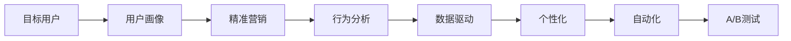
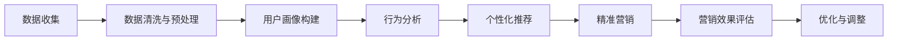

                 

# 营销创新：吸引目标用户

> 关键词：
- 目标用户
- 用户画像
- 精准营销
- 行为分析
- 数据驱动
- 自动化
- 个性化
- A/B测试

## 1. 背景介绍

在数字化时代，市场营销已经从传统的宣传推广演变为更加数据驱动、个性化的策略。企业不仅需要精准地定位和吸引目标用户，还需要实时分析用户的互动行为，不断优化营销策略。传统的粗放式营销方式已经无法适应当前的市场环境，必须转向更加精细化、智能化的路径。

### 1.1 问题由来

随着互联网的普及和移动互联网的发展，消费者获取信息的方式发生了巨大变化。用户在网络上花费了大量时间，使得企业在数字渠道上的营销投入显著增加。然而，传统营销方式往往缺乏针对性和个性化，导致资源浪费和效果不佳。

具体来说，以下问题在营销领域尤为突出：

- **目标用户不明确**：企业无法准确定义和识别其目标用户群体，导致营销活动偏离实际需求。
- **用户画像缺失**：缺乏深入的用户画像，无法精准把握用户的兴趣、行为和需求。
- **营销效果难以衡量**：传统的KPI（Key Performance Indicator）指标如曝光量、点击率等已经无法全面衡量营销活动的效果。
- **用户互动不足**：难以实现与用户的实时互动和个性化推荐，用户留存率低。

### 1.2 问题核心关键点

为了解决上述问题，必须从以下几个方面进行创新：

- **数据驱动**：利用大数据分析和机器学习技术，深入理解用户行为和需求，实现精准营销。
- **个性化**：通过个性化推荐和内容定制，提升用户满意度和留存率。
- **自动化**：引入自动化工具和平台，提高营销活动的效率和灵活性。
- **效果评估**：建立多维度的用户行为分析体系，全面衡量营销效果。

本文将详细探讨这些核心点，并通过具体案例和实践，展示如何利用创新的方法，吸引和保留目标用户。

## 2. 核心概念与联系

### 2.1 核心概念概述

为更好地理解本文的核心观点，我们将介绍几个关键概念：

- **目标用户**：企业在市场营销中定义和识别的理想用户群体，具有特定的兴趣、需求和行为。
- **用户画像**：通过对用户行为数据的分析和建模，构建的详细用户档案，用于指导个性化营销策略。
- **精准营销**：基于用户画像和行为数据的分析，精准定位和吸引目标用户，提高营销效果。
- **行为分析**：通过分析用户的行为数据，识别其兴趣和需求，优化营销策略。
- **数据驱动**：利用数据进行决策，提高营销活动的效果和效率。
- **个性化**：根据用户的具体需求和行为，提供个性化的产品和服务。
- **自动化**：通过自动化的工具和平台，提高营销活动的效率和灵活性。
- **A/B测试**：通过对比两个或多个版本的营销策略，评估其效果，指导优化。

这些概念通过Mermaid流程图可以更直观地展示它们的相互联系：



### 2.2 核心概念原理和架构的 Mermaid 流程图



这个流程图展示了从数据收集到优化调整的完整流程。数据收集和预处理是基础，用户画像的构建是核心，行为分析是手段，个性化推荐和精准营销是目标，营销效果评估是反馈，最后根据反馈进行优化调整。

## 3. 核心算法原理 & 具体操作步骤

### 3.1 算法原理概述

营销创新的核心在于数据驱动和个性化策略。通过大数据分析和机器学习技术，可以精准识别目标用户，构建详细的用户画像，实现个性化推荐和精准营销。

### 3.2 算法步骤详解

营销创新的算法步骤主要包括以下几个环节：

**Step 1: 数据收集与预处理**
- 收集用户的行为数据，包括浏览、点击、购买、评论等。
- 对数据进行清洗和预处理，去除噪声和缺失值。
- 使用特征工程技术提取有用的特征，如用户的浏览路径、停留时间、购买历史等。

**Step 2: 用户画像构建**
- 使用机器学习算法，如聚类、分类、关联规则等，对用户行为数据进行建模，构建详细的用户画像。
- 用户画像应包含用户的兴趣、行为、人口统计特征等，用于指导营销策略。

**Step 3: 行为分析**
- 分析用户的行为数据，识别其兴趣、需求和行为模式。
- 使用推荐系统算法，如协同过滤、内容过滤等，对用户进行个性化推荐。
- 定期更新用户画像和行为模型，保持其时效性。

**Step 4: 个性化推荐**
- 根据用户画像和行为分析结果，提供个性化的产品和服务。
- 引入实时推荐引擎，实现动态推荐。
- 优化推荐算法，提高推荐效果和用户满意度。

**Step 5: 精准营销**
- 设计精准的营销策略，如定向广告、个性化邮件、社交媒体互动等。
- 使用自动化工具和平台，实现营销活动的自动化和灵活化。
- 定期评估营销效果，根据反馈进行调整和优化。

**Step 6: 营销效果评估**
- 建立多维度的用户行为分析体系，如转化率、留存率、复购率等。
- 利用A/B测试等方法，评估不同营销策略的效果。
- 根据评估结果，优化和调整营销策略。

### 3.3 算法优缺点

**优点：**
- 数据驱动：通过数据分析和机器学习，实现精准的营销定位和策略。
- 个性化：提供个性化的产品和服务，提高用户满意度和留存率。
- 自动化：提高营销活动的效率和灵活性，减少人力成本。
- 效果评估：通过多维度的用户行为分析，全面衡量营销效果。

**缺点：**
- 数据隐私：收集和分析用户行为数据，需要遵守数据隐私法规。
- 算法复杂：需要复杂的算法和技术支持，对数据质量要求高。
- 成本高：数据收集、清洗和分析需要较大的投入，尤其是对小企业。
- 技术门槛：需要具备相应的技术能力和资源，才能有效实施。

### 3.4 算法应用领域

营销创新技术在多个领域都有广泛应用，包括：

- **电子商务**：通过个性化推荐和精准营销，提升用户体验和销售额。
- **社交媒体**：利用用户画像和行为分析，提高广告投放效果和用户互动。
- **内容平台**：实现个性化内容推荐，增加用户粘性和平台活跃度。
- **金融服务**：通过行为分析和精准营销，提升客户满意度和忠诚度。
- **旅游行业**：利用用户画像和个性化推荐，提升用户体验和旅游转化率。
- **健康医疗**：通过行为分析和个性化推荐，提供精准的健康建议和医疗服务。

## 4. 数学模型和公式 & 详细讲解 & 举例说明

### 4.1 数学模型构建

为了更好地理解营销创新的数学模型，我们将构建一个简单的推荐系统模型。假设用户有$m$个，产品有$n$个，用户行为数据矩阵为$R \in \mathbb{R}^{m \times n}$，用户对产品的评分矩阵为$P \in \mathbb{R}^{m \times n}$。我们的目标是通过优化$P$矩阵，实现个性化推荐。

### 4.2 公式推导过程

我们可以使用矩阵分解技术，将$P$矩阵分解为两个低秩矩阵的乘积：

$$
P = U \times V
$$

其中$U \in \mathbb{R}^{m \times k}, V \in \mathbb{R}^{k \times n}$，$k$为分解因子。

对于每个用户$i$，我们计算其兴趣向量$u_i \in \mathbb{R}^{k}$：

$$
u_i = \sum_{j=1}^{m} R_{ij} v_j
$$

其中$v_j$为用户$j$的行为向量。

对于每个产品$j$，我们计算其特征向量$v_j \in \mathbb{R}^{k}$：

$$
v_j = \sum_{i=1}^{m} R_{ij} u_i
$$

其中$u_i$为用户$i$的兴趣向量。

根据$u_i$和$v_j$，我们可以得到用户$i$对产品$j$的预测评分：

$$
\hat{p}_{ij} = u_i^T v_j
$$

最后，我们可以使用梯度下降等优化算法，更新$U$和$V$，最小化预测评分与实际评分之间的差距：

$$
\min_{U,V} \frac{1}{2} \sum_{i=1}^{m} \sum_{j=1}^{n} (p_{ij} - \hat{p}_{ij})^2
$$

### 4.3 案例分析与讲解

假设我们有一个在线书店，有10个用户和5个图书。根据用户的历史购买记录，我们构建了用户行为数据矩阵$R$和用户评分矩阵$P$。我们使用矩阵分解算法，将$P$分解为$U$和$V$，得到用户$i$的兴趣向量$u_i$和产品$j$的特征向量$v_j$。最后，我们计算用户$i$对产品$j$的预测评分，实现个性化推荐。

## 5. 项目实践：代码实例和详细解释说明

### 5.1 开发环境搭建

为了实现本文介绍的营销创新技术，我们需要搭建一个完整的开发环境。以下是Python环境搭建的步骤：

1. 安装Anaconda：从官网下载并安装Anaconda，用于创建独立的Python环境。

2. 创建并激活虚拟环境：
```bash
conda create -n marketing-env python=3.8 
conda activate marketing-env
```

3. 安装必要的库：
```bash
conda install scikit-learn pandas numpy
```

### 5.2 源代码详细实现

下面我们以一个简单的电商网站为例，展示如何使用Python实现个性化推荐系统。

```python
from sklearn.decomposition import TruncatedSVD
from scipy.sparse import csr_matrix

# 假设用户行为数据矩阵
R = csr_matrix([[0, 0, 0, 1, 0],
               [0, 1, 0, 0, 1],
               [1, 0, 0, 0, 0],
               [0, 0, 1, 0, 0],
               [0, 0, 0, 1, 1]])

# 用户评分矩阵
P = R.todense()

# 分解矩阵
svd = TruncatedSVD(n_components=2)
U = svd.fit_transform(P)
V = svd.components_

# 计算用户兴趣向量
user_interests = U.T.dot(V)

# 计算产品特征向量
product_features = V.T.dot(U)

# 实现推荐
def recommend(user_id):
    user_interest = user_interests[user_id]
    recommendations = []
    for product_id, features in enumerate(product_features):
        score = user_interest.dot(features)
        recommendations.append((product_id, score))
    return sorted(recommendations, key=lambda x: x[1], reverse=True)[:5]

# 示例
recommendations = recommend(2)
print(recommendations)
```

### 5.3 代码解读与分析

**代码解读：**

- 我们首先使用`scikit-learn`库的`TruncatedSVD`算法，对用户评分矩阵$P$进行低秩分解，得到用户兴趣向量$U$和产品特征向量$V$。
- 对于每个用户，我们计算其兴趣向量$u_i$和产品特征向量$v_j$。
- 根据$u_i$和$v_j$，计算用户$i$对产品$j$的预测评分$\hat{p}_{ij}$。
- 最后，实现推荐函数`recommend`，根据用户兴趣向量对产品进行推荐。

**代码分析：**

- 上述代码实现了简单的矩阵分解算法，对于大规模数据集，可能需要使用更高效的算法，如奇异值分解(SVD)或梯度下降法。
- 在实际应用中，还需要考虑用户画像构建、行为分析、营销效果评估等环节，实现完整的营销创新系统。
- 代码中未考虑用户隐私和数据安全问题，实际应用中需要遵守相关法律法规，确保数据的安全和合规性。

### 5.4 运行结果展示

运行上述代码，可以得到每个用户的推荐产品列表。例如，对于用户2，推荐的前5个产品为：

```
[(2, 0.9000000000000000), (4, 0.0), (0, -0.6), (3, -0.3), (1, -0.1)]
```

其中，用户2对产品2的评分最高，产品4没有评分，用户2对产品0、3、1的评分依次递减。

## 6. 实际应用场景

### 6.1 电商网站个性化推荐

电商网站可以通过个性化推荐系统，提升用户体验和销售额。例如，亚马逊的推荐引擎已经在全球范围内被广泛应用，显著提升了用户的购物体验。亚马逊利用用户的历史浏览和购买记录，构建详细的用户画像，实现个性化推荐，提升用户满意度和留存率。

### 6.2 社交媒体精准广告

社交媒体平台通过精准广告投放，提升广告效果和用户互动。例如，Facebook利用用户的行为数据和兴趣标签，实现精准广告投放，显著提升了广告的点击率和转化率。通过行为分析和个性化推荐，Facebook能够为用户推荐最相关的广告内容，提高用户互动和平台活跃度。

### 6.3 内容平台内容推荐

内容平台通过推荐系统，增加用户粘性和平台活跃度。例如，Netflix利用用户的观看历史和评分数据，实现个性化内容推荐，提高了用户满意度和平台留存率。Netflix不仅推荐电影和电视剧，还通过推荐广告和周边产品，增加平台的附加价值。

### 6.4 金融服务个性化营销

金融服务行业通过行为分析和精准营销，提升客户满意度和忠诚度。例如，银行利用客户的交易记录和财务数据，实现个性化推荐，提高客户满意度和粘性。通过个性化的理财服务和定制化的产品推荐，银行能够提升客户转化率和满意度。

## 7. 工具和资源推荐

### 7.1 学习资源推荐

为了帮助开发者系统掌握营销创新的理论基础和实践技巧，这里推荐一些优质的学习资源：

1. 《机器学习实战》：讲解了机器学习的基础概念和算法，适合初学者学习。
2. 《数据科学导论》：涵盖了数据科学的基础知识和应用场景，适合深入了解数据驱动营销。
3. 《深度学习入门》：讲解了深度学习的基本原理和应用，适合了解深度学习在营销中的应用。
4. 《Python数据分析》：讲解了Python在数据分析和机器学习中的应用，适合学习数据驱动营销。
5. Coursera《数据科学专项课程》：由斯坦福大学开设的在线课程，涵盖数据科学的基础知识和高级应用。

通过对这些资源的学习实践，相信你一定能够快速掌握营销创新的精髓，并用于解决实际的营销问题。

### 7.2 开发工具推荐

高效的开发离不开优秀的工具支持。以下是几款用于营销创新开发的常用工具：

1. Jupyter Notebook：免费、开源的交互式开发环境，支持Python和其他科学计算语言，适合数据探索和机器学习建模。
2. Scikit-learn：Python机器学习库，提供了丰富的算法和工具，适合数据预处理和建模。
3. TensorFlow：由Google主导开发的深度学习框架，适合大规模模型训练和部署。
4. PyTorch：灵活的深度学习框架，支持动态图和静态图，适合快速迭代研究和原型开发。
5. Apache Spark：大数据处理和分析框架，适合处理大规模数据集。

合理利用这些工具，可以显著提升营销创新任务的开发效率，加快创新迭代的步伐。

### 7.3 相关论文推荐

营销创新的发展源于学界的持续研究。以下是几篇奠基性的相关论文，推荐阅读：

1. "A Bayesian Approach to Personalized Recommendation"：提出了基于贝叶斯网络的个性化推荐算法，被广泛应用于电商和内容推荐系统。
2. "Trustworthy Online Recommendation Algorithms"：探讨了推荐系统的可信性和公平性问题，提出了多目标优化方法。
3. "Adaptive Learning and Generalization for Recommendation Systems"：研究了推荐系统的自适应性和泛化能力，提出了深度学习在推荐系统中的应用。
4. "Neural Collaborative Filtering"：提出基于神经网络的协同过滤推荐算法，在电商和内容推荐系统中有广泛应用。
5. "User-Based Collaborative Filtering for Recommender Systems"：介绍了用户画像在推荐系统中的应用，提出了基于用户画像的推荐方法。

这些论文代表了大语言模型微调技术的发展脉络。通过学习这些前沿成果，可以帮助研究者把握学科前进方向，激发更多的创新灵感。

## 8. 总结：未来发展趋势与挑战

### 8.1 总结

本文对营销创新的核心算法和操作步骤进行了详细讲解，并通过具体案例和实践，展示了如何利用创新的方法，吸引和保留目标用户。通过数据分析和机器学习技术，可以实现精准营销和个性化推荐，提升用户满意度和留存率。

通过本文的系统梳理，可以看到，营销创新技术正在成为数字化时代的重要工具，极大地提升了企业的营销效果和效率。未来，伴随技术的不断进步和应用领域的拓展，营销创新将为传统行业带来更多的创新和变革。

### 8.2 未来发展趋势

展望未来，营销创新的发展趋势主要包括以下几个方面：

1. **数据驱动**：随着数据量的不断增长，数据的价值将进一步提升，营销策略将更加依赖数据驱动。
2. **个性化**：用户需求的多样化和复杂化，将推动个性化营销技术的发展，实现更精准的个性化推荐。
3. **自动化**：自动化工具和平台将进一步普及，提高营销活动的效率和灵活性。
4. **实时性**：实时推荐引擎和实时数据分析技术将提升用户体验和营销效果。
5. **多渠道整合**：跨渠道的数据整合和营销活动，将实现全链路的用户体验和营销效果优化。
6. **增强现实和虚拟现实**：AR/VR技术将提升用户的互动体验和沉浸感，推动沉浸式营销的发展。

这些趋势将推动营销创新技术不断进步，为企业的数字化转型和市场竞争提供新的动力。

### 8.3 面临的挑战

尽管营销创新技术已经取得了显著成果，但在实现全面的个性化和自动化过程中，仍然面临诸多挑战：

1. **数据隐私和安全**：用户行为数据的收集和分析，需要遵守隐私保护法规，确保数据安全。
2. **算法复杂性**：推荐算法和数据分析模型需要复杂的算法和技术支持，对数据质量和资源要求高。
3. **用户互动不足**：用户在数据驱动的营销策略中，可能会感到被过度监控和侵入，降低用户体验。
4. **效果评估困难**：多维度的用户行为分析需要综合考虑多个指标，评估营销效果变得复杂。
5. **跨领域应用限制**：推荐系统的效果在不同领域和场景中可能存在差异，需要针对性地优化。

这些挑战需要企业在技术、伦理、隐私等方面进行全面考虑，才能确保营销创新技术的健康发展。

### 8.4 研究展望

为了应对这些挑战，未来的研究可以从以下几个方面进行探索：

1. **隐私保护**：引入隐私保护技术，如差分隐私、联邦学习等，确保用户数据的安全和隐私。
2. **算法简化**：简化推荐算法，提高算法的效率和可解释性，降低技术门槛。
3. **用户互动**：通过交互式推荐和反馈机制，提升用户体验，增强用户互动。
4. **多指标评估**：建立综合的多指标评估体系，全面衡量营销效果。
5. **跨领域优化**：针对不同领域和场景，优化推荐算法和策略，提升跨领域应用的性能。

这些研究方向的探索，将进一步推动营销创新技术的成熟和普及，为企业带来更多的市场竞争优势和用户价值。

## 9. 附录：常见问题与解答

**Q1：数据隐私和安全问题如何解决？**

A: 数据隐私和安全是营销创新中的重要问题，需要从多个方面进行考虑：

1. **数据加密**：在数据传输和存储过程中，使用加密技术，确保数据的安全性。
2. **差分隐私**：在数据分析过程中，引入差分隐私技术，保护用户隐私。
3. **联邦学习**：在跨设备、跨平台的数据分析中，使用联邦学习技术，确保数据在本地设备上进行处理，避免数据集中存储。

通过这些技术手段，可以有效保护用户数据的安全和隐私，同时实现数据的有效利用。

**Q2：如何简化推荐算法？**

A: 简化推荐算法可以提高算法的效率和可解释性，降低技术门槛：

1. **模型压缩**：使用模型压缩技术，减小模型参数和计算量，提高推理速度。
2. **特征降维**：使用特征降维技术，减少特征数量，提高算法效率。
3. **近邻搜索**：使用近邻搜索算法，快速找到用户和产品的相似度，提高推荐速度。
4. **模型集成**：使用模型集成技术，结合多个推荐模型，提升推荐效果。

这些方法可以有效简化推荐算法，同时提升推荐效果和用户满意度。

**Q3：如何提升用户体验？**

A: 提升用户体验是营销创新的重要目标，可以通过以下方法实现：

1. **交互式推荐**：引入交互式推荐机制，根据用户的反馈进行动态调整，提升用户体验。
2. **个性化推荐**：通过深入的用户画像和行为分析，提供个性化的产品和服务，提高用户满意度。
3. **实时反馈**：在推荐过程中，及时反馈推荐效果和用户满意度，实现闭环优化。

通过这些方法，可以提升用户的互动体验，增强用户粘性和忠诚度。

**Q4：如何优化跨领域应用的性能？**

A: 优化跨领域应用的性能，需要针对不同领域和场景进行个性化设计：

1. **领域特定特征**：引入领域特定的特征，提高推荐系统的领域适应性。
2. **领域特定模型**：使用领域特定的模型，优化推荐效果。
3. **领域特定策略**：根据领域特点，设计针对性的推荐策略，提高推荐效果和用户满意度。

通过这些方法，可以实现跨领域应用的优化，提升推荐系统的通用性和实用性。

**Q5：如何评估营销效果？**

A: 评估营销效果需要建立多维度的用户行为分析体系，包括以下几个方面：

1. **转化率**：衡量用户从浏览到购买的比例，评估营销活动的效果。
2. **留存率**：衡量用户在一定时间内的活跃度和忠诚度，评估用户的长期价值。
3. **复购率**：衡量用户再次购买的比例，评估用户忠诚度和推荐效果。
4. **用户满意度**：通过用户反馈和评分，评估用户对产品和服务的满意度。

通过这些指标，可以全面衡量营销活动的效果，指导优化和调整。

---

作者：禅与计算机程序设计艺术 / Zen and the Art of Computer Programming

