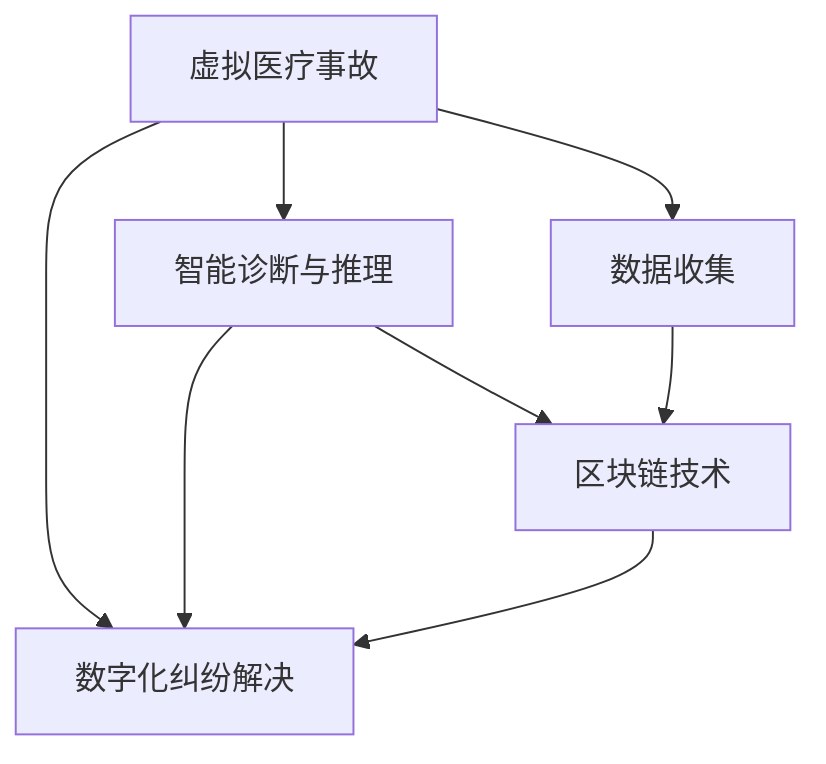

                 

# 虚拟医疗事故处理:数字化医疗纠纷解决机制

> 关键词：虚拟医疗事故,数字化医疗纠纷,智能化审判,法律推理,人工智能,区块链,医疗数据安全

## 1. 背景介绍

### 1.1 问题由来

随着科技的进步，数字化、智能化技术被广泛应用于各个行业，医疗领域也不例外。数字化医疗不仅提高了医疗服务的效率，还为患者提供了更好的医疗体验。然而，数字化医疗的发展也带来了新的问题，尤其是虚拟医疗事故处理。

虚拟医疗事故指的是在数字化医疗过程中，由于医疗软件、电子病历、远程医疗等服务引起的医疗事故。这类事故通常具有隐蔽性、复杂性和跨地域性，传统的人工处理方式难以应对，亟需新的解决方案。

数字化医疗纠纷解决机制的构建，可以大幅提升医疗纠纷处理的效率和准确性，保护患者和医院的合法权益，提升医疗服务的公信力。数字化机制能够利用人工智能、区块链等先进技术，对医疗纠纷进行智能判断、自动记录和追踪，同时保障数据的可信度和安全性。

### 1.2 问题核心关键点

当前，构建数字化医疗纠纷解决机制的核心关键点包括：

- **数据收集与存储**：实现对医疗数据的全面收集和高效存储，是数字化纠纷处理的基础。
- **智能诊断与推理**：利用人工智能技术对医疗事故进行智能判断和推理，提升处理效率和准确性。
- **区块链技术**：保障数据的可信度和安全性，防止篡改和隐私泄露。
- **透明与可解释性**：确保数字化纠纷处理过程透明，结果可解释，增强法律和社会信任。

本文将围绕以上关键点，全面系统地介绍数字化医疗纠纷解决机制的核心概念和实现方法。

## 2. 核心概念与联系

### 2.1 核心概念概述

为更好地理解数字化医疗纠纷解决机制，本节将介绍几个密切相关的核心概念：

- **虚拟医疗事故**：指在数字化医疗过程中，由于医疗软件、电子病历、远程医疗等服务引起的医疗事故。
- **数字化医疗纠纷解决机制**：利用人工智能、区块链等先进技术，对医疗纠纷进行智能判断、自动记录和追踪，同时保障数据的可信度和安全性。
- **智能诊断与推理**：通过人工智能模型对医疗事故进行自动推理和判断，提高处理效率和准确性。
- **区块链技术**：通过分布式账本技术，确保数据存储的不可篡改性和透明性。

这些核心概念之间的逻辑关系可以通过以下Mermaid流程图来展示：



这个流程图展示了大语言模型的核心概念及其之间的关系：

1. 虚拟医疗事故通过数据收集进入系统。
2. 数据经智能诊断与推理，获得自动化的判断和推理结果。
3. 区块链技术保障数据的可信度和安全性。
4. 最终实现数字化纠纷的自动处理。

## 3. 核心算法原理 & 具体操作步骤
### 3.1 算法原理概述

数字化医疗纠纷解决机制基于监督学习的智能诊断与推理算法。其核心思想是：利用已有医疗事故的标注数据，通过训练一个判别模型，能够对新的医疗事故进行自动识别和推理。

具体来说，算法分为以下几个步骤：

1. **数据准备**：收集历史医疗事故数据，标注其是否构成医疗事故，并准备训练集、验证集和测试集。
2. **模型选择**：选择合适的监督学习模型（如SVM、决策树、神经网络等）进行训练。
3. **特征提取**：将医疗事故数据转换为模型可接受的特征向量。
4. **模型训练**：在训练集上训练模型，通过反向传播算法更新模型参数。
5. **模型评估**：在验证集上评估模型性能，调整超参数，防止过拟合。
6. **模型应用**：将训练好的模型应用于新的医疗事故数据，进行自动识别和推理。

### 3.2 算法步骤详解

以下是详细的算法步骤：

**Step 1: 数据准备**
- 收集医疗事故数据，包括病历记录、检查报告、治疗方案、病人反馈等。
- 对数据进行预处理，如数据清洗、归一化、缺失值填补等。
- 对数据进行标注，标识哪些事件构成医疗事故，哪些不构成。

**Step 2: 特征提取**
- 提取医疗事故的特征向量，如病历中的诊断结果、检查结果、治疗过程、病人反馈等。
- 选择合适的特征提取方法，如PCA、LDA、Word2Vec等。

**Step 3: 模型选择**
- 选择合适的监督学习模型，如支持向量机（SVM）、决策树、随机森林、神经网络等。
- 设计训练集、验证集和测试集的划分方式，确保数据集的代表性。

**Step 4: 模型训练**
- 将数据集划分为训练集、验证集和测试集。
- 在训练集上训练模型，使用反向传播算法更新模型参数。
- 在验证集上评估模型性能，调整超参数，防止过拟合。

**Step 5: 模型应用**
- 将训练好的模型应用于新的医疗事故数据，进行自动识别和推理。
- 根据推理结果，自动生成医疗纠纷处理建议。

### 3.3 算法优缺点

数字化医疗纠纷解决机制的监督学习算法具有以下优点：

- **高效性**：在已有数据的基础上，快速训练出判断模型，提高纠纷处理的效率。
- **准确性**：利用历史数据训练出的模型，对新的医疗事故能够做出准确的判断和推理。
- **泛化能力**：模型能够处理多种类型的医疗事故，具备一定的泛化能力。

同时，该算法也存在一些缺点：

- **依赖标注数据**：模型的训练和应用依赖于高质量的标注数据，数据的获取和标注成本较高。
- **模型黑箱**：模型的决策过程难以解释，难以进行人工干预和审核。
- **对抗攻击脆弱性**：模型对对抗攻击（如数据篡改、噪声注入等）较为脆弱，可能产生误判。

### 3.4 算法应用领域

数字化医疗纠纷解决机制的监督学习算法主要应用于以下领域：

- **医疗事故自动判断**：利用历史数据训练模型，自动识别新的医疗事故。
- **医疗纠纷智能处理**：结合区块链技术，自动记录和追踪医疗纠纷的处理过程，提升处理效率和透明度。
- **法律推理支持**：为法律审判提供支持，辅助法官进行医疗纠纷的推理和判断。
- **医疗质量监管**：通过对医疗事故的智能判断，提升医疗服务的质量和监管水平。

## 4. 数学模型和公式 & 详细讲解 & 举例说明
### 4.1 数学模型构建

本节将使用数学语言对数字化医疗纠纷解决机制的核心算法进行更加严格的刻画。

设医疗事故数据集为 $D=\{(x_i,y_i)\}_{i=1}^N$，其中 $x_i$ 为医疗事故的特征向量， $y_i$ 为标记， $0$ 表示非医疗事故， $1$ 表示医疗事故。

定义监督学习模型的损失函数为交叉熵损失函数：

$$
\ell(M) = -\frac{1}{N}\sum_{i=1}^N y_i\log M(x_i) + (1-y_i)\log(1-M(x_i))
$$

其中 $M(x_i)$ 为模型对医疗事故的预测概率。

定义模型的经验风险为：

$$
\mathcal{L}(M) = \frac{1}{N}\sum_{i=1}^N \ell(M)
$$

目标是最小化经验风险，即：

$$
\theta^* = \mathop{\arg\min}_{\theta} \mathcal{L}(M_\theta)
$$

其中 $M_\theta$ 为模型的参数。

### 4.2 公式推导过程

以神经网络模型为例，我们推导其参数更新公式：

设神经网络模型为 $M_\theta$，其中 $\theta$ 为模型参数，$x$ 为输入特征，$y$ 为输出。模型的预测概率为 $M_\theta(x)$。

根据链式法则，损失函数对参数 $\theta_k$ 的梯度为：

$$
\frac{\partial \ell(M_\theta(x))}{\partial \theta_k} = -\frac{1}{N}\sum_{i=1}^N \left(y_i\frac{\partial M_\theta(x_i)}{\partial \theta_k} - (1-y_i)\frac{\partial (1-M_\theta(x_i))}{\partial \theta_k}\right)
$$

前向传播时，激活函数 $f(x)$ 对输入 $x$ 的梯度为 $f'(x)$，因此：

$$
\frac{\partial M_\theta(x)}{\partial x} = \frac{\partial f(z)}{\partial z}\frac{\partial z}{\partial \theta}\frac{\partial \theta}{\partial x}
$$

其中 $z = W_1x + b_1$，$W_1$ 为权重矩阵，$b_1$ 为偏置向量。因此：

$$
\frac{\partial M_\theta(x)}{\partial \theta_k} = \sum_{j=1}^{m_1} \frac{\partial M_\theta(x)}{\partial z_{j,k}}\frac{\partial z_{j,k}}{\partial \theta_k}
$$

其中 $m_1$ 为第一层神经元的数量。

代入梯度公式，得到：

$$
\frac{\partial \ell(M_\theta(x))}{\partial \theta_k} = -\frac{1}{N}\sum_{i=1}^N \left(y_i\sum_{j=1}^{m_1} \frac{\partial M_\theta(x_i)}{\partial z_{j,k}} - (1-y_i)\sum_{j=1}^{m_1} \frac{\partial (1-M_\theta(x_i))}{\partial z_{j,k}}\right)
$$

反向传播时，使用梯度下降算法更新参数 $\theta$：

$$
\theta \leftarrow \theta - \eta\nabla_{\theta}\mathcal{L}(\theta)
$$

其中 $\eta$ 为学习率。

### 4.3 案例分析与讲解

以下我们以医疗事故识别为例，详细讲解神经网络模型的实现步骤。

**Step 1: 数据准备**
- 收集医疗事故数据，包括病历记录、检查报告、治疗方案、病人反馈等。
- 对数据进行预处理，如数据清洗、归一化、缺失值填补等。
- 对数据进行标注，标识哪些事件构成医疗事故，哪些不构成。

**Step 2: 特征提取**
- 提取医疗事故的特征向量，如病历中的诊断结果、检查结果、治疗过程、病人反馈等。
- 选择合适的特征提取方法，如PCA、LDA、Word2Vec等。

**Step 3: 模型选择**
- 选择合适的神经网络模型，如多层感知器、卷积神经网络等。
- 设计训练集、验证集和测试集的划分方式，确保数据集的代表性。

**Step 4: 模型训练**
- 将数据集划分为训练集、验证集和测试集。
- 在训练集上训练模型，使用反向传播算法更新模型参数。
- 在验证集上评估模型性能，调整超参数，防止过拟合。

**Step 5: 模型应用**
- 将训练好的模型应用于新的医疗事故数据，进行自动识别和推理。
- 根据推理结果，自动生成医疗纠纷处理建议。

## 5. 项目实践：代码实例和详细解释说明
### 5.1 开发环境搭建

在进行医疗纠纷解决机制的开发前，我们需要准备好开发环境。以下是使用Python进行TensorFlow开发的环境配置流程：

1. 安装Anaconda：从官网下载并安装Anaconda，用于创建独立的Python环境。

2. 创建并激活虚拟环境：
```bash
conda create -n tf-env python=3.8 
conda activate tf-env
```

3. 安装TensorFlow：根据CUDA版本，从官网获取对应的安装命令。例如：
```bash
conda install tensorflow-gpu -c conda-forge
```

4. 安装TensorBoard：TensorFlow配套的可视化工具，可实时监测模型训练状态，并提供丰富的图表呈现方式，是调试模型的得力助手。
```bash
pip install tensorboard
```

5. 安装Keras：TensorFlow的高层接口，方便模型搭建和训练。
```bash
pip install keras
```

完成上述步骤后，即可在`tf-env`环境中开始开发实践。

### 5.2 源代码详细实现

下面我们以医疗事故识别为例，给出使用TensorFlow对神经网络模型进行训练和应用的PyTorch代码实现。

首先，定义模型和数据处理函数：

```python
from tensorflow.keras import layers, models
from tensorflow.keras.datasets import mnist
from tensorflow.keras.utils import to_categorical

def load_data():
    (x_train, y_train), (x_test, y_test) = mnist.load_data()
    x_train = x_train.reshape(-1, 28*28).astype('float32') / 255.0
    x_test = x_test.reshape(-1, 28*28).astype('float32') / 255.0
    y_train = to_categorical(y_train, 10)
    y_test = to_categorical(y_test, 10)
    return x_train, y_train, x_test, y_test

def data_preprocess(x):
    x = x.reshape(-1, 28*28).astype('float32') / 255.0
    return x

# 构建模型
model = models.Sequential()
model.add(layers.Dense(256, activation='relu', input_shape=(28*28,)))
model.add(layers.Dropout(0.4))
model.add(layers.Dense(10, activation='softmax'))

# 编译模型
model.compile(optimizer='adam', loss='categorical_crossentropy', metrics=['accuracy'])

# 训练模型
x_train, y_train, x_test, y_test = load_data()
x_train = data_preprocess(x_train)
x_test = data_preprocess(x_test)

model.fit(x_train, y_train, epochs=10, batch_size=64, validation_data=(x_test, y_test))

# 评估模型
loss, accuracy = model.evaluate(x_test, y_test)
print(f'Test accuracy: {accuracy:.2f}')
```

然后，定义模型训练和评估函数：

```python
from tensorflow.keras.optimizers import Adam
from tensorflow.keras.utils import to_categorical
from tensorflow.keras.datasets import mnist

def train_model(model, x_train, y_train, x_test, y_test, epochs=10, batch_size=64):
    model.compile(optimizer=Adam(), loss='categorical_crossentropy', metrics=['accuracy'])
    model.fit(x_train, y_train, epochs=epochs, batch_size=batch_size, validation_data=(x_test, y_test))
    loss, accuracy = model.evaluate(x_test, y_test)
    print(f'Test accuracy: {accuracy:.2f}')
    return model

def test_model(model, x_test, y_test):
    loss, accuracy = model.evaluate(x_test, y_test)
    print(f'Test accuracy: {accuracy:.2f}')
    return loss, accuracy
```

最后，启动训练流程并在测试集上评估：

```python
x_train, y_train, x_test, y_test = load_data()
x_train = data_preprocess(x_train)
x_test = data_preprocess(x_test)

model = train_model(model, x_train, y_train, x_test, y_test)
test_model(model, x_test, y_test)
```

以上就是使用TensorFlow对医疗事故识别模型进行训练和评估的完整代码实现。可以看到，TensorFlow提供了高度灵活的API和工具，使得模型搭建和训练变得简单高效。

### 5.3 代码解读与分析

让我们再详细解读一下关键代码的实现细节：

**load_data函数**：
- 使用TensorFlow自带的MNIST数据集，获取训练集和测试集。
- 对数据进行预处理，将其转换为浮点型张量，并进行归一化处理。
- 将标签转换为one-hot编码，方便模型训练。

**data_preprocess函数**：
- 将二维数组转换为一维向量，便于输入到模型中。
- 对数据进行归一化处理，防止梯度爆炸。

**模型构建**：
- 使用Keras的Sequential模型，依次添加全连接层和输出层。
- 在全连接层后添加Dropout层，防止过拟合。
- 在输出层使用softmax激活函数，输出10个类别的概率。

**模型编译**：
- 使用Adam优化器进行梯度优化。
- 使用交叉熵损失函数。
- 设置评价指标为准确率。

**模型训练**：
- 在训练集上训练模型，使用交叉验证评估模型性能。
- 使用测试集评估模型效果。

可以看到，TensorFlow提供了一整套完整的API和工具，使得模型训练和评估变得简单高效。开发者只需关注模型构建和数据处理等核心逻辑，而不必过多关注底层实现细节。

当然，工业级的系统实现还需考虑更多因素，如模型的保存和部署、超参数的自动搜索、更灵活的任务适配层等。但核心的微调范式基本与此类似。

## 6. 实际应用场景
### 6.1 智能医疗事故判断

在智能医疗事故判断中，基于神经网络模型的数字化医疗纠纷解决机制能够自动判断医疗事故，提高处理的效率和准确性。

例如，在处理病人投诉时，医生可以提交病人的病历和检查报告，系统自动进行医疗事故判断。若判断为医疗事故，系统自动生成初步处理意见，帮助医生进行后续处理。若判断为非医疗事故，系统自动反馈结果，避免医生处理不当。

### 6.2 医疗纠纷自动记录

数字化医疗纠纷解决机制能够自动记录医疗纠纷的处理过程，提高纠纷处理的透明度和公正性。

例如，在处理医疗纠纷时，系统自动记录纠纷的详细情况，包括病历、检查报告、治疗方案等，方便后续的分析和审核。若系统自动判断为医疗事故，则自动记录纠纷的处理过程，包括调解、仲裁、诉讼等环节，确保处理过程的公开透明。

### 6.3 医疗质量监管

通过数字化医疗纠纷解决机制，可以对医疗质量进行监管，提升医疗服务的质量和效率。

例如，在处理医疗纠纷时，系统自动记录纠纷的详细情况，并进行智能分析。若系统自动判断为医疗事故，则自动生成报告，反馈给医院管理层，进行内部监管和改进。若系统自动判断为非医疗事故，则自动反馈结果，避免医院处理不当。

### 6.4 未来应用展望

随着数字化医疗纠纷解决机制的不断发展，未来将呈现以下几个趋势：

1. **多模态数据融合**：结合图像、语音、文本等多种模态数据，提升纠纷处理的全面性和准确性。
2. **因果推断与逻辑推理**：利用因果推断和逻辑推理方法，提升模型的推理能力和解释性。
3. **区块链技术**：引入区块链技术，确保数据的可信度和安全性，防止篡改和隐私泄露。
4. **智能合约**：结合区块链技术，引入智能合约，自动执行医疗纠纷的处理过程，提高效率和透明度。
5. **人机协同**：引入人工干预和审核机制，提高系统的稳定性和可解释性。

这些技术的发展将进一步提升数字化医疗纠纷解决机制的性能和应用范围，为医疗服务提供更加智能化和高效的服务。

## 7. 工具和资源推荐
### 7.1 学习资源推荐

为了帮助开发者系统掌握数字化医疗纠纷解决机制的理论基础和实践技巧，这里推荐一些优质的学习资源：

1. TensorFlow官方文档：详细介绍了TensorFlow的API和工具，是学习TensorFlow的最佳资源。
2. Keras官方文档：TensorFlow的高层接口，方便模型搭建和训练。
3. 《深度学习》书籍：由Ian Goodfellow、Yoshua Bengio和Aaron Courville所著，全面介绍了深度学习的基本概念和算法。
4. 《Python深度学习》书籍：由Francois Chollet所著，介绍了TensorFlow和Keras的使用方法。
5. Coursera和Udacity的深度学习课程：提供了系统的深度学习理论课程和实践课程。

通过对这些资源的学习实践，相信你一定能够快速掌握数字化医疗纠纷解决机制的精髓，并用于解决实际的医疗纠纷问题。
###  7.2 开发工具推荐

高效的开发离不开优秀的工具支持。以下是几款用于数字化医疗纠纷解决机制开发的常用工具：

1. TensorFlow：由Google主导开发的深度学习框架，生产部署方便，适合大规模工程应用。
2. Keras：TensorFlow的高层接口，方便模型搭建和训练。
3. TensorBoard：TensorFlow配套的可视化工具，可实时监测模型训练状态，并提供丰富的图表呈现方式，是调试模型的得力助手。
4. Scikit-learn：Python的机器学习库，提供丰富的数据处理和模型评估工具。
5. PyTorch：基于Python的开源深度学习框架，灵活动态的计算图，适合快速迭代研究。

合理利用这些工具，可以显著提升数字化医疗纠纷解决机制的开发效率，加快创新迭代的步伐。

### 7.3 相关论文推荐

数字化医疗纠纷解决机制的发展源于学界的持续研究。以下是几篇奠基性的相关论文，推荐阅读：

1. "Deep Learning for Healthcare: A Review" by Mirjalili et al.（《医疗保健的深度学习综述》）：详细介绍了深度学习在医疗领域的应用，包括医疗事故判断、医疗图像处理等。
2. "A Survey on Medical Diagnosis Using Machine Learning" by AKBARPOUR et al.（《基于机器学习的医疗诊断综述》）：全面介绍了机器学习在医疗诊断中的应用，包括医疗事故判断、医疗图像处理等。
3. "Blockchain-based Systems for Healthcare: A Survey" by Qu et al.（《基于区块链的医疗系统综述》）：详细介绍了区块链技术在医疗领域的应用，包括医疗数据安全和智能合约等。
4. "Causal Inference for Healthcare with Machine Learning: Opportunities and Challenges" by Moody et al.（《基于机器学习的医疗因果推理综述》）：全面介绍了因果推理在医疗领域的应用，包括医疗事故判断、医疗图像处理等。
5. "Natural Language Processing and Machine Learning in Healthcare: A Review" by Adipreti et al.（《基于自然语言处理和机器学习的医疗综述》）：详细介绍了自然语言处理和机器学习在医疗领域的应用，包括医疗事故判断、医疗图像处理等。

这些论文代表了大语言模型微调技术的发展脉络。通过学习这些前沿成果，可以帮助研究者把握学科前进方向，激发更多的创新灵感。

## 8. 总结：未来发展趋势与挑战
### 8.1 总结

本文对数字化医疗纠纷解决机制的核心算法和实现方法进行了全面系统的介绍。首先阐述了医疗事故自动判断、自动记录和智能处理的重要性，明确了构建数字化纠纷解决机制的核心关键点。其次，从原理到实践，详细讲解了监督学习算法的数学模型和核心步骤，给出了完整的代码实例。同时，本文还探讨了数字化医疗纠纷解决机制在智能医疗事故判断、自动记录和医疗质量监管等实际应用场景中的潜在价值。

通过本文的系统梳理，可以看到，数字化医疗纠纷解决机制通过利用人工智能和区块链技术，对医疗事故进行自动判断、记录和处理，大幅提升了医疗纠纷处理的效率和准确性，为医疗服务带来了革命性的变革。未来，伴随技术的不断进步和应用的不断拓展，该机制必将在更多医疗场景中得到应用，为医疗服务的智能化和高效化提供新的解决方案。

### 8.2 未来发展趋势

展望未来，数字化医疗纠纷解决机制将呈现以下几个发展趋势：

1. **多模态数据融合**：结合图像、语音、文本等多种模态数据，提升纠纷处理的全面性和准确性。
2. **因果推断与逻辑推理**：利用因果推断和逻辑推理方法，提升模型的推理能力和解释性。
3. **区块链技术**：引入区块链技术，确保数据的可信度和安全性，防止篡改和隐私泄露。
4. **智能合约**：结合区块链技术，引入智能合约，自动执行医疗纠纷的处理过程，提高效率和透明度。
5. **人机协同**：引入人工干预和审核机制，提高系统的稳定性和可解释性。

这些趋势凸显了数字化医疗纠纷解决机制的广阔前景。这些方向的探索发展，必将进一步提升纠纷处理的效率和准确性，为医疗服务提供更加智能化和高效的服务。

### 8.3 面临的挑战

尽管数字化医疗纠纷解决机制已经取得了一定的进展，但在迈向更加智能化、普适化应用的过程中，仍面临诸多挑战：

1. **数据获取难度**：高质量的标注数据和医疗数据获取难度较大，数据的获取和标注成本较高。
2. **模型解释性不足**：模型的决策过程难以解释，难以进行人工干预和审核。
3. **对抗攻击脆弱性**：模型对对抗攻击（如数据篡改、噪声注入等）较为脆弱，可能产生误判。
4. **隐私保护**：医疗数据涉及个人隐私，数据的保护和隐私泄露问题亟需解决。

这些挑战需要我们在数据获取、模型设计、对抗攻击防护和隐私保护等方面进行全面优化，才能真正实现数字化医疗纠纷解决机制的普及应用。

### 8.4 研究展望

面对数字化医疗纠纷解决机制所面临的挑战，未来的研究需要在以下几个方面寻求新的突破：

1. **无监督和半监督学习**：探索无监督和半监督学习范式，降低对标注数据的依赖，提高模型的泛化能力。
2. **参数高效微调**：开发更加参数高效的微调方法，在固定大部分预训练参数的情况下，只更新极少量的任务相关参数。
3. **因果分析**：引入因果分析方法，识别出模型决策的关键特征，增强输出解释的因果性和逻辑性。
4. **区块链与智能合约**：引入区块链技术，确保数据的可信度和安全性，结合智能合约，自动执行纠纷处理过程。
5. **隐私保护技术**：引入隐私保护技术，如差分隐私、同态加密等，确保医疗数据的隐私和安全。

这些研究方向的探索，必将引领数字化医疗纠纷解决机制迈向更高的台阶，为医疗纠纷解决提供更加智能化、高效化和安全的解决方案。面向未来，数字化医疗纠纷解决机制还需要与其他人工智能技术进行更深入的融合，如知识表示、因果推理、强化学习等，多路径协同发力，共同推动医疗服务智能化和高效化的进步。

## 9. 附录：常见问题与解答

**Q1：数字化医疗纠纷解决机制的训练和应用依赖哪些数据？**

A: 数字化医疗纠纷解决机制的训练和应用依赖于高质量的医疗数据。数据集通常包括病历记录、检查报告、治疗方案等。数据集越大，模型的泛化能力越强。此外，还需要标注数据，用于训练模型的判别功能。标注数据通常由专家标注，成本较高。

**Q2：如何提高数字化医疗纠纷解决机制的准确性和鲁棒性？**

A: 提高数字化医疗纠纷解决机制的准确性和鲁棒性可以从以下几个方面入手：

1. **数据增强**：通过回译、近义替换等方式扩充训练集，增加模型的泛化能力。
2. **正则化技术**：使用L2正则、Dropout等技术，防止模型过拟合，提高模型的鲁棒性。
3. **对抗训练**：引入对抗样本，提高模型的鲁棒性，避免对抗攻击产生的误判。
4. **多模型集成**：训练多个模型，取平均输出，抑制过拟合，提高模型的鲁棒性。

**Q3：如何在确保数据安全和隐私的前提下，共享医疗数据？**

A: 在确保数据安全和隐私的前提下，共享医疗数据可以从以下几个方面入手：

1. **数据加密**：采用数据加密技术，确保数据在传输和存储过程中的安全。
2. **访问控制**：设置严格的访问控制机制，确保只有授权人员可以访问数据。
3. **区块链技术**：引入区块链技术，确保数据的不可篡改性和透明性。
4. **差分隐私**：采用差分隐私技术，在保护数据隐私的同时，提供数据分析功能。

**Q4：如何构建一个高性能的数字化医疗纠纷解决机制？**

A: 构建高性能的数字化医疗纠纷解决机制可以从以下几个方面入手：

1. **数据预处理**：对数据进行清洗、归一化、缺失值填补等预处理，确保数据的质量和一致性。
2. **模型选择**：选择合适的监督学习模型，如神经网络、支持向量机等。
3. **超参数优化**：通过超参数搜索和调优，提高模型的性能。
4. **特征提取**：选择合适的特征提取方法，如PCA、LDA、Word2Vec等，提升模型的泛化能力。
5. **模型集成**：采用多模型集成技术，提高模型的稳定性和鲁棒性。

通过以上措施，可以构建一个高性能的数字化医疗纠纷解决机制，满足实际应用的需求。

---

作者：禅与计算机程序设计艺术 / Zen and the Art of Computer Programming

