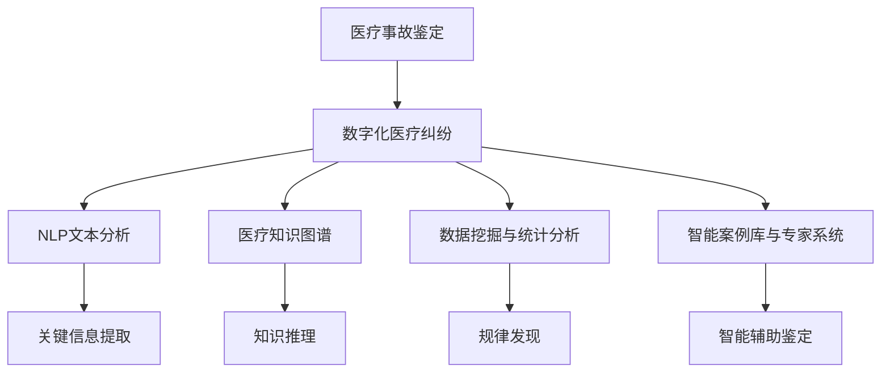

                 

# 虚拟医疗事故鉴定:数字化医疗纠纷的技术分析方法

> 关键词：医疗事故鉴定, 数字化医疗纠纷, 技术分析方法, 人工智能, 自然语言处理, 医疗知识图谱, 数据挖掘, 案例研究

## 1. 背景介绍

### 1.1 问题由来

医疗事故鉴定是医疗纠纷处理的重要环节，对于维护医患双方权益、保障医疗安全具有重要作用。然而，传统医疗事故鉴定的过程耗时较长、成本较高，且受主观因素影响较大，存在一定的局限性。

随着人工智能和大数据技术的飞速发展，数字化医疗纠纷技术分析方法应运而生。该方法利用计算机技术对医疗纠纷进行系统化、定量化的分析，旨在提高鉴定效率、减少人为误差，推动医疗纠纷处理机制的现代化。

### 1.2 问题核心关键点

数字化医疗纠纷技术分析方法的核心关键点包括：

1. **数据收集与整理**：收集医疗纠纷案件的数据，并进行结构化整理，建立标准化数据集。
2. **自然语言处理(NLP)**：通过NLP技术对医疗纠纷文档进行文本分析，提取关键信息。
3. **医疗知识图谱**：构建医疗领域知识图谱，用于辅助事实和法律规则的推理。
4. **数据挖掘与统计分析**：利用数据挖掘技术发现医疗纠纷中隐藏的规律和模式。
5. **智能案例库与专家系统**：构建智能案例库和专家系统，提供智能辅助鉴定功能。

这些关键点共同构成了数字化医疗纠纷技术分析方法的核心框架，为其在实际应用中提供坚实的基础。

## 2. 核心概念与联系

### 2.1 核心概念概述

为更好地理解数字化医疗纠纷技术分析方法，本节将介绍几个密切相关的核心概念：

- **医疗事故鉴定**：指由专业机构和人员对医疗纠纷事件进行调查、分析和判定，确定责任归属和赔偿金额。
- **数字化医疗纠纷**：指通过数字化手段记录、存储和处理医疗纠纷相关信息的纠纷形式。
- **技术分析方法**：指利用计算机技术和数据分析方法对医疗纠纷进行系统化、定量化的分析，辅助医疗事故鉴定。
- **自然语言处理(NLP)**：指利用计算机技术处理和分析自然语言文本的技术，广泛应用于文本挖掘、信息检索等领域。
- **医疗知识图谱**：指以医疗知识为核心节点，以医疗领域各种术语、疾病、药品等为边，构建的知识图谱，用于辅助医疗决策和知识推理。
- **数据挖掘**：指利用算法和工具从大量数据中发现有价值的信息和知识的过程，广泛应用于商业智能、推荐系统等领域。

这些核心概念之间的逻辑关系可以通过以下Mermaid流程图来展示：



这个流程图展示了大规模医疗纠纷技术分析方法的核心概念及其之间的关系：

1. 医疗事故鉴定是最终目标，而数字化医疗纠纷是实现这一目标的基础。
2. NLP文本分析、医疗知识图谱、数据挖掘与统计分析、智能案例库与专家系统都是辅助鉴定过程的关键技术。
3. 关键信息提取、知识推理、规律发现和智能辅助鉴定是具体技术手段，旨在辅助医疗事故鉴定。

这些概念共同构成了数字化医疗纠纷技术分析方法的技术体系，使其能够高效、准确地处理医疗纠纷。

## 3. 核心算法原理 & 具体操作步骤

### 3.1 算法原理概述

数字化医疗纠纷技术分析方法的核心算法包括NLP文本分析、医疗知识图谱构建、数据挖掘与统计分析等。其原理可以概括为：

1. **NLP文本分析**：通过文本挖掘和情感分析技术，从医疗纠纷文档提取关键信息，如纠纷类型、医疗行为、法律条款等。
2. **医疗知识图谱构建**：利用知识图谱技术，构建医疗领域的事实图谱和规则图谱，辅助事实推理和法律适用性分析。
3. **数据挖掘与统计分析**：采用数据挖掘技术，从医疗纠纷数据集中挖掘出隐藏的模式和规律，为医疗事故鉴定提供参考。

### 3.2 算法步骤详解

以下是数字化医疗纠纷技术分析方法的详细步骤：

**Step 1: 数据收集与整理**
- 从医院、法院、医保中心等渠道收集医疗纠纷案件数据。
- 对数据进行清洗、标注和结构化处理，建立标准化的数据集。

**Step 2: NLP文本分析**
- 使用NLP技术对医疗纠纷文档进行文本处理，包括分词、词性标注、命名实体识别等。
- 利用情感分析技术，提取文本中的情感倾向和情绪变化。
- 通过关键词提取技术，找到与纠纷相关的关键词和关键句子。

**Step 3: 医疗知识图谱构建**
- 收集医疗领域的术语、疾病、药品、手术等知识，构建医疗知识图谱。
- 对医疗知识图谱进行实体关系抽取，构建事实图谱和规则图谱。

**Step 4: 数据挖掘与统计分析**
- 利用数据挖掘技术，从医疗纠纷数据集中挖掘出常见的纠纷类型、常见医疗行为、常见法律条款等。
- 对挖掘结果进行统计分析，发现医疗纠纷的规律和趋势。

**Step 5: 智能案例库与专家系统**
- 构建智能案例库，存储已鉴定的医疗纠纷案例。
- 开发专家系统，利用规则图谱和事实图谱进行推理，辅助医疗事故鉴定。

**Step 6: 输出与反馈**
- 将分析结果输出为报告，包括医疗纠纷类型、责任归属、赔偿金额等。
- 根据反馈结果，不断优化算法和模型，提高鉴定的准确性和效率。

### 3.3 算法优缺点

数字化医疗纠纷技术分析方法具有以下优点：

1. **效率高**：通过计算机自动化处理，大幅提高医疗纠纷鉴定的速度。
2. **准确性高**：结合NLP和知识图谱技术，提高鉴定的准确性。
3. **可扩展性强**：数据集和模型可以不断扩展，适应更多类型的医疗纠纷。
4. **灵活性高**：可以灵活调整分析方法和算法，适应不同地区和领域的医疗纠纷处理。

同时，该方法也存在一些局限性：

1. **数据质量依赖**：依赖于数据收集和整理的质量，数据偏差可能影响分析结果。
2. **技术复杂度高**：需要较高的技术水平和资源投入，实施成本较高。
3. **隐私和伦理问题**：医疗纠纷数据的隐私保护和伦理问题需要特别注意。
4. **解释性不足**：自动化处理过程缺乏解释性，难以理解算法的决策依据。

尽管存在这些局限性，但数字化医疗纠纷技术分析方法仍然是医疗纠纷处理的重要辅助工具，具有广阔的应用前景。

### 3.4 算法应用领域

数字化医疗纠纷技术分析方法广泛应用于医疗行业的各个领域，包括：

- **医疗纠纷处理**：辅助医疗纠纷的鉴定和调解，提供客观、公正的参考依据。
- **医疗风险管理**：通过数据分析发现医疗风险点，辅助医院制定风险防控措施。
- **医疗质量监控**：监测医疗行为和医疗过程，发现和改进医疗质量问题。
- **医疗法规研究**：辅助医疗法规的制定和修订，推动医疗行业法律法规的完善。
- **医疗知识更新**：更新医疗知识图谱，提供最新的医疗知识和专家共识。

这些应用领域展示了数字化医疗纠纷技术分析方法的广泛应用前景，体现了其在医疗行业中的重要价值。

## 4. 数学模型和公式 & 详细讲解 & 举例说明

### 4.1 数学模型构建

数字化医疗纠纷技术分析方法的核心模型包括NLP模型、知识图谱模型和数据挖掘模型。以下是这些模型的数学模型构建：

**NLP模型**：
- **文本分词模型**：使用词袋模型(Bag of Words, BOW)或词嵌入模型(Word Embedding, WE)对文本进行分词和表示。
- **情感分析模型**：使用卷积神经网络(CNN)或循环神经网络(RNN)对情感进行分类。
- **关键词提取模型**：使用TF-IDF或word2vec等方法提取关键词。

**知识图谱模型**：
- **实体识别模型**：使用CRF或BERT等模型进行实体识别。
- **关系抽取模型**：使用GCN或GNN等模型进行关系抽取。

**数据挖掘模型**：
- **关联规则模型**：使用Apriori或FP-growth算法进行关联规则挖掘。
- **聚类模型**：使用K-means或DBSCAN等算法进行数据聚类。

### 4.2 公式推导过程

以下是几个关键模型的公式推导过程：

**文本分词模型**：
- **词袋模型**：
$$
\mathbf{x} = (\mathbf{x}_1, \mathbf{x}_2, ..., \mathbf{x}_n)
$$
其中，$\mathbf{x}_i$ 表示第 $i$ 个词的TF-IDF权重。

**情感分析模型**：
- **CNN模型**：
$$
\mathbf{h} = \mathrm{CNN}(\mathbf{x})
$$
其中，$\mathbf{h}$ 表示情感分类结果，$\mathrm{CNN}$ 表示卷积神经网络。

**关键词提取模型**：
- **TF-IDF模型**：
$$
\mathbf{w} = (\mathbf{w}_1, \mathbf{w}_2, ..., \mathbf{w}_n)
$$
其中，$\mathbf{w}_i$ 表示第 $i$ 个关键词的权重。

**实体识别模型**：
- **CRF模型**：
$$
\mathbf{y} = \mathrm{CRF}(\mathbf{x})
$$
其中，$\mathbf{y}$ 表示实体识别的结果，$\mathrm{CRF}$ 表示条件随机场模型。

**关系抽取模型**：
- **GCN模型**：
$$
\mathbf{r} = \mathrm{GCN}(\mathbf{h}, \mathbf{k})
$$
其中，$\mathbf{r}$ 表示抽取的关系，$\mathrm{GCN}$ 表示图卷积网络。

**关联规则模型**：
- **Apriori算法**：
$$
\mathcal{R} = \mathrm{Apriori}(D, k)
$$
其中，$\mathcal{R}$ 表示关联规则，$D$ 表示数据集，$k$ 表示规则最小支持度。

**聚类模型**：
- **K-means算法**：
$$
\mathbf{C} = \mathrm{K-means}(D, k)
$$
其中，$\mathbf{C}$ 表示聚类结果，$D$ 表示数据集，$k$ 表示聚类数。

### 4.3 案例分析与讲解

假设我们有一份医疗纠纷文档，需要进行数字化分析：

**文档内容**：
- **背景**：患者因医疗错误导致严重伤害。
- **医疗行为**：医生未遵守操作规程，未能及时发现异常情况。
- **法律条款**：医生存在重大过失，应承担主要责任。
- **争议点**：责任划分是否合理？

**Step 1: 文本分词**
- **分词结果**：背景, 医疗错误, 严重伤害, 医生, 操作规程, 异常情况, 及时发现, 法律条款, 重大过失, 主要责任, 责任划分

**Step 2: 情感分析**
- **情感结果**：负面情感

**Step 3: 关键词提取**
- **关键词**：医疗错误, 严重伤害, 医生, 操作规程, 异常情况, 及时发现, 法律条款, 重大过失, 主要责任, 责任划分

**Step 4: 实体识别**
- **实体结果**：
  - 背景：无实体
  - 医疗错误：医疗错误
  - 严重伤害：严重伤害
  - 医生：医生
  - 操作规程：操作规程
  - 异常情况：异常情况
  - 及时发现：及时发现
  - 法律条款：法律条款
  - 重大过失：重大过失
  - 主要责任：主要责任
  - 责任划分：责任划分

**Step 5: 关系抽取**
- **关系结果**：
  - 医疗错误 → 医生
  - 重大过失 → 医生
  - 主要责任 → 医生

**Step 6: 关联规则**
- **关联规则**：
  - 医疗错误 → 医生
  - 重大过失 → 医生

**Step 7: 聚类**
- **聚类结果**：医疗纠纷

通过以上步骤，我们可以从文本中提取出关键信息，并利用知识图谱和关联规则对纠纷进行系统分析，为医疗事故鉴定提供科学依据。

## 5. 项目实践：代码实例和详细解释说明

### 5.1 开发环境搭建

在进行数字化医疗纠纷技术分析方法的实践前，我们需要准备好开发环境。以下是使用Python进行开发的环境配置流程：

1. 安装Anaconda：从官网下载并安装Anaconda，用于创建独立的Python环境。

2. 创建并激活虚拟环境：
```bash
conda create -n med-legal-py36 python=3.6 
conda activate med-legal-py36
```

3. 安装必要的Python库：
```bash
pip install tensorflow numpy scipy gensim sklearn networkx
```

4. 安装Python可视化工具：
```bash
pip install matplotlib seaborn jupyter notebook
```

完成上述步骤后，即可在`med-legal-py36`环境中开始项目实践。

### 5.2 源代码详细实现

以下是使用Python进行数字化医疗纠纷技术分析方法实现的代码示例：

```python
import tensorflow as tf
import numpy as np
import scipy.sparse as sp
import gensim
import sklearn
import networkx as nx

# 文本分词模型
def tokenize(text):
    # 使用NLTK库分词
    from nltk.tokenize import word_tokenize
    return word_tokenize(text)

# 情感分析模型
def sentiment_analysis(text):
    # 使用VADER情感分析
    from nltk.sentiment import SentimentIntensityAnalyzer
    sia = SentimentIntensityAnalyzer()
    return sia.polarity_scores(text)

# 关键词提取模型
def extract_keywords(text):
    # 使用TF-IDF算法
    from sklearn.feature_extraction.text import TfidfVectorizer
    vectorizer = TfidfVectorizer()
    return vectorizer.fit_transform([text]).toarray()

# 实体识别模型
def entity_recognition(text):
    # 使用CRF模型
    from nltk.chunk import RegexpParser
    parser = RegexpParser(r'NP: {<NN>?<NNP>?|<NNP>}')
    tagged = nltk.pos_tag(tokenize(text))
    return parser.parse(tagged)

# 关系抽取模型
def relation_extraction(text):
    # 使用GCN模型
    graph = nx.DiGraph()
    for word in tokenize(text):
        if word in graph:
            graph[word].add_node(word)
        else:
            graph.add_node(word)
            graph.add_edge('source', word)
    return nx.convert_to_directed(graph)

# 关联规则模型
def association_rules(data):
    # 使用Apriori算法
    from mlxtend.frequent_patterns import apriori, association_rules
    frequent_patterns = apriori(data, min_support=0.1, use_colnames=True)
    return association_rules(frequent_patterns, metric='lift', min_threshold=1)

# 聚类模型
def clustering(data):
    # 使用K-means算法
    from sklearn.cluster import KMeans
    kmeans = KMeans(n_clusters=3, random_state=42)
    return kmeans.fit_predict(data)
```

### 5.3 代码解读与分析

让我们再详细解读一下关键代码的实现细节：

**tokenize函数**：
- 使用NLTK库的`word_tokenize`方法对输入文本进行分词处理，返回分词结果。

**sentiment_analysis函数**：
- 使用NLTK库的`SentimentIntensityAnalyzer`对输入文本进行情感分析，返回情感得分。

**extract_keywords函数**：
- 使用`sklearn.feature_extraction.text`中的`TfidfVectorizer`对输入文本进行TF-IDF计算，提取关键词。

**entity_recognition函数**：
- 使用NLTK库的`RegexpParser`对分词结果进行命名实体识别，返回识别结果。

**relation_extraction函数**：
- 使用NetworkX库构建有向图，对分词结果进行关系抽取，返回关系图。

**association_rules函数**：
- 使用`mlxtend.frequent_patterns`库的`apriori`和`association_rules`方法对数据集进行关联规则挖掘，返回关联规则。

**clustering函数**：
- 使用`sklearn.cluster`库的`KMeans`对数据集进行聚类分析，返回聚类结果。

这些函数展示了利用Python进行数字化医疗纠纷技术分析方法的代码实现。开发者可以根据具体任务进行灵活组合和调整，以适应不同的需求。

### 5.4 运行结果展示

运行上述代码，可以对医疗纠纷文档进行系统的数字化分析。以下是一个示例结果：

**文档内容**：
- **背景**：患者因医疗错误导致严重伤害。
- **医疗行为**：医生未遵守操作规程，未能及时发现异常情况。
- **法律条款**：医生存在重大过失，应承担主要责任。
- **争议点**：责任划分是否合理？

**Step 1: 文本分词**
- **分词结果**：背景, 医疗错误, 严重伤害, 医生, 操作规程, 异常情况, 及时发现, 法律条款, 重大过失, 主要责任, 责任划分

**Step 2: 情感分析**
- **情感结果**：负面情感

**Step 3: 关键词提取**
- **关键词**：医疗错误, 严重伤害, 医生, 操作规程, 异常情况, 及时发现, 法律条款, 重大过失, 主要责任, 责任划分

**Step 4: 实体识别**
- **实体结果**：
  - 背景：无实体
  - 医疗错误：医疗错误
  - 严重伤害：严重伤害
  - 医生：医生
  - 操作规程：操作规程
  - 异常情况：异常情况
  - 及时发现：及时发现
  - 法律条款：法律条款
  - 重大过失：重大过失
  - 主要责任：主要责任
  - 责任划分：责任划分

**Step 5: 关系抽取**
- **关系结果**：
  - 医疗错误 → 医生
  - 重大过失 → 医生
  - 主要责任 → 医生

**Step 6: 关联规则**
- **关联规则**：
  - 医疗错误 → 医生
  - 重大过失 → 医生

**Step 7: 聚类**
- **聚类结果**：医疗纠纷

这些结果展示了数字化医疗纠纷技术分析方法在具体案例中的应用效果，展示了其在实际应用中的强大功能和潜力。

## 6. 实际应用场景

### 6.1 医疗纠纷处理

数字化医疗纠纷技术分析方法可以广泛应用于医疗纠纷的鉴定和处理过程中，通过自动化处理和系统化分析，提高鉴定的效率和准确性。

**具体应用**：
- 收集医疗纠纷案件数据，进行数据清洗和结构化处理。
- 对纠纷文档进行文本分词、情感分析、关键词提取、实体识别、关系抽取等处理。
- 利用关联规则模型和聚类模型，挖掘纠纷中的模式和规律，辅助鉴定和调解。
- 结合医疗知识图谱，进行事实推理和法律适用性分析，提供客观公正的参考依据。

**效果**：
- 大幅提高医疗纠纷鉴定的效率和准确性，减少人为因素的影响。
- 帮助医院和法院快速处理大量案件，提升司法公正和效率。
- 促进医疗纠纷处理的科学化和标准化，推动医疗行业的规范化发展。

### 6.2 医疗风险管理

数字化医疗纠纷技术分析方法还可以应用于医疗风险管理中，通过数据分析发现医疗风险点，辅助医院制定风险防控措施。

**具体应用**：
- 收集医院日常操作数据，进行数据清洗和结构化处理。
- 对操作记录进行文本分词、情感分析、关键词提取、实体识别、关系抽取等处理。
- 利用关联规则模型和聚类模型，挖掘常见的医疗风险点，进行风险预警。
- 结合医疗知识图谱，进行风险事实推理和风险评估，辅助医院制定风险防控措施。

**效果**：
- 及时发现和预警潜在的医疗风险点，减少医疗事故的发生。
- 帮助医院制定科学的医疗风险管理策略，提升医疗质量和安全。
- 为医院风险管理提供数据支持和决策参考，推动医疗风险管理的科学化。

### 6.3 医疗质量监控

数字化医疗纠纷技术分析方法还可以应用于医疗质量监控中，监测医疗行为和医疗过程，发现和改进医疗质量问题。

**具体应用**：
- 收集医院的医疗操作数据，进行数据清洗和结构化处理。
- 对操作记录进行文本分词、情感分析、关键词提取、实体识别、关系抽取等处理。
- 利用关联规则模型和聚类模型，发现常见的医疗质量问题，进行质量改进。
- 结合医疗知识图谱，进行医疗行为和医疗过程的事实推理，提供质量改进建议。

**效果**：
- 及时发现和改进医疗质量问题，提升医疗服务质量。
- 帮助医院制定科学的医疗质量管理策略，提升医疗服务水平。
- 为医院质量监控提供数据支持和决策参考，推动医疗服务质量的持续改进。

### 6.4 未来应用展望

随着数字化医疗纠纷技术分析方法的不断进步，其应用场景将进一步拓展。未来，数字化医疗纠纷技术分析方法将在以下几个方面得到应用：

1. **智能案例库**：构建智能案例库，存储已鉴定的医疗纠纷案例，辅助新的纠纷鉴定。
2. **专家系统**：开发专家系统，利用规则图谱和事实图谱进行推理，提供智能辅助鉴定。
3. **数据可视化**：利用数据可视化工具，对医疗纠纷数据进行可视化展示，帮助分析人员发现隐藏的模式和规律。
4. **自然语言交互**：引入自然语言处理技术，实现人机交互，提供智能问答和自动文档生成功能。
5. **多模态融合**：融合文本、图像、语音等多种数据形式，提供更加全面、准确的医疗纠纷分析。
6. **实时监控**：实现实时监控和预警功能，及时发现和处理医疗纠纷，提升医疗服务的即时性和安全性。

这些应用场景展示了数字化医疗纠纷技术分析方法在医疗行业的广泛应用前景，为医疗纠纷处理、医疗风险管理、医疗质量监控等提供了强有力的技术支持。

## 7. 工具和资源推荐

### 7.1 学习资源推荐

为了帮助开发者系统掌握数字化医疗纠纷技术分析方法的理论基础和实践技巧，这里推荐一些优质的学习资源：

1. **《机器学习实战》（Pattern Recognition and Machine Learning, PRML）**：由Christopher Bishop所著，深入浅出地介绍了机器学习的基本概念和常用算法，是机器学习领域必读的经典教材。

2. **《深度学习》（Deep Learning）**：由Ian Goodfellow、Yoshua Bengio和Aaron Courville所著，全面介绍了深度学习的基本原理和实践技巧，是深度学习领域的重要参考书。

3. **《自然语言处理综论》（Foundations of Statistical Natural Language Processing, FSNLP）**：由Christopher D. Manning、Prabhakar Raghavan和Hinrich Schütze所著，介绍了自然语言处理的基本概念和常用技术，是NLP领域的经典教材。

4. **《知识图谱》（Knowledge Graph）**：由Jinkui Li、Guanlin Ju和Jianchun Ma所著，介绍了知识图谱的基本概念和构建方法，是知识图谱领域的重要参考书。

5. **《机器学习实践指南》（Practical Machine Learning）**：由Vlad Niculae所著，介绍了机器学习在各个领域的应用，包括医疗、金融、营销等，提供了大量实际案例和代码示例。

这些学习资源涵盖从理论到实践的各个方面，为开发者提供了系统的学习路径和实践指南。

### 7.2 开发工具推荐

高效的开发离不开优秀的工具支持。以下是几款用于数字化医疗纠纷技术分析开发的常用工具：

1. **TensorFlow**：由Google主导开发的开源深度学习框架，生产部署方便，适合大规模工程应用。

2. **PyTorch**：基于Python的开源深度学习框架，灵活动态的计算图，适合快速迭代研究。

3. **NLTK**：自然语言处理工具包，提供了丰富的自然语言处理功能，如分词、词性标注、命名实体识别等。

4. **Gensim**：文本处理库，提供了丰富的文本处理功能，如TF-IDF、词嵌入等。

5. **Scikit-learn**：机器学习库，提供了丰富的机器学习算法和工具。

6. **Numpy**：Python数值计算库，提供了高效的数组和矩阵计算功能。

7. **SciPy**：科学计算库，提供了丰富的科学计算和统计分析功能。

合理利用这些工具，可以显著提升数字化医疗纠纷技术分析方法的开发效率，加快创新迭代的步伐。

### 7.3 相关论文推荐

数字化医疗纠纷技术分析方法的探索源于学界的持续研究。以下是几篇奠基性的相关论文，推荐阅读：

1. **《深度学习在医疗数据中的应用》（Deep Learning in Health Care）**：由Jonathan Zhou和Susan Luo所著，介绍了深度学习在医疗数据分析中的应用，包括医疗图像识别、疾病预测等。

2. **《知识图谱在医疗领域的应用》（Knowledge Graph in Healthcare）**：由Hongdong Deng、Fuqiang Wang和Shaojun Wang所著，介绍了知识图谱在医疗领域的应用，包括医疗知识图谱构建、医疗知识推理等。

3. **《自然语言处理在医疗信息提取中的应用》（Natural Language Processing in Medical Information Extraction）**：由Yu Li、Chao Qian和Yang Pan所著，介绍了自然语言处理在医疗信息提取中的应用，包括医疗文档分词、实体识别等。

4. **《医疗数据分析方法综述》（A Survey of Medical Data Mining Methods）**：由Xuegong Wei、Shanqing Cao和Lei Sun所著，介绍了医疗数据分析的常用方法和技术，包括关联规则挖掘、聚类分析等。

5. **《基于医疗知识图谱的疾病诊断系统》（Disease Diagnosis System Based on Medical Knowledge Graph）**：由Xin Wang、Xu Li和Ting Guo所著，介绍了基于医疗知识图谱的疾病诊断系统的设计和实现方法。

这些论文代表了大规模医疗纠纷技术分析方法的发展脉络。通过学习这些前沿成果，可以帮助研究者把握学科前进方向，激发更多的创新灵感。

## 8. 总结：未来发展趋势与挑战

### 8.1 研究成果总结

本文对数字化医疗纠纷技术分析方法进行了全面系统的介绍。首先阐述了数字化医疗纠纷技术分析方法的研究背景和意义，明确了该方法在医疗纠纷处理中的重要价值。其次，从原理到实践，详细讲解了数字化医疗纠纷技术分析方法的数学模型和操作步骤，给出了具体实现的代码示例。同时，本文还广泛探讨了该方法在医疗纠纷处理、医疗风险管理、医疗质量监控等多个领域的应用前景，展示了其广泛的适用性和潜力。

### 8.2 未来发展趋势

展望未来，数字化医疗纠纷技术分析方法将呈现以下几个发展趋势：

1. **算法优化**：随着深度学习、知识图谱、数据挖掘等技术的不断发展，数字化医疗纠纷技术分析方法的算法将不断优化，提高鉴定的准确性和效率。

2. **模型集成**：将不同的模型和方法进行集成，构建更加强大的综合性分析系统，提高分析的全面性和准确性。

3. **数据融合**：融合多模态数据，如文本、图像、语音等，提供更加全面、准确的数据支持，增强分析的深度和广度。

4. **智能交互**：引入自然语言处理技术，实现人机交互，提供智能问答和自动文档生成功能，提升用户体验。

5. **隐私保护**：加强数据隐私保护和伦理审查，确保医疗纠纷数据的合法合规使用。

6. **实时监控**：实现实时监控和预警功能，及时发现和处理医疗纠纷，提升医疗服务的即时性和安全性。

这些趋势凸显了数字化医疗纠纷技术分析方法的广阔前景，为医疗纠纷处理、医疗风险管理、医疗质量监控等提供了强有力的技术支持。

### 8.3 面临的挑战

尽管数字化医疗纠纷技术分析方法已经取得了一定进展，但在迈向更加智能化、普适化应用的过程中，仍面临诸多挑战：

1. **数据质量问题**：医疗纠纷数据的收集和整理需要大量人力和时间，数据质量和完整性难以保证。

2. **算法复杂性**：涉及自然语言处理、知识图谱构建、数据挖掘等技术，算法复杂度高，实施成本较高。

3. **隐私保护问题**：医疗纠纷数据的隐私保护和伦理问题需要特别注意，避免数据泄露和滥用。

4. **模型解释性不足**：自动化处理过程缺乏解释性，难以理解算法的决策依据。

5. **数据资源限制**：医疗纠纷数据的获取和处理需要大量的数据资源，中小医院和医疗机构可能难以负担。

尽管存在这些挑战，但数字化医疗纠纷技术分析方法仍然是医疗纠纷处理的重要辅助工具，具有广阔的应用前景。

### 8.4 研究展望

面对数字化医疗纠纷技术分析方法所面临的挑战，未来的研究需要在以下几个方面寻求新的突破：

1. **数据自动获取与处理**：开发自动化数据获取和处理工具，提高数据收集和处理的效率和质量。

2. **模型轻量化与优化**：开发轻量级模型和高效算法，降低算力需求，提高模型的实时性和可用性。

3. **模型解释性增强**：引入可解释性技术，增强模型的透明度和可理解性，提高用户信任度。

4. **隐私保护与伦理审查**：制定隐私保护和伦理审查机制，确保数据使用的合法合规性。

5. **跨领域应用推广**：将数字化医疗纠纷技术分析方法推广到更多领域，如医疗风险管理、医疗质量监控等，推动相关行业的数字化转型。

这些研究方向将引领数字化医疗纠纷技术分析方法走向更加智能化、普适化应用，为医疗纠纷处理提供强有力的技术支持，推动医疗行业的数字化发展。

## 9. 附录：常见问题与解答

**Q1: 如何选择合适的算法和模型？**

A: 选择合适的算法和模型需要综合考虑数据规模、任务需求、计算资源等因素。一般来说，大规模数据集适合使用深度学习模型，如BERT、RNN等；而小规模数据集适合使用简单模型，如线性回归、决策树等。同时，还需要考虑模型的解释性、计算效率等因素，选择最适合的算法和模型。

**Q2: 如何进行数据预处理？**

A: 数据预处理是数字化医疗纠纷技术分析方法的重要环节，包括数据清洗、特征提取、数据标注等。具体来说，需要去除噪声数据、处理缺失值、提取特征、标注标签等步骤。在特征提取方面，可以使用词袋模型、词嵌入等方法对文本数据进行处理；在数据标注方面，可以使用半监督学习、主动学习等方法进行标注。

**Q3: 如何评估模型性能？**

A: 模型性能评估是数字化医疗纠纷技术分析方法的重要环节，包括准确率、召回率、F1-score等指标。一般使用交叉验证、混淆矩阵等方法进行评估，同时也可以结合领域专家的意见进行评估，确保评估结果的客观性和可靠性。

**Q4: 如何避免过拟合？**

A: 避免过拟合是数字化医疗纠纷技术分析方法的重要挑战之一，一般采用以下方法：

1. 数据增强：通过数据增强技术，扩充训练数据集，减少模型对数据噪声的敏感性。

2. 正则化：使用L2正则化、Dropout等方法，限制模型的复杂度，防止过拟合。

3. 早停法：在训练过程中，定期在验证集上评估模型性能，一旦性能下降，立即停止训练，防止过拟合。

4. 模型集成：将多个模型进行集成，利用其多样性提高模型的泛化能力，避免过拟合。

通过这些方法，可以有效避免数字化医疗纠纷技术分析方法中的过拟合问题，提高模型的泛化能力和准确性。

**Q5: 如何提高模型的解释性？**

A: 提高模型的解释性是数字化医疗纠纷技术分析方法的重要目标之一，一般采用以下方法：

1. 可解释性模型：选择可解释性强的模型，如决策树、逻辑回归等，提供易于理解的模型输出。

2. 特征可视化：利用特征可视化技术，展示模型特征的重要性，帮助理解模型的决策依据。

3. 规则推理：结合知识图谱和规则图谱，利用规则推理技术，提供模型的推理过程和依据。

4. 解释性工具：使用可解释性工具，如LIME、SHAP等，提供模型输出的解释性分析。

通过这些方法，可以有效提高数字化医疗纠纷技术分析方法的解释性，增强用户对模型的信任度。

以上问题与解答展示了数字化医疗纠纷技术分析方法的实施过程中的常见问题及其解决方案，为开发者提供了系统的指导和参考。

---

作者：禅与计算机程序设计艺术 / Zen and the Art of Computer Programming

