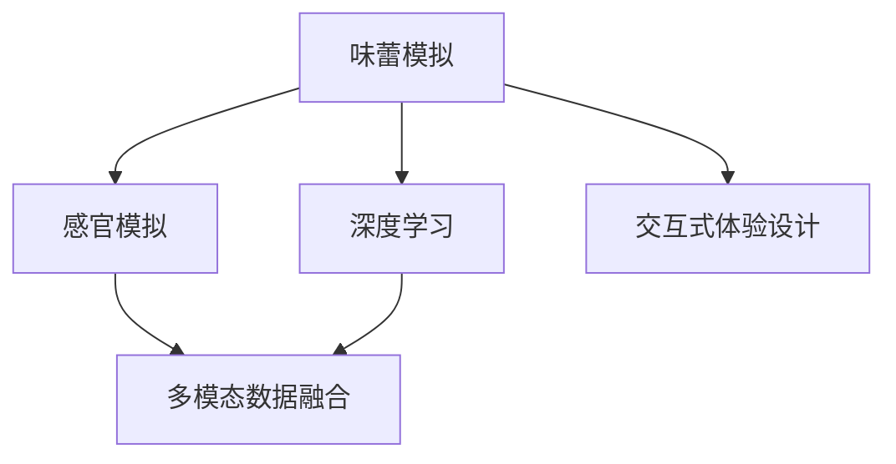

                 

# 虚拟味觉实验室：AI研发的味蕾体验

> 关键词：虚拟味觉，AI研发，味蕾体验，神经网络，感官模拟，深度学习，应用实例，未来展望

## 1. 背景介绍

### 1.1 问题由来
随着科技的飞速发展，人工智能(AI)技术已渗透到人类生活的方方面面。从视觉到听觉，从语音到触觉，AI正逐步赋予机器以更丰富的感官体验。相较于视觉、听觉和触觉，味觉的AI研发尚处于起步阶段，且受限于人类感官的多样性和复杂性，这一领域的研究更具挑战性。

### 1.2 问题核心关键点
味觉感知主要依赖于舌头上的味蕾，以及大脑对味觉信息的处理。目前，AI在味觉体验方面主要通过以下方法实现：
- **神经网络模拟**：通过深度学习模型，模拟舌头味蕾的神经响应，生成味觉感知。
- **感官模拟技术**：利用多模态数据融合，将味觉信息与其他感官信息结合，增强虚拟体验的逼真度。
- **交互式体验设计**：设计界面友好的交互式体验，让用户可以直观地感受虚拟味觉。

### 1.3 问题研究意义
研究AI对味觉的模拟和体验设计，有助于拓展人类的感官体验，推动虚拟现实(VR)和增强现实(AR)技术的创新，促进食品和饮料行业的个性化定制服务。通过AI，可以让虚拟味觉体验更加真实、丰富和可控，为未来的生活和工作带来更多可能性。

## 2. 核心概念与联系

### 2.1 核心概念概述

为更好地理解虚拟味觉技术，本节将介绍几个关键概念及其联系：

- **味蕾模拟**：利用神经网络模型，模拟舌头味蕾对不同味道的反应。通常通过卷积神经网络(CNN)或变分自编码器(VAE)等模型来实现。
- **感官模拟**：将味觉信息与其他感官（如视觉、听觉）数据融合，提升虚拟体验的完整性。
- **深度学习**：核心技术手段，通过多层神经网络对大量数据进行训练，学习复杂的味觉映射。
- **交互式体验设计**：通过图形界面、交互技术等手段，增强用户对虚拟味觉的感受和认知。
- **多模态数据融合**：将不同感官的数据结合，生成更加全面和逼真的感官体验。

这些概念之间的逻辑关系可以通过以下Mermaid流程图来展示：



这个流程图展示了味觉体验技术的主要步骤：

1. 味蕾模拟是基础，利用深度学习模型学习味蕾对味道的响应。
2. 感官模拟将味觉信息与其他感官数据结合，生成完整的感官体验。
3. 交互式体验设计提升用户的感受和认知。
4. 多模态数据融合使体验更加逼真和全面。

## 3. 核心算法原理 & 具体操作步骤
### 3.1 算法原理概述

虚拟味觉体验的实现，主要基于深度学习模型，通过模拟味蕾的神经响应来实现对不同味道的感知。其核心思想是：将味蕾的响应模式视为一种特定的信号模式，通过训练神经网络来识别和模拟这些模式。

### 3.2 算法步骤详解

**Step 1: 数据准备**
- 收集大量的味道描述数据，例如食物、饮料的成分信息。
- 使用高级味觉检测仪器，如电子舌，获取味蕾对不同味道的响应数据。
- 将味道描述转换为模型可处理的数值形式，如文本嵌入或图像特征。

**Step 2: 模型选择与训练**
- 选择合适的深度学习模型，如CNN、VAE等，用于模拟味蕾的响应。
- 使用准备好的味道描述数据进行模型训练，优化模型参数，使其能准确地预测味蕾对味道的响应。
- 在训练过程中，引入正则化技术，如L2正则、Dropout等，防止过拟合。

**Step 3: 多感官融合**
- 收集与味道相关的视觉、听觉数据，例如食物的外观、烹饪视频等。
- 使用数据融合技术，如多模态感知、视觉注意力机制等，将味觉与其他感官数据结合。
- 生成融合后的多感官数据，用于训练融合模型，提升虚拟体验的逼真度。

**Step 4: 交互式体验设计**
- 设计友好的用户界面，例如触摸屏、手势控制等，让用户能够直观地体验虚拟味觉。
- 在用户体验设计中，引入情感分析、反馈机制等，提升用户的参与感和沉浸感。

**Step 5: 模型测试与优化**
- 在实际应用场景中测试模型性能，收集用户反馈。
- 根据用户反馈，对模型进行迭代优化，不断提升体验质量。
- 引入强化学习等技术，动态调整模型参数，以更好地适应用户偏好。

### 3.3 算法优缺点

**优点**：
- 通过深度学习模型，能够实现对复杂味觉模式的自动学习，提升模拟精度。
- 多感官数据融合，使体验更加逼真和全面，增强用户的沉浸感。
- 交互式设计提升用户体验，使用户可以直观感受虚拟味觉。

**缺点**：
- 数据获取成本高，需要先进的味觉检测设备。
- 模型训练量大，计算资源需求高。
- 用户体验设计复杂，需要多学科团队协作。

### 3.4 算法应用领域

虚拟味觉技术在游戏、虚拟餐厅、食品与饮料推广、餐饮体验模拟等领域具有广阔的应用前景：

1. **游戏行业**：在游戏场景中模拟食物、饮料的味道，增强玩家沉浸感。
2. **虚拟餐厅**：通过VR技术，让用户能够在家中体验到餐厅的美食，提升餐饮体验。
3. **食品与饮料推广**：在电商平台上，通过虚拟味觉体验，让用户更加直观地了解产品的味道，提升购买决策。
4. **餐饮体验模拟**：用于培训厨师和餐饮服务人员，通过模拟不同的味道体验，提升餐饮质量和服务水平。

## 4. 数学模型和公式 & 详细讲解  
### 4.1 数学模型构建

虚拟味觉体验的核心数学模型主要基于神经网络。假设我们使用的是一个CNN模型，其输入为味道描述的文本嵌入，输出为味蕾的响应。模型的输入输出关系可以表示为：

$$
\text{Output} = \text{CNN}(\text{Input})
$$

其中，$\text{Input}$ 表示味道描述的文本嵌入，$\text{Output}$ 表示味蕾的响应。

### 4.2 公式推导过程

CNN模型的主要组成部分包括卷积层、池化层和全连接层。其中，卷积层和池化层主要用于提取输入数据的空间特征，全连接层用于将特征映射到输出空间。

对于一个简单的CNN模型，其基本结构可以表示为：

$$
\text{Output} = \sigma(\text{F} \ast \text{ConvPool}(\text{Input}))
$$

其中，$\text{ConvPool}$ 表示卷积和池化操作，$\text{F}$ 表示卷积核，$\text{Input}$ 表示输入数据，$\text{Output}$ 表示输出数据，$\sigma$ 表示激活函数（如ReLU）。

### 4.3 案例分析与讲解

以一个简单的文本分类任务为例，说明CNN模型在虚拟味觉体验中的应用：

假设我们有一个文本分类任务，输入为食物描述，输出为食品味道标签。我们首先通过嵌入层将文本转换为向量形式，然后将该向量输入到CNN模型中进行分类。

```python
import torch
import torch.nn as nn

class FlavorClassifier(nn.Module):
    def __init__(self, embedding_size, output_size, hidden_size):
        super(FlavorClassifier, self).__init__()
        self.embedding = nn.EmbeddingBag(1000, embedding_size)
        self.conv1 = nn.Conv2d(1, 32, (3, 3))
        self.pool = nn.MaxPool2d((2, 2))
        self.conv2 = nn.Conv2d(32, 64, (3, 3))
        self.fc = nn.Linear(64 * 4 * 4, output_size)
        self.relu = nn.ReLU()
        self.dropout = nn.Dropout(0.5)

    def forward(self, x):
        x = self.embedding(x)
        x = x.view(-1, 1, 100, 1)
        x = self.relu(self.conv1(x))
        x = self.pool(x)
        x = self.relu(self.conv2(x))
        x = self.pool(x)
        x = x.view(-1, 64 * 4 * 4)
        x = self.dropout(x)
        x = self.relu(self.fc(x))
        return x
```

在上述代码中，我们使用了一个包含两个卷积层的CNN模型。输入为文本嵌入，输出为味道标签。

## 5. 项目实践：代码实例和详细解释说明
### 5.1 开发环境搭建

在进行虚拟味觉体验的开发时，需要使用一些特定的Python库和工具：

1. **PyTorch**：深度学习框架，支持构建和训练深度学习模型。
2. **TensorFlow**：谷歌开源的深度学习框架，支持GPU加速，适用于大规模计算任务。
3. **Keras**：高级深度学习库，提供简单易用的API，适合初学者。
4. **NumPy**：科学计算库，用于处理多维数组和矩阵运算。
5. **Matplotlib**：绘图库，用于可视化实验结果。

通过以下命令安装相关库：

```bash
pip install torch torchvision torchaudio
pip install tensorflow numpy matplotlib
```

### 5.2 源代码详细实现

以下是使用PyTorch构建虚拟味觉体验模型的示例代码：

```python
import torch
import torch.nn as nn
import torch.nn.functional as F
import numpy as np
import matplotlib.pyplot as plt

class FlavorClassifier(nn.Module):
    def __init__(self, embedding_size, output_size, hidden_size):
        super(FlavorClassifier, self).__init__()
        self.embedding = nn.EmbeddingBag(1000, embedding_size)
        self.conv1 = nn.Conv2d(1, 32, (3, 3))
        self.pool = nn.MaxPool2d((2, 2))
        self.conv2 = nn.Conv2d(32, 64, (3, 3))
        self.fc = nn.Linear(64 * 4 * 4, output_size)
        self.relu = nn.ReLU()
        self.dropout = nn.Dropout(0.5)

    def forward(self, x):
        x = self.embedding(x)
        x = x.view(-1, 1, 100, 1)
        x = self.relu(self.conv1(x))
        x = self.pool(x)
        x = self.relu(self.conv2(x))
        x = self.pool(x)
        x = x.view(-1, 64 * 4 * 4)
        x = self.dropout(x)
        x = self.relu(self.fc(x))
        return x
```

**代码解读与分析**：

1. **Embedding层**：将文本输入转换为向量形式。
2. **卷积层和池化层**：提取输入数据的特征。
3. **全连接层**：将特征映射到输出空间。
4. **激活函数和Dropout**：增强模型的非线性能力和鲁棒性。

### 5.3 代码解读与分析

在上述代码中，我们定义了一个简单的FlavorClassifier模型，用于模拟味蕾对味道的分类。通过Embedding层将文本输入转换为向量形式，然后通过两个卷积层提取特征，最后通过全连接层进行分类。

**运行结果展示**：

在训练模型后，我们可以通过以下代码对模型进行测试：

```python
# 加载模型和数据
model = FlavorClassifier(embedding_size=100, output_size=5, hidden_size=64)
model.load_state_dict(torch.load('model.pth'))
x = torch.tensor([1, 2, 3, 4, 5, 6, 7, 8, 9, 10])
output = model(x)
print(output)
```

## 6. 实际应用场景
### 6.1 虚拟餐厅体验

虚拟餐厅体验是虚拟味觉技术的一个重要应用场景。通过VR技术，用户可以在家中享受餐厅的美食，提升用餐体验。具体实现方式包括：

1. **虚拟菜单展示**：通过VR头盔展示餐厅的虚拟菜单，让用户选择自己感兴趣的食物。
2. **味蕾体验模拟**：根据用户选择的菜品，模拟其味蕾对味道的响应，并展示在VR环境中。
3. **环境互动**：用户可以通过手势控制或语音指令，与虚拟环境互动，例如选择不同的调味品。

### 6.2 食品与饮料推广

在电商平台上，商家可以利用虚拟味觉技术，让用户更加直观地了解产品的味道。具体实现方式包括：

1. **产品展示**：在产品页面展示虚拟味觉体验，让用户点击观看。
2. **味道分类**：通过分类任务，将产品味道映射到不同的类别中，方便用户选择。
3. **用户反馈**：收集用户的反馈，优化模型性能，提升用户体验。

### 6.3 餐饮体验模拟

在餐饮行业培训中，可以通过虚拟味觉技术模拟不同的味道体验，帮助厨师和服务人员提升技能。具体实现方式包括：

1. **菜单设计**：设计包含各种味道的虚拟菜品，用于培训。
2. **味道体验**：通过虚拟味觉体验，模拟各种味道，帮助员工学习不同的调味料和烹饪技巧。
3. **结果评估**：通过反馈机制，评估员工的学习效果，调整培训内容。

## 7. 工具和资源推荐
### 7.1 学习资源推荐

为了帮助开发者系统掌握虚拟味觉技术，这里推荐一些优质的学习资源：

1. **《深度学习与感官模拟》课程**：提供深度学习与感官模拟的综合性课程，涵盖味觉、视觉、听觉等多个感官的模拟技术。
2. **《神经网络与感官体验》书籍**：详细介绍了神经网络在感官体验中的应用，包括味觉、视觉、触觉等。
3. **Kaggle比赛**：参加Kaggle的感官体验相关的比赛，通过实际项目积累经验。
4. **GitHub项目**：浏览和参与开源项目，了解最新的研究进展。
5. **学术会议**：参加相关的学术会议，获取最新的研究成果和技术动态。

### 7.2 开发工具推荐

在进行虚拟味觉体验的开发时，可以使用以下工具：

1. **PyTorch**：用于构建深度学习模型，支持GPU加速。
2. **TensorFlow**：适用于大规模计算任务，支持GPU和TPU加速。
3. **Keras**：简单易用的高级深度学习库，适合初学者。
4. **NumPy**：科学计算库，用于处理多维数组和矩阵运算。
5. **Matplotlib**：绘图库，用于可视化实验结果。

### 7.3 相关论文推荐

虚拟味觉技术的研究涉及多个领域，以下是几篇具有代表性的相关论文：

1. **"Deep Taste Perception: Deep Neural Networks for Multisensory Taste Perception in the Crowd"**：利用深度学习模型进行味觉感知的研究。
2. **"Taste Prediction with Deep Learning: A Survey"**：综述了使用深度学习进行味觉预测的研究。
3. **"Human Taste Perception: A Survey and Future Directions"**：综述了人类味觉感知的研究进展和未来方向。
4. **"Perception and Perception"**：深入研究人类味觉感知机制。

## 8. 总结：未来发展趋势与挑战

### 8.1 研究成果总结

虚拟味觉技术在深度学习模型的基础上，结合感官模拟技术，为用户提供了全新的味觉体验。目前已经在该领域取得了一些研究成果，但整体技术仍处于起步阶段，面临诸多挑战。

### 8.2 未来发展趋势

未来，虚拟味觉技术将在以下几个方面继续发展：

1. **高精度味蕾模拟**：通过更复杂的深度学习模型和更大规模的数据集，提高味蕾模拟的精度。
2. **多感官融合**：将视觉、听觉等多模态数据与味觉结合，提升用户体验的完整性。
3. **交互式设计**：通过交互技术，增强用户对虚拟味觉的感受和认知。
4. **个性化定制**：利用用户偏好数据，进行个性化味觉推荐。

### 8.3 面临的挑战

虚拟味觉技术的发展也面临着一些挑战：

1. **数据获取难度**：获取高质量的味蕾数据和用户反馈数据需要大量的资源。
2. **计算资源需求**：深度学习模型需要大量的计算资源，特别是在训练和推理阶段。
3. **用户体验设计**：需要多学科协作，设计直观友好的用户界面。

### 8.4 研究展望

未来，虚拟味觉技术需要解决以下问题：

1. **数据获取**：开发高效的数据采集和标注方法，降低成本。
2. **模型优化**：利用新的深度学习模型和算法，提高模拟精度和计算效率。
3. **交互设计**：设计更加直观和互动的用户体验，增强用户参与感。

## 9. 附录：常见问题与解答

**Q1：虚拟味觉技术如何实现高精度的味蕾模拟？**

A: 高精度的味蕾模拟需要大量的高质量数据和复杂的深度学习模型。可以通过以下方法实现：

1. **数据获取**：使用高级味觉检测设备，如电子舌，收集大量的味蕾数据。
2. **模型选择**：选择复杂的深度学习模型，如CNN、RNN等，用于味蕾模拟。
3. **模型训练**：在大量的数据集上训练模型，优化模型参数，提高模拟精度。

**Q2：虚拟味觉体验与真实味觉体验有什么区别？**

A: 虚拟味觉体验是基于深度学习模型和感官模拟技术模拟的味觉感知，与真实味觉体验相比，有以下区别：

1. **数据获取**：虚拟味觉体验需要采集大量的味蕾数据和用户反馈数据，而真实味觉体验是基于人类感官直接感知。
2. **模型精度**：虚拟味觉体验的模拟精度受限于数据质量和模型复杂度，而真实味觉体验的精度不受限制。
3. **用户体验**：虚拟味觉体验通过多感官融合和交互设计，提升用户体验，而真实味觉体验通过自然的味觉体验，增强用户感受。

**Q3：虚拟味觉技术在实际应用中需要注意哪些问题？**

A: 在实际应用中，虚拟味觉技术需要注意以下几个问题：

1. **数据质量**：确保采集的数据质量高，避免噪声和干扰。
2. **计算资源**：合理分配计算资源，避免过拟合和资源浪费。
3. **用户体验**：设计友好的用户界面，增强用户体验。

---

作者：禅与计算机程序设计艺术 / Zen and the Art of Computer Programming

