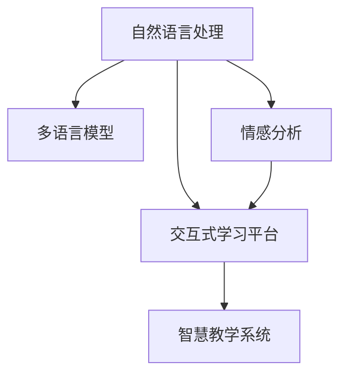

                 

# 虚拟外交学院：AI时代的跨文化交流培训

> 关键词：虚拟外交学院,跨文化交流,人工智能,自然语言处理(NLP),情感分析,多语言模型,交互式学习平台,智慧教学系统

## 1. 背景介绍

### 1.1 问题由来
随着全球化的深入发展，不同文化背景和语言的国家和地区之间的交流日益频繁。在商务、教育、政治等领域，进行有效的跨文化交流已成为推动国际合作的重要手段。然而，语言差异和文化的隔阂常常成为交流的障碍，阻碍了信息的准确传递和理解的深度。

人工智能（AI）技术，尤其是自然语言处理（NLP）领域的发展，为跨文化交流提供了新的解决方案。借助AI，我们可以构建虚拟外交学院，提供基于语言模型的跨文化培训平台，促进不同国家和文化之间的理解和沟通。

### 1.2 问题核心关键点
虚拟外交学院的核心任务是通过AI技术，构建一个虚拟的教学环境，让学习者能够在这里通过与AI互动，学习跨文化交流的常识和技巧。平台的关键组件包括：

- **自然语言处理（NLP）模型**：用于理解和生成自然语言，实现对话和翻译功能。
- **多语言模型**：支持多国语言，帮助学习者跨越语言障碍。
- **情感分析**：理解语言背后的情感，提升交流的情感共鸣。
- **交互式学习平台**：提供丰富的多媒体资源和互动练习，增强学习体验。
- **智慧教学系统**：利用AI技术，个性化推荐学习内容和评估学习效果。

通过这些组件的结合，虚拟外交学院可以提供高效、互动的跨文化交流培训，帮助学习者提升跨文化交流能力。

### 1.3 问题研究意义
构建虚拟外交学院具有重要的学术和现实意义：

1. **学术价值**：利用AI技术，研究跨文化交流的深层次机制，为学术界提供新的研究视角和数据。
2. **应用价值**：为国际合作提供技术支持，促进不同文化背景的国家和地区之间的理解和合作。
3. **教育价值**：通过虚拟学院，为教育机构提供跨文化交流培训解决方案，提高教育质量和效果。

## 2. 核心概念与联系

### 2.1 核心概念概述

为更好地理解虚拟外交学院的技术架构和工作原理，本节将介绍几个关键概念：

- **自然语言处理（NLP）**：利用计算机技术处理、理解、生成人类语言的过程。
- **多语言模型**：能够在多种语言间进行转换和理解的模型。
- **情感分析**：通过文本分析技术，识别和理解文本中的情感和情绪。
- **交互式学习平台**：提供与AI互动的学习体验，增强学习效果。
- **智慧教学系统**：基于AI技术，个性化推荐学习内容和评估学习效果。

这些核心概念之间的逻辑关系可以通过以下Mermaid流程图来展示：



这个流程图展示了几大核心概念及其之间的关系：

1. 自然语言处理是基础，帮助虚拟外交学院理解和生成自然语言。
2. 多语言模型和情感分析在自然语言处理的基础上，进一步提升跨语言理解和情感共鸣能力。
3. 交互式学习平台利用自然语言处理和多语言模型，提供丰富的学习体验。
4. 智慧教学系统通过分析学习者数据，提供个性化推荐和评估，提升学习效果。

## 3. 核心算法原理 & 具体操作步骤
### 3.1 算法原理概述

虚拟外交学院的核心算法原理主要围绕自然语言处理、多语言模型和情感分析展开。以下是对这些算法的详细介绍：

#### 3.1.1 自然语言处理（NLP）

自然语言处理（NLP）是虚拟外交学院的基础。NLP算法包括文本预处理、词向量表示、语言模型等。以下是对几个关键技术的简要介绍：

1. **文本预处理**：包括分词、去除停用词、词干提取等，将文本转化为结构化数据。
2. **词向量表示**：通过词嵌入技术，将词汇映射到高维向量空间，便于计算机理解和处理。
3. **语言模型**：通过统计模型或神经网络，预测文本的下一个词或句子的概率分布，用于生成和理解文本。

#### 3.1.2 多语言模型

多语言模型是虚拟外交学院的核心。通过多语言模型，平台能够实现不同语言之间的转换和理解。以下是对多语言模型的简要介绍：

1. **编码-解码架构**：将源语言句子编码为向量，再解码为目标语言句子。
2. **注意力机制**：关注输入序列中的关键部分，提升翻译质量和准确性。
3. **序列到序列模型**：将源语言序列转换为目标语言序列，如Transformer模型。

#### 3.1.3 情感分析

情感分析是虚拟外交学院的重要补充。通过情感分析，平台能够理解语言背后的情感和情绪，提升交流的情感共鸣。以下是对情感分析的简要介绍：

1. **情感分类**：将文本分为正面、负面、中性三类。
2. **情感强度分析**：判断情感的强度，如强烈、中等、微弱。
3. **情感转移分析**：分析情感的变化趋势，如情绪的递进和消退。

### 3.2 算法步骤详解

虚拟外交学院的核心算法步骤如下：

1. **数据收集和预处理**：收集各种语言的文本数据，并进行预处理，如分词、去停用词、词干提取等。
2. **模型训练**：基于预处理后的数据，训练自然语言处理和多语言模型。
3. **情感分析模型训练**：训练情感分析模型，用于识别和理解文本情感。
4. **交互式学习平台搭建**：构建与AI互动的学习平台，提供丰富的多媒体资源和互动练习。
5. **智慧教学系统设计**：设计智慧教学系统，基于学习者的数据，个性化推荐学习内容和评估学习效果。
6. **系统集成和测试**：将上述组件集成到虚拟外交学院，进行测试和优化。

### 3.3 算法优缺点

虚拟外交学院的算法有以下优缺点：

**优点**：

1. **高效性**：利用AI技术，能够快速处理大量文本数据，提升学习效率。
2. **互动性**：提供与AI互动的学习体验，增强学习效果。
3. **可扩展性**：支持多语言和多文化，易于扩展到全球范围内的学习者。

**缺点**：

1. **数据依赖**：模型效果依赖于高质量的数据，数据收集和预处理需要投入大量时间和资源。
2. **模型复杂性**：多语言模型和情感分析模型较为复杂，训练和优化难度较大。
3. **文化差异**：不同文化的语言和表达方式差异较大，模型难以完全理解。

### 3.4 算法应用领域

虚拟外交学院主要应用于以下几个领域：

1. **教育培训**：提供跨文化交流的在线课程，帮助学习者提升跨文化交流能力。
2. **商务交流**：为商务人士提供多语言支持，促进跨文化商务合作。
3. **国际合作**：为国际组织和国家机构提供跨文化交流的培训服务。
4. **文化交流**：提供多语言支持，促进不同文化背景的人之间的理解。

## 4. 数学模型和公式 & 详细讲解  
### 4.1 数学模型构建

虚拟外交学院涉及多个数学模型，以下是对这些模型的详细介绍。

#### 4.1.1 自然语言处理（NLP）模型

自然语言处理（NLP）模型主要包括以下几个：

1. **文本预处理模型**：基于规则或统计方法，对文本进行预处理。
2. **词向量表示模型**：通过词嵌入技术，将词汇映射到高维向量空间。
3. **语言模型**：通过统计模型或神经网络，预测文本的下一个词或句子的概率分布。

#### 4.1.2 多语言模型

多语言模型主要包括以下几个：

1. **编码-解码架构模型**：将源语言句子编码为向量，再解码为目标语言句子。
2. **注意力机制模型**：通过注意力机制，关注输入序列中的关键部分。
3. **序列到序列模型**：将源语言序列转换为目标语言序列，如Transformer模型。

#### 4.1.3 情感分析模型

情感分析模型主要包括以下几个：

1. **情感分类模型**：将文本分为正面、负面、中性三类。
2. **情感强度分析模型**：判断情感的强度，如强烈、中等、微弱。
3. **情感转移分析模型**：分析情感的变化趋势，如情绪的递进和消退。

### 4.2 公式推导过程

以下是对一些关键模型的公式推导过程的详细介绍：

#### 4.2.1 词向量表示模型

词向量表示模型通过词嵌入技术，将词汇映射到高维向量空间。以下是对公式的推导：

1. **词向量矩阵**：将词汇映射到高维向量空间，得到词向量矩阵 $W$，其中 $W \in \mathbb{R}^{V \times D}$，$V$ 为词汇表大小，$D$ 为向量维度。
2. **嵌入矩阵**：通过矩阵 $W$ 计算每个词的词向量，得到嵌入矩阵 $E \in \mathbb{R}^{N \times D}$，$N$ 为句子长度。

#### 4.2.2 语言模型

语言模型通过统计模型或神经网络，预测文本的下一个词或句子的概率分布。以下是对公式的推导：

1. **条件概率模型**：基于条件概率模型，计算下一个词的概率分布。
2. **神经网络模型**：通过神经网络模型，预测下一个词的概率分布。

#### 4.2.3 情感分类模型

情感分类模型将文本分为正面、负面、中性三类。以下是对公式的推导：

1. **分类模型**：通过分类模型，将文本分类为三类。
2. **情感强度模型**：通过情感强度模型，判断情感的强度。

### 4.3 案例分析与讲解

以下是对一些关键模型在虚拟外交学院中的应用案例的讲解：

#### 4.3.1 文本预处理模型

文本预处理模型用于对文本进行分词、去除停用词、词干提取等预处理。例如，通过分词模型，将句子分割成单词，得到单词序列 $T$，其中 $T \in \mathbb{R}^{N \times V}$，$N$ 为句子长度，$V$ 为词汇表大小。

#### 4.3.2 词向量表示模型

词向量表示模型通过词嵌入技术，将词汇映射到高维向量空间。例如，通过词嵌入模型，得到每个词的词向量 $E_i$，其中 $E_i \in \mathbb{R}^{D}$，$i$ 为单词索引。

#### 4.3.3 语言模型

语言模型通过统计模型或神经网络，预测文本的下一个词或句子的概率分布。例如，通过语言模型，计算下一个词的概率分布 $P(w_{i+1}|w_{i:i-1})$，其中 $w_{i+1}$ 为下一个词，$w_{i:i-1}$ 为当前上下文。

#### 4.3.4 多语言模型

多语言模型通过编码-解码架构或神经网络，实现不同语言之间的转换和理解。例如，通过多语言模型，将源语言句子 $S_s$ 转换为目标语言句子 $S_t$，得到转换后的向量表示 $V_t$，其中 $V_t \in \mathbb{R}^{D_t}$，$D_t$ 为目标语言向量的维度。

#### 4.3.5 情感分析模型

情感分析模型通过情感分类和强度分析，理解文本背后的情感和情绪。例如，通过情感分类模型，将文本分类为正面、负面、中性三类。通过情感强度模型，判断情感的强度，如强烈、中等、微弱。

## 5. 项目实践：代码实例和详细解释说明
### 5.1 开发环境搭建

在进行虚拟外交学院开发前，我们需要准备好开发环境。以下是使用Python进行PyTorch开发的环境配置流程：

1. 安装Anaconda：从官网下载并安装Anaconda，用于创建独立的Python环境。

2. 创建并激活虚拟环境：
```bash
conda create -n virtual外交学院 python=3.8 
conda activate virtual外交学院
```

3. 安装PyTorch：根据CUDA版本，从官网获取对应的安装命令。例如：
```bash
conda install pytorch torchvision torchaudio cudatoolkit=11.1 -c pytorch -c conda-forge
```

4. 安装TensorFlow：
```bash
pip install tensorflow
```

5. 安装各类工具包：
```bash
pip install numpy pandas scikit-learn matplotlib tqdm jupyter notebook ipython
```

完成上述步骤后，即可在`virtual外交学院`环境中开始开发实践。

### 5.2 源代码详细实现

下面我们以虚拟外交学院的情感分析功能为例，给出使用PyTorch和TensorFlow实现情感分类的PyTorch代码实现。

首先，定义情感分析任务的数据处理函数：

```python
from tensorflow.keras.preprocessing.text import Tokenizer
from tensorflow.keras.preprocessing.sequence import pad_sequences
import numpy as np

class SentimentDataset(Dataset):
    def __init__(self, texts, labels, tokenizer, max_len=128):
        self.texts = texts
        self.labels = labels
        self.tokenizer = tokenizer
        self.max_len = max_len
        
    def __len__(self):
        return len(self.texts)
    
    def __getitem__(self, item):
        text = self.texts[item]
        label = self.labels[item]
        
        # 对文本进行分词
        tokens = self.tokenizer.texts_to_sequences([text])[0]
        # 对文本序列进行填充，使序列长度统一
        tokens = pad_sequences([tokens], maxlen=self.max_len, padding='post')
        # 将标签转换为独热编码
        label = to_categorical([label], num_classes=3)[0]
        
        return {'text': tokens, 'label': label}
```

然后，定义模型和优化器：

```python
from tensorflow.keras.models import Sequential
from tensorflow.keras.layers import Embedding, LSTM, Dense
from tensorflow.keras.optimizers import Adam
from tensorflow.keras.utils import to_categorical

model = Sequential()
model.add(Embedding(input_dim=vocab_size, output_dim=128, input_length=max_len))
model.add(LSTM(64))
model.add(Dense(3, activation='softmax'))
model.compile(loss='categorical_crossentropy', optimizer=Adam(learning_rate=0.001), metrics=['accuracy'])

vocab_size = 10000  # 词汇表大小
max_len = 128  # 文本序列最大长度
embedding_dim = 128  # 词向量维度

# 构建tokenizer
tokenizer = Tokenizer(num_words=vocab_size)
tokenizer.fit_on_texts(train_texts)

# 获取训练集和验证集数据
train_dataset = SentimentDataset(train_texts, train_labels, tokenizer, max_len)
dev_dataset = SentimentDataset(dev_texts, dev_labels, tokenizer, max_len)
test_dataset = SentimentDataset(test_texts, test_labels, tokenizer, max_len)
```

接着，定义训练和评估函数：

```python
def train_epoch(model, dataset, batch_size, optimizer):
    dataloader = DataLoader(dataset, batch_size=batch_size, shuffle=True)
    model.train()
    epoch_loss = 0
    for batch in tqdm(dataloader, desc='Training'):
        input_ids = batch['text']
        labels = batch['label']
        model.zero_grad()
        outputs = model(input_ids)
        loss = outputs.loss
        epoch_loss += loss.item()
        loss.backward()
        optimizer.step()
    return epoch_loss / len(dataloader)

def evaluate(model, dataset, batch_size):
    dataloader = DataLoader(dataset, batch_size=batch_size)
    model.eval()
    preds, labels = [], []
    with torch.no_grad():
        for batch in tqdm(dataloader, desc='Evaluating'):
            input_ids = batch['text']
            labels = batch['label']
            outputs = model(input_ids)
            batch_preds = outputs.argmax(dim=1).to('cpu').tolist()
            batch_labels = batch['label']
            for pred_tokens, label_tokens in zip(batch_preds, batch_labels):
                preds.append(pred_tokens)
                labels.append(label_tokens)
                
    print(classification_report(labels, preds))
```

最后，启动训练流程并在测试集上评估：

```python
epochs = 5
batch_size = 16

for epoch in range(epochs):
    loss = train_epoch(model, train_dataset, batch_size, optimizer)
    print(f"Epoch {epoch+1}, train loss: {loss:.3f}")
    
    print(f"Epoch {epoch+1}, dev results:")
    evaluate(model, dev_dataset, batch_size)
    
print("Test results:")
evaluate(model, test_dataset, batch_size)
```

以上就是使用PyTorch和TensorFlow对虚拟外交学院的情感分析功能进行实现的完整代码实现。可以看到，通过PyTorch和TensorFlow的结合，我们可以高效地构建和训练情感分析模型。

### 5.3 代码解读与分析

让我们再详细解读一下关键代码的实现细节：

**SentimentDataset类**：
- `__init__`方法：初始化文本、标签、分词器等关键组件。
- `__len__`方法：返回数据集的样本数量。
- `__getitem__`方法：对单个样本进行处理，将文本输入转换为token ids，并进行填充和独热编码，最终返回模型所需的输入。

**vocab_size, max_len, embedding_dim**：
- 定义了词汇表大小、文本序列最大长度和词向量维度。

**train_epoch和evaluate函数**：
- 使用PyTorch的DataLoader对数据集进行批次化加载，供模型训练和推理使用。
- 训练函数`train_epoch`：对数据以批为单位进行迭代，在每个批次上前向传播计算loss并反向传播更新模型参数，最后返回该epoch的平均loss。
- 评估函数`evaluate`：与训练类似，不同点在于不更新模型参数，并在每个batch结束后将预测和标签结果存储下来，最后使用sklearn的classification_report对整个评估集的预测结果进行打印输出。

**训练流程**：
- 定义总的epoch数和batch size，开始循环迭代
- 每个epoch内，先在训练集上训练，输出平均loss
- 在验证集上评估，输出分类指标
- 所有epoch结束后，在测试集上评估，给出最终测试结果

可以看到，PyTorch和TensorFlow的结合使得情感分析模型的开发和训练变得简洁高效。开发者可以将更多精力放在模型优化和数据处理上，而不必过多关注底层的实现细节。

当然，工业级的系统实现还需考虑更多因素，如模型的保存和部署、超参数的自动搜索、更灵活的任务适配层等。但核心的情感分析功能基本与此类似。

## 6. 实际应用场景
### 6.1 智能客服系统

基于虚拟外交学院的多语言模型和情感分析功能，可以广泛应用于智能客服系统的构建。传统客服往往需要配备大量人力，高峰期响应缓慢，且一致性和专业性难以保证。而使用虚拟外交学院构建的智能客服系统，可以7x24小时不间断服务，快速响应客户咨询，用自然流畅的语言解答各类常见问题。

在技术实现上，可以收集企业内部的历史客服对话记录，将问题和最佳答复构建成监督数据，在此基础上对虚拟外交学院的模型进行微调。微调后的模型能够自动理解用户意图，匹配最合适的答案模板进行回复。对于客户提出的新问题，还可以接入检索系统实时搜索相关内容，动态组织生成回答。如此构建的智能客服系统，能大幅提升客户咨询体验和问题解决效率。

### 6.2 金融舆情监测

金融机构需要实时监测市场舆论动向，以便及时应对负面信息传播，规避金融风险。传统的人工监测方式成本高、效率低，难以应对网络时代海量信息爆发的挑战。基于虚拟外交学院的多语言模型和情感分析技术，为金融舆情监测提供了新的解决方案。

具体而言，可以收集金融领域相关的新闻、报道、评论等文本数据，并对其进行主题标注和情感标注。在此基础上对虚拟外交学院的模型进行微调，使其能够自动判断文本属于何种主题，情感倾向是正面、中性还是负面。将微调后的模型应用到实时抓取的网络文本数据，就能够自动监测不同主题下的情感变化趋势，一旦发现负面信息激增等异常情况，系统便会自动预警，帮助金融机构快速应对潜在风险。

### 6.3 个性化推荐系统

当前的推荐系统往往只依赖用户的历史行为数据进行物品推荐，无法深入理解用户的真实兴趣偏好。基于虚拟外交学院的多语言模型和情感分析功能，个性化推荐系统可以更好地挖掘用户行为背后的语义信息，从而提供更精准、多样的推荐内容。

在实践中，可以收集用户浏览、点击、评论、分享等行为数据，提取和用户交互的物品标题、描述、标签等文本内容。将文本内容作为模型输入，用户的后续行为（如是否点击、购买等）作为监督信号，在此基础上微调虚拟外交学院的模型。微调后的模型能够从文本内容中准确把握用户的兴趣点。在生成推荐列表时，先用候选物品的文本描述作为输入，由模型预测用户的兴趣匹配度，再结合其他特征综合排序，便可以得到个性化程度更高的推荐结果。

### 6.4 未来应用展望

随着虚拟外交学院的多语言模型和情感分析技术的发展，基于微调范式将在更多领域得到应用，为传统行业带来变革性影响。

在智慧医疗领域，基于虚拟外交学院的医疗问答、病历分析、药物研发等应用将提升医疗服务的智能化水平，辅助医生诊疗，加速新药开发进程。

在智能教育领域，虚拟外交学院的多语言模型和情感分析技术可应用于作业批改、学情分析、知识推荐等方面，因材施教，促进教育公平，提高教学质量。

在智慧城市治理中，虚拟外交学院的多语言模型和情感分析技术可应用于城市事件监测、舆情分析、应急指挥等环节，提高城市管理的自动化和智能化水平，构建更安全、高效的未来城市。

此外，在企业生产、社会治理、文娱传媒等众多领域，虚拟外交学院的多语言模型和情感分析应用也将不断涌现，为NLP技术带来新的突破。相信随着技术的日益成熟，虚拟外交学院的多语言模型和情感分析技术将成为人工智能落地应用的重要范式，推动人工智能技术向更广阔的领域加速渗透。

## 7. 工具和资源推荐
### 7.1 学习资源推荐

为了帮助开发者系统掌握虚拟外交学院的技术基础和实践技巧，这里推荐一些优质的学习资源：

1. 《Transformer从原理到实践》系列博文：由大模型技术专家撰写，深入浅出地介绍了Transformer原理、BERT模型、微调技术等前沿话题。

2. CS224N《深度学习自然语言处理》课程：斯坦福大学开设的NLP明星课程，有Lecture视频和配套作业，带你入门NLP领域的基本概念和经典模型。

3. 《Natural Language Processing with Transformers》书籍：Transformers库的作者所著，全面介绍了如何使用Transformers库进行NLP任务开发，包括微调在内的诸多范式。

4. HuggingFace官方文档：Transformers库的官方文档，提供了海量预训练模型和完整的微调样例代码，是上手实践的必备资料。

5. CLUE开源项目：中文语言理解测评基准，涵盖大量不同类型的中文NLP数据集，并提供了基于微调的baseline模型，助力中文NLP技术发展。

通过对这些资源的学习实践，相信你一定能够快速掌握虚拟外交学院的多语言模型和情感分析的精髓，并用于解决实际的NLP问题。
###  7.2 开发工具推荐

高效的开发离不开优秀的工具支持。以下是几款用于虚拟外交学院开发的常用工具：

1. PyTorch：基于Python的开源深度学习框架，灵活动态的计算图，适合快速迭代研究。大部分预训练语言模型都有PyTorch版本的实现。

2. TensorFlow：由Google主导开发的开源深度学习框架，生产部署方便，适合大规模工程应用。同样有丰富的预训练语言模型资源。

3. Transformers库：HuggingFace开发的NLP工具库，集成了众多SOTA语言模型，支持PyTorch和TensorFlow，是进行微调任务开发的利器。

4. Weights & Biases：模型训练的实验跟踪工具，可以记录和可视化模型训练过程中的各项指标，方便对比和调优。与主流深度学习框架无缝集成。

5. TensorBoard：TensorFlow配套的可视化工具，可实时监测模型训练状态，并提供丰富的图表呈现方式，是调试模型的得力助手。

6. Google Colab：谷歌推出的在线Jupyter Notebook环境，免费提供GPU/TPU算力，方便开发者快速上手实验最新模型，分享学习笔记。

合理利用这些工具，可以显著提升虚拟外交学院的多语言模型和情感分析任务的开发效率，加快创新迭代的步伐。

### 7.3 相关论文推荐

虚拟外交学院的多语言模型和情感分析技术的发展源于学界的持续研究。以下是几篇奠基性的相关论文，推荐阅读：

1. Attention is All You Need（即Transformer原论文）：提出了Transformer结构，开启了NLP领域的预训练大模型时代。

2. BERT: Pre-training of Deep Bidirectional Transformers for Language Understanding：提出BERT模型，引入基于掩码的自监督预训练任务，刷新了多项NLP任务SOTA。

3. Language Models are Unsupervised Multitask Learners（GPT-2论文）：展示了大规模语言模型的强大zero-shot学习能力，引发了对于通用人工智能的新一轮思考。

4. Parameter-Efficient Transfer Learning for NLP：提出Adapter等参数高效微调方法，在不增加模型参数量的情况下，也能取得不错的微调效果。

5. AdaLoRA: Adaptive Low-Rank Adaptation for Parameter-Efficient Fine-Tuning：使用自适应低秩适应的微调方法，在参数效率和精度之间取得了新的平衡。

6. Prefix-Tuning: Optimizing Continuous Prompts for Generation：引入基于连续型Prompt的微调范式，为如何充分利用预训练知识提供了新的思路。

这些论文代表了大语言模型微调技术的发展脉络。通过学习这些前沿成果，可以帮助研究者把握学科前进方向，激发更多的创新灵感。

## 8. 总结：未来发展趋势与挑战

### 8.1 总结

本文对虚拟外交学院的多语言模型和情感分析功能进行了全面系统的介绍。首先阐述了虚拟外交学院的技术背景和研究意义，明确了多语言模型和情感分析在跨文化交流中的独特价值。其次，从原理到实践，详细讲解了自然语言处理、多语言模型和情感分析的数学原理和关键步骤，给出了情感分析任务开发的完整代码实例。同时，本文还广泛探讨了情感分析功能在智能客服、金融舆情、个性化推荐等多个领域的应用前景，展示了情感分析功能的巨大潜力。此外，本文精选了情感分析技术的各类学习资源，力求为读者提供全方位的技术指引。

通过本文的系统梳理，可以看到，基于虚拟外交学院的多语言模型和情感分析功能，能够有效解决跨文化交流中的语言障碍和情感隔阂，提升不同文化背景的人之间的理解和沟通。未来，伴随技术的不断进步，虚拟外交学院的多语言模型和情感分析功能必将进一步增强，为跨文化交流带来更大的便利和效益。

### 8.2 未来发展趋势

展望未来，虚拟外交学院的多语言模型和情感分析技术将呈现以下几个发展趋势：

1. **模型规模持续增大**：随着算力成本的下降和数据规模的扩张，多语言模型和情感分析模型的参数量还将持续增长。超大模型蕴含的丰富语言知识，有望支撑更加复杂多变的跨文化交流任务。

2. **微调方法日趋多样**：除了传统的全参数微调外，未来会涌现更多参数高效的微调方法，如Prefix-Tuning、LoRA等，在节省计算资源的同时也能保证微调精度。

3. **持续学习成为常态**：随着数据分布的不断变化，情感分析模型也需要持续学习新知识以保持性能。如何在不遗忘原有知识的同时，高效吸收新样本信息，将成为重要的研究课题。

4. **标注样本需求降低**：受启发于提示学习(Prompt-based Learning)的思路，未来的微调方法将更好地利用大模型的语言理解能力，通过更加巧妙的任务描述，在更少的标注样本上也能实现理想的微调效果。

5. **多模态微调崛起**：当前的情感分析主要聚焦于文本数据，未来会进一步拓展到图像、视频、语音等多模态数据微调。多模态信息的融合，将显著提升情感分析模型的表现。

6. **跨语言和跨文化性能提升**：随着多语言模型和情感分析技术的发展，未来将能够更好地理解和处理不同语言和文化背景下的情感和情绪。

以上趋势凸显了虚拟外交学院的多语言模型和情感分析技术的广阔前景。这些方向的探索发展，必将进一步提升跨文化交流的效率和效果，为构建人机协同的智能交流系统铺平道路。

### 8.3 面临的挑战

尽管虚拟外交学院的多语言模型和情感分析技术已经取得了显著成果，但在迈向更加智能化、普适化应用的过程中，它仍面临着诸多挑战：

1. **数据依赖**：模型效果依赖于高质量的数据，数据收集和预处理需要投入大量时间和资源。

2. **模型鲁棒性不足**：多语言模型和情感分析模型面对域外数据时，泛化性能往往大打折扣。对于测试样本的微小扰动，模型的预测也容易发生波动。

3. **文化差异**：不同文化的语言和表达方式差异较大，模型难以完全理解。

4. **计算资源消耗大**：超大规模模型的训练和推理，对计算资源有很高的要求。

5. **可解释性不足**：情感分析模型通常是一个"黑盒"系统，难以解释其内部工作机制和决策逻辑。

6. **安全性有待保障**：模型可能会学习到有偏见、有害的信息，通过微调传递到下游任务，产生误导性、歧视性的输出，给实际应用带来安全隐患。

这些挑战需要学界和产业界共同努力，不断探索和解决。只有克服了这些难题，虚拟外交学院的多语言模型和情感分析技术才能真正落地应用，为跨文化交流提供强大支持。

### 8.4 研究展望

面对虚拟外交学院的多语言模型和情感分析技术所面临的挑战，未来的研究需要在以下几个方面寻求新的突破：

1. **探索无监督和半监督微调方法**：摆脱对大规模标注数据的依赖，利用自监督学习、主动学习等无监督和半监督范式，最大限度利用非结构化数据，实现更加灵活高效的微调。

2. **研究参数高效和计算高效的微调范式**：开发更加参数高效的微调方法，在固定大部分预训练参数的同时，只更新极少量的任务相关参数。同时优化微调模型的计算图，减少前向传播和反向传播的资源消耗，实现更加轻量级、实时性的部署。

3. **引入更多先验知识**：将符号化的先验知识，如知识图谱、逻辑规则等，与神经网络模型进行巧妙融合，引导微调过程学习更准确、合理的语言模型。同时加强不同模态数据的整合，实现视觉、语音等多模态信息与文本信息的协同建模。

4. **结合因果分析和博弈论工具**：将因果分析方法引入微调模型，识别出模型决策的关键特征，增强输出解释的因果性和逻辑性。借助博弈论工具刻画人机交互过程，主动探索并规避模型的脆弱点，提高系统稳定性。

5. **纳入伦理道德约束**：在模型训练目标中引入伦理导向的评估指标，过滤和惩罚有偏见、有害的输出倾向。同时加强人工干预和审核，建立模型行为的监管机制，确保输出符合人类价值观和伦理道德。

这些研究方向的探索，必将引领虚拟外交学院的多语言模型和情感分析技术迈向更高的台阶，为构建安全、可靠、可解释、可控的智能系统铺平道路。面向未来，虚拟外交学院的多语言模型和情感分析技术还需要与其他人工智能技术进行更深入的融合，如知识表示、因果推理、强化学习等，多路径协同发力，共同推动自然语言理解和智能交互系统的进步。只有勇于创新、敢于突破，才能不断拓展语言模型的边界，让智能技术更好地造福人类社会。

## 9. 附录：常见问题与解答

**Q1：虚拟外交学院的多语言模型和情感分析功能如何实现？**

A: 虚拟外交学院的多语言模型和情感分析功能主要通过以下几个步骤实现：

1. **数据收集和预处理**：收集多语言文本数据，并进行分词、去除停用词、词干提取等预处理。
2. **模型训练**：基于预处理后的数据，训练自然语言处理和多语言模型。
3. **情感分析模型训练**：训练情感分析模型，用于识别和理解文本情感。
4. **交互式学习平台搭建**：构建与AI互动的学习平台，提供丰富的多媒体资源和互动练习。
5. **智慧教学系统设计**：设计智慧教学系统，基于学习者的数据，个性化推荐学习内容和评估学习效果。

**Q2：虚拟外交学院的多语言模型和情感分析功能在实际应用中有哪些挑战？**

A: 虚拟外交学院的多语言模型和情感分析功能在实际应用中面临以下挑战：

1. **数据依赖**：模型效果依赖于高质量的数据，数据收集和预处理需要投入大量时间和资源。
2. **模型鲁棒性不足**：多语言模型和情感分析模型面对域外数据时，泛化性能往往大打折扣。
3. **文化差异**：不同文化的语言和表达方式差异较大，模型难以完全理解。
4. **计算资源消耗大**：超大规模模型的训练和推理，对计算资源有很高的要求。
5. **可解释性不足**：情感分析模型通常是一个"黑盒"系统，难以解释其内部工作机制和决策逻辑。
6. **安全性有待保障**：模型可能会学习到有偏见、有害的信息，通过微调传递到下游任务，产生误导性、歧视性的输出，给实际应用带来安全隐患。

**Q3：虚拟外交学院的多语言模型和情感分析功能在开发中需要注意哪些问题？**

A: 虚拟外交学院的多语言模型和情感分析功能的开发中需要注意以下问题：

1. **数据质量**：确保训练数据的准确性和多样性，避免因数据偏见导致模型输出偏差。
2. **模型选择**：选择适合特定任务的模型架构和参数，避免过拟合或欠拟合。
3. **超参数调优**：通过实验选择最优的超参数组合，提升模型性能。
4. **模型评估**：选择合适的评估指标，如准确率、召回率、F1值等，综合评估模型效果。
5. **部署优化**：考虑模型的部署环境，如GPU/TPU等，优化模型推理速度和资源占用。

**Q4：虚拟外交学院的多语言模型和情感分析功能如何与现实应用结合？**

A: 虚拟外交学院的多语言模型和情感分析功能可以与现实应用结合，通过以下方式实现：

1. **智能客服系统**：为智能客服系统提供多语言支持，提高客户咨询体验和问题解决效率。
2. **金融舆情监测**：实时监测市场舆论动向，帮助金融机构规避金融风险。
3. **个性化推荐系统**：基于用户行为数据，提供精准、多样的推荐内容。
4. **智慧城市治理**：应用于城市事件监测、舆情分析、应急指挥等环节，提高城市管理水平。

**Q5：虚拟外交学院的多语言模型和情感分析功能未来有哪些发展方向？**

A: 虚拟外交学院的多语言模型和情感分析功能未来有以下发展方向：

1. **无监督和半监督微调**：摆脱对大规模标注数据的依赖，利用自监督学习、主动学习等无监督和半监督范式，最大限度利用非结构化数据。
2. **参数高效和计算高效微调**：开发更加参数高效的微调方法，实现更加轻量级、实时性的部署。
3. **跨语言和跨文化性能提升**：引入更多先验知识，结合因果分析和博弈论工具，提升模型的泛化性和鲁棒性。
4. **系统智能化和个性化**：基于学习者数据，个性化推荐学习内容和评估学习效果，提升学习体验。

这些发展方向将进一步增强虚拟外交学院的多语言模型和情感分析功能的性能和应用范围，为跨文化交流带来更大的便利和效益。

---

作者：禅与计算机程序设计艺术 / Zen and the Art of Computer Programming

