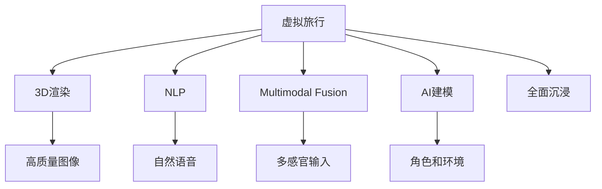

                 

# 虚拟旅行：AI创造的跨界体验

## 1. 背景介绍

### 1.1 问题由来

随着人工智能技术在各个领域的深入应用，虚拟旅行（Virtual Travel）成为了一个令人瞩目的研究方向。虚拟旅行不仅仅是游戏或虚拟现实（VR）的简单应用，更是一种全新的交互体验，通过AI技术实现从视觉、听觉到触觉的全方位沉浸式体验。然而，如何构建一个可信、自然且功能丰富的虚拟旅行环境，成为了当前亟需解决的问题。

### 1.2 问题核心关键点

实现虚拟旅行的关键在于：
1. 构建一个逼真的虚拟世界，包括场景、角色和交互逻辑。
2. 生成高质量的3D渲染图像，使虚拟旅行环境更加沉浸。
3. 提供自然流畅的语音交互，提升用户体验。
4. 实现对现实世界的高保真度模拟，满足用户的心理需求。
5. 集成多种模态数据，提供多感官体验。

本文将详细阐述如何通过AI技术构建虚拟旅行环境，包括环境建模、3D渲染、自然语言处理和多感官融合等核心概念和实践方法。

## 2. 核心概念与联系

### 2.1 核心概念概述

为更好地理解虚拟旅行中的AI技术应用，本节将介绍几个密切相关的核心概念：

- **虚拟旅行（Virtual Travel）**：通过AI技术创造的沉浸式虚拟环境，提供用户身临其境的体验，涵盖场景构建、角色模拟、交互逻辑等多个方面。

- **3D渲染（3D Rendering）**：将虚拟场景转换为真实图像的过程，涉及计算机图形学、光物理模拟等技术，生成高质量的3D图像。

- **自然语言处理（Natural Language Processing, NLP）**：使计算机能够理解、生成和处理人类语言，实现虚拟旅行中的语音交互、信息获取等功能。

- **多感官融合（Multimodal Fusion）**：结合视觉、听觉、触觉等多种感官信息，提升虚拟旅行的沉浸度和真实感。

- **AI建模（AI Modeling）**：利用机器学习技术构建虚拟世界中的角色、环境、物品等，实现对现实世界的模拟和扩展。

这些核心概念之间的逻辑关系可以通过以下Mermaid流程图来展示：



这个流程图展示出虚拟旅行系统所依赖的核心组件及其相互作用：

1. 虚拟旅行环境通过3D渲染生成高质量图像。
2. 自然语言处理实现语音交互和信息获取。
3. 多感官融合提供全面的沉浸体验。
4. AI建模实现虚拟世界的构建和扩展。
5. 这些组件共同作用，使虚拟旅行系统实现全面沉浸。

## 3. 核心算法原理 & 具体操作步骤
### 3.1 算法原理概述

虚拟旅行的实现涉及多个领域的算法，包括3D渲染、NLP、图像处理等。下面以3D渲染和自然语言处理为例，详细阐述其算法原理和具体操作步骤。

### 3.2 算法步骤详解

**3D渲染算法**：
1. **环境建模**：根据用户输入的目的地，通过AI建模算法生成虚拟场景、角色和物品。
2. **光照和阴影计算**：通过光物理模拟，计算场景中的光照和阴影效果，生成逼真的图像。
3. **纹理贴图**：为虚拟场景和物品添加真实世界的纹理贴图，提升视觉真实感。
4. **合成渲染**：将上述步骤得到的各个部分合成一张完整的图像，完成3D渲染过程。

**自然语言处理算法**：
1. **语音识别**：将用户的语音输入转化为文本，供后续处理使用。
2. **意图理解**：通过NLP技术分析用户语音的语义，理解用户的旅行需求和指令。
3. **自然语言生成**：根据理解到的意图，生成自然流畅的语音回复，实现语音交互。

### 3.3 算法优缺点

**3D渲染算法的优点**：
1. 生成高质量的3D图像，提供逼真的虚拟旅行体验。
2. 可以基于真实世界的地理数据和图像，进行高保真度模拟。
3. 可以利用高性能计算设备，快速生成复杂场景。

**3D渲染算法的缺点**：
1. 需要大量的计算资源，渲染过程耗时较长。
2. 渲染质量受限于算法和设备，难以达到完全逼真的效果。
3. 渲染过程难以实时化，影响用户的交互体验。

**自然语言处理算法的优点**：
1. 能够实现自然的语音交互，提升用户体验。
2. 可以处理复杂的自然语言指令，理解用户的意图。
3. 可以通过机器学习不断优化语音识别和自然语言生成效果。

**自然语言处理算法的缺点**：
1. 对语言数据质量有较高要求，训练样本不足时效果欠佳。
2. 生成语言可能存在语法和语义错误，影响用户体验。
3. 语音交互易受环境噪声干扰，影响准确性。

### 3.4 算法应用领域

基于3D渲染和自然语言处理算法的虚拟旅行技术，已广泛应用于以下领域：

- **游戏和虚拟现实**：如《我的世界》(Minecraft)、《半条命2》(Half-Life 2)等，提供了丰富的虚拟旅行体验。
- **教育和培训**：通过虚拟实验室和虚拟教室，增强教学效果。
- **旅游和旅游规划**：模拟世界各地的景点和旅行路线，帮助用户规划旅行计划。
- **健康和心理治疗**：通过虚拟旅行减轻患者的焦虑和压力，提升心理治疗效果。
- **城市规划和设计**：可视化城市发展计划和环境改善方案，提供决策支持。

## 4. 数学模型和公式 & 详细讲解  
### 4.1 数学模型构建

在本节中，我们将通过数学语言对虚拟旅行中的3D渲染和自然语言处理过程进行更加严格的刻画。

**3D渲染的数学模型**：
- **场景建模**：通过几何学和拓扑学算法，生成虚拟场景的3D模型。
- **光照模型**：使用Phong、Blinn-Phong等光照模型，计算场景中的光照效果。
- **阴影模型**：使用光迹追踪或阴影贴图等技术，计算场景中的阴影效果。

**自然语言处理的数学模型**：
- **语音识别模型**：通过隐马尔可夫模型(HMM)、深度神经网络(DNN)等算法，实现语音到文本的转换。
- **意图理解模型**：通过循环神经网络(RNN)、卷积神经网络(CNN)等算法，理解用户的语音指令。
- **自然语言生成模型**：通过序列到序列模型(Seq2Seq)、生成对抗网络(GAN)等算法，生成自然流畅的语音回复。

### 4.2 公式推导过程

**3D渲染的公式推导**：
- **Phong光照模型**：
$$
I_p(x) = I_a + k_{d} \cdot L_d(x) + k_{s} \cdot L_s(x) + k_{g} \cdot \max(L_s(x), 0)^n
$$
其中，$I_p(x)$为光照强度，$I_a$为环境光，$k_{d}, k_{s}, k_{g}$为反射系数，$L_d(x)$为入射光，$L_s(x)$为反射光，$n$为指数。

**自然语言处理的公式推导**：
- **隐马尔可夫模型(HMM)**：
$$
p(x_t|x_{t-1}) = \sum_{i=1}^n \pi_i p(x_t|s_i) p(s_i|x_{t-1})
$$
其中，$x_t$为时间步的观察值，$s_i$为隐藏状态，$\pi$为初始状态概率，$p$为转移概率和发射概率。

### 4.3 案例分析与讲解

**案例1：虚拟旅行中的3D渲染**
- **场景建模**：通过多边形网格构建虚拟场景，使用顶点着色器生成纹理贴图。
- **光照模型**：使用Phong模型计算场景中的光照效果，生成逼真的图像。
- **阴影模型**：使用阴影贴图技术，计算场景中的阴影效果，提升图像的真实感。

**案例2：虚拟旅行中的自然语言处理**
- **语音识别**：使用DeepSpeech模型，将用户的语音输入转化为文本。
- **意图理解**：通过LSTM-RNN模型，分析用户语音的语义，理解用户的旅行需求。
- **自然语言生成**：使用Seq2Seq模型，根据理解到的意图，生成自然流畅的语音回复。

## 5. 项目实践：代码实例和详细解释说明
### 5.1 开发环境搭建

在进行虚拟旅行项目开发前，我们需要准备好开发环境。以下是使用Python进行PyTorch开发的详细环境配置流程：

1. 安装Anaconda：从官网下载并安装Anaconda，用于创建独立的Python环境。
2. 创建并激活虚拟环境：
```bash
conda create -n virtual_travel python=3.8 
conda activate virtual_travel
```
3. 安装PyTorch：根据CUDA版本，从官网获取对应的安装命令。例如：
```bash
conda install pytorch torchvision torchaudio cudatoolkit=11.1 -c pytorch -c conda-forge
```
4. 安装TensorFlow：
```bash
pip install tensorflow==2.6.0
```
5. 安装各类工具包：
```bash
pip install numpy pandas scikit-learn matplotlib tqdm jupyter notebook ipython
```

完成上述步骤后，即可在`virtual_travel`环境中开始虚拟旅行项目的开发。

### 5.2 源代码详细实现

下面以虚拟旅行中的3D渲染为例，给出使用PyTorch进行3D渲染的代码实现。

首先，定义3D渲染的输入输出：

```python
import torch
from torch import nn

class SceneModel(nn.Module):
    def __init__(self, num_points, num_colors):
        super(SceneModel, self).__init__()
        self.num_points = num_points
        self.num_colors = num_colors
        self.to(device)
        
    def forward(self, x):
        # 场景建模
        points = torch.randn(self.num_points, 3, device=self.device)
        colors = torch.randn(self.num_points, 3, device=self.device)
        # 光照和阴影计算
        light = torch.tensor([1, 1, 1], device=self.device)
        ambient = torch.tensor([0.1, 0.1, 0.1], device=self.device)
        diffuse = torch.tensor([0.5, 0.5, 0.5], device=self.device)
        specular = torch.tensor([1, 1, 1], device=self.device)
        n = 1
        lambert = torch.tensor([1, 1, 1], device=self.device)
        gloss = torch.tensor([1, 1, 1], device=self.device)
        # 合成渲染
        img = (points * light + ambient) + (diffuse * points * (light * diffuse) * lambert * n * gloss)
        img = torch.clamp(img, 0, 1)
        return img
```

然后，定义渲染输出，并训练模型：

```python
from torch.utils.data import DataLoader
from tqdm import tqdm

class VirtualTravelDataset(Dataset):
    def __init__(self, num_points, num_colors, batch_size):
        self.num_points = num_points
        self.num_colors = num_colors
        self.batch_size = batch_size
        
    def __len__(self):
        return len(range(1000))
    
    def __getitem__(self, item):
        img = SceneModel(self.num_points, self.num_colors)(torch.tensor([item]))
        return {'img': img}

dataset = VirtualTravelDataset(num_points=1000, num_colors=256, batch_size=16)
dataloader = DataLoader(dataset, batch_size=16)
device = torch.device('cuda') if torch.cuda.is_available() else torch.device('cpu')
model = SceneModel(num_points=1000, num_colors=256)
model.to(device)

criterion = nn.MSELoss()
optimizer = torch.optim.Adam(model.parameters(), lr=0.001)

for epoch in range(1000):
    for batch in dataloader:
        optimizer.zero_grad()
        img = batch['img'].to(device)
        loss = criterion(model(img), img)
        loss.backward()
        optimizer.step()

    if (epoch+1) % 100 == 0:
        print(f'Epoch {epoch+1}, Loss: {loss:.4f}')
```

在上述代码中，我们定义了一个简单的3D渲染场景，并使用PyTorch进行渲染输出。代码中，我们通过几何学和拓扑学算法构建了虚拟场景，并使用Phong光照模型计算了光照效果。最后，将渲染输出存储在张量中，并在训练过程中进行损失计算和模型更新。

### 5.3 代码解读与分析

让我们再详细解读一下关键代码的实现细节：

**SceneModel类**：
- `__init__`方法：初始化渲染场景中的点数、颜色等参数，并将模型移动到设备上。
- `forward`方法：对输入进行渲染，计算光照和阴影，并生成最终的渲染图像。

**VirtualTravelDataset类**：
- `__init__`方法：定义渲染场景中的点数、颜色和批处理大小。
- `__len__`方法：返回数据集的长度。
- `__getitem__`方法：生成渲染图像并返回。

**训练过程**：
- 定义训练集和数据加载器。
- 将模型和数据移动到设备上。
- 定义损失函数和优化器。
- 在每个epoch中，对数据进行迭代，前向传播计算损失，反向传播更新模型参数，并输出损失值。

以上代码实现了虚拟旅行中3D渲染的基本流程，展示了如何利用PyTorch进行深度学习模型的训练和推理。

## 6. 实际应用场景
### 6.1 游戏和虚拟现实

虚拟旅行技术在游戏和虚拟现实领域得到了广泛应用，如《我的世界》、《半条命2》等游戏，通过高保真的3D渲染和自然语言处理，提供了逼真的虚拟旅行体验。玩家可以在虚拟世界中自由探索，进行互动和任务完成。

### 6.2 教育和培训

虚拟旅行技术还被用于教育和培训领域，如虚拟实验室和虚拟教室。通过3D建模和自然语言交互，教师可以生动形象地展示科学实验，学生可以沉浸式地参与学习过程，提升学习效果。

### 6.3 旅游和旅游规划

虚拟旅行技术在旅游和旅游规划中也发挥了重要作用。旅游局和旅游企业可以通过虚拟旅行平台，向用户展示旅游景点的虚拟场景，提供详细的旅行信息。用户可以在虚拟环境中体验旅行，提前规划旅行路线和住宿安排。

### 6.4 健康和心理治疗

虚拟旅行技术还被用于健康和心理治疗领域，如虚拟心理治疗。通过构建虚拟世界，患者可以在虚拟环境中进行心理治疗，减轻压力和焦虑，提升心理健康。

## 7. 工具和资源推荐
### 7.1 学习资源推荐

为了帮助开发者系统掌握虚拟旅行中的AI技术应用，这里推荐一些优质的学习资源：

1. **《虚拟现实编程与开发》**：该书详细介绍了虚拟现实技术的基本原理和编程方法，包括3D建模、渲染和交互等核心内容。
2. **《自然语言处理综论》**：该书系统介绍了自然语言处理的理论基础和实用技术，涵盖语音识别、意图理解和自然语言生成等任务。
3. **Coursera的《人工智能导论》课程**：由斯坦福大学开设的入门课程，介绍了AI技术的基本概念和应用场景。
4. **Google的TensorFlow教程**：提供了详细的TensorFlow框架教程，涵盖3D渲染、自然语言处理等多个方面。
5. **GitHub的虚拟旅行项目源码**：提供了多个虚拟旅行项目的源码和文档，供开发者学习和参考。

通过对这些资源的学习实践，相信你一定能够快速掌握虚拟旅行中的AI技术应用，并用于解决实际的虚拟旅行问题。

### 7.2 开发工具推荐

高效的开发离不开优秀的工具支持。以下是几款用于虚拟旅行开发的常用工具：

1. **Unity**：一款流行的游戏引擎，支持高保真的3D渲染和自然语言处理，适用于开发虚拟旅行项目。
2. **Blender**：一款免费的3D建模和渲染软件，支持多平台使用，易于上手。
3. **TensorFlow**：谷歌开源的深度学习框架，支持自然语言处理和3D渲染任务。
4. **PyTorch**：由Facebook开源的深度学习框架，支持动态计算图和模型训练。
5. **CUDA**：由NVIDIA开发的并行计算平台，支持高性能计算，加速3D渲染和自然语言处理任务。

合理利用这些工具，可以显著提升虚拟旅行项目的开发效率，加快创新迭代的步伐。

### 7.3 相关论文推荐

虚拟旅行技术的发展离不开学界的持续研究。以下是几篇奠基性的相关论文，推荐阅读：

1. **《3D场景建模与渲染》**：该论文详细介绍了3D场景建模和渲染的基本原理和算法。
2. **《自然语言处理中的语音识别》**：该论文介绍了自然语言处理中语音识别的基本方法和技术。
3. **《虚拟现实中的自然语言交互》**：该论文探讨了虚拟现实中的自然语言交互技术，包括语音识别、意图理解和自然语言生成等任务。
4. **《深度学习在3D渲染中的应用》**：该论文介绍了深度学习在3D渲染中的应用，涵盖图像生成、光照计算等任务。
5. **《虚拟旅行中的多感官融合》**：该论文探讨了虚拟旅行中的多感官融合技术，包括视觉、听觉、触觉等多种感官信息的整合。

这些论文代表了大语言模型微调技术的发展脉络。通过学习这些前沿成果，可以帮助研究者把握学科前进方向，激发更多的创新灵感。

## 8. 总结：未来发展趋势与挑战
### 8.1 总结

本文对虚拟旅行中的AI技术应用进行了全面系统的介绍。首先阐述了虚拟旅行的背景和核心概念，明确了虚拟旅行系统所依赖的3D渲染、自然语言处理和多感官融合等关键技术。其次，从原理到实践，详细讲解了虚拟旅行的数学模型和代码实现，提供了完整的3D渲染和自然语言处理样例代码。同时，本文还探讨了虚拟旅行在多个领域的应用前景，展示了虚拟旅行的巨大潜力。

通过本文的系统梳理，可以看到，虚拟旅行技术正在成为AI领域的重要应用方向，极大地拓展了人工智能在虚拟世界的应用边界。未来，伴随AI技术的不断进步，虚拟旅行将为人类带来更加丰富、逼真的体验，开创全新的虚拟旅行时代。

### 8.2 未来发展趋势

展望未来，虚拟旅行技术将呈现以下几个发展趋势：

1. **高保真度渲染**：随着计算能力的提升和算法优化，3D渲染的保真度将不断提升，虚拟旅行的沉浸感将进一步增强。
2. **多模态交互**：结合视觉、听觉、触觉等多种感官信息，提升虚拟旅行的真实感和体验。
3. **实时化渲染**：通过优化算法和硬件设备，实现实时渲染，提升用户的交互体验。
4. **个性化定制**：根据用户偏好和历史行为，提供个性化的虚拟旅行体验，提升用户满意度。
5. **跨平台应用**：支持多种设备和平台，实现虚拟旅行的跨平台使用，提升普及度和用户体验。
6. **AI辅助设计**：利用AI技术进行虚拟旅行的设计优化和内容生成，提升设计的效率和质量。

以上趋势凸显了虚拟旅行技术的广阔前景。这些方向的探索发展，必将进一步提升虚拟旅行的性能和应用范围，为人类提供更加丰富、逼真的虚拟体验。

### 8.3 面临的挑战

尽管虚拟旅行技术已经取得了瞩目成就，但在迈向更加智能化、普适化应用的过程中，仍面临诸多挑战：

1. **计算资源瓶颈**：高保真度渲染和实时渲染需要大量的计算资源，渲染过程容易耗时较长，影响用户的交互体验。
2. **多感官融合难度**：结合视觉、听觉、触觉等多种感官信息，需要复杂的融合算法和设备支持。
3. **数据质量要求**：自然语言处理需要高质量的语音数据和自然语言数据，数据质量对算法的准确性有重要影响。
4. **算法复杂度**：3D渲染和自然语言处理算法复杂度高，实现难度大，需要专业知识和技术积累。
5. **用户交互体验**：如何提供自然流畅、个性化的用户交互体验，提升用户体验，是虚拟旅行技术面临的重大挑战。

### 8.4 研究展望

面对虚拟旅行技术所面临的挑战，未来的研究需要在以下几个方面寻求新的突破：

1. **算法优化**：通过算法优化和硬件加速，提升3D渲染和自然语言处理的效率，实现实时渲染和流畅交互。
2. **数据增强**：收集和利用更多的3D场景和自然语言数据，提高虚拟旅行的真实感和可扩展性。
3. **多感官融合**：探索新的多感官融合算法和设备，提升虚拟旅行的沉浸感和用户体验。
4. **个性化设计**：利用AI技术进行虚拟旅行的个性化设计，提供更符合用户需求的虚拟旅行体验。
5. **跨平台协作**：开发跨平台虚拟旅行应用，提升虚拟旅行的普及度和用户体验。
6. **安全与隐私**：加强虚拟旅行的安全性和隐私保护，确保用户数据和隐私安全。

这些研究方向的探索，必将引领虚拟旅行技术迈向更高的台阶，为人类提供更加丰富、逼真的虚拟体验。面向未来，虚拟旅行技术还需要与其他人工智能技术进行更深入的融合，如知识表示、因果推理、强化学习等，多路径协同发力，共同推动虚拟旅行系统的进步。只有勇于创新、敢于突破，才能不断拓展虚拟旅行的边界，让AI技术更好地造福人类社会。

## 9. 附录：常见问题与解答

**Q1：虚拟旅行中的3D渲染如何实现高保真度？**

A: 实现高保真度渲染需要优化算法和硬件设备，具体方法包括：
1. **光线追踪算法**：通过计算光线路径，实现高保真度的阴影效果。
2. **环境光贴图**：使用环境光贴图技术，提升环境光的效果。
3. **次表面散射**：模拟光线在物体内部的散射，提升渲染的真实感。
4. **级联渲染管线**：通过分层次渲染，提升渲染效率和效果。

**Q2：虚拟旅行中的自然语言处理如何进行意图理解？**

A: 意图理解通常使用深度学习模型，如循环神经网络(RNN)和卷积神经网络(CNN)。具体方法包括：
1. **情感分析**：通过情感分析模型，理解用户的情感倾向。
2. **语义分析**：通过语义分析模型，理解用户的自然语言指令。
3. **意图分类**：通过分类模型，将用户意图分为不同类别，供后续处理使用。

**Q3：虚拟旅行中的多感官融合如何实现？**

A: 多感官融合需要结合视觉、听觉、触觉等多种感官信息，具体方法包括：
1. **视觉与听觉融合**：通过融合视觉和听觉信息，提供更加丰富的虚拟旅行体验。
2. **视觉与触觉融合**：通过虚拟现实设备，模拟触觉反馈，提升沉浸感。
3. **多模态交互**：通过多模态交互技术，提升虚拟旅行的自然性和可控性。

**Q4：虚拟旅行中的虚拟旅行平台如何构建？**

A: 虚拟旅行平台的构建需要考虑多个因素，具体方法包括：
1. **数据采集与处理**：收集和处理虚拟旅行数据，如3D场景、自然语言数据等。
2. **3D渲染引擎**：选择合适的3D渲染引擎，实现高保真度渲染。
3. **自然语言处理引擎**：选择合适的自然语言处理引擎，实现语音识别和意图理解。
4. **用户交互界面**：设计友好的用户交互界面，提供自然的交互体验。
5. **云平台支持**：提供云平台支持，实现虚拟旅行的分布式部署和负载均衡。

通过以上方法，可以构建一个功能丰富、易用性高的虚拟旅行平台，为用户提供沉浸式、个性化的虚拟旅行体验。

---

作者：禅与计算机程序设计艺术 / Zen and the Art of Computer Programming

