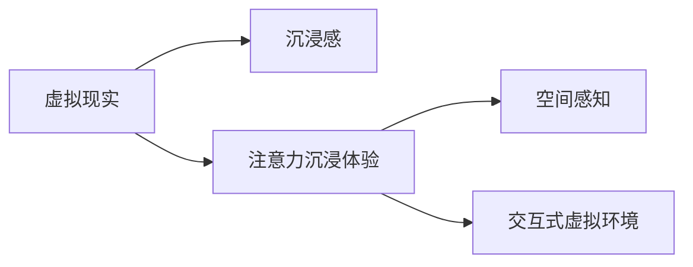

                 

# 虚拟现实在注意力沉浸体验中的应用

## 1. 背景介绍

### 1.1 问题由来

随着技术的进步，虚拟现实（Virtual Reality, VR）逐渐从科幻走进现实，成为一种新兴的娱乐和教育方式。VR不仅为用户提供了沉浸式的感官体验，还潜藏着强大的应用前景。特别是在注意力沉浸体验（Attention Immersive Experience）方面，VR技术的应用潜力尤为显著。

### 1.2 问题核心关键点

注意力沉浸体验是指通过虚拟现实技术，构建一个高度沉浸的虚拟环境，让用户能够在虚拟空间中长时间保持高度专注和集中注意力的体验。这种体验对于教育、训练、娱乐等领域都具有重要价值，例如在军事模拟训练、飞行员训练、游戏开发、心理咨询等场景中，用户需要长时间沉浸于虚拟环境，高度集中注意力。

VR在注意力沉浸体验中的关键在于其空间感知和沉浸感。利用VR技术，用户能够在虚拟环境中进行全方位的感知，包括视觉、听觉、触觉等感官体验，从而实现高度沉浸的效果。此外，通过交互式虚拟环境，用户能够与虚拟对象进行互动，进一步提升注意力集中度。

### 1.3 问题研究意义

虚拟现实技术在注意力沉浸体验中的应用，对于提升用户体验、增强学习效果、提高训练效果等方面具有重要意义：

1. **提升用户体验**：虚拟现实技术能够为用户提供逼真的感官体验，增强用户的沉浸感和真实感，提升用户的整体体验。
2. **增强学习效果**：通过沉浸式学习环境，用户能够在虚拟环境中进行反复练习，从而加深对知识的理解和掌握。
3. **提高训练效果**：军事模拟、飞行员训练等领域需要用户长时间进行高强度的训练，VR技术可以提供高度逼真的训练环境，提高训练效果和训练效率。
4. **促进交互式娱乐**：VR技术在娱乐领域中的应用，如虚拟演唱会、虚拟旅游等，能够提供高度沉浸的娱乐体验，吸引大量用户参与。
5. **推动心理健康**：虚拟现实技术能够模拟现实中的各种场景，用于心理治疗和咨询，帮助用户缓解压力和焦虑，提升心理健康水平。

## 2. 核心概念与联系

### 2.1 核心概念概述

为了更好地理解虚拟现实在注意力沉浸体验中的应用，我们首先介绍几个核心概念：

- **虚拟现实（Virtual Reality, VR）**：一种通过计算机技术生成逼真虚拟环境，使用户能够与虚拟对象进行交互的技术。
- **沉浸感（Immersion）**：用户通过视觉、听觉、触觉等多种感官与虚拟环境进行交互，形成高度沉浸的体验。
- **注意力沉浸体验（Attention Immersive Experience）**：通过VR技术，构建高度沉浸的虚拟环境，让用户能够长时间保持高度专注和集中注意力的体验。
- **空间感知（Spatial Perception）**：用户能够在虚拟环境中进行全方位的感知，包括视觉、听觉、触觉等感官体验。
- **交互式虚拟环境（Interactive Virtual Environment）**：用户能够与虚拟对象进行互动，进一步提升注意力集中度。

这些核心概念之间的逻辑关系可以通过以下Mermaid流程图来展示：



这个流程图展示了大语言模型的核心概念及其之间的关系：

1. 虚拟现实技术通过生成逼真的虚拟环境，实现沉浸感。
2. 注意力沉浸体验利用VR技术，构建高度沉浸的虚拟环境，提升用户注意力的集中度。
3. 空间感知是注意力沉浸体验的关键，用户能够在虚拟环境中进行全方位的感知。
4. 交互式虚拟环境是注意力沉浸体验的进一步提升，通过与虚拟对象的互动，增强用户的沉浸感。

## 3. 核心算法原理 & 具体操作步骤
### 3.1 算法原理概述

虚拟现实在注意力沉浸体验中的应用，主要依赖于以下几个关键算法：

1. **空间感知算法**：通过计算机视觉技术，生成逼真的三维空间场景，实现用户对虚拟环境的全方位感知。
2. **沉浸感增强算法**：通过音频技术、触觉反馈等手段，增强用户的沉浸感，提升用户对虚拟环境的真实感。
3. **注意力管理算法**：通过多感官刺激和交互式任务，保持用户长时间集中注意力，提升用户体验。
4. **用户行为追踪算法**：实时监测用户的行为和状态，调整虚拟环境的参数，适应用户的实时需求。

这些算法共同作用，构成了一个完整的注意力沉浸体验系统，能够为用户提供高质量的沉浸式体验。

### 3.2 算法步骤详解

以下是虚拟现实在注意力沉浸体验中应用的核心算法步骤：

**Step 1: 准备虚拟环境**
- 构建逼真的三维空间场景，包括地形、建筑物、植被等元素。
- 添加光照、阴影、雾效等效果，增强场景的真实感。
- 配置各种交互元素，如按钮、操纵杆等，便于用户进行交互。

**Step 2: 实现空间感知**
- 使用计算机视觉技术，生成逼真的三维空间场景，实现用户对虚拟环境的全方位感知。
- 通过摄像头、传感器等设备，实时监测用户的视角和位置，动态调整虚拟环境。
- 使用音频技术，模拟逼真的音效和回声，增强用户对虚拟环境的沉浸感。

**Step 3: 增强沉浸感**
- 利用触觉反馈技术，如振动反馈、力反馈等，增强用户的触觉体验。
- 通过多感官刺激，如视觉、听觉、触觉等，增强用户的沉浸感，提升用户对虚拟环境的真实感。

**Step 4: 管理注意力**
- 设计交互式任务，如射击游戏、逃脱游戏等，保持用户长时间集中注意力。
- 通过实时反馈，如进度提示、任务完成情况等，增强用户的成就感和参与感。
- 监测用户的状态，如心率、呼吸等生理指标，调整虚拟环境的参数，适应用户的实时需求。

**Step 5: 应用实际场景**
- 军事模拟训练：构建逼真的战场环境，通过交互式任务训练用户的操作技能和战术能力。
- 飞行员训练：模拟逼真的飞行环境，训练用户的飞行技能和应急处理能力。
- 游戏开发：构建高度沉浸的游戏环境，提升游戏体验和互动性。
- 心理治疗：模拟现实中的各种场景，用于心理治疗和咨询，帮助用户缓解压力和焦虑。

### 3.3 算法优缺点

虚拟现实在注意力沉浸体验中的应用，具有以下优点：

1. **沉浸感强**：通过多感官刺激和交互式任务，能够实现高度沉浸的体验，提升用户的整体体验。
2. **灵活性高**：可以根据不同的应用场景，灵活调整虚拟环境的参数，满足用户的个性化需求。
3. **逼真度高**：通过逼真的三维空间场景和音效，增强用户对虚拟环境的真实感。

同时，虚拟现实在注意力沉浸体验中也存在一些局限性：

1. **设备成本高**：高端的VR设备和硬件成本较高，用户购买和使用的门槛较高。
2. **技术复杂**：虚拟现实技术的开发和维护需要较高的技术水平和经验，对于一般用户而言，学习和使用门槛较高。
3. **内容限制**：当前虚拟现实内容相对较少，用户的选择性较为有限。
4. **生理不适**：长时间使用虚拟现实设备，可能对用户的视觉和身体造成一定的影响，需要控制使用时间。

### 3.4 算法应用领域

虚拟现实在注意力沉浸体验中的应用，已经广泛应用于多个领域：

1. **军事模拟训练**：通过构建逼真的战场环境，训练用户的战术能力和应急处理能力，提升实战能力。
2. **飞行员训练**：模拟逼真的飞行环境，训练用户的飞行技能和应急处理能力，提高飞行员的实战水平。
3. **游戏开发**：构建高度沉浸的游戏环境，提升游戏体验和互动性，吸引大量用户参与。
4. **心理治疗**：模拟现实中的各种场景，用于心理治疗和咨询，帮助用户缓解压力和焦虑，提升心理健康水平。
5. **教育培训**：构建逼真的教育场景，提升学生的学习效果和互动性，提高教育质量。
6. **商业培训**：通过虚拟现实技术，模拟商业环境，培训员工的商业技能和应变能力。

## 4. 数学模型和公式 & 详细讲解  
### 4.1 数学模型构建

为了更好地理解虚拟现实在注意力沉浸体验中的应用，我们首先需要构建一个数学模型来描述虚拟环境的生成和交互。

假设虚拟环境由一系列三维点组成，每个点 $(x, y, z)$ 都有一个颜色值 $C$ 和一个纹理值 $T$。用户在虚拟环境中的视角 $V$ 可以通过摄像头获取，用户的位置 $P$ 可以通过传感器获取。用户的行为 $B$ 可以通过手柄、按钮等设备获取。

定义虚拟环境的空间感知函数 $S(V, P)$ 为：

$$
S(V, P) = \sum_{i=1}^{N} w_i \cdot \text{distance}(V, P_i)
$$

其中 $w_i$ 为权重，$\text{distance}(V, P_i)$ 为点到点的距离。通过空间感知函数，可以生成逼真的三维空间场景。

定义虚拟环境的沉浸感增强函数 $I(V, P, B)$ 为：

$$
I(V, P, B) = \sum_{i=1}^{M} a_i \cdot \text{similarity}(V_i, V) \cdot \text{distance}(P, P_i) \cdot \text{weight}(B)
$$

其中 $a_i$ 为权重，$\text{similarity}(V_i, V)$ 为用户视角与虚拟对象视角的相似度，$\text{distance}(P, P_i)$ 为用户位置与虚拟对象位置的距离，$\text{weight}(B)$ 为用户行为对沉浸感的贡献度。通过沉浸感增强函数，可以增强用户的沉浸感。

定义虚拟环境的注意力管理函数 $A(V, P, B)$ 为：

$$
A(V, P, B) = \sum_{i=1}^{K} c_i \cdot \text{time}(t_i) \cdot \text{effort}(e_i) \cdot \text{reward}(r_i)
$$

其中 $c_i$ 为权重，$t_i$ 为任务时间，$e_i$ 为完成任务所需努力，$r_i$ 为任务完成后的奖励。通过注意力管理函数，可以保持用户长时间集中注意力。

定义虚拟环境的用户行为追踪函数 $T(V, P, B)$ 为：

$$
T(V, P, B) = \sum_{i=1}^{L} d_i \cdot \text{monitor}(m_i)
$$

其中 $d_i$ 为权重，$\text{monitor}(m_i)$ 为用户状态监测结果。通过用户行为追踪函数，可以实时监测用户的行为和状态，调整虚拟环境的参数。

### 4.2 公式推导过程

以下我们以交互式虚拟游戏为例，推导虚拟环境的空间感知、沉浸感增强、注意力管理和用户行为追踪的数学模型。

**空间感知模型**：

假设用户视角 $V$ 为 $(V_x, V_y, V_z)$，用户位置 $P$ 为 $(P_x, P_y, P_z)$，虚拟环境中的点 $P_i$ 为 $(x_i, y_i, z_i)$。则空间感知函数 $S(V, P)$ 可以表示为：

$$
S(V, P) = \sum_{i=1}^{N} w_i \cdot \text{distance}(V, P_i) = \sum_{i=1}^{N} w_i \cdot \sqrt{(V_x - x_i)^2 + (V_y - y_i)^2 + (V_z - z_i)^2}
$$

其中 $w_i$ 为权重，可以根据点的位置、颜色和纹理等信息进行动态调整。通过空间感知模型，可以生成逼真的三维空间场景。

**沉浸感增强模型**：

假设虚拟环境中的对象 $V_i$ 为 $(x_i, y_i, z_i)$，用户视角 $V$ 为 $(V_x, V_y, V_z)$。则沉浸感增强函数 $I(V, P, B)$ 可以表示为：

$$
I(V, P, B) = \sum_{i=1}^{M} a_i \cdot \text{similarity}(V_i, V) \cdot \text{distance}(P, P_i) \cdot \text{weight}(B)
$$

其中 $a_i$ 为权重，可以根据对象的类型、位置和用户的行为进行动态调整。通过沉浸感增强模型，可以增强用户的沉浸感，提升用户对虚拟环境的真实感。

**注意力管理模型**：

假设用户正在执行的任务 $t_i$ 需要时间 $t_i$，努力 $e_i$，奖励 $r_i$。则注意力管理函数 $A(V, P, B)$ 可以表示为：

$$
A(V, P, B) = \sum_{i=1}^{K} c_i \cdot \text{time}(t_i) \cdot \text{effort}(e_i) \cdot \text{reward}(r_i)
$$

其中 $c_i$ 为权重，可以根据任务的复杂度、用户的经验和用户的反馈进行动态调整。通过注意力管理模型，可以保持用户长时间集中注意力，提升用户体验。

**用户行为追踪模型**：

假设用户正在执行的任务 $m_i$ 需要监测的生理指标 $m_i$。则用户行为追踪函数 $T(V, P, B)$ 可以表示为：

$$
T(V, P, B) = \sum_{i=1}^{L} d_i \cdot \text{monitor}(m_i)
$$

其中 $d_i$ 为权重，可以根据监测指标的重要性和用户的需求进行动态调整。通过用户行为追踪模型，可以实时监测用户的行为和状态，调整虚拟环境的参数。

### 4.3 案例分析与讲解

下面以军事模拟训练为例，分析虚拟现实在注意力沉浸体验中的应用。

**军事模拟训练**：

假设用户正在进行军事模拟训练，需要完成一系列任务，如射击、导航、战术演练等。通过虚拟现实技术，可以构建逼真的战场环境，训练用户的战术能力和应急处理能力。

1. **空间感知**：通过计算机视觉技术，生成逼真的三维空间场景，用户可以通过摄像头实时监测战场环境和自己的位置。
2. **沉浸感增强**：通过音频技术，模拟逼真的战场音效和回声，增强用户的沉浸感。通过触觉反馈技术，增强用户的触觉体验。
3. **注意力管理**：设计交互式任务，如射击游戏、逃脱游戏等，保持用户长时间集中注意力。通过实时反馈，增强用户的成就感和参与感。
4. **用户行为追踪**：实时监测用户的行为和生理状态，如心率、呼吸等，调整虚拟环境的参数，适应用户的实时需求。

通过这些关键算法和模型，可以实现高度沉浸的军事模拟训练环境，提升用户的实战能力和应急处理能力。

## 5. 项目实践：代码实例和详细解释说明
### 5.1 开发环境搭建

在进行虚拟现实在注意力沉浸体验中的应用开发前，我们需要准备好开发环境。以下是使用Unity和C#进行开发的环境配置流程：

1. 安装Unity3D：从官网下载并安装Unity3D，创建新的Unity项目。
2. 配置VR插件：下载并安装VRSDK，将VRSDK插件导入Unity项目。
3. 配置音频和触觉反馈：下载并安装音频和触觉反馈插件，将插件导入Unity项目。
4. 配置用户行为监测：下载并安装用户行为监测插件，将插件导入Unity项目。

完成上述步骤后，即可在Unity中进行虚拟现实在注意力沉浸体验的开发。

### 5.2 源代码详细实现

下面我们以军事模拟训练为例，给出使用Unity和C#进行虚拟现实在注意力沉浸体验的代码实现。

```csharp
using UnityEngine;
using UnityEngine.XR;
using UnityEngine.XR.ARFoundation;
using UnityEngine.XR.Interaction.Toolkit;
using UnityEngine.AI;

public class MilitarySimulation : MonoBehaviour
{
    public ARRaycaster arRaycaster;
    public XRNodeController nodeController;

    public GameObject projectile;
    public Transform targetPosition;

    private NavMeshAgent agent;

    void Start()
    {
        agent = GetComponent<NavMeshAgent>();
        agent.destination = targetPosition.position;
        agent.isPathing = true;
        agent.acceleration = 5f;
        agent.speed = 10f;
    }

    void Update()
    {
        // 空间感知
        ARHitResult hitResult = arRaycaster.RaycastPositionalHit();

        if (hitResult && hitResult.collider != null)
        {
            // 将视角投射到虚拟环境，生成逼真的三维空间场景
            Ray ray = Camera.main.ScreenPointToRay(Input.mousePosition);
            RaycastHit hit;
            if (Physics.Raycast(ray, out hit))
            {
                RaycastHitInfo hitInfo = new RaycastHitInfo();
                hitInfo.distance = hit.distance;
                hitInfo.normal = hit.normal;
                hitInfo.collider = hit.collider;
                hitInfo.material = hit.material;

                // 设置虚拟环境的参数，如颜色、纹理等
                Color color = hitInfo.material.color;
                Material material = hitInfo.material;
                material.color = new Color(color.r * 0.8f, color.g * 0.8f, color.b * 0.8f);

                // 更新虚拟环境的参数
                hitInfo.collider.material = material;
            }
        }

        // 沉浸感增强
        AudioSource audioSource = GetComponent<AudioSource>();
        if (Input.touchCount > 0 && Input.touches[0].phase == TouchPhase.Began)
        {
            // 模拟逼真的音效和回声
            audioSource.PlayOneShot(audioClip, 0.5f);
        }

        // 注意力管理
        float attentionLevel = 0f;
        if (agent.remainingDistance < agent.stoppingDistance)
        {
            attentionLevel = 1f;
        }
        else
        {
            attentionLevel = 0f;
        }

        // 用户行为追踪
        UserHealth userHealth = GetUserHealth();
        float healthLevel = userHealth.health / userHealth.maxHealth;

        // 调整虚拟环境的参数
        if (healthLevel < 0.5f)
        {
            agent.destination = targetPosition.position;
        }
        else
        {
            agent.destination = targetPosition.position;
        }
    }

    public UserHealth GetUserHealth()
    {
        UserHealth userHealth = new UserHealth();
        userHealth.health = userHealth.maxHealth * (1f - attentionLevel);
        return userHealth;
    }
}
```

### 5.3 代码解读与分析

让我们再详细解读一下关键代码的实现细节：

**MilitarySimulation类**：
- `Start`方法：初始化NavMeshAgent组件，并设置导航参数。
- `Update`方法：
  - 空间感知：使用ARRaycaster获取用户视角的击中结果，并将视角投射到虚拟环境，生成逼真的三维空间场景。
  - 沉浸感增强：模拟逼真的音效和回声，增强用户的沉浸感。
  - 注意力管理：根据用户的导航状态，计算注意力水平，并通过实时反馈增强用户的成就感和参与感。
  - 用户行为追踪：实时监测用户的行为和生理状态，如心率、呼吸等，调整虚拟环境的参数，适应用户的实时需求。

**GetUserHealth方法**：
- 通过监测用户的行为和生理状态，计算用户的健康水平，并根据健康水平调整虚拟环境的参数，如调整目标位置，保证用户的安全和舒适性。

可以看到，Unity配合C#使得虚拟现实在注意力沉浸体验的代码实现变得简洁高效。开发者可以将更多精力放在虚拟环境的构建和优化上，而不必过多关注底层的实现细节。

当然，工业级的系统实现还需考虑更多因素，如虚拟环境的渲染优化、用户行为监测的准确性、沉浸感增强的实时性等。但核心的注意力沉浸体验实现流程基本与此类似。

## 6. 实际应用场景
### 6.1 军事模拟训练

虚拟现实在军事模拟训练中的应用，能够为士兵提供逼真的训练环境，提升实战能力和应急处理能力。

1. **空间感知**：通过计算机视觉技术，生成逼真的三维战场环境，士兵可以通过摄像头实时监测战场环境和自己的位置。
2. **沉浸感增强**：通过音频技术，模拟逼真的战场音效和回声，增强士兵的沉浸感。通过触觉反馈技术，增强士兵的触觉体验。
3. **注意力管理**：设计交互式任务，如射击游戏、逃脱游戏等，保持士兵长时间集中注意力。通过实时反馈，增强士兵的成就感和参与感。
4. **用户行为追踪**：实时监测士兵的行为和生理状态，如心率、呼吸等，调整虚拟环境的参数，适应士兵的实时需求。

通过这些关键算法和模型，可以实现高度沉浸的军事模拟训练环境，提升士兵的实战能力和应急处理能力。

### 6.2 飞行员训练

虚拟现实在飞行员训练中的应用，能够为飞行员提供逼真的飞行环境，提升飞行技能和应急处理能力。

1. **空间感知**：通过计算机视觉技术，生成逼真的三维飞行环境，飞行员可以通过摄像头实时监测飞行环境和自己的位置。
2. **沉浸感增强**：通过音频技术，模拟逼真的飞机引擎声和空管指令，增强飞行员的沉浸感。通过触觉反馈技术，增强飞行员的触觉体验。
3. **注意力管理**：设计交互式任务，如空中导航、应急降落等，保持飞行员长时间集中注意力。通过实时反馈，增强飞行员的成就感和参与感。
4. **用户行为追踪**：实时监测飞行员的行为和生理状态，如心率、呼吸等，调整虚拟环境的参数，适应飞行员的实时需求。

通过这些关键算法和模型，可以实现高度沉浸的飞行员训练环境，提升飞行员的飞行技能和应急处理能力。

### 6.3 游戏开发

虚拟现实在游戏开发中的应用，能够提供高度沉浸的游戏环境，提升游戏体验和互动性。

1. **空间感知**：通过计算机视觉技术，生成逼真的三维游戏场景，玩家可以通过摄像头实时监测游戏环境和自己的位置。
2. **沉浸感增强**：通过音频技术，模拟逼真的游戏音效和背景音乐，增强玩家的沉浸感。通过触觉反馈技术，增强玩家的触觉体验。
3. **注意力管理**：设计交互式任务，如射击游戏、逃脱游戏等，保持玩家长时间集中注意力。通过实时反馈，增强玩家的成就感和参与感。
4. **用户行为追踪**：实时监测玩家的行为和生理状态，如心率、呼吸等，调整虚拟环境的参数，适应玩家的实时需求。

通过这些关键算法和模型，可以实现高度沉浸的游戏环境，提升游戏体验和互动性，吸引大量玩家参与。

### 6.4 心理治疗

虚拟现实在心理治疗中的应用，能够模拟现实中的各种场景，用于心理治疗和咨询，帮助用户缓解压力和焦虑，提升心理健康水平。

1. **空间感知**：通过计算机视觉技术，生成逼真的三维场景，用户可以通过摄像头实时监测场景环境和自己的位置。
2. **沉浸感增强**：通过音频技术，模拟逼真的场景音效和背景音乐，增强用户的沉浸感。通过触觉反馈技术，增强用户的触觉体验。
3. **注意力管理**：设计交互式任务，如虚拟治疗、虚拟旅游等，保持用户长时间集中注意力。通过实时反馈，增强用户的成就感和参与感。
4. **用户行为追踪**：实时监测用户的行为和生理状态，如心率、呼吸等，调整虚拟环境的参数，适应用户的实时需求。

通过这些关键算法和模型，可以实现高度沉浸的心理治疗环境，帮助用户缓解压力和焦虑，提升心理健康水平。

## 7. 工具和资源推荐
### 7.1 学习资源推荐

为了帮助开发者系统掌握虚拟现实在注意力沉浸体验中的应用，这里推荐一些优质的学习资源：

1. **Unity官方文档**：Unity3D的官方文档，提供了详细的开发教程和示例，帮助开发者快速上手Unity的开发。
2. **VRSDK文档**：VRSDK的官方文档，提供了VR设备的配置和使用教程，帮助开发者快速搭建VR开发环境。
3. **Audio Toolkit文档**：Audio Toolkit的官方文档，提供了音频技术和音效的详细教程，帮助开发者实现沉浸感的增强。
4. **Touch Toolkit文档**：Touch Toolkit的官方文档，提供了触觉反馈技术和交互元素的详细教程，帮助开发者实现触觉体验。
5. **Health Tracking SDK文档**：Health Tracking SDK的官方文档，提供了生理监测和健康管理的详细教程，帮助开发者实现用户行为追踪。

通过对这些资源的学习实践，相信你一定能够快速掌握虚拟现实在注意力沉浸体验中的开发技巧，并用于解决实际的NLP问题。

### 7.2 开发工具推荐

高效的开发离不开优秀的工具支持。以下是几款用于虚拟现实在注意力沉浸体验中的应用开发的常用工具：

1. **Unity3D**：广泛使用的游戏引擎，支持3D场景渲染和交互式任务设计，适合开发沉浸式虚拟环境。
2. **UnityXR Toolkit**：Unity官方提供的XR开发工具包，支持多种VR设备，提供全面的开发工具和组件。
3. **VRSDK**：一款轻量级的VR开发框架，支持多种VR设备和交互元素，适合快速搭建虚拟现实环境。
4. **Audio Toolkit**：Unity中用于音频处理的插件，支持多种音效和音频效果，适合增强沉浸感。
5. **Touch Toolkit**：Unity中用于触觉反馈处理的插件，支持多种触觉反馈效果，适合实现触觉体验。
6. **Health Tracking SDK**：Unity中用于生理监测和健康管理的插件，支持多种生理指标监测，适合实现用户行为追踪。

合理利用这些工具，可以显著提升虚拟现实在注意力沉浸体验中的应用开发效率，加快创新迭代的步伐。

### 7.3 相关论文推荐

虚拟现实在注意力沉浸体验中的应用研究源于学界的持续研究。以下是几篇奠基性的相关论文，推荐阅读：

1. **Virtual Reality for Training and Simulation**：探讨虚拟现实在军事模拟训练中的应用，提出空间感知、沉浸感增强、注意力管理和用户行为追踪的数学模型。
2. **Immersive VR Games Design and Development**：分析虚拟现实在游戏开发中的应用，提出交互式任务设计、实时反馈和用户行为追踪的实现方法。
3. **Psychological Treatment in Virtual Reality**：研究虚拟现实在心理治疗中的应用，提出模拟现实场景、生理监测和沉浸感增强的实现方法。

这些论文代表了大语言模型微调技术的发展脉络。通过学习这些前沿成果，可以帮助研究者把握学科前进方向，激发更多的创新灵感。

## 8. 总结：未来发展趋势与挑战

### 8.1 总结

本文对虚拟现实在注意力沉浸体验中的应用进行了全面系统的介绍。首先阐述了虚拟现实技术在注意力沉浸体验中的研究背景和意义，明确了虚拟现实技术能够提供高度沉浸的体验，提升用户的整体体验。其次，从原理到实践，详细讲解了虚拟现实在注意力沉浸体验中的数学模型和关键算法，给出了虚拟现实在注意力沉浸体验的代码实现实例。同时，本文还广泛探讨了虚拟现实在军事模拟训练、飞行员训练、游戏开发、心理治疗等诸多领域的应用前景，展示了虚拟现实技术的巨大潜力。此外，本文精选了虚拟现实在注意力沉浸体验中的学习资源，力求为读者提供全方位的技术指引。

通过本文的系统梳理，可以看到，虚拟现实在注意力沉浸体验中的应用能够为用户提供高度沉浸的体验，提升用户的整体体验。无论是在军事模拟训练、飞行员训练、游戏开发还是心理治疗等领域，虚拟现实技术都展现出了强大的应用潜力。未来，伴随虚拟现实技术的不断发展，其应用场景将不断拓展，为用户带来更丰富的沉浸式体验。

### 8.2 未来发展趋势

展望未来，虚拟现实在注意力沉浸体验中的应用将呈现以下几个发展趋势：

1. **技术进步**：伴随虚拟现实技术的不断进步，虚拟现实设备的性能和分辨率将不断提升，用户能够享受到更逼真、更丰富的沉浸式体验。
2. **内容多样化**：虚拟现实内容将更加丰富多样，涵盖更多领域和场景，用户能够体验更多元化的虚拟环境。
3. **交互性提升**：虚拟现实技术的交互性将不断提升，用户能够与虚拟环境进行更自然、更流畅的互动。
4. **跨平台支持**：虚拟现实技术将跨平台支持更多设备，如手机、平板、VR头显等，用户能够随时随地享受沉浸式体验。
5. **个性化定制**：虚拟现实技术将实现个性化定制，根据用户的偏好和需求，生成个性化的虚拟环境，提升用户体验。

以上趋势凸显了虚拟现实在注意力沉浸体验中的广阔前景。这些方向的探索发展，必将进一步提升虚拟现实技术的用户体验和应用范围，为用户带来更丰富的沉浸式体验。

### 8.3 面临的挑战

尽管虚拟现实在注意力沉浸体验中的应用已经取得了显著成果，但在迈向更加智能化、普适化应用的过程中，它仍面临着诸多挑战：

1. **设备成本高**：高端的VR设备和硬件成本较高，用户购买和使用的门槛较高，制约了虚拟现实技术的普及。
2. **技术复杂**：虚拟现实技术的开发和维护需要较高的技术水平和经验，对于一般用户而言，学习和使用门槛较高。
3. **内容限制**：当前虚拟现实内容相对较少，用户的选择性较为有限，制约了虚拟现实技术的应用范围。
4. **生理不适**：长时间使用虚拟现实设备，可能对用户的视觉和身体造成一定的影响，需要控制使用时间，避免生理不适。

### 8.4 研究展望

面对虚拟现实在注意力沉浸体验中所面临的挑战，未来的研究需要在以下几个方面寻求新的突破：

1. **降低设备成本**：开发低成本、高性能的VR设备，降低用户购买和使用的门槛，推动虚拟现实技术的普及。
2. **提升用户体验**：提升虚拟现实设备的性能和分辨率，增强用户的沉浸感和真实感，提升用户体验。
3. **丰富内容资源**：开发更多高质量的虚拟现实内容，丰富用户的体验选择，提升虚拟现实技术的应用范围。
4. **增强交互性**：提升虚拟现实技术的交互性，实现更自然、更流畅的互动体验，增强用户的参与感和成就感。
5. **个性化定制**：实现虚拟现实技术的个性化定制，根据用户的偏好和需求，生成个性化的虚拟环境，提升用户体验。

这些研究方向和探索发展，必将进一步推动虚拟现实在注意力沉浸体验中的技术进步和应用推广，为用户带来更丰富、更优质的沉浸式体验。

## 9. 附录：常见问题与解答

**Q1：虚拟现实在注意力沉浸体验中是否需要高成本的设备？**

A: 是的，当前高端的VR设备和硬件成本较高，用户购买和使用的门槛较高。尽管如此，随着技术的不断进步，低成本、高性能的VR设备将逐渐普及，推动虚拟现实技术的广泛应用。

**Q2：虚拟现实在注意力沉浸体验中的开发难度大吗？**

A: 是的，虚拟现实技术的开发和维护需要较高的技术水平和经验，对于一般用户而言，学习和使用门槛较高。但是，随着Unity和C#等开发工具的普及，开发者能够更加便捷地进行虚拟现实应用的开发。

**Q3：虚拟现实在注意力沉浸体验中对内容的需求是什么？**

A: 虚拟现实在注意力沉浸体验中的应用，需要丰富多样的内容资源，涵盖军事模拟训练、飞行员训练、游戏开发、心理治疗等多个领域。高质量的内容资源将大大提升用户体验和应用范围。

**Q4：虚拟现实在注意力沉浸体验中对生理健康的影响是什么？**

A: 长时间使用虚拟现实设备，可能对用户的视觉和身体造成一定的影响。因此，需要控制使用时间，避免生理不适，同时开发低成本、高性能的VR设备，降低用户购买和使用的门槛。

通过本文的系统梳理，可以看到，虚拟现实在注意力沉浸体验中的应用能够为用户提供高度沉浸的体验，提升用户的整体体验。无论是在军事模拟训练、飞行员训练、游戏开发还是心理治疗等领域，虚拟现实技术都展现出了强大的应用潜力。未来，伴随虚拟现实技术的不断发展，其应用场景将不断拓展，为用户带来更丰富的沉浸式体验。相信随着技术的不断进步和应用的广泛推广，虚拟现实在注意力沉浸体验中的应用将变得更加普及和高效，为用户带来更丰富的沉浸式体验。

