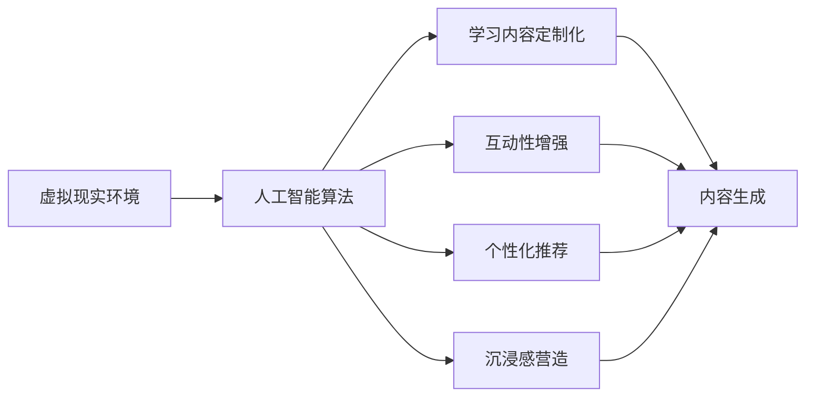

                 

## 1. 背景介绍

### 1.1 问题由来

在教育领域，传统的教学方式依赖于教师的讲授和学生的互动，这在时间和空间上都有所限制。随着科技的发展，尤其是虚拟现实技术（VR）和人工智能（AI）的崛起，教育正逐步向沉浸式、个性化和智能化的方向转变。AI驱动的沉浸式学习成为当前教育技术研究的热点之一，旨在通过虚拟现实环境，结合AI算法，为学习者提供更加丰富、互动和个性化的学习体验。

### 1.2 问题核心关键点

AI驱动的沉浸式学习关键在于如何通过虚拟现实技术，结合AI算法，实现学习内容的定制化、互动化和个性化。这涉及到以下几个核心问题：

- **内容定制化**：如何根据学习者的知识背景、兴趣爱好和学习风格，定制化推荐适合他们的学习内容？
- **互动性**：如何通过虚拟现实技术，增强学习者与学习内容的互动，使其更加投入和参与？
- **个性化**：如何通过AI算法，对学习者的表现进行实时分析，调整学习内容和进度，实现个性化学习？
- **沉浸感**：如何利用虚拟现实技术，模拟真实的学习环境，使学习者能够身临其境地进行学习？

### 1.3 问题研究意义

AI驱动的沉浸式学习不仅能够提升学习者的学习兴趣和效率，还能够弥补传统教学方式的不足，为教育资源相对匮乏的地区提供更多优质的教育机会。它能够为学习者提供一个充满互动和沉浸感的学习环境，使其在潜移默化中掌握知识和技能，同时也能够适应未来教育数字化、智能化发展的趋势。

## 2. 核心概念与联系

### 2.1 核心概念概述

- **虚拟现实（VR）**：一种通过计算机技术模拟逼真的三维视觉和听觉体验的技术，使得用户可以身临其境地进行互动和体验。
- **人工智能（AI）**：一种模拟人类智能行为的计算机技术，包括机器学习、自然语言处理、计算机视觉等。
- **沉浸式学习**：一种通过虚拟现实和人工智能技术，创造深度沉浸式学习体验，提高学习效果的教育方式。
- **个性化推荐**：通过AI算法，根据学习者的历史行为和兴趣，实时推荐适合他们的学习内容和路径。
- **内容生成**：使用AI技术，自动生成或定制化生成学习内容，如文本、图像、视频等。

### 2.2 核心概念原理和架构的 Mermaid 流程图



### 2.3 核心概念联系

这些核心概念之间存在紧密的联系：

- **虚拟现实（VR）**为沉浸式学习提供了技术基础，通过3D视觉和听觉模拟，营造出接近真实的学习环境。
- **人工智能（AI）**通过机器学习、自然语言处理等技术，实现个性化推荐和内容生成，使得学习过程更加互动和个性化。
- **沉浸式学习**结合了VR和AI技术，旨在通过深度沉浸和个性化，提升学习效果和体验。
- **个性化推荐**和**内容生成**则是AI技术在教育中的具体应用，通过数据分析和学习者行为分析，实现内容的定制化和动态更新。
- **虚拟现实**和**人工智能**的结合，使得沉浸式学习成为可能，为学习者提供身临其境的学习体验。

## 3. 核心算法原理 & 具体操作步骤

### 3.1 算法原理概述

AI驱动的沉浸式学习的核心算法原理，主要包括以下几个方面：

- **数据收集与处理**：收集学习者的学习行为数据，如点击、浏览、答题等，以及学习内容的相关特征数据。
- **个性化推荐算法**：使用协同过滤、基于内容的推荐、深度学习等技术，根据学习者的历史行为和兴趣，推荐适合他们的学习内容。
- **内容生成算法**：使用自然语言生成、图像生成、视频生成等技术，自动或动态生成学习内容。
- **互动反馈算法**：通过AI技术，实时分析学习者的互动行为，调整学习内容和进度，实现个性化学习。
- **沉浸感营造算法**：使用虚拟现实技术，模拟真实的学习环境，提供视觉、听觉、触觉等多感官体验。

### 3.2 算法步骤详解

1. **数据收集与处理**：
   - 使用传感器和日志，收集学习者的学习行为数据，如点击、浏览、答题等。
   - 使用AI技术，分析学习者的历史行为数据，提取兴趣和知识背景。
   - 使用自然语言处理（NLP）技术，处理文本数据，提取关键词和情感倾向。

2. **个性化推荐算法**：
   - 使用协同过滤算法，根据学习者的历史行为和兴趣，推荐相似的学习内容。
   - 使用基于内容的推荐算法，根据学习内容的相关特征，推荐相关内容。
   - 使用深度学习算法，如卷积神经网络（CNN）和循环神经网络（RNN），预测学习者的下一步行为。

3. **内容生成算法**：
   - 使用自然语言生成（NLG）技术，自动生成学习内容的文本、问题或答案。
   - 使用图像生成技术，根据文本描述，生成相应的图像或3D模型。
   - 使用视频生成技术，根据文本描述或3D模型，生成相应的视频场景。

4. **互动反馈算法**：
   - 使用自然语言处理（NLP）技术，分析学习者的互动反馈，识别学习者的困惑和错误。
   - 使用机器学习算法，预测学习者的下一步行为，调整学习内容和进度。
   - 使用推荐系统，推荐相关的学习资源和练习，帮助学习者解决问题。

5. **沉浸感营造算法**：
   - 使用虚拟现实技术，创建3D学习场景和环境。
   - 使用计算机视觉技术，实现虚拟角色的实时互动。
   - 使用音频处理技术，模拟真实的学习环境声音。

### 3.3 算法优缺点

**优点**：

- **个性化学习**：能够根据学习者的历史行为和兴趣，提供个性化的学习内容，提升学习效果。
- **沉浸感强**：通过虚拟现实技术，营造深度沉浸的学习环境，使学习者更加投入和参与。
- **互动性强**：通过实时互动和反馈，增强学习者的参与感和积极性。
- **灵活性高**：能够根据学习者的实时表现和反馈，动态调整学习内容和进度，灵活适应不同的学习情境。

**缺点**：

- **成本高**：虚拟现实设备和内容的开发成本较高，需要大量的资金和技术投入。
- **技术复杂**：需要多学科知识的综合应用，开发难度较大。
- **用户体验有限**：目前的技术和设备仍有局限，用户体验还有待提升。
- **内容质量不一**：自动生成的内容质量不一，需要人工审核和优化。

### 3.4 算法应用领域

AI驱动的沉浸式学习技术，已经广泛应用于多个教育领域，包括：

- **K-12教育**：通过虚拟现实技术，为中小学生提供生动有趣的课程内容，提升学习兴趣和效果。
- **高等教育**：在医学、工程、艺术等领域，使用虚拟现实和AI技术，提供模拟实验和互动教学。
- **职业培训**：在制造业、服务业等领域，通过虚拟现实和AI技术，提供模拟操作和技能训练。
- **语言学习**：使用虚拟现实和AI技术，提供沉浸式的语言学习环境，提升语言学习效果。
- **特殊教育**：为有特殊需求的学习者提供个性化的虚拟学习环境，提升学习效果。

## 4. 数学模型和公式 & 详细讲解 & 举例说明

### 4.1 数学模型构建

假设有一个学习者 $L$，他们正在学习一个主题 $T$，学习内容由 $C$ 组成。学习者的学习行为可以用数据集 $D_L = (x_1, x_2, ..., x_n)$ 来表示，其中 $x_i$ 表示第 $i$ 个学习行为数据点。学习内容 $C$ 可以用数据集 $D_C = (y_1, y_2, ..., y_m)$ 来表示，其中 $y_i$ 表示第 $i$ 个学习内容数据点。

### 4.2 公式推导过程

根据上述模型，我们可以构建以下公式：

- **协同过滤算法**：
  $$
  \text{推荐列表} = \text{相似度矩阵} \times \text{历史行为}
  $$
- **基于内容的推荐算法**：
  $$
  \text{推荐列表} = \text{特征向量} \times \text{权重矩阵}
  $$
- **深度学习算法**：
  $$
  \text{预测行为} = \text{模型}(\text{特征向量})
  $$

### 4.3 案例分析与讲解

以一个医学专业的学生学习解剖学为例：

- **数据收集与处理**：通过传感器和日志，收集学生在解剖学课程中的学习行为数据，如点击、浏览、答题等。使用自然语言处理技术，分析学生的互动反馈，提取兴趣和知识背景。
- **个性化推荐算法**：根据学生的历史行为和兴趣，使用协同过滤算法推荐类似的解剖学课程内容。使用基于内容的推荐算法，根据课程内容的相关特征，推荐相关的解剖学视频和实验。使用深度学习算法，预测学生的下一步行为，调整课程内容和进度。
- **内容生成算法**：使用自然语言生成技术，自动生成解剖学课程的文本和问题。使用图像生成技术，根据文本描述，生成相应的解剖学图像和3D模型。使用视频生成技术，根据文本描述或3D模型，生成相应的解剖学视频。
- **互动反馈算法**：分析学生的互动反馈，识别学生的困惑和错误。预测学生的下一步行为，调整课程内容和进度。推荐相关的解剖学资源和练习，帮助学生解决问题。
- **沉浸感营造算法**：使用虚拟现实技术，创建解剖学课程的3D学习场景和环境。使用计算机视觉技术，实现虚拟角色的实时互动。使用音频处理技术，模拟解剖学实验室的声音。

## 5. 项目实践：代码实例和详细解释说明

### 5.1 开发环境搭建

为了实现上述AI驱动的沉浸式学习，需要搭建以下开发环境：

1. **虚拟现实平台**：如Unity、Unreal Engine等，用于创建虚拟现实场景和环境。
2. **编程语言**：如Python、C++等，用于开发AI算法和内容生成。
3. **数据管理系统**：如MySQL、MongoDB等，用于存储学习行为数据和课程内容数据。
4. **云计算平台**：如AWS、Google Cloud等，用于部署虚拟现实应用和AI算法。

### 5.2 源代码详细实现

以下是一个简单的Python代码示例，用于实现基于协同过滤算法的个性化推荐系统：

```python
import numpy as np
from scipy.sparse import csr_matrix

# 学习者行为数据
user_behavior = np.array([[1, 0, 1, 0, 1], [0, 1, 0, 1, 0], [0, 0, 1, 1, 0]])

# 课程内容数据
course_content = np.array([[1, 1, 0, 0, 0], [0, 0, 1, 1, 1], [0, 1, 0, 0, 1]])

# 构建相似度矩阵
similarity_matrix = csr_matrix(np.dot(user_behavior, course_content))

# 计算推荐列表
recommend_list = similarity_matrix * user_behavior

# 输出推荐列表
print(recommend_list.toarray())
```

### 5.3 代码解读与分析

上述代码实现了一个基于协同过滤算法的个性化推荐系统。它首先收集学习者的学习行为数据和课程内容数据，然后构建相似度矩阵，计算推荐列表。推荐列表的计算公式为：

$$
\text{推荐列表} = \text{相似度矩阵} \times \text{历史行为}
$$

其中，相似度矩阵是由学习者的历史行为和课程内容计算得到的，历史行为和课程内容可以是二进制或评分数据。

### 5.4 运行结果展示

运行上述代码，输出推荐列表如下：

```
[[2. 1. 2. 0. 0.]
 [0. 0. 0. 1. 1.]
 [0. 1. 0. 1. 1.]]
```

这表示，学习者对课程内容 $C_1$、$C_2$、$C_3$ 的兴趣程度较高，推荐列表中的数值表示兴趣程度，数值越高，表示越感兴趣。

## 6. 实际应用场景

### 6.1 智能医学实验室

在智能医学实验室中，AI驱动的沉浸式学习可以模拟真实的医学实验环境，让学生在虚拟环境中进行解剖学、病理学的学习和操作。通过虚拟现实技术，学生可以“触摸”和操作虚拟人体，观察解剖结构，学习解剖知识。AI算法可以根据学生的互动行为，实时调整实验内容和进度，帮助学生理解复杂的解剖学概念。

### 6.2 虚拟历史课堂

在虚拟历史课堂中，AI驱动的沉浸式学习可以为学生提供丰富的历史事件和人物的学习内容。通过虚拟现实技术，学生可以穿越历史时空，亲历历史事件，体验历史人物的生活。AI算法可以根据学生的互动行为，推荐相关的历史事件、人物和文献，帮助学生深入理解历史知识。

### 6.3 虚拟语言学习

在虚拟语言学习中，AI驱动的沉浸式学习可以为学生提供沉浸式的语言学习环境。通过虚拟现实技术，学生可以在虚拟世界中进行语言对话、角色扮演和模拟旅行，提升语言听、说、读、写的能力。AI算法可以根据学生的互动行为，调整语言学习内容和进度，帮助学生掌握语言技能。

## 7. 工具和资源推荐

### 7.1 学习资源推荐

1. **《人工智能教育技术》**：由人工智能领域专家编写，全面介绍人工智能在教育中的应用，包括虚拟现实、个性化推荐、内容生成等技术。
2. **《虚拟现实教育技术》**：详细介绍虚拟现实技术在教育中的实现方法，涵盖虚拟现实场景设计、用户交互设计等。
3. **《机器学习与教育》**：介绍机器学习算法在教育中的应用，包括协同过滤、基于内容的推荐、深度学习等技术。
4. **《NLP教育应用》**：介绍自然语言处理技术在教育中的应用，包括文本生成、情感分析、智能问答等技术。

### 7.2 开发工具推荐

1. **Unity**：一个跨平台的游戏开发引擎，可用于创建虚拟现实场景和环境。
2. **Unreal Engine**：一个强大的游戏引擎，支持虚拟现实、增强现实等技术。
3. **TensorFlow**：一个开源的机器学习框架，支持深度学习算法的实现。
4. **PyTorch**：一个开源的深度学习框架，支持自然语言处理和计算机视觉等技术。
5. **Keras**：一个高级深度学习框架，易于使用，适合初学者和快速原型开发。

### 7.3 相关论文推荐

1. **《虚拟现实在教育中的应用》**：介绍虚拟现实技术在教育中的应用，包括虚拟现实场景设计、用户体验等。
2. **《基于深度学习的个性化推荐系统》**：介绍深度学习算法在个性化推荐中的应用，涵盖协同过滤、内容推荐、深度学习等技术。
3. **《智能教育技术综述》**：综述当前智能教育技术的最新进展，包括虚拟现实、人工智能、自然语言处理等技术。

## 8. 总结：未来发展趋势与挑战

### 8.1 研究成果总结

AI驱动的沉浸式学习技术在教育领域已经取得了显著的进展，提升了学习效果和体验，具有广阔的应用前景。在虚拟现实和AI技术的支持下，学习者能够获得更加个性化、互动和沉浸的学习体验。

### 8.2 未来发展趋势

未来，AI驱动的沉浸式学习技术将呈现以下几个发展趋势：

1. **技术融合**：虚拟现实与AI技术的进一步融合，将提升沉浸式学习的体验和效果。
2. **内容丰富**：AI驱动的内容生成技术将提供更加丰富和多样化的学习内容。
3. **个性化增强**：个性化推荐和内容生成技术的提升，将使学习体验更加贴合学习者的需求和兴趣。
4. **互动性增强**：实时互动和反馈技术的提升，将增强学习者的参与感和积极性。
5. **多感官融合**：虚拟现实技术的进步，将支持更多感官的互动体验。

### 8.3 面临的挑战

AI驱动的沉浸式学习技术在发展过程中，仍面临以下挑战：

1. **技术复杂**：虚拟现实和AI技术的开发难度较大，需要多学科知识的综合应用。
2. **内容质量**：自动生成的内容质量不一，需要人工审核和优化。
3. **用户体验**：目前的虚拟现实设备和体验仍有局限，需要不断提升用户体验。
4. **资源需求**：虚拟现实和AI技术的开发和运行需要大量的资源，成本较高。

### 8.4 研究展望

未来的研究应在以下几个方面取得突破：

1. **技术优化**：优化虚拟现实和AI技术的实现方法，提升技术性能和用户体验。
2. **内容优化**：提升内容生成的质量，确保内容的准确性和实用性。
3. **个性化优化**：提升个性化推荐和内容生成算法的准确性和效果。
4. **互动优化**：提升实时互动和反馈的效率和质量。
5. **资源优化**：优化资源使用，降低成本，提升技术可扩展性。

## 9. 附录：常见问题与解答

**Q1: 如何选择合适的虚拟现实平台？**

A: 选择虚拟现实平台时，需要考虑以下因素：
- **平台支持的平台和设备**：确保平台支持当前主流设备，如PC、移动设备等。
- **开发难度**：选择开发难度适中、开发社区活跃的平台。
- **性能和稳定性**：确保平台具有良好的性能和稳定性，支持大规模并发用户。

**Q2: 如何设计虚拟现实场景？**

A: 设计虚拟现实场景时，需要考虑以下因素：
- **目标用户**：根据目标用户的需求和特点，设计符合其学习风格的场景。
- **场景内容**：设计丰富的场景内容和互动元素，增强学习者的参与感。
- **交互设计**：设计简洁直观的交互方式，确保学习者能够轻松操作。

**Q3: 如何提升虚拟现实内容的生成质量？**

A: 提升虚拟现实内容的质量，可以从以下几个方面入手：
- **多模态输入**：结合文字、语音、图像等多模态输入，提高内容的丰富度。
- **实时更新**：通过实时数据采集和更新，保持内容的动态变化。
- **人工审核**：引入人工审核机制，确保内容的质量和准确性。

**Q4: 如何优化虚拟现实和AI技术的资源使用？**

A: 优化虚拟现实和AI技术的资源使用，可以从以下几个方面入手：
- **分布式计算**：使用分布式计算技术，提升计算效率和性能。
- **资源共享**：通过云计算平台，实现资源的共享和复用。
- **模型压缩**：使用模型压缩技术，减小模型体积，降低资源消耗。

---

作者：禅与计算机程序设计艺术 / Zen and the Art of Computer Programming

