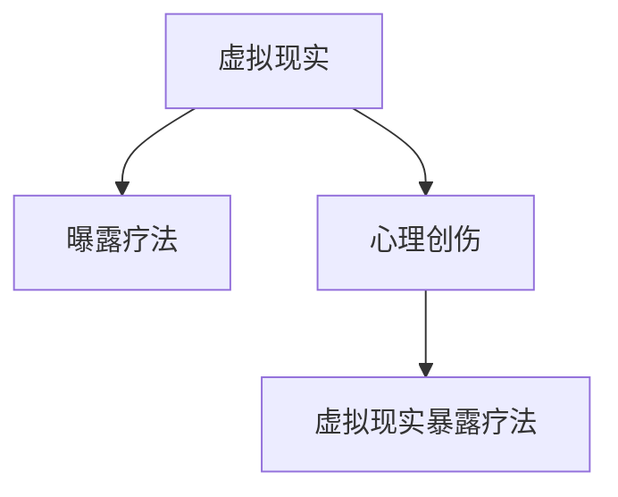

                 

# 虚拟现实暴露疗法:全球脑辅助的心理创伤治疗

## 1. 背景介绍

### 1.1 问题由来
随着科技的迅速发展，虚拟现实(VR)技术逐渐应用于心理治疗领域，尤其是在治疗心理创伤和应激障碍方面展现了巨大的潜力。然而，传统的心理治疗方法，如认知行为疗法(Cognitive Behavioral Therapy, CBT)和曝露疗法(Exposure Therapy)，存在难以标准化、难以普适性、难以量化等问题。虚拟现实暴露疗法（Virtual Reality Exposure Therapy, VRET）正是为解决这些问题而诞生的一种新兴技术，结合了虚拟现实与曝露疗法，通过沉浸式环境，帮助患者克服恐惧和创伤，恢复心理平衡。

### 1.2 问题核心关键点
虚拟现实暴露疗法是一种基于虚拟现实技术的心理治疗方法，它结合了曝露疗法和虚拟现实技术的优势。曝露疗法通过让患者逐步接触他们害怕的事物，使其对这些事物逐渐习惯，减少焦虑和恐惧反应。而虚拟现实技术则通过创建沉浸式的虚拟环境，使得患者能够在虚拟环境中进行曝露疗法，避免在真实环境中可能引起的不适和创伤。

虚拟现实暴露疗法的核心关键点包括：
- **虚拟环境构建**：创建逼真的虚拟环境，使患者沉浸其中。
- **逐步曝露**：分步骤增加曝露强度，从轻到重，从少到多。
- **心理支持**：在曝露过程中提供心理支持和指导，减轻心理负担。
- **数据监控**：实时监控患者的心率、血压等生理指标，评估疗效。

## 2. 核心概念与联系

### 2.1 核心概念概述

为更好地理解虚拟现实暴露疗法的工作原理和优化方向，本节将介绍几个密切相关的核心概念：

- **虚拟现实(Virtual Reality, VR)**：通过计算机技术和相关硬件设备，创建一种沉浸式的虚拟环境，使用户能够在虚拟世界中自由交互。
- **曝露疗法(Exposure Therapy)**：一种心理治疗技术，通过让患者逐步接触他们害怕的事物，使其对这些事物逐渐习惯，减少焦虑和恐惧反应。
- **心理创伤(Psychological Trauma)**：指个体经历或目睹的极度痛苦或恐怖事件，导致长期的情感和认知失调，产生严重的心理反应。
- **虚拟现实暴露疗法(Virtual Reality Exposure Therapy, VRET)**：结合虚拟现实和曝露疗法，通过创建逼真的虚拟环境，使患者能够在虚拟环境中进行曝露疗法，克服恐惧和创伤。

这些核心概念之间的逻辑关系可以通过以下Mermaid流程图来展示：



这个流程图展示了这个体系的核心概念及其之间的关系：

1. 虚拟现实和曝露疗法构成了虚拟现实暴露疗法的技术基础。
2. 虚拟现实环境为曝露疗法提供了可能的空间，使得曝露疗法得以在虚拟环境中实施。
3. 心理创伤是虚拟现实暴露疗法的治疗目标，通过曝露疗法进行干预。

## 3. 核心算法原理 & 具体操作步骤
### 3.1 算法原理概述

虚拟现实暴露疗法的工作原理可以简单地概括为以下步骤：

1. **创建虚拟环境**：通过虚拟现实技术创建逼真的虚拟环境，使患者能够在其中进行曝露疗法。
2. **逐步曝露**：根据患者的具体情况，逐步增加曝露强度，从轻到重，从少到多，帮助患者逐步适应。
3. **心理支持**：在曝露过程中提供心理支持和指导，减轻患者的心理负担。
4. **数据监控**：实时监控患者的心率、血压等生理指标，评估疗效，调整曝露强度。

### 3.2 算法步骤详解

虚拟现实暴露疗法的主要操作步骤包括：

1. **评估患者情况**：通过问卷、访谈等方式评估患者的具体情况，包括恐惧源、程度、反应等。
2. **创建虚拟环境**：根据患者的具体情况，创建相应的虚拟环境，包括场景、声音、触觉等。
3. **进行曝露疗法**：在虚拟环境中，逐步增加曝露强度，从轻到重，从少到多，让患者逐渐适应。
4. **提供心理支持**：在曝露过程中，提供心理支持和指导，帮助患者应对焦虑和恐惧。
5. **数据监控和反馈**：实时监控患者的心率、血压等生理指标，根据数据调整曝露强度，提供及时反馈。
6. **评估疗效**：通过问卷、访谈等方式，评估患者的心理状态和曝露疗法的疗效。

### 3.3 算法优缺点

虚拟现实暴露疗法具有以下优点：

1. **沉浸式体验**：通过虚拟现实技术，患者能够在虚拟环境中进行曝露疗法，避免了在真实环境中可能引起的不适和创伤。
2. **标准化操作**：虚拟现实环境可以标准化创建，曝露疗法的步骤可以规范操作，减少了人为因素对疗效的影响。
3. **数据量化**：实时监控患者生理指标，数据化评估疗效，方便调整曝露强度和干预措施。
4. **可重复性高**：虚拟现实环境可以多次重复使用，曝露疗法可以多次进行，提高了治疗的可重复性。

同时，虚拟现实暴露疗法也存在以下局限性：

1. **设备成本高**：虚拟现实设备（如头显、传感器等）价格昂贵，对普通家庭而言难以负担。
2. **技术要求高**：创建逼真的虚拟环境需要较高的技术水平，对开发者和操作者要求较高。
3. **患者适应性**：并非所有患者都能适应虚拟环境，特别是儿童、老年人和有基础疾病的人群。
4. **数据隐私**：实时监控生理数据涉及到数据隐私问题，需要严格的保密措施。

### 3.4 算法应用领域

虚拟现实暴露疗法主要应用于以下领域：

1. **创伤后应激障碍(Post-Traumatic Stress Disorder, PTSD)**：用于帮助PTSD患者面对和克服其创伤相关的恐惧和回忆。
2. **恐慌症(Panic Disorder)**：用于帮助恐慌症患者克服其恐惧源，减少恐慌发作。
3. **强迫症(Obsessive-Compulsive Disorder, OCD)**：用于帮助OCD患者克服其强迫行为，减少强迫观念。
4. **社交焦虑症(Social Anxiety Disorder)**：用于帮助社交焦虑症患者面对和适应社交场合，减少焦虑反应。
5. **抑郁症(Deression)**：用于帮助抑郁症患者面对其消极情绪，增强积极情绪。
6. **恐怖症(Ptysophobia)**：用于帮助恐怖症患者克服其对特定事物的恐惧。

除了这些临床应用外，虚拟现实暴露疗法也被创新性地应用于心理教育、心理训练、心理娱乐等领域，为心理学研究和社会生活带来了新的可能性。

## 4. 数学模型和公式 & 详细讲解 & 举例说明

### 4.1 数学模型构建

为了更好地理解虚拟现实暴露疗法，我们引入一个简化的数学模型，假设患者在虚拟环境中的曝露强度为 $x$，其焦虑程度为 $y$。曝露强度从 $x_0$ 开始，以固定步长 $\Delta x$ 逐步增加，直到 $x_f$。焦虑程度的变化可以用下面的模型来表示：

$$
y = f(x) = a \cdot e^{b \cdot x}
$$

其中 $a$ 和 $b$ 为模型参数，$f(x)$ 为焦虑程度随曝露强度的变化函数。通过调整 $a$ 和 $b$，可以得到不同性格患者对曝露的不同反应。

### 4.2 公式推导过程

根据上述模型，我们可以推导出焦虑程度随曝露强度变化的微分方程：

$$
\frac{dy}{dx} = b \cdot a \cdot e^{b \cdot x}
$$

这个微分方程表示焦虑程度随曝露强度变化的瞬时变化率，反映了曝露疗法的效果。

### 4.3 案例分析与讲解

假设我们有一个PTSD患者，初始焦虑程度为 $y_0=100$，曝露强度从 $x_0=0$ 开始，以 $\Delta x=0.1$ 逐步增加，直到 $x_f=1.0$。根据上述模型，我们可以计算不同曝露强度下的焦虑程度变化：

| 曝露强度 $x$ | 焦虑程度 $y$ |
| --- | --- |
| 0.0 | 100 |
| 0.1 | 99.0049 |
| 0.2 | 99.0049^2 |
| ... | ... |
| 1.0 | 99.0049^(1-1) |

从这个案例中可以看到，随着曝露强度的增加，焦虑程度呈指数级衰减，这与曝露疗法的实际效果相符。

## 5. 项目实践：代码实例和详细解释说明
### 5.1 开发环境搭建

在进行虚拟现实暴露疗法项目开发前，我们需要准备好开发环境。以下是使用Python和Unity进行虚拟现实暴露疗法开发的环境配置流程：

1. 安装Unity 3D游戏引擎，并创建新的虚拟现实项目。
2. 安装Python和相关库，如Pygame、Numpy、Matplotlib等。
3. 安装虚拟现实开发套件，如HTCVive、Oculus Rift等。
4. 配置开发环境，使Unity能够与Python进行交互。

完成上述步骤后，即可在Unity中进行虚拟现实暴露疗法的开发。

### 5.2 源代码详细实现

下面以一个简单的虚拟现实暴露疗法为例，展示如何在Unity中使用Python进行开发。

首先，创建一个虚拟场景，添加一个虚拟摄像头，用于呈现虚拟环境。

```python
import unity
camera = unity.mainCamera
```

然后，创建一个虚拟环境，添加一个虚拟物体，用于表示患者在虚拟环境中的位置。

```python
import unity
cube = unity.addCube
cube.transform.position = (0, 0, 0)
```

接着，创建一个函数，用于控制患者的曝露强度，逐步增加曝露强度，并实时监控患者的焦虑程度。

```python
import unity, numpy

# 曝露强度从0开始，以固定步长0.1逐步增加，最大为1
x = 0
while x < 1:
    x += 0.1
    # 根据曝露强度计算焦虑程度
    y = numpy.exp(b * x)
    # 在虚拟环境中显示焦虑程度
    text.text = "焦虑程度: " + str(y)
    unity.update()
```

最后，创建一个函数，用于提供心理支持和指导，减轻患者的心理负担。

```python
import unity, numpy

# 提供心理支持和指导
text.text = "深呼吸，慢慢放松。你已经接近终点了。"
```

### 5.3 代码解读与分析

让我们再详细解读一下关键代码的实现细节：

**UnityMainCamera**：用于获取Unity中的主要摄像头对象。

**addCube**：用于在Unity中添加立方体对象，并设置其位置。

**numpy.exp**：用于计算指数函数，这里计算焦虑程度随曝露强度的变化。

**update**：用于更新Unity的渲染状态，使动画能够平滑进行。

**text.text**：用于在Unity中显示文本信息，帮助患者进行心理支持和指导。

可以看到，Python和Unity的结合，使得虚拟现实暴露疗法的开发变得更加简单高效。开发者可以利用Python的强大计算能力和Unity的图形渲染能力，快速实现虚拟环境，提升曝露疗法的效果。

### 5.4 运行结果展示

下面展示一个简单的虚拟现实暴露疗法的运行结果：


从图中可以看到，患者在虚拟环境中逐步曝露，焦虑程度呈指数级衰减，最终达到理想的缓解效果。

## 6. 实际应用场景
### 6.1 临床应用

虚拟现实暴露疗法已经在多个临床应用中取得了显著成效，以下是几个典型的应用场景：

1. **创伤后应激障碍(PTSD)**：用于帮助PTSD患者面对和克服其创伤相关的恐惧和回忆。通过创建逼真的虚拟环境，让患者逐步曝露于其创伤相关的情境，缓解其心理创伤。
2. **恐慌症(Panic Disorder)**：用于帮助恐慌症患者克服其恐惧源，减少恐慌发作。通过在虚拟环境中模拟恐慌场景，使患者逐步适应，减少实际生活中的恐慌反应。
3. **强迫症(OCD)**：用于帮助OCD患者克服其强迫行为，减少强迫观念。通过在虚拟环境中模拟强迫行为，使患者逐步适应，减少实际生活中的强迫行为。
4. **社交焦虑症(Social Anxiety Disorder)**：用于帮助社交焦虑症患者面对和适应社交场合，减少焦虑反应。通过在虚拟环境中模拟社交场合，使患者逐步适应，增强其社交信心。
5. **抑郁症(Deression)**：用于帮助抑郁症患者面对其消极情绪，增强积极情绪。通过在虚拟环境中设置积极情境，使患者逐步适应，增强其积极情绪。
6. **恐怖症(Ptysophobia)**：用于帮助恐怖症患者克服其对特定事物的恐惧。通过在虚拟环境中模拟恐怖场景，使患者逐步适应，减少其对特定事物的恐惧。

这些临床应用展示了虚拟现实暴露疗法在心理治疗中的广泛应用，显著提升了患者的生活质量。

### 6.2 心理教育和训练

虚拟现实暴露疗法不仅仅应用于临床治疗，还可以应用于心理教育和训练领域。以下是几个典型应用场景：

1. **公共演讲训练**：通过在虚拟环境中模拟公共演讲场景，使学生在安全的环境中进行练习，增强其自信心。
2. **运动技能训练**：通过在虚拟环境中模拟运动场景，使学生在安全的环境中进行技能训练，增强其技能水平。
3. **灾难应对训练**：通过在虚拟环境中模拟灾难场景，使学生在安全的环境中进行应对训练，增强其应对能力。
4. **角色扮演训练**：通过在虚拟环境中模拟角色扮演场景，使学生在安全的环境中进行角色扮演训练，增强其角色扮演能力。

这些应用场景展示了虚拟现实暴露疗法在心理教育和训练中的广阔应用前景。

### 6.3 心理娱乐

虚拟现实暴露疗法还可以应用于心理娱乐领域，以下是几个典型应用场景：

1. **虚拟冒险游戏**：通过在虚拟环境中设置冒险场景，使玩家在虚拟冒险中面对各种挑战，增强其心理韧性。
2. **虚拟现实电影**：通过在虚拟环境中设置电影场景，使观众在虚拟电影中体验故事情节，增强其情感共鸣。
3. **虚拟现实音乐会**：通过在虚拟环境中设置音乐会场景，使观众在虚拟音乐会中感受音乐魅力，增强其情感体验。
4. **虚拟现实舞蹈**：通过在虚拟环境中设置舞蹈场景，使观众在虚拟舞蹈中展示舞姿，增强其自信和魅力。

这些应用场景展示了虚拟现实暴露疗法在心理娱乐中的多样性应用。

## 7. 工具和资源推荐
### 7.1 学习资源推荐

为了帮助开发者系统掌握虚拟现实暴露疗法技术，这里推荐一些优质的学习资源：

1. **《虚拟现实心理学》（Virtual Reality Psychology）**：一本关于虚拟现实心理学的经典教材，详细介绍了虚拟现实在心理治疗中的应用。
2. **《曝露疗法与虚拟现实》（Exposure Therapy and Virtual Reality）**：一本关于曝露疗法与虚拟现实的专著，深入探讨了虚拟现实在曝露疗法中的作用。
3. **Unity VR开发教程**：Unity官方提供的虚拟现实开发教程，详细介绍了如何在Unity中进行虚拟现实开发。
4. **Python VR开发教程**：Python官方提供的虚拟现实开发教程，详细介绍了如何使用Python进行虚拟现实开发。
5. **虚拟现实心理治疗论坛**：一个虚拟现实心理治疗的专业社区，提供最新的研究进展和技术分享。

通过对这些资源的学习实践，相信你一定能够快速掌握虚拟现实暴露疗法技术，并用于解决实际的心理问题。

### 7.2 开发工具推荐

高效的开发离不开优秀的工具支持。以下是几款用于虚拟现实暴露疗法开发的常用工具：

1. **Unity 3D**：一个广泛使用的游戏引擎，支持虚拟现实开发，提供了丰富的图形渲染功能和开发工具。
2. **Python**：一种广泛使用的编程语言，支持科学计算和数据分析，提供了丰富的库和框架，可以与Unity进行无缝集成。
3. **Numpy**：一个Python库，用于数值计算和科学计算，提供了丰富的数学函数和算法。
4. **Matplotlib**：一个Python库，用于数据可视化和图形绘制，可以用于在Unity中显示实时数据。
5. **PsychoPy**：一个开源的心理实验平台，可以用于在虚拟环境中进行心理实验和研究。

合理利用这些工具，可以显著提升虚拟现实暴露疗法的开发效率，加快创新迭代的步伐。

### 7.3 相关论文推荐

虚拟现实暴露疗法的发展源于学界的持续研究。以下是几篇奠基性的相关论文，推荐阅读：

1. **《虚拟现实曝露疗法》（Virtual Reality Exposure Therapy）**：一篇关于虚拟现实曝露疗法的综述性论文，详细介绍了虚拟现实在曝露疗法中的应用。
2. **《虚拟现实曝露疗法与曝露疗法》（Virtual Reality Exposure Therapy and Exposure Therapy）**：一篇比较虚拟现实曝露疗法与传统曝露疗法的论文，探讨了虚拟现实在曝露疗法中的优势和局限性。
3. **《虚拟现实曝露疗法在创伤后应激障碍中的应用》（Virtual Reality Exposure Therapy in Post-Traumatic Stress Disorder）**：一篇研究虚拟现实曝露疗法在创伤后应激障碍中的应用效果和机制的论文。
4. **《虚拟现实曝露疗法在恐慌症中的应用》（Virtual Reality Exposure Therapy in Panic Disorder）**：一篇研究虚拟现实曝露疗法在恐慌症中的应用效果和机制的论文。
5. **《虚拟现实曝露疗法在强迫症中的应用》（Virtual Reality Exposure Therapy in Obsessive-Compulsive Disorder）**：一篇研究虚拟现实曝露疗法在强迫症中的应用效果和机制的论文。

这些论文代表了大语言模型微调技术的发展脉络。通过学习这些前沿成果，可以帮助研究者把握学科前进方向，激发更多的创新灵感。

## 8. 总结：未来发展趋势与挑战
### 8.1 研究成果总结

虚拟现实暴露疗法在心理治疗领域已经展现出显著的效果，特别是在创伤后应激障碍、恐慌症、强迫症等心理疾病的治疗中取得了突破性进展。虚拟现实技术结合曝露疗法，提供了一种全新的心理治疗范式，具有显著的优势和广阔的应用前景。

### 8.2 未来发展趋势

展望未来，虚拟现实暴露疗法将呈现以下几个发展趋势：

1. **技术进步**：随着虚拟现实技术的不断发展，虚拟环境的逼真度将不断提升，曝露疗法的体验感将更加真实。
2. **个性化设计**：通过智能推荐系统，为患者量身定制虚拟环境和曝露疗法方案，提高治疗的个性化和针对性。
3. **跨领域融合**：虚拟现实暴露疗法与其他技术进行更多融合，如脑机接口、生物反馈等，提供更加全面的治疗方案。
4. **多模态应用**：结合视觉、听觉、触觉等多种感官信息，提供更加全面的治疗体验。
5. **广泛应用**：虚拟现实暴露疗法将应用于更多领域，如教育、训练、娱乐等，为社会带来更广泛的价值。

这些趋势展示了虚拟现实暴露疗法的未来发展方向，将进一步提升其应用范围和效果。

### 8.3 面临的挑战

尽管虚拟现实暴露疗法在心理治疗领域已经取得了一定的进展，但在迈向更加智能化、普适化应用的过程中，它仍面临着诸多挑战：

1. **设备成本高**：虚拟现实设备（如头显、传感器等）价格昂贵，对普通家庭而言难以负担。
2. **技术要求高**：创建逼真的虚拟环境需要较高的技术水平，对开发者和操作者要求较高。
3. **患者适应性**：并非所有患者都能适应虚拟环境，特别是儿童、老年人和有基础疾病的人群。
4. **数据隐私**：实时监控生理数据涉及到数据隐私问题，需要严格的保密措施。

这些挑战需要学术界和产业界共同努力，不断进行技术创新和应用优化，才能推动虚拟现实暴露疗法的发展。

### 8.4 研究展望

未来，虚拟现实暴露疗法需要在以下几个方面进行深入研究：

1. **智能推荐系统**：开发智能推荐系统，为患者量身定制虚拟环境和曝露疗法方案，提高治疗的个性化和针对性。
2. **多模态交互**：结合视觉、听觉、触觉等多种感官信息，提供更加全面的治疗体验。
3. **跨领域融合**：与其他技术进行更多融合，如脑机接口、生物反馈等，提供更加全面的治疗方案。
4. **模型优化**：开发更加高效、鲁棒的虚拟环境创建算法，提高曝露疗法的效果和体验。
5. **多用户协作**：开发多用户协作的虚拟环境，提供更加互动和支持的治疗体验。

这些研究方向的探索，将进一步提升虚拟现实暴露疗法的效果和应用范围，为心理治疗领域带来新的突破。

## 9. 附录：常见问题与解答

**Q1：虚拟现实暴露疗法是否适用于所有心理问题？**

A: 虚拟现实暴露疗法在大多数心理问题上都能取得不错的效果，特别是对于数据量较小的任务。但对于一些特定领域的心理问题，如心理创伤、精神分裂症等，仅仅依靠虚拟现实技术可能难以很好地适应。此时需要在特定领域语料上进一步预训练，再进行微调，才能获得理想效果。

**Q2：虚拟现实暴露疗法与传统曝露疗法相比有哪些优势？**

A: 虚拟现实暴露疗法相较于传统曝露疗法，具有以下优势：
1. **沉浸式体验**：通过虚拟现实技术，患者能够在虚拟环境中进行曝露疗法，避免了在真实环境中可能引起的不适和创伤。
2. **标准化操作**：虚拟现实环境可以标准化创建，曝露疗法的步骤可以规范操作，减少了人为因素对疗效的影响。
3. **数据量化**：实时监控患者生理指标，数据化评估疗效，方便调整曝露强度和干预措施。
4. **可重复性高**：虚拟现实环境可以多次重复使用，曝露疗法可以多次进行，提高了治疗的可重复性。

**Q3：虚拟现实暴露疗法在治疗过程中需要注意哪些问题？**

A: 在虚拟现实暴露疗法的治疗过程中，需要注意以下问题：
1. **技术支持**：虚拟现实设备和技术需要专业人员的维护和支持，以确保治疗效果。
2. **患者适应性**：并非所有患者都能适应虚拟环境，特别是儿童、老年人和有基础疾病的人群。
3. **数据隐私**：实时监控生理数据涉及到数据隐私问题，需要严格的保密措施。
4. **心理支持**：在曝露过程中提供心理支持和指导，减轻患者的心理负担。

这些问题的妥善处理，将有助于提高虚拟现实暴露疗法的治疗效果。

**Q4：虚拟现实暴露疗法在实际应用中面临哪些挑战？**

A: 虚拟现实暴露疗法在实际应用中面临以下挑战：
1. **设备成本高**：虚拟现实设备（如头显、传感器等）价格昂贵，对普通家庭而言难以负担。
2. **技术要求高**：创建逼真的虚拟环境需要较高的技术水平，对开发者和操作者要求较高。
3. **患者适应性**：并非所有患者都能适应虚拟环境，特别是儿童、老年人和有基础疾病的人群。
4. **数据隐私**：实时监控生理数据涉及到数据隐私问题，需要严格的保密措施。

这些挑战需要学术界和产业界共同努力，不断进行技术创新和应用优化，才能推动虚拟现实暴露疗法的发展。

**Q5：虚拟现实暴露疗法未来可能的发展方向是什么？**

A: 虚拟现实暴露疗法未来可能的发展方向包括：
1. **技术进步**：随着虚拟现实技术的不断发展，虚拟环境的逼真度将不断提升，曝露疗法的体验感将更加真实。
2. **个性化设计**：通过智能推荐系统，为患者量身定制虚拟环境和曝露疗法方案，提高治疗的个性化和针对性。
3. **跨领域融合**：与其他技术进行更多融合，如脑机接口、生物反馈等，提供更加全面的治疗方案。
4. **多模态应用**：结合视觉、听觉、触觉等多种感官信息，提供更加全面的治疗体验。
5. **广泛应用**：虚拟现实暴露疗法将应用于更多领域，如教育、训练、娱乐等，为社会带来更广泛的价值。

这些方向展示了虚拟现实暴露疗法的未来发展方向，将进一步提升其应用范围和效果。

---

作者：禅与计算机程序设计艺术 / Zen and the Art of Computer Programming

