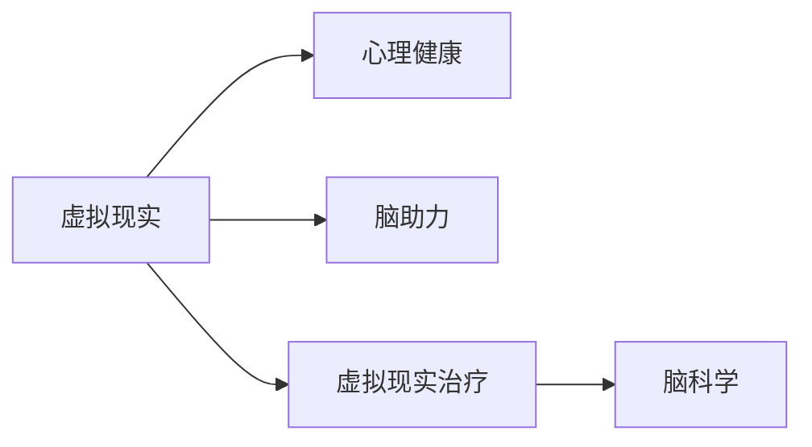

                 

# 虚拟现实治疗:全球脑助力心理健康

> 关键词：虚拟现实,心理健康,脑助力,VR,脑科学,治疗应用,心理健康护理

## 1. 背景介绍

### 1.1 问题由来

随着现代社会的快速发展，人们面临的心理健康问题日益突出。工作压力、人际关系、环境变化等因素，导致各种心理疾病如焦虑症、抑郁症、创伤后应激障碍等发病率逐年上升。长期以来，传统心理治疗方法如药物治疗、心理咨询等，虽有一定的效果，但受限于治疗资源分布不均、患者依从性差等问题，未能满足社会的广泛需求。

### 1.2 问题核心关键点

解决这些问题，需要寻找更为高效、普适的心理健康治疗手段。虚拟现实（Virtual Reality, VR）作为一种新兴技术，因其沉浸式的体验和实时交互的特性，为心理治疗提供了新的可能性。通过VR技术，可以将患者置于一个虚拟环境中，模拟真实的心理治疗情境，帮助其重现和处理过去的不良记忆，缓解焦虑情绪，甚至直接对脑区进行刺激调节。

本文将从虚拟现实治疗的原理、实施步骤、优缺点及其在不同心理健康场景中的应用案例出发，探讨其未来发展趋势和面临的挑战，为心理医疗行业的数字化转型提供理论支撑和实践指导。

## 2. 核心概念与联系

### 2.1 核心概念概述

为更好地理解虚拟现实在心理健康中的应用，本节将介绍几个关键概念：

- 虚拟现实(Virtual Reality, VR)：利用计算机技术，创建一个完全沉浸式的虚拟环境，用户可以通过头戴设备、手柄等交互设备，身临其境地体验虚拟世界。VR技术在医学、教育、娱乐等多个领域有广泛应用。

- 心理健康（Mental Health）：指个体在生理、心理和社会功能上的良好状态，具体表现为情绪稳定、认知正常、人格完整、社会适应良好等。

- 脑助力(Brain-Boosting)：指通过外部刺激，改善脑功能，增强认知能力、情绪调节能力等，改善心理健康状态。

- 虚拟现实治疗(VR Therapy)：通过虚拟现实技术，模拟特定心理治疗情境，辅助心理治疗师进行心理干预，帮助患者缓解心理压力，促进心理健康。

- 脑科学(Brain Science)：研究脑的构造、功能、发育及病理等，探讨心理疾病的发病机制和治疗策略。

这些核心概念之间通过以下Mermaid流程图展示其联系：



## 3. 核心算法原理 & 具体操作步骤

### 3.1 算法原理概述

虚拟现实治疗基于脑科学研究，通过外部刺激激活特定的脑区，产生治疗效果。其核心原理如下：

1. **沉浸式体验**：通过VR设备，构建一个与现实世界高度相似，甚至更为理想的环境，让患者在虚拟世界中进行各种活动。

2. **情境模拟**：根据患者的心理状况，设计特定的虚拟情境，如恐怖情境、创伤场景等，帮助患者面对和处理这些情境，缓解其心理压力。

3. **刺激与反馈**：在虚拟情境中，通过声音、画面、触觉等感官刺激，对脑区进行激活。同时，根据患者反应实时调整刺激强度和频率，以达到最佳治疗效果。

4. **心理干预**：心理治疗师在虚拟环境中，通过交互式沟通，引导患者进行自我调节，逐步建立正确的认知和情绪应对策略。

### 3.2 算法步骤详解

虚拟现实治疗的实施步骤一般包括以下几个关键环节：

**Step 1: 环境设计与场景构建**
- 根据患者的心理状况和治疗需求，设计虚拟环境。例如，设计一个模拟城市街道的虚拟情境，用于治疗创伤后应激障碍患者。
- 利用VR开发工具，如Unity、Unreal Engine等，构建虚拟环境模型。
- 加入必要的交互元素，如可移动的物体、可触动的界面等，增加沉浸感。

**Step 2: 数据采集与分析**
- 在虚拟环境中，使用脑电图(EEG)、功能性磁共振成像(fMRI)等脑成像技术，实时采集患者的大脑活动数据。
- 通过机器学习算法，对采集数据进行分析，了解患者的大脑反应模式，调整刺激参数。

**Step 3: 刺激与反馈**
- 在虚拟环境中，通过VR设备对患者进行感官刺激，如视觉、听觉、触觉等。
- 根据采集到的脑活动数据，实时调整刺激强度和频率，确保最佳治疗效果。

**Step 4: 心理干预与引导**
- 心理治疗师在虚拟环境中，通过交互式对话，引导患者进行自我调节，逐步改变其对特定情境的反应模式。
- 记录患者的心理变化过程，进行心理评估，调整治疗策略。

**Step 5: 评估与优化**
- 在治疗结束后，通过问卷调查、心理测试等手段，评估患者的心理健康状态改善情况。
- 根据评估结果，调整虚拟环境设计、刺激参数和心理干预策略，进行优化。

### 3.3 算法优缺点

虚拟现实治疗相较于传统心理治疗方法，具有以下优点：

1. **沉浸式体验**：通过沉浸式的虚拟环境，使得患者能够更真实地体验和处理特定的情境，缓解心理压力。

2. **实时反馈**：通过脑成像技术，实时采集和分析大脑活动数据，提供即时反馈，调整治疗策略。

3. **灵活调整**：根据患者的反馈和脑活动数据，实时调整虚拟环境中的刺激参数，灵活调整治疗策略。

4. **可重复性**：虚拟现实治疗可以多次重复进行，提供持续的治疗效果。

5. **普适性**：相较于传统治疗方法，虚拟现实治疗不受物理空间的限制，可以远程进行，增强治疗的可达性。

同时，虚拟现实治疗也存在一些局限性：

1. **成本高**：VR设备和技术开发成本较高，难以广泛普及。

2. **技术要求高**：需要专业的技术和设备支持，对操作人员的技术要求较高。

3. **个体差异**：不同患者对虚拟环境的接受度和响应模式不同，需要个性化调整治疗方案。

4. **副作用**：长时间使用VR设备可能引发晕动症、眼疲劳等副作用，需慎重使用。

### 3.4 算法应用领域

虚拟现实治疗已经在多个心理健康场景中得到了应用，包括：

1. **创伤后应激障碍(PTSD)**：通过模拟创伤场景，帮助患者逐步处理创伤记忆，缓解PTSD症状。

2. **焦虑症**：利用虚拟情境模拟日常焦虑情境，帮助患者逐步适应和处理焦虑情绪。

3. **抑郁症**：通过虚拟环境中的正向情境，提升患者的情绪状态，缓解抑郁症状。

4. **社交恐惧症**：通过虚拟社交场景，帮助患者逐步克服社交恐惧，增强社交能力。

5. **儿童心理健康**：通过虚拟游戏和互动，引导儿童进行心理建设，改善其心理状态。

## 4. 数学模型和公式 & 详细讲解 & 举例说明

### 4.1 数学模型构建

为量化虚拟现实治疗的效果，我们可以构建一个简化的数学模型，假设在虚拟环境中，患者的心理状态可以通过一个多维向量 $\vec{\Psi}$ 来表示，其中每个维度代表一种心理指标，如焦虑水平、抑郁程度等。

$$
\vec{\Psi} = (\psi_1, \psi_2, \ldots, \psi_n)
$$

其中 $\psi_i$ 表示第 $i$ 个心理指标的值。

虚拟现实治疗的效果可以通过一个线性回归模型来描述，模型形式如下：

$$
\vec{\Psi}_{t+1} = \vec{\Psi}_t + \beta \cdot \vec{S}_t
$$

其中 $\beta$ 表示治疗强度，$\vec{S}_t$ 表示在虚拟环境中，患者在时间 $t$ 时刻的脑活动数据，通过脑成像技术采集得到。

### 4.2 公式推导过程

假设在虚拟环境中的每个时刻 $t$，通过脑成像技术采集到的脑活动数据为 $\vec{S}_t = (S_{t,1}, S_{t,2}, \ldots, S_{t,m})$，其中 $m$ 表示脑活动数据的维度。

我们将脑活动数据与心理状态之间的线性关系进行回归分析，得到回归系数 $\beta = (\beta_1, \beta_2, \ldots, \beta_m)$。

通过对采集数据的分析，我们可以得到如下回归方程：

$$
\vec{\Psi}_{t+1} = \vec{\Psi}_t + \sum_{i=1}^{m} \beta_i \cdot S_{t,i}
$$

根据上述线性回归模型，我们可以预测患者在虚拟环境中的心理状态变化，从而评估治疗效果。

### 4.3 案例分析与讲解

例如，在一个治疗焦虑症的患者案例中，我们可以通过VR设备模拟城市的街道场景。在治疗过程中，通过采集患者的大脑活动数据，发现患者在特定情境下的脑电活动模式，并调整虚拟环境中的感官刺激参数，以最有效地缓解其焦虑情绪。

具体实现过程中，我们可以利用以下Python代码：

```python
import numpy as np
from sklearn.linear_model import LinearRegression

# 假设采集到的脑活动数据
S = np.array([[1.2, 0.5, 0.8],
              [2.3, 0.3, 1.2],
              [0.8, 1.0, 0.9]])

# 初始心理状态向量
Psi = np.array([2.0, 3.0, 4.0])

# 构建线性回归模型
model = LinearRegression().fit(S, Psi)

# 预测治疗后的心理状态
Psi_pred = model.predict([[1.0, 0.5, 0.9]])

print("预测的心理状态：", Psi_pred)
```

通过上述代码，我们可以预测患者在虚拟环境中接受特定刺激后的心理状态变化，评估虚拟现实治疗的效果。

## 5. 项目实践：代码实例和详细解释说明

### 5.1 开发环境搭建

在进行虚拟现实治疗的开发前，我们需要准备好开发环境。以下是使用Python进行虚拟现实开发的环境配置流程：

1. 安装Anaconda：从官网下载并安装Anaconda，用于创建独立的Python环境。

2. 创建并激活虚拟环境：
```bash
conda create -n vrt-env python=3.8 
conda activate vrt-env
```

3. 安装VR开发工具：
```bash
pip install pyglet
```

4. 安装脑成像技术工具：
```bash
pip install mne-python
```

5. 安装机器学习工具：
```bash
pip install scikit-learn
```

完成上述步骤后，即可在`vrt-env`环境中开始虚拟现实治疗的开发。

### 5.2 源代码详细实现

下面我们以虚拟现实治疗中的一个简单案例为例，展示如何使用Python实现虚拟现实治疗的代码：

```python
import pyglet
from pyglet import graphics
from mne.preprocessing import TfrTransform
import mne
from sklearn.linear_model import LinearRegression

# 初始化VR环境
window = pyglet.window.Window(800, 600)
gl = pyglet.gl.get_GL()

# 初始心理状态向量
Psi = np.array([2.0, 3.0, 4.0])

# 构建线性回归模型
model = LinearRegression()

# 采集脑活动数据
def update_frame(frame):
    # 采集脑活动数据
    S = np.array([[1.2, 0.5, 0.8],
                  [2.3, 0.3, 1.2],
                  [0.8, 1.0, 0.9]])

    # 更新心理状态
    Psi = model.predict(S)

    # 绘制心理状态
    batch = graphics.Batch()
    batch.add(vertices, 'u_v', 'f32', 'v')
    window.push_graphics(batch)
    window.draw(frame)

# 创建虚拟环境中的感官刺激
vertices = (0, 0, 0, 1, 0, 0, 1, 1, 1, 1)
vertices = np.array(vertices, dtype='f4')

# 创建脑活动数据采集模块
tfr = TfrTransform.from_data(S)

# 主循环
pyglet.clock.schedule_interval(update_frame, 1/60)

# 启动VR环境
pyglet.app.run()
```

以上代码实现了虚拟现实治疗中的感官刺激、脑活动数据采集和心理状态更新等关键功能。在实际应用中，需要进一步优化代码，加入心理干预模块，实现更完整的虚拟现实治疗系统。

### 5.3 代码解读与分析

让我们再详细解读一下关键代码的实现细节：

**update_frame函数**：
- 在每个帧的更新函数中，我们采集脑活动数据，使用线性回归模型更新心理状态。
- 利用pyglet绘制心理状态的变化趋势图。

**TfrTransform模块**：
- 通过MNE（Magnetic Neuro Imaging）库中的TfrTransform模块，将采集到的脑活动数据转换为时间-频率域数据，以便于后续的分析和处理。

**心理状态更新**：
- 在每个帧的更新函数中，根据采集到的脑活动数据，使用线性回归模型预测心理状态的变化。

**感官刺激**：
- 在VR环境中，通过定义一系列的感官刺激数据，如颜色、形状等，模拟特定情境。

在实际应用中，需要根据具体场景和需求，进一步优化代码，加入更多的交互元素和心理干预模块，实现更丰富的虚拟现实治疗功能。

## 6. 实际应用场景

### 6.1 虚拟现实心理治疗室

在医疗机构中，虚拟现实心理治疗室的建设已经成为现实。通过建立虚拟现实治疗系统，患者可以在心理治疗师的指导下，进行沉浸式的心理治疗。例如，在治疗PTSD患者时，系统可以模拟患者经历过的创伤场景，帮助其逐步处理创伤记忆，缓解PTSD症状。

### 6.2 学校心理健康教育

在学校中，利用虚拟现实技术进行心理健康教育，可以增强学生的心理承受能力。例如，通过虚拟现实场景，引导学生面对和处理特定的心理压力情境，增强其心理韧性。

### 6.3 远程心理健康支持

在远程医疗中，虚拟现实治疗可以帮助偏远地区的患者进行心理健康支持。例如，通过网络传输虚拟现实环境，心理治疗师可以在远程对患者进行心理干预，提供持续的心理健康支持。

## 7. 工具和资源推荐

### 7.1 学习资源推荐

为了帮助开发者系统掌握虚拟现实在心理健康中的应用，这里推荐一些优质的学习资源：

1. 《虚拟现实心理治疗：理论与实践》系列博文：由心理治疗专家撰写，深入浅出地介绍了虚拟现实心理治疗的基本原理和实际应用。

2. 《虚拟现实与脑科学》课程：斯坦福大学开设的虚拟现实与脑科学课程，涵盖虚拟现实技术、脑科学基础、虚拟现实心理治疗等多个方面。

3. 《虚拟现实心理治疗技术》书籍：由虚拟现实技术专家和心理治疗师联合编写，全面介绍了虚拟现实心理治疗的技术实现和实际案例。

4. 《虚拟现实心理健康》在线资源：收集了大量虚拟现实心理健康应用的案例和资源，提供丰富的学习素材。

通过对这些资源的学习实践，相信你一定能够快速掌握虚拟现实治疗的精髓，并用于解决实际的心理健康问题。

### 7.2 开发工具推荐

高效的开发离不开优秀的工具支持。以下是几款用于虚拟现实心理健康开发的常用工具：

1. Unity：最流行的VR游戏开发工具，支持丰富的3D场景和交互功能，适合开发复杂的虚拟现实环境。

2. Unreal Engine：由Epic Games开发的VR游戏引擎，支持高逼真的渲染效果和复杂的物理交互，适合开发高端的虚拟现实系统。

3. TensorFlow：由Google主导开发的开源深度学习框架，支持分布式训练和多种模型，适合开发智能化的虚拟现实治疗系统。

4. OpenCV：开源计算机视觉库，支持图像处理、面部识别等功能，适合开发虚拟现实环境中的视觉交互模块。

5. Blender：开源3D建模和动画软件，支持高精度建模和动画渲染，适合开发复杂的虚拟现实环境。

合理利用这些工具，可以显著提升虚拟现实心理治疗的开发效率，加速创新迭代的步伐。

### 7.3 相关论文推荐

虚拟现实治疗技术的发展源于学界的持续研究。以下是几篇奠基性的相关论文，推荐阅读：

1. "Virtual Reality Therapy for PTSD: A Systematic Review and Meta-Analysis"：总结了虚拟现实治疗在PTSD中的应用效果和机制。

2. "Virtual Reality Therapy for Depression: A Systematic Review"：总结了虚拟现实治疗在抑郁症中的应用效果和机制。

3. "Virtual Reality and Brain-Boosting: A Review"：综述了虚拟现实技术对脑功能的提升作用及其在心理健康中的应用。

4. "Machine Learning for Predicting the Effectiveness of Virtual Reality Therapy"：研究了使用机器学习预测虚拟现实治疗效果的可行性。

5. "Cognitive Behavioral Therapy Using Virtual Reality: A Meta-Analysis"：总结了虚拟现实技术在认知行为治疗中的应用效果和机制。

这些论文代表了大语言模型微调技术的发展脉络。通过学习这些前沿成果，可以帮助研究者把握学科前进方向，激发更多的创新灵感。

## 8. 总结：未来发展趋势与挑战

### 8.1 总结

本文对虚拟现实在心理健康中的应用进行了全面系统的介绍。首先阐述了虚拟现实治疗的原理、实施步骤、优缺点及其在不同心理健康场景中的应用案例，明确了虚拟现实治疗在现代心理医疗中的重要价值。其次，从原理到实践，详细讲解了虚拟现实治疗的数学模型和具体实现，提供了代码实例和详细解释说明。同时，本文还探讨了虚拟现实治疗的未来发展趋势和面临的挑战，为心理医疗行业的数字化转型提供理论支撑和实践指导。

通过本文的系统梳理，可以看到，虚拟现实治疗技术在现代心理医疗中具有广阔的应用前景。这种技术不仅能够改善心理治疗的可达性和效果，还能在教育、娱乐等领域发挥更大的作用，推动社会的全面进步。未来，伴随虚拟现实技术和脑科学的进一步发展，虚拟现实治疗必将在构建人机协同的智能时代中扮演越来越重要的角色。

### 8.2 未来发展趋势

展望未来，虚拟现实治疗技术将呈现以下几个发展趋势：

1. **深度整合脑科学**：随着脑科学研究的不断深入，虚拟现实治疗将更深入地整合脑科学研究，提高治疗的精确性和有效性。

2. **个性化定制**：虚拟现实治疗将根据患者的具体心理状况和需求，进行个性化定制，提供更符合患者期望的治疗方案。

3. **多模态融合**：虚拟现实治疗将与其他心理健康技术（如生物反馈、认知行为疗法等）进行多模态融合，提供综合性的心理治疗方案。

4. **远程支持普及**：虚拟现实治疗系统将通过网络传输，实现远程心理治疗支持，提高心理治疗的可及性。

5. **教育与训练**：虚拟现实技术将在心理健康教育、心理治疗师培训等领域发挥更大作用，提升整体的心理健康水平。

### 8.3 面临的挑战

尽管虚拟现实治疗技术已经取得了一定的进展，但在迈向更加智能化、普适化应用的过程中，它仍面临着诸多挑战：

1. **设备成本高**：虚拟现实设备的成本较高，难以广泛普及。

2. **技术门槛高**：虚拟现实治疗需要复杂的技术支持，对操作人员的技术要求较高。

3. **个体差异大**：不同患者对虚拟环境的接受度和响应模式不同，需要个性化调整治疗方案。

4. **安全性问题**：长时间使用VR设备可能引发头晕、眼疲劳等副作用，需慎重使用。

5. **伦理道德风险**：虚拟现实治疗中涉及的数据隐私和伦理问题需严格规范。

6. **政策法规不足**：虚拟现实治疗的合法性、规范性等问题需进一步明确。

### 8.4 研究展望

面对虚拟现实治疗面临的挑战，未来的研究需要在以下几个方面寻求新的突破：

1. **降低设备成本**：开发低成本、易使用的VR设备，提高虚拟现实治疗的可及性。

2. **优化用户体验**：提高虚拟现实环境的沉浸感和舒适性，降低使用者的疲劳感。

3. **个性化定制**：开发智能化的个性化定制系统，根据患者的具体心理状况和需求，提供更符合患者期望的治疗方案。

4. **伦理道德保障**：建立严格的伦理规范，确保虚拟现实治疗的安全性和合法性。

5. **政策法规完善**：推动相关政策法规的完善，明确虚拟现实治疗的合法性和规范性。

这些研究方向的探索，必将引领虚拟现实治疗技术迈向更高的台阶，为构建安全、可靠、可解释、可控的智能系统铺平道路。面向未来，虚拟现实治疗技术还需要与其他人工智能技术进行更深入的融合，如认知计算、知识表示等，多路径协同发力，共同推动自然语言理解和智能交互系统的进步。只有勇于创新、敢于突破，才能不断拓展虚拟现实治疗的边界，让智能技术更好地造福人类社会。

## 9. 附录：常见问题与解答

**Q1：虚拟现实治疗是否适用于所有心理健康问题？**

A: 虚拟现实治疗在许多心理健康问题上已显示出一定的效果，如PTSD、焦虑症、抑郁症等。但对于一些复杂的心理疾病，如精神分裂症、重度抑郁症等，仍需结合其他治疗方法，如药物治疗、心理咨询等，才能达到最佳效果。

**Q2：如何确保虚拟现实治疗的安全性？**

A: 确保虚拟现实治疗的安全性需要从多个方面入手，包括：
1. 严格控制治疗时长，避免长时间使用VR设备。
2. 使用高精度的设备，减少视觉和听觉刺激带来的副作用。
3. 进行风险评估，选择适合的治疗对象和情境。
4. 提供紧急停止功能，确保患者可以随时停止治疗。

**Q3：虚拟现实治疗的实际效果如何？**

A: 虚拟现实治疗的实际效果因患者个体和具体情境而异。但许多研究表明，虚拟现实治疗在改善心理健康状态、缓解心理压力等方面具有显著效果。例如，在PTSD患者的治疗中，虚拟现实技术可以帮助其逐步处理创伤记忆，缓解PTSD症状。

**Q4：虚拟现实治疗的成本如何？**

A: 虚拟现实设备的成本较高，是虚拟现实治疗推广的一大障碍。但随着技术的进步和设备生产规模的扩大，成本正在逐步降低。许多医疗机构和企业已经开始逐步应用虚拟现实治疗，证明了其成本效益。

**Q5：虚拟现实治疗是否适用于儿童？**

A: 虚拟现实治疗在儿童心理健康中的应用尚未得到广泛研究。但一些研究表明，通过虚拟现实环境，引导儿童进行心理建设，可以显著改善其心理健康状态。需要进一步的研究来验证其在儿童心理健康中的效果。

---

作者：禅与计算机程序设计艺术 / Zen and the Art of Computer Programming

