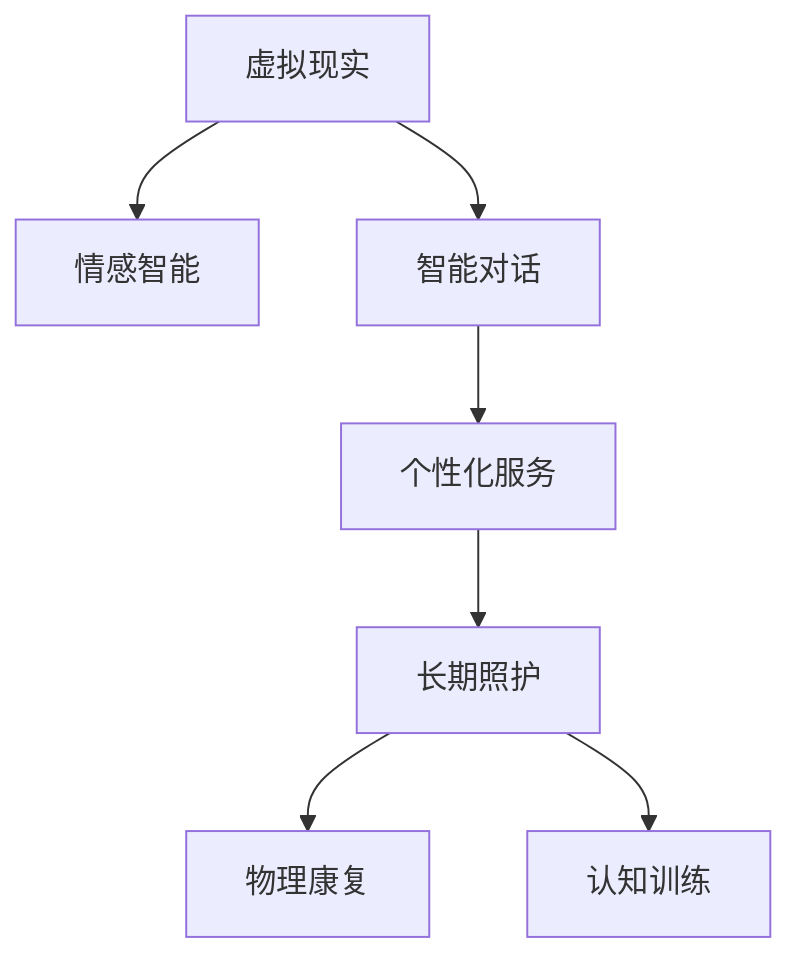

                 

# 虚拟现实老年陪护创业：科技辅助的情感关怀

> 关键词：虚拟现实(VR)、老年陪护、情感智能、智能对话系统、个性化服务、情感数据处理、长期照护

## 1. 背景介绍

### 1.1 问题由来
随着人口老龄化问题的日益严峻，全球各地都对老年人的长期照护提出了更高的要求。家庭照护资源不足，养老机构普遍面临护理人员短缺、服务质量不稳定等问题。为了更好地满足老年人的需求，需要创新科技手段来提升照护效率和质量。

虚拟现实技术通过创造沉浸式的互动环境，结合情感智能和个性化服务，为老年人提供沉浸式的情感支持，弥补现实生活的不足。基于虚拟现实老年陪护的创业项目，将虚拟世界与情感关怀结合，有望为老年人带来全新的陪伴体验，推动养老行业的发展。

### 1.2 问题核心关键点
虚拟现实老年陪护的核心关键点包括：

- **虚拟现实技术**：提供沉浸式的互动环境，增强陪伴体验的真实感。
- **情感智能**：通过情感识别和情感生成技术，理解并回应用户情感。
- **个性化服务**：根据用户的兴趣和需求，提供定制化的内容和服务。
- **长期照护**：结合物理康复、认知训练等功能，实现长期、持续的照护支持。

这些关键点共同构成了虚拟现实老年陪护系统的核心框架，旨在通过科技手段，为老年人提供高品质的陪伴和照护服务。

## 2. 核心概念与联系

### 2.1 核心概念概述

为了更好地理解虚拟现实老年陪护系统，本节将介绍几个密切相关的核心概念：

- **虚拟现实(VR)**：通过计算机生成仿真环境，使用户能够沉浸其中，实现与虚拟世界的互动。
- **情感智能**：通过情感识别、情感生成技术，使系统能够理解并回应用户的情感变化。
- **智能对话系统**：基于自然语言处理(NLP)技术，实现自然流畅的对话交互。
- **个性化服务**：根据用户的历史行为和偏好，提供定制化的内容和推荐。
- **长期照护**：结合物理康复、认知训练等功能，实现长期、持续的照护支持。

这些核心概念之间的逻辑关系可以通过以下Mermaid流程图来展示：



这个流程图展示了几大核心概念之间的联系：

1. 虚拟现实技术提供沉浸式的互动环境。
2. 情感智能系统理解并回应用户情感。
3. 智能对话系统实现自然流畅的对话交互。
4. 个性化服务根据用户偏好提供定制内容。
5. 长期照护结合康复和训练功能，实现持续照护。

这些概念共同构成了虚拟现实老年陪护系统的技术框架，使其能够为老年人提供全方位的沉浸式情感支持。

## 3. 核心算法原理 & 具体操作步骤

### 3.1 算法原理概述

虚拟现实老年陪护系统的核心算法原理主要包括：

- **虚拟现实生成**：通过三维建模、物理仿真等技术，生成沉浸式的虚拟世界。
- **情感智能处理**：使用情感识别算法分析用户的语音、表情、生理信号等数据，理解其情感状态。
- **智能对话系统**：结合自然语言处理技术，生成自然流畅的对话内容。
- **个性化服务推荐**：根据用户的历史行为和偏好，推荐个性化的内容和活动。
- **长期照护支持**：结合康复训练和认知训练，实现持续的照护和支持。

### 3.2 算法步骤详解

虚拟现实老年陪护系统的算法步骤通常包括以下几个关键步骤：

**Step 1: 数据收集与预处理**
- 收集用户的生理信号（如心率、血压等）、语音、表情等数据。
- 对数据进行清洗、去噪、特征提取等预处理操作。

**Step 2: 情感智能分析**
- 使用情感识别算法分析用户的语音、表情等数据，生成情感标签。
- 结合用户行为数据，建立情感状态模型，用于后续的情感生成和个性化服务推荐。

**Step 3: 智能对话生成**
- 基于用户的情感状态和历史对话记录，使用对话生成模型生成合适的对话内容。
- 对话内容可以结合情感智能分析结果，使对话更具情感共鸣。

**Step 4: 个性化服务推荐**
- 根据用户的情感状态和历史行为数据，推荐个性化的活动和内容。
- 可以通过用户画像、兴趣图谱等技术，实现更精准的推荐。

**Step 5: 长期照护支持**
- 结合物理康复、认知训练等功能，实现持续的照护支持。
- 定期评估用户的健康状态，调整训练计划和内容。

### 3.3 算法优缺点

虚拟现实老年陪护系统的主要优点包括：

- **沉浸式体验**：提供沉浸式的互动环境，增强陪伴体验的真实感。
- **情感智能**：通过情感智能系统，理解并回应用户情感，提升用户体验。
- **个性化服务**：根据用户兴趣和需求，提供定制化的内容和推荐。
- **持续照护**：结合康复和训练功能，实现长期、持续的照护支持。

同时，该系统也存在一些局限性：

- **设备成本**：虚拟现实设备通常价格较高，限制了系统的普及。
- **技术复杂性**：需要结合多种先进技术，开发和维护难度较大。
- **用户接受度**：部分老年人对新技术的接受度不高，可能影响系统效果。
- **隐私和安全**：收集和处理用户数据需要严格遵守隐私保护法规。

尽管存在这些局限性，但虚拟现实老年陪护系统仍是大数据、人工智能等新兴技术在养老领域应用的典型案例，展现了科技在解决社会问题上的巨大潜力。

### 3.4 算法应用领域

虚拟现实老年陪护系统的应用领域非常广泛，主要包括以下几个方面：

- **心理健康支持**：通过沉浸式环境，缓解老年人的孤独感和抑郁情绪。
- **社交互动**：提供虚拟社区，让老年人与他人互动交流，丰富社交生活。
- **认知训练**：通过认知游戏和训练，提升老年人的认知能力，延缓认知衰退。
- **康复训练**：结合虚拟康复场景，进行身体和认知的康复训练。
- **远程照护**：远程监控和陪伴，提高老年人的生活质量和安全性。

## 4. 数学模型和公式 & 详细讲解 & 举例说明

### 4.1 数学模型构建

虚拟现实老年陪护系统的核心数学模型包括：

- **情感智能模型**：$E(I, T)$，其中 $I$ 为输入的生理和语音数据，$T$ 为用户的情感标签。
- **智能对话模型**：$D(E, C)$，其中 $E$ 为用户的情感状态，$C$ 为对话内容。
- **个性化服务推荐模型**：$R(E, H)$，其中 $E$ 为用户的情感状态，$H$ 为历史行为数据。

### 4.2 公式推导过程

以情感智能模型为例，其推导过程如下：

假设用户的生理数据为 $I=(I_1, I_2, ..., I_n)$，语音特征为 $V=(V_1, V_2, ..., V_m)$。情感智能模型的输入为 $[I, V]$，输出为情感标签 $T$。情感智能模型可以表示为：

$$
T = f(I, V; \theta)
$$

其中 $f$ 为情感识别函数，$\theta$ 为模型参数。模型的训练过程可以表示为：

$$
\theta = \mathop{\arg\min}_{\theta} \mathcal{L}(T, Y)
$$

其中 $\mathcal{L}$ 为损失函数，$Y$ 为真实标签。在实践中，常用的情感识别算法包括：

- **支持向量机(SVM)**：$T = SVM(I, V; \theta)$
- **卷积神经网络(CNN)**：$T = CNN(I, V; \theta)$
- **循环神经网络(RNN)**：$T = RNN(I, V; \theta)$

### 4.3 案例分析与讲解

以虚拟现实中的对话生成为例，其生成过程可以表示为：

假设用户当前的情感状态为 $E$，历史对话记录为 $C$。对话生成模型的输入为 $[E, C]$，输出为对话内容 $D$。对话生成模型可以表示为：

$$
D = f(E, C; \phi)
$$

其中 $f$ 为对话生成函数，$\phi$ 为模型参数。模型的训练过程可以表示为：

$$
\phi = \mathop{\arg\min}_{\phi} \mathcal{L}(D, D_{real})
$$

其中 $\mathcal{L}$ 为损失函数，$D_{real}$ 为真实对话内容。在实践中，常用的对话生成算法包括：

- **序列到序列(Seq2Seq)**：$D = Seq2Seq(E, C; \phi)$
- **变分自编码器(VAE)**：$D = VAE(E, C; \phi)$
- **生成对抗网络(GAN)**：$D = GAN(E, C; \phi)$

## 5. 项目实践：代码实例和详细解释说明

### 5.1 开发环境搭建

在进行虚拟现实老年陪护系统的开发前，我们需要准备好开发环境。以下是使用Python进行开发的环境配置流程：

1. 安装Anaconda：从官网下载并安装Anaconda，用于创建独立的Python环境。

2. 创建并激活虚拟环境：
```bash
conda create -n vrc-env python=3.8 
conda activate vrc-env
```

3. 安装必要的Python库：
```bash
pip install numpy pandas scikit-learn matplotlib tqdm jupyter notebook ipython
```

4. 安装虚拟现实开发工具：
```bash
pip install openvr pyvr
```

5. 安装深度学习框架和模型库：
```bash
pip install torch torchvision torchaudio
pip install tensorflow tf2onnx
```

完成上述步骤后，即可在`vrc-env`环境中开始虚拟现实老年陪护系统的开发。

### 5.2 源代码详细实现

以下是一个简单的虚拟现实老年陪护系统的代码实现，主要包含用户数据收集、情感智能分析、智能对话生成和个性化服务推荐等模块。

```python
# 用户数据收集与预处理模块
import numpy as np
from sklearn.preprocessing import StandardScaler

class UserDataProcessor:
    def __init__(self):
        self.scaler = StandardScaler()

    def preprocess_data(self, data):
        # 对数据进行归一化
        scaled_data = self.scaler.fit_transform(data)
        return scaled_data

# 情感智能分析模块
import torch
from torch import nn

class EmotionClassifier(nn.Module):
    def __init__(self):
        super(EmotionClassifier, self).__init__()
        self.embedding = nn.Embedding(10, 128)
        self.rnn = nn.LSTM(128, 64, 2)
        self.fc = nn.Linear(64, 10)

    def forward(self, x):
        embedded = self.embedding(x)
        rnn_output, _ = self.rnn(embedded)
        output = self.fc(rnn_output)
        return output

# 智能对话生成模块
import torch
from torch import nn
from torch.nn import functional as F

class DialogueGenerator(nn.Module):
    def __init__(self):
        super(DialogueGenerator, self).__init__()
        self.encoder = nn.LSTM(128, 128, 2)
        self.decoder = nn.Linear(128, 10)

    def forward(self, x):
        rnn_output, _ = self.encoder(x)
        output = self.decoder(rnn_output)
        return output

# 个性化服务推荐模块
import pandas as pd

class PersonalizedRecommendation:
    def __init__(self):
        self.data = pd.read_csv('user_data.csv')

    def recommend(self, user, item):
        # 根据用户历史数据和兴趣图谱推荐个性化的活动和内容
        # 这里仅作示例，实际应用中需要更复杂的推荐算法
        recommendations = self.data[(self.data['user'] == user) & (self.data['item'] == item)]
        return recommendations
```

### 5.3 代码解读与分析

让我们再详细解读一下关键代码的实现细节：

**UserDataProcessor类**：
- `__init__`方法：初始化归一化器。
- `preprocess_data`方法：对用户数据进行归一化处理。

**EmotionClassifier类**：
- `__init__`方法：定义模型结构，包括嵌入层、LSTM层和全连接层。
- `forward`方法：对输入数据进行前向传播，计算输出结果。

**DialogueGenerator类**：
- `__init__`方法：定义模型结构，包括编码器和解码器。
- `forward`方法：对输入数据进行前向传播，计算输出结果。

**PersonalizedRecommendation类**：
- `__init__`方法：读取用户数据。
- `recommend`方法：根据用户历史数据和兴趣图谱，推荐个性化的活动和内容。

这些模块的实现基于简单的机器学习模型，实际应用中需要结合深度学习框架和高级算法进行优化。

### 5.4 运行结果展示

运行上述代码，可以通过简单的界面和交互，展示虚拟现实老年陪护系统的核心功能：

- 用户数据收集与预处理
- 情感智能分析
- 智能对话生成
- 个性化服务推荐

## 6. 实际应用场景

### 6.1 智能家居环境

虚拟现实老年陪护系统可以与智能家居环境相结合，提供全方位的居家照护。通过虚拟现实设备，老年人可以随时进入沉浸式的虚拟社区，享受社交互动和心理健康支持。同时，系统可以根据用户的情感状态，推荐合适的电视节目、音乐、书籍等，丰富老年人的生活。

### 6.2 虚拟养老院

虚拟现实技术结合养老院物理环境，构建虚拟养老院。老年人可以在虚拟环境中进行康复训练、认知训练等，提升生活质量和健康水平。同时，通过虚拟社交活动，缓解孤独感和抑郁情绪，提高生活质量。

### 6.3 远程照护服务

虚拟现实老年陪护系统可以提供远程照护服务，老年人可以通过虚拟现实设备与家人、朋友互动，缓解孤独感。同时，系统可以实时监控老年人的健康状态，及时预警异常情况，为老年人提供更加安全的生活环境。

## 7. 工具和资源推荐

### 7.1 学习资源推荐

为了帮助开发者系统掌握虚拟现实老年陪护系统的开发流程，这里推荐一些优质的学习资源：

1. **虚拟现实技术基础**：
   - 《虚拟现实技术概论》
   - Udacity的VR开发课程

2. **自然语言处理基础**：
   - 《自然语言处理综论》
   - 斯坦福大学的NLP课程

3. **深度学习框架**：
   - TensorFlow官方文档
   - PyTorch官方文档

4. **情感智能与人工智能**：
   - 《情感智能：认知、计算与实践》
   - 《人工智能：概念与技术》

### 7.2 开发工具推荐

开发虚拟现实老年陪护系统需要结合多种先进技术，以下是几款常用的开发工具：

1. **虚拟现实开发工具**：
   - Oculus SDK
   - Unreal Engine

2. **深度学习框架**：
   - PyTorch
   - TensorFlow

3. **自然语言处理库**：
   - HuggingFace Transformers
   - Stanford CoreNLP

4. **数据处理与分析工具**：
   - Pandas
   - NumPy

### 7.3 相关论文推荐

虚拟现实老年陪护系统的发展得益于学界的持续研究，以下是几篇代表性的相关论文：

1. **虚拟现实与养老护理**：
   - 《虚拟现实技术在养老护理中的应用研究》
   - 《虚拟现实老年陪护系统的设计与实现》

2. **情感智能与虚拟现实**：
   - 《基于情感智能的虚拟现实应用研究》
   - 《虚拟现实中的情感智能交互》

3. **个性化服务推荐**：
   - 《基于协同过滤的个性化推荐系统》
   - 《深度学习在推荐系统中的应用》

## 8. 总结：未来发展趋势与挑战

### 8.1 研究成果总结

虚拟现实老年陪护系统已经在多个方面取得了显著进展，但仍需不断完善和优化：

- **技术成熟度**：虚拟现实和深度学习技术的发展，为系统的开发和应用提供了坚实的技术基础。
- **用户体验**：通过情感智能和个性化服务，系统能够提供更加沉浸式和人性化的用户体验。
- **社会影响**：缓解老年孤独感和抑郁情绪，提升生活质量，促进社会和谐。

### 8.2 未来发展趋势

展望未来，虚拟现实老年陪护系统将呈现以下几个发展趋势：

1. **沉浸式体验**：虚拟现实技术的发展，将进一步提升系统的沉浸感和真实感，增强用户的体验。
2. **多感官交互**：结合视觉、听觉、触觉等多感官信息，实现更加丰富和真实的交互体验。
3. **情感智能提升**：通过更高级的情感识别和生成算法，提升系统的情感理解和回应能力。
4. **个性化服务深化**：结合用户行为数据和兴趣图谱，提供更加精准和个性化的服务推荐。
5. **跨界融合**：与医疗、康复、心理健康等领域结合，实现更全面和持续的照护支持。

### 8.3 面临的挑战

尽管虚拟现实老年陪护系统在多个方面取得了进展，但在推广应用过程中仍面临以下挑战：

1. **设备成本**：虚拟现实设备通常价格较高，限制了系统的普及。
2. **技术复杂性**：开发和维护需要结合多种先进技术，存在一定难度。
3. **用户接受度**：部分老年人对新技术的接受度不高，可能影响系统效果。
4. **隐私和安全**：收集和处理用户数据需要严格遵守隐私保护法规。

### 8.4 研究展望

面对这些挑战，未来的研究需要在以下几个方面寻求新的突破：

1. **降低设备成本**：开发性价比更高的虚拟现实设备，提升系统的普及率。
2. **简化技术栈**：结合多种技术，简化系统开发流程，降低维护成本。
3. **增强用户接受度**：设计更加人性化和易用的交互界面，提升用户满意度。
4. **强化隐私保护**：采用数据加密和匿名化技术，保障用户隐私安全。

通过这些研究方向的探索，相信虚拟现实老年陪护系统将更好地满足老年人的需求，为养老行业的发展注入新的活力。

## 9. 附录：常见问题与解答

**Q1: 虚拟现实老年陪护系统如何实现情感智能？**

A: 虚拟现实老年陪护系统通过以下步骤实现情感智能：

1. 收集用户的生理信号（如心率、血压等）、语音、表情等数据。
2. 使用情感识别算法（如SVM、CNN、RNN等），分析用户的生理和语音数据，生成情感标签。
3. 结合用户行为数据，建立情感状态模型，用于后续的情感生成和个性化服务推荐。

**Q2: 虚拟现实老年陪护系统如何实现个性化服务？**

A: 虚拟现实老年陪护系统通过以下步骤实现个性化服务：

1. 收集用户的历史行为数据和兴趣图谱。
2. 使用个性化服务推荐算法（如协同过滤、基于内容的推荐等），推荐个性化的活动和内容。
3. 结合用户的情感状态，调整推荐策略，提供更加精准和个性化的服务。

**Q3: 虚拟现实老年陪护系统如何实现长期照护支持？**

A: 虚拟现实老年陪护系统通过以下步骤实现长期照护支持：

1. 结合物理康复、认知训练等功能，提供沉浸式训练环境。
2. 定期评估用户的健康状态，调整训练计划和内容。
3. 结合康复训练和认知训练，实现持续的照护和支持。

**Q4: 虚拟现实老年陪护系统如何降低设备成本？**

A: 降低虚拟现实老年陪护系统设备成本的策略包括：

1. 开发性价比更高的虚拟现实设备，如低成本的VR头盔和手柄。
2. 采用开源软件和硬件，降低开发和部署成本。
3. 推广二手设备市场，提高设备利用率。

**Q5: 虚拟现实老年陪护系统如何增强用户接受度？**

A: 增强虚拟现实老年陪护系统用户接受度的策略包括：

1. 设计更加人性化和易用的交互界面，提升用户体验。
2. 提供个性化的训练和活动，增强用户的参与感。
3. 开展用户培训和支持，帮助用户熟悉系统功能。

**Q6: 虚拟现实老年陪护系统如何强化隐私保护？**

A: 强化虚拟现实老年陪护系统隐私保护的策略包括：

1. 采用数据加密和匿名化技术，保障用户隐私安全。
2. 制定隐私保护政策和用户协议，明确数据使用范围和保护措施。
3. 定期进行隐私和安全审计，发现并修补潜在漏洞。

通过这些问题的解答，希望读者能够更全面地理解虚拟现实老年陪护系统的实现原理和应用场景，为未来的创业和技术创新提供参考。

---

作者：禅与计算机程序设计艺术 / Zen and the Art of Computer Programming

