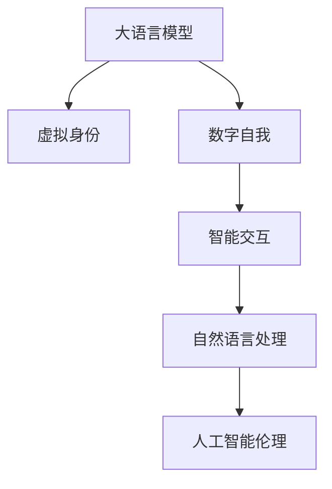

                 

# 虚拟身份和 LLM：数字世界的另一个自我

> 关键词：虚拟身份, 大语言模型, 数字自我, 自然语言处理, 人工智能伦理

## 1. 背景介绍

### 1.1 问题由来

随着数字化进程的加速，数字身份在虚拟世界中的应用越来越广泛。无论是社交平台、虚拟会议、虚拟银行，还是数字游戏，数字身份都在扮演着越来越重要的角色。然而，数字身份的本质仍然是用户自身在虚拟世界中的化身和替身，它虽然赋予了用户更广泛的活动自由和身份展示的可能性，但也带来了诸多新的挑战。

特别是，如何构建一个既符合用户需求又具备智能交互能力的数字身份，成为了当前数字身份研究的一个重要方向。而这一问题的解决，不仅需要跨学科的深度融合，还需要利用最新的AI技术，尤其是大语言模型（LLM）来辅助。

### 1.2 问题核心关键点

构建智能数字身份的核心关键点在于如何设计一个能够自主学习和适应用户需求的语言模型。这个模型不仅需要具备强大的语言理解能力，还需要能够自主生成符合用户偏好和情境的虚拟身份输出，从而实现与用户的自然交互。

具体而言，构建智能数字身份需要解决以下问题：
1. 如何在虚拟环境中构建可信赖的虚拟身份。
2. 如何使虚拟身份具备智能交互能力，能够自主地理解和回应用户输入。
3. 如何在保护用户隐私的前提下，实现智能数字身份的个性化和适应性。

### 1.3 问题研究意义

研究如何构建智能数字身份，对于提升虚拟世界的用户体验、促进用户之间的交互和协作、保护用户隐私等方面具有重要意义。

1. **提升用户体验**：智能数字身份能够根据用户偏好和情境自主生成个性化输出，使得虚拟环境中的交流更加自然、高效。
2. **促进交互协作**：智能数字身份具备自主学习和适应用户需求的能力，能够提高用户间的互动效率和质量。
3. **保护隐私**：智能数字身份能够在保护用户隐私的前提下，实现对用户数据的智能管理和使用，避免数据滥用。

## 2. 核心概念与联系

### 2.1 核心概念概述

在探讨如何构建智能数字身份时，我们首先需要明确一些核心概念：

- **大语言模型（LLM）**：一种能够理解和生成自然语言的神经网络模型，具备强大的语言表示能力。
- **虚拟身份**：用户在虚拟世界中的数字化身，通常由名字、性别、年龄、职业等基本信息构成，并具备自主生成输出的能力。
- **数字自我**：用户在自己的虚拟身份中，能够实现自主学习、自主生成和自主互动的能力，可以看作是用户自己在数字世界中的“另一个自我”。
- **自然语言处理（NLP）**：涉及计算机如何处理和理解人类语言的技术，是构建智能数字身份的重要工具。
- **人工智能伦理**：在构建智能数字身份时，需要考虑的伦理问题，如隐私保护、用户自主权、数据安全等。

这些核心概念之间相互关联，共同构成了智能数字身份的构建框架。

### 2.2 核心概念原理和架构的 Mermaid 流程图



这个流程图展示了核心概念之间的逻辑关系：

1. 大语言模型（LLM）是构建虚拟身份和数字自我的基础，提供了强大的语言理解与生成能力。
2. 虚拟身份是基于LLM生成的数字化身，具备自主生成的能力。
3. 数字自我是由虚拟身份实现自主学习和自主生成的能力，是一种增强型的虚拟身份。
4. 智能交互通过自然语言处理（NLP）技术，使得数字自我能够理解用户输入并自主生成输出。
5. 人工智能伦理是构建智能数字身份时需要考虑的重要因素，确保用户数据安全和隐私保护。

## 3. 核心算法原理 & 具体操作步骤

### 3.1 算法原理概述

构建智能数字身份的核心算法原理基于大语言模型的原理。大语言模型通过在大量文本数据上进行预训练，学习到了丰富的语言知识和语言表示能力。我们可以利用这种能力，设计出能够自主生成和适应用户需求的虚拟身份。

具体而言，智能数字身份的构建分为两个步骤：

1. **虚拟身份设计**：首先根据用户的基本信息和偏好，设计虚拟身份的基本框架，包括名字、性别、年龄、职业等基本信息。
2. **智能交互生成**：基于虚拟身份的基本框架，利用大语言模型生成符合用户需求和情境的虚拟身份输出。

### 3.2 算法步骤详解

以下是构建智能数字身份的具体操作步骤：

**Step 1: 虚拟身份设计**

1. **收集基本信息**：从用户处收集虚拟身份的基本信息，如姓名、年龄、性别、职业等。
2. **设计虚拟身份框架**：根据收集到的基本信息，设计虚拟身份的框架。例如，可以为虚拟身份设定一个虚拟角色，如商务人士、学生、游戏玩家等。
3. **添加个性化元素**：根据用户的偏好和需求，添加个性化的元素，如虚拟身份的服装、背景、动作等。

**Step 2: 智能交互生成**

1. **预训练大语言模型的选择**：选择合适的预训练大语言模型，如GPT-3、BERT等，作为生成虚拟身份输出的基础。
2. **虚拟身份描述生成**：将虚拟身份的基本信息和框架转化为自然语言描述，输入到预训练大语言模型中。
3. **虚拟身份输出生成**：利用预训练大语言模型生成符合虚拟身份描述的输出，如虚拟身份的对话、动作等。

**Step 3: 训练和优化**

1. **数据标注**：为虚拟身份生成过程准备数据，标注出符合用户需求和情境的虚拟身份输出。
2. **模型训练**：使用标注好的数据对大语言模型进行微调，优化模型参数，使其能够生成符合用户需求和情境的虚拟身份输出。
3. **性能评估**：在验证集上评估模型的性能，调整模型参数，确保生成的虚拟身份输出符合用户需求。

### 3.3 算法优缺点

智能数字身份的构建方法有以下优点：

1. **高效生成**：基于预训练大语言模型，能够快速生成符合用户需求和情境的虚拟身份输出。
2. **高度个性化**：能够根据用户的基本信息和偏好，设计高度个性化的虚拟身份，满足用户的不同需求。
3. **智能交互**：通过自然语言处理技术，使虚拟身份具备智能交互能力，能够理解用户输入并自主生成输出。

同时，该方法也存在一些局限性：

1. **依赖数据质量**：虚拟身份的生成效果依赖于标注数据的质量，标注数据质量差会导致虚拟身份输出不符合用户需求。
2. **隐私保护问题**：在虚拟身份生成过程中，用户的个人信息可能会被泄露，需要采取措施保护用户隐私。
3. **计算资源消耗**：大语言模型的训练和微调需要大量的计算资源和时间，可能会对系统性能造成影响。

### 3.4 算法应用领域

智能数字身份的构建方法可以应用于以下领域：

1. **虚拟社交平台**：为用户在虚拟社交平台上的互动提供智能化的虚拟身份，增强用户之间的交流体验。
2. **虚拟会议和会议系统**：为虚拟会议和会议系统中的参与者提供个性化的虚拟身份，增强会议的互动性和参与感。
3. **虚拟银行和金融服务**：为虚拟银行和金融服务中的用户提供智能化的虚拟身份，提升用户的金融服务体验。
4. **数字游戏和虚拟现实**：为数字游戏和虚拟现实中的用户提供个性化的虚拟身份，增强游戏的互动性和沉浸感。

## 4. 数学模型和公式 & 详细讲解 & 举例说明

### 4.1 数学模型构建

在构建智能数字身份的过程中，我们可以使用大语言模型的预训练参数，通过微调来生成符合用户需求和情境的虚拟身份输出。

假设预训练大语言模型的参数为 $\theta$，虚拟身份的基本框架为 $F$，用户的偏好和情境描述为 $D$。则智能数字身份的生成过程可以表示为：

$$
O = M_{\theta}(D, F)
$$

其中，$M_{\theta}$ 表示预训练大语言模型的前向传播，$O$ 表示生成的虚拟身份输出。

### 4.2 公式推导过程

以生成虚拟身份的对话为例，我们可以将对话过程表示为序列生成任务。假设虚拟身份的对话格式为：

$$
\text{You: } S_1, S_2, \ldots, S_t \\
\text{Identity: } T_1, T_2, \ldots, T_t
$$

其中，$S_i$ 表示用户输入的对话内容，$T_i$ 表示虚拟身份的输出。

利用大语言模型生成虚拟身份的对话过程可以表示为：

$$
T_i = M_{\theta}(S_i, F, \{T_{i-1}\}_{i-1=1}^{t-1})
$$

其中，$\{T_{i-1}\}_{i-1=1}^{t-1}$ 表示虚拟身份的先验对话内容，$F$ 表示虚拟身份的基本框架，$S_i$ 表示用户输入的对话内容。

### 4.3 案例分析与讲解

以生成虚拟身份的智能客服为例，我们可以使用大语言模型生成符合用户需求的虚拟客服输出。

首先，收集用户的基本信息和偏好，设计虚拟客服的基本框架。然后，利用大语言模型生成符合用户需求和情境的虚拟客服输出。

例如，用户输入：

$$
\text{You: } "我想购买一张电影票，请问有哪些可选的场次？"
$$

虚拟客服的生成过程可以表示为：

$$
T_1 = M_{\theta}(S_1, F, \{\}) \\
T_2 = M_{\theta}(S_2, F, \{T_1\})
$$

其中，$S_1$ 表示用户输入的问题，$F$ 表示虚拟客服的基本框架，$\{\}$ 表示先验对话内容为空。

虚拟客服的输出可以表示为：

$$
T_1 = "您好，请问您想购买哪一部电影呢？"
$$

虚拟客服的下一轮输出可以表示为：

$$
T_2 = "根据您的选择，我们可以提供以下场次供您参考："
$$

通过这种方法，智能客服能够根据用户输入的问题，生成符合用户需求和情境的对话输出，增强用户的互动体验。

## 5. 项目实践：代码实例和详细解释说明

### 5.1 开发环境搭建

在进行智能数字身份的构建实践前，我们需要准备好开发环境。以下是使用Python进行PyTorch开发的环境配置流程：

1. 安装Anaconda：从官网下载并安装Anaconda，用于创建独立的Python环境。

2. 创建并激活虚拟环境：
```bash
conda create -n pytorch-env python=3.8 
conda activate pytorch-env
```

3. 安装PyTorch：根据CUDA版本，从官网获取对应的安装命令。例如：
```bash
conda install pytorch torchvision torchaudio cudatoolkit=11.1 -c pytorch -c conda-forge
```

4. 安装Transformers库：
```bash
pip install transformers
```

5. 安装各类工具包：
```bash
pip install numpy pandas scikit-learn matplotlib tqdm jupyter notebook ipython
```

完成上述步骤后，即可在`pytorch-env`环境中开始实践。

### 5.2 源代码详细实现

下面我们以生成虚拟客服为例，给出使用Transformers库进行大语言模型微调的具体代码实现。

首先，定义虚拟客服的基本框架：

```python
class VirtualAssistant:
    def __init__(self, name, gender, age, occupation):
        self.name = name
        self.gender = gender
        self.age = age
        self.occupation = occupation
```

然后，定义虚拟客服的对话生成函数：

```python
from transformers import GPT2Tokenizer, GPT2LMHeadModel

class VirtualAssistantDialogue:
    def __init__(self, model_path, tokenizer_path):
        self.model = GPT2LMHeadModel.from_pretrained(model_path)
        self.tokenizer = GPT2Tokenizer.from_pretrained(tokenizer_path)
        self dialogue_context = []
    
    def generate_response(self, user_input):
        input_ids = self.tokenizer.encode(user_input, return_tensors='pt')
        with torch.no_grad():
            outputs = self.model.generate(input_ids, max_length=128)
        response = self.tokenizer.decode(outputs[0], skip_special_tokens=True)
        self.dialogue_context.append(user_input)
        return response
```

接着，定义虚拟客服的训练函数：

```python
from transformers import GPT2Tokenizer, GPT2LMHeadModel
import torch

def train_virtual_assistant(model_path, tokenizer_path, train_data, valid_data):
    model = GPT2LMHeadModel.from_pretrained(model_path)
    tokenizer = GPT2Tokenizer.from_pretrained(tokenizer_path)
    train_dataset = pd.read_csv(train_data)
    valid_dataset = pd.read_csv(valid_data)
    
    train_loader = DataLoader(train_dataset, batch_size=16, shuffle=True)
    valid_loader = DataLoader(valid_dataset, batch_size=16, shuffle=False)
    
    optimizer = AdamW(model.parameters(), lr=2e-5)
    scheduler = get_linear_schedule_with_warmup(optimizer, num_warmup_steps=0, num_training_steps=len(train_loader))
    
    device = torch.device('cuda' if torch.cuda.is_available() else 'cpu')
    model.to(device)
    
    for epoch in range(10):
        model.train()
        for batch in train_loader:
            input_ids = batch['input_ids'].to(device)
            attention_mask = batch['attention_mask'].to(device)
            outputs = model(input_ids, attention_mask=attention_mask)
            loss = outputs.loss
            loss.backward()
            optimizer.step()
            scheduler.step()
            
        model.eval()
        valid_loss = 0
        for batch in valid_loader:
            input_ids = batch['input_ids'].to(device)
            attention_mask = batch['attention_mask'].to(device)
            outputs = model(input_ids, attention_mask=attention_mask)
            valid_loss += outputs.loss.item()
        
        print(f'Epoch {epoch+1}, train loss: {loss:.3f}, valid loss: {valid_loss:.3f}')
```

最后，启动训练流程并在测试集上评估：

```python
train_virtual_assistant('gpt2-medium', 'gpt2-medium', 'train_data.csv', 'valid_data.csv')
```

以上就是使用PyTorch对虚拟客服进行大语言模型微调的完整代码实现。可以看到，Transformers库使得模型构建和微调的过程变得简洁高效。

### 5.3 代码解读与分析

让我们再详细解读一下关键代码的实现细节：

**VirtualAssistant类**：
- `__init__`方法：初始化虚拟客服的基本信息。
- `generate_response`方法：根据用户输入和虚拟客服的对话历史，生成虚拟客服的响应。

**VirtualAssistantDialogue类**：
- `__init__`方法：初始化虚拟客服的模型和分词器，以及对话历史。
- `generate_response`方法：使用模型生成虚拟客服的响应，并更新对话历史。

**train_virtual_assistant函数**：
- `model`和`tokenizer`：加载预训练模型和分词器。
- `train_loader`和`valid_loader`：加载训练集和验证集，并进行批处理。
- `optimizer`和`scheduler`：定义优化器和学习率调度器。
- `device`：检查是否使用GPU进行训练。
- `for循环`：迭代训练过程，在每个epoch内更新模型参数。

可以看出，PyTorch和Transformers库的强大封装使得虚拟客服的构建过程非常简洁高效。开发者可以将更多精力放在模型设计、数据处理等高层逻辑上，而不必过多关注底层的实现细节。

当然，工业级的系统实现还需考虑更多因素，如模型的保存和部署、超参数的自动搜索、更灵活的任务适配层等。但核心的微调范式基本与此类似。

## 6. 实际应用场景

### 6.1 智能客服系统

基于大语言模型微调的虚拟客服系统，可以广泛应用于智能客服系统的构建。传统客服往往需要配备大量人力，高峰期响应缓慢，且一致性和专业性难以保证。而使用微调的虚拟客服系统，可以7x24小时不间断服务，快速响应客户咨询，用自然流畅的语言解答各类常见问题。

在技术实现上，可以收集企业内部的历史客服对话记录，将问题和最佳答复构建成监督数据，在此基础上对预训练虚拟客服模型进行微调。微调后的虚拟客服模型能够自动理解用户意图，匹配最合适的答复模板进行回复。对于客户提出的新问题，还可以接入检索系统实时搜索相关内容，动态组织生成回答。如此构建的智能客服系统，能大幅提升客户咨询体验和问题解决效率。

### 6.2 虚拟会议和会议系统

基于大语言模型的虚拟客服系统，可以进一步扩展为虚拟会议和会议系统中的虚拟参与者。传统会议系统往往需要花费大量时间和人力进行会议记录和整理，而虚拟客服系统可以自动记录会议内容，并生成会议纪要。

例如，在虚拟会议上，虚拟客服系统可以根据用户的输入，生成符合用户需求和情境的虚拟参与者输出。虚拟参与者可以自动回答用户的问题，记录会议内容，甚至在需要时进行会议总结和纪要生成。

### 6.3 数字游戏和虚拟现实

基于大语言模型的虚拟客服系统，也可以应用于数字游戏和虚拟现实中的虚拟角色。例如，在数字游戏中，虚拟客服系统可以设计虚拟角色，通过自然语言处理技术，与用户进行互动，提升游戏的沉浸感和趣味性。

在虚拟现实中，虚拟客服系统可以设计虚拟角色，与用户进行实时交互，增强用户的体验和参与感。例如，虚拟角色可以根据用户的输入，生成符合用户需求和情境的对话输出，提升用户的互动体验。

### 6.4 未来应用展望

随着大语言模型和微调方法的不断发展，基于微调范式将在更多领域得到应用，为传统行业带来变革性影响。

在智慧医疗领域，基于微调的虚拟客服系统可以应用于医疗问答、病历分析、药物研发等任务，提升医疗服务的智能化水平，辅助医生诊疗，加速新药开发进程。

在智能教育领域，微调的虚拟客服系统可以应用于作业批改、学情分析、知识推荐等方面，因材施教，促进教育公平，提高教学质量。

在智慧城市治理中，微调的虚拟客服系统可以应用于城市事件监测、舆情分析、应急指挥等环节，提高城市管理的自动化和智能化水平，构建更安全、高效的未来城市。

此外，在企业生产、社会治理、文娱传媒等众多领域，基于大语言模型的虚拟客服系统也将不断涌现，为NLP技术带来全新的突破。

## 7. 工具和资源推荐

### 7.1 学习资源推荐

为了帮助开发者系统掌握大语言模型微调的理论基础和实践技巧，这里推荐一些优质的学习资源：

1. 《Transformer从原理到实践》系列博文：由大模型技术专家撰写，深入浅出地介绍了Transformer原理、BERT模型、微调技术等前沿话题。

2. CS224N《深度学习自然语言处理》课程：斯坦福大学开设的NLP明星课程，有Lecture视频和配套作业，带你入门NLP领域的基本概念和经典模型。

3. 《Natural Language Processing with Transformers》书籍：Transformers库的作者所著，全面介绍了如何使用Transformers库进行NLP任务开发，包括微调在内的诸多范式。

4. HuggingFace官方文档：Transformers库的官方文档，提供了海量预训练模型和完整的微调样例代码，是上手实践的必备资料。

5. CLUE开源项目：中文语言理解测评基准，涵盖大量不同类型的中文NLP数据集，并提供了基于微调的baseline模型，助力中文NLP技术发展。

通过对这些资源的学习实践，相信你一定能够快速掌握大语言模型微调的精髓，并用于解决实际的NLP问题。

### 7.2 开发工具推荐

高效的开发离不开优秀的工具支持。以下是几款用于大语言模型微调开发的常用工具：

1. PyTorch：基于Python的开源深度学习框架，灵活动态的计算图，适合快速迭代研究。大部分预训练语言模型都有PyTorch版本的实现。

2. TensorFlow：由Google主导开发的开源深度学习框架，生产部署方便，适合大规模工程应用。同样有丰富的预训练语言模型资源。

3. Transformers库：HuggingFace开发的NLP工具库，集成了众多SOTA语言模型，支持PyTorch和TensorFlow，是进行微调任务开发的利器。

4. Weights & Biases：模型训练的实验跟踪工具，可以记录和可视化模型训练过程中的各项指标，方便对比和调优。与主流深度学习框架无缝集成。

5. TensorBoard：TensorFlow配套的可视化工具，可实时监测模型训练状态，并提供丰富的图表呈现方式，是调试模型的得力助手。

6. Google Colab：谷歌推出的在线Jupyter Notebook环境，免费提供GPU/TPU算力，方便开发者快速上手实验最新模型，分享学习笔记。

合理利用这些工具，可以显著提升大语言模型微调任务的开发效率，加快创新迭代的步伐。

### 7.3 相关论文推荐

大语言模型和微调技术的发展源于学界的持续研究。以下是几篇奠基性的相关论文，推荐阅读：

1. Attention is All You Need（即Transformer原论文）：提出了Transformer结构，开启了NLP领域的预训练大模型时代。

2. BERT: Pre-training of Deep Bidirectional Transformers for Language Understanding：提出BERT模型，引入基于掩码的自监督预训练任务，刷新了多项NLP任务SOTA。

3. Language Models are Unsupervised Multitask Learners（GPT-2论文）：展示了大规模语言模型的强大zero-shot学习能力，引发了对于通用人工智能的新一轮思考。

4. Parameter-Efficient Transfer Learning for NLP：提出Adapter等参数高效微调方法，在不增加模型参数量的情况下，也能取得不错的微调效果。

5. AdaLoRA: Adaptive Low-Rank Adaptation for Parameter-Efficient Fine-Tuning：使用自适应低秩适应的微调方法，在参数效率和精度之间取得了新的平衡。

6. Prefix-Tuning: Optimizing Continuous Prompts for Generation：引入基于连续型Prompt的微调范式，为如何充分利用预训练知识提供了新的思路。

这些论文代表了大语言模型微调技术的发展脉络。通过学习这些前沿成果，可以帮助研究者把握学科前进方向，激发更多的创新灵感。

## 8. 总结：未来发展趋势与挑战

### 8.1 研究成果总结

本文对基于大语言模型的虚拟身份构建方法进行了全面系统的介绍。首先阐述了虚拟身份和数字自我构建的背景和意义，明确了构建智能虚拟身份的难点和挑战。其次，从原理到实践，详细讲解了虚拟身份的构建方法，包括虚拟身份设计、智能交互生成和训练优化等步骤。同时，本文还广泛探讨了虚拟身份在多个行业领域的应用前景，展示了虚拟身份构建的广阔前景。最后，本文精选了虚拟身份构建的各类学习资源，力求为读者提供全方位的技术指引。

通过本文的系统梳理，可以看到，基于大语言模型的虚拟身份构建方法正在成为数字身份构建的重要范式，极大地提升了虚拟环境的互动体验和智能化水平。

### 8.2 未来发展趋势

展望未来，虚拟身份的构建技术将呈现以下几个发展趋势：

1. **多模态交互**：未来的虚拟身份将不仅限于文本交互，还将拓展到语音、图像、视频等多模态数据，实现更加全面的交互体验。
2. **增强的智能能力**：未来的虚拟身份将具备更强大的智能能力，能够在更多任务上提供智能化的服务，如情感分析、知识推荐、自然语言生成等。
3. **个性化定制**：未来的虚拟身份将具备更加个性化的定制能力，能够根据用户的需求和偏好，生成符合用户期望的输出。
4. **隐私保护**：未来的虚拟身份将更加注重隐私保护，通过匿名化、去标识化等技术，确保用户数据的安全和隐私。
5. **跨平台协作**：未来的虚拟身份将实现跨平台的协作，能够在多个虚拟环境中共享身份和数据，提升用户体验和协作效率。

以上趋势凸显了虚拟身份构建技术的广阔前景。这些方向的探索发展，必将进一步提升虚拟环境的智能化水平，为数字社会的建设注入新的动力。

### 8.3 面临的挑战

尽管虚拟身份构建技术已经取得了瞩目成就，但在迈向更加智能化、普适化应用的过程中，它仍面临着诸多挑战：

1. **数据隐私和安全**：虚拟身份的构建需要大量的用户数据，如何在保护用户隐私的前提下，获取高质量的数据，是一个重要的挑战。
2. **模型泛化能力**：虚拟身份需要具备强大的泛化能力，以适应不同的应用场景和用户需求。
3. **计算资源消耗**：大语言模型的训练和微调需要大量的计算资源，如何优化模型的计算效率，是一个重要的研究方向。
4. **用户交互体验**：如何设计出符合用户需求的虚拟身份，提升用户的交互体验，是一个需要深入研究的课题。

### 8.4 研究展望

面对虚拟身份构建面临的挑战，未来的研究需要在以下几个方面寻求新的突破：

1. **跨模态数据融合**：将符号化的先验知识，如知识图谱、逻辑规则等，与神经网络模型进行巧妙融合，引导虚拟身份的学习过程，实现更加全面、准确的模型构建。
2. **因果推理和逻辑推理**：将因果分析和逻辑推理方法引入虚拟身份的构建过程，增强模型建立稳定因果关系的能力，提升模型的泛化性和抗干扰能力。
3. **个性化推荐系统**：利用虚拟身份的学习能力，设计个性化的推荐系统，提升用户的体验和满意度。
4. **人机交互设计**：设计更加友好、自然的用户交互界面，提升用户的参与感和互动体验。

这些研究方向的研究和突破，必将引领虚拟身份构建技术迈向更高的台阶，为数字社会的发展提供新的动力。面向未来，虚拟身份构建技术还需要与其他人工智能技术进行更深入的融合，如知识表示、因果推理、强化学习等，多路径协同发力，共同推动虚拟身份构建技术的发展。只有勇于创新、敢于突破，才能不断拓展虚拟身份的边界，让智能技术更好地造福人类社会。

## 9. 附录：常见问题与解答

**Q1：虚拟身份构建过程中如何保护用户隐私？**

A: 在虚拟身份构建过程中，保护用户隐私至关重要。以下是一些保护用户隐私的常见措施：

1. **数据匿名化**：在收集用户数据时，使用匿名化技术，如去标识化、数据泛化等，确保用户数据不泄露个人身份信息。
2. **数据加密**：对用户数据进行加密存储和传输，确保数据在传输过程中不被窃取和篡改。
3. **权限控制**：严格控制用户数据的使用权限，确保只有经过授权的人员才能访问和使用用户数据。
4. **隐私政策透明**：制定清晰的隐私政策，告知用户数据的使用方式和范围，确保用户知情并同意。

通过这些措施，可以最大限度地保护用户隐私，确保虚拟身份构建过程的合法性和安全性。

**Q2：虚拟身份构建过程中，如何设计符合用户需求的虚拟身份？**

A: 设计符合用户需求的虚拟身份需要考虑以下几个方面：

1. **用户基本信息**：根据用户的基本信息，如姓名、年龄、性别、职业等，设计虚拟身份的基本框架。
2. **用户偏好和需求**：通过调研和用户反馈，了解用户的偏好和需求，设计符合用户期望的虚拟身份输出。
3. **情境适应性**：根据不同的应用场景，设计虚拟身份的适应性，确保虚拟身份在不同的情境下能够提供合适的输出。

例如，对于智能客服系统，虚拟客服需要具备快速响应、自然流畅的语言能力，能够准确理解用户输入并生成合适的回复。而对于虚拟会议系统，虚拟参与者需要具备高效记录会议内容、自动生成会议纪要的能力。

**Q3：虚拟身份构建过程中，如何优化模型的计算效率？**

A: 优化虚拟身份构建模型的计算效率，需要从以下几个方面入手：

1. **模型压缩**：使用模型压缩技术，如剪枝、量化、蒸馏等，减少模型的参数量和计算量，提升模型的推理速度。
2. **分布式训练**：利用分布式训练技术，将模型的训练任务分配到多个节点上并行执行，加快训练速度。
3. **硬件加速**：使用GPU、TPU等硬件设备加速模型的训练和推理，提升系统的计算效率。
4. **优化算法**：选择高效的优化算法，如AdamW、SGD等，加速模型参数的更新，提高训练效率。

通过这些措施，可以显著提升虚拟身份构建模型的计算效率，确保系统能够快速响应用户需求。

**Q4：虚拟身份构建过程中，如何提升模型的泛化能力？**

A: 提升虚拟身份构建模型的泛化能力，需要从以下几个方面入手：

1. **多样化数据**：使用多样化的训练数据，确保模型能够适应不同的应用场景和用户需求。
2. **对抗训练**：在训练过程中，引入对抗样本，提高模型的鲁棒性和泛化能力。
3. **多任务学习**：使用多任务学习方法，同时训练多个相关任务，提升模型的泛化能力和适应性。
4. **迁移学习**：在特定领域的数据集上进行预训练，然后在更广泛的数据集上进行微调，提升模型的泛化能力。

通过这些措施，可以显著提升虚拟身份构建模型的泛化能力，确保模型能够在不同的应用场景和用户需求下表现良好。

**Q5：虚拟身份构建过程中，如何优化用户的交互体验？**

A: 优化虚拟身份构建模型的用户体验，需要从以下几个方面入手：

1. **自然语言处理**：使用先进的自然语言处理技术，确保虚拟身份能够自然流畅地与用户进行互动。
2. **交互界面设计**：设计简洁、直观的交互界面，使用户能够轻松与虚拟身份进行互动。
3. **用户反馈机制**：建立用户反馈机制，根据用户反馈不断优化虚拟身份的输出，提升用户体验。
4. **个性化定制**：根据用户的需求和偏好，设计个性化的虚拟身份输出，提升用户的互动体验。

通过这些措施，可以显著提升虚拟身份构建模型的用户体验，确保用户能够流畅、自然地与虚拟身份进行互动。

---

作者：禅与计算机程序设计艺术 / Zen and the Art of Computer Programming

