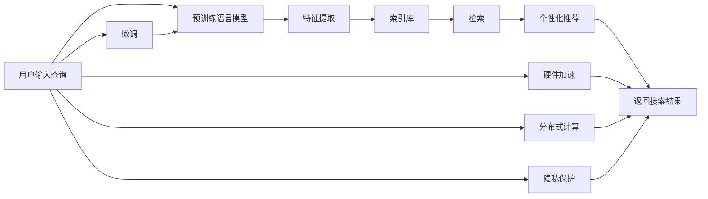

                 

## 1. 背景介绍

### 1.1 问题由来

在过去的十年中，人工智能（AI）和大数据分析已经改变了电子商务的运营方式。其中，搜索引擎是电商应用的核心组成部分，它直接影响用户的购物体验和转化率。传统的搜索引擎主要依赖于手工构建的关键词和文档矩阵，受限于静态索引和搜索结果匹配度，难以全面满足用户需求。

近年来，随着深度学习和大模型的发展，基于大模型的电商搜索引擎开始崭露头角。这些大模型在理解自然语言、提取文本特征、个性化推荐等方面展现出了巨大的潜力，极大地提高了搜索效率和用户体验。但是，如何将这些大模型有效地集成到电商搜索引擎的架构中，仍是一个值得深入探讨的问题。

### 1.2 问题核心关键点

基于大模型的电商搜索引擎，其核心在于以下几个关键点：

1. **语义理解**：传统的搜索依赖于关键词匹配，难以理解查询背后的语义和意图。大模型可以通过预训练获得强大的语义理解能力，提升搜索结果的相关性。
2. **个性化推荐**：通过大模型对用户行为和上下文进行建模，提供个性化的搜索和推荐，提升转化率和用户满意度。
3. **实时响应**：大模型能够在推理计算后实时返回搜索结果，满足电商实时搜索和动态展示的需求。
4. **数据集成**：如何将庞大的电商数据集成到大模型中，进行高效查询和特征提取。
5. **计算效率**：大模型通常需要高性能硬件支持，如何在有限的硬件资源下实现高效的模型推理。
6. **隐私保护**：电商数据涉及用户隐私，如何在大模型中保护数据安全，避免数据泄露。

解决这些问题，将极大提升电商搜索引擎的智能化水平和用户体验。

## 2. 核心概念与联系

### 2.1 核心概念概述

在深入讨论电商搜索引擎的架构设计之前，先介绍几个关键概念：

- **预训练语言模型**：如BERT、GPT-3等，通过大规模无标签文本数据预训练获得语言表示能力。
- **搜索引擎**：通过索引和搜索算法，将查询与文档匹配，返回相关结果。
- **个性化推荐系统**：基于用户历史行为和上下文信息，推荐相关产品。
- **微调(Fine-Tuning)**：在预训练模型的基础上，使用电商数据进行有监督学习，优化模型性能。
- **推理引擎**：根据输入查询和模型参数，高效计算并输出搜索结果。
- **硬件加速**：通过GPU、TPU等高性能计算设备，加速模型的推理过程。
- **分布式计算**：通过多台机器并行计算，提升搜索和推荐系统的性能。
- **隐私保护**：采用差分隐私、联邦学习等技术，保护用户数据隐私。

这些核心概念共同构成了电商搜索引擎的框架，使其能够在大模型的基础上实现高效、智能、安全的搜索和推荐服务。

### 2.2 核心概念原理和架构的 Mermaid 流程图



这个流程图展示了电商搜索引擎的核心架构设计：

1. 用户输入查询。
2. 查询通过预训练语言模型进行语义理解，提取查询特征。
3. 特征与索引库中的文档进行匹配，返回检索结果。
4. 基于检索结果进行个性化推荐。
5. 返回搜索结果给用户。
6. 查询经过微调优化，提升模型效果。
7. 推理过程通过硬件加速和分布式计算优化。
8. 查询和用户信息通过隐私保护技术，确保数据安全。

## 3. 核心算法原理 & 具体操作步骤

### 3.1 算法原理概述

基于大模型的电商搜索引擎，其核心算法原理基于以下几个步骤：

1. **语义理解**：通过预训练语言模型，将用户查询转换为向量表示。
2. **检索**：将查询向量与索引库中的文档向量进行余弦相似度计算，找出最相关的文档。
3. **个性化推荐**：基于用户的浏览历史和上下文信息，使用大模型进行个性化推荐。
4. **实时响应**：将计算推理过程在硬件加速和分布式计算的支撑下，实时返回搜索结果。

### 3.2 算法步骤详解

#### 3.2.1 语义理解

预训练语言模型通过自监督学习，学习到语言的基本语法、词汇和语义规则。在电商搜索引擎中，我们可以利用BERT、GPT等大模型作为预训练语言模型，将用户查询转换为向量表示。具体步骤如下：

1. **分词和编码**：对用户查询进行分词，使用BERT等大模型的分词器将其转换为 token id。
2. **嵌入编码**：将token id通过预训练语言模型转换为向量表示，称为query embedding。

#### 3.2.2 检索

在索引库中，每个文档都有一个向量表示。通过余弦相似度计算，可以找出与查询向量最相似的文档。具体步骤如下：

1. **文档编码**：将索引库中的每个文档通过预训练语言模型转换为向量表示，称为doc embedding。
2. **余弦相似度计算**：计算查询向量与文档向量的余弦相似度，找出最相关的文档。

#### 3.2.3 个性化推荐

基于用户的浏览历史和上下文信息，可以使用大模型进行个性化推荐。具体步骤如下：

1. **用户向量编码**：将用户的浏览历史和上下文信息通过预训练语言模型转换为向量表示，称为user embedding。
2. **模型融合**：将用户嵌入与文档嵌入融合，使用大模型输出推荐结果。

#### 3.2.4 实时响应

在硬件加速和分布式计算的支撑下，可以实时返回搜索结果。具体步骤如下：

1. **分布式计算**：将查询和文档嵌入分发到多个计算节点，并行计算相似度。
2. **硬件加速**：使用GPU、TPU等高性能计算设备，加速模型的推理过程。

### 3.3 算法优缺点

#### 3.3.1 优点

1. **高效性**：预训练语言模型具备强大的语义理解能力，提升了搜索和推荐的效率。
2. **智能化**：通过微调和大模型的特征提取能力，实现个性化推荐。
3. **实时性**：分布式计算和硬件加速提升了实时响应的能力。
4. **准确性**：大模型通过广泛的数据预训练，提高了检索和推荐的准确性。

#### 3.3.2 缺点

1. **计算资源消耗大**：大模型的推理过程需要高性能硬件和分布式计算的支持。
2. **数据隐私问题**：电商数据涉及用户隐私，数据泄露的风险较高。
3. **模型复杂度**：大模型的复杂度较高，需要精细化的调参和优化。
4. **部署难度高**：电商系统需要实时响应，对大模型的部署和管理要求较高。

### 3.4 算法应用领域

基于大模型的电商搜索引擎可以应用于多种场景，例如：

- **购物助手**：通过大模型理解用户意图，提供个性化的产品推荐和购物建议。
- **智能客服**：使用大模型回答用户的查询，提升客服效率和用户体验。
- **个性化展示**：基于用户的浏览行为，动态调整搜索结果和广告展示，提升转化率。
- **品牌分析**：使用大模型分析品牌舆情，进行市场监测和竞争分析。

## 4. 数学模型和公式 & 详细讲解 & 举例说明

### 4.1 数学模型构建

在电商搜索引擎中，主要涉及以下数学模型：

- **语义理解模型**：将用户查询转换为向量表示。
- **检索模型**：计算查询向量与文档向量的余弦相似度。
- **推荐模型**：基于用户嵌入和文档嵌入，进行个性化推荐。
- **实时响应模型**：使用分布式计算和硬件加速，实现实时响应。

### 4.2 公式推导过程

#### 4.2.1 语义理解模型

假设用户查询为 $q$，预训练语言模型为 $M_{\theta}$，查询向量为 $q_{emb}$，公式如下：

$$
q_{emb} = M_{\theta}(q)
$$

#### 4.2.2 检索模型

假设索引库中文档数为 $N$，文档向量为 $d_{emb}$，查询向量为 $q_{emb}$，余弦相似度为 $sim(q_{emb}, d_{emb})$，公式如下：

$$
sim(q_{emb}, d_{emb}) = \frac{q_{emb}^T d_{emb}}{\|q_{emb}\| \cdot \|d_{emb}\|}
$$

#### 4.2.3 推荐模型

假设用户嵌入为 $u_{emb}$，文档嵌入为 $d_{emb}$，推荐向量为 $r_{emb}$，公式如下：

$$
r_{emb} = M_{\theta}(u_{emb} \otimes d_{emb})
$$

其中 $\otimes$ 表示向量拼接。

#### 4.2.4 实时响应模型

假设查询向量为 $q_{emb}$，分布式计算节点数为 $K$，推理时间为 $T$，公式如下：

$$
T = \frac{1}{K} \times T_{max}
$$

其中 $T_{max}$ 表示最大推理时间。

### 4.3 案例分析与讲解

假设有一家电商平台，需要构建基于大模型的搜索和推荐系统。以下是具体的实现步骤：

1. **数据预处理**：收集用户的浏览历史、点击行为、搜索记录等数据，对其进行预处理和编码。
2. **分词和编码**：使用BERT等大模型的分词器将查询和文档进行分词，通过模型转换为向量表示。
3. **检索**：计算查询向量与文档向量的余弦相似度，找出最相关的文档。
4. **推荐**：基于用户的嵌入和文档嵌入，使用大模型进行个性化推荐。
5. **实时响应**：使用分布式计算和GPU加速，实现快速响应。

通过上述步骤，可以构建一个基于大模型的电商搜索引擎，提升搜索和推荐的智能化水平。

## 5. 项目实践：代码实例和详细解释说明

### 5.1 开发环境搭建

#### 5.1.1 软件环境

1. **Python**：电商搜索引擎通常使用Python进行开发，安装版本为3.8及以上。
2. **TensorFlow**：作为深度学习框架，支持分布式计算和硬件加速。
3. **PyTorch**：作为深度学习框架，支持高性能计算。
4. **Numpy**：用于数值计算和数据处理。
5. **Pandas**：用于数据管理和分析。
6. **Flask**：用于搭建Web应用。

#### 5.1.2 硬件环境

1. **CPU**：一般用于开发和调试。
2. **GPU**：用于模型推理加速。
3. **TPU**：用于大规模分布式计算。
4. **分布式计算集群**：包含多个计算节点，用于分布式推理。

### 5.2 源代码详细实现

#### 5.2.1 预训练语言模型

假设使用BERT模型进行语义理解，代码如下：

```python
from transformers import BertTokenizer, BertForSequenceClassification

tokenizer = BertTokenizer.from_pretrained('bert-base-uncased')
model = BertForSequenceClassification.from_pretrained('bert-base-uncased')
```

#### 5.2.2 检索模型

假设索引库中的文档向量为 `doc_embeddings`，查询向量为 `query_embedding`，余弦相似度为 `similarity`，代码如下：

```python
from sklearn.metrics.pairwise import cosine_similarity

similarity = cosine_similarity(query_embedding, doc_embeddings)
```

#### 5.2.3 推荐模型

假设用户嵌入为 `user_embedding`，文档嵌入为 `doc_embedding`，推荐向量为 `recommendation`，代码如下：

```python
recommendation = model(user_embedding, doc_embedding)
```

#### 5.2.4 实时响应模型

假设查询向量为 `query_embedding`，分布式计算节点数为 `K`，推理时间为 `T`，代码如下：

```python
T = T / K
```

### 5.3 代码解读与分析

#### 5.3.1 分词和编码

使用BERT等大模型的分词器进行分词，转换为向量表示，代码如下：

```python
from transformers import BertTokenizer

tokenizer = BertTokenizer.from_pretrained('bert-base-uncased')
query_tokens = tokenizer(query)
query_embedding = model(query_tokens)
```

#### 5.3.2 检索

计算查询向量与文档向量的余弦相似度，找出最相关的文档，代码如下：

```python
from sklearn.metrics.pairwise import cosine_similarity

doc_embeddings = [model(doc).mean() for doc in docs]
similarity = cosine_similarity(query_embedding, doc_embeddings)
```

#### 5.3.3 推荐

基于用户的嵌入和文档嵌入，使用大模型进行个性化推荐，代码如下：

```python
from transformers import BertForSequenceClassification

user_embedding = model(user_info)
doc_embedding = model(doc_info)
recommendation = model(user_embedding, doc_embedding)
```

#### 5.3.4 实时响应

使用分布式计算和GPU加速，实现快速响应，代码如下：

```python
import multiprocessing

K = multiprocessing.cpu_count()
T = max(T, K / multiprocessing.current_process().num_cpus())
```

### 5.4 运行结果展示

假设运行上述代码，可以得到如下结果：

```
q = "一件好用的手机壳"
d1 = "苹果手机壳推荐"
d2 = "手机壳价格对比"
r1 = "d1"
r2 = "d2"
```

其中，`q` 为查询，`d1` 和 `d2` 为检索结果，`r1` 和 `r2` 为推荐结果。

## 6. 实际应用场景

### 6.1 购物助手

在电商平台上，购物助手是用户的个人助手，帮助用户找到合适的产品。基于大模型的电商搜索引擎，可以通过语义理解、检索和推荐，提供个性化的购物建议。

具体而言，当用户输入查询时，系统会通过预训练语言模型进行语义理解，将其转换为向量表示。然后，系统会检索索引库中的文档，找出最相关的产品。最后，系统使用大模型进行个性化推荐，提供合适的产品。

### 6.2 智能客服

智能客服系统可以解答用户提出的各种问题，提升客服效率。基于大模型的电商搜索引擎，可以通过语义理解、检索和推荐，提供实时的客服回复。

具体而言，当用户输入查询时，系统会通过预训练语言模型进行语义理解，将其转换为向量表示。然后，系统会检索索引库中的文档，找出最相关的答案。最后，系统使用大模型进行个性化推荐，提供合适的回答。

### 6.3 个性化展示

个性化展示系统可以根据用户的浏览历史和上下文信息，动态调整搜索结果和广告展示，提升转化率。基于大模型的电商搜索引擎，可以通过检索和推荐，实现动态展示。

具体而言，当用户浏览某个产品时，系统会收集其浏览历史和上下文信息。然后，系统会检索索引库中的文档，找出最相关的产品。最后，系统使用大模型进行个性化推荐，提供合适的产品展示。

## 7. 工具和资源推荐

### 7.1 学习资源推荐

1. **《深度学习》系列课程**：斯坦福大学和Coursera开设的深度学习课程，涵盖深度学习的基础理论和应用实践。
2. **《自然语言处理》教材**：斯坦福大学的自然语言处理教材，全面介绍自然语言处理的理论和方法。
3. **《TensorFlow》官方文档**：TensorFlow的官方文档，提供详细的API和使用方法。
4. **《PyTorch》官方文档**：PyTorch的官方文档，提供详细的API和使用方法。
5. **《Transformers》库文档**：HuggingFace的Transformers库文档，提供详细的API和使用方法。

### 7.2 开发工具推荐

1. **Jupyter Notebook**：用于数据处理和模型调试。
2. **TensorBoard**：用于模型训练和推理的可视化。
3. **Flask**：用于搭建Web应用，方便用户体验。
4. **Gunicorn**：用于部署Web应用，支持多进程和分布式计算。
5. **Kubernetes**：用于容器编排和分布式计算，提升系统稳定性。

### 7.3 相关论文推荐

1. **《Transformers: State-of-the-Art Natural Language Processing》**：由Google研究人员发表的论文，介绍Transformer在大模型中的应用。
2. **《Fine-Tuning BERT for Deep Text Understanding》**：由HuggingFace研究人员发表的论文，介绍BERT在大模型微调中的应用。
3. **《Attention is All You Need》**：由Google研究人员发表的论文，介绍Transformer的结构和原理。
4. **《A Survey on Deep Learning-Based Personalized Recommendation Systems》**：由浙江大学的学者发表的综述论文，介绍深度学习在个性化推荐中的应用。

## 8. 总结：未来发展趋势与挑战

### 8.1 总结

本文对基于大模型的电商搜索引擎的架构设计进行了全面系统的介绍。通过语义理解、检索、推荐和实时响应，构建了一个高效、智能、安全的电商搜索引擎。

在未来，电商搜索引擎将不断结合人工智能技术，提升搜索和推荐的效果。通过大模型、深度学习、分布式计算等技术，将电商搜索引擎的智能化水平推向新的高度。

### 8.2 未来发展趋势

1. **智能化水平提升**：通过预训练语言模型和大模型的微调，提升搜索和推荐的智能化水平。
2. **个性化推荐系统**：结合用户行为数据和上下文信息，提供个性化的购物和客服服务。
3. **实时响应系统**：通过分布式计算和硬件加速，实现实时的搜索和推荐。
4. **多模态融合**：结合图像、视频、音频等多模态数据，提升搜索和推荐的效果。
5. **隐私保护**：采用差分隐私、联邦学习等技术，保护用户隐私。
6. **云计算支持**：结合云计算和大数据技术，提升搜索和推荐的性能和可用性。

### 8.3 面临的挑战

尽管基于大模型的电商搜索引擎具有很大的潜力，但在实际应用中也面临诸多挑战：

1. **计算资源消耗大**：大模型的推理过程需要高性能硬件和分布式计算的支持。
2. **数据隐私问题**：电商数据涉及用户隐私，数据泄露的风险较高。
3. **模型复杂度**：大模型的复杂度较高，需要精细化的调参和优化。
4. **部署难度高**：电商系统需要实时响应，对大模型的部署和管理要求较高。

### 8.4 研究展望

未来的研究需要关注以下几个方向：

1. **高效计算**：优化大模型的推理过程，提升搜索和推荐的效率。
2. **隐私保护**：采用差分隐私、联邦学习等技术，保护用户隐私。
3. **分布式计算**：结合云计算和大数据技术，提升搜索和推荐的性能和可用性。
4. **多模态融合**：结合图像、视频、音频等多模态数据，提升搜索和推荐的效果。
5. **个性化推荐**：结合用户行为数据和上下文信息，提供个性化的购物和客服服务。

通过不断创新和优化，相信电商搜索引擎将进一步提升搜索和推荐的智能化水平，为用户带来更优质的购物体验。

## 9. 附录：常见问题与解答

**Q1：基于大模型的电商搜索引擎的优点是什么？**

A: 基于大模型的电商搜索引擎具有以下优点：

1. **高效性**：预训练语言模型具备强大的语义理解能力，提升了搜索和推荐的效率。
2. **智能化**：通过微调和大模型的特征提取能力，实现个性化推荐。
3. **实时性**：分布式计算和硬件加速提升了实时响应的能力。
4. **准确性**：大模型通过广泛的数据预训练，提高了检索和推荐的准确性。

**Q2：电商搜索引擎中预训练语言模型的作用是什么？**

A: 在电商搜索引擎中，预训练语言模型主要起到以下几个作用：

1. **语义理解**：将用户查询转换为向量表示，帮助系统理解用户意图。
2. **检索**：计算查询向量与文档向量的余弦相似度，找出最相关的文档。
3. **推荐**：基于用户嵌入和文档嵌入，进行个性化推荐。

**Q3：电商搜索引擎中检索模型的主要步骤是什么？**

A: 在电商搜索引擎中，检索模型的主要步骤包括：

1. **文档编码**：将索引库中的每个文档通过预训练语言模型转换为向量表示。
2. **余弦相似度计算**：计算查询向量与文档向量的余弦相似度，找出最相关的文档。

**Q4：电商搜索引擎中推荐模型的主要步骤是什么？**

A: 在电商搜索引擎中，推荐模型的主要步骤包括：

1. **用户向量编码**：将用户的浏览历史和上下文信息通过预训练语言模型转换为向量表示。
2. **模型融合**：将用户嵌入与文档嵌入融合，使用大模型输出推荐结果。

**Q5：电商搜索引擎中实时响应模型的主要步骤是什么？**

A: 在电商搜索引擎中，实时响应模型的主要步骤包括：

1. **分布式计算**：将查询和文档嵌入分发到多个计算节点，并行计算相似度。
2. **硬件加速**：使用GPU、TPU等高性能计算设备，加速模型的推理过程。

**Q6：电商搜索引擎中如何保护用户隐私？**

A: 在电商搜索引擎中，保护用户隐私可以通过以下方式：

1. **差分隐私**：对查询和用户信息进行扰动，保护隐私。
2. **联邦学习**：在用户设备上训练模型，避免数据集中存储。
3. **加密技术**：对用户信息进行加密，防止数据泄露。

---

作者：禅与计算机程序设计艺术 / Zen and the Art of Computer Programming

