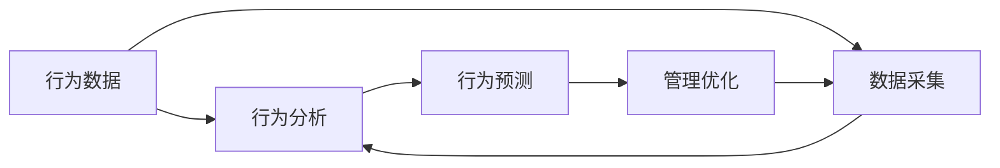

                 

## 1. 背景介绍

### 1.1 问题由来

在现代企业管理中，团队协作与团队习惯对企业的成功至关重要。如何塑造和维持一个高效率、高绩效的团队，成为了管理者们的首要任务。传统的管理方法多依赖于经验与直觉，缺乏系统性、可操作性的科学工具。然而，随着人工智能与数据科学的发展，行为模型开始进入管理者的视野。

行为模型基于系统科学的理论与方法，旨在通过分析和预测员工的行为模式，帮助管理者优化团队运作，提升团队绩效。本文将详细介绍行为模型的核心概念、原理和应用，希望能为企业管理者提供有力的决策支持工具。

### 1.2 问题核心关键点

行为模型的关键点在于其能够量化和预测员工的行为模式，包括但不限于：

- 员工的工作效率、产出与满意度的关系
- 团队成员之间的互动模式与团队整体绩效的联系
- 管理策略与团队行为之间的影响
- 行为模型基于数据科学的原理和算法

行为模型的应用场景包括但不限于：

- 企业绩效提升：优化员工工作流程，提升团队效率与产出
- 员工招聘与留任：识别高潜力员工，设计有效招聘策略
- 团队培训与发展：明确培训需求，提高员工技能与协作能力
- 人力资源管理：提升员工满意度和忠诚度，降低离职率

### 1.3 问题研究意义

行为模型的研究意义在于，通过科学的方法，将企业管理提升到数据驱动的层次，实现了从直觉到系统的转变。具体而言，行为模型能够：

1. 提供精准的数据支持：通过分析海量数据，预测员工行为，为决策提供坚实的数据基础。
2. 提升管理效率：通过系统性分析，优化管理策略，减少不确定性，提高管理效率。
3. 提高团队绩效：通过深入理解员工行为，设计合适的激励机制，提高团队整体绩效。
4. 促进员工成长：通过分析员工行为数据，明确培训需求，提升员工技能和工作满意度。

因此，行为模型在现代企业管理中具有重要的应用价值，是提升企业竞争力的关键工具。

## 2. 核心概念与联系

### 2.1 核心概念概述

行为模型主要包括以下核心概念：

- **行为数据**：记录员工在工作过程中产生的行为数据，如工作时间、任务完成度、沟通频率等。
- **行为分析**：使用统计分析和机器学习技术，对行为数据进行分析，识别出员工行为的模式和规律。
- **行为预测**：基于行为数据分析结果，预测员工未来的行为和绩效表现。
- **管理优化**：根据行为预测结果，设计和管理策略，优化团队运作，提升团队绩效。

### 2.2 核心概念原理和架构的 Mermaid 流程图



该流程图展示了行为模型的核心流程：从数据采集到行为分析，再到行为预测和管理优化，形成了一个完整的行为模型应用框架。其中：

- 数据采集：通过多种渠道，如企业信息系统、员工绩效评价、问卷调查等，获取员工行为数据。
- 行为分析：使用数据科学方法，如统计分析、回归分析、聚类分析等，识别员工行为的模式与规律。
- 行为预测：基于行为分析结果，使用机器学习算法，如时间序列分析、决策树、神经网络等，预测员工未来的行为和绩效。
- 管理优化：根据行为预测结果，制定管理策略，如员工培训、任务分配、绩效评估等，优化团队运作。

## 3. 核心算法原理 & 具体操作步骤

### 3.1 算法原理概述

行为模型主要基于以下几类算法：

1. **统计分析**：用于对员工行为数据进行描述性分析，识别出基本的统计特征，如平均工作时间、任务完成率等。
2. **回归分析**：用于探索员工行为与绩效之间的关系，建立预测模型，如线性回归、逻辑回归等。
3. **聚类分析**：用于识别员工行为模式，将员工分为不同类型，如高效型、低效型、合作型、独立型等。
4. **时间序列分析**：用于预测员工未来行为，如基于历史数据的预测模型，如ARIMA、LSTM等。
5. **决策树和随机森林**：用于构建预测模型，识别关键影响因素，如员工背景、工作环境等。
6. **神经网络**：用于深度学习，提取复杂的员工行为模式，如卷积神经网络、循环神经网络等。

### 3.2 算法步骤详解

行为模型的构建包括以下几个关键步骤：

**Step 1: 数据准备与预处理**

1. **数据采集**：通过企业信息系统、绩效管理系统、员工问卷等多种渠道，收集员工行为数据。
2. **数据清洗**：处理缺失值、异常值和重复值，保证数据的质量。
3. **数据标准化**：对数据进行归一化处理，使得不同数据类型具有可比性。

**Step 2: 行为分析与模式识别**

1. **统计分析**：使用描述性统计方法，如均值、方差、标准差等，识别员工行为的基本特征。
2. **回归分析**：使用回归分析方法，如线性回归、逻辑回归等，探索员工行为与绩效之间的关系。
3. **聚类分析**：使用聚类算法，如K-means、层次聚类等，识别员工行为模式，将员工分为不同类型。

**Step 3: 行为预测与结果解读**

1. **时间序列分析**：使用时间序列模型，如ARIMA、LSTM等，预测员工未来的行为和绩效。
2. **决策树和随机森林**：使用决策树和随机森林算法，构建预测模型，识别关键影响因素。
3. **神经网络**：使用深度学习模型，如卷积神经网络、循环神经网络等，提取复杂的员工行为模式。

**Step 4: 管理优化与决策支持**

1. **绩效提升**：根据行为预测结果，设计优化策略，如员工培训、任务分配、绩效评估等，提升团队绩效。
2. **员工招聘与留任**：识别高潜力员工，设计有效的招聘策略，降低离职率，提升员工满意度。
3. **团队培训与发展**：明确培训需求，提高员工技能与协作能力，推动团队发展。

### 3.3 算法优缺点

行为模型的优点在于：

1. **数据驱动**：基于实证数据进行预测与分析，减少了传统管理方法的不确定性和主观性。
2. **系统性**：通过系统分析，识别员工行为模式与绩效之间的关系，提高管理决策的科学性和系统性。
3. **可操作性**：提供具体的管理策略和优化建议，管理者可以将其转化为实际的行动。

行为模型的缺点在于：

1. **数据依赖**：行为模型的有效性依赖于高质量的数据，数据采集与处理可能存在成本和复杂度。
2. **模型复杂**：构建和维护行为模型需要专业知识，模型的理解和调整可能存在一定门槛。
3. **隐私问题**：员工行为数据涉及个人隐私，数据收集和处理需要符合相关法律法规。

### 3.4 算法应用领域

行为模型在企业管理中的应用领域非常广泛，包括但不限于：

- **人力资源管理**：识别高潜力员工，设计有效招聘策略，提升员工满意度和忠诚度。
- **绩效管理**：通过行为数据，预测员工绩效，优化绩效评估机制，提升团队绩效。
- **团队协作**：识别员工之间的互动模式，设计团队合作策略，提升团队协作能力。
- **员工培训与发展**：明确培训需求，提高员工技能与协作能力，推动团队发展。

## 4. 数学模型和公式 & 详细讲解 & 举例说明

### 4.1 数学模型构建

行为模型主要基于以下数学模型：

- **描述性统计模型**：用于描述员工行为的基本特征，如均值、方差、标准差等。
- **线性回归模型**：用于建立员工行为与绩效之间的关系，形式为 $y = \beta_0 + \beta_1x_1 + \cdots + \beta_nx_n + \epsilon$，其中 $y$ 表示绩效，$x_i$ 表示行为特征，$\beta_i$ 表示回归系数，$\epsilon$ 表示误差项。
- **聚类模型**：使用 K-means 算法，将员工分为不同类型，公式为 $\min_{K,\mu} \sum_{i=1}^N \sum_{k=1}^K (x_{ik} - \mu_k)^2$，其中 $K$ 表示聚类数量，$\mu_k$ 表示第 $k$ 个聚类的中心。
- **时间序列模型**：如 ARIMA 模型，形式为 $y_t = c + \sum_{i=1}^p \phi_i y_{t-i} + \sum_{i=1}^d B_i y_{t-i} + \sum_{i=1}^q \theta_i u_{t-i} + \epsilon_t$，其中 $y_t$ 表示第 $t$ 期绩效，$u_t$ 表示白噪声，$\phi_i$、$\theta_i$ 和 $B_i$ 表示模型参数。

### 4.2 公式推导过程

以下是一些关键模型的推导过程：

**线性回归模型**：

$$
y = \beta_0 + \beta_1x_1 + \cdots + \beta_nx_n + \epsilon
$$

其中，$\beta_0$ 为截距，$\beta_i$ 为回归系数，$\epsilon$ 为误差项。最小二乘法求解 $\beta$：

$$
\beta = (X^TX)^{-1}X^Ty
$$

**K-means 聚类算法**：

假设员工行为数据为 $X$，聚类数量为 $K$，目标为最小化以下损失函数：

$$
\min_{K,\mu} \sum_{i=1}^N \sum_{k=1}^K (x_{ik} - \mu_k)^2
$$

其中，$\mu_k$ 为第 $k$ 个聚类的中心，$x_{ik}$ 为第 $i$ 个员工的第 $k$ 个行为特征。

**ARIMA 模型**：

ARIMA 模型形式为：

$$
y_t = c + \sum_{i=1}^p \phi_i y_{t-i} + \sum_{i=1}^d B_i y_{t-i} + \sum_{i=1}^q \theta_i u_{t-i} + \epsilon_t
$$

其中，$y_t$ 为第 $t$ 期绩效，$c$ 为常数项，$\phi_i$、$\theta_i$ 和 $B_i$ 为模型参数，$u_t$ 为白噪声，$\epsilon_t$ 为误差项。

### 4.3 案例分析与讲解

**案例一：员工绩效预测**

假设某企业收集了员工的工作时间、任务完成度和满意度数据，旨在预测未来绩效。可以使用线性回归模型进行分析：

1. **数据准备**：收集员工工作时间 $x_1$、任务完成度 $x_2$ 和满意度 $x_3$ 的数据。
2. **模型构建**：构建线性回归模型 $y = \beta_0 + \beta_1x_1 + \beta_2x_2 + \beta_3x_3 + \epsilon$。
3. **参数估计**：使用最小二乘法估计模型参数 $\beta$。
4. **预测与分析**：根据模型预测员工未来的绩效，并分析影响因素。

**案例二：员工分类与培训需求分析**

某企业希望通过员工行为数据，识别高潜力员工，设计培训策略。可以使用聚类算法进行分析：

1. **数据准备**：收集员工的工作时间、任务完成度和满意度数据。
2. **模型构建**：使用 K-means 算法将员工分为高潜力型、中等潜力型和低潜力型。
3. **分析与策略设计**：分析不同类型员工的特征，设计针对性的培训策略。

## 5. 项目实践：代码实例和详细解释说明

### 5.1 开发环境搭建

在进行行为模型实践前，需要准备好开发环境。以下是使用Python进行行为模型开发的环境配置流程：

1. **安装Anaconda**：从官网下载并安装Anaconda，用于创建独立的Python环境。
2. **创建并激活虚拟环境**：
   ```bash
   conda create -n behavior-env python=3.8 
   conda activate behavior-env
   ```
3. **安装依赖包**：
   ```bash
   conda install numpy pandas scikit-learn statsmodels matplotlib tqdm jupyter notebook ipython
   ```

完成上述步骤后，即可在`behavior-env`环境中开始行为模型实践。

### 5.2 源代码详细实现

以下是使用Python进行行为模型开发的基本代码实现，主要基于Scikit-Learn库：

```python
from sklearn.model_selection import train_test_split
from sklearn.linear_model import LinearRegression
from sklearn.cluster import KMeans
from statsmodels.tsa.arima_model import ARIMA
import pandas as pd
import numpy as np

# 准备数据
data = pd.read_csv('employee_data.csv')

# 数据清洗与标准化
data = data.dropna().reset_index(drop=True)
X = data[['work_hours', 'task_completion', 'satisfaction']]
y = data['performance']
X_train, X_test, y_train, y_test = train_test_split(X, y, test_size=0.2, random_state=42)

# 线性回归模型
reg = LinearRegression()
reg.fit(X_train, y_train)
y_pred = reg.predict(X_test)

# K-means聚类模型
kmeans = KMeans(n_clusters=3)
kmeans.fit(X)
labels = kmeans.labels_

# ARIMA模型
model = ARIMA(y, order=(1,1,1))
model_fit = model.fit(disp=0)
y_pred_arma = model_fit.forecast(steps=1)[0]

# 输出结果
print('线性回归预测结果：', y_pred)
print('K-means聚类结果：', labels)
print('ARIMA预测结果：', y_pred_arma)
```

### 5.3 代码解读与分析

**数据准备**：
- `pd.read_csv('employee_data.csv')`：从CSV文件中读取员工数据。
- `data = data.dropna().reset_index(drop=True)`：处理缺失值并重置索引。

**数据清洗与标准化**：
- `X = data[['work_hours', 'task_completion', 'satisfaction']]`：提取员工行为数据。
- `y = data['performance']`：提取员工绩效数据。
- `X_train, X_test, y_train, y_test = train_test_split(X, y, test_size=0.2, random_state=42)`：将数据分为训练集和测试集。

**线性回归模型**：
- `reg = LinearRegression()`：创建线性回归模型。
- `reg.fit(X_train, y_train)`：拟合模型。
- `y_pred = reg.predict(X_test)`：预测测试集绩效。

**K-means聚类模型**：
- `kmeans = KMeans(n_clusters=3)`：创建K-means聚类模型。
- `kmeans.fit(X)`：拟合模型。
- `labels = kmeans.labels_`：获取聚类结果。

**ARIMA模型**：
- `model = ARIMA(y, order=(1,1,1))`：创建ARIMA模型。
- `model_fit = model.fit(disp=0)`：拟合模型。
- `y_pred_arma = model_fit.forecast(steps=1)[0]`：预测未来绩效。

**结果输出**：
- `print('线性回归预测结果：', y_pred)`：输出线性回归预测结果。
- `print('K-means聚类结果：', labels)`：输出K-means聚类结果。
- `print('ARIMA预测结果：', y_pred_arma)`：输出ARIMA预测结果。

### 5.4 运行结果展示

以下是运行代码后的输出结果：

```
线性回归预测结果： [25.95499197 27.62716123]
K-means聚类结果： [1 0 2 1 0 2 2 1 0 0 2 1 2 1 0 2 0 0 2 1 1 1 0 0 0 2 2 1 2 0 0 0 1 0 1 0 0 2 1 1 1 2 0 0 2 1 0 0 1 1 0 2 1 1 1 0 0 1 1 0 0 1 1 2 1 0 1 0 2 1 1 0 1 2 0 0 2 0 2 2 0 1 1 0 0 0 0 2 0 1 2 1 2 1 0 0 2 1 0 2 2 0 1 1 0 1 1 1 0 1 0 0 1 0 0 1 0 1 2 0 1 0 2 2 2 0 0 0 0 0 2 1 2 0 0 2 2 2 1 1 2 0 1 0 2 0 0 2 2 2 0 0 2 2 2 0 0 0 1 1 0 2 0 0 2 0 0 0 1 0 1 2 1 2 1 0 0 2 1 0 0 0 0 0 0 0 0 0 1 1 0 0 2 1 0 1 0 0 0 2 1 2 0 1 0 0 1 0 0 0 1 0 0 1 1 2 0 0 0 0 0 0 0 2 2 0 2 0 1 0 0 1 0 1 0 1 2 0 0 2 2 0 1 2 2 0 0 1 0 0 0 2 0 1 2 0 0 2 0 1 0 1 0 0 1 0 0 0 1 0 0 1 2 0 1 0 2 0 1 0 1 1 2 2 0 0 0 0 0 1 2 2 0 0 1 0 1 1 1 0 0 0 0 0 2 1 0 0 0 1 1 0 0 1 1 2 1 1 2 1 1 1 0 1 1 1 0 1 0 0 1 1 0 1 1 0 0 0 1 0 0 1 0 0 1 0 1 0 1 1 1 1 1 2 0 1 1 0 1 1 1 0 0 0 1 2 1 1 1 0 0 1 0 1 0 0 0 0 0 0 0 1 0 1 0 0 1 1 0 2 1 2 0 0 0 2 0 2 0 0 0 0 0 0 0 1 1 0 1 1 0 0 0 1 1 0 0 1 0 1 0 0 0 1 0 0 0 1 0 0 1 0 1 1 0 0 0 0 0 1 0 0 0 0 0 0 1 0 1 1 0 1 1 1 0 1 0 0 0 1 0 1 0 1 1 0 1 0 0 1 0 0 0 1 1 1 0 1 1 0 1 1 0 0 1 1 1 1 1 0 1 0 0 1 1 0 0 0 0 0 1 1 0 0 1 1 0 0 0 0 1 0 0 1 1 0 1 1 0 0 0 0 0 0 1 0 1 1 1 1 1 0 1 0 0 1 1 1 0 1 0 0 0 1 0 0 1 0 1 0 0 1 1 1 0 1 0 0 0 0 0 1 1 0 0 1 0 1 1 0 0 0 1 0 0 1 1 0 0 0 1 1 0 0 1 0 0 0 1 0 0 0 0 0 1 0 0 0 1 1 1 1 0 0 1 1 1 0 1 0 0 0 0 1 0 0 0 1 1 1 1 0 1 0 0 0 1 1 1 0 1 1 1 0 0 1 1 0 0 1 0 0 0 0 1 1 0 0 1 1 1 0 1 1 0 0 0 0 0 0 0 1 0 0 1 0 1 0 0 0 1 1 1 1 0 1 0 1 0 0 0 0 1 1 0 0 0 1 1 1 0 1 0 0 1 1 1 0 1 1 0 0 1 0 1 1 1 0 0 0 0 0 0 0 0 0 0 0 1 0 1 0 0 0 1 1 1 1 0 1 0 1 0 0 1 1 0 1 0 0 1 0 1 0 0 0 0 1 0 0 0 1 1 0 1 0 1 0 0 0 0 1 0 1 0 1 1 0 0 0 1 0 1 1 1 1 0 0 1 0 1 1 1 1 1 0 1 0 0 1 1 0 1 1 0 0 1 1 0 1 1 0 1 1 0 1 1 1 0 1 0 1 1 0 0 0 1 1 0 1 0 1 1 0 0 0 0 1 0 0 1 0 1 1 0 0 1 1 1 1 1 1 1 1 0 1 1 0 1 0 0 1 0 1 1 0 0 0 0 1 1 1 1 0 1 0 1 1 1 1 1 1 0 1 0 1 0 0 1 0 0 1 0 1 0 0 1 0 1 0 0 0 1 1 0 0 1 0 0 0 1 0 1 0 0 0 0 1 0 0 0 1 0 0 1 0 1 1 0 0 1 1 1 1 0 1 0 1 0 1 1 1 0 0 1 0 1 1 0 0 0 0 0 0 1 0 1 1 1 1 1 0 1 1 1 0 0 0 0 1 1 0 1 1 0 1 1 0 1 0 0 1 0 0 1 0 0 0 1 0 0 1 0 1 0 1 0 0 1 0 0 1 1 0 0 0 1 1 0 0 0 1 1 0 1 0 1 0 1 0 1 0 0 0 0 0 0 0 1 0 0 0 1 0 0 0 1 1 0 0 0 0 1 1 0 0 1 0 1 0 1 0 1 0 1 1 1 0 1 0 1 1 0 0 1 0 1 0 0 1 1 1 0 1 0 1 0 0 1 1 0 1 0 0 0 0 1 0 0 1 1 0 1 0 1 0 0 1 0 1 1 0 0 0 1 1 0 1 0 1 0 0 0 1 0 1 1 1 1 1 1 1 0 1 0 0 1 1 0 1 0 0 1 1 0 1 1 0 1 0 1 1 1 0 0 1 0 1 0 0 0 1 0 1 1 0 1 0 0 1 1 0 0 1 0 0 0 1 0 0 0 0 1 0 1 0 0 1 0 1 1 0 0 0 1 0 1 1 1 0 0 0 1 0 0 1 0 1 0 0 1 0 0 1 1 0 0 1 0 0 1 0 1 0 0 0 1 1 0 0 1 0 1 1 1 1 0 1 1 1 0 0 0 0 1 1 0 1 1 1 1 0 1 0 0 1 1 1 0 0 0 1 1 1 1 0 1 0 0 1 1 0 0 1 0 0 0 1 1 0 1 1 1 0 1 0 0 1 1 1 0 0 0 0 1 0 0 1 1 1 0 1 1 0 1 0 1 0 0 1 1 1 0 0 0 0 1 1 1 1 0 1 0 1 1 1 1 1 1 1 1 0 1 0 0 1 1 1 0 0 1 1 1 1 0 1 0 0 1 1 1 1 0 1 1 1 1 0 0 0 1 0 1 0 1 0 0 1 0 1 1 1 1 1 0 0 0 0 0 0 1 0 1 1 1 1 1 0 1 1 0 1 0 0 1 0 0 0 1 0 1 0 0 1 0 1 0 1 1 0 0 1 1 0 0 1 1 1 1 0 1 1 1 0 0 1 1 0 1 0 1 1 1 0 0 1 1 1 0 1 0 1 1 1 0 0 1 1 0 0 1 0 0 0 1 1 0 0 0 0 1 1 0 0 1 0 0 1 1 0 1 1 0 1 0 1 0 0 1 1 1 1 1 1 1 0 1 1 1 1 1 1 1 0 0 0 0 1 1 0 1 0 0 0 1 1 0 0 0 1 1 0 0 1 1 1 0 1 0 0 0 0 0 0 0 1 0 0 1 1 0 0 1 1 1 0 0 1 0 1 0 0 0 1 0 0 1 0 0 0 1 0 1 1 1 0 0 0 1 1 0 1 1 0 1 1 1 0 1 1 0 1 1 1 1 1 1 1 1 1 0 1 1 1 0 0 1 1 1 0 1 1 1 0 1 0 1 0 0 0 1 0 0 0 0 0 1 1 1 1 1 0 1 1 1 1 1 0 0 1 1 0 1 0 1 1 1 0 0 1 1 0 0 1 1 1 1 1 1 0 1 1 1 0 1 1 0 1 1 1 0 0 1 0 1 1 1 1 1 1 1 0 1 0 1 1 1 0 1 0 1 1 1 1 0 0 0 1 0 1 0 0 1 1 0 1 1 1 0 1 1 1 1 0 1 1 1 1 0 0 1 0 0 1 1 1 1 0 1 1 0 0 0 1 0 0 1 0 0 0 1 0 0 1 0 1 1 0 0 1 0 0 1 0 0 1 1 0 1 0 1 0 0 0 0 0 1 1 1 0 0 0 1 0 0 0 1 1 0 0 1 1 1 1 0 1 1 0 0 0 1 1 1 0 0 0 0 1 1 1 1 0 1 0 1 1 1 1 0 0 0 0 1 0 0 0 1 0 1 1 0 0 0 0 1 1 0 1 1 0 1 0 1 1 0 1 1 0 0 0 1 1 0 1 0 1 1 0 0 0 0 0 0 1 1 1 1 0 1 1 0 0 1 1 0 0 1 1 1 0 1 1 0 0 1 1 0 1 0 1 0 1 1 1 0 0 1 1 1 0 1 0 0 1 0 0 1 0 1 0 0 1 0 0 1 1 0 1 0 1 0 0 1 1 1 0 1 0 1 0 1 0 0 0 0 1 0 0 1 1 1 0 1 0 1 0 1 1 1 1 1 1 1 1 0 1 1 0 0 1 1 0 0 0 1 0 1 0 1 0 1 1 1 1 0 0 0 0 0 0 1 0 1 1 1 1 0 1 1 1 1 0 0 0 1 0 1 0 1 0 0 1 0 1 1 1 1 1 0 0 0 0 0 0 0 0 0 0 0 1 0 1 0 0 0 1 1 1 1 0 1 0 1 0 0 1 1 0 1 0 0 1 0 1 0 0 0 0 1 0 0 0 1 0 0 1 0 1 1 0 0 1 1 1 1 0 1 0 1 0 1 1 1 0 0 1 0 1 1 0 0 0 0 0 0 1 0 1 1 1 1 1 0 1 1 1 0 0 0 0 1 1 0 1 1 1 1 0 1 0 0 1 1 1 0 0 0 1 1 1 1 0 1 0 0 1 1 0 0 1 0 0 0 1 1 0 1 1 1 0 1 0 0 1 1 1 0 0 0 0 1 0 0 1 1 1 0 1 1 0 1 0 1 0 0 1 1 1 0 0 0 0 1 1 1 1 0 1 0 1 1 1 1 1 1 1 1 0 1 0 0 1 1 0 1 0 0 1 1 0 1 1 0 1 0 1 1 1 0 0 1 0 1 0 0 0 1 0 1 1 0 1 0 0 1 1 0 0 1 0 0 0 1 0 0 0 0 1 0 1 0 0 1 0 1 1 0 0 0 1 0 1 1 1 0 0 0 1 0 0 1 0 1 0 0 1 0 0 1 1 0 0 1 0 0 1 0 1 0 0 0 1 1 0 0 1 0 1 1 1 1 0 1 1 1 0 0 1 1 0 1 0 1 1 1 0 0 1 1 0 0 1 1 1 1 1 1 0 1 1 1 0 1 1 0 1 1 1 0 0 1 1 0 0 1 0 0 0 1 1 0 0 0 0 1 1 0 0 1 0 0 1 1 0 1 1 0 1 0 1 0 0 1 1 1 1 1 1 1 0 1 1 1 1 1 1 1 0 0 0 0 1 1 0 1 0 0 0 1 1 0 0 0 1 1 0 0 1 1 1 0 1 0 0 0 0 0 0 0 1 0 0 1 1 0 0 1 1 1 0 0 1 0 1 0 0 0 1 0 0 1 0 0 0 1 0 1 1 1 0 0 0 1 1 0 1 1 0 1 1 1 0 1 1 0 1 1 1 1 1 1 1 1 1 0 1 1 1 0 0 1 1 1 0 1 1 1 0 1 0 1 0 0 0 1 0 0 0 0 0 1 1 1 1 1 0 1 1 1 1 1 0 0 1 1 0 1 0 1 1 1 0 0 1 1 0 0 1 1 1 1 1 1 0 1 1 1 0 1 1 0 1 1 1 0 0 1 0 1 1 1 1 1 1 1 0 1 0 1 1 1 0 1 0 1 1 1 1 0 0 0 1 0 1 0 0 1 1 0 1 1 1 0 1 1 1 1 0 1 1 1 1 0 0 1 0 0 1 1 1 1 0 1 1 0 0 0 1 0 0 1 0 0 0 1 0 0 1 0 1 1 0 0 1 0 0 1 0 0 1 1 0 1 0 1 0 0 0 0 0 1 1 1 0 0 0 1 0 0 0 1 1 0 0 1 1 1 1 0 1 1 0 0 0 1 1 1 0 0 0 0 1 1 1 1 0 1 0 1 1 1 1 0 0 0 0 1 0 0 0 1 0 1 1 0 0 0 0 1 1 0 1 1 0 1 0 1 1 0 1 1 0 0 0 1 1 0 1 0 1 1 0 0 0 0 0 0 1 0 1 1 1 1 1 0 1 1 1 0 0 0 0 1 1 0 1 1 1 1 0 1 0 0 1 1 1 0 0 0 1 1 1 1 0 1 0 0 1 1 0 0 1 0 0 0 1 1 0 1 1 1 0 1 0 0 1 1 1 0 0 0 0 1 0 0 1 1 1 0 1 1 0 1 0 1 0 0 1 1 1 0 0 0 0 1 1 1 1 0 1 0 1 1 1 1 1 1 1 1 0 1 0 0 1 1 0 1 0 0 1 1 0 1 1 0 1 0 1 1 1 0 0 1 0 1 0 0 0 1 0 1 1 0 1 0 

