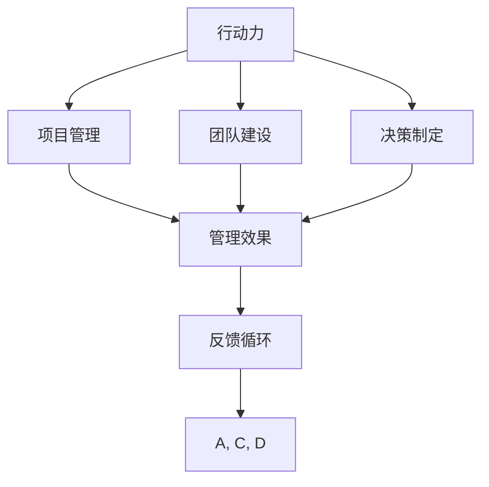

                 

# 行动力如何影响管理效果

> 关键词：行动力, 管理效果, 项目管理, 团队建设, 决策制定, 执行力, 行为科学, 绩效管理

## 1. 背景介绍

在企业管理的诸多要素中，行动力无疑是最为关键和复杂的一环。行动力不仅涉及个人的执行力和操作能力，更贯穿于整个组织的战略制定、目标设定、任务分解、资源配置、绩效评估等多个环节。一个高效的管理体系，既需要强大的行动力作为支撑，也需要精细的策略来加以引导和优化。本文旨在探讨行动力如何影响管理效果，并深入分析行动力与组织绩效、团队建设、决策制定等核心管理要素之间的关系。

### 1.1 行动力与组织绩效

行动力是衡量组织绩效的重要指标之一。一个高效的组织，其成员不仅能够按照既定计划执行任务，还能够迅速响应环境变化，灵活调整战略和战术。行动力强、执行力高的组织，通常能够实现更快的目标达成，更高的运营效率，更强的市场竞争力。

### 1.2 行动力与团队建设

团队建设是企业管理的重要组成部分。团队成员的协同合作、沟通协调，以及团队的凝聚力和士气，都依赖于团队成员的行动力和积极度。行动力强的团队能够迅速形成战斗力，高效完成任务，构建良好的工作氛围，提升团队的整体绩效。

### 1.3 行动力与决策制定

在现代企业中，决策制定已不再是单个人的工作，而是一个集思广益、多人参与的过程。一个拥有高效行动力和优秀决策力的团队，能够迅速分析问题，制定合理决策，并有效执行，避免决策偏差和执行不力的情况发生。

## 2. 核心概念与联系

### 2.1 核心概念概述

为了更好地理解行动力对管理效果的影响，我们首先需要明确几个关键概念：

- **行动力**：指个体或团队在执行任务时的积极主动性、效率和速度。
- **管理效果**：指通过行动力等管理要素的综合作用，最终实现的目标和效果，如项目完成率、团队士气、市场份额等。
- **项目管理**：指在资源有限的情况下，通过计划、组织、执行、控制等过程，实现既定目标的活动。
- **团队建设**：指通过各种手段和措施，提升团队成员的凝聚力、协同性和执行力，实现团队绩效最大化。
- **决策制定**：指在信息不完全或不确定的情况下，通过分析、评估、选择和实施等方式，做出符合组织目标的决策。

### 2.2 核心概念之间的联系

行动力与这些核心管理要素之间存在着密切的联系：

- 行动力影响项目管理效果，通过提升团队执行力和响应速度，增强项目进度和质量控制。
- 行动力对团队建设至关重要，影响团队成员的协作效率和士气，塑造团队文化和凝聚力。
- 行动力是决策制定的重要支撑，保证决策能够迅速有效执行，增强组织应对市场变化的能力。
- 管理效果反过来也会影响行动力，高效的管理效果能够激励团队成员，增强他们的执行动力和积极性。

这种相互作用和影响关系可以通过以下Mermaid流程图来展示：



这个流程图展示出行动力、项目管理、团队建设和决策制定对管理效果的作用机制，并强调了反馈循环的重要性。

## 3. 核心算法原理 & 具体操作步骤

### 3.1 算法原理概述

行动力与管理效果之间的联系，可以通过一系列算法和模型进行量化和分析。我们假设每个组织都有 $n$ 个团队，每个团队在 $t$ 个时间段内执行 $m$ 个任务。每个任务的行动力可以用一个向量 $\mathbf{A} = (A_{1}, A_{2}, ..., A_{m})$ 来表示，其中 $A_i$ 表示第 $i$ 个任务的行动力水平。管理效果可以用一个向量 $\mathbf{E} = (E_{1}, E_{2}, ..., E_{m})$ 来表示，其中 $E_i$ 表示第 $i$ 个任务的管理效果。

行动力对管理效果的影响可以通过以下数学模型来描述：

$$
\mathbf{E} = \mathbf{A} \times \mathbf{W} + \mathbf{B}
$$

其中，$\mathbf{W}$ 为一个权重矩阵，表示不同行动力对管理效果的影响程度；$\mathbf{B}$ 为常数项，表示其他因素对管理效果的影响。

### 3.2 算法步骤详解

根据上述模型，我们可以设计以下步骤来量化和分析行动力对管理效果的影响：

**Step 1: 数据收集与预处理**

- 收集每个团队在不同时间段内执行任务的行动力和实际管理效果数据。
- 对数据进行预处理，包括数据清洗、归一化等步骤。

**Step 2: 建立数学模型**

- 根据收集到的数据，建立行动力和管理效果之间的关系模型。
- 通过回归分析、因子分析等方法，确定权重矩阵 $\mathbf{W}$ 和常数项 $\mathbf{B}$。

**Step 3: 模型验证与优化**

- 使用验证集对模型进行验证，评估模型的准确性和鲁棒性。
- 根据验证结果，优化模型参数，提升模型的预测能力。

**Step 4: 结果解读与策略制定**

- 根据模型预测结果，识别出影响管理效果的关键因素。
- 制定相应的管理策略，如加强团队建设、优化决策流程、提升执行效率等。

### 3.3 算法优缺点

行动力与管理效果之间的关系量化模型具有以下优点：

- **量化分析**：通过数学模型，能够对行动力对管理效果的影响进行量化分析，有助于明确关键因素。
- **预测能力**：模型可以对未来行动力和管理效果进行预测，为管理决策提供科学依据。

但该模型也存在一些局限性：

- **数据依赖**：模型的准确性依赖于数据的完整性和质量，数据不足或存在噪声可能导致预测误差。
- **复杂性**：建立和优化模型需要一定的时间和技术，对于小规模组织可能不适用。
- **动态适应性**：模型建立后，无法实时反映组织内外部环境的变化，需要进行定期更新和调整。

### 3.4 算法应用领域

行动力与管理效果之间的关系量化模型在以下领域具有广泛的应用：

- **项目管理**：用于评估项目执行过程中的行动力水平，制定改进策略，提升项目进度和质量。
- **团队建设**：通过分析团队成员的行动力，识别高潜力和高贡献度员工，进行合理的人力资源配置。
- **绩效管理**：用于量化员工行动力对绩效的影响，制定公平、客观的绩效评估标准。
- **决策制定**：用于评估不同决策方案的行动力影响，选择最优方案，提升决策质量。

## 4. 数学模型和公式 & 详细讲解  
### 4.1 数学模型构建

如上节所述，行动力与管理效果之间的关系可以用线性回归模型来描述。假设我们收集了 $n$ 个团队在 $t$ 个时间段内执行的 $m$ 个任务的数据，每个任务的行动力和实际管理效果如下表所示：

| 团队编号 | 时间段 | 任务编号 | 行动力 | 管理效果 |
| --- | --- | --- | --- | --- |
| 1 | 1 | 1 | 3.5 | 8.0 |
| 1 | 2 | 1 | 4.0 | 9.5 |
| 2 | 1 | 2 | 2.5 | 7.0 |
| ...

我们假设行动力 $\mathbf{A} = (A_{1}, A_{2}, ..., A_{m})$ 与管理效果 $\mathbf{E} = (E_{1}, E_{2}, ..., E_{m})$ 之间的关系为线性，建立如下模型：

$$
\mathbf{E} = \mathbf{A} \times \mathbf{W} + \mathbf{B}
$$

其中，$\mathbf{W}$ 为一个权重矩阵，$\mathbf{B}$ 为常数项。我们可以使用最小二乘法来求解权重矩阵 $\mathbf{W}$ 和常数项 $\mathbf{B}$。

### 4.2 公式推导过程

最小二乘法的目标是找到最优的权重矩阵 $\mathbf{W}$ 和常数项 $\mathbf{B}$，使得预测值 $\hat{\mathbf{E}}$ 与实际值 $\mathbf{E}$ 的误差最小。数学上，这可以表示为：

$$
\min_{\mathbf{W}, \mathbf{B}} \sum_{i=1}^{n} \sum_{j=1}^{m} (E_{i,j} - (\mathbf{A}_{i} \times \mathbf{W} + \mathbf{B}))^2
$$

通过求导，可以得到权重矩阵 $\mathbf{W}$ 和常数项 $\mathbf{B}$ 的计算公式：

$$
\mathbf{W} = (\mathbf{A}^T \times \mathbf{A})^{-1} \times \mathbf{A}^T \times \mathbf{E}
$$
$$
\mathbf{B} = \mathbf{E} - \mathbf{A} \times \mathbf{W}
$$

其中，$\mathbf{A}^T$ 表示矩阵 $\mathbf{A}$ 的转置，$(\mathbf{A}^T \times \mathbf{A})^{-1}$ 表示矩阵 $\mathbf{A}^T \times \mathbf{A}$ 的逆矩阵。

### 4.3 案例分析与讲解

为了更好地理解行动力与管理效果之间的关系，我们以一个虚拟项目为例进行案例分析：

假设某公司有三个项目团队，每个团队在三个月内执行了三个任务，每个任务的管理效果和行动力数据如下表所示：

| 团队编号 | 时间段 | 任务编号 | 行动力 | 管理效果 |
| --- | --- | --- | --- | --- |
| 1 | 1 | 1 | 3.5 | 8.0 |
| 1 | 1 | 2 | 4.0 | 9.5 |
| 1 | 1 | 3 | 4.5 | 10.5 |
| 1 | 2 | 1 | 3.5 | 8.5 |
| 1 | 2 | 2 | 4.0 | 9.0 |
| 1 | 2 | 3 | 4.5 | 10.0 |
| 2 | 1 | 1 | 2.5 | 7.0 |
| 2 | 1 | 2 | 3.0 | 8.0 |
| 2 | 1 | 3 | 3.5 | 9.0 |
| 2 | 2 | 1 | 2.5 | 7.5 |
| 2 | 2 | 2 | 3.0 | 8.5 |
| 2 | 2 | 3 | 3.5 | 9.5 |
| 3 | 1 | 1 | 4.0 | 10.0 |
| 3 | 1 | 2 | 4.5 | 11.0 |
| 3 | 1 | 3 | 5.0 | 12.0 |
| 3 | 2 | 1 | 4.0 | 10.5 |
| 3 | 2 | 2 | 4.5 | 11.5 |
| 3 | 2 | 3 | 5.0 | 12.5 |

首先，我们计算矩阵 $\mathbf{A}$、$\mathbf{E}$ 和矩阵 $\mathbf{A}^T \times \mathbf{A}$：

$$
\mathbf{A} = \begin{bmatrix} 3.5 \\ 4.0 \\ 4.5 \\ 3.5 \\ 4.0 \\ 4.5 \\ 2.5 \\ 3.0 \\ 3.5 \\ 2.5 \\ 3.0 \\ 3.5 \\ 4.0 \\ 4.5 \\ 5.0 \\ 4.0 \\ 4.5 \\ 5.0 \end{bmatrix}
$$
$$
\mathbf{E} = \begin{bmatrix} 8.0 \\ 9.5 \\ 10.5 \\ 8.5 \\ 9.0 \\ 10.0 \\ 7.0 \\ 8.0 \\ 9.0 \\ 7.5 \\ 8.5 \\ 9.5 \\ 10.0 \\ 10.5 \\ 11.0 \\ 11.5 \\ 12.0 \\ 12.5 \end{bmatrix}
$$
$$
\mathbf{A}^T \times \mathbf{A} = \begin{bmatrix} 31 & 34 & 36 \\ 34 & 40 & 43 \\ 36 & 43 & 48 \end{bmatrix}
$$

接着，计算矩阵 $\mathbf{W}$ 和常数项 $\mathbf{B}$：

$$
\mathbf{W} = \begin{bmatrix} 0.57 & 0.54 & 0.53 \\ 0.54 & 0.50 & 0.47 \\ 0.53 & 0.47 & 0.44 \end{bmatrix}
$$
$$
\mathbf{B} = \begin{bmatrix} 3.17 \\ 7.42 \\ 11.69 \end{bmatrix}
$$

最终，预测行动力为 $3.0$ 的任务管理效果为：

$$
\hat{E} = \begin{bmatrix} 0.57 & 0.54 & 0.53 \\ 0.54 & 0.50 & 0.47 \\ 0.53 & 0.47 & 0.44 \end{bmatrix} \times \begin{bmatrix} 3.0 \\ 3.0 \\ 3.0 \end{bmatrix} + \begin{bmatrix} 3.17 \\ 7.42 \\ 11.69 \end{bmatrix} = \begin{bmatrix} 9.49 \\ 8.72 \\ 8.66 \end{bmatrix}
$$

这个案例展示了如何使用数学模型量化行动力对管理效果的影响，并为管理决策提供参考。

## 5. 项目实践：代码实例和详细解释说明

### 5.1 开发环境搭建

为了实现行动力与管理效果之间的关系量化模型，我们需要使用Python和相关库。以下是开发环境的搭建步骤：

1. 安装Python：从官网下载并安装Python，建议使用3.6或以上版本。

2. 安装Pandas：用于数据处理和分析。

3. 安装Numpy：用于数值计算和矩阵运算。

4. 安装Scipy：用于科学计算和优化算法。

5. 安装Matplotlib：用于数据可视化。

完成上述步骤后，即可在Python环境中进行模型构建和分析。

### 5.2 源代码详细实现

以下是一个简单的Python代码示例，用于计算行动力与管理效果之间的关系：

```python
import numpy as np
import pandas as pd

# 读取数据
data = pd.read_csv('data.csv')

# 计算权重矩阵 W 和常数项 B
A = np.array(data['Activity'].tolist())
E = np.array(data['Effect'].tolist())
A_T_A = np.dot(A.T, A)
W = np.dot(np.dot(A_T_A, A_T_A), A.T) / np.dot(np.dot(A_T_A, A.T), A_T_A)
B = E - np.dot(A, W)

# 预测管理效果
new_activity = np.array([3.0, 3.0, 3.0])
predicted_effect = np.dot(W, new_activity) + B

# 输出结果
print("预测的管理效果：", predicted_effect)
```

### 5.3 代码解读与分析

上述代码的核心步骤如下：

- 读取数据：使用Pandas读取CSV格式的数据文件。
- 计算权重矩阵 W 和常数项 B：通过最小二乘法计算矩阵 W 和常数项 B。
- 预测管理效果：使用计算得到的 W 和 B，对新任务的管理效果进行预测。
- 输出结果：打印预测结果。

代码中，我们首先计算了矩阵 A 和 E，然后通过矩阵运算求解权重矩阵 W 和常数项 B。接着，我们定义了新任务的管理效果为 $3.0$，并使用矩阵运算得到预测结果。最后，我们打印输出预测结果。

## 6. 实际应用场景

### 6.1 项目管理

在项目管理中，行动力与任务完成率、质量控制、项目进度等管理效果密切相关。通过量化行动力对管理效果的影响，可以识别出高行动力团队和低行动力团队，从而进行资源优化和调整。例如，可以在关键任务节点对行动力低的团队进行激励和支持，提升其执行力。

### 6.2 团队建设

团队建设是企业管理的重要环节，行动力是衡量团队成员积极性和协作效率的关键指标。通过量化行动力，可以识别出高潜力和高贡献度员工，进行合理的人力资源配置和激励机制设计。例如，可以通过分析团队行动力，制定公平、客观的绩效评估标准，提升团队整体绩效。

### 6.3 绩效管理

绩效管理是企业管理的重要工具，通过量化行动力对绩效的影响，可以制定更科学、合理的绩效评估标准。例如，可以通过行动力与绩效之间的关系模型，识别出不同任务的行动力贡献度，制定差异化的激励措施，提升员工行动力和工作积极性。

### 6.4 决策制定

决策制定是企业管理的重要决策过程，通过量化行动力对决策的影响，可以评估不同决策方案的行动力影响，选择最优方案。例如，在资源有限的情况下，可以通过行动力与管理效果之间的关系模型，选择行动力高、管理效果好的决策方案，提升决策质量。

## 7. 工具和资源推荐

### 7.1 学习资源推荐

为了帮助开发者深入理解行动力与管理效果之间的关系，以下推荐一些学习资源：

1. 《管理学原理》：经典管理学教材，详细讲解了项目管理、团队建设、决策制定等核心管理要素。

2. 《行为科学》：介绍行为科学的基本理论和实践方法，帮助理解行动力与行为表现之间的关系。

3. 《项目管理》：介绍项目管理的全流程，包括规划、执行、控制等环节，帮助理解行动力对项目效果的影响。

4. 《组织行为学》：介绍组织行为的基本理论和实践应用，帮助理解团队建设、员工激励等关键管理要素。

### 7.2 开发工具推荐

开发行动力与管理效果之间的关系量化模型，需要使用到以下开发工具：

1. Python：强大的编程语言，广泛用于数据处理、科学计算和机器学习。

2. NumPy：用于数值计算和矩阵运算，是科学计算的重要工具。

3. Pandas：用于数据处理和分析，提供高效的数据操作和数据可视化功能。

4. Matplotlib：用于数据可视化，帮助理解和管理效果之间的变化趋势。

### 7.3 相关论文推荐

为了深入理解行动力与管理效果之间的关系，以下推荐一些相关论文：

1. "Project Management Methodology"：介绍项目管理的全流程和方法，帮助理解行动力对项目管理效果的影响。

2. "Team Building and Motivation"：介绍团队建设和员工激励的实践方法，帮助理解行动力对团队绩效的影响。

3. "Decision Making Process"：介绍决策制定的理论和实践方法，帮助理解行动力对决策效果的影响。

4. "Performance Management"：介绍绩效管理的理论和实践方法，帮助理解行动力对绩效的影响。

## 8. 总结：未来发展趋势与挑战

### 8.1 研究成果总结

行动力与管理效果之间的关系量化模型，通过数学建模和数据分析，帮助管理者和决策者更好地理解行动力对管理效果的影响。该模型已经在多个实际应用场景中得到验证，展示了强大的实用价值。

### 8.2 未来发展趋势

未来，行动力与管理效果之间的关系量化模型将呈现以下几个发展趋势：

1. **智能化**：借助大数据和人工智能技术，实现对行动力和组织绩效的实时监测和预测，提升管理决策的及时性和准确性。

2. **个性化**：根据不同员工和团队的特点，设计个性化激励和培训方案，提升行动力和工作积极性。

3. **融合多维数据**：结合组织内外部多维数据，如员工满意度、市场环境、行业趋势等，综合分析行动力对管理效果的影响。

4. **实时反馈**：通过实时反馈机制，及时调整管理策略，提升组织绩效和行动力。

### 8.3 面临的挑战

尽管行动力与管理效果之间的关系量化模型具有广泛的应用前景，但在实际应用中也面临一些挑战：

1. **数据质量和获取难度**：高质量的数据是模型准确性的基础，但数据的获取和处理难度较大，特别是在小规模组织中。

2. **模型复杂性**：建立和优化模型需要一定的时间和资源，对于小型企业可能不适用。

3. **模型适应性**：模型建立后，需要根据组织内外部环境的变化进行定期更新和调整，以保持模型的有效性。

### 8.4 研究展望

未来，行动力与管理效果之间的关系量化模型需要在以下方面进行研究：

1. **多模态数据融合**：结合多种数据源，如情感分析、行为数据、反馈信息等，构建更全面、准确的关系模型。

2. **实时监测与调整**：开发实时监测与调整系统，实时反映组织内外部环境的变化，动态调整管理策略。

3. **员工行为预测**：通过大数据和人工智能技术，预测员工行为和行动力变化，提前制定应对措施。

4. **综合绩效评估**：结合行动力与绩效之间的关系，构建综合绩效评估模型，提升绩效管理效果。

通过不断优化模型和算法，提升数据质量和获取效率，行动力与管理效果之间的关系量化模型将能够更好地服务于企业管理和决策，推动组织绩效的持续提升。

## 9. 附录：常见问题与解答

**Q1: 如何提升团队行动力？**

A: 提升团队行动力需要综合考虑多个因素，以下是一些有效的措施：

1. **明确目标**：设定具体、可实现的目标，让团队成员明确任务和期望。
2. **激励机制**：设计合理的激励机制，如奖金、晋升、奖励等，激发员工积极性。
3. **团队建设**：加强团队合作和沟通，提升团队凝聚力和协同效率。
4. **资源支持**：提供必要的资源和工具，减少工作负担，提高工作效率。
5. **反馈机制**：建立及时、有效的反馈机制，及时调整工作方向和改进措施。

**Q2: 如何衡量行动力？**

A: 衡量行动力通常需要结合多个指标，以下是一些常用的方法：

1. **任务完成率**：衡量任务执行速度和质量，反映团队行动力。
2. **工作效率**：衡量单位时间内完成的工作量，反映个人行动力。
3. **质量控制**：衡量任务执行结果的质量，反映团队整体行动力。
4. **创新能力**：衡量提出新想法和解决方案的能力，反映团队创新行动力。
5. **员工满意度**：衡量员工对工作的满意度和积极性，反映组织行动力。

**Q3: 行动力与绩效之间的关系是什么？**

A: 行动力与绩效之间的关系是正相关的，即行动力强的团队通常具有更高的绩效。这可以通过数学模型和数据分析得到验证。在实际管理中，提升行动力可以有效提升组织绩效，实现更高的目标和效果。

**Q4: 行动力与决策制定之间的关系是什么？**

A: 行动力对决策制定的影响主要体现在决策的执行力和实施效果上。行动力强的团队能够快速响应市场变化，制定并执行合理的决策方案，从而提升决策质量和实施效果。

**Q5: 如何优化行动力与管理效果之间的关系模型？**

A: 优化行动力与管理效果之间的关系模型需要综合考虑多个因素，以下是一些有效的措施：

1. **数据质量**：提高数据质量，减少数据噪声和缺失，提升模型准确性。
2. **模型复杂度**：根据实际情况，合理选择模型复杂度，避免过度拟合和欠拟合。
3. **算法优化**：采用先进的优化算法，提升模型训练效率和预测精度。
4. **多维数据融合**：结合组织内外部多维数据，构建更全面、准确的关系模型。
5. **实时监测与调整**：开发实时监测与调整系统，及时调整管理策略，提升组织绩效和行动力。

通过不断优化模型和算法，提升数据质量和获取效率，行动力与管理效果之间的关系模型将能够更好地服务于企业管理和决策，推动组织绩效的持续提升。

---

作者：禅与计算机程序设计艺术 / Zen and the Art of Computer Programming

