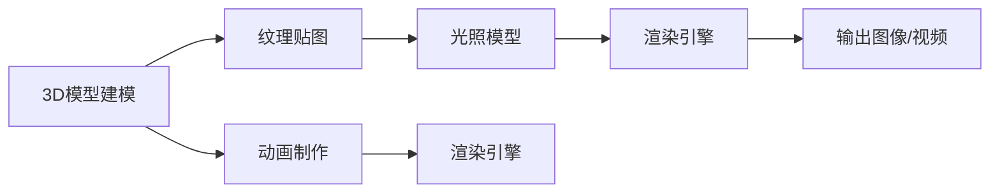

                 

## 1. 背景介绍

计算机图形学（Computer Graphics）是一门研究如何通过计算机生成、显示和操作视觉信息的科学。它涉及从数学和算法设计到硬件加速的多个领域。3D渲染和动画技术作为计算机图形学的核心内容，通过构建逼真的3D模型和动态变化场景，为电影、游戏、虚拟现实（VR）等领域提供了强大的视觉体验。

### 1.1 问题由来

随着数字技术的不断发展，3D渲染和动画技术已广泛应用于各个行业，从电影、游戏到医疗、教育等领域。它们不仅提升了用户体验，还为创意展示提供了新的可能性。然而，高质量的3D渲染和动画制作，往往需要庞大的计算资源和复杂的软件系统。这不仅增加了成本，也限制了部分小规模企业和独立开发者进入该领域。

### 1.2 问题核心关键点

本文将详细探讨3D渲染和动画技术的基本原理，并深入分析其核心算法和操作步骤。我们还将介绍常见的3D渲染和动画应用场景，并对比现有技术的优缺点。通过这些讨论，读者可以更全面地理解3D渲染和动画技术的发展趋势，为未来研究和技术应用提供参考。

### 1.3 问题研究意义

掌握3D渲染和动画技术的原理和应用，对于推动影视娱乐、虚拟现实、游戏开发等领域的发展具有重要意义。它不仅能够提升用户体验，还能降低内容制作成本，加速创意的实现。此外，3D渲染和动画技术的发展还对教育、医疗、建筑设计等学科有重要推动作用。

## 2. 核心概念与联系

### 2.1 核心概念概述

为了更好地理解3D渲染和动画技术，我们需要先了解以下几个核心概念：

- **3D模型建模**：通过软件工具对现实世界的物体进行数字化建模，生成用于渲染和动画的3D几何数据。
- **纹理贴图**：用于增强3D模型的视觉真实感，通常包含光影效果、材质属性等细节信息。
- **光照模型**：计算场景中光源与物体交互的光线效果，使得渲染图像更加逼真。
- **渲染引擎**：负责将3D模型和光照模型转化为最终的图像或视频输出。
- **动画制作**：通过关键帧动画、运动捕捉等方式，使3D模型在时间轴上发生变化，实现动态效果。

### 2.2 核心概念原理和架构的 Mermaid 流程图



这个流程图展示了3D渲染和动画技术的核心流程：首先对3D模型进行建模和贴图处理，然后利用光照模型计算光源与物体的交互效果，接着通过渲染引擎将3D模型和光照效果转化为图像或视频输出。动画制作则通过关键帧动画或运动捕捉等技术，在时间轴上实现动态变化。

## 3. 核心算法原理 & 具体操作步骤

### 3.1 算法原理概述

3D渲染和动画技术主要包括两个核心算法：光照计算和纹理映射。下面我们将详细探讨这两个算法的原理和实现步骤。

### 3.2 算法步骤详解

#### 3.2.1 光照计算

光照计算是3D渲染中最基础的算法之一，主要解决光源与物体之间的相互作用问题。通常采用以下步骤进行光照计算：

1. **光源建模**：定义光源的位置、颜色、大小和强度等属性。
2. **几何光路计算**：计算光源到物体的光线路径，包括反射、折射等效果。
3. **材质属性计算**：根据材质属性（如漫反射、镜面反射、透光率等）计算光线与物体的交互效果。
4. **最终渲染**：将所有计算结果进行合成，得到最终的渲染图像。

#### 3.2.2 纹理映射

纹理映射是将2D纹理图像应用到3D模型表面的技术。其基本步骤如下：

1. **纹理贴图准备**：准备包含光照和材质信息的2D纹理图像。
2. **纹理坐标映射**：将3D模型表面映射到纹理图像上，形成纹理坐标。
3. **纹理采样**：根据纹理坐标在纹理图像上采样，获取对应的颜色和光照信息。
4. **纹理合成**：将采样得到的纹理信息与几何计算结果进行合成，得到最终渲染图像。

### 3.3 算法优缺点

#### 3.3.1 光照计算

**优点**：
- 通过精确的光源与物体交互计算，可以生成逼真的光照效果。
- 支持复杂的材质属性，如反射、折射、漫反射等。

**缺点**：
- 计算复杂度高，需要耗费大量的计算资源。
- 光线追踪等算法复杂度更高，渲染速度较慢。

#### 3.3.2 纹理映射

**优点**：
- 通过简单的纹理映射，可以快速增强3D模型的视觉真实感。
- 支持动态变化的光照和材质效果，实现复杂的视觉细节。

**缺点**：
- 纹理映射效果依赖于高质量的贴图，需要大量的贴图制作工作。
- 复杂纹理的采样和合成处理，会增加渲染的计算负担。

### 3.4 算法应用领域

3D渲染和动画技术广泛应用于多个领域，主要包括：

- **电影和动画**：通过3D建模和动画制作，实现逼真的场景和角色效果。
- **游戏开发**：用于游戏角色的建模、动画和实时渲染。
- **虚拟现实**：提供逼真的视觉体验，支持虚拟环境中的交互和互动。
- **建筑设计**：用于展示建筑设计方案和室内外环境。
- **医疗**：用于医学图像的3D可视化，辅助手术规划和教学。

## 4. 数学模型和公式 & 详细讲解 & 举例说明

### 4.1 数学模型构建

3D渲染和动画技术涉及大量的数学模型和公式，下面我们将详细介绍其中几个核心模型：

- **向量模型**：用于表示3D空间中的点、线和面，通过向量运算进行几何变换。
- **矩阵模型**：用于表示3D变换，包括平移、旋转、缩放等。
- **光照模型**：包括Phong模型、Blinn-Phong模型、Cook-Torrance模型等，用于计算光源与物体之间的相互作用。

### 4.2 公式推导过程

#### 4.2.1 向量模型

向量模型包括向量加法、向量点乘和向量叉乘等基本运算。下面以向量点乘为例，推导其公式：

设向量 $\vec{a} = (a_x, a_y, a_z)$，向量 $\vec{b} = (b_x, b_y, b_z)$，则向量点乘公式为：

$$
\vec{a} \cdot \vec{b} = a_x b_x + a_y b_y + a_z b_z
$$

向量点乘常用于计算两个向量的夹角余弦值，或者用于计算向量与法线的方向一致性。

#### 4.2.2 矩阵模型

矩阵模型用于表示3D变换，包括平移、旋转和缩放等基本变换。下面以平移矩阵为例，推导其公式：

设向量 $\vec{t} = (t_x, t_y, t_z)$ 表示平移向量，则平移矩阵 $T$ 为：

$$
T = \begin{bmatrix}
1 & 0 & 0 & t_x \\
0 & 1 & 0 & t_y \\
0 & 0 & 1 & t_z \\
0 & 0 & 0 & 1
\end{bmatrix}
$$

平移矩阵将点的位置沿着向量 $\vec{t}$ 平移。

#### 4.2.3 光照模型

Phong模型是常见的光照计算模型之一，其公式如下：

$$
I(\vec{v}, \vec{n}, \vec{l}) = f_r I_r + f_d I_d
$$

其中，$\vec{v}$ 为观察方向，$\vec{n}$ 为法线方向，$\vec{l}$ 为入射光方向。$f_r$ 为镜面反射系数，$f_d$ 为漫反射系数，$I_r$ 为镜面反射光强度，$I_d$ 为漫反射光强度。Phong模型综合了镜面反射和漫反射的效果，能够更好地模拟光照。

### 4.3 案例分析与讲解

#### 4.3.1 案例分析

以电影《阿凡达》的渲染为例，分析其渲染过程中的关键技术和步骤。

1. **3D建模**：使用Maya等软件对电影中的角色和场景进行建模，生成高精度的3D模型。
2. **纹理贴图**：使用Photoshop等工具制作高质量的贴图，包含详细的光照和材质信息。
3. **光照计算**：使用Blinn-Phong模型计算光源与物体的交互效果，实现逼真的光照效果。
4. **渲染引擎**：使用Pixar的RenderMan渲染引擎，将3D模型和光照效果转化为最终图像。

通过这些技术，电影《阿凡达》实现了逼真的视觉效果，成为视觉特效电影的新标杆。

## 5. 项目实践：代码实例和详细解释说明

### 5.1 开发环境搭建

为了进行3D渲染和动画技术的开发，我们需要搭建一个完整的开发环境。具体步骤如下：

1. **安装图形库**：安装OpenGL和Vulkan等图形库，支持GPU加速渲染。
2. **安装渲染引擎**：安装如Blender、Maya等渲染引擎，提供丰富的3D建模和渲染功能。
3. **安装动画软件**：安装如Adobe After Effects、Cinema 4D等动画制作软件，支持复杂的动画效果。

### 5.2 源代码详细实现

以下是一个简单的3D模型渲染代码示例，使用了OpenGL库进行渲染。

```cpp
#include <GL/glut.h>
#include <GL/gl.h>

void display() {
    glClear(GL_COLOR_BUFFER_BIT);
    glBegin(GL_TRIANGLES);
        glColor3f(1.0, 0.0, 0.0);
        glVertex3f(-1.0, -1.0, 0.0);
        glVertex3f(1.0, -1.0, 0.0);
        glVertex3f(0.0, 1.0, 0.0);
    glEnd();
    glutSwapBuffers();
}

int main(int argc, char** argv) {
    glutInit(&argc, argv);
    glutInitDisplayMode(GLUT_DOUBLE | GLUT_RGB | GLUT_DEPTH);
    glutInitWindowSize(400, 400);
    glutCreateWindow("3D Rendering");
    glClearColor(0.0, 0.0, 0.0, 1.0);
    glEnable(GL_DEPTH_TEST);
    glutDisplayFunc(display);
    glutMainLoop();
    return 0;
}
```

这段代码实现了绘制一个简单的三角形，并开启OpenGL的深度测试，以支持3D效果。

### 5.3 代码解读与分析

这段代码包含以下关键步骤：

1. **初始化OpenGL环境**：通过glutInit、glutInitDisplayMode等函数设置窗口大小和渲染模式。
2. **绘制三角形**：使用glBegin和glEnd函数定义三角形，并设置颜色和顶点坐标。
3. **开启深度测试**：通过glEnable和glClearColor函数设置深度测试和背景颜色。
4. **渲染循环**：通过glutDisplayFunc和glutMainLoop函数启动渲染循环，不断更新屏幕显示。

### 5.4 运行结果展示

运行上述代码后，可以看到一个简单的3D三角形在屏幕上显示。


## 6. 实际应用场景

### 6.1 电影和动画制作

3D渲染和动画技术在电影和动画制作中得到了广泛应用。例如，电影《阿凡达》和动画剧集《冰雪奇缘》中的场景和角色，都是通过高质量的3D建模和渲染实现的。这些技术不仅提升了视觉体验，还为电影和动画制作提供了新的可能性。

### 6.2 游戏开发

3D渲染和动画技术在游戏开发中具有重要地位。例如，《使命召唤》、《守望先锋》等热门游戏，都是通过3D建模和动画技术实现的。高质量的游戏画面和动态效果，提升了用户体验，增加了游戏的可玩性和吸引力。

### 6.3 虚拟现实

虚拟现实（VR）技术需要逼真的视觉和听觉体验，3D渲染和动画技术能够实现高质量的虚拟环境，提供沉浸式的用户体验。例如，Oculus Rift、HTC Vive等VR设备，都通过3D渲染和动画技术，实现了逼真的虚拟环境。

### 6.4 未来应用展望

随着技术的不断进步，3D渲染和动画技术将进一步拓展应用领域，带来新的突破和创新。

1. **实时渲染**：通过优化渲染引擎和算法，实现实时渲染，支持高帧率和高分辨率。
2. **多平台适配**：支持多种平台和设备，如PC、移动设备、VR设备等。
3. **动态全局光照**：引入全局光照技术，实现更加逼真的光照效果。
4. **深度学习辅助**：结合深度学习技术，实现更智能的光照和材质生成。
5. **交互和体验优化**：通过增强现实（AR）、混合现实（MR）技术，提供更丰富和逼真的交互体验。

## 7. 工具和资源推荐

### 7.1 学习资源推荐

为了帮助读者全面掌握3D渲染和动画技术，我们推荐以下学习资源：

1. **《计算机图形学》教材**：清华大学出版社，张俊勇等著，系统介绍计算机图形学的基本原理和应用。
2. **Coursera课程**：由斯坦福大学、麻省理工学院等名校开设的计算机图形学课程，包括3D建模、渲染和动画等内容。
3. **Unity3D官方文档**：Unity游戏引擎的官方文档，提供丰富的3D建模和渲染教程。
4. **Blender官方文档**：Blender渲染引擎的官方文档，提供全面的3D建模和动画教程。

### 7.2 开发工具推荐

3D渲染和动画技术的开发需要多种工具的支持，以下是推荐的一些开发工具：

1. **OpenGL**：OpenGL是一个跨平台的图形渲染API，支持多种图形库和硬件加速。
2. **Vulkan**：Vulkan是AMD和Khronos集团联合开发的图形渲染API，支持硬件级优化和跨平台性能。
3. **Blender**：Blender是一款开源的3D建模和渲染软件，支持多种动画和渲染效果。
4. **Maya**：Maya是一款商业化的3D建模和动画软件，支持复杂的3D建模和渲染。

### 7.3 相关论文推荐

3D渲染和动画技术的研究涉及多个领域，以下是几篇经典论文推荐：

1. **《光线追踪：真实感图形的革命》**：1988年SIGGRAPH大会论文，由John B. Hughes等作者发表，奠定了光线追踪技术的理论基础。
2. **《physically based rendering: from theory to real world applications》**：1997年ACM Transactions on Graphics论文，由Bruce Walters和Edward R. Dougherty等作者发表，介绍物理基于渲染的理论和应用。
3. **《real-time rendering with deferred shading》**：2005年ACM Transactions on Graphics论文，由Tomas Akenine-Möller等作者发表，介绍实时渲染的渲染引擎和算法。

## 8. 总结：未来发展趋势与挑战

### 8.1 研究成果总结

3D渲染和动画技术在多个领域得到广泛应用，成为计算机图形学的核心内容之一。通过精确的光照计算和复杂的纹理映射，可以实现高质量的3D渲染效果。同时，3D建模和动画技术也为游戏、电影、VR等应用提供了新的可能性。

### 8.2 未来发展趋势

1. **实时渲染**：随着硬件和算法的发展，实时渲染技术将进一步优化，实现高帧率和高质量的3D渲染效果。
2. **深度学习**：结合深度学习技术，实现更加智能的光照和材质生成，提升渲染质量。
3. **交互体验**：通过增强现实和混合现实技术，提供更丰富和逼真的交互体验。
4. **跨平台支持**：支持多种平台和设备，如PC、移动设备、VR设备等。

### 8.3 面临的挑战

3D渲染和动画技术虽然取得了重要进展，但仍面临一些挑战：

1. **计算资源**：高质量的3D渲染需要大量的计算资源，难以满足低成本和小规模应用的需求。
2. **渲染速度**：复杂的渲染算法和高分辨率图像，导致渲染速度较慢，难以实现实时渲染。
3. **算法复杂度**：现有的渲染算法复杂度较高，需要更多的研究和优化。

### 8.4 研究展望

未来，3D渲染和动画技术需要在以下几个方面寻求突破：

1. **硬件加速**：开发更高效的硬件加速器，提升渲染速度和质量。
2. **算法优化**：优化渲染算法，减少计算复杂度，提高渲染效率。
3. **多模态融合**：结合视觉、听觉和触觉等多模态信息，提升用户体验。
4. **智能生成**：引入深度学习技术，实现更智能的渲染效果。

## 9. 附录：常见问题与解答

**Q1：什么是3D渲染和动画技术？**

A: 3D渲染和动画技术是计算机图形学中的重要分支，用于生成高质量的3D模型和动画效果。通过精确的光照计算和复杂的纹理映射，可以实现逼真的视觉体验。

**Q2：3D渲染和动画技术的主要应用场景是什么？**

A: 3D渲染和动画技术广泛应用于电影和动画制作、游戏开发、虚拟现实、建筑设计等领域。通过高质量的3D建模和渲染，可以提供逼真的视觉和交互体验。

**Q3：3D渲染和动画技术的核心算法有哪些？**

A: 3D渲染和动画技术的核心算法包括光照计算、纹理映射和几何变换等。其中，光照计算是渲染中最重要的部分，通过精确的光源与物体交互计算，可以生成逼真的光照效果。

**Q4：3D渲染和动画技术的未来发展趋势是什么？**

A: 未来3D渲染和动画技术的发展趋势包括实时渲染、深度学习辅助、跨平台支持和多模态融合等。通过硬件加速、算法优化和智能生成等手段，可以实现更高效、智能和多样化的3D渲染和动画效果。

**Q5：3D渲染和动画技术在实际应用中需要注意哪些问题？**

A: 在实际应用中，3D渲染和动画技术需要注意计算资源、渲染速度和算法复杂度等问题。需要优化算法，选择合适的渲染引擎，并结合硬件加速技术，提升渲染效率和质量。

**Q6：3D渲染和动画技术的优缺点有哪些？**

A: 3D渲染和动画技术的优点包括高质量的视觉效果、逼真的光照和材质效果、丰富的交互体验等。缺点包括计算资源消耗大、渲染速度慢、算法复杂度高等。

通过本文的详细讨论，读者可以全面了解3D渲染和动画技术的基本原理和实际应用，为未来研究和技术应用提供参考。希望本文能够为3D渲染和动画技术的深入研究和发展提供有益的指导。

---

作者：禅与计算机程序设计艺术 / Zen and the Art of Computer Programming

