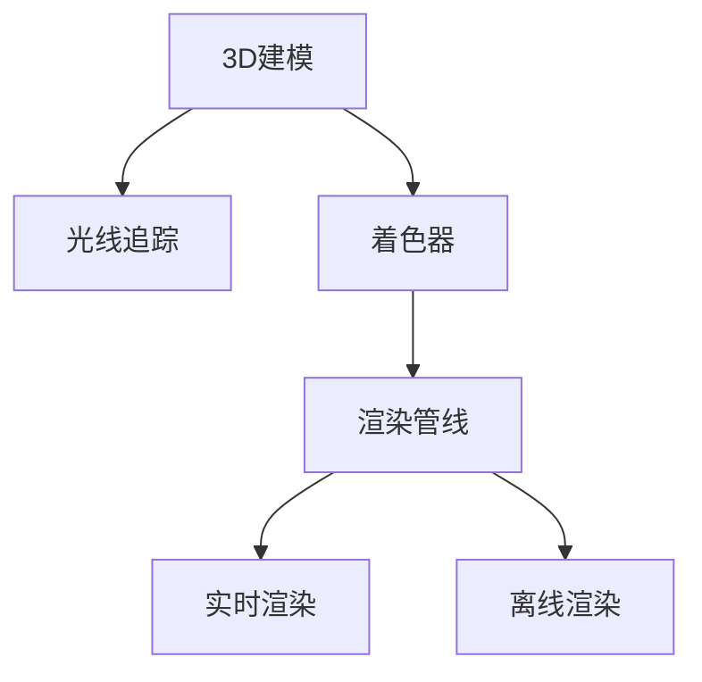

                 

# 计算机图形学：从3D建模到渲染技术

> 关键词：计算机图形学, 3D建模, 渲染技术, 渲染管线, 光线追踪, 着色器, 实时渲染, 离线渲染

## 1. 背景介绍

### 1.1 问题由来

计算机图形学（Computer Graphics, CG）是计算机科学的一个分支，专注于通过计算生成和展示视觉内容。它广泛应用于游戏、动画、电影制作、虚拟现实等领域，是现代数字媒体艺术和工业的核心技术之一。

随着技术的发展，计算机图形学的研究热点逐渐从传统的静态图像生成转向动态虚拟场景的构建和交互式体验的创建。3D建模和渲染技术作为计算机图形学的两个关键环节，为这种转变提供了强大的支撑。3D建模旨在将现实世界中的物体转换为计算机可处理的三维模型，而渲染技术则负责将这些模型转换为逼真的图像或视频。

### 1.2 问题核心关键点

3D建模和渲染技术的核心在于如何将几何、材质、光照等元素，通过算法和计算，转换成真实、逼真的视觉效果。其中，光线追踪和着色器技术是实现高质量渲染的两大支柱。

- **光线追踪**：通过模拟真实世界的光线传播路径，计算每个像素的光照信息，从而生成逼真光照效果。
- **着色器**：负责定义物体表面的材质和光照属性，控制光照的计算和输出。

这两项技术在现代图形渲染系统中得到广泛应用，是3D图形渲染的核心算法。

### 1.3 问题研究意义

研究3D建模和渲染技术，对于推动计算机图形学的发展、提升视觉内容的质量和效率、开拓新的视觉艺术和工业应用领域，具有重要意义：

1. 提升视觉效果：高质量的3D建模和渲染技术可以大大提升虚拟场景的真实感，增强用户体验。
2. 加速开发进程：预制的3D模型和渲染管线可以大幅减少开发时间和成本，提高项目交付速度。
3. 创造新应用：3D建模和渲染技术为虚拟现实、增强现实等新兴领域提供了强大的技术支撑。
4. 促进跨学科融合：计算机图形学与影视、游戏、建筑等学科的融合，为这些领域注入新的创意和技术力量。
5. 推动产业升级：高质量的3D内容对于广告、电影、教育等行业具有巨大的市场需求，能够带来显著的经济效益。

## 2. 核心概念与联系

### 2.1 核心概念概述

为更好地理解3D建模和渲染技术，本节将介绍几个密切相关的核心概念：

- **3D建模**：将现实世界中的物体转换为计算机可处理的三维模型，包括几何建模、纹理建模和物理建模。
- **光线追踪**：通过模拟真实世界的光线传播路径，计算每个像素的光照信息，从而生成逼真光照效果。
- **着色器**：定义物体表面的材质和光照属性，控制光照的计算和输出。
- **渲染管线**：描述从3D模型到最终图像的渲染过程，包括各个渲染阶段及其依赖关系。
- **实时渲染**：在交互式环境中，实时计算并展示3D场景的渲染过程，如游戏、虚拟现实等。
- **离线渲染**：在非实时环境中，通过计算生成高质量的3D图像或视频，如电影、动画制作等。

这些核心概念之间的逻辑关系可以通过以下Mermaid流程图来展示：



这个流程图展示了大规模语言模型的核心概念及其之间的关系：

1. 3D建模通过几何、纹理和物理建模生成3D模型。
2. 光线追踪计算每个像素的光照信息，实现逼真光照效果。
3. 着色器定义物体表面的材质和光照属性，控制光照的计算和输出。
4. 渲染管线描述从3D模型到最终图像的渲染过程，包括各个渲染阶段及其依赖关系。
5. 实时渲染和离线渲染分别适用于交互式和非交互式环境，实现不同类型的渲染效果。

## 3. 核心算法原理 & 具体操作步骤

### 3.1 算法原理概述

3D建模和渲染技术的核心算法包括几何建模、纹理映射、光照计算和渲染管线等。这里以光线追踪和着色器技术为例，概述其基本原理。

- **光线追踪**：光线追踪算法通过模拟真实世界的光线传播路径，计算每个像素的光照信息。其基本流程包括：
  1. 生成初始光线，并计算其与3D模型的交点。
  2. 根据交点处的材质信息计算光照。
  3. 根据光照信息，计算该像素的最终颜色。
  4. 重复以上步骤，直到光线终止或达到预设深度。

- **着色器**：着色器通过定义材质和光照属性，控制光照的计算和输出。其基本流程包括：
  1. 定义材质类型和参数，如漫反射、镜面反射等。
  2. 定义光照模型，如Phong模型、Blinn模型等。
  3. 根据光照模型和材质参数，计算光照强度。
  4. 根据光源和视点的位置，计算出每个像素的光照效果。

### 3.2 算法步骤详解

这里以OpenGL的渲染管线为例，详细介绍从3D模型到最终图像的渲染过程。

1. **顶点处理阶段**：
   - 顶点坐标转换：将模型顶点从模型空间转换到观察空间。
   - 光照计算：计算每个顶点的光照信息，包括法向量、光源位置等。
   - 顶点着色：根据着色器定义，计算每个顶点的颜色。

2. **几何处理阶段**：
   - 三角形剖分：将3D模型分割为多个三角形。
   - 顶点裁剪：根据视口和裁剪平面，裁剪不在屏幕内的顶点。
   - 光照传递：将光照信息传递到三角形。

3. **着色器处理阶段**：
   - 顶点着色器：将顶点坐标和光照信息传递到几何处理阶段。
   - 片元着色器：计算每个像素的颜色，并根据光源和材质参数进行光照计算。
   - 片段着色器：将片元着色器输出的颜色值和纹理值进行合成，输出最终像素颜色。

4. **输出阶段**：
   - 光栅化：将三角形映射为像素，并进行视差校正。
   - 深度测试：判断每个像素的深度，进行遮挡剔除。
   - 混合处理：将当前像素与已渲染像素进行混合处理。
   - 输出图像：将最终渲染结果输出到屏幕或纹理。

### 3.3 算法优缺点

光线追踪和着色器技术具有以下优点：

- **逼真光照**：光线追踪和着色器技术能够精确模拟光线传播路径，生成逼真光照效果。
- **复杂材质支持**：支持各种复杂材质，如金属、玻璃、布料等，增强渲染逼真度。
- **动态光照**：支持实时动态光照变化，适应复杂光源环境。

同时，这些技术也存在一些缺点：

- **计算复杂**：光线追踪和着色器技术计算量较大，渲染速度较慢。
- **硬件要求高**：需要高性能的GPU和CPU支持，对于低端硬件支持较差。
- **可扩展性差**：传统的渲染管线难以适应复杂的多样化需求。

### 3.4 算法应用领域

光线追踪和着色器技术在许多领域都有广泛应用，例如：

- **电影动画**：电影动画制作中，使用光线追踪和着色器技术生成高质量的渲染图像和动画。
- **游戏开发**：游戏引擎中广泛应用光线追踪和着色器技术，实现逼真的光照效果和动态光照。
- **虚拟现实**：VR系统中，光线追踪和着色器技术可以生成高度逼真的虚拟场景，增强用户体验。
- **建筑可视化**：建筑设计中，使用光线追踪和着色器技术生成逼真光照和阴影，辅助设计决策。
- **医学影像**：医学影像中，使用光线追踪和着色器技术生成三维模型的逼真渲染，帮助医生分析病情。

除了上述这些典型应用外，光线追踪和着色器技术还在教育和培训、文化娱乐、科学研究等众多领域得到广泛应用，为数字内容的制作和展示提供了强大的技术支撑。

## 4. 数学模型和公式 & 详细讲解 & 举例说明

### 4.1 数学模型构建

光线追踪和着色器技术涉及到大量的数学和物理计算，包括向量、矩阵、光线方程等。这里以Phong光照模型为例，展示其数学模型构建过程。

Phong光照模型用于计算复杂材质表面的光照效果，其基本公式如下：

$$
I(\mathbf{v}, \mathbf{l}, \mathbf{n}) = \rho(\mathbf{v}) k_a I_a(\mathbf{v}, \mathbf{l}, \mathbf{n}) + \rho(\mathbf{v}) k_d I_d(\mathbf{v}, \mathbf{l}, \mathbf{n}) + \rho(\mathbf{v}) k_s I_s(\mathbf{v}, \mathbf{l}, \mathbf{n})
$$

其中，$I(\mathbf{v}, \mathbf{l}, \mathbf{n})$ 表示法向量 $\mathbf{n}$ 下的入射光线 $\mathbf{l}$ 对观察方向 $\mathbf{v}$ 的光照强度。$\rho(\mathbf{v})$ 表示材质的反射率，$k_a$、$k_d$ 和 $k_s$ 分别表示环境光、漫反射光和镜面反射光的强度系数，$I_a(\mathbf{v}, \mathbf{l}, \mathbf{n})$、$I_d(\mathbf{v}, \mathbf{l}, \mathbf{n})$ 和 $I_s(\mathbf{v}, \mathbf{l}, \mathbf{n})$ 分别表示环境光、漫反射光和镜面反射光的光照强度。

### 4.2 公式推导过程

以下是Phong光照模型的详细推导过程：

1. **环境光**：
   $$
   I_a(\mathbf{v}, \mathbf{l}, \mathbf{n}) = \max(0, \mathbf{l} \cdot \mathbf{n}) I_a
   $$
   环境光表示物体表面受到的环境光照，其中 $I_a$ 表示环境光强度。

2. **漫反射光**：
   $$
   I_d(\mathbf{v}, \mathbf{l}, \mathbf{n}) = \max(0, \mathbf{l} \cdot \mathbf{n}) I_d \alpha (\mathbf{v} \cdot \mathbf{h})
   $$
   漫反射光表示物体表面受到的直接光源光照，其中 $I_d$ 表示光源强度，$\alpha$ 表示漫反射系数，$\mathbf{h}$ 表示反射向量，$\mathbf{h} = \mathbf{v} + \mathbf{l}$。

3. **镜面反射光**：
   $$
   I_s(\mathbf{v}, \mathbf{l}, \mathbf{n}) = \max(0, \mathbf{r} \cdot \mathbf{v}) I_s (\mathbf{r} \cdot \mathbf{h})^p
   $$
   镜面反射光表示物体表面受到的镜面反射光照，其中 $I_s$ 表示光源强度，$\mathbf{r}$ 表示反射向量，$\mathbf{r} = -\mathbf{l} + 2\frac{\mathbf{l} \cdot \mathbf{n}}{\mathbf{n} \cdot \mathbf{n}} \mathbf{n}$。

将上述公式代入Phong光照模型公式中，得：

$$
I(\mathbf{v}, \mathbf{l}, \mathbf{n}) = \rho(\mathbf{v}) (k_a I_a + k_d \max(0, \mathbf{l} \cdot \mathbf{n}) I_d \alpha (\mathbf{v} \cdot \mathbf{h}) + k_s \max(0, \mathbf{r} \cdot \mathbf{v}) (\mathbf{r} \cdot \mathbf{h})^p)
$$

其中，$\rho(\mathbf{v})$ 表示材质的反射率，$k_a$、$k_d$ 和 $k_s$ 分别表示环境光、漫反射光和镜面反射光的强度系数。

### 4.3 案例分析与讲解

以《阿凡达》电影中的3D渲染为例，展示Phong光照模型在实际渲染中的应用。

在电影中，每个角色和场景中的物体都由3D模型表示。渲染过程首先使用光线追踪算法，计算每个像素的光照信息。然后，根据Phong光照模型，计算每个像素的最终颜色。

具体步骤如下：

1. 使用光线追踪算法，模拟真实世界的光线传播路径，计算每个像素的光照信息。
2. 根据Phong光照模型，计算每个像素的环境光、漫反射光和镜面反射光。
3. 根据Phong光照模型公式，计算每个像素的最终颜色。

通过Phong光照模型的应用，《阿凡达》电影中的3D场景实现了逼真的光照效果，增强了观众的视觉体验。

## 5. 项目实践：代码实例和详细解释说明

### 5.1 开发环境搭建

在进行3D建模和渲染实践前，我们需要准备好开发环境。以下是使用OpenGL和GLSL进行3D渲染的环境配置流程：

1. 安装Anaconda：从官网下载并安装Anaconda，用于创建独立的Python环境。

2. 创建并激活虚拟环境：
```bash
conda create -n opengl-env python=3.8 
conda activate opengl-env
```

3. 安装OpenGL和GLSL工具包：
```bash
conda install opengl pyopengl
```

4. 安装相关的3D建模工具：
```bash
conda install ply gltf
```

5. 安装相关的渲染工具包：
```bash
pip install pygame
```

完成上述步骤后，即可在`opengl-env`环境中开始3D建模和渲染实践。

### 5.2 源代码详细实现

下面以OpenGL和GLSL为例，给出3D模型渲染的PyOpenGL代码实现。

```python
from OpenGL.GL import *
from OpenGL.GLUT import *
from OpenGL.GLU import *

def draw_triangle():
    glBegin(GL_TRIANGLES)
    glVertex3f(1.0, 1.0, 0.0)
    glVertex3f(-1.0, -1.0, 0.0)
    glVertex3f(0.0, 1.0, 0.0)
    glEnd()

def draw_scene():
    glClear(GL_COLOR_BUFFER_BIT | GL_DEPTH_BUFFER_BIT)
    glLoadIdentity()
    glTranslatef(0.0, 0.0, -5.0)
    glRotatef(angle, 0.0, 1.0, 0.0)
    draw_triangle()
    glutSwapBuffers()

def display():
    angle += 1.0
    if angle > 360.0:
        angle = 0.0
    glutPostRedisplay()

angle = 0.0

glutInit()
glutInitDisplayMode(GLUT_DOUBLE | GLUT_RGB | GLUT_DEPTH)
glutInitWindowSize(500, 500)
glutInitWindowPosition(100, 100)
glutCreateWindow(b"3D Rendering")
glEnable(GL_DEPTH_TEST)
glClearColor(0.0, 0.0, 0.0, 0.0)
glMatrixMode(GL_PROJECTION)
glLoadIdentity()
gluPerspective(45.0, 500.0 / 500.0, 0.1, 100.0)
glMatrixMode(GL_MODELVIEW)
glutDisplayFunc(display)
glutMainLoop()

```

在上述代码中，我们首先定义了一个三角形，然后使用OpenGL的渲染函数`glutMainLoop`，启动渲染循环。在每次渲染循环中，我们清空颜色和深度缓冲区，并设置模型视图矩阵，进行三角形绘制。通过`glutSwapBuffers`函数，将渲染结果输出到屏幕上。

### 5.3 代码解读与分析

让我们再详细解读一下关键代码的实现细节：

**draw_triangle函数**：
- 使用`glBegin(GL_TRIANGLES)`和`glEnd()`定义三角形的顶点坐标。

**draw_scene函数**：
- 在绘制场景前，先进行深度缓冲区清除。
- 设置模型视图矩阵，进行平移和旋转。
- 调用`draw_triangle`函数绘制三角形。

**display函数**：
- 每次渲染时，更新旋转角度。
- 如果旋转角度超过360度，重置为0度。
- 调用`glutPostRedisplay()`函数，刷新屏幕。

**OpenGL渲染循环**：
- 设置窗口大小和位置，创建窗口。
- 启用深度测试，设置背景色。
- 调用`glutMainLoop()`函数，启动渲染循环。
- 在渲染循环中，调用`display`函数，更新旋转角度。
- 调用`glutSwapBuffers()`函数，输出渲染结果。

可以看到，通过OpenGL和GLSL，我们能够实现简单的3D模型渲染。开发者可以根据实际需求，进一步扩展代码，添加光照、纹理等渲染效果。

## 6. 实际应用场景

### 6.1 电影动画

电影动画是3D建模和渲染技术的重要应用场景。在电影动画制作中，使用3D建模和渲染技术，可以生成逼真的3D场景和角色。

在《阿凡达》电影中，Pixar公司使用光线追踪和Phong光照模型，生成了逼真逼真的3D场景和角色。通过渲染过程，将3D模型转化为逼真的渲染图像和视频，实现了观众的视觉享受。

### 6.2 游戏开发

游戏开发是3D建模和渲染技术的另一个重要应用场景。在游戏引擎中，广泛应用3D建模和渲染技术，实现逼真的光照效果和动态光照。

例如，《堡垒之夜》是一款流行的射击类游戏，其游戏中的3D场景和角色均由3D建模和渲染技术实现。游戏引擎使用光线追踪和着色器技术，生成了高质量的3D场景和角色，增强了游戏的视觉效果和体验。

### 6.3 虚拟现实

虚拟现实（Virtual Reality, VR）是3D建模和渲染技术的最新应用场景。在VR系统中，使用3D建模和渲染技术，可以生成高度逼真的虚拟场景，增强用户的沉浸式体验。

例如，Oculus Rift是一款流行的虚拟现实设备，其虚拟场景均由3D建模和渲染技术实现。通过渲染过程，将3D模型转化为逼真的渲染图像和视频，实现了用户的沉浸式体验。

### 6.4 建筑可视化

建筑可视化是3D建模和渲染技术的重要应用场景。在建筑设计中，使用3D建模和渲染技术，可以生成逼真的建筑模型和场景。

例如，Autodesk Revit是一款流行的建筑设计软件，其3D建模和渲染功能，支持各种建筑模型和场景的生成。通过渲染过程，将3D模型转化为逼真的渲染图像和视频，辅助设计师进行设计决策。

## 7. 工具和资源推荐

### 7.1 学习资源推荐

为了帮助开发者系统掌握3D建模和渲染技术，这里推荐一些优质的学习资源：

1. 《OpenGL SuperBible》：这本书详细介绍了OpenGL的各个方面，是学习3D渲染技术的经典教材。
2. 《3D Graphics: A Practical Introduction》：这本书介绍了3D图形学的基础知识和高级技巧，适合初学者和进阶者。
3. 《Real-Time Rendering》：这本书介绍了实时渲染技术的基本原理和实现方法，适合游戏开发者和3D工程师。
4. 《Unity 3D Graphics Programming》：这本书介绍了Unity引擎中3D渲染的基本原理和实现方法，适合Unity开发者。
5. 《CGAL》：这是一个C++库，提供了各种3D几何算法和数据结构，适合算法和数据结构开发者。

通过对这些资源的学习实践，相信你一定能够快速掌握3D建模和渲染技术的精髓，并用于解决实际的3D渲染问题。

### 7.2 开发工具推荐

高效的开发离不开优秀的工具支持。以下是几款用于3D建模和渲染开发的常用工具：

1. Autodesk Maya：一款流行的3D建模软件，支持各种3D建模和动画制作。
2. Blender：一款免费的开源3D建模软件，支持各种3D建模和动画制作。
3. Cinema 4D：一款流行的3D建模和动画制作软件，支持各种3D建模和动画制作。
4. Unity：一款流行的游戏引擎，支持3D建模和实时渲染。
5. Unreal Engine：一款流行的游戏引擎，支持3D建模和实时渲染。

合理利用这些工具，可以显著提升3D建模和渲染任务的开发效率，加快创新迭代的步伐。

### 7.3 相关论文推荐

3D建模和渲染技术的发展源于学界的持续研究。以下是几篇奠基性的相关论文，推荐阅读：

1. "Real-Time Rendering in Games" by Tomas Akenine-Möller：介绍了实时渲染的基本原理和实现方法，是游戏渲染领域的经典教材。
2. "Ray Tracing: The State of the Art" by Tomas Akenine-Möller：介绍了光线追踪技术的最新进展，涵盖了从经典算法到现代加速技术的各个方面。
3. "The GPU Gems Series"：一系列关于GPU编程和渲染技术的经典论文集，涵盖了各种高级渲染技术。
4. "Real-Time Physically-Based Rendering" by Henrik Bruch：介绍了物理渲染的基本原理和实现方法，适合对真实感渲染有高需求的应用场景。
5. "Hierarchical Mipmap Representations for Texture Mapping" by Juan B. Alberola-Laurenti, Agustín Enriquez, and Gustavo T. Nguyen：介绍了纹理映射的基本原理和实现方法，适合纹理渲染和压缩的应用场景。

这些论文代表了大规模语言模型微调技术的发展脉络。通过学习这些前沿成果，可以帮助研究者把握学科前进方向，激发更多的创新灵感。

## 8. 总结：未来发展趋势与挑战

### 8.1 总结

本文对3D建模和渲染技术进行了全面系统的介绍。首先阐述了3D建模和渲染技术的研究背景和意义，明确了光线追踪和着色器技术在实现高质量渲染中的核心地位。其次，从原理到实践，详细讲解了3D建模和渲染技术的数学模型和算法实现，给出了3D建模和渲染的PyOpenGL代码实例。同时，本文还广泛探讨了3D建模和渲染技术在电影动画、游戏开发、虚拟现实、建筑可视化等多个领域的应用前景，展示了其强大的应用潜力。

通过本文的系统梳理，可以看到，3D建模和渲染技术正在成为计算机图形学的重要组成部分，为数字内容的制作和展示提供了强大的技术支撑。未来，伴随技术的发展和应用场景的拓展，3D建模和渲染技术必将进一步提升数字内容的视觉效果，推动视觉艺术和工业的全面升级。

### 8.2 未来发展趋势

展望未来，3D建模和渲染技术将呈现以下几个发展趋势：

1. **更高分辨率**：随着硬件性能的提升，未来渲染的分辨率将进一步提高，图像质量将更加逼真。
2. **更高效算法**：未来的渲染算法将更加高效，能够适应更加复杂和多样的渲染场景。
3. **实时渲染**：实时渲染技术将进一步成熟，支持更加多样和复杂的交互式场景。
4. **多分辨率渲染**：未来的渲染技术将支持多分辨率渲染，满足不同设备和显示器的需求。
5. **光照计算优化**：未来的渲染技术将更加注重光照计算的优化，提高渲染效率和逼真度。
6. **多模态渲染**：未来的渲染技术将支持多模态渲染，结合视觉、听觉、触觉等多种感官信息。

以上趋势凸显了3D建模和渲染技术的广阔前景。这些方向的探索发展，必将进一步提升3D内容的制作效率和质量，为数字内容的制作和展示提供更强大的技术支撑。

### 8.3 面临的挑战

尽管3D建模和渲染技术已经取得了显著成就，但在迈向更加智能化、普适化应用的过程中，它仍面临诸多挑战：

1. **渲染效率**：目前3D渲染的计算量较大，渲染时间较长，难以适应实时渲染的需求。
2. **硬件成本**：高性能渲染所需的硬件成本较高，限制了其在低端设备上的应用。
3. **可扩展性**：现有的渲染管线难以适应复杂和多样的渲染需求，需要进一步优化和扩展。
4. **自动化程度**：当前的3D建模和渲染技术仍需要大量手工操作，自动化程度较低。
5. **内容生成**：自动生成高质量3D内容的技术仍需进一步提升，以适应更多场景需求。

正视这些挑战，积极应对并寻求突破，将是3D建模和渲染技术向更高层次发展的必由之路。相信随着技术的不断进步，3D建模和渲染技术必将在视觉艺术和工业中发挥更大的作用。

### 8.4 研究展望

面对3D建模和渲染技术所面临的挑战，未来的研究需要在以下几个方面寻求新的突破：

1. **实时渲染技术**：开发更加高效的实时渲染算法，支持复杂和多样化的交互式场景。
2. **自动化内容生成**：开发自动生成高质量3D内容的技术，提高内容制作效率。
3. **多模态渲染**：结合视觉、听觉、触觉等多种感官信息，实现更丰富的交互体验。
4. **硬件加速**：开发更加高效和低成本的硬件加速方案，降低渲染成本。
5. **跨平台兼容性**：开发跨平台兼容的渲染解决方案，支持更多设备和显示器。
6. **场景理解**：开发更智能的场景理解技术，自动生成更逼真的渲染结果。

这些研究方向的探索，必将引领3D建模和渲染技术迈向更高的台阶，为数字内容的制作和展示提供更强大的技术支撑。面向未来，3D建模和渲染技术还需要与其他人工智能技术进行更深入的融合，如自然语言处理、智能交互等，共同推动计算机图形学的进步。只有勇于创新、敢于突破，才能不断拓展3D建模和渲染技术的边界，让智能技术更好地造福人类社会。

## 9. 附录：常见问题与解答

**Q1：3D建模和渲染技术的核心算法是什么？**

A: 3D建模和渲染技术的核心算法包括几何建模、纹理映射、光照计算和渲染管线等。其中，光线追踪和着色器技术是实现高质量渲染的核心算法。

**Q2：光线追踪和着色器技术的优缺点是什么？**

A: 光线追踪和着色器技术的优点包括：
- 逼真光照：能够精确模拟真实世界的光线传播路径，生成逼真光照效果。
- 复杂材质支持：支持各种复杂材质，增强渲染逼真度。
- 动态光照：支持实时动态光照变化，适应复杂光源环境。

缺点包括：
- 计算复杂：渲染速度较慢。
- 硬件要求高：需要高性能的GPU和CPU支持。
- 可扩展性差：传统的渲染管线难以适应复杂和多样的渲染需求。

**Q3：如何优化3D渲染的效率？**

A: 3D渲染的效率优化可以从以下几个方面入手：
- 使用更高效的算法：开发更加高效的渲染算法，如加速光线追踪和优化着色器计算。
- 硬件加速：使用GPU和加速器等硬件加速设备，提高渲染速度。
- 多分辨率渲染：支持多分辨率渲染，降低渲染复杂度。
- 纹理压缩：使用纹理压缩技术，减小渲染数据量。
- 渲染缓存：使用渲染缓存技术，减少重复渲染。

**Q4：3D建模和渲染技术在实际应用中需要注意哪些问题？**

A: 3D建模和渲染技术在实际应用中需要注意以下几个问题：
- 渲染效率：渲染时间较长，难以适应实时渲染的需求。
- 硬件成本：高性能渲染所需的硬件成本较高，限制了其在低端设备上的应用。
- 可扩展性：现有的渲染管线难以适应复杂和多样的渲染需求，需要进一步优化和扩展。
- 自动化程度：当前的3D建模和渲染技术仍需要大量手工操作，自动化程度较低。
- 内容生成：自动生成高质量3D内容的技术仍需进一步提升，以适应更多场景需求。

通过这些问题，可以看到，3D建模和渲染技术需要进一步优化和扩展，才能满足实际应用的需求。

---

作者：禅与计算机程序设计艺术 / Zen and the Art of Computer Programming

