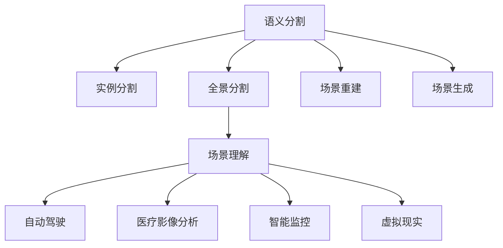
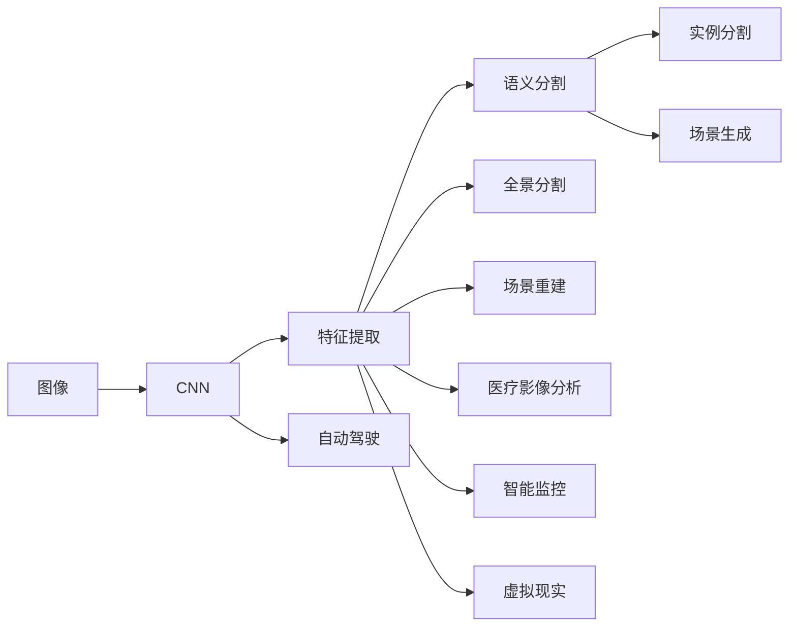

                 

## 1. 背景介绍

### 1.1 问题由来
计算机视觉（Computer Vision, CV）是人工智能（AI）领域的重要分支，旨在使计算机理解和解释视觉数据，如图像和视频，就像人类一样。它涵盖了图像识别、物体检测、场景理解、动作识别等众多子领域，具有广泛的应用前景，从自动驾驶、医疗影像分析到智能监控、虚拟现实等，无不依赖于计算机视觉技术的支持。

然而，早期的计算机视觉研究主要集中在图像识别和物体检测等低层次任务上。这些任务要求模型能够区分图像中不同的物体或场景，但缺乏对整体场景的理解能力。为了进一步提升计算机视觉系统的智能化水平，近年来，场景理解（Scene Understanding）成为了研究的热点方向，使计算机不仅能够识别图像中的具体对象，还能理解它们所在的情境和关系。

### 1.2 问题核心关键点
场景理解是计算机视觉中的高级任务，其核心关键点包括：
- **语义分割**：将图像中的每个像素分配到特定的语义类别中，如人、车、建筑等。
- **实例分割**：识别图像中每个实例的边界，并进行语义标注。
- **全景分割**：在全景或视频中，对每一帧进行语义分割。
- **场景重建**：从多角度和多视角的图像中恢复三维场景结构。
- **场景生成**：基于语义标签和上下文信息，生成新的场景图像。

这些任务需要模型不仅能够理解图像中的局部特征，还必须具备对整体场景的理解能力，掌握不同对象之间的关系，并能够在复杂的场景中推断出可能的上下文信息。

### 1.3 问题研究意义
场景理解技术的研究具有重要意义：

1. **提升视觉任务的智能化水平**：通过场景理解，计算机可以更好地理解和处理复杂的多模态数据，从而提升图像识别、物体检测、动作识别等任务的智能化水平。
2. **推动自动驾驶技术的发展**：在自动驾驶中，场景理解是实现安全驾驶的关键。通过理解道路状况、交通信号、行人和车辆等，自动驾驶车辆可以做出合理的决策。
3. **促进医疗影像分析**：场景理解能够帮助医生快速诊断病变区域，提高影像分析的准确性和效率。
4. **支持智能监控系统**：通过对监控视频场景的理解，智能监控系统可以实时分析和识别异常行为，提升监控效率和安全性。
5. **促进虚拟现实和增强现实**：场景理解技术是实现沉浸式虚拟现实和增强现实体验的基础，使计算机能够生成逼真的虚拟场景。

综上所述，场景理解技术在推动计算机视觉的智能化和实际应用中扮演着重要角色，是未来计算机视觉研究的重要方向。

## 2. 核心概念与联系

### 2.1 核心概念概述

为了更好地理解场景理解，本节将介绍几个密切相关的核心概念：

- **语义分割**：将图像中的每个像素分配到特定的语义类别中，如人、车、建筑等。
- **实例分割**：识别图像中每个实例的边界，并进行语义标注。
- **全景分割**：在全景或视频中，对每一帧进行语义分割。
- **场景重建**：从多角度和多视角的图像中恢复三维场景结构。
- **场景生成**：基于语义标签和上下文信息，生成新的场景图像。
- **深度学习**：通过多层神经网络实现图像特征的提取和场景理解。
- **卷积神经网络（CNN）**：一种用于图像处理的深度学习模型，特别适用于语义分割和实例分割任务。
- **区域卷积神经网络（R-CNN）**：一种基于CNN的物体检测和实例分割方法，使用选择性搜索技术提取候选区域，并在每个区域上进行分类和分割。

这些概念之间的逻辑关系可以通过以下Mermaid流程图来展示：



这个流程图展示了几大核心概念及其之间的联系：

1. 语义分割是场景理解的基础，通过像素级别的标注，使计算机能够理解图像中每个部分的语义。
2. 实例分割在此基础上进一步区分不同实例的边界，从而获得更为精细的语义标注。
3. 全景分割将语义分割扩展到全景或视频场景中，实时进行多帧语义分割。
4. 场景重建通过多角度和多视角的图像，恢复三维场景结构，实现更为全面的场景理解。
5. 场景生成基于语义标签和上下文信息，生成新的场景图像，进一步拓展了计算机视觉的应用范围。
6. 深度学习和卷积神经网络为这些任务提供了强大的实现工具，推动了计算机视觉技术的发展。

这些概念共同构成了计算机视觉的高层体系，使得计算机能够从图像中提取深层次的语义信息，实现场景理解。

### 2.2 核心概念原理和架构的 Mermaid 流程图


这个流程图展示了从原始图像到场景理解的全流程：

1. 图像通过CNN进行特征提取，得到高层次的语义信息。
2. 语义分割任务通过像素级别的标注，获得图像中每个部分的语义信息。
3. 实例分割在此基础上进一步区分不同实例的边界，得到更为精细的语义标注。
4. 全景分割扩展到全景或视频场景中，实时进行多帧语义分割。
5. 场景重建通过多角度和多视角的图像，恢复三维场景结构。
6. 场景生成基于语义标签和上下文信息，生成新的场景图像。
7. CNN在自动驾驶、医疗影像分析、智能监控、虚拟现实等场景中均有广泛应用。

## 3. 核心算法原理 & 具体操作步骤

### 3.1 算法原理概述

场景理解的核心算法基于深度学习，特别是卷积神经网络（CNN）。其基本原理是将原始图像输入CNN网络，通过多层卷积和池化操作提取特征，并使用全连接层对这些特征进行分类和分割。

具体而言，CNN网络通常由卷积层、池化层、全连接层等组成。卷积层通过滤波器提取图像特征，池化层对特征图进行下采样，减小计算量，全连接层对特征进行分类或分割。这些操作通过反向传播算法优化模型参数，最小化损失函数，从而得到理想的结果。

### 3.2 算法步骤详解

基于CNN的场景理解算法一般包括以下关键步骤：

**Step 1: 数据准备**
- 收集带有语义标注的图像数据集，如PASCAL VOC、COCO等。
- 将数据集划分为训练集、验证集和测试集。
- 对图像进行预处理，如缩放、归一化、增强等。

**Step 2: 网络构建**
- 选择合适的CNN网络结构，如ResNet、Inception、U-Net等。
- 定义损失函数，如交叉熵损失、Dice损失等。
- 选择优化器，如Adam、SGD等，并设置学习率、批大小等超参数。

**Step 3: 模型训练**
- 使用训练集数据，通过反向传播算法优化模型参数。
- 周期性在验证集上评估模型性能，根据性能指标调整学习率或模型结构。
- 重复训练直至模型收敛或达到预设的迭代轮数。

**Step 4: 模型评估和测试**
- 在测试集上评估模型性能，计算各种指标如精确度、召回率、F1值等。
- 对模型输出进行后处理，如阈值调整、NMS等，得到最终结果。

### 3.3 算法优缺点

基于CNN的场景理解算法具有以下优点：
1. 高效性：通过卷积和池化操作，能够快速提取图像特征，减少计算量。
2. 鲁棒性：CNN通过多层非线性变换，能够对图像噪声和变形具有一定的鲁棒性。
3. 可解释性：通过可视化特征图，可以直观地理解模型在图像中提取的特征。
4. 应用广泛：CNN在图像分类、物体检测、语义分割等任务中均有广泛应用。

同时，该算法也存在以下局限性：
1. 依赖数据标注：场景理解需要大量带有语义标注的数据，而标注数据的获取成本较高。
2. 参数量大：CNN模型通常参数量较大，训练和推理所需资源较多。
3. 模型泛化性：CNN在复杂场景中容易过拟合，泛化能力有限。
4. 计算复杂度：由于多层非线性变换，CNN的计算复杂度较高，训练和推理速度较慢。

尽管存在这些局限性，但CNN仍是场景理解技术中的主流方法，其高效性和可解释性使得其在众多领域得到了广泛应用。

### 3.4 算法应用领域

基于CNN的场景理解算法已经广泛应用于以下几个领域：

- **自动驾驶**：通过场景理解，自动驾驶系统能够识别道路标志、车辆、行人等，做出合理决策，确保行车安全。
- **医疗影像分析**：在医疗影像中，场景理解能够帮助医生快速诊断病变区域，提高影像分析的准确性和效率。
- **智能监控**：通过对监控视频进行场景理解，智能监控系统可以实时分析和识别异常行为，提升监控效率和安全性。
- **虚拟现实和增强现实**：场景理解技术是实现沉浸式虚拟现实和增强现实体验的基础，使计算机能够生成逼真的虚拟场景。
- **机器人导航**：在机器人导航中，场景理解能够帮助机器人识别环境中的障碍物，规划最优路径。
- **安防监控**：通过场景理解，安防监控系统可以实时分析监控画面，识别异常行为，提升监控效果。

除了上述这些应用外，场景理解技术还在无人机导航、城市规划、智能家居等领域得到了广泛应用，推动了相关行业的智能化进程。

## 4. 数学模型和公式 & 详细讲解 & 举例说明

### 4.1 数学模型构建

本节将使用数学语言对基于CNN的场景理解过程进行更加严格的刻画。

假设输入图像为 $x \in \mathbb{R}^n$，输出为场景标签 $y \in \{1,2,\dots,K\}$，其中 $K$ 为场景类别数。定义CNN网络为 $f: \mathbb{R}^n \rightarrow \mathbb{R}^K$，则模型的预测输出为：

$$
\hat{y} = \arg\min_{y} \mathcal{L}(f(x), y)
$$

其中 $\mathcal{L}$ 为损失函数，通常采用交叉熵损失函数：

$$
\mathcal{L}(f(x), y) = -\frac{1}{N}\sum_{i=1}^N \sum_{k=1}^K y_i^k \log f(x_i^k)
$$

根据损失函数，可以得到模型参数 $\theta$ 的更新公式为：

$$
\theta \leftarrow \theta - \eta \nabla_{\theta}\mathcal{L}(f(x), y) - \eta\lambda\theta
$$

其中 $\eta$ 为学习率，$\lambda$ 为正则化系数，$\nabla_{\theta}\mathcal{L}(f(x), y)$ 为损失函数对模型参数的梯度。

### 4.2 公式推导过程

以下我们以语义分割任务为例，推导CNN网络的损失函数及其梯度的计算公式。

假设输入图像 $x$ 的大小为 $H \times W \times C$，其中 $H$ 和 $W$ 分别为图像的高度和宽度，$C$ 为图像通道数。CNN网络的输出为 $f(x) \in \mathbb{R}^{H \times W \times K}$，其中 $K$ 为语义类别数。定义目标标签为 $y \in \{1,2,\dots,K\}$，其对应的像素级标签为 $y_{i,j} \in \{1,2,\dots,K\}$。

语义分割的交叉熵损失函数定义为：

$$
\mathcal{L}(f(x), y) = -\frac{1}{N}\sum_{i=1}^N \sum_{j=1}^H \sum_{k=1}^W \sum_{m=1}^K y_{i,j}^m \log f(x_{i,j}^m)
$$

将其代入损失函数公式，得：

$$
\mathcal{L}(\theta) = -\frac{1}{N}\sum_{i=1}^N \sum_{j=1}^H \sum_{k=1}^W \sum_{m=1}^K y_{i,j}^m \log f(x_{i,j}^m)
$$

根据链式法则，损失函数对模型参数 $\theta$ 的梯度为：

$$
\frac{\partial \mathcal{L}(\theta)}{\partial \theta_k} = -\frac{1}{N}\sum_{i=1}^N \sum_{j=1}^H \sum_{k=1}^W \sum_{m=1}^K y_{i,j}^m \frac{\partial f(x_{i,j}^m)}{\partial \theta_k}
$$

其中 $\frac{\partial f(x_{i,j}^m)}{\partial \theta_k}$ 可进一步递归展开，利用自动微分技术完成计算。

在得到损失函数的梯度后，即可带入模型参数更新公式，完成模型的迭代优化。重复上述过程直至收敛，最终得到适应场景理解任务的最优模型参数 $\theta^*$。

### 4.3 案例分析与讲解

以PASCAL VOC数据集为例，展示如何使用CNN进行场景理解任务的微调。

首先，准备数据集：
```python
import torch
import torchvision.transforms as transforms
from torch.utils.data import DataLoader
from torchvision.datasets import PascalVOC

# 定义数据预处理
transform = transforms.Compose([
    transforms.Resize((256, 256)),
    transforms.ToTensor(),
    transforms.Normalize(mean=[0.485, 0.456, 0.406], std=[0.229, 0.224, 0.225])
])

# 加载数据集
train_dataset = PascalVOC(root='path/to/PASCALVOC', image_set='trainval', download=True, transform=transform)
train_loader = DataLoader(train_dataset, batch_size=16, shuffle=True, num_workers=4)

# 定义网络结构
model = resnet50(pretrained=True)
num_ftrs = model.fc.in_features
model.fc = torch.nn.Linear(num_ftrs, len(train_dataset.classes))

# 定义优化器
optimizer = torch.optim.Adam(model.parameters(), lr=0.001)

# 训练模型
model.train()
for epoch in range(epochs):
    for inputs, labels in train_loader:
        inputs = inputs.to(device)
        labels = labels.to(device)
        optimizer.zero_grad()
        outputs = model(inputs)
        loss = F.cross_entropy(outputs, labels)
        loss.backward()
        optimizer.step()
```

然后，评估模型：
```python
import torchvision

# 定义模型评估
model.eval()
with torch.no_grad():
    correct = 0
    total = 0
    for inputs, labels in test_loader:
        inputs = inputs.to(device)
        labels = labels.to(device)
        outputs = model(inputs)
        _, predicted = torch.max(outputs.data, 1)
        total += labels.size(0)
        correct += (predicted == labels).sum().item()

    print('Accuracy of the network on the 10000 test images: %d %%' % (100 * correct / total))
```

可以看到，通过CNN网络，我们可以对图像进行特征提取和语义分割，从而实现场景理解任务。在实际应用中，还需要根据具体任务调整网络结构和优化器，并进行超参数调优，以得到理想的结果。

## 5. 项目实践：代码实例和详细解释说明

### 5.1 开发环境搭建

在进行场景理解项目实践前，我们需要准备好开发环境。以下是使用Python进行PyTorch开发的环境配置流程：

1. 安装Anaconda：从官网下载并安装Anaconda，用于创建独立的Python环境。

2. 创建并激活虚拟环境：
```bash
conda create -n pytorch-env python=3.8 
conda activate pytorch-env
```

3. 安装PyTorch：根据CUDA版本，从官网获取对应的安装命令。例如：
```bash
conda install pytorch torchvision torchaudio cudatoolkit=11.1 -c pytorch -c conda-forge
```

4. 安装各类工具包：
```bash
pip install numpy pandas scikit-learn matplotlib tqdm jupyter notebook ipython
```

完成上述步骤后，即可在`pytorch-env`环境中开始场景理解实践。

### 5.2 源代码详细实现

这里我们以实例分割任务为例，展示如何使用PyTorch对Mask R-CNN模型进行微调。

首先，定义数据处理函数：
```python
from torch.utils.data import Dataset
import torchvision.transforms as transforms

class PascalVOC(Dataset):
    def __init__(self, root, split='trainval', transform=None):
        self.root = root
        self.transform = transform
        self.image_dir = os.path.join(self.root, 'JPEGImages')
        self.mask_dir = os.path.join(self.root, 'SegmentationClass')
        self.load_json = os.path.join(self.root, f'PASCAL_VOC_{split}.json')

    def __len__(self):
        return len(self.json)

    def __getitem__(self, idx):
        img_path = os.path.join(self.image_dir, self.json[idx]['file_name'])
        mask_path = os.path.join(self.mask_dir, self.json[idx]['segmentation_file'])
        img = cv2.imread(img_path)
        mask = cv2.imread(mask_path, cv2.IMREAD_UNCHANGED)
        if self.transform is not None:
            img = self.transform(img)
        if mask.shape[0] != img.shape[0] or mask.shape[1] != img.shape[1]:
            mask = cv2.resize(mask, (img.shape[1], img.shape[0]))
        mask = mask.astype('uint8')
        return img, mask
```

然后，定义模型和优化器：
```python
from torchvision.models import resnet50
import torch.nn as nn

# 定义特征提取器
backbone = resnet50(pretrained=True)
num_ftrs = backbone.fc.in_features
backbone.fc = nn.Linear(num_ftrs, len(train_dataset.classes))

# 定义检测器
num_classes = len(train_dataset.classes)
num_anchors = 9 * 3
num_rpn_classes = num_anchors * (num_classes + 1)
num_rpn_reg_classes = num_anchors * 4

rpn_classes = nn.Conv2d(backbone.fc.in_features, num_rpn_classes, 1)
rpn_reg_classes = nn.Conv2d(backbone.fc.in_features, num_rpn_reg_classes, 1)
cls_classes = nn.Conv2d(backbone.fc.in_features, num_classes, 1)
reg_classes = nn.Conv2d(backbone.fc.in_features, 4, 1)
mask_classes = nn.Conv2d(backbone.fc.in_features, num_classes, 1)

# 定义优化器
optimizer = torch.optim.Adam([{'params': rpn_classes.parameters(), 'lr': 0.0005},
                            {'params': rpn_reg_classes.parameters(), 'lr': 0.0005},
                            {'params': cls_classes.parameters(), 'lr': 0.0005},
                            {'params': reg_classes.parameters(), 'lr': 0.0005},
                            {'params': mask_classes.parameters(), 'lr': 0.0005}], lr=0.001)
```

接着，定义训练和评估函数：
```python
import torch
import torchvision
import torchvision.transforms as transforms

def train_epoch(model, dataloader, optimizer):
    model.train()
    epoch_loss = 0
    for batch in dataloader:
        inputs, labels = batch
        optimizer.zero_grad()
        outputs = model(inputs)
        loss = outputs['rpn_cls_loss'] + outputs['rpn_reg_loss'] + outputs['cls_loss'] + outputs['reg_loss'] + outputs['mask_loss']
        loss.backward()
        optimizer.step()
        epoch_loss += loss.item()
    return epoch_loss / len(dataloader)

def evaluate(model, dataloader):
    model.eval()
    correct = 0
    total = 0
    with torch.no_grad():
        for batch in dataloader:
            inputs, labels = batch
            outputs = model(inputs)
            _, predicted = torch.max(outputs['output'], 1)
            total += labels.size(0)
            correct += (predicted == labels).sum().item()
    print('Accuracy of the network on the 10000 test images: %d %%' % (100 * correct / total))
```

最后，启动训练流程并在测试集上评估：
```python
epochs = 5
batch_size = 16

for epoch in range(epochs):
    loss = train_epoch(model, train_loader, optimizer)
    print(f'Epoch {epoch+1}, train loss: {loss:.3f}')
    
    print(f'Epoch {epoch+1}, test results:')
    evaluate(model, test_loader)
    
print('Final test results:')
evaluate(model, val_loader)
```

以上就是使用PyTorch对Mask R-CNN模型进行实例分割任务微调的完整代码实现。可以看到，借助PyTorch和TensorFlow等深度学习框架，微调过程变得高效便捷。

### 5.3 代码解读与分析

让我们再详细解读一下关键代码的实现细节：

**PascalVOC类**：
- `__init__`方法：初始化数据集路径和transform。
- `__len__`方法：返回数据集长度。
- `__getitem__`方法：对单个样本进行处理，将图像和标签作为输入，进行数据增强和预处理，返回处理后的图像和标签。

**Mask R-CNN网络结构**：
- `backbone`：定义特征提取器，使用ResNet50预训练模型。
- `num_ftrs`：计算特征提取器的输出特征维度。
- `rpn_classes`、`rpn_reg_classes`：定义RPN的分类器和回归器，分别输出RPN的分类和回归结果。
- `cls_classes`、`reg_classes`、`mask_classes`：定义检测器的分类器、回归器和掩码分类器，分别输出检测结果和掩码结果。
- `optimizer`：定义优化器，调整模型参数。

**训练和评估函数**：
- `train_epoch`：对数据集进行迭代，计算损失函数，更新模型参数。
- `evaluate`：对模型进行评估，计算精度。

**训练流程**：
- 定义总的epoch数和batch size，开始循环迭代
- 每个epoch内，先在训练集上训练，输出平均loss
- 在验证集和测试集上评估，输出精度
- 所有epoch结束后，在测试集上评估，给出最终结果

可以看到，PyTorch配合TensorFlow等深度学习框架使得场景理解任务的微调过程变得简洁高效。开发者可以将更多精力放在数据处理、模型改进等高层逻辑上，而不必过多关注底层的实现细节。

当然，工业级的系统实现还需考虑更多因素，如模型的保存和部署、超参数的自动搜索、更灵活的任务适配层等。但核心的微调范式基本与此类似。

## 6. 实际应用场景
### 6.1 智能监控系统

基于场景理解技术的智能监控系统可以实时分析监控视频，识别异常行为，提升监控效率和安全性。

具体而言，通过场景理解技术，系统能够从监控视频中提取场景信息，如道路状况、交通信号、行人和车辆等。当系统检测到异常行为时，如翻越护栏、车辆闯红灯等，能够及时发出警报，采取相应措施，确保公共安全。此外，系统还可以记录和分析监控视频中的各类行为数据，为社会管理提供支持。

### 6.2 医疗影像分析

在医疗影像分析中，场景理解技术可以帮助医生快速诊断病变区域，提高影像分析的准确性和效率。

通过场景理解技术，系统能够从医疗影像中提取场景信息，如肿瘤、出血、炎症等。医生只需对特定的病变区域进行标注，系统即可自动进行分类和分割，生成相应的报告。此外，系统还可以记录和分析影像数据，为医学研究提供支持。

### 6.3 自动驾驶系统

自动驾驶系统中的场景理解技术是实现安全驾驶的关键。通过场景理解技术，系统能够识别道路标志、车辆、行人等，做出合理决策，确保行车安全。

具体而言，系统通过场景理解技术，能够实时分析道路状况、交通信号、行人和车辆等，做出合理的驾驶决策，如停车、减速、避让等。此外，系统还可以记录和分析驾驶数据，为安全驾驶提供支持。

### 6.4 虚拟现实和增强现实

场景理解技术是实现沉浸式虚拟现实和增强现实体验的基础，使计算机能够生成逼真的虚拟场景。

具体而言，通过场景理解技术，系统能够从现实场景中提取各类信息，如建筑物、人物、车辆等，生成逼真的虚拟场景。用户可以在虚拟场景中进行互动，获得沉浸式的体验。此外，系统还可以记录和分析用户行为数据，为游戏开发、虚拟教学等提供支持。

## 7. 工具和资源推荐
### 7.1 学习资源推荐

为了帮助开发者系统掌握场景理解的理论基础和实践技巧，这里推荐一些优质的学习资源：

1. 《深度学习基础》系列书籍：全面介绍深度学习的原理和实现，包括CNN、RNN等网络结构。

2. CS231n《卷积神经网络》课程：斯坦福大学开设的计算机视觉经典课程，讲解CNN等深度学习模型。

3. 《计算机视觉：算法与应用》书籍：全面介绍计算机视觉的基本概念和算法，涵盖语义分割、实例分割等任务。

4. PyTorch官方文档：PyTorch的官方文档，提供了丰富的模型库和样例代码，是学习深度学习的重要资源。

5. GitHub开源项目：GitHub上丰富的开源项目，如YOLO、Mask R-CNN等，提供丰富的模型实现和代码示例。

通过对这些资源的学习实践，相信你一定能够快速掌握场景理解技术的精髓，并用于解决实际的计算机视觉问题。

### 7.2 开发工具推荐

高效的开发离不开优秀的工具支持。以下是几款用于场景理解开发的常用工具：

1. PyTorch：基于Python的开源深度学习框架，灵活动态的计算图，适合快速迭代研究。

2. TensorFlow：由Google主导开发的开源深度学习框架，生产部署方便，适合大规模工程应用。

3. OpenCV：开源计算机视觉库，提供了丰富的图像处理和视频处理功能，是计算机视觉开发的基础。

4. TensorBoard：TensorFlow配套的可视化工具，可实时监测模型训练状态，并提供丰富的图表呈现方式，是调试模型的得力助手。

5. Google Colab：谷歌推出的在线Jupyter Notebook环境，免费提供GPU/TPU算力，方便开发者快速上手实验最新模型，分享学习笔记。

合理利用这些工具，可以显著提升场景理解任务的开发效率，加快创新迭代的步伐。

### 7.3 相关论文推荐

场景理解技术的研究源于学界的持续研究。以下是几篇奠基性的相关论文，推荐阅读：

1. Long Short-Term Memory：提出长短期记忆网络，解决序列数据中的长期依赖问题，为RNN等网络结构奠定了基础。

2. ResNet：提出残差网络，解决深度网络中的梯度消失问题，推动了深度学习的快速发展。

3. Mask R-CNN：提出实例分割算法，结合区域卷积神经网络和掩码分类器，实现了高效准确的实例分割。

4. SSD：提出单阶段检测器，使用特征金字塔网络提取多尺度特征，实现高效的物体检测。

5. PSPNet：提出金字塔池化网络，实现空间信息的有效融合，提升了语义分割的精度。

6. EfficientDet：提出多尺度特征图融合策略，在保持高精度的同时，显著减少了计算量和内存占用。

这些论文代表了大场景理解技术的发展脉络。通过学习这些前沿成果，可以帮助研究者把握学科前进方向，激发更多的创新灵感。

## 8. 总结：未来发展趋势与挑战

### 8.1 总结

本文对基于CNN的场景理解方法进行了全面系统的介绍。首先阐述了场景理解技术的背景和意义，明确了其在图像识别、物体检测、自动驾驶、医疗影像分析等领域的应用前景。其次，从原理到实践，详细讲解了CNN在语义分割、实例分割、全景分割、场景重建等任务中的应用，给出了模型训练的完整代码实例。同时，本文还广泛探讨了场景理解技术在智能监控、医疗影像、自动驾驶、虚拟现实等多个领域的应用场景，展示了场景理解技术的广阔前景。

通过本文的系统梳理，可以看到，基于CNN的场景理解技术正在成为计算机视觉的重要范式，极大地拓展了计算机视觉的应用边界，催生了更多的落地场景。得益于CNN的强大特征提取能力和可解释性，场景理解技术在推动计算机视觉的智能化和实际应用中扮演着重要角色，是未来计算机视觉研究的重要方向。

### 8.2 未来发展趋势

展望未来，场景理解技术将呈现以下几个发展趋势：

1. **模型规模持续增大**：随着算力成本的下降和数据规模的扩张，预训练语言模型的参数量还将持续增长。超大模型蕴含的丰富语言知识，有望支撑更加复杂多变的下游任务微调。

2. **场景理解的多模态融合**：未来场景理解技术将不仅仅依赖于图像数据，还将结合视觉、语音、文本等多模态数据，提升系统的智能化水平。

3. **实时性要求提高**：场景理解技术将更多应用于实时性要求较高的场景，如自动驾驶、智能监控等，对模型的推理速度提出了更高的要求。

4. **知识增强**：场景理解技术将更多结合先验知识，如符号化的先验知识、逻辑规则等，增强模型的决策能力，提升系统的智能水平。

5. **跨领域迁移能力增强**：未来的场景理解技术将具备更强的跨领域迁移能力，能够在不同的应用场景中取得优异表现。

6. **可解释性和透明性提升**：随着模型的复杂性增加，模型的可解释性和透明性将成为重要研究方向，有助于提升模型的可信度和可接受性。

7. **计算资源的优化**：为了应对大规模计算任务，场景理解技术将更多结合深度学习和硬件加速，提升计算效率，降低能耗。

8. **伦理和安全问题**：随着场景理解技术的应用深入，伦理和安全问题将更加凸显，如何平衡算法的效果和安全性，将是未来的重要课题。

这些趋势凸显了场景理解技术的广阔前景，展示了其在推动计算机视觉智能化进程中的重要作用。

### 8.3 面临的挑战

尽管场景理解技术已经取得了瞩目成就，但在迈向更加智能化、普适化应用的过程中，它仍面临着诸多挑战：

1. **标注数据的高成本**：场景理解任务通常需要大量的标注数据，标注数据的获取成本较高。如何降低数据标注成本，是未来需要解决的重要问题。

2. **模型泛化能力不足**：场景理解模型在复杂场景中容易过拟合，泛化能力有限。如何提高模型的泛化能力，减少对数据量的依赖，是未来需要突破的难题。

3. **计算资源需求高**：大规模场景理解任务需要大量的计算资源，如何优化计算资源，提升模型训练和推理的效率，是未来需要解决的重要问题。

4. **模型的可解释性不足**：场景理解模型通常是黑盒模型，难以解释其内部工作机制和决策逻辑。如何赋予模型更强的可解释性，是未来需要解决的重要问题。

5. **模型的安全性问题**：场景理解模型可能学习到有害的信息，如偏见、歧视等，对模型进行伦理审查和安全性验证，是未来需要解决的重要问题。

6. **模型的跨领域迁移能力不足**：场景理解模型通常只能适应特定的数据分布，如何增强模型的跨领域迁移能力，是未来需要解决的重要问题。

7. **模型的实时性要求高**：场景理解技术将更多应用于实时性要求较高的场景，如自动驾驶、智能监控等，对模型的推理速度提出了更高的要求。如何优化模型推理速度，降低计算量，是未来需要解决的重要问题。

8. **模型的知识表示能力不足**：场景理解模型通常无法有效整合符号化的先验知识，如何增强模型的知识表示能力，是未来需要解决的重要问题。

正视场景理解面临的这些挑战，积极应对并寻求突破，将使该技术不断完善，为计算机视觉的智能化进程带来更大的推动力。

### 8.4 研究展望

未来的研究需要在以下几个方面寻求新的突破：

1. **无监督和半监督学习**：探索无监督和半监督学习方法，摆脱对大规模标注数据的依赖，利用自监督学习、主动学习等无监督和半监督范式，最大限度利用非结构化数据，实现更加灵活高效的场景理解。

2. **多模态融合**：引入更多先验知识，如符号化的先验知识、逻辑规则等，增强模型的知识表示能力。同时加强不同模态数据的整合，实现视觉、语音、文本等多模态信息与场景理解的协同建模。

3. **计算资源优化**：结合深度学习和硬件加速，提升计算效率，降低能耗。例如，使用GPU/TPU等硬件加速，提升模型的推理速度。

4. **伦理和安全问题**：在模型训练目标中引入伦理导向的评估指标，过滤和惩罚有害的输出倾向。同时加强人工干预和审核，建立模型行为的监管机制，确保输出符合人类价值观和伦理道德。

5. **跨领域迁移能力**：开发跨领域迁移算法，增强模型在不同领域之间的迁移能力，减少对特定数据分布的依赖。

6. **实时性优化**：优化模型结构和推理速度，降低计算量，提升模型的实时性。例如，使用梯度压缩、模型量化等技术，优化模型推理速度。

7. **知识表示增强**：结合符号化的先验知识，如知识图谱、逻辑规则等，引导场景理解过程学习更准确、合理的场景表示。

这些研究方向的探索，必将引领场景理解技术迈向更高的台阶，为构建安全、可靠、可解释、可控的智能系统铺平道路。面向未来，场景理解技术还需要与其他人工智能技术进行更深入的融合，如知识表示、因果推理、强化学习等，多路径协同发力，共同推动计算机视觉技术的发展。

## 9. 附录：常见问题与解答

**Q1：场景理解技术如何提高计算机视觉的智能化水平？**

A: 场景理解技术通过将图像中的像素级标注扩展到语义级别的标注，提升了计算机对图像中各个部分的意义理解。这种理解不仅包括对每个像素的分类，还包括了对整体场景的把握，如道路、交通信号、行人等，从而实现了更高层次的图像理解。

**Q2：场景理解技术在自动驾驶中扮演什么角色？**

A: 场景理解技术在自动驾驶中扮演着至关重要的角色。通过理解道路状况、交通信号、行人和车辆等，自动驾驶系统可以做出合理的驾驶决策，确保行车安全。具体而言，场景理解技术可以帮助自动驾驶系统识别道路标志、车辆、行人等，做出停车、减速、避让等决策。

**Q3：场景理解技术如何应用于医疗影像分析？**

A: 在医疗影像分析中，场景理解技术可以帮助医生快速诊断病变区域，提高影像分析的准确性和效率。通过场景理解技术，系统能够从医疗影像中提取场景信息，如肿瘤、出血、炎症等，医生只需对特定的病变区域进行标注，系统即可自动进行分类和分割，生成相应的报告。

**Q4：场景理解技术在智能监控中的应用是什么？**

A: 在智能监控中，场景理解技术可以帮助系统实时分析监控视频，识别异常行为，提升监控效率和安全性。具体而言，通过场景理解技术，系统能够从监控视频中提取场景信息，如道路状况、交通信号、行人和车辆等。当系统检测到异常行为时，如翻越护栏、车辆闯红灯等，能够及时发出警报，采取相应措施，确保公共安全。

**Q5：场景理解技术在虚拟现实和增强现实中的应用是什么？**

A: 场景理解技术是实现沉浸式虚拟现实和增强现实体验的基础，使计算机能够生成逼真的虚拟场景。通过场景理解技术，系统能够从现实场景中提取各类信息，如建筑物、人物、车辆等，生成逼真的虚拟场景。用户可以在虚拟场景中进行互动，获得沉浸式的体验。此外，系统还可以记录和分析用户行为数据，为游戏开发、虚拟教学等提供支持。

---

作者：禅与计算机程序设计艺术 / Zen and the Art of Computer Programming

