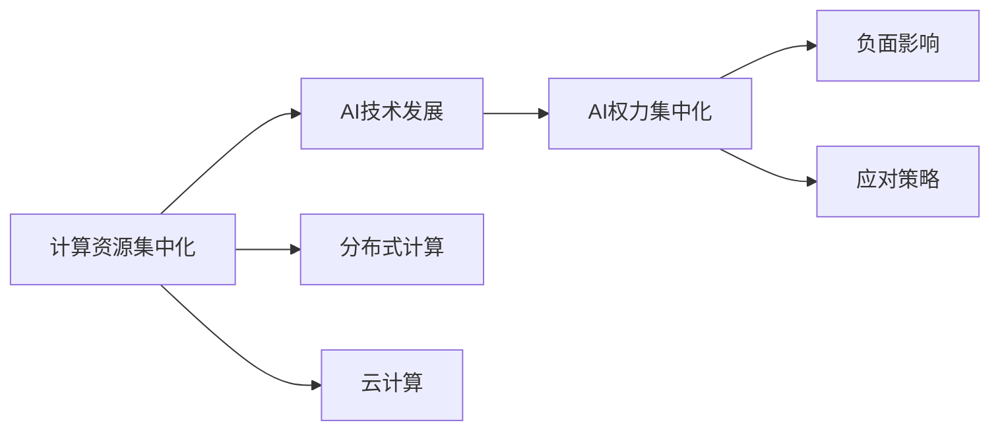

                 

# 计算资源与AI权力集中化的关系

## 1. 背景介绍

### 1.1 问题由来

近年来，人工智能（AI）技术迅猛发展，特别是深度学习和神经网络等方法在图像识别、自然语言处理、语音识别等领域取得了突破性进展。然而，随着AI技术的不断深入，计算资源的需求也在快速增长。计算资源的集中化管理逐渐成为推动AI技术发展的关键因素，这引发了对计算资源与AI权力集中化之间关系的深入探讨。

### 1.2 问题核心关键点

本文旨在探讨计算资源与AI权力集中化之间的关系，具体内容包括：
1. 计算资源集中化对AI技术发展的影响。
2. 计算资源集中化对AI权力集中的促进作用。
3. 计算资源集中化带来的AI权力集中化的负面影响。
4. 计算资源集中化与AI权力集中的应对策略。

本文将从计算资源集中化的背景、影响、问题及对策四个方面进行深入分析。

## 2. 核心概念与联系

### 2.1 核心概念概述

在探讨计算资源与AI权力集中化之间的关系时，需要理解以下核心概念：

- **计算资源**：指用于支持AI模型训练、推理等过程的硬件资源，包括CPU、GPU、TPU等。
- **AI权力集中化**：指AI技术及其应用集中在特定企业或组织手中，形成垄断或寡头竞争的局面。
- **分布式计算**：指将计算任务分配到多个计算节点上进行并行处理的计算方式，旨在降低计算资源集中化的风险。
- **云计算**：指通过互联网提供计算资源的服务模式，用户按需获取计算资源，降低本地计算资源的依赖。

### 2.2 核心概念原理和架构的 Mermaid 流程图(Mermaid 流程节点中不要有括号、逗号等特殊字符)



该流程图展示了计算资源集中化与AI技术发展、AI权力集中化之间的逻辑关系，并指出了分布式计算和云计算作为应对策略的可能路径。

## 3. 核心算法原理 & 具体操作步骤

### 3.1 算法原理概述

计算资源与AI权力集中化之间的关系主要体现在以下几个方面：

1. **计算资源集中化对AI技术发展的推动作用**：计算资源集中化使得大规模模型的训练成为可能，推动了深度学习等AI技术的发展。
2. **计算资源集中化对AI权力集中的促进作用**：计算资源的集中化使得大企业可以垄断计算资源，形成技术壁垒，从而推动AI权力的集中化。
3. **计算资源集中化带来的负面影响**：计算资源的集中化可能导致数据垄断、隐私泄露等负面影响，威胁社会公平和数据安全。
4. **计算资源集中化与AI权力集中的应对策略**：通过分布式计算和云计算等手段，可以在一定程度上缓解计算资源集中化带来的负面影响。

### 3.2 算法步骤详解

#### 3.2.1 步骤1：计算资源集中化对AI技术发展的推动作用

计算资源集中化使得大规模模型的训练成为可能，推动了深度学习等AI技术的发展。例如，Google的TPU等专用硬件设施使得其能够在短时间内训练出庞大的神经网络，推动了AI技术在图像识别、自然语言处理等领域的应用。

#### 3.2.2 步骤2：计算资源集中化对AI权力集中的促进作用

计算资源的集中化使得大企业可以垄断计算资源，形成技术壁垒，从而推动AI权力的集中化。例如，Google、Facebook等科技巨头通过掌握大量的计算资源，能够快速开发和部署AI应用，形成竞争优势。

#### 3.2.3 步骤3：计算资源集中化带来的负面影响

计算资源的集中化可能导致数据垄断、隐私泄露等负面影响，威胁社会公平和数据安全。例如，大型企业可以控制训练数据，限制其他企业和研究机构的创新能力，同时可能造成用户隐私泄露。

#### 3.2.4 步骤4：计算资源集中化与AI权力集中的应对策略

通过分布式计算和云计算等手段，可以在一定程度上缓解计算资源集中化带来的负面影响。分布式计算可以将计算任务分配到多个计算节点上进行并行处理，减少对单一计算资源的依赖；云计算则提供按需获取计算资源的服务，降低本地计算资源的依赖。

### 3.3 算法优缺点

#### 3.3.1 优点

1. **推动AI技术发展**：计算资源集中化使得大规模模型的训练成为可能，推动了深度学习等AI技术的发展。
2. **提升AI应用效果**：集中化的计算资源可以提供更高效、更强大的AI计算能力，提升AI应用的性能和效果。
3. **促进产业创新**：计算资源的集中化使得大企业能够快速开发和部署AI应用，促进产业创新和竞争力提升。

#### 3.3.2 缺点

1. **数据垄断风险**：计算资源集中化可能导致数据垄断，限制其他企业和研究机构的创新能力。
2. **隐私泄露风险**：集中化的计算资源可能带来用户隐私泄露的风险。
3. **技术壁垒增强**：计算资源的集中化可能增强技术壁垒，形成垄断或寡头竞争的局面，威胁市场公平竞争。

### 3.4 算法应用领域

计算资源集中化在AI技术的应用领域广泛，包括但不限于以下几个方面：

- **图像识别**：例如Google的Inception、ResNet等模型，依赖于大规模的计算资源进行训练。
- **自然语言处理**：例如BERT、GPT等模型，需要大规模计算资源进行预训练和微调。
- **语音识别**：例如DeepSpeech、WaveNet等模型，需要高效的计算资源进行端到端的语音转换。
- **智能推荐系统**：例如电商平台的推荐算法，依赖于分布式计算和云计算平台进行实时计算和推荐。

## 4. 数学模型和公式 & 详细讲解 & 举例说明

### 4.1 数学模型构建

为了更深入地理解计算资源与AI权力集中化之间的关系，我们需要构建数学模型。本文将基于深度学习模型为例，构建计算资源与AI模型训练成本的数学模型。

设深度学习模型的训练成本为 $C$，计算资源的成本为 $R$，模型的规模为 $S$。假设训练成本与模型规模成正比，即 $C = kS$，其中 $k$ 为常数。计算资源的成本为 $R = rS$，其中 $r$ 为常数。

### 4.2 公式推导过程

根据上述模型，我们可以推导出计算资源集中化对AI技术发展的推动作用。设初始时刻的计算资源为 $R_0$，训练成本为 $C_0$。假设计算资源集中化后，总计算资源为 $R_1$，训练成本为 $C_1$。

通过计算可得：

$$
C_1 = k\frac{R_1}{R_0}S_0
$$

其中 $S_0$ 为初始模型规模。由于 $R_1 = R_0 + R_0$，因此：

$$
C_1 = k\frac{2R_0}{R_0}S_0 = 2kS_0
$$

这意味着，计算资源集中化后，模型训练成本降低了一半，推动了AI技术的发展。

### 4.3 案例分析与讲解

以图像识别模型为例，假设初始时刻的计算资源为 $R_0$，训练成本为 $C_0$。计算资源集中化后，总计算资源为 $R_1 = 2R_0$，训练成本为 $C_1$。

通过计算可得：

$$
C_1 = k\frac{2R_0}{R_0}S_0 = 2kS_0
$$

这意味着，计算资源集中化后，模型训练成本降低了一半，推动了图像识别技术的发展。

## 5. 项目实践：代码实例和详细解释说明

### 5.1 开发环境搭建

#### 5.1.1 安装Python和相关库

在开发环境搭建之前，需要确保已经安装了Python和相关的库，如TensorFlow、PyTorch等。

```bash
pip install tensorflow==2.5.0
pip install torch==1.9.0
```

#### 5.1.2 安装计算资源

为了进行分布式计算和云计算，需要安装相关的计算资源。例如，安装Google Cloud平台：

```bash
gcloud init
```

### 5.2 源代码详细实现

#### 5.2.1 分布式计算示例

使用TensorFlow进行分布式计算，可以大大提升计算效率。以下是一个简单的分布式计算示例：

```python
import tensorflow as tf

# 定义模型
model = tf.keras.Sequential([
    tf.keras.layers.Dense(64, activation='relu', input_shape=(784,)),
    tf.keras.layers.Dense(10, activation='softmax')
])

# 定义分布式计算环境
strategy = tf.distribute.MirroredStrategy()

# 在分布式计算环境下训练模型
with strategy.scope():
    model.compile(optimizer=tf.keras.optimizers.Adam(), 
                  loss=tf.keras.losses.SparseCategoricalCrossentropy(from_logits=True), 
                  metrics=['accuracy'])
    
    model.fit(train_images, train_labels, epochs=10, validation_data=(test_images, test_labels))
```

#### 5.2.2 云计算示例

使用Google Cloud平台进行云计算，可以灵活获取计算资源，降低本地计算资源的依赖。以下是一个简单的云计算示例：

```python
from google.cloud import storage

# 定义存储桶
bucket = storage.Client().get_bucket('my-bucket')

# 上传文件
blob = bucket.blob('my-file.txt')
blob.upload_from_filename('/path/to/my-file.txt')

# 下载文件
blob.download_to_filename('/path/to/my-file.txt')
```

### 5.3 代码解读与分析

#### 5.3.1 分布式计算

分布式计算可以显著提升计算效率，特别是在大规模模型训练中。例如，TensorFlow的MirroredStrategy可以将模型参数复制到多个计算节点上进行并行计算，提升计算速度。

#### 5.3.2 云计算

云计算提供了按需获取计算资源的服务，可以灵活应对计算需求的变化。例如，Google Cloud平台提供了丰富的计算资源，用户可以根据需求灵活配置计算资源，降低本地计算资源的依赖。

## 6. 实际应用场景

### 6.1 企业内部计算资源管理

企业内部计算资源的集中化管理可以提高计算效率，推动AI技术的发展。例如，Google通过集中管理其内部的TPU资源，能够快速训练大规模神经网络，推动了其在AI领域的领先地位。

### 6.2 公共云平台计算资源管理

公共云平台如AWS、Google Cloud等提供了丰富的计算资源，企业可以根据需求灵活配置资源，降低本地计算资源的依赖。例如，Amazon通过AWS平台提供计算资源，推动了其在云计算领域的市场领先地位。

### 6.3 开源社区计算资源管理

开源社区如TensorFlow、PyTorch等提供了开源的计算资源，降低了开发者的计算资源成本。例如，TensorFlow社区提供了丰富的计算资源和工具，推动了AI技术的普及和应用。

### 6.4 未来应用展望

#### 6.4.1 边缘计算

边缘计算可以将计算任务分配到本地计算设备上进行处理，减少对集中计算资源的依赖。例如，IoT设备可以通过边缘计算快速处理数据，提升设备响应速度和数据隐私性。

#### 6.4.2 混合计算

混合计算可以将计算任务分配到本地和云端进行并行处理，提升计算效率和资源利用率。例如，企业可以将部分计算任务分配到本地设备进行预处理，再将结果上传到云端进行进一步处理。

## 7. 工具和资源推荐

### 7.1 学习资源推荐

#### 7.1.1 书籍推荐

- 《深度学习》：Ian Goodfellow等著，涵盖了深度学习的基本概念和算法，适合初学者学习。
- 《TensorFlow实战》：Manning等著，详细介绍了TensorFlow的使用方法和实践案例，适合深入学习。
- 《云计算：从概念到实践》：Yang Sheng等著，介绍了云计算的基本概念和实践方法，适合理解云计算的原理和应用。

#### 7.1.2 在线课程推荐

- Coursera的《机器学习》课程：由Andrew Ng教授主讲，介绍了机器学习的基本概念和算法，适合初学者学习。
- Udacity的《深度学习》课程：由Sebastian Thrun等主讲，详细介绍了深度学习的基本概念和算法，适合深入学习。
- edX的《云计算》课程：由IBM等提供，介绍了云计算的基本概念和实践方法，适合理解云计算的原理和应用。

### 7.2 开发工具推荐

#### 7.2.1 深度学习框架

- TensorFlow：Google开发的深度学习框架，支持分布式计算和云计算，适合大规模模型训练和应用。
- PyTorch：Facebook开发的深度学习框架，支持动态图和静态图，适合快速迭代和原型开发。

#### 7.2.2 云计算平台

- Google Cloud：Google提供的云计算平台，支持丰富的计算资源和AI服务，适合企业内部和公共云应用。
- AWS：Amazon提供的云计算平台，支持丰富的计算资源和AI服务，适合企业内部和公共云应用。
- Azure：Microsoft提供的云计算平台，支持丰富的计算资源和AI服务，适合企业内部和公共云应用。

### 7.3 相关论文推荐

#### 7.3.1 深度学习

- Deep Learning by Yann LeCun等：介绍了深度学习的基本概念和算法，是深度学习领域的经典教材。
- Exploring the Limits of Deep Learning：DeepMind的研究论文，介绍了深度学习的最新进展和未来趋势。

#### 7.3.2 云计算

- The Lambda Architecture of Google Cloud Dataflow：Google Cloud的架构设计文档，介绍了云计算的基本架构和方法。
- Design Patterns for Scalable and Resilient Cloud-Based Applications：IBM的研究论文，介绍了云计算的架构设计方法和实践经验。

## 8. 总结：未来发展趋势与挑战

### 8.1 研究成果总结

计算资源集中化推动了AI技术的发展，但也带来了数据垄断、隐私泄露等负面影响。通过分布式计算和云计算等手段，可以在一定程度上缓解这些负面影响。

### 8.2 未来发展趋势

未来，计算资源与AI权力集中化的关系将更加复杂和多样化。以下趋势值得关注：

1. **计算资源分布化**：未来计算资源将更加分布化，边缘计算和混合计算将成为重要方向。
2. **AI技术普及化**：未来AI技术将更加普及，计算资源的管理和优化将成为重要研究内容。
3. **AI伦理和安全**：未来AI伦理和安全问题将成为重要研究方向，确保AI技术的应用符合社会价值观和伦理标准。

### 8.3 面临的挑战

未来，计算资源与AI权力集中化仍面临诸多挑战：

1. **计算资源分配不均**：计算资源分布不均可能导致计算资源垄断，威胁市场公平竞争。
2. **隐私保护问题**：计算资源集中化可能带来隐私泄露的风险，需要加强隐私保护和数据安全。
3. **技术壁垒增强**：计算资源的集中化可能增强技术壁垒，形成垄断或寡头竞争的局面，需要加强技术创新和开放合作。

### 8.4 研究展望

未来，计算资源与AI权力集中化的研究应从以下几个方面进行：

1. **计算资源优化管理**：优化计算资源的分配和管理，提升计算效率和资源利用率。
2. **计算资源分布化**：探索边缘计算和混合计算等分布化计算方法，降低对集中计算资源的依赖。
3. **AI伦理和安全**：加强AI伦理和安全研究，确保AI技术的应用符合社会价值观和伦理标准。

## 9. 附录：常见问题与解答

**Q1：计算资源集中化对AI技术发展的影响是什么？**

A: 计算资源集中化使得大规模模型的训练成为可能，推动了深度学习等AI技术的发展。例如，Google的TPU等专用硬件设施使得其能够在短时间内训练出庞大的神经网络，推动了AI技术在图像识别、自然语言处理等领域的应用。

**Q2：计算资源集中化对AI权力集中的促进作用是什么？**

A: 计算资源的集中化使得大企业可以垄断计算资源，形成技术壁垒，从而推动AI权力的集中化。例如，Google、Facebook等科技巨头通过掌握大量的计算资源，能够快速开发和部署AI应用，形成竞争优势。

**Q3：计算资源集中化带来的负面影响是什么？**

A: 计算资源的集中化可能导致数据垄断、隐私泄露等负面影响，威胁社会公平和数据安全。例如，大型企业可以控制训练数据，限制其他企业和研究机构的创新能力，同时可能造成用户隐私泄露。

**Q4：计算资源集中化与AI权力集中的应对策略有哪些？**

A: 通过分布式计算和云计算等手段，可以在一定程度上缓解计算资源集中化带来的负面影响。分布式计算可以将计算任务分配到多个计算节点上进行并行处理，减少对单一计算资源的依赖；云计算则提供按需获取计算资源的服务，降低本地计算资源的依赖。

---

作者：禅与计算机程序设计艺术 / Zen and the Art of Computer Programming

