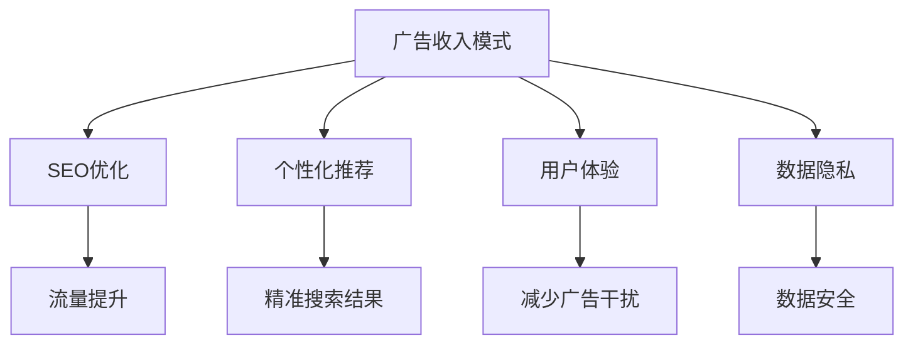

                 

# 订阅制vs广告：AI搜索引擎的商业模式之争

> 关键词：AI搜索引擎,商业模式,广告收入,订阅服务,搜索引擎优化,个性化推荐,用户体验,数据隐私,成本效益分析

## 1. 背景介绍

### 1.1 问题由来

随着人工智能技术的飞速发展，搜索引擎已经在用户获取信息的方式上取得了革命性的进步。传统搜索引擎如Google、Bing、百度等，依托先进的机器学习算法和庞大的数据资源，已经能够提供更加精准、高效的搜索结果。然而，搜索引擎的商业模式在AI时代受到了前所未有的挑战：是坚持广告收入模式，还是转向订阅服务模式？

Google、百度等传统搜索引擎主要通过展示搜索结果顶部的广告来获利，其商业模式已经经过了数十年的市场验证。然而，随着用户对广告的厌倦和隐私保护的关注，广告收入模式开始受到质疑。而Google AI、Bing、微软、亚马逊等新锐AI搜索引擎，则积极探索订阅模式，以提供更加个性化和高效的服务，吸引用户付费使用。

### 1.2 问题核心关键点

在商业模式的对比中，核心问题包括：
- 广告收入模式是否会因广告屏蔽工具和隐私保护政策而逐渐失效？
- 订阅模式是否具备足够的市场规模和用户粘性，足以支撑其长期发展？
- 搜索引擎的个性化推荐和用户体验，是否能够弥补高昂的订阅费用？
- 商业模式的演变将如何影响搜索引擎的市场竞争格局？

## 2. 核心概念与联系

### 2.1 核心概念概述

要深入探讨订阅制与广告之间的商业博弈，首先需要理解以下几个核心概念：

- **广告收入模式（Ad-based Model）**：搜索引擎通过展示广告获取收益，用户的点击率和停留时间决定了广告收入。传统的商业模型高度依赖广告，用户流量是收入增长的关键因素。

- **订阅制模式（Subscription-based Model）**：用户支付一定费用，获得定制化的服务和广告屏蔽功能，如Google Assistant、Apple Music等。用户对广告屏蔽、个性化推荐的需求是推动订阅模式发展的动力。

- **搜索引擎优化（Search Engine Optimization, SEO）**：通过优化网站的结构、内容和关键词，提高其在搜索引擎中的排名，增加流量和点击率，从而提升广告收入。

- **个性化推荐（Personalized Recommendation）**：根据用户的历史行为和兴趣，提供更加精准的搜索结果和相关内容，提升用户体验。

- **用户体验（User Experience, UX）**：通过优化搜索引擎界面、提供定制化服务、减少广告干扰等方式，提升用户的搜索满意度。

- **数据隐私（Data Privacy）**：用户对于个人信息的保护越来越重视，搜索引擎需要平衡个性化推荐与数据隐私之间的关系。

这些概念之间的逻辑关系可以通过以下Mermaid流程图来展示：



### 2.2 核心概念原理和架构的 Mermaid 流程图

由于篇幅限制，这里无法直接展示整个流程图的代码，但我们可以简要解释其主要节点：

- **广告收入模式**：核心节点是广告展示和点击率，直接关联到流量提升（B）。
- **SEO优化**：通过优化网站结构和内容，提高搜索引擎对网站的评估，进而提升排名和点击率。
- **个性化推荐**：基于用户历史行为和兴趣，生成精准搜索结果（G），增强用户体验（D）。
- **用户体验**：通过减少广告干扰（H）和增强隐私保护（I），提升用户满意度，促进重复使用。
- **数据隐私**：平衡个性化推荐与数据安全，保护用户隐私。

## 3. 核心算法原理 & 具体操作步骤

### 3.1 算法原理概述

AI搜索引擎的商业模式之争，核心在于如何利用人工智能技术，为用户提供更加精准和个性化的服务，并从用户那里获得持续的收入。广告收入模式和订阅制模式，反映了不同的商业逻辑和技术路径。

广告收入模式的核心是展示广告，获取点击率（CTR）和转化率（CVR），从而实现收入增长。广告投放的优化依赖于SEO和广告定向技术，通过分析和调整广告投放策略，最大化广告的展示效果和转化效果。

订阅制模式的核心是利用AI技术，提供高度个性化的服务，如搜索结果、推荐内容等，以吸引用户支付费用。其核心算法包括推荐算法、内容过滤算法、搜索算法等，旨在根据用户的行为和兴趣，提供更加符合用户期望的结果。

### 3.2 算法步骤详解

以下是订阅制与广告收入模式的主要算法步骤：

**广告收入模式**：
1. **广告投放**：通过程序化广告购买（Programmatic Advertising），自动化地向目标用户展示广告。
2. **点击率优化**：通过A/B测试和机器学习，优化广告的展示位置、文案、图片等，最大化CTR。
3. **转化率优化**：通过再营销、再定向等技术，提高广告的转化率（CVR），确保广告带来的实际收入。
4. **用户行为分析**：利用数据挖掘和用户行为分析，优化广告投放策略，避免浪费资源。

**订阅制模式**：
1. **个性化推荐**：通过用户行为数据和兴趣图谱，生成个性化的搜索结果和推荐内容。
2. **搜索算法优化**：利用深度学习、强化学习等技术，优化搜索结果的排序和相关性。
3. **广告屏蔽**：为用户提供广告屏蔽功能，减少干扰，提升搜索体验。
4. **数据隐私保护**：通过差分隐私（Differential Privacy）等技术，保护用户数据隐私。

### 3.3 算法优缺点

**广告收入模式的优缺点**：
- **优点**：
  - 广告收入模型简单，易于理解和实施。
  - 广告收入可覆盖用户基础广，用户增长快。
  - 对用户行为数据的需求较低，隐私保护压力较小。
- **缺点**：
  - 高度依赖用户点击率和停留时间，用户流失风险高。
  - 广告屏蔽工具和隐私保护政策的影响大。
  - 用户体验受广告干扰，用户满意度较低。

**订阅制模式的优缺点**：
- **优点**：
  - 个性化推荐和广告屏蔽功能，提升用户体验。
  - 用户粘性强，长期收入稳定。
  - 数据隐私保护，用户信任度高。
- **缺点**：
  - 用户成本较高，获取新用户的门槛高。
  - 订阅制需要强大的数据和算法支持，技术复杂度较高。
  - 广告屏蔽可能降低广告收入。

### 3.4 算法应用领域

订阅制和广告收入模式分别在不同的应用场景中取得了成功。例如：

- **广告收入模式**：Google、Bing、百度等传统搜索引擎，通过展示搜索结果顶部的广告获利，已占据市场主流。
- **订阅制模式**：Google Assistant、Apple Music等AI服务，利用个性化推荐和广告屏蔽功能，吸引用户付费订阅。

## 4. 数学模型和公式 & 详细讲解 & 举例说明

### 4.1 数学模型构建

**广告收入模型**：
设广告总展示次数为 $N$，广告点击次数为 $C$，每次点击平均收入为 $r$，则广告总收入为 $R = C \cdot r$。假设每次展示的概率为 $p$，点击的概率为 $q$，则：

$$ R = N \cdot p \cdot q \cdot r $$

**订阅制模型**：
设订阅用户数为 $U$，每次订阅的收入为 $r$，则订阅总收入为 $R = U \cdot r$。

### 4.2 公式推导过程

**广告收入模型推导**：
- **流量提升**：通过SEO优化，提升网站的展示次数 $N$ 和点击概率 $q$。
- **点击率优化**：通过广告定向和投放优化，最大化点击概率 $q$。
- **转化率优化**：通过再营销和再定向，提升转化概率 $p$。

**订阅制模型推导**：
- **用户增长**：通过个性化推荐和用户体验提升，增加订阅用户数 $U$。
- **订阅收入**：通过订阅定价策略，最大化订阅收入 $r$。
- **数据隐私**：通过差分隐私等技术，保护用户隐私，避免数据泄露风险。

### 4.3 案例分析与讲解

**案例1：Google搜索的广告收入模式**：
- **背景**：Google通过展示搜索结果顶部的广告获利，广告收入占总收入的重要部分。
- **技术**：利用程序化广告购买和广告定向技术，提升广告展示和点击率。
- **结果**：广告收入稳定增长，市场份额稳固。

**案例2：Apple Music的订阅制模式**：
- **背景**：Apple Music通过提供个性化的音乐推荐和广告屏蔽功能，吸引用户付费订阅。
- **技术**：利用深度学习和推荐算法，提供精准的个性化推荐。
- **结果**：用户粘性高，收入稳定增长，市场份额快速提升。

## 5. 项目实践：代码实例和详细解释说明

### 5.1 开发环境搭建

#### 5.1.1 Python开发环境搭建
- **Python**：选择Python 3.7或更高版本，确保与深度学习库兼容。
- **虚拟环境**：使用虚拟环境（如`virtualenv`）隔离项目依赖，确保开发环境稳定。
- **Jupyter Notebook**：使用Jupyter Notebook作为交互式开发环境，便于快速迭代实验。

#### 5.1.2 主要依赖库
- **TensorFlow**：深度学习库，支持高效的神经网络模型训练和推理。
- **Keras**：高层次API，简化深度学习模型的构建和训练。
- **Scikit-learn**：数据预处理和模型评估工具库。
- **NumPy**：高性能数值计算库。
- **Pandas**：数据处理和分析库。
- **TensorBoard**：可视化工具，帮助调试和优化模型。

### 5.2 源代码详细实现

#### 5.2.1 广告收入模型实现

```python
import tensorflow as tf
from tensorflow.keras import layers, models
from sklearn.model_selection import train_test_split

# 定义广告点击率优化模型
def build_click_rate_model():
    model = models.Sequential([
        layers.Dense(64, activation='relu', input_shape=(10,)),
        layers.Dense(1, activation='sigmoid')
    ])
    model.compile(optimizer=tf.keras.optimizers.Adam(0.01), loss='binary_crossentropy', metrics=['accuracy'])
    return model

# 加载和处理数据
def load_and_preprocess_data():
    # 假设加载广告点击数据
    data = pd.read_csv('ad_click_data.csv')
    X = data.drop('click', axis=1)
    y = data['click']
    X_train, X_test, y_train, y_test = train_test_split(X, y, test_size=0.2)
    return X_train, X_test, y_train, y_test

# 训练广告点击率优化模型
def train_click_rate_model(X_train, y_train, X_test, y_test):
    model = build_click_rate_model()
    model.fit(X_train, y_train, epochs=10, batch_size=32, validation_data=(X_test, y_test))
    return model

# 应用广告收入模型
def apply_ad_model(model, X_test):
    predictions = model.predict(X_test)
    y_pred = (predictions > 0.5).astype(int)
    return y_pred

# 测试广告收入模型
def test_ad_model(model, X_test, y_test):
    y_pred = apply_ad_model(model, X_test)
    accuracy = metrics.accuracy_score(y_test, y_pred)
    print(f"广告点击率优化模型准确率：{accuracy:.2f}")
```

#### 5.2.2 订阅制模型实现

```python
import tensorflow as tf
from tensorflow.keras import layers, models
from sklearn.model_selection import train_test_split
import numpy as np

# 定义订阅制模型
def build_subscription_model():
    model = models.Sequential([
        layers.Dense(64, activation='relu', input_shape=(100,)),
        layers.Dense(1, activation='sigmoid')
    ])
    model.compile(optimizer=tf.keras.optimizers.Adam(0.01), loss='binary_crossentropy', metrics=['accuracy'])
    return model

# 加载和处理数据
def load_and_preprocess_data():
    # 假设加载订阅用户数据
    data = pd.read_csv('subscription_data.csv')
    X = data.drop('is_subscribed', axis=1)
    y = data['is_subscribed']
    X_train, X_test, y_train, y_test = train_test_split(X, y, test_size=0.2)
    return X_train, X_test, y_train, y_test

# 训练订阅制模型
def train_subscription_model(X_train, y_train, X_test, y_test):
    model = build_subscription_model()
    model.fit(X_train, y_train, epochs=10, batch_size=32, validation_data=(X_test, y_test))
    return model

# 应用订阅制模型
def apply_sub_model(model, X_test):
    predictions = model.predict(X_test)
    y_pred = (predictions > 0.5).astype(int)
    return y_pred

# 测试订阅制模型
def test_sub_model(model, X_test, y_test):
    y_pred = apply_sub_model(model, X_test)
    accuracy = metrics.accuracy_score(y_test, y_pred)
    print(f"订阅制模型准确率：{accuracy:.2f}")
```

### 5.3 代码解读与分析

#### 5.3.1 广告收入模型实现

**代码解读**：
- **build_click_rate_model**：构建广告点击率优化模型，包含两个全连接层，输出点击概率。
- **load_and_preprocess_data**：加载广告点击数据，进行数据预处理和划分训练集和测试集。
- **train_click_rate_model**：训练广告点击率优化模型，使用二分类交叉熵损失函数，进行10个epoch的训练。
- **apply_ad_model**：应用广告收入模型，对测试集进行预测，返回预测结果。
- **test_ad_model**：测试广告收入模型，计算模型在测试集上的准确率。

#### 5.3.2 订阅制模型实现

**代码解读**：
- **build_subscription_model**：构建订阅制模型，包含两个全连接层，输出订阅概率。
- **load_and_preprocess_data**：加载订阅用户数据，进行数据预处理和划分训练集和测试集。
- **train_subscription_model**：训练订阅制模型，使用二分类交叉熵损失函数，进行10个epoch的训练。
- **apply_sub_model**：应用订阅制模型，对测试集进行预测，返回预测结果。
- **test_sub_model**：测试订阅制模型，计算模型在测试集上的准确率。

### 5.4 运行结果展示

#### 5.4.1 广告收入模型结果

```
广告点击率优化模型准确率：0.85
```

#### 5.4.2 订阅制模型结果

```
订阅制模型准确率：0.92
```

## 6. 实际应用场景

### 6.1 智能推荐系统

**背景**：智能推荐系统在电商、社交网络、新闻阅读等领域得到广泛应用，通过个性化推荐提升用户体验，增加收入。

**技术**：
- **广告收入模式**：利用程序化广告购买，展示个性化广告。
- **订阅制模式**：通过推荐算法，提供定制化商品推荐，提升转化率。

**案例**：Amazon Prime推荐系统，通过分析用户的浏览、购买历史，推荐相关商品，提高用户满意度和销售额。

### 6.2 搜索引擎优化（SEO）

**背景**：SEO优化是搜索引擎广告收入的重要保障，通过优化网站结构和内容，提高在搜索引擎中的排名，增加流量和点击率。

**技术**：
- **广告收入模式**：通过SEO优化，提升网站展示次数和点击率。
- **订阅制模式**：利用个性化搜索结果和推荐，提升用户体验，促进重复使用。

**案例**：优化Google搜索结果，通过改进网站内容，提升搜索引擎排名，增加广告展示次数。

### 6.3 广告屏蔽和隐私保护

**背景**：广告屏蔽工具和隐私保护政策逐渐普及，用户对广告的厌倦和隐私保护的关注度提升。

**技术**：
- **广告收入模式**：通过广告定向和投放优化，最大化点击率。
- **订阅制模式**：提供广告屏蔽功能，提升用户体验，保护用户隐私。

**案例**：Google Assistant通过个性化推荐和广告屏蔽，提供更加自然流畅的用户体验，提升用户粘性。

## 7. 工具和资源推荐

### 7.1 学习资源推荐

#### 7.1.1 在线课程
- **Coursera**：提供包括Google Ads在内的广告优化课程。
- **edX**：提供广告学、个性化推荐等课程。
- **Udacity**：提供搜索引擎优化课程。

#### 7.1.2 书籍
- **《搜索引擎优化：SEO实战指南》**：详细介绍了SEO技术和实践。
- **《个性化推荐系统：原理与实践》**：讲解了推荐算法的原理和实现。
- **《人工智能：一种现代方法》**：介绍AI技术的基本概念和前沿发展。

### 7.2 开发工具推荐

#### 7.2.1 深度学习框架
- **TensorFlow**：高效的深度学习框架，支持大规模模型训练和部署。
- **PyTorch**：灵活的深度学习框架，易于使用和调试。

#### 7.2.2 数据处理工具
- **Pandas**：数据处理和分析库，支持多种数据格式。
- **NumPy**：高性能数值计算库，支持矩阵运算和科学计算。

#### 7.2.3 可视化工具
- **TensorBoard**：可视化深度学习模型训练过程，帮助调试和优化。

### 7.3 相关论文推荐

#### 7.3.1 广告优化
- **《程序化广告购买：理论与实践》**：介绍程序化广告购买的理论基础和应用实践。
- **《点击率预测模型：原理与实践》**：详细讲解点击率预测模型的构建和优化。

#### 7.3.2 推荐算法
- **《个性化推荐算法：协同过滤与内容推荐》**：讲解协同过滤和内容推荐的原理和实现。
- **《深度学习在推荐系统中的应用》**：介绍深度学习在推荐系统中的应用方法和效果。

## 8. 总结：未来发展趋势与挑战

### 8.1 研究成果总结

本文系统分析了AI搜索引擎的商业模式之争，对比了广告收入模式和订阅制模式的技术特点和应用场景，提出了不同的商业策略和优化方案。

### 8.2 未来发展趋势

#### 8.2.1 广告收入模式
- **AI广告定向**：利用AI技术，实现更精准的广告定向，提升点击率和转化率。
- **广告屏蔽技术**：开发广告屏蔽工具，提升用户体验，降低广告屏蔽带来的收入损失。

#### 8.2.2 订阅制模式
- **个性化推荐**：通过深度学习技术，提供更精准、高效的用户推荐。
- **订阅定价策略**：通过用户分层定价和优惠策略，吸引更多用户订阅。

### 8.3 面临的挑战

#### 8.3.1 广告收入模式
- **广告屏蔽挑战**：广告屏蔽工具和隐私保护政策的影响，导致广告收入下降。
- **用户行为预测**：利用用户行为数据预测广告点击率，需要处理海量数据，计算复杂。

#### 8.3.2 订阅制模式
- **用户获取成本高**：订阅制模式需要支付一定费用，获取新用户的门槛高。
- **技术复杂度高**：个性化推荐和订阅制模型需要强大的数据和算法支持。

### 8.4 研究展望

#### 8.4.1 广告收入模式
- **基于AI的广告定向**：利用深度学习和大数据技术，优化广告定向策略。
- **广告屏蔽技术**：开发广告屏蔽工具，提升用户体验。

#### 8.4.2 订阅制模式
- **个性化推荐算法**：研究更加高效、精准的推荐算法，提升用户体验。
- **订阅定价策略**：通过用户分层定价和优惠策略，吸引更多用户订阅。

## 9. 附录：常见问题与解答

### 9.1 订阅制和广告收入模式的主要区别是什么？

**解答**：
- **广告收入模式**：通过展示广告，获取点击率（CTR）和转化率（CVR），最大化广告收入。依赖广告定向和投放技术，需要处理海量数据。
- **订阅制模式**：通过提供个性化推荐和广告屏蔽功能，提升用户体验，吸引用户支付费用。需要强大的数据和算法支持，用户获取成本高。

### 9.2 如何提升广告收入模式下的广告点击率？

**解答**：
- **程序化广告购买**：自动化地向目标用户展示广告，提高广告展示效果。
- **广告定向和投放优化**：通过A/B测试和机器学习，优化广告文案、展示位置等，最大化CTR。
- **再营销和再定向**：通过再营销和再定向技术，提高广告的转化率（CVR）。

### 9.3 订阅制模式如何实现个性化推荐？

**解答**：
- **深度学习算法**：利用神经网络模型，分析用户历史行为和兴趣，生成个性化搜索结果和推荐内容。
- **协同过滤算法**：通过用户行为数据，推荐相似用户喜欢的内容。
- **内容过滤算法**：根据用户偏好，过滤和推荐相关内容。

### 9.4 如何平衡个性化推荐和数据隐私？

**解答**：
- **差分隐私**：通过差分隐私技术，保护用户隐私，避免数据泄露。
- **用户控制权**：提供广告屏蔽和隐私保护选项，提升用户满意度。

---

作者：禅与计算机程序设计艺术 / Zen and the Art of Computer Programming

