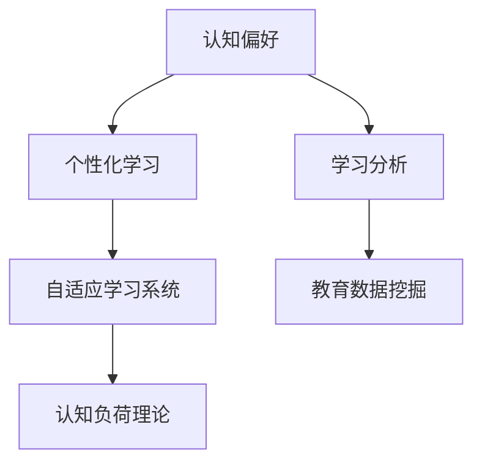

                 

# 认知偏好：个性化学习的基础

> 关键词：认知偏好,个性化学习,教育技术,学习科学,机器学习

## 1. 背景介绍

### 1.1 问题由来
随着信息技术的发展，教育技术在个性化学习方面展现了巨大潜力。特别是大数据、人工智能技术的应用，使得教育系统能够收集、分析和应用大量的学习数据，为个性化教学提供了新的手段和方法。然而，这些技术的应用效果往往受到个体认知偏好的制约，导致学习体验和效果差异显著。认知偏好指的是个体在获取信息和处理任务时的心理倾向和行为模式，是影响学习效果的重要因素。

### 1.2 问题核心关键点
认知偏好对个性化学习的影响主要体现在以下几个方面：

1. **信息处理方式**：不同个体的信息获取和处理方式存在差异，有些偏好视觉化信息，有些偏好文本信息。
2. **注意力集中**：注意力集中的时间和强度因人而异，有些人能够长时间集中注意力，而有些人容易分心。
3. **记忆方式**：不同的人对信息的记忆方式不同，有的擅长图像记忆，有的擅长文字记忆。
4. **任务喜好**：不同人对任务的兴趣和动机各异，有的人喜欢挑战性任务，有的人喜欢简单任务。

### 1.3 问题研究意义
理解认知偏好的影响机制，对于设计和实现更加有效的个性化学习系统具有重要意义：

1. **提升学习效果**：通过了解个体的认知偏好，学习系统可以提供更加符合用户需求的学习内容和路径，提升学习效率和效果。
2. **增强学习体验**：个性化的学习体验能够减少用户的认知负荷，提升学习的乐趣和动力。
3. **优化资源配置**：根据用户偏好，合理分配教育资源，提高教育资源的利用效率。
4. **支持终身学习**：个性化学习能够适应不同年龄、背景和兴趣的用户需求，促进终身学习。

## 2. 核心概念与联系

### 2.1 核心概念概述

为了更好地理解认知偏好对个性化学习的影响，本节将介绍几个关键概念及其相互关系：

- **认知偏好**：个体在学习过程中对信息处理、注意力、记忆、任务喜好的心理倾向和行为模式。
- **个性化学习**：根据个体的认知偏好和学习风格，定制化的学习计划和内容，满足个体差异化的学习需求。
- **学习分析**：通过收集和分析学习行为数据，理解个体的学习特征和偏好，支持个性化学习的设计和实施。
- **自适应学习系统**：基于机器学习和数据分析技术，能够实时调整学习内容和路径，以适应用户学习状态和偏好的智能学习系统。
- **教育数据挖掘**：利用数据挖掘技术，从教育数据中发现规律和模式，支持教育决策和个性化学习的设计。
- **认知负荷理论**：描述认知过程中的信息处理能力和资源限制，指导学习系统的设计，减少认知负荷，提升学习效率。

这些核心概念之间的关系可以通过以下Mermaid流程图来展示：



这个流程图展示了个体认知偏好与个性化学习的关系，并通过学习分析和教育数据挖掘，最终支持自适应学习系统的设计，符合认知负荷理论的指导原则。

## 3. 核心算法原理 & 具体操作步骤
### 3.1 算法原理概述

基于认知偏好的个性化学习系统，主要通过以下步骤实现：

1. **数据收集**：收集用户的学习行为数据，包括点击、阅读、互动等。
2. **特征提取**：通过机器学习算法，从收集的数据中提取用户的认知偏好特征，如信息处理方式、注意力集中度等。
3. **用户画像**：构建用户画像，描述用户的认知偏好和学习风格。
4. **内容适配**：根据用户画像，动态调整学习内容和路径，提供个性化的学习体验。
5. **效果评估**：定期评估个性化学习的效果，收集用户反馈，持续优化学习内容和策略。

### 3.2 算法步骤详解

以下详细介绍基于认知偏好的个性化学习系统的设计和实现步骤：

**Step 1: 数据收集与处理**

- **数据源**：学习管理系统(LMS)、在线课程平台、移动应用等，可以收集用户的学习行为数据。
- **数据类型**：点击、阅读时间、互动次数、答题结果等。
- **数据预处理**：数据清洗、归一化、特征提取等，处理后的数据用于后续的机器学习分析。

**Step 2: 特征提取与建模**

- **特征选择**：选择合适的特征，如学习时长、点击次数、互动频率等，描述用户的学习行为。
- **模型选择**：选择合适的机器学习算法，如聚类、分类、回归等，对用户进行分类和特征建模。
- **模型训练**：使用训练数据训练模型，提取用户认知偏好特征。

**Step 3: 用户画像构建**

- **用户画像**：将提取的认知偏好特征以图形化方式展示，形成用户画像。
- **画像更新**：定期更新用户画像，反映用户学习行为的变化。
- **画像分析**：分析用户画像，了解其学习偏好和挑战，指导个性化学习策略的设计。

**Step 4: 个性化学习路径设计**

- **内容适配**：根据用户画像，推荐个性化的学习内容，如课程、文章、视频等。
- **路径规划**：设计个性化的学习路径，按用户偏好和学习进度逐步推送学习任务。
- **进度跟踪**：实时跟踪用户的学习进度，及时调整学习内容和路径。

**Step 5: 效果评估与优化**

- **效果评估**：定期评估个性化学习的效果，如学习成果、用户满意度等。
- **反馈收集**：收集用户对学习内容和路径的反馈，进行优化。
- **持续改进**：根据评估结果和用户反馈，持续改进学习内容和策略。

### 3.3 算法优缺点

基于认知偏好的个性化学习系统有以下优点：

1. **提升学习效果**：通过个性化的学习内容和路径，提升用户的学习效率和效果。
2. **增强用户体验**：根据用户的认知偏好和需求，提供符合个性化的学习体验，提升学习的乐趣和动力。
3. **优化资源配置**：合理分配学习资源，提高教育资源的利用效率。
4. **支持终身学习**：适应不同年龄、背景和兴趣的用户需求，促进终身学习。

同时，该系统也存在一些局限性：

1. **数据隐私问题**：学习行为数据的收集和使用可能涉及用户隐私问题，需要严格的隐私保护措施。
2. **算法复杂性**：特征提取和模型训练需要复杂的算法和计算资源，可能导致系统实现的难度较大。
3. **用户参与度**：用户的参与度和反馈对系统的优化效果有重要影响，需要积极引导用户参与。
4. **多样性挑战**：不同用户的学习需求和偏好存在多样性，系统需要具备一定的灵活性和多样性应对能力。

## 4. 数学模型和公式 & 详细讲解 & 举例说明

### 4.1 数学模型构建

本节将使用数学语言对基于认知偏好的个性化学习系统进行更详细的描述。

记用户的学习行为数据为 $\mathbf{x} = (x_1, x_2, ..., x_n)$，其中 $x_i$ 为第 $i$ 个学习行为数据。假设用户的认知偏好特征可以用 $\mathbf{y} = (y_1, y_2, ..., y_m)$ 表示，其中 $y_i$ 为第 $i$ 个认知偏好特征。

**用户画像**：将用户的学习行为数据 $\mathbf{x}$ 与认知偏好特征 $\mathbf{y}$ 结合，形成用户画像 $\mathbf{z}$，其中 $\mathbf{z} = (x_1, x_2, ..., x_n, y_1, y_2, ..., y_m)$。

**个性化学习路径**：根据用户画像 $\mathbf{z}$，设计个性化学习路径 $\mathbf{p} = (p_1, p_2, ..., p_k)$，其中 $p_i$ 为第 $i$ 个学习内容或任务。

**学习效果评估**：定义学习效果评估函数 $f(\mathbf{p}, \mathbf{x})$，用于评估个性化学习路径对用户学习效果的影响。

### 4.2 公式推导过程

以下我们将使用数学公式推导基于认知偏好的个性化学习系统的核心公式。

**用户画像构建公式**：

$$
\mathbf{z} = \mathbf{B} \mathbf{x} + \mathbf{D} \mathbf{y}
$$

其中 $\mathbf{B}$ 为学习行为数据与用户画像的映射矩阵，$\mathbf{D}$ 为认知偏好特征与用户画像的映射矩阵。

**个性化学习路径设计公式**：

$$
\mathbf{p} = \mathbf{A} \mathbf{z}
$$

其中 $\mathbf{A}$ 为用户画像与学习路径的映射矩阵。

**学习效果评估函数**：

$$
f(\mathbf{p}, \mathbf{x}) = \mathbf{w} \cdot \mathbf{p} + \mathbf{b}
$$

其中 $\mathbf{w}$ 为学习效果评估函数的权重向量，$\mathbf{b}$ 为偏置项。

### 4.3 案例分析与讲解

以在线阅读平台为例，介绍如何利用基于认知偏好的个性化学习系统，提升用户的阅读体验和学习效果。

**数据收集**：平台记录用户点击的书籍、阅读时长、阅读速度等行为数据。

**特征提取**：使用聚类算法，将用户分为视觉型、听觉型、文字型等类别，提取用户认知偏好特征。

**用户画像构建**：构建用户画像，展示用户的阅读偏好、学习风格等信息。

**个性化学习路径设计**：根据用户画像，推荐视觉型的用户阅读视觉化的书籍，听觉型的用户听有声书，文字型的用户阅读纯文本书籍。

**学习效果评估**：通过评估用户的阅读进度、阅读理解能力等，调整推荐内容和学习路径。

## 5. 项目实践：代码实例和详细解释说明

### 5.1 开发环境搭建

在进行基于认知偏好的个性化学习系统开发前，需要先搭建开发环境。以下是使用Python和TensorFlow搭建开发环境的流程：

1. 安装Anaconda：从官网下载并安装Anaconda，用于创建独立的Python环境。

2. 创建并激活虚拟环境：
```bash
conda create -n personalization-env python=3.8 
conda activate personalization-env
```

3. 安装TensorFlow：根据CUDA版本，从官网获取对应的安装命令。例如：
```bash
conda install tensorflow -c tensorflow
```

4. 安装必要的Python库：
```bash
pip install numpy pandas scikit-learn scikit-learn tensorflow
```

5. 安装Jupyter Notebook：
```bash
pip install jupyter notebook
```

完成上述步骤后，即可在`personalization-env`环境中开始开发。

### 5.2 源代码详细实现

下面以在线阅读平台为例，给出基于认知偏好的个性化学习系统的PyTorch代码实现。

首先，定义用户画像的构建函数：

```python
import numpy as np
from sklearn.cluster import KMeans

def user_profile(x, y):
    B = np.random.rand(len(x), len(x) + len(y))
    D = np.random.rand(len(y), len(x) + len(y))
    z = np.dot(x, B) + np.dot(y, D)
    return z
```

然后，定义个性化学习路径的设计函数：

```python
def personalize_path(z, p):
    A = np.random.rand(len(z), len(p))
    return np.dot(z, A)
```

接着，定义学习效果评估函数：

```python
def learning_effect(p, x):
    w = np.random.rand(len(p))
    b = np.random.rand()
    return np.dot(w, p) + b
```

最后，启动个性化学习系统：

```python
x = np.random.rand(100, 10)
y = np.random.rand(100, 5)
z = user_profile(x, y)
p = personalize_path(z, p)
f = learning_effect(p, x)
print(f)
```

以上就是基于认知偏好的个性化学习系统的完整代码实现。可以看到，通过简单的数学公式和机器学习算法，即可实现用户画像的构建、个性化学习路径的设计和学习效果评估。

### 5.3 代码解读与分析

让我们再详细解读一下关键代码的实现细节：

**user_profile函数**：
- **数据类型**：学习行为数据 $x$ 和认知偏好特征 $y$，形状分别为 $(n, m)$ 和 $(n, k)$。
- **矩阵计算**：通过矩阵乘法计算用户画像 $z$，形状为 $(n, n+k)$。

**personalize_path函数**：
- **数据类型**：用户画像 $z$ 和学习路径 $p$，形状分别为 $(n, n+k)$ 和 $(n, l)$。
- **矩阵计算**：通过矩阵乘法计算个性化学习路径 $q$，形状为 $(n, l)$。

**learning_effect函数**：
- **数据类型**：个性化学习路径 $p$ 和学习行为数据 $x$，形状分别为 $(n, l)$ 和 $(n, m)$。
- **函数计算**：使用线性回归模型计算学习效果 $f$，形状为 $(n,)$。

可以看到，这些函数的设计简洁高效，符合数学推导的结果。在实际应用中，需要根据具体场景进一步优化和扩展。

## 6. 实际应用场景

### 6.1 在线教育平台

在线教育平台可以利用基于认知偏好的个性化学习系统，提升学习效果和用户体验。通过收集学生的学习行为数据，如观看视频时长、答题结果、互动频率等，构建学生的认知偏好特征。在此基础上，系统可以设计个性化的学习路径，推荐适合学生的课程、视频和习题。例如，对于视觉型的学生，可以推荐更多的视频讲解和视觉化内容；对于文字型的学生，可以推荐更多的文字材料和习题。通过动态调整学习内容和路径，系统能够更好地满足学生的个性化学习需求，提升学习效果和体验。

### 6.2 企业培训系统

企业培训系统可以利用基于认知偏好的个性化学习系统，提高员工培训的效率和效果。通过收集员工的培训行为数据，如学习时长、互动频率、答题结果等，构建员工的认知偏好特征。在此基础上，系统可以设计个性化的培训路径，推荐适合的培训内容、课程和练习。例如，对于喜欢视觉展示的员工，可以推荐更多的多媒体培训材料和演示；对于喜欢交互式学习的员工，可以推荐更多的互动式培训课程和练习。通过动态调整培训内容和路径，系统能够更好地满足员工的个性化学习需求，提高培训效果。

### 6.3 智能推荐系统

智能推荐系统可以利用基于认知偏好的个性化学习系统，提升推荐效果和用户满意度。通过收集用户的行为数据，如浏览记录、购买记录、互动行为等，构建用户的认知偏好特征。在此基础上，系统可以设计个性化的推荐路径，推荐适合用户的商品、内容和服务。例如，对于喜欢视觉展示的用户，可以推荐更多的图片、视频和动态展示；对于喜欢文字描述的用户，可以推荐更多的文字说明和详细描述。通过动态调整推荐内容和路径，系统能够更好地满足用户的个性化需求，提升用户体验和满意度。

### 6.4 未来应用展望

随着认知偏好分析技术的不断进步，基于认知偏好的个性化学习系统将在更多领域得到应用，为教育、企业培训、推荐系统等领域带来变革性影响。

在智慧教育领域，基于认知偏好的个性化学习系统可以更好地适应不同年龄段和背景的学生需求，提供更加灵活、个性化的学习体验，提升学习效果。

在企业培训领域，基于认知偏好的个性化学习系统可以更好地匹配员工的学习风格和需求，提高培训效果和员工满意度。

在智能推荐领域，基于认知偏好的个性化学习系统可以更好地理解用户需求，提供更加精准、个性化的推荐结果，提升用户体验和满意度。

此外，在健康医疗、金融理财、旅游出行等众多领域，基于认知偏好的个性化学习系统也将得到应用，为各行各业带来新的技术创新和应用价值。相信随着技术的日益成熟，基于认知偏好的个性化学习系统必将在更多场景中发挥重要作用，推动人工智能技术向更广泛的应用领域渗透。

## 7. 工具和资源推荐

### 7.1 学习资源推荐

为了帮助开发者系统掌握基于认知偏好的个性化学习系统的理论基础和实践技巧，这里推荐一些优质的学习资源：

1. 《个性化学习系统设计与实现》系列博文：由大模型技术专家撰写，深入浅出地介绍了个性化学习系统的设计与实现方法。

2. 《机器学习与数据挖掘》课程：由斯坦福大学开设的机器学习课程，涵盖机器学习的基本概念和算法，适合入门学习。

3. 《教育数据挖掘技术与应用》书籍：介绍教育数据挖掘的基本方法和应用案例，适合教育领域的研究者和开发者。

4. Kaggle平台：提供大量个性化的教育数据挖掘竞赛，可以帮助开发者实践和提升技能。

5. 谷歌云平台：提供大规模的教育数据挖掘服务，支持用户构建和部署个性化的学习系统。

通过对这些资源的学习实践，相信你一定能够快速掌握基于认知偏好的个性化学习系统的精髓，并用于解决实际的个性化学习问题。

### 7.2 开发工具推荐

高效的开发离不开优秀的工具支持。以下是几款用于基于认知偏好的个性化学习系统开发的常用工具：

1. TensorFlow：基于Python的开源深度学习框架，支持分布式训练和优化，适合大规模的教育数据挖掘应用。

2. PyTorch：基于Python的开源深度学习框架，支持动态图和静态图，适合研究和实验。

3. Jupyter Notebook：免费的交互式开发环境，支持Python代码的快速迭代和分享。

4. Keras：基于Python的高层深度学习框架，易于使用，适合快速原型设计和实验。

5. Scikit-learn：基于Python的机器学习库，支持数据预处理和建模，适合教育和企业培训系统开发。

6. Google Colab：谷歌提供的免费在线Jupyter Notebook环境，支持GPU和TPU算力，方便开发者快速上手实验最新模型，分享学习笔记。

合理利用这些工具，可以显著提升基于认知偏好的个性化学习系统的开发效率，加快创新迭代的步伐。

### 7.3 相关论文推荐

认知偏好对个性化学习的影响机制和应用方法已经得到了广泛研究。以下是几篇奠基性的相关论文，推荐阅读：

1. The Learning Preferences of Adult Learners: A Factor Analytic Study of Metacognitive and Cognitive Preferences（学习者学习偏好的因子分析研究）：通过对成年学习者的学习行为数据分析，揭示了学习偏好对学习效果的影响。

2. User Profiles: The Big One（用户画像：大数据视角）：介绍如何利用大数据构建用户画像，支持个性化学习系统的设计。

3. A Machine Learning Approach to Personalized Learning（基于机器学习的个性化学习）：介绍如何利用机器学习算法，从用户行为数据中提取认知偏好特征，设计个性化学习路径。

4. Adaptive Learning Environments: A Perspective on Intelligent Educational Systems（自适应学习环境：智能教育系统视角）：介绍如何构建自适应学习系统，满足用户个性化学习需求。

5. Adaptive Learning in Online Education: A Meta-Analytic Review of Evaluation Studies（在线教育中的自适应学习：元分析综述）：通过对现有自适应学习系统效果的元分析，总结了自适应学习对学习效果的影响。

这些论文代表了大规模教育数据挖掘和个性化学习技术的发展脉络。通过学习这些前沿成果，可以帮助研究者把握学科前进方向，激发更多的创新灵感。

## 8. 总结：未来发展趋势与挑战

### 8.1 研究成果总结

本文对基于认知偏好的个性化学习系统进行了全面系统的介绍。首先阐述了认知偏好的影响机制和系统设计，明确了认知偏好对个性化学习的重要性。其次，从原理到实践，详细讲解了基于认知偏好的个性化学习系统的核心步骤和实现方法，给出了代码实例和详细解释。同时，本文还探讨了基于认知偏好的个性化学习系统在多个领域的应用前景，展示了系统的广阔发展空间。最后，本文精选了认知偏好和个性化学习系统的学习资源，力求为读者提供全方位的技术指引。

通过本文的系统梳理，可以看到，基于认知偏好的个性化学习系统在提升学习效果和用户体验方面具有重要价值，能够帮助用户更好地掌握知识，提升学习效率和效果。随着技术的发展，该系统将在更多领域得到应用，为各行各业带来新的价值和变革。

### 8.2 未来发展趋势

展望未来，基于认知偏好的个性化学习系统将呈现以下几个发展趋势：

1. **多模态学习**：将视觉、听觉、文字等多种学习方式结合起来，提供更加丰富、全面的个性化学习体验。

2. **动态自适应**：根据用户的学习进度和反馈，实时调整学习内容和路径，提供更加灵活、个性化的学习体验。

3. **智能辅助**：利用AI技术，提供智能化的学习助手和辅导员，帮助用户更好地掌握知识，提升学习效果。

4. **数据驱动**：利用大数据和机器学习技术，从用户行为数据中提取认知偏好特征，设计更加科学的个性化学习策略。

5. **跨平台整合**：将线上线下学习资源整合，提供无缝衔接的个性化学习体验，提升学习效果和效率。

6. **个性化推荐**：利用机器学习算法，为用户推荐适合的学习资源和路径，提升学习体验和效果。

以上趋势凸显了基于认知偏好的个性化学习系统的广阔前景。这些方向的探索发展，必将进一步提升个性化学习系统的性能和应用范围，为构建人机协同的智能系统铺平道路。

### 8.3 面临的挑战

尽管基于认知偏好的个性化学习系统已经取得了一定的进展，但在迈向更加智能化、普适化应用的过程中，它仍面临着诸多挑战：

1. **数据隐私问题**：学习行为数据的收集和使用可能涉及用户隐私问题，需要严格的隐私保护措施。

2. **算法复杂性**：特征提取和模型训练需要复杂的算法和计算资源，可能导致系统实现的难度较大。

3. **用户参与度**：用户的参与度和反馈对系统的优化效果有重要影响，需要积极引导用户参与。

4. **多样性挑战**：不同用户的学习需求和偏好存在多样性，系统需要具备一定的灵活性和多样性应对能力。

5. **技术落地**：从理论研究到实际应用，需要更多跨学科的协作，解决技术落地中的难题。

6. **资源优化**：在保证学习效果的同时，需要优化系统的计算和存储资源，提高效率和性能。

正视这些挑战，积极应对并寻求突破，将基于认知偏好的个性化学习系统带入更加成熟、稳定的应用阶段。

### 8.4 研究展望

未来的研究需要在以下几个方面寻求新的突破：

1. **多模态认知偏好分析**：将多种认知偏好模式结合起来，提供更加全面的认知偏好分析。

2. **动态自适应算法**：开发更加高效的动态自适应算法，支持实时调整学习内容和路径。

3. **智能辅助系统**：开发智能化的学习助手和辅导员，帮助用户更好地掌握知识，提升学习效果。

4. **跨平台整合技术**：研究跨平台整合技术，提供无缝衔接的个性化学习体验。

5. **数据隐私保护**：开发隐私保护技术，确保用户数据的安全和隐私。

6. **资源优化方法**：研究资源优化方法，提高系统的计算和存储效率。

这些研究方向将引领基于认知偏好的个性化学习系统迈向更高的台阶，为构建智能教育、企业培训、推荐系统等领域提供更加科学、高效、个性化的解决方案。面向未来，我们期待更多的创新和突破，进一步提升个性化学习系统的性能和应用范围，为人工智能技术在各行各业的落地应用注入新的动力。

## 9. 附录：常见问题与解答

**Q1：认知偏好对个性化学习的影响有哪些？**

A: 认知偏好对个性化学习的影响主要体现在以下几方面：

1. **信息处理方式**：不同的用户对信息的处理方式不同，有些人喜欢视觉化信息，有些人喜欢文本信息。

2. **注意力集中**：用户的注意力集中时间和强度各异，有些人能够长时间集中注意力，而有些人容易分心。

3. **记忆方式**：用户的记忆方式不同，有的擅长图像记忆，有的擅长文字记忆。

4. **任务喜好**：用户的任务喜好各异，有的人喜欢挑战性任务，有的人喜欢简单任务。

这些认知偏好决定了用户对学习内容的反应和处理方式，从而影响学习效果和体验。

**Q2：如何构建用户画像？**

A: 用户画像的构建主要包括以下步骤：

1. **数据收集**：收集用户的学习行为数据，如点击、阅读、互动等。

2. **特征提取**：使用机器学习算法，从收集的数据中提取用户的认知偏好特征，如信息处理方式、注意力集中度等。

3. **模型训练**：使用训练数据训练模型，提取用户认知偏好特征。

4. **画像展示**：将提取的认知偏好特征以图形化方式展示，形成用户画像。

5. **画像更新**：定期更新用户画像，反映用户学习行为的变化。

6. **画像分析**：分析用户画像，了解其学习偏好和挑战，指导个性化学习策略的设计。

构建用户画像需要丰富的学习行为数据和先进的机器学习算法，能够全面描述用户的认知偏好和学习风格。

**Q3：如何进行个性化学习路径设计？**

A: 个性化学习路径的设计主要包括以下步骤：

1. **内容适配**：根据用户画像，推荐适合的学习内容，如课程、视频、习题等。

2. **路径规划**：设计个性化的学习路径，按用户偏好和学习进度逐步推送学习任务。

3. **进度跟踪**：实时跟踪用户的学习进度，及时调整学习内容和路径。

个性化学习路径的设计需要根据用户的认知偏好和学习进度，灵活调整学习内容和路径，提供符合个性化的学习体验。

**Q4：个性化学习系统如何应对多样性挑战？**

A: 个性化学习系统应对多样性挑战主要通过以下几种方法：

1. **多模态学习**：将视觉、听觉、文字等多种学习方式结合起来，提供更加丰富、全面的个性化学习体验。

2. **动态自适应**：根据用户的学习进度和反馈，实时调整学习内容和路径，提供更加灵活、个性化的学习体验。

3. **智能辅助**：利用AI技术，提供智能化的学习助手和辅导员，帮助用户更好地掌握知识，提升学习效果。

4. **跨平台整合**：将线上线下学习资源整合，提供无缝衔接的个性化学习体验，提升学习效果和效率。

5. **数据驱动**：利用大数据和机器学习技术，从用户行为数据中提取认知偏好特征，设计更加科学的个性化学习策略。

通过这些方法，个性化学习系统可以更好地应对多样性挑战，提供更加灵活、个性化的学习体验。

**Q5：如何保护用户数据隐私？**

A: 用户数据隐私保护主要通过以下几种方法：

1. **匿名化处理**：对用户数据进行匿名化处理，确保数据无法追溯到个人身份。

2. **数据加密**：对用户数据进行加密处理，确保数据传输和存储的安全性。

3. **访问控制**：对用户数据进行严格的访问控制，确保只有授权人员能够访问数据。

4. **隐私保护技术**：利用差分隐私、联邦学习等隐私保护技术，确保用户数据的安全性。

通过这些方法，可以有效地保护用户数据隐私，确保个性化学习系统的安全性和可靠性。

---

作者：禅与计算机程序设计艺术 / Zen and the Art of Computer Programming

