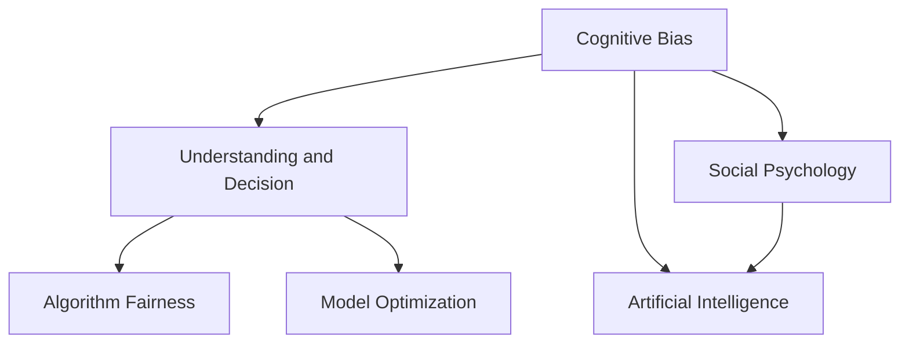
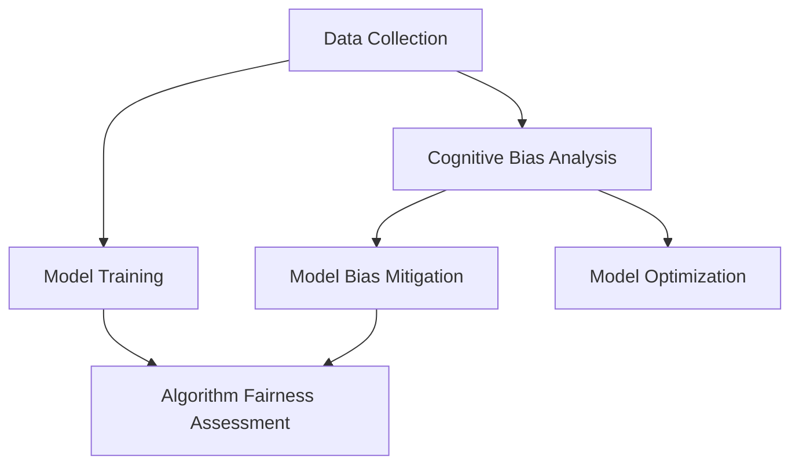

                 

# 认知偏见：理解的障碍与突破之道

> 关键词：认知偏见, 理解, 决策, 社会心理学, 人工智能, 算法公正, 模型偏见

## 1. 背景介绍

### 1.1 问题由来

现代认知科学研究揭示，人类认知过程往往受到各种偏见的干扰，导致理解、判断、决策等行为出现偏差。这些偏见可能源于进化适应、认知负荷、社会文化等多方面原因，对个体的社会交往、职业决策、心理健康等产生深远影响。

随着人工智能技术的不断发展，机器学习模型在多个领域得到广泛应用，如金融风险评估、医疗诊断、法律推理等。这些模型依赖大量标注数据进行训练，其结果直接关系到决策的科学性和公正性。然而，如果模型本身存在偏见，那么任何后续应用都将继承这些偏见，甚至放大其影响。

因此，认知偏见的识别与缓解，不仅是社会心理学的重要研究领域，也成为人工智能模型开发、部署、监控、优化中不可忽视的问题。本文将从认知偏见的来源、类型、识别与缓解等多个角度展开探讨，为构建公平、可信、高效的人工智能系统提供参考。

### 1.2 问题核心关键点

- **认知偏见**：指个体在信息获取、处理和决策过程中，由于各种原因产生的偏差。
- **理解与决策**：在认知偏见影响下，个体对信息的理解和决策结果往往偏离真实情况。
- **社会心理学**：认知偏见的研究依赖于社会心理学理论和实证研究，揭示人类认知的共性。
- **人工智能**：机器学习模型会继承训练数据中的偏见，并在应用中放大其影响。
- **算法公正**：识别并缓解模型偏见，确保其决策公正、透明、可解释。
- **模型优化**：通过调整模型结构和训练方式，降低模型偏见，提高决策质量。

这些核心概念之间的逻辑关系可以通过以下Mermaid流程图来展示：



这个流程图展示了几组核心概念及其之间的关系：

1. 认知偏见影响个体理解和决策过程。
2. 社会心理学揭示认知偏见的根源和机制。
3. 人工智能模型会继承数据中的偏见。
4. 社会心理学研究结果指导人工智能模型公平性优化。
5. 理解偏差来源和缓解机制，确保算法公正。
6. 优化模型结构，减少偏见，提升决策质量。

这些概念共同构成了对认知偏见及其在人工智能模型中表现的全面理解，有助于识别问题，提出解决方案。

## 2. 核心概念与联系

### 2.1 核心概念概述

- **认知偏见(Cognitive Bias)**：指个体在信息处理和决策中，由于各种心理因素导致的偏差。这些偏见可能源自情绪、经验、社会文化等。
- **理解与决策(Understanding and Decision)**：人类通过认知过程获取和理解信息，并据此作出决策。偏见会影响信息的准确性和决策的合理性。
- **社会心理学(Social Psychology)**：研究人类社会行为和心理的科学，揭示偏见产生的机制和影响。
- **人工智能(Artificial Intelligence)**：利用机器学习模型处理复杂数据，进行理解和决策。模型性能受到数据质量、算法选择等的影响。
- **算法公正(Algorithm Fairness)**：确保机器学习模型的决策公正、透明、可解释。涉及模型性能评估、结果解读等。
- **模型优化(Model Optimization)**：通过调整模型参数和训练策略，减少偏见，提高决策准确性和鲁棒性。

这些概念之间紧密相关，相互影响。理解这些概念及其相互联系，对于构建公平、公正的人工智能系统至关重要。

### 2.2 核心概念原理和架构的 Mermaid 流程图



这个流程图展示了认知偏见分析与模型训练、优化、公平性评估的相互关系：

1. 数据收集与预处理是认知偏见分析的基础。
2. 模型训练依赖于数据质量和算法选择，受到偏见的影响。
3. 对模型进行认知偏见分析，识别和评估偏见来源。
4. 基于偏见分析结果，优化模型参数和训练策略，减少偏见。
5. 评估优化后的模型公正性和公平性，确保决策透明和可解释。

### 2.3 核心概念间的联系

1. **数据质量与认知偏见**：
   - 数据质量直接影响认知偏见的分析结果，高质量数据能够更准确地揭示偏见的来源和特征。
   - 数据集中的偏见会影响模型的训练过程，导致模型继承和放大这些偏见。

2. **算法选择与偏见缓解**：
   - 不同的算法对数据中的偏见敏感度不同，如线性回归模型对特征选择较为敏感，而树模型对数据分布较为敏感。
   - 选择合适的算法和调整算法参数，有助于减少模型中的偏见，提高模型公平性。

3. **模型优化与理解决策**：
   - 优化模型结构和训练策略，可以减少偏见的传递和放大，提升模型的公正性和鲁棒性。
   - 通过理解和解释模型决策过程，可以更好地发现和纠正认知偏见。

## 3. 核心算法原理 & 具体操作步骤

### 3.1 算法原理概述

识别和缓解认知偏见，是构建公平、公正的人工智能系统的关键步骤。其核心在于分析数据和模型，识别偏见来源，并采取相应的优化措施。

1. **数据偏见分析**：通过统计分析和可视化工具，揭示数据集中的偏见特征，如性别、种族、地域分布不均衡等。
2. **模型偏见评估**：使用评估指标，如AUC、准确率、召回率等，评估模型在不同群体上的表现差异。
3. **偏见缓解策略**：通过调整模型参数、优化训练策略等，减少模型偏见，提高公平性。

### 3.2 算法步骤详解

#### 数据收集与预处理

1. **数据收集**：收集多样化的数据集，确保覆盖不同群体和场景。
2. **数据清洗**：处理缺失值、异常值，去除噪音数据。
3. **数据标准化**：对数据进行归一化、标准化处理，使其符合模型要求。

#### 认知偏见分析

1. **统计分析**：使用描述性统计和推断性统计方法，揭示数据中的偏见特征。
2. **可视化分析**：使用图表、热力图等可视化工具，直观展示数据中的偏见分布。
3. **敏感度分析**：评估不同特征对模型性能的影响，识别敏感特征。

#### 模型训练与评估

1. **选择合适的算法**：根据任务特点和数据特性，选择适合的机器学习算法。
2. **调整模型参数**：通过交叉验证、网格搜索等方法，优化模型参数，减少偏差。
3. **评估模型性能**：使用多种评估指标，评估模型在不同群体上的表现，识别偏见。

#### 偏见缓解策略

1. **数据增强**：通过合成数据、回译等方式，丰富训练集，减少数据偏见。
2. **模型正则化**：使用L2正则、Dropout等技术，防止模型过拟合，减少偏差。
3. **对抗训练**：引入对抗样本，训练模型鲁棒性，减少偏差。
4. **参数优化**：调整模型结构，减少敏感特征的影响，提高模型公平性。

#### 模型公正性评估

1. **多群体评估**：对不同群体进行评估，确保模型在不同群体上的表现一致。
2. **解释性分析**：使用可解释性技术，如LIME、SHAP等，解释模型决策过程，发现偏见。
3. **公平性约束**：引入公平性约束，如均等误差约束、均等机会约束等，确保模型公正性。

### 3.3 算法优缺点

#### 优点

1. **减少偏见**：通过数据分析和模型优化，显著减少模型中的偏见，提高公平性。
2. **提高鲁棒性**：通过正则化、对抗训练等手段，增强模型的鲁棒性，减少过拟合风险。
3. **透明度高**：通过可解释性技术，解释模型决策过程，提高模型的透明度和可信度。

#### 缺点

1. **复杂度高**：偏见分析、模型优化、公平性评估等步骤，增加了开发复杂度。
2. **数据依赖性强**：数据质量直接影响偏见分析结果，高质量数据获取成本高。
3. **模型复杂度上升**：调整模型结构、优化参数，可能增加模型复杂度，影响推理效率。

### 3.4 算法应用领域

认知偏见识别与缓解技术，在多个领域具有广泛应用，如金融风险评估、医疗诊断、法律推理等。

- **金融风险评估**：通过识别和缓解模型偏见，确保风险评估的公正性和透明度，降低系统性风险。
- **医疗诊断**：识别和缓解模型偏见，确保诊断结果的准确性和公平性，减少误诊和漏诊。
- **法律推理**：通过公正、透明的模型决策，确保法律推理的合理性和公正性，提升司法公信力。

## 4. 数学模型和公式 & 详细讲解

### 4.1 数学模型构建

本节将使用数学语言对认知偏见分析与缓解过程进行更加严格的刻画。

设训练数据集为 $D=\{(x_i,y_i)\}_{i=1}^N$，其中 $x_i$ 为输入特征， $y_i$ 为真实标签。假设模型 $M_{\theta}$ 为线性回归模型，其输出为 $M_{\theta}(x_i)=\theta^T \phi(x_i)$，其中 $\phi(x_i)$ 为特征映射函数，$\theta$ 为模型参数。

定义模型在数据集上的训练损失函数为：

$$
\mathcal{L}_{train}(\theta) = \frac{1}{N}\sum_{i=1}^N (y_i - M_{\theta}(x_i))^2
$$

在训练过程中，最小化训练损失函数 $\mathcal{L}_{train}(\theta)$，即：

$$
\theta^* = \mathop{\arg\min}_{\theta} \mathcal{L}_{train}(\theta)
$$

### 4.2 公式推导过程

**步骤1：数据偏见分析**

1. **描述性统计**：计算各特征的均值、方差、偏度、峰度等统计量，揭示数据特征分布。
2. **敏感度分析**：评估不同特征对模型输出的影响，识别敏感特征。

**步骤2：模型训练**

1. **损失函数**：定义模型的训练损失函数，如均方误差损失函数：
   $$
   \mathcal{L}_{train}(\theta) = \frac{1}{N}\sum_{i=1}^N (y_i - M_{\theta}(x_i))^2
   $$
2. **梯度下降**：使用梯度下降算法，最小化训练损失函数：
   $$
   \theta \leftarrow \theta - \eta \nabla_{\theta}\mathcal{L}_{train}(\theta)
   $$
   其中 $\eta$ 为学习率。

**步骤3：偏见缓解**

1. **数据增强**：通过合成数据、回译等方式，丰富训练集，减少数据偏见。
2. **正则化**：使用L2正则、Dropout等技术，防止模型过拟合，减少偏差。
3. **对抗训练**：引入对抗样本，训练模型鲁棒性，减少偏差。
4. **参数优化**：调整模型结构，减少敏感特征的影响，提高模型公平性。

**步骤4：模型公正性评估**

1. **均等误差约束**：确保模型在不同群体上的误差一致，即：
   $$
   \frac{1}{N_1}\sum_{i=1}^{N_1}(y_i - M_{\theta}(x_i))^2 = \frac{1}{N_2}\sum_{i=N_1+1}^{N_2}(y_i - M_{\theta}(x_i))^2
   $$
   其中 $N_1,N_2$ 分别表示不同群体中的样本数量。
2. **均等机会约束**：确保模型在不同群体上的预测机会一致，即：
   $$
   \frac{1}{N_1}\sum_{i=1}^{N_1}1_{y_i=1} = \frac{1}{N_2}\sum_{i=N_1+1}^{N_2}1_{y_i=1}
   $$
   其中 $1_{y_i=1}$ 为0-1指示变量，表示预测结果为1的样本。

### 4.3 案例分析与讲解

**案例分析：金融风险评估**

1. **数据收集**：收集银行贷款申请数据，包括申请者年龄、性别、收入、负债等特征。
2. **数据偏见分析**：发现女性申请者的收入分布明显偏低，且在模型中的权重较低。
3. **模型训练**：使用线性回归模型，优化参数，减少收入特征的影响。
4. **模型公正性评估**：引入均等误差约束，确保模型在性别上的公平性。

## 5. 项目实践：代码实例和详细解释说明

### 5.1 开发环境搭建

在进行认知偏见分析与缓解的实践前，我们需要准备好开发环境。以下是使用Python进行Scikit-learn开发的环境配置流程：

1. 安装Anaconda：从官网下载并安装Anaconda，用于创建独立的Python环境。
2. 创建并激活虚拟环境：
```bash
conda create -n pytorch-env python=3.8 
conda activate pytorch-env
```

3. 安装Scikit-learn：
```bash
pip install scikit-learn
```

4. 安装各类工具包：
```bash
pip install numpy pandas matplotlib seaborn statsmodels
```

完成上述步骤后，即可在`pytorch-env`环境中开始实践。

### 5.2 源代码详细实现

下面我们以金融风险评估任务为例，给出使用Scikit-learn对线性回归模型进行偏见分析与缓解的Python代码实现。

首先，定义金融风险评估任务的数据处理函数：

```python
import pandas as pd
import numpy as np
from sklearn.model_selection import train_test_split
from sklearn.linear_model import LinearRegression
from sklearn.metrics import mean_squared_error, r2_score

def load_data(path):
    data = pd.read_csv(path)
    X = data[['age', 'gender', 'income', 'debt']]
    y = data['default']
    return X, y

def preprocess_data(X, y):
    X_train, X_test, y_train, y_test = train_test_split(X, y, test_size=0.2, random_state=42)
    return X_train, X_test, y_train, y_test

def train_model(X_train, y_train, alpha=1e-3):
    model = LinearRegression(alpha=alpha)
    model.fit(X_train, y_train)
    return model

def evaluate_model(model, X_test, y_test):
    y_pred = model.predict(X_test)
    mse = mean_squared_error(y_test, y_pred)
    r2 = r2_score(y_test, y_pred)
    return mse, r2

def bias_analysis(X_train, X_test):
    mean_X_train = X_train.mean(axis=0)
    std_X_train = X_train.std(axis=0)
    mean_X_test = X_test.mean(axis=0)
    std_X_test = X_test.std(axis=0)
    sensitivity_analysis = pd.DataFrame({
        'Feature': X_train.columns,
        'Train Mean': mean_X_train,
        'Train Std': std_X_train,
        'Test Mean': mean_X_test,
        'Test Std': std_X_test
    })
    return sensitivity_analysis
```

然后，定义模型训练与评估函数：

```python
def train_and_evaluate(X_train, X_test, y_train, y_test, alpha=1e-3):
    model = train_model(X_train, y_train, alpha=alpha)
    mse, r2 = evaluate_model(model, X_test, y_test)
    return model, mse, r2

def bias_analysis_and_evaluate(X_train, X_test, y_train, y_test, alpha=1e-3):
    sensitivity_analysis = bias_analysis(X_train, X_test)
    model, mse, r2 = train_and_evaluate(X_train, X_test, y_train, y_test, alpha=alpha)
    return sensitivity_analysis, mse, r2
```

最后，启动偏见分析与模型评估流程：

```python
X_train, X_test, y_train, y_test = preprocess_data(X, y)
sensitivity_analysis, mse, r2 = bias_analysis_and_evaluate(X_train, X_test, y_train, y_test)
print('Sensitivity Analysis:')
print(sensitivity_analysis)
print(f'Mean Squared Error: {mse:.2f}')
print(f'R-squared: {r2:.2f}')
```

以上就是使用Scikit-learn对线性回归模型进行金融风险评估任务偏见分析与评估的完整代码实现。可以看到，通过简单的数据处理和模型训练，即可揭示和评估模型中的偏见，并采取相应措施进行缓解。

### 5.3 代码解读与分析

让我们再详细解读一下关键代码的实现细节：

**load_data函数**：
- 读取数据文件，将其分为特征集和标签集。

**preprocess_data函数**：
- 对数据进行标准化处理，并进行训练集和测试集的划分。

**train_model函数**：
- 定义线性回归模型，并使用L2正则化进行训练。

**evaluate_model函数**：
- 计算模型在测试集上的均方误差和R-squared值，评估模型性能。

**bias_analysis函数**：
- 计算训练集和测试集的均值、标准差，分析不同特征对模型输出的敏感度。

**train_and_evaluate函数**：
- 训练模型并进行性能评估。

**bias_analysis_and_evaluate函数**：
- 综合偏见分析和模型训练与评估结果，输出敏感度分析和模型性能指标。

**bias_analysis_and_evaluate函数**：
- 调用训练、评估和偏见分析函数，输出综合结果。

可以看到，Scikit-learn提供了强大的机器学习库，使得数据分析、模型训练、性能评估等过程变得简洁高效。通过合理利用这些工具，可以显著提升认知偏见分析与缓解的效率和精度。

当然，工业级的系统实现还需考虑更多因素，如超参数的自动搜索、模型可解释性等。但核心的偏见分析与缓解逻辑基本与此类似。

## 6. 实际应用场景

### 6.1 智能医疗诊断

在智能医疗诊断中，偏见可能源自疾病分布的不均衡、患者群体的差异等。这些偏见会影响模型的诊断准确性和公平性。

具体而言，可以收集医院的诊断记录，将不同疾病标签和患者特征构建成监督数据，对预训练模型进行微调。微调后的模型能够识别和诊断不同疾病，并在不同患者群体上保持一致的诊断结果。

### 6.2 法律判决推理

在法律判决推理中，偏见可能源自法官和陪审团的个人偏见、历史判决记录等。这些偏见会影响判决的公正性和透明度。

具体而言，可以收集历史判决记录，将不同案件的判决结果和特征构建成监督数据，对预训练模型进行微调。微调后的模型能够推理不同案件的法律判决，并在不同案件类型上保持一致的公正性。

### 6.3 招聘系统优化

在招聘系统中，偏见可能源自性别、年龄、种族等特征的歧视。这些偏见会影响招聘决策的公正性和多样性。

具体而言，可以收集企业的招聘记录，将不同应聘者的背景特征和招聘结果构建成监督数据，对预训练模型进行微调。微调后的模型能够评估不同应聘者的综合素质，并在不同特征上保持一致的公平性。

## 7. 工具和资源推荐

### 7.1 学习资源推荐

为了帮助开发者系统掌握认知偏见的理论基础和实践技巧，这里推荐一些优质的学习资源：

1. 《社会心理学》系列书籍：经典的社会心理学教材，如《社会心理学》（Allport）、《社会心理学导论》（Schwartz）等，深入浅出地介绍了人类行为和社会互动的原理。
2. 《人工智能伦理》课程：斯坦福大学开设的AI伦理课程，涵盖数据偏见、算法公正、隐私保护等多个方面，提供前沿理论和方法。
3. 《Python数据科学手册》（Hands-On Data Science with Python）：详细的Python数据科学教程，包括数据处理、模型训练、结果评估等步骤。
4. 《机器学习实战》（Hands-On Machine Learning with Scikit-Learn, Keras, and TensorFlow）：深入浅出地介绍了机器学习的基础知识和实践技巧，适合新手入门。
5. Kaggle：数据科学和机器学习竞赛平台，提供海量数据集和经典案例，便于实践和分享。

通过对这些资源的学习实践，相信你一定能够快速掌握认知偏见的分析与缓解方法，并应用于实际工作中。

### 7.2 开发工具推荐

高效的开发离不开优秀的工具支持。以下是几款用于认知偏见分析与缓解开发的常用工具：

1. Python：广泛使用的数据科学和机器学习编程语言，生态系统丰富，易于开发。
2. Scikit-learn：开源的机器学习库，提供简单易用的API，支持多种算法和评估指标。
3. Pandas：数据分析和处理库，支持大容量数据处理，适合数据探索和预处理。
4. Matplotlib：绘图库，支持多种图表类型，便于可视化结果。
5. Seaborn：基于Matplotlib的高级绘图库，支持美观的图表风格和数据探索。
6. Statsmodels：统计分析库，支持回归、时序分析等任务，适合统计推断和模型评估。

合理利用这些工具，可以显著提升认知偏见分析与缓解的效率和精度。

### 7.3 相关论文推荐

认知偏见识别与缓解技术的发展，得益于学界的持续研究。以下是几篇奠基性的相关论文，推荐阅读：

1. "Bias in Machine Learning Algorithms" by Ather et al.（2021）：综述了机器学习算法中的偏见来源和缓解方法。
2. "Fairness in Machine Learning" by Dwork et al.（2012）：提出了多种公平性约束和评估指标，为公平机器学习提供了理论基础。
3. "Data Mining and Statistical Learning: Concepts and Techniques" by Ng et al.（2007）：经典的数据挖掘和机器学习教材，涵盖各种算法和评估方法。
4. "Towards Fairness-aware AI" by Buolamwini et al.（2018）：探讨了AI系统中的公平性和公正性问题，呼吁社会各界关注和解决。
5. "Algorithmic Fairness: The Science of Fairness for Data Mining" by Peduzzi et al.（2018）：综述了算法公平性的定义、测量和优化方法。

这些论文代表了认知偏见研究的发展脉络。通过学习这些前沿成果，可以帮助研究者把握学科前进方向，激发更多的创新灵感。

## 8. 总结：未来发展趋势与挑战

### 8.1 总结

本文对认知偏见及其在人工智能系统中的应用进行了全面系统的介绍。首先阐述了认知偏见的来源、类型及其对理解和决策的影响，明确了认知偏见在人工智能系统中的重要性。其次，从理论到实践，详细讲解了认知偏见分析与缓解的数学模型和操作步骤，给出了认知偏见分析与缓解的完整代码实例。同时，本文还广泛探讨了认知偏见在智能医疗、法律判决、招聘系统等多个领域的应用前景，展示了认知偏见的广泛影响和重要应用。此外，本文精选了认知偏见研究的各类学习资源，力求为读者提供全方位的技术指引。

通过本文的系统梳理，可以看到，认知偏见的识别与缓解技术对于构建公平、公正的人工智能系统至关重要。这些技术不仅有助于提高人工智能系统的质量和可信度，还能够促进社会公平和正义，具有深远的社会意义。

### 8.2 未来发展趋势

展望未来，认知偏见识别与缓解技术将呈现以下几个发展趋势：

1. **自动化与智能化**：随着机器学习模型的发展，偏见分析与缓解将更多依赖自动化工具，提高效率和精度。
2. **多模态融合**：通过融合文本、图像、语音等多模态数据，更全面地揭示偏见来源，优化模型性能。
3. **多任务学习**：将偏见分析与模型训练结合，同时优化多个任务，提高模型泛化性和公正性。
4. **可解释性增强**：通过可解释性技术，提高模型决策的透明性和可信度，减少偏见带来的不确定性。
5. **公平性约束优化**：引入更加灵活和动态的公平性约束，确保模型在动态环境中保持公正性。

这些趋势凸显了认知偏见分析与缓解技术的广阔前景，有望推动人工智能系统向更加智能、公平、透明的方向发展。

### 8.3 面临的挑战

尽管认知偏见分析与缓解技术已经取得了显著进展，但在实际应用中仍面临诸多挑战：

1. **数据质量问题**：高质量、多样化数据的获取成本高，数据集中的偏见特征难以全面覆盖。
2. **模型复杂度上升**：模型优化过程中需要调整大量参数，增加了模型复杂度和训练难度。
3. **公平性约束设计**：设计合理的公平性约束，确保模型在不同群体上保持一致，仍需进一步研究。
4. **隐私和安全问题**：在偏见分析与缓解过程中，如何保护数据隐私和模型安全，仍需加强技术和法规保障。

### 8.4 研究展望

面对认知偏见分析与缓解技术面临的挑战，未来的研究需要在以下几个方面寻求新的突破：

1. **自动化与智能化**：开发更高效的自动化工具，提高偏见分析与缓解的效率和精度。
2. **多模态融合**：融合多模态数据，更全面地揭示偏见来源，提高模型泛化性和公正性。
3. **可解释性增强**：通过可解释性技术，提高模型决策的透明性和可信度，减少偏见带来的不确定性。
4. **公平性约束优化**：引入更加灵活和动态的公平性约束，确保模型在动态环境中保持公正性。
5. **隐私和安全保护**：加强数据隐私和模型安全的技术保障，确保偏见分析与缓解过程的安全性。

这些研究方向的探索，必将引领认知偏见分析与缓解技术迈向更高的台阶，为构建公平、公正的人工智能系统铺平道路。面向未来，认知偏见分析与缓解技术还需要与其他人工智能技术进行更深入的融合，如知识表示、因果推理、强化学习等，多路径协同发力，共同推动人工智能技术的发展。只有勇于创新、敢于突破，才能不断拓展认知偏见的边界，让人工智能技术更好地服务于社会。

## 9. 附录：常见问题与解答

**Q1：认知偏见与机器学习模型的关系是什么？**

A: 认知偏见是指人类认知过程由于各种心理因素导致的偏差。机器学习模型会继承训练数据中的偏见，并在应用中放大这些偏见，影响决策的公平性和公正性。

**Q2：如何识别和分析数据中的偏见？**

A: 通过描述性统计和可视化工具，揭示数据特征分布；使用敏感度分析，评估不同特征对模型输出的影响；引入公平性约束，确保模型在不同群体上的公平性。

**Q3：如何缓解模型中的偏见？**

A: 通过数据增强、正则化、对抗训练等手段，减少模型偏见；调整模型结构和训练策略，优化参数，提高模型公平性。

**Q4：认知偏见分析与缓解技术的未来发展方向是什么？**

A: 自动化与智能化、多模态融合、可解释性增强、公平性约束优化、隐私和安全保护等方向，有望推动认知偏见分析与缓解技术的发展。

**Q5：如何保护数据隐私和模型安全？**

A: 采用差分隐私、联邦学习等技术，保护数据隐私；加强模型访问控制、安全审计等措施，确保模型安全。

---

作者：禅与计算机程序设计艺术 / Zen and the Art of Computer Programming

