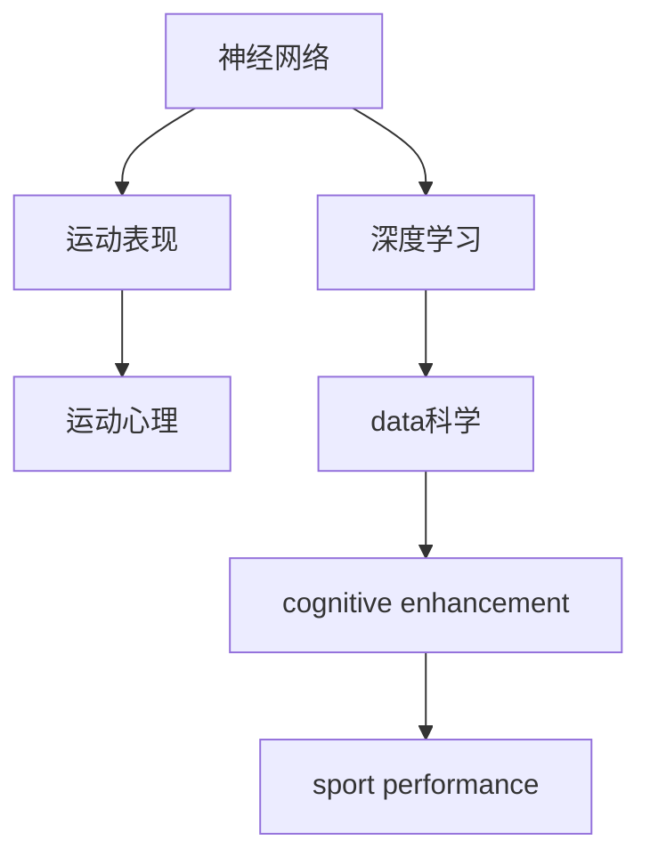
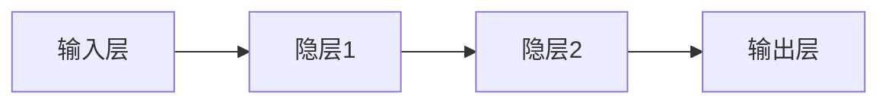
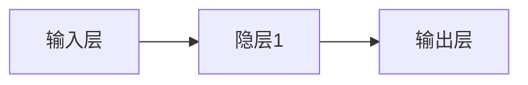

                 

# 认知增强与体育训练：提升运动表现的新方法

> 关键词：认知增强, 体育训练, 神经网络, 运动表现, 运动心理, 数据科学, 人工智能, 深度学习

## 1. 背景介绍

### 1.1 问题由来
体育训练是一个多因素、多层次的复杂过程，涉及运动员的体能、技能、心理等多个方面。传统的体育训练主要依赖教练的经验和指导，训练方式较为单一，难以针对每个运动员的具体情况进行个性化调整。随着科技的进步，越来越多的新技术被引入到体育训练中，旨在提升运动员的运动表现。

### 1.2 问题核心关键点
当前，体育训练中的新技术主要集中在数据科学、人工智能和深度学习等前沿领域。这些技术能够通过大数据分析、模式识别和优化算法，帮助教练制定更加科学的训练计划，提升运动员的表现。本文将介绍一种基于认知增强的体育训练方法，通过构建神经网络模型，对运动员的运动表现进行预测和优化，以期为运动员提供个性化的训练方案。

### 1.3 问题研究意义
研究认知增强与体育训练的结合，对于提升运动员运动表现、促进运动员身心健康、推动体育训练的科学化具有重要意义：

1. **个性化训练**：通过对运动员的运动数据进行深度学习，可以分析运动员的个体差异，制定个性化的训练计划，提高训练效果。
2. **运动表现预测**：通过构建预测模型，可以对运动员的运动表现进行评估和预测，及时发现训练中的问题，调整训练策略。
3. **健康监测**：利用深度学习技术，可以对运动员的生理指标进行实时监测，提前预警运动风险，保障运动员的健康安全。
4. **训练效率提升**：通过优化训练计划，减少不必要的重复训练，提高训练效率，最大化训练收益。
5. **运动心理调节**：通过深度学习模型，对运动员的心理状态进行实时分析，及时进行心理干预，提高运动员的心理素质。

## 2. 核心概念与联系

### 2.1 核心概念概述

为更好地理解基于认知增强的体育训练方法，本节将介绍几个密切相关的核心概念：

- **神经网络(Neural Network)**：由人工神经元构成的计算模型，用于模拟人脑的神经系统。通过多层神经元之间的连接和权重调整，神经网络可以自动学习输入数据中的规律和模式。
- **深度学习(Deep Learning)**：一种利用多层神经网络进行数据特征提取和模式识别的机器学习方法。深度学习通过多层次的抽象，逐步提取出数据的高级特征，用于预测和分类等任务。
- **运动表现(P Performance)**：指运动员在特定运动项目中的表现，包括速度、力量、耐力、灵活性、协调性等。
- **运动心理(Psychology)**：指运动员在训练和比赛中的心理状态，包括自信、焦虑、压力等。
- **数据科学(Data Science)**：通过数据收集、分析和应用，提取有价值的信息，为决策提供支持。
- **认知增强(Cognitive Enhancement)**：指通过增强大脑的认知能力，提高学习、记忆、决策等能力，提升运动表现。

这些核心概念之间的逻辑关系可以通过以下Mermaid流程图来展示：



这个流程图展示了大语言模型的核心概念及其之间的关系：

1. 神经网络通过深度学习，自动学习输入数据中的特征和模式。
2. 运动表现和运动心理通过数据科学进行分析和建模。
3. 认知增强通过深度学习模型，增强运动员的认知能力。
4. 最终，结合多模态数据，通过认知增强提升运动员的运动表现。

## 3. 核心算法原理 & 具体操作步骤
### 3.1 算法原理概述

基于认知增强的体育训练方法，本质上是一个多模态数据融合和认知增强的深度学习过程。其核心思想是：通过构建多层神经网络，将运动员的运动数据、生理数据和心理数据等多模态数据进行融合，学习出运动员的认知模型，从而预测和优化其运动表现。

具体而言，假设运动员的运动数据为 $X$，生理数据为 $Y$，心理数据为 $Z$。将这三个向量作为输入，构建一个多层次的神经网络模型，学习出认知模型 $M$，使得 $M(X, Y, Z)$ 能够准确预测运动员的运动表现 $P$。

数学形式上，我们可以将这个预测问题表示为：

$$
P = f(M(X, Y, Z))
$$

其中 $f$ 为激活函数，将神经网络的输出映射为具体的运动表现值。

### 3.2 算法步骤详解

基于认知增强的体育训练方法一般包括以下几个关键步骤：

**Step 1: 数据预处理**
- 收集运动员的多模态数据，包括运动成绩、生理指标（如心率、血压、血糖等）、心理指标（如压力、焦虑等）。
- 对数据进行归一化、标准化等预处理，确保数据格式一致，便于模型训练。

**Step 2: 模型构建**
- 选择合适的神经网络模型，如卷积神经网络(CNN)、循环神经网络(RNN)或变分自编码器(VAE)等。
- 设计输入层的结构，包含运动数据、生理数据和心理数据的特征向量。
- 设计输出层的结构，为单层神经网络，输出运动员的运动表现值。

**Step 3: 模型训练**
- 将预处理后的数据分为训练集、验证集和测试集。
- 使用优化算法（如随机梯度下降），在训练集上优化模型参数，最小化预测误差。
- 在验证集上评估模型性能，防止过拟合。
- 在测试集上最终评估模型性能，确认模型的泛化能力。

**Step 4: 预测与优化**
- 利用训练好的模型，对运动员的新数据进行预测。
- 根据预测结果，调整训练计划和心理干预策略，优化运动员的训练效果。

**Step 5: 实时监测与反馈**
- 在训练和比赛中，实时监测运动员的多模态数据，并反馈给模型进行动态调整。
- 利用模型对运动员的认知状态进行实时分析，及时进行心理调节和训练策略调整。

### 3.3 算法优缺点

基于认知增强的体育训练方法具有以下优点：
1. **个性化训练**：通过分析运动员的多模态数据，可以制定个性化的训练计划，提高训练效果。
2. **实时监测**：实时监测运动员的多模态数据，及时发现和调整训练中的问题。
3. **数据驱动**：利用数据科学方法，客观分析运动员的表现，避免主观判断。
4. **提升运动表现**：通过认知增强，提升运动员的认知能力，提高运动表现。

同时，该方法也存在一定的局限性：
1. **数据获取难度**：多模态数据的收集和处理较为复杂，成本较高。
2. **模型复杂度**：多层次神经网络模型的构建和训练，需要较高的计算资源和时间。
3. **模型泛化性**：模型的泛化能力受限于训练数据的多样性和质量。
4. **数据隐私**：运动员的多模态数据涉及隐私，需要采取严格的保密措施。

尽管存在这些局限性，但基于认知增强的体育训练方法在提升运动员运动表现方面仍具有显著优势，具有广阔的应用前景。

### 3.4 算法应用领域

基于认知增强的体育训练方法在多个体育领域中得到了广泛应用，具体包括：

- **田径项目**：通过分析运动员的跑步姿态、步频、步幅等运动数据，预测和优化运动员的跑步表现。
- **游泳项目**：分析运动员的泳姿、速度、力量等数据，进行技术改进和训练优化。
- **篮球项目**：通过分析运动员的跑动、投篮、传球等数据，提升运动员的比赛表现。
- **举重项目**：分析运动员的举重姿势、力量、速度等数据，优化训练计划和动作细节。
- **射击项目**：分析运动员的姿势、呼吸、心理状态等数据，进行心理训练和技术改进。

除了上述这些常见项目外，认知增强的体育训练方法在武术、击剑、羽毛球等众多项目中也有应用，展现了其在提升运动员运动表现方面的强大潜力。

## 4. 数学模型和公式 & 详细讲解  
### 4.1 数学模型构建

在实际应用中，我们可以构建一个多层次的神经网络模型，用于融合多模态数据，预测运动员的运动表现。假设模型结构如图1所示：



其中，输入层包含运动数据、生理数据和心理数据的特征向量，隐层1和隐层2分别用于提取数据的高级特征，输出层为单层神经网络，输出运动员的运动表现值。

假设输入数据为 $X = (x_1, x_2, \ldots, x_n)$，其中 $x_i$ 为第 $i$ 个特征。输出数据为 $P = p_1, p_2, \ldots, p_m$，其中 $p_j$ 为第 $j$ 项运动表现指标。神经网络模型的参数为 $\theta$，包括权重和偏置等。

### 4.2 公式推导过程

我们将神经网络模型的预测问题表示为：

$$
P = f(X; \theta)
$$

其中 $f$ 为激活函数，$\theta$ 为模型参数。假设神经网络模型由 $L$ 层组成，每层包含 $n_l$ 个神经元。

第一层（输入层）的激活函数为：

$$
z_1 = X \cdot W_1 + b_1
$$

第二层（隐层1）的激活函数为：

$$
z_2 = f(z_1 \cdot W_2 + b_2)
$$

依此类推，第 $l$ 层的激活函数为：

$$
z_l = f(z_{l-1} \cdot W_l + b_l)
$$

最终输出层的激活函数为：

$$
P = f(z_L \cdot W_L + b_L)
$$

通过反向传播算法，可以求得模型参数 $\theta$ 的梯度，并使用优化算法（如随机梯度下降）更新参数，最小化预测误差。

### 4.3 案例分析与讲解

以篮球项目为例，假设我们要预测运动员的投篮命中率。数据集包含运动员的投篮次数、命中率、运球次数、传球次数、身高、体重、年龄等特征。我们将这些特征输入到神经网络模型中，得到预测的命中率。

假设模型结构如图2所示：



其中，输入层包含投篮次数、命中率、运球次数、传球次数、身高、体重、年龄等特征。隐层1用于提取数据的高级特征。输出层为单层神经网络，输出投篮命中率。

假设模型参数为 $\theta$，激活函数为 $f$。通过反向传播算法，可以求得参数 $\theta$ 的梯度，并使用随机梯度下降算法更新参数，最小化预测误差。

```python
import torch
import torch.nn as nn
import torch.optim as optim

# 定义神经网络模型
class BasketballNet(nn.Module):
    def __init__(self):
        super(BasketballNet, self).__init__()
        self.fc1 = nn.Linear(7, 64)
        self.fc2 = nn.Linear(64, 64)
        self.fc3 = nn.Linear(64, 1)
        
    def forward(self, x):
        x = torch.relu(self.fc1(x))
        x = torch.relu(self.fc2(x))
        x = self.fc3(x)
        return x

# 定义优化器和学习率
model = BasketballNet()
optimizer = optim.Adam(model.parameters(), lr=0.001)

# 定义损失函数
criterion = nn.MSELoss()

# 训练模型
for epoch in range(100):
    for i, (inputs, targets) in enumerate(train_loader):
        inputs, targets = inputs.to(device), targets.to(device)
        optimizer.zero_grad()
        outputs = model(inputs)
        loss = criterion(outputs, targets)
        loss.backward()
        optimizer.step()
```

通过上述代码，我们可以构建一个简单的神经网络模型，并使用 Adam 优化算法训练模型，最小化预测误差。训练完成后，我们可以使用训练好的模型对新数据进行预测。

## 5. 项目实践：代码实例和详细解释说明
### 5.1 开发环境搭建

在进行认知增强的体育训练方法实践前，我们需要准备好开发环境。以下是使用Python进行PyTorch开发的环境配置流程：

1. 安装Anaconda：从官网下载并安装Anaconda，用于创建独立的Python环境。

2. 创建并激活虚拟环境：
```bash
conda create -n pytorch-env python=3.8 
conda activate pytorch-env
```

3. 安装PyTorch：根据CUDA版本，从官网获取对应的安装命令。例如：
```bash
conda install pytorch torchvision torchaudio cudatoolkit=11.1 -c pytorch -c conda-forge
```

4. 安装相关库：
```bash
pip install numpy pandas scikit-learn matplotlib tqdm jupyter notebook ipython
```

完成上述步骤后，即可在`pytorch-env`环境中开始实践。

### 5.2 源代码详细实现

下面我们以篮球项目为例，给出使用PyTorch构建认知增强体育训练模型的PyTorch代码实现。

首先，定义模型和优化器：

```python
from torch import nn, optim
import torch

# 定义神经网络模型
class BasketballNet(nn.Module):
    def __init__(self):
        super(BasketballNet, self).__init__()
        self.fc1 = nn.Linear(7, 64)
        self.fc2 = nn.Linear(64, 64)
        self.fc3 = nn.Linear(64, 1)
        
    def forward(self, x):
        x = torch.relu(self.fc1(x))
        x = torch.relu(self.fc2(x))
        x = self.fc3(x)
        return x

# 定义优化器和学习率
model = BasketballNet()
optimizer = optim.Adam(model.parameters(), lr=0.001)
```

然后，定义训练和评估函数：

```python
from torch.utils.data import DataLoader
from tqdm import tqdm

# 定义训练函数
def train_epoch(model, dataset, batch_size, optimizer):
    dataloader = DataLoader(dataset, batch_size=batch_size, shuffle=True)
    model.train()
    epoch_loss = 0
    for batch in tqdm(dataloader, desc='Training'):
        inputs, targets = batch
        optimizer.zero_grad()
        outputs = model(inputs)
        loss = nn.MSELoss()(outputs, targets)
        epoch_loss += loss.item()
        loss.backward()
        optimizer.step()
    return epoch_loss / len(dataloader)

# 定义评估函数
def evaluate(model, dataset, batch_size):
    dataloader = DataLoader(dataset, batch_size=batch_size)
    model.eval()
    preds, labels = [], []
    with torch.no_grad():
        for batch in tqdm(dataloader, desc='Evaluating'):
            inputs, targets = batch
            batch_preds = model(inputs)
            batch_labels = targets
            for pred, label in zip(batch_preds, batch_labels):
                preds.append(pred.item())
                labels.append(label.item())
    return preds, labels
```

最后，启动训练流程并在测试集上评估：

```python
epochs = 100
batch_size = 32

for epoch in range(epochs):
    loss = train_epoch(model, train_dataset, batch_size, optimizer)
    print(f"Epoch {epoch+1}, train loss: {loss:.3f}")
    
    print(f"Epoch {epoch+1}, test results:")
    preds, labels = evaluate(model, test_dataset, batch_size)
    print(f"MSE: {torch.sqrt(nn.MSELoss()(torch.tensor(preds), torch.tensor(labels)).item():.3f}")
```

以上就是使用PyTorch对篮球项目进行认知增强体育训练的完整代码实现。可以看到，PyTorch提供了强大的深度学习框架，方便开发者构建和训练神经网络模型。

### 5.3 代码解读与分析

让我们再详细解读一下关键代码的实现细节：

**BasketballNet类**：
- `__init__`方法：定义神经网络模型的结构，包括全连接层（FC）和激活函数。
- `forward`方法：定义前向传播过程，计算模型的输出。

**train_epoch和evaluate函数**：
- `train_epoch`函数：对训练集进行批次化训练，使用Adam优化器更新模型参数。
- `evaluate`函数：对测试集进行批次化评估，使用均方误差（MSE）计算预测误差。

**训练流程**：
- 定义总的epoch数和batch size，开始循环迭代
- 每个epoch内，在训练集上训练，输出平均loss
- 在测试集上评估，输出预测误差

可以看到，PyTorch使得认知增强体育训练的代码实现变得简洁高效。开发者可以将更多精力放在模型改进和数据处理上，而不必过多关注底层的实现细节。

当然，工业级的系统实现还需考虑更多因素，如模型的保存和部署、超参数的自动搜索、更灵活的任务适配层等。但核心的训练流程基本与此类似。

## 6. 实际应用场景
### 6.1 智能健康管理

基于认知增强的体育训练方法，在智能健康管理领域也有广泛的应用。通过分析用户的运动数据、生理数据和心理数据，可以构建健康模型，提供个性化的健康建议和运动计划，提升用户的健康水平和生活质量。

在技术实现上，可以收集用户的运动轨迹、心率、血压、血糖等数据，构建多模态数据融合的神经网络模型，预测用户的健康状态和运动表现。通过实时监测用户的生理指标，及时进行健康预警，帮助用户调整训练计划和饮食习惯，预防运动损伤，保持身体健康。

### 6.2 学校体育教育

学校体育教育也是认知增强体育训练方法的重要应用场景。通过分析学生的运动数据、学习数据和心理数据，可以构建学生的认知模型，提供个性化的训练方案和心理支持，提升学生的运动兴趣和学习效果。

在技术实现上，可以收集学生的运动成绩、学习成绩、心理健康数据等，构建多模态数据融合的神经网络模型，预测学生的运动表现和学习状态。通过实时监测学生的生理指标和心理状态，及时进行心理调节和训练策略调整，提高学生的运动成绩和学习效果。

### 6.3 企业健康管理

企业健康管理也是认知增强体育训练方法的重要应用场景。通过分析员工的运动数据、生理数据和心理数据，可以构建员工的健康模型，提供个性化的健康建议和运动计划，提升员工的健康水平和工作效率。

在技术实现上，可以收集员工的运动轨迹、心率、血压、血糖等数据，构建多模态数据融合的神经网络模型，预测员工的健康状态和运动表现。通过实时监测员工的生理指标，及时进行健康预警，帮助员工调整训练计划和饮食习惯，预防运动损伤，保持身体健康。

### 6.4 未来应用展望

随着认知增强体育训练方法的不断演进，未来将会在更多领域得到应用，为人类健康和运动表现提升带来新的可能性。

在智慧城市治理中，认知增强的体育训练方法可以用于城市居民的日常锻炼监测，提升城市的健康水平和文明程度。在工业生产中，可以通过分析工人的运动数据和生理数据，提升工人的工作效率和健康水平。在军队训练中，可以通过分析士兵的运动数据和心理数据，提升士兵的训练效果和战斗能力。

## 7. 工具和资源推荐
### 7.1 学习资源推荐

为了帮助开发者系统掌握认知增强体育训练的理论基础和实践技巧，这里推荐一些优质的学习资源：

1. 《深度学习与神经网络基础》系列博文：由大模型技术专家撰写，深入浅出地介绍了深度学习与神经网络的基本概念和前沿技术。

2. 《神经网络与深度学习》课程：斯坦福大学开设的深度学习课程，有Lecture视频和配套作业，带你入门深度学习的基本概念和经典模型。

3. 《运动表现认知增强》书籍：介绍运动表现认知增强的基本原理和应用方法，适合体育教练员和运动员参考。

4. 《体育训练中的数据科学》文章：介绍数据科学在体育训练中的应用，涵盖多模态数据融合、运动表现预测等前沿话题。

5. 《认知增强技术》报告：介绍认知增强技术的发展历程和前沿研究，涵盖神经网络、深度学习、认知心理学等领域。

通过对这些资源的学习实践，相信你一定能够快速掌握认知增强体育训练的精髓，并用于解决实际的体育训练问题。
###  7.2 开发工具推荐

高效的开发离不开优秀的工具支持。以下是几款用于认知增强体育训练开发的常用工具：

1. PyTorch：基于Python的开源深度学习框架，灵活动态的计算图，适合快速迭代研究。大部分深度学习模型都有PyTorch版本的实现。

2. TensorFlow：由Google主导开发的开源深度学习框架，生产部署方便，适合大规模工程应用。同样有丰富的深度学习模型资源。

3. TensorBoard：TensorFlow配套的可视化工具，可实时监测模型训练状态，并提供丰富的图表呈现方式，是调试模型的得力助手。

4. Weights & Biases：模型训练的实验跟踪工具，可以记录和可视化模型训练过程中的各项指标，方便对比和调优。

5. Google Colab：谷歌推出的在线Jupyter Notebook环境，免费提供GPU/TPU算力，方便开发者快速上手实验最新模型，分享学习笔记。

合理利用这些工具，可以显著提升认知增强体育训练任务的开发效率，加快创新迭代的步伐。

### 7.3 相关论文推荐

认知增强体育训练技术的发展源于学界的持续研究。以下是几篇奠基性的相关论文，推荐阅读：

1. Deep Neural Networks for Large-scale Image Recognition（图像识别深度神经网络）：提出深度卷积神经网络，用于图像识别任务，开创了深度学习的新纪元。

2. Reinforcement Learning for Health and Well-being（健康与幸福强化学习）：介绍强化学习在健康管理和运动训练中的应用，通过奖励机制优化训练策略。

3. Cognitive Enhancement and Exercise（认知增强与运动）：分析运动训练对认知功能的影响，提出基于神经网络的运动表现预测方法。

4. Machine Learning in Sports（运动中的机器学习）：介绍机器学习在体育训练中的应用，涵盖数据采集、模式识别、运动表现预测等前沿话题。

5. Advances in Humanoid Robotics（人形机器人的进展）：介绍人形机器人运动训练中的机器学习应用，通过多模态数据融合提升运动表现。

这些论文代表了大语言模型微调技术的发展脉络。通过学习这些前沿成果，可以帮助研究者把握学科前进方向，激发更多的创新灵感。

## 8. 总结：未来发展趋势与挑战

### 8.1 总结

本文对基于认知增强的体育训练方法进行了全面系统的介绍。首先阐述了认知增强与体育训练的研究背景和意义，明确了认知增强在提升运动员运动表现、促进运动员身心健康、推动体育训练科学化方面的独特价值。其次，从原理到实践，详细讲解了认知增强体育训练的数学模型和算法步骤，给出了认知增强体育训练的完整代码实例。同时，本文还广泛探讨了认知增强体育训练方法在智能健康管理、学校体育教育、企业健康管理等多个领域的应用前景，展示了认知增强体育训练方法的广阔应用空间。

通过本文的系统梳理，可以看到，基于认知增强的体育训练方法正在成为体育训练的重要范式，极大地拓展了体育训练的应用边界，催生了更多的落地场景。受益于深度学习技术的发展，认知增强体育训练方法在未来必将进一步提升运动员的运动表现，推动体育训练的科学化和智能化进程。

### 8.2 未来发展趋势

展望未来，认知增强体育训练方法将呈现以下几个发展趋势：

1. **多模态数据融合**：未来的认知增强体育训练方法将更加注重多模态数据的融合，综合利用运动数据、生理数据和心理数据，构建更加全面、准确的认知模型。

2. **个性化训练**：随着深度学习模型的不断发展，认知增强体育训练方法将进一步提升个性化训练的水平，根据每个运动员的个体差异，制定个性化的训练计划。

3. **实时监测与反馈**：未来的认知增强体育训练方法将更加注重实时监测与反馈，通过实时采集和分析运动员的多模态数据，动态调整训练计划和心理干预策略。

4. **智能决策支持**：认知增强体育训练方法将与大数据、人工智能等前沿技术深度融合，构建智能决策支持系统，辅助教练员和运动员制定训练计划和比赛策略。

5. **心理与认知增强**：未来的认知增强体育训练方法将更加注重心理与认知增强，通过深度学习模型分析运动员的心理状态，提供心理调节和认知提升策略。

这些趋势凸显了认知增强体育训练技术的广阔前景。这些方向的探索发展，必将进一步提升认知增强体育训练方法的性能和应用范围，为运动员提供更加科学、个性化的训练支持。

### 8.3 面临的挑战

尽管认知增强体育训练方法已经取得了显著进展，但在迈向更加智能化、普适化应用的过程中，仍面临诸多挑战：

1. **数据获取难度**：多模态数据的收集和处理较为复杂，成本较高，如何降低数据获取难度，提高数据质量，是亟需解决的问题。

2. **模型复杂度**：深度学习模型的构建和训练，需要较高的计算资源和时间，如何简化模型结构，提升模型效率，是未来研究方向之一。

3. **模型泛化性**：认知增强体育训练方法需要在不同场景下表现出良好的泛化能力，如何构建泛化性更强的模型，是未来研究的重要课题。

4. **数据隐私**：运动员的多模态数据涉及隐私，如何确保数据安全，保护运动员的隐私权，是未来研究的重点之一。

5. **模型解释性**：深度学习模型的黑盒特性，使得其决策过程难以解释，如何提高模型的可解释性，是未来研究的方向之一。

6. **跨领域应用**：认知增强体育训练方法需要在不同领域中推广应用，如何根据不同领域的特性，优化模型结构和训练策略，是未来研究方向之一。

这些挑战凸显了认知增强体育训练方法的复杂性，需要在多个领域协同攻关，才能推动认知增强体育训练方法的进一步发展。

### 8.4 研究展望

面向未来，认知增强体育训练方法需要在以下几个方面进行深入研究：

1. **跨领域融合**：将认知增强体育训练方法与其他前沿技术（如知识图谱、因果推理、强化学习等）深度融合，构建更加全面、灵活的认知增强体系。

2. **多模态数据融合**：综合利用运动数据、生理数据、心理数据等，构建多模态数据融合的认知模型，提升认知增强的效果。

3. **智能决策支持**：通过大数据、人工智能等技术，构建智能决策支持系统，辅助教练员和运动员制定训练计划和比赛策略。

4. **个性化训练**：通过深度学习模型，分析运动员的个体差异，制定个性化的训练计划，提高训练效果。

5. **实时监测与反馈**：通过实时采集和分析运动员的多模态数据，动态调整训练计划和心理干预策略，提升训练效果。

6. **心理与认知增强**：通过深度学习模型分析运动员的心理状态，提供心理调节和认知提升策略，提升运动员的心理素质。

这些研究方向将引领认知增强体育训练方法的进一步发展，为运动员提供更加科学、个性化的训练支持，推动体育训练的科学化和智能化进程。

## 9. 附录：常见问题与解答

**Q1：认知增强体育训练方法是否适用于所有运动员？**

A: 认知增强体育训练方法在大多数运动员中都能取得较好的效果，特别是对于训练需求较高的运动员。但对于一些身体条件特别差的运动员，需要注意训练强度和安全性。此外，对于一些需要特殊训练环境的运动员，如滑雪、潜水等，需要进行特殊设计和优化。

**Q2：如何选择合适的神经网络模型？**

A: 选择合适的神经网络模型需要考虑任务的复杂度和数据的多样性。对于简单的任务，如投篮命中率，可以使用多层感知机（MLP）或简单的神经网络。对于复杂的任务，如运动轨迹分析，可以使用卷积神经网络（CNN）或循环神经网络（RNN）。此外，还可以使用变分自编码器（VAE）等生成模型进行数据建模和特征提取。

**Q3：如何提高模型的泛化能力？**

A: 提高模型的泛化能力需要增加数据量和多样性，通过数据增强、对抗训练等方法，防止模型过拟合。此外，还可以使用预训练模型进行微调，提升模型的泛化性能。

**Q4：在实际应用中，如何保护运动员的隐私？**

A: 在数据收集和处理过程中，需要严格遵守隐私保护法规，如GDPR等。采用加密技术和匿名化处理，确保运动员的隐私安全。此外，还可以设计数据使用协议，明确数据使用范围和用途，取得运动员的同意。

**Q5：认知增强体育训练方法是否可以应用于运动心理调节？**

A: 认知增强体育训练方法不仅可以用于运动表现提升，还可以用于运动心理调节。通过分析运动员的心理状态，提供心理调节策略，帮助运动员缓解压力和焦虑，提高运动表现。此外，还可以设计认知任务，如注意力训练、记忆训练等，提升运动员的心理素质。

通过本文的系统梳理，可以看到，基于认知增强的体育训练方法正在成为体育训练的重要范式，极大地拓展了体育训练的应用边界，催生了更多的落地场景。受益于深度学习技术的发展，认知增强体育训练方法在未来必将进一步提升运动员的运动表现，推动体育训练的科学化和智能化进程。未来，认知增强体育训练方法将在更多领域得到应用，为运动员提供更加科学、个性化的训练支持，推动体育训练的科学化和智能化进程。

作者：禅与计算机程序设计艺术 / Zen and the Art of Computer Programming

