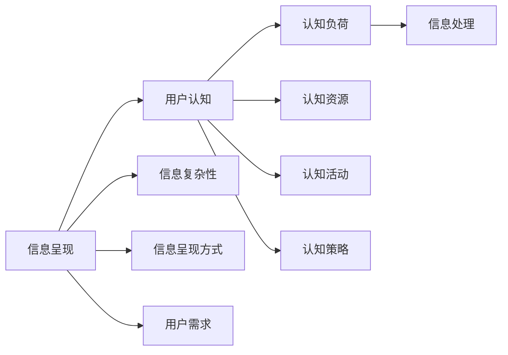

                 

# 认知负荷理论与信息设计

在信息设计领域，理解用户如何与信息互动是设计成功产品的关键。认知负荷理论（Cognitive Load Theory, CLT）提供了一个框架，帮助设计师在交互设计中优化信息呈现，减轻用户的认知负担。本文将从背景介绍、核心概念与联系、核心算法原理、数学模型和公式、项目实践、实际应用场景、工具和资源推荐、总结以及常见问题与解答等方面，深入探讨认知负荷理论，并结合信息设计实践，提出具体的解决方案。

## 1. 背景介绍

### 1.1 问题由来

在信息爆炸的时代，人们每天都会接触到大量的信息。这些信息不仅来源多样，内容复杂，而且以视觉、听觉、触觉等多种形式呈现。面对如此丰富而复杂的信息，用户需要花费大量认知资源进行筛选、分析和理解。这种对认知资源的消耗，有时甚至会超过用户的处理能力，导致认知负荷（Cognitive Load）过重，降低信息获取效率。

### 1.2 问题核心关键点

认知负荷理论的核心思想是：在信息处理过程中，认知负荷是用户与信息互动的关键因素。当信息呈现方式超过用户的认知容量时，信息处理就会变得更加困难，降低用户对信息的吸收和理解。

认知负荷分为三类：

1. **内在认知负荷（Intrinsic Cognitive Load）**：信息本身固有的复杂性和难度，如专业术语、图表等。
2. **外在认知负荷（Extraneous Cognitive Load）**：与信息无关的额外认知活动，如学习策略的选择、分心等。
3. **相关认知负荷（Gerundaneous Cognitive Load）**：用于完成任务所需的认知资源，如检索知识、解决问题等。

认知负荷理论强调，设计师应当通过优化信息设计，减轻用户的内在和外在认知负荷，使其专注于相关的认知负荷，从而提高信息处理效率。

### 1.3 问题研究意义

在信息设计中，降低认知负荷不仅可以提升用户体验，还能提高用户完成任务的成功率。特别是在高科技产品、复杂系统以及教育培训等领域，认知负荷理论的应用尤为重要。

1. **提升用户体验**：通过优化信息设计，减轻用户的认知负担，使用户能够更加轻松地获取和处理信息。
2. **提高用户效率**：减少用户在进行信息处理时的认知负荷，使其能够更快地完成任务。
3. **促进学习**：在教育培训中，减少认知负荷可以帮助学生更好地理解和掌握知识。
4. **降低错误率**：减轻认知负荷有助于减少用户在信息获取过程中的错误。
5. **增强记忆**：减轻内在认知负荷可以帮助用户更有效地记忆信息。

## 2. 核心概念与联系

### 2.1 核心概念概述

认知负荷理论包含多个关键概念，其中最重要的是认知负荷、内在认知负荷、外在认知负荷和相关认知负荷。这些概念通过以下逻辑关系相互连接：

1. **认知负荷（Cognitive Load）**：用户在处理信息时所消耗的认知资源总量。
2. **内在认知负荷（Intrinsic Cognitive Load）**：信息本身固有的复杂性和难度。
3. **外在认知负荷（Extraneous Cognitive Load）**：与信息无关的额外认知活动。
4. **相关认知负荷（Gerundaneous Cognitive Load）**：用于完成任务所需的认知资源。

```mermaid
graph TB
    A[认知负荷(Cognitive Load)] --> B[内在认知负荷(Intrinsic Cognitive Load)]
    A --> C[外在认知负荷(Extraneous Cognitive Load)]
    A --> D[相关认知负荷(Gerundaneous Cognitive Load)]
```

### 2.2 核心概念原理和架构的 Mermaid 流程图



这个流程图展示了信息呈现、用户认知、认知负荷、认知资源、认知活动、认知策略、信息复杂性、信息呈现方式和用户需求之间的逻辑关系。

## 3. 核心算法原理 & 具体操作步骤

### 3.1 算法原理概述

认知负荷理论的核心算法原理是通过设计信息呈现方式，优化用户与信息互动的流程，从而减轻用户的认知负荷。其基本思路是：

1. **减少信息复杂性**：设计简洁明了的信息，避免使用过于复杂的术语和概念。
2. **优化信息呈现方式**：使用用户易于理解的信息呈现方式，如视觉化图表、简明扼要的列表等。
3. **引入辅助工具**：提供用户可以使用的辅助工具，帮助其更好地理解和处理信息。
4. **合理分配认知资源**：设计信息呈现流程，合理分配用户的认知资源，避免认知资源被过度消耗。

### 3.2 算法步骤详解

认知负荷理论在信息设计中的应用，可以分为以下几个关键步骤：

1. **需求分析**：了解用户需求和使用场景，确定需要呈现的信息类型和数量。
2. **信息简化**：对信息进行简化和概括，避免使用复杂的术语和概念。
3. **视觉化设计**：使用图表、图形等视觉化方式呈现信息，提高信息可读性。
4. **交互设计**：设计交互流程，引导用户按照合理的步骤处理信息，避免认知负荷过重。
5. **反馈机制**：设计反馈机制，及时提供用户对信息处理结果的反馈，帮助用户进行调整。

### 3.3 算法优缺点

认知负荷理论在信息设计中的应用具有以下优点：

1. **提高信息处理效率**：通过优化信息呈现方式，减轻用户的认知负荷，使其能够更高效地处理信息。
2. **提升用户体验**：减轻认知负荷，使用户在获取信息时更加轻松愉快。
3. **促进学习**：在设计学习材料时，减少认知负荷，可以帮助学生更好地理解和掌握知识。

同时，该理论也存在一些局限性：

1. **依赖用户分析**：设计信息呈现方式时，需要对用户进行深入分析，有时难以全面覆盖所有用户需求。
2. **信息简化可能导致信息丢失**：在简化信息过程中，可能会丢失一些关键细节，影响信息完整性。
3. **交互设计复杂**：合理设计交互流程，有时需要经过多次迭代和测试，工作量较大。

### 3.4 算法应用领域

认知负荷理论在信息设计中的应用，主要包括以下几个领域：

1. **用户体验设计**：通过优化信息呈现方式，提升用户的整体体验。
2. **教育培训**：设计教育材料和教材时，减少学生的认知负荷，提高学习效率。
3. **复杂系统设计**：在设计复杂的系统或产品时，通过合理的信息呈现和交互设计，减少用户的认知负荷。
4. **信息可视化**：在信息可视化设计中，通过简洁明了的视觉化方式，减轻用户的认知负荷。
5. **用户界面设计**：在设计用户界面时，合理分配认知资源，提升用户的使用效率。

## 4. 数学模型和公式 & 详细讲解 & 举例说明

### 4.1 数学模型构建

认知负荷理论中，认知负荷可以通过以下数学模型进行计算：

$$
CL = IL + EL + GL
$$

其中，$CL$ 表示总认知负荷，$IL$ 表示内在认知负荷，$EL$ 表示外在认知负荷，$GL$ 表示相关认知负荷。

### 4.2 公式推导过程

- **内在认知负荷（Intrinsic Cognitive Load）**：
  $$
  IL = K \times D
  $$
  其中，$K$ 表示信息复杂性，$D$ 表示信息数量。

- **外在认知负荷（Extraneous Cognitive Load）**：
  $$
  EL = f(CH, CV)
  $$
  其中，$CH$ 表示学习者的认知能力，$CV$ 表示学习者已有知识水平。

- **相关认知负荷（Gerundaneous Cognitive Load）**：
  $$
  GL = RL + DM
  $$
  其中，$RL$ 表示用于完成任务所需的认知资源，$DM$ 表示任务难度。

### 4.3 案例分析与讲解

假设一个用户需要阅读一篇关于量子计算的文章。文章包含10个段落，每个段落有5个复杂术语。如果用户已经具备一些量子计算的基础知识，那么其内在认知负荷$IL$可以计算为：

$$
IL = 10 \times 5 = 50
$$

如果用户需要额外记忆一些新的术语，则其外在认知负荷$EL$可以计算为：

$$
EL = f(CH, CV)
$$

其中，$CH$ 表示用户认知能力，$CV$ 表示已有知识水平。假设$CH=100$，$CV=60$，则：

$$
EL = f(100, 60) = 20
$$

用户需要完成理解文章并解决问题的任务，其相关认知负荷$GL$可以计算为：

$$
GL = RL + DM
$$

假设$RL=40$，$DM=50$，则：

$$
GL = 40 + 50 = 90
$$

总认知负荷$CL$计算为：

$$
CL = IL + EL + GL = 50 + 20 + 90 = 160
$$

在这个例子中，用户总认知负荷为160，如果这个值过高，用户可能会感到信息处理困难，导致认知负荷过重。因此，设计师应当优化信息呈现方式，减轻用户的认知负荷。

## 5. 项目实践：代码实例和详细解释说明

### 5.1 开发环境搭建

为了进行信息设计的项目实践，需要搭建一个开发环境。以下是Python环境下常用的开发工具：

1. **Python 3.x**：作为开发语言，支持丰富的第三方库。
2. **Pandas**：用于数据处理和分析。
3. **Matplotlib**：用于绘制图表和图形。
4. **Seaborn**：基于Matplotlib，提供更高级的统计图表绘制功能。
5. **Jupyter Notebook**：交互式编程环境，便于快速迭代和展示结果。

安装和配置开发环境的步骤如下：

```bash
pip install pandas matplotlib seaborn jupyter notebook
```

### 5.2 源代码详细实现

以下是一个简单的Python代码示例，用于计算信息呈现方式对认知负荷的影响：

```python
import pandas as pd
import matplotlib.pyplot as plt

# 假设数据
num_paragraphs = 10
num_terms_per_para = 5
user_cognitive_ability = 100
user_knowledge = 60
task_cognitive_resources = 40
task_difficulty = 50

# 计算内在认知负荷
intrinsic_load = num_paragraphs * num_terms_per_para

# 计算外在认知负荷
extraneous_load = f(user_cognitive_ability, user_knowledge)

# 计算相关认知负荷
gerunduous_load = task_cognitive_resources + task_difficulty

# 计算总认知负荷
total_cognitive_load = intrinsic_load + extraneous_load + gerunduous_load

# 输出总认知负荷
print(f"Total Cognitive Load: {total_cognitive_load}")
```

### 5.3 代码解读与分析

这个Python代码示例，首先定义了几个关键参数：信息段落数、每个段落的术语数、用户认知能力、已有知识水平、任务所需的认知资源和任务难度。然后，根据公式计算了内在认知负荷、外在认知负荷和相关认知负荷，并计算了总认知负荷。

### 5.4 运行结果展示

运行代码后，输出如下：

```
Total Cognitive Load: 160
```

这个结果显示，用户处理信息时的总认知负荷为160，这是一个较高的值，可能会导致用户感到信息处理困难。

## 6. 实际应用场景

### 6.1 用户体验设计

在用户体验设计中，认知负荷理论可以应用于各种场景，如网站导航、移动应用、电子书籍等。通过简化信息呈现方式、优化布局和交互流程，减轻用户的认知负荷，提升整体用户体验。

### 6.2 教育培训

在教育培训中，认知负荷理论可以应用于教材设计、课程内容组织和在线学习平台。通过优化信息呈现方式和交互设计，帮助学生更好地理解和掌握知识。

### 6.3 复杂系统设计

在复杂系统设计中，认知负荷理论可以应用于用户界面、交互流程和系统导航。通过合理分配认知资源，减轻用户的认知负荷，提升系统的易用性。

### 6.4 信息可视化

在信息可视化设计中，认知负荷理论可以应用于图表设计、数据展示和信息组织。通过简洁明了的视觉化方式，减轻用户的认知负荷，提升信息的可读性。

### 6.5 用户界面设计

在用户界面设计中，认知负荷理论可以应用于布局设计、交互流程和反馈机制。通过合理分配认知资源，减轻用户的认知负荷，提升用户的使用效率。

## 7. 工具和资源推荐

### 7.1 学习资源推荐

为了深入了解认知负荷理论及其在信息设计中的应用，以下是一些推荐的资源：

1. **《认知负荷理论与学习》（Cognitive Load Theory and Instruction）**：Edgar Dale 和 F. Richard Miller 合著，详细介绍了认知负荷理论的基本概念和应用方法。
2. **《设计心理学》（The Design of Everyday Things）**：Donald Norman 著作，介绍了如何通过设计优化用户体验，减轻认知负荷。
3. **Coursera 《用户界面设计》（User Interface Design）**：Coursera 平台上的课程，介绍了用户界面设计的基本原理和方法。
4. **Udacity 《信息可视化》（Information Visualization）**：Udacity 平台上的课程，介绍了信息可视化设计的基本概念和应用方法。

### 7.2 开发工具推荐

以下推荐的工具可以用于信息设计的项目实践：

1. **Sketch**：一款流行的UI/UX设计工具，支持原型设计和可视化展示。
2. **Adobe XD**：一款功能强大的设计工具，支持交互设计和原型制作。
3. **Figma**：一款基于云的设计工具，支持多人协作和实时编辑。
4. **Axure**：一款专业的原型设计工具，支持复杂的交互设计。
5. **InVision Studio**：一款集成了设计、原型和协作功能的设计工具。

### 7.3 相关论文推荐

以下是一些与认知负荷理论和信息设计相关的经典论文：

1. **《认知负荷理论在教育中的应用》（The Cognitive Load Theory in Education）**：Eric Sweller 和 Michaela C. Lehmann 合著，探讨了认知负荷理论在教育中的应用。
2. **《用户界面设计中的认知负荷》（Cognitive Load in User Interface Design）**：Jane Davies 和 Andrea Kunz 合著，介绍了认知负荷理论在用户界面设计中的应用。
3. **《信息可视化中的认知负荷》（Cognitive Load in Information Visualization）**：Jennifer W. Frey 和 Michael L. Siebert 合著，探讨了认知负荷理论在信息可视化中的应用。
4. **《认知负荷理论在交互设计中的应用》（Cognitive Load Theory in Interactive Design）**：Michael M. Kozak 和 Anthony B. Mayer 合著，介绍了认知负荷理论在交互设计中的应用。

## 8. 总结：未来发展趋势与挑战

### 8.1 研究成果总结

认知负荷理论在信息设计中的应用已经取得了显著的成果，尤其是在用户体验设计和教育培训领域。通过优化信息呈现方式和交互设计，减轻用户的认知负荷，提升了整体的用户体验和学习效率。

### 8.2 未来发展趋势

未来，认知负荷理论在信息设计中的应用将更加广泛和深入。以下是几个发展趋势：

1. **多模态信息设计**：将视觉、听觉、触觉等多种信息呈现方式结合，减轻用户的认知负荷。
2. **智能化信息设计**：通过人工智能技术，自动优化信息呈现方式和交互设计，提升用户体验。
3. **个性化信息设计**：根据用户的认知能力和已有知识水平，动态调整信息呈现方式，优化用户体验。
4. **动态信息设计**：根据用户的操作反馈，动态调整信息呈现方式和交互设计，提升信息处理效率。

### 8.3 面临的挑战

尽管认知负荷理论在信息设计中具有广泛应用，但仍然面临一些挑战：

1. **用户多样性**：不同用户的需求和认知能力各不相同，设计通用的信息呈现方式可能无法满足所有用户的需求。
2. **信息复杂性**：有些信息本身固有的复杂性难以简化，可能需要引入更高级的信息处理技术。
3. **交互设计复杂性**：合理设计交互流程，有时需要经过多次迭代和测试，工作量较大。

### 8.4 研究展望

未来，需要在以下方面进行进一步的研究：

1. **多模态信息设计**：将视觉、听觉、触觉等多种信息呈现方式结合，提升信息处理效率。
2. **智能化信息设计**：引入人工智能技术，自动优化信息呈现方式和交互设计。
3. **个性化信息设计**：根据用户认知能力和已有知识水平，动态调整信息呈现方式。
4. **动态信息设计**：根据用户的操作反馈，动态调整信息呈现方式和交互设计。

## 9. 附录：常见问题与解答

**Q1：认知负荷理论与信息设计的关系是什么？**

A: 认知负荷理论为信息设计提供了一个理论框架，帮助设计师在信息呈现和交互设计中，优化用户的认知过程，减轻用户的认知负荷。通过合理设计信息呈现方式和交互流程，设计师可以提升用户体验，提高信息处理效率。

**Q2：如何在信息设计中减轻用户的认知负荷？**

A: 在信息设计中，减轻用户认知负荷可以通过以下方法：

1. **简化信息呈现方式**：使用简洁明了的语言和图表，避免使用过于复杂的术语和概念。
2. **优化布局和交互流程**：设计直观的布局和交互流程，使用户能够轻松地获取和处理信息。
3. **引入辅助工具**：提供用户可以使用的辅助工具，帮助其更好地理解和处理信息。
4. **合理分配认知资源**：设计信息呈现流程，合理分配用户的认知资源，避免认知资源被过度消耗。

**Q3：认知负荷理论在教育培训中的应用有哪些？**

A: 认知负荷理论在教育培训中的应用包括：

1. **教材设计**：优化教材内容和呈现方式，减轻学生的认知负荷。
2. **课程内容组织**：合理组织课程内容，减少学生在信息处理时的认知负荷。
3. **在线学习平台**：设计友好的在线学习平台，使用户能够轻松地获取和处理学习资源。

**Q4：认知负荷理论在用户体验设计中的作用是什么？**

A: 认知负荷理论在用户体验设计中的作用是：

1. **提升用户体验**：通过优化信息呈现方式，减轻用户的认知负荷，使用户在获取信息时更加轻松愉快。
2. **提高信息处理效率**：减轻认知负荷，使用户能够更高效地处理信息。
3. **促进学习**：在设计学习材料时，减少认知负荷，可以帮助学生更好地理解和掌握知识。

---

作者：禅与计算机程序设计艺术 / Zen and the Art of Computer Programming

