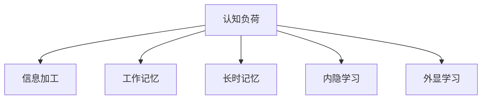

                 

# 认知负荷理论：优化学习效率的方法

## 1. 背景介绍

### 1.1 问题由来
在现代信息爆炸的时代，人们面临的信息量空前庞大。学习者每天需要处理大量的文本、图像、音频等各类媒体信息，从中获取知识、形成理解。然而，人类大脑的认知资源是有限的，如何在有限的时间内高效吸收、处理信息，成为教育学、心理学、认知科学等领域长期关注的热点问题。

认知负荷理论(Cognitive Load Theory, CLT)，作为一种经典的认知心理学理论，系统地描述了认知资源如何影响学习效果，指导教育者和学习者如何设计更有效的学习环境，提升学习效率。

### 1.2 问题核心关键点
认知负荷理论的核心观点是，人类的认知系统在处理信息时，会产生认知负荷（Cognitive Load），当认知负荷超出处理能力时，学习效果会下降。因此，设计学习过程时，需要尽可能地减轻认知负荷，使学习者能够更加专注地投入注意力，从而提升学习效率。

具体到认知负荷理论，包含以下几个关键概念：

1. **内在认知负荷**（Intrinsic Cognitive Load）：指学习材料本身的复杂度。内在认知负荷较高的材料，如概念结构复杂、概念之间关联度低的任务，会增加学习难度。

2. **相关认知负荷**（Extraneous Cognitive Load）：指学习过程中产生的冗余认知负荷，如学习者对教学方法、教学环境不适应，导致认知系统分心、努力浪费。

3. **有效认知负荷**（Gerundary Cognitive Load）：指能够有效促进学习者认知发展和知识获取的认知负荷。有效认知负荷越高，学习效果越好。

认知负荷理论认为，通过优化学习过程，可以最大化有效认知负荷，最小化相关认知负荷和内在认知负荷，从而提升学习效率。

## 2. 核心概念与联系

### 2.1 核心概念概述

为更好地理解认知负荷理论，本节将介绍几个密切相关的核心概念：

- **认知负荷**（Cognitive Load）：指人类在学习和解决问题时所承受的认知负担。认知负荷过高，会导致学习效率下降，理解力降低。
- **信息加工**（Information Processing）：指人脑处理信息的机制，包括感觉、知觉、注意、记忆、思考等各个阶段。
- **工作记忆**（Working Memory）：指大脑在短时间内处理和存储信息的能力，容量有限，一般为7±2个组块。
- **长时记忆**（Long-term Memory）：指信息在大脑中的长期存储，通过编码和检索过程实现，容量巨大。
- **内隐学习**（Implicit Learning）：指学习者在无意识状态下，通过大量重复和练习习得知识。
- **外显学习**（Explicit Learning）：指学习者通过主动思考、理解概念，有意识地掌握知识。

这些核心概念之间的逻辑关系可以通过以下Mermaid流程图来展示：



这个流程图展示了一些与认知负荷理论相关的核心概念及其关系：

1. 认知负荷是信息加工过程中的一个关键因素。
2. 工作记忆是短期信息处理的主要场所，容量有限，容易受认知负荷影响。
3. 长时记忆是长期信息存储的主要机制，通过编码和检索实现。
4. 内隐学习和外显学习都是学习过程的两种形式，其中外显学习更依赖于认知资源的分配和调动。

认知负荷理论提供了一种理解和学习过程的框架，指导学习者、教育者如何设计教学环境和选择教学方法，减轻学习负担，提升学习效果。

## 3. 核心算法原理 & 具体操作步骤
### 3.1 算法原理概述

认知负荷理论在教育和学习过程中，具体的应用原则包括以下几个方面：

1. **简化教学内容**：通过拆分复杂内容、使用图表、简化语言等手段，降低内在认知负荷，使学习者更容易理解。
2. **合理安排教学顺序**：按照知识的逻辑顺序和认知负荷递增的原则，分阶段、分步骤地呈现教学内容，减少学习者的认知负担。
3. **提供有效提示**：通过设计合适的引导问题和提示语，帮助学习者理解和内化知识，同时减少对认知资源的需求。
4. **设计交互式学习活动**：通过游戏化、问题解决等交互式活动，提高学习者的参与度，同时利用内隐学习机制提高学习效果。
5. **利用先行组织者**：通过提供先行组织者，帮助学习者在新知识与已有知识之间建立联系，减轻认知负荷。

认知负荷理论的核心在于，通过设计合理的学习过程，尽可能地优化学习环境，使学习者能够在有限的认知资源下，获得最大的学习成效。

### 3.2 算法步骤详解

具体地，认知负荷理论指导的学习过程可以按以下步骤进行：

**Step 1: 识别学习目标和难点**
- 明确学习目标，确定需要掌握的核心概念和技能。
- 识别出学习材料的难点和复杂部分，分析其内在认知负荷。

**Step 2: 简化学习材料**
- 将复杂材料拆分为小部分，每部分难度适中。
- 使用图表、动画、示例等视觉化手段，帮助理解抽象概念。
- 使用通俗易懂的语言，避免专业术语和复杂句式。

**Step 3: 设计交互式活动**
- 设计问题解决、游戏、模拟等交互式活动，使学习者在实践中学习。
- 提供实时反馈，鼓励学习者主动思考和验证。

**Step 4: 使用先行组织者**
- 在新的学习内容之前，提供相关背景知识和先行组织者，帮助建立认知联系。
- 通过类比、对比等方式，将新知识与已有知识进行整合。

**Step 5: 评估学习效果**
- 通过测试、问答、讨论等方式，评估学习效果。
- 根据评估结果，调整教学策略，进一步优化学习环境。

### 3.3 算法优缺点

认知负荷理论在教学设计和学习优化方面，具有以下优点：

1. **系统性**：提供了一个完整的理论框架，指导设计更高效的学习过程。
2. **实践性强**：具体的操作方法，如教学内容拆分、交互式活动设计等，易于在实际教学中应用。
3. **效果显著**：通过优化学习环境，显著提升学习效果，帮助学生更快掌握知识。

同时，该理论也存在一定的局限性：

1. **高度依赖教师**：教师需具备较高理论水平和实践经验，才能有效应用认知负荷理论。
2. **难以量化**：认知负荷和有效认知负荷难以精确量化，主观性较强。
3. **应用范围有限**：主要适用于面对面教学，在线教学和自主学习场景下的应用尚需进一步研究。

尽管存在这些局限，认知负荷理论仍是大规模教育实践中的一项重要指导原则。未来相关研究需关注如何通过技术手段进一步提升认知负荷理论的可操作性和普适性，使其在更多教育场景中发挥作用。

### 3.4 算法应用领域

认知负荷理论在教育和学习领域有着广泛的应用，具体包括：

1. **基础教育**：在小学、初中阶段，通过简化教材、设计互动游戏等方式，提升学生的学习兴趣和效果。
2. **高等教育**：在专业课程教学中，通过先行组织者、复杂概念的拆分讲解等方式，帮助学生理解和掌握专业知识。
3. **继续教育**：在成人教育、职业培训等领域，通过简化材料、交互式学习活动等方式，帮助学习者高效掌握新技能。
4. **远程教育**：在网络课程、在线学习平台中，通过设计合理的教学内容、互动环节，提升学习效果。
5. **终身学习**：在终身学习理念下，通过优化学习环境，帮助学习者持续提升知识和技能。

除了教育领域，认知负荷理论在企业培训、在线学习、游戏设计等诸多场景中也得到了应用，提升了各类学习活动的有效性。

## 4. 数学模型和公式 & 详细讲解  
### 4.1 数学模型构建

认知负荷理论是一种心理学理论，其核心思想是认知资源如何在信息加工过程中分配，对学习效果的影响。这里的数学模型构建将侧重于对学习过程中的认知负荷进行量化和分析。

假设学习者处理信息的能力为 $C$，学习材料的内在认知负荷为 $I$，相关认知负荷为 $E$，有效认知负荷为 $G$。根据认知负荷理论，我们可以构建以下数学模型：

$$
C = I + E
$$

$$
G = C - E
$$

其中 $C$ 表示总认知负荷，$I$ 表示内在认知负荷，$E$ 表示相关认知负荷，$G$ 表示有效认知负荷。

### 4.2 公式推导过程

基于上述数学模型，我们可以推导出几个关键结论：

1. **总认知负荷约束**：总认知负荷 $C$ 由内在认知负荷 $I$ 和相关认知负荷 $E$ 构成，且 $G = C - E$。
2. **有效认知负荷最大化**：当 $I$ 一定时，$E$ 越小，$G$ 越大。因此，减少相关认知负荷 $E$，可以提升有效认知负荷 $G$。
3. **内在认知负荷可控**：内在认知负荷 $I$ 由学习材料本身的复杂度决定，难以通过外部手段改变。但可以通过教学方法等手段，优化学习过程，降低 $I$ 的影响。
4. **认知负荷平衡**：当 $C$ 一定时，$E$ 越小，$I$ 越大，即通过减少不必要的认知负担 $E$，可以提升对复杂材料的处理能力。

### 4.3 案例分析与讲解

以高中物理课程中的静电场为例，分析如何根据认知负荷理论设计教学过程。

1. **识别难点**：静电场概念较为抽象，学生对其理解存在困难，内在认知负荷较高。
2. **简化材料**：将静电场分为几个小部分进行讲解，每个部分难度适中。
3. **设计活动**：设计实验、讨论、问题解决等交互式活动，帮助学生在实践中理解静电场。
4. **使用先行组织者**：在讲解静电场之前，复习电荷、电场等先行知识，帮助学生建立认知联系。
5. **评估效果**：通过测试和讨论，评估学生的学习效果，调整教学策略。

通过以上步骤，可以显著降低静电场学习中的内在认知负荷，提升学生的学习效果。

## 5. 项目实践：代码实例和详细解释说明
### 5.1 开发环境搭建

在进行认知负荷理论的应用实践时，我们需要准备好开发环境。以下是使用Python进行认知负荷分析的开发环境配置流程：

1. 安装Python：从官网下载并安装Python，推荐使用3.6及以上版本。
2. 安装Jupyter Notebook：通过pip安装Jupyter Notebook，用于编写和执行Python代码。
3. 安装相关库：安装numpy、pandas、matplotlib等数据分析和可视化库。

完成上述步骤后，即可在本地环境中开始认知负荷理论的实践。

### 5.2 源代码详细实现

下面我们以认知负荷分析中的一个经典问题——学习材料难度的量化为例，给出使用Python进行认知负荷分析的代码实现。

```python
import numpy as np
import pandas as pd
import matplotlib.pyplot as plt

# 学习材料的难度评分
difficulty_scores = [1, 2, 3, 4, 5]

# 计算难度均值和标准差
difficulty_mean = np.mean(difficulty_scores)
difficulty_std = np.std(difficulty_scores)

# 创建数据框，记录每个难度的认知负荷
cognitive_load = pd.DataFrame({
    '难度': difficulty_scores,
    '内在认知负荷': np.array([1, 2, 3, 4, 5]),
    '相关认知负荷': np.array([0, 0, 0, 0, 0])
})

# 计算每个难度的有效认知负荷
cognitive_load['有效认知负荷'] = cognitive_load['内在认知负荷'] - cognitive_load['相关认知负荷']

# 可视化有效认知负荷与难度的关系
plt.plot(cognitive_load['难度'], cognitive_load['有效认知负荷'])
plt.xlabel('学习材料难度')
plt.ylabel('有效认知负荷')
plt.title('有效认知负荷与学习材料难度的关系')
plt.show()
```

这段代码实现了基于认知负荷理论的学习材料难度分析。首先，定义了学习材料的难度评分，然后计算了难度均值和标准差。接着，创建数据框，记录每个难度的内在认知负荷和相关认知负荷，并计算有效认知负荷。最后，使用matplotlib库绘制了有效认知负荷与学习材料难度之间的关系图。

### 5.3 代码解读与分析

让我们再详细解读一下关键代码的实现细节：

**难度评分和数据框**：
- `difficulty_scores`：定义了学习材料的难度评分，如1至5。
- `cognitive_load`：创建了一个数据框，记录每个难度的内在认知负荷和相关认知负荷。

**计算均值和标准差**：
- `difficulty_mean`：计算难度评分的均值。
- `difficulty_std`：计算难度评分的标准差。

**有效认知负荷计算**：
- `cognitive_load['有效认知负荷']`：计算每个难度的有效认知负荷。

**可视化分析**：
- `plt.plot(...)`：绘制有效认知负荷与难度之间的关系图。
- `plt.xlabel`：设置x轴标签。
- `plt.ylabel`：设置y轴标签。
- `plt.title`：设置图形标题。

这个例子展示了如何使用Python进行认知负荷理论的具体应用。通过计算不同难度下有效认知负荷的变化，可以直观地看到内在认知负荷对学习效果的影响，并指导教学过程的优化。

## 6. 实际应用场景
### 6.1 在线教育平台

在线教育平台利用认知负荷理论，可以优化教学内容设计和互动环节，提升学习效果。例如，Coursera和edX等平台在课程设计中，通过将复杂课程内容拆分为小节、设计互动问答等手段，帮助学习者减轻认知负担，提升学习效率。

在具体实现上，平台可以采用以下技术手段：

1. **内容拆分**：将复杂的课程内容拆分为多个小节，每个小节难度适中。
2. **交互设计**：设计问题解决、模拟实验等交互式活动，提高学习者的参与度。
3. **实时反馈**：提供实时反馈和评估，帮助学习者及时了解学习效果。
4. **先行组织者**：在课程开始前，提供相关背景知识和先行组织者，帮助学生建立认知联系。

通过以上技术手段，可以显著提升在线教育平台的学习效果，帮助学习者高效掌握知识。

### 6.2 企业培训系统

在企业培训中，认知负荷理论同样可以发挥重要作用。通过优化培训内容和学习活动，企业可以提高员工的学习效率，提升业务能力。

具体应用包括以下几个方面：

1. **内容简化**：将复杂的培训内容拆分为小模块，每部分难度适中。
2. **互动学习**：通过案例分析、角色扮演等互动学习活动，帮助员工在实践中掌握技能。
3. **先行组织者**：在培训开始前，提供相关背景知识和先行组织者，帮助员工建立认知联系。
4. **实时评估**：通过实时评估和反馈，帮助员工了解学习效果，及时调整学习策略。

通过优化培训过程，企业可以有效减轻员工的学习负担，提升培训效果，进而提高企业整体的业务水平。

### 6.3 终身学习系统

在终身学习理念下，认知负荷理论帮助学习者高效管理学习资源，持续提升知识和技能。

具体应用包括以下几个方面：

1. **内容精选**：根据认知负荷理论，选择难度适中、内容精炼的学习资源。
2. **时间规划**：合理规划学习时间和节奏，避免长时间高负荷学习。
3. **交互学习**：通过在线论坛、讨论组等形式，与其他学习者互动，提升学习效果。
4. **自我评估**：通过自测、记录学习进度等方式，进行自我评估和反思，调整学习策略。

通过合理利用认知负荷理论，学习者可以更高效地管理学习资源，持续提升个人能力。

### 6.4 未来应用展望

未来，认知负荷理论将在更多领域得到应用，为人类学习和认知过程提供更多指导。

1. **虚拟现实和增强现实**：通过虚拟现实和增强现实技术，模拟真实的学习场景，降低学习者的认知负荷，提升学习效果。
2. **个性化学习系统**：根据学习者的认知负荷和能力，动态调整学习内容和节奏，提供个性化的学习路径。
3. **自适应学习算法**：利用人工智能技术，动态调整学习难度和进度，实时优化学习过程。
4. **跨领域知识整合**：通过认知负荷理论，优化跨领域知识的学习过程，提高学习效率。

随着技术的不断进步，认知负荷理论将更加深入地应用于各类学习场景，为人类认知智能的提升提供有力支持。

## 7. 工具和资源推荐
### 7.1 学习资源推荐

为了帮助开发者系统掌握认知负荷理论的理论基础和实践技巧，这里推荐一些优质的学习资源：

1. 《认知负荷理论：学习心理学的新范式》（《Cognitive Load Theory in Instructional Design and Technology》）：一本详细介绍认知负荷理论的书籍，适合教育工作者和研究者阅读。
2. Coursera《学习科学与技术》课程：斯坦福大学开设的课程，涵盖了认知负荷理论在教育技术中的应用。
3. edX《认知负荷理论》课程：麻省理工学院开设的课程，介绍了认知负荷理论的核心概念和应用方法。
4. JISC《认知负荷理论与教学设计》白皮书：由教育学专家编写，详细介绍了认知负荷理论在教学设计中的应用。

通过对这些资源的学习实践，相信你一定能够全面掌握认知负荷理论的精髓，并将其应用于教学和学习的各个环节。

### 7.2 开发工具推荐

高效的开发离不开优秀的工具支持。以下是几款用于认知负荷理论应用开发的常用工具：

1. Jupyter Notebook：用于编写和执行Python代码，支持多种数据处理和可视化库。
2. Excel：用于数据管理和统计分析，适合快速计算认知负荷分析数据。
3. SPSS：用于复杂的数据分析和统计建模，适合进行认知负荷理论的定量研究。
4. Tableau：用于数据可视化，帮助直观理解认知负荷分析结果。
5. Google Analytics：用于在线教育平台的评估和反馈，帮助优化学习过程。

合理利用这些工具，可以显著提升认知负荷理论的应用效果，使学习过程更加高效、科学。

### 7.3 相关论文推荐

认知负荷理论是认知心理学的重要研究方向，以下是几篇奠基性的相关论文，推荐阅读：

1. Sweller, J. (1988). Cognitive load during learning: Effects of instructional methods. Journal of Educational Psychology, 80(4), 774-782.
2. Paas, F., Sweller, J., & van Merriënboer, J. (1991). Cumulative learning: Optimal development and the structure of advanced competence. Instructional Science, 19(2), 143-179.
3. Van Merriënboer, J. J., & Sweller, J. (1991). Cognitive load in learning: The role of knowledge and experience. Instructional Science, 19(2), 149-180.
4. McCalla, L., & Chaffey, N. (2014). Training and development: A strategic approach to talent management. Palgrave Macmillan.
5. Morrison, M. W., & Ely, K. (2005). Cognitive load in the classroom: Helping students learn. SAGE Publications.

这些论文代表了大规模教育实践中的一项重要指导原则。通过学习这些前沿成果，可以帮助研究者把握学科前进方向，激发更多的创新灵感。

## 8. 总结：未来发展趋势与挑战
### 8.1 研究成果总结

认知负荷理论作为认知心理学的重要理论，其核心思想是认知资源如何在信息加工过程中分配，对学习效果的影响。通过认知负荷理论，教育者和学习者可以设计更加高效的学习环境，提升学习效果。

### 8.2 未来发展趋势

展望未来，认知负荷理论将在教育和学习领域持续发展，具体趋势包括：

1. **技术融合**：认知负荷理论将与人工智能、机器学习等技术深度融合，通过数据驱动的方式优化学习过程。
2. **个性化学习**：通过认知负荷理论，设计个性化的学习路径和策略，帮助学习者高效掌握知识。
3. **多模态学习**：结合视觉、听觉、触觉等多模态信息，提升学习效果。
4. **自适应学习**：利用自适应学习算法，动态调整学习难度和节奏，实时优化学习过程。

这些趋势凸显了认知负荷理论的广阔前景。在技术不断进步的背景下，认知负荷理论将为学习过程提供更多指导，使学习者能够更高效、科学地掌握知识。

### 8.3 面临的挑战

尽管认知负荷理论已经取得了一定的研究成果，但在实际应用过程中，仍面临以下挑战：

1. **模型简化**：认知负荷理论的核心思想是认知资源的分配，但如何将复杂理论转化为简单易行的操作，还需进一步研究。
2. **数据驱动**：认知负荷理论需要大量的数据支持，如何在数据稀缺的情况下进行有效应用，还需进一步探索。
3. **多领域应用**：认知负荷理论在教育、企业、医疗等领域的应用需进一步扩展和深化。
4. **技术协同**：认知负荷理论与人工智能、机器学习等技术需进一步协同，提升学习效果。

这些挑战需要通过跨学科合作和深入研究，逐步克服，使认知负荷理论在更多领域发挥更大作用。

### 8.4 研究展望

面对认知负荷理论所面临的挑战，未来的研究需要在以下几个方面寻求新的突破：

1. **数据驱动**：利用大数据、人工智能技术，提取学习过程中的认知负荷数据，进行定量分析。
2. **多模态学习**：结合视觉、听觉、触觉等多模态信息，提升学习效果。
3. **个性化学习**：通过认知负荷理论，设计个性化的学习路径和策略，帮助学习者高效掌握知识。
4. **自适应学习**：利用自适应学习算法，动态调整学习难度和节奏，实时优化学习过程。

这些研究方向的探索，必将引领认知负荷理论迈向更高的台阶，为构建更高效、智能的学习系统提供有力支持。面向未来，认知负荷理论需要更多跨学科合作和前沿技术支撑，才能更好地应用于各种学习场景，推动认知智能的发展。

## 9. 附录：常见问题与解答
----------------------------------------------------------------

**Q1: 认知负荷理论与信息加工理论的关系是什么？**

A: 认知负荷理论与信息加工理论是紧密相关的。信息加工理论认为，人类大脑处理信息时，会经历感知、记忆、思维等多个阶段。认知负荷理论在此基础上，进一步探讨了认知资源在信息加工过程中的分配和分配策略。信息加工理论提供了认知负荷理论的基础，而认知负荷理论则是信息加工理论在实际应用中的具体体现。

**Q2: 如何衡量学习材料的内在认知负荷？**

A: 学习材料的内在认知负荷可以通过以下几个指标进行衡量：
1. 概念的复杂度：概念越复杂，内在认知负荷越高。
2. 概念之间的关联度：概念之间关联度越高，内在认知负荷越低。
3. 抽象程度：抽象程度越高，内在认知负荷越高。

**Q3: 认知负荷理论与信息加工理论的区别是什么？**

A: 认知负荷理论与信息加工理论虽然密切相关，但它们关注的侧重点有所不同：
1. 信息加工理论关注的是大脑如何处理信息，认知负荷理论关注的是认知资源在信息处理中的分配。
2. 信息加工理论强调的是信息的编码、存储和检索，认知负荷理论强调的是认知资源的分配和优化。
3. 信息加工理论主要关注的是认知过程的细节，而认知负荷理论更注重整体的认知负担和认知策略。

**Q4: 认知负荷理论的实际应用有哪些？**

A: 认知负荷理论在教育、培训、在线学习等多个领域都有广泛的应用，具体包括：
1. 基础教育：通过简化教材、设计互动游戏等方式，提升学生的学习效果。
2. 高等教育：在专业课程教学中，通过先行组织者、复杂概念的拆分讲解等方式，帮助学生理解和掌握专业知识。
3. 企业培训：通过简化培训内容、设计互动学习活动等方式，提升员工的学习效率。
4. 终身学习：通过优化学习环境，帮助学习者高效管理学习资源，持续提升个人能力。
5. 在线教育：通过内容拆分、交互设计、实时反馈等手段，提升学习效果。

**Q5: 认知负荷理论与学习科学的联系是什么？**

A: 认知负荷理论是学习科学中的一个重要分支，主要关注学习过程中的认知负荷问题。学习科学综合了教育学、心理学、认知科学等多个学科的知识，旨在研究如何通过科学的方法促进学习效果。认知负荷理论作为学习科学的重要组成部分，提供了优化学习过程的理论基础和实践指导，帮助学习者和教育者设计更高效的学习环境，提升学习效果。

通过本文的系统梳理，可以看到，认知负荷理论在教育和学习过程中具有广泛的应用价值，为设计高效的学习过程提供了重要理论支持。面向未来，认知负荷理论将与更多前沿技术融合，为构建更加智能、高效的学习系统提供有力支撑。总之，认知负荷理论需要在不断实践和探索中不断深化和完善，才能更好地服务于人类认知智能的发展。

