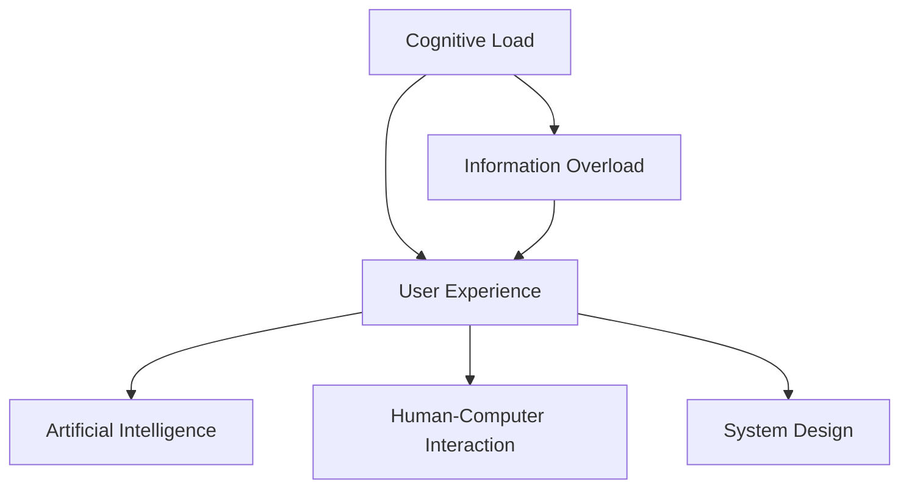

                 

# 认知负荷：信息过载时代的应对

> 关键词：认知负荷,信息过载,用户体验,人工智能,人机交互,系统设计

## 1. 背景介绍

### 1.1 问题由来

在信息技术飞速发展的今天，信息过载已经成为了人们日常生活和工作中的普遍现象。从社交媒体的爆炸式增长，到搜索引擎海量数据，再到各种智能设备和服务，每天都在产生巨量的信息。这不仅使得人们难以有效处理和吸收这些信息，还造成了严重的认知负荷，即个人或系统的信息处理能力与信息量之间的失衡状态。

### 1.2 问题核心关键点

认知负荷问题可以简单归纳为：信息量过多，而人类的信息处理能力有限，导致注意分散、记忆减退、决策困难等现象。如何有效地管理和缓解认知负荷，成为信息时代的一个重要课题。

本文旨在深入分析认知负荷的成因及应对策略，探讨人工智能技术在减少认知负荷中的潜力，并提出一些系统设计和人机交互方面的建议。

## 2. 核心概念与联系

### 2.1 核心概念概述

为更好地理解信息过载和认知负荷问题，本节将介绍几个密切相关的核心概念：

- **认知负荷(Cognitive Load)**：指个体在信息处理过程中所承受的心理负担，包括注意、记忆和思维等方面。

- **信息过载(Information Overload)**：指个体接收的信息量远远超过其处理能力，导致认知负荷过重，注意力分散，效率降低。

- **用户体验(User Experience, UX)**：指用户在使用产品或服务时的情感和满意度，用户体验的好坏直接影响用户的参与度和忠诚度。

- **人工智能(Artificial Intelligence, AI)**：指由计算机系统模拟人类智能行为的技术，如自然语言处理、机器学习等。

- **人机交互(Human-Computer Interaction, HCI)**：指人与计算机系统之间的交互方式，包括界面设计、交互模型等。

- **系统设计(System Design)**：指设计信息架构、用户界面、交互流程等，旨在提升系统的易用性和可访问性。

这些核心概念之间的逻辑关系可以通过以下Mermaid流程图来展示：



这个流程图展示了一系列概念之间的内在联系：认知负荷导致信息过载，进而影响用户体验。而人工智能技术和人机交互设计，可以辅助系统设计，从而提升用户体验，缓解认知负荷。

## 3. 核心算法原理 & 具体操作步骤
### 3.1 算法原理概述

认知负荷的缓解可以通过多种方式，包括主动减少信息输入、利用技术手段进行智能筛选、设计高效的用户界面等。本节将详细介绍基于人工智能的认知负荷缓解方法。

基于人工智能的认知负荷缓解方法主要包括以下几个步骤：

1. **数据清洗和预处理**：对原始数据进行清洗、去重、过滤等处理，减少无用的信息输入。
2. **智能筛选和推荐**：利用机器学习模型对信息进行分类、聚类和排序，推荐与用户兴趣相关的内容。
3. **信息可视化**：通过图表、地图等可视化工具，将复杂的信息转化为易于理解的形式。
4. **交互设计优化**：设计简洁明了、功能明确的交互界面，使用户能够快速找到所需信息。
5. **认知负荷评估**：采用心理实验和用户反馈，评估认知负荷水平，不断优化设计方案。

### 3.2 算法步骤详解

#### 数据清洗和预处理

数据清洗是认知负荷缓解的第一步，主要包括以下几个步骤：

1. **去重**：对重复的数据进行去重处理，减少数据量。
2. **过滤**：过滤掉无用或低价值的信息，保留关键内容。
3. **格式化**：对数据进行格式化处理，使其易于理解和分析。

例如，社交媒体数据清洗可以去除垃圾信息、重复发布内容、广告信息等，只保留用户真实情感和观点。

#### 智能筛选和推荐

智能筛选和推荐是利用人工智能技术进行信息过滤和个性化推荐的典型应用。其基本流程如下：

1. **特征提取**：从原始数据中提取有意义的特征，如关键词、情感倾向等。
2. **模型训练**：使用机器学习模型（如协同过滤、内容推荐、神经网络等）对特征进行训练，学习用户兴趣和信息相关性。
3. **推荐排序**：根据训练得到的模型，对信息进行排序和推荐，呈现给用户。

例如，Netflix通过协同过滤和内容推荐算法，为用户推荐个性化的电影和电视剧，显著提升了用户体验。

#### 信息可视化

信息可视化是将复杂的信息转化为直观、易懂的图表、图形等形式，减轻用户认知负荷的重要手段。其基本流程如下：

1. **数据转换**：将数据转换为图形格式，如散点图、柱状图、饼图等。
2. **交互设计**：设计交互界面，使用户能够方便地对图表进行操作和查询。
3. **反馈优化**：通过用户反馈，不断优化图表设计和交互方式。

例如，Tableau和Power BI等商业智能工具，可以帮助企业将海量数据转换为易于理解的可视化图表，支持决策和分析。

#### 交互设计优化

交互设计优化是减少认知负荷的关键步骤，主要包括以下几个方面：

1. **界面简化**：简化界面元素，去除冗余信息，只保留关键功能。
2. **操作便捷**：设计直观的操作方式，减少用户的操作步骤。
3. **反馈及时**：提供及时的反馈和提示，帮助用户理解操作结果。

例如，苹果公司的iOS系统采用了简洁明了的UI设计，大大降低了用户的认知负荷。

#### 认知负荷评估

认知负荷评估是通过心理实验和用户反馈，了解用户认知负荷水平，从而不断优化设计的流程。主要包括以下几个步骤：

1. **任务设计**：设计一系列认知负荷测试任务，如注意力测试、记忆测试、任务完成时间等。
2. **用户测试**：让用户在完成测试任务时，记录其认知负荷水平。
3. **数据分析**：对测试数据进行分析和统计，评估用户的认知负荷水平。
4. **反馈调整**：根据测试结果，调整系统设计，减轻用户的认知负荷。

例如，Google通过用户反馈和行为分析，不断优化搜索结果展示方式，降低用户的认知负荷。

### 3.3 算法优缺点

基于人工智能的认知负荷缓解方法具有以下优点：

1. **高效性**：利用机器学习模型进行自动筛选和推荐，能够快速处理大量信息，减轻用户认知负荷。
2. **个性化**：通过用户行为数据进行个性化推荐，提升用户体验。
3. **可扩展性**：算法模型和推荐系统可以不断扩展和优化，适应不同场景和用户需求。

同时，该方法也存在一定的局限性：

1. **数据依赖**：算法模型的性能依赖于高质量的数据，数据偏差可能影响推荐结果。
2. **隐私风险**：用户数据隐私保护问题需要充分考虑，避免数据滥用。
3. **复杂性**：算法模型和交互设计可能增加系统的复杂性，提升开发和维护成本。

尽管存在这些局限性，但就目前而言，基于人工智能的认知负荷缓解方法仍是最主流和有效的技术手段。未来相关研究的重点在于如何进一步降低数据依赖，提高算法的可解释性和隐私保护水平，同时兼顾复杂性和高效性。

### 3.4 算法应用领域

基于人工智能的认知负荷缓解方法在多个领域得到了广泛应用，例如：

- **社交媒体**：社交平台通过智能筛选和推荐，帮助用户过滤无用信息，减少信息过载。
- **在线广告**：广告平台根据用户行为数据，推送个性化广告，提升广告效果。
- **电子商务**：电商平台利用智能推荐和搜索优化，提升购物体验，降低用户认知负荷。
- **医疗健康**：医疗系统通过数据分析和可视化，帮助医生快速获取患者信息，减轻诊疗压力。
- **金融服务**：金融机构利用智能筛选和推荐，为用户提供个性化理财建议，降低投资风险。

除了上述这些经典领域外，人工智能技术还在更多场景中得到应用，如智能家居、智能交通、智慧城市等，为缓解信息过载提供了新的解决方案。

## 4. 数学模型和公式 & 详细讲解  
### 4.1 数学模型构建

为了更好地理解认知负荷的缓解方法，本节将使用数学语言对基于人工智能的认知负荷缓解方法进行更加严格的刻画。

记用户接收的信息量为 $I$，用户的信息处理能力为 $C$，认知负荷量为 $L$，则认知负荷的计算公式为：

$$
L = I - C
$$

如果 $L > 0$，则用户处于认知负荷过重状态。因此，认知负荷的缓解目标为最小化信息量 $I$，或最大化信息处理能力 $C$。

### 4.2 公式推导过程

下面推导智能筛选和推荐模型的基本数学模型。

假设用户接收的信息量为 $I$，信息处理能力为 $C$，用户对信息的理解和记忆能力为 $U$，信息的相关性为 $R$。则智能筛选和推荐的目标函数可以表示为：

$$
\min_{x} \quad \sum_{i=1}^N \max(0, x_i) + \sum_{i=1}^N \max(0, 1-x_i)R_i
$$

其中 $x_i$ 表示信息 $i$ 是否被推荐给用户，$R_i$ 表示信息 $i$ 的相关性权重。目标函数的第一部分是信息处理的成本，第二部分是信息理解的收益。

优化目标是最大化目标函数的收益，即最大化用户对信息的理解。通过求解上述优化问题，可以得到最优的信息推荐策略 $x^*$。

### 4.3 案例分析与讲解

以下通过一个简单的案例，解释如何利用人工智能技术缓解认知负荷。

假设某电商平台的商品推荐系统，接收了每日上亿条用户浏览记录 $I$，但用户实际处理能力 $C$ 有限。通过用户行为数据分析，平台可以识别出用户对不同商品类别和品牌的偏好，以及每条浏览记录的相关性 $R_i$。

1. **数据清洗和预处理**：去除重复记录、过滤广告信息，只保留真实购买意向的浏览记录。
2. **智能筛选和推荐**：利用协同过滤模型对用户行为数据进行分析，找出与用户兴趣相关的商品，并根据商品相关性排序，推荐给用户。
3. **信息可视化**：将推荐商品和浏览记录转换为图表形式，帮助用户快速查看推荐结果。
4. **交互设计优化**：简化推荐界面，只展示推荐商品和商品分类，减少用户操作步骤。
5. **认知负荷评估**：通过用户反馈和行为数据，评估推荐效果和认知负荷水平，不断优化推荐算法。

通过上述步骤，电商平台可以显著减轻用户的认知负荷，提升购物体验和满意度。

## 5. 项目实践：代码实例和详细解释说明
### 5.1 开发环境搭建

在进行认知负荷缓解方法的实践前，我们需要准备好开发环境。以下是使用Python进行TensorFlow开发的环境配置流程：

1. 安装Anaconda：从官网下载并安装Anaconda，用于创建独立的Python环境。

2. 创建并激活虚拟环境：
```bash
conda create -n tf-env python=3.8 
conda activate tf-env
```

3. 安装TensorFlow：根据CUDA版本，从官网获取对应的安装命令。例如：
```bash
conda install tensorflow -c pytorch -c conda-forge
```

4. 安装各类工具包：
```bash
pip install numpy pandas scikit-learn matplotlib tqdm jupyter notebook ipython
```

完成上述步骤后，即可在`tf-env`环境中开始项目实践。

### 5.2 源代码详细实现

这里我们以电商平台的商品推荐系统为例，给出使用TensorFlow对协同过滤算法进行实现的PyTorch代码实现。

首先，定义协同过滤算法的数学模型：

```python
import tensorflow as tf

# 用户-商品矩阵
user_item_matrix = tf.constant([[0, 0, 0, 0],
                              [0, 1, 1, 0],
                              [1, 1, 0, 0],
                              [0, 0, 0, 1]])

# 商品-商品矩阵
item_item_matrix = tf.constant([[1, 0, 0, 1],
                              [0, 1, 0, 0],
                              [0, 0, 1, 0],
                              [1, 0, 0, 1]])

# 用户-商品相关性矩阵
user_item_ratings = tf.constant([[4, 5, 3, 2],
                                [1, 2, 3, 4],
                                [3, 2, 1, 4],
                                [2, 1, 3, 4]])

# 模型参数
latent_factors = 10
num_epochs = 100
learning_rate = 0.01
batch_size = 128

# 定义协同过滤模型
user_embeddings = tf.Variable(tf.random.normal([len(user_item_matrix), latent_factors]))
item_embeddings = tf.Variable(tf.random.normal([len(item_item_matrix), latent_factors]))

def get_predictions(user_id, item_id):
    user_embedding = tf.nn.embedding_lookup(user_embeddings, user_id)
    item_embedding = tf.nn.embedding_lookup(item_embeddings, item_id)
    return tf.matmul(user_embedding, item_embedding, transpose_b=True)

# 损失函数和优化器
loss_fn = tf.keras.losses.mean_squared_error
optimizer = tf.keras.optimizers.Adam(learning_rate)

# 训练过程
for epoch in range(num_epochs):
    for batch in tf.data.Dataset.from_tensor_slices((user_item_matrix, item_item_matrix, user_item_ratings)).shuffle(batch_size).batch(batch_size):
        user_id, item_id, ratings = batch
        predictions = get_predictions(user_id, item_id)
        loss = loss_fn(predictions, ratings)
        optimizer.minimize(loss)

# 预测推荐结果
predictions = get_predictions(0, 2)
print(predictions)
```

接着，在实际应用中，我们需要设计完整的推荐系统，并进行多轮迭代优化，以提升推荐效果和用户满意度。

### 5.3 代码解读与分析

让我们再详细解读一下关键代码的实现细节：

**协同过滤算法**：
- 利用用户-商品矩阵、商品-商品矩阵和用户-商品相关性矩阵，构建协同过滤模型。
- 通过随机初始化用户和商品的潜在因子，构建低秩矩阵分解模型。
- 定义预测函数，计算用户对商品的评分预测。
- 定义损失函数和优化器，采用均方误差作为损失函数，Adam作为优化算法。
- 循环迭代训练模型，更新用户和商品的潜在因子。
- 输出预测评分，供推荐系统使用。

**推荐系统**：
- 在训练好的模型基础上，进行多轮迭代优化，调整模型参数，提升推荐效果。
- 利用模型预测评分，生成推荐商品列表，供用户选择。
- 收集用户反馈，评估推荐效果，不断优化模型。

**交互设计**：
- 设计简洁明了的推荐界面，只展示推荐商品和商品分类，减少用户操作步骤。
- 提供及时反馈，告知用户推荐理由和选择建议。
- 通过A/B测试，不断优化推荐界面和交互方式，提升用户体验。

通过上述步骤，电商平台的商品推荐系统可以显著减轻用户的认知负荷，提升购物体验和满意度。

## 6. 实际应用场景
### 6.1 智能客服系统

智能客服系统通过认知负荷缓解技术，可以显著提升用户的使用体验。在传统客服系统中，用户需要手动输入问题或选择菜单，容易产生认知负荷，导致用户体验下降。而智能客服系统通过自然语言处理和认知负荷缓解技术，可以实现智能问答和问题推荐，自动引导用户完成咨询过程，减轻用户的认知负担。

### 6.2 金融理财服务

金融理财服务需要处理海量数据，并提供个性化建议。通过认知负荷缓解技术，金融机构可以智能筛选和推荐相关金融产品，减轻用户的信息处理负担。例如，银行的理财产品推荐系统，通过智能筛选和推荐，帮助用户快速找到适合自己的产品，提升理财体验。

### 6.3 医疗健康咨询

医疗健康咨询需要处理大量病例和医疗知识，提供精准的诊疗建议。通过认知负荷缓解技术，医疗机构可以智能筛选和推荐相关病例和知识，减轻医生的认知负荷。例如，医院的智能诊断系统，通过智能筛选和推荐，帮助医生快速查找相关病例和知识，提高诊疗效率。

### 6.4 未来应用展望

随着人工智能技术的发展，基于认知负荷缓解技术的应用场景将不断扩展，为用户带来更好的体验。

在智慧城市治理中，智能交通系统通过认知负荷缓解技术，实时分析交通数据，提供最优路线推荐，减轻用户的信息处理负担。在工业自动化中，智能监控系统通过认知负荷缓解技术，实时监测设备状态，提供故障预警和维护建议，减轻操作人员的负担。在社交媒体中，智能推荐系统通过认知负荷缓解技术，智能筛选和推荐内容，提升用户体验。

## 7. 工具和资源推荐
### 7.1 学习资源推荐

为了帮助开发者系统掌握认知负荷缓解的理论基础和实践技巧，这里推荐一些优质的学习资源：

1. 《认知负荷与信息处理》系列书籍：由认知负荷研究领域的专家撰写，全面介绍了认知负荷的原理、评估方法和缓解策略。

2. 《人工智能在用户体验设计中的应用》课程：由用户体验专家开设的课程，详细讲解了人工智能技术在用户体验设计中的应用，涵盖认知负荷缓解、个性化推荐等多个方向。

3. 《TensorFlow实战》书籍：TensorFlow官方文档，详细介绍了TensorFlow的开发环境和使用方法，是TensorFlow开发的必备资料。

4. 《自然语言处理与认知负荷缓解》会议论文集：收录了大量相关领域的研究论文，展示了最新的认知负荷缓解方法和应用实例。

5. GitHub开源项目：包括认知负荷缓解技术的应用案例和代码实现，可以参考学习。

通过对这些资源的学习实践，相信你一定能够快速掌握认知负荷缓解的精髓，并用于解决实际的认知负荷问题。

### 7.2 开发工具推荐

高效的开发离不开优秀的工具支持。以下是几款用于认知负荷缓解开发的常用工具：

1. TensorFlow：基于Python的开源深度学习框架，灵活动态的计算图，适合快速迭代研究。

2. PyTorch：基于Python的开源深度学习框架，灵活性高，支持动态计算图，适合深度学习研究和开发。

3. Scikit-learn：Python的机器学习库，提供了多种常用的机器学习算法和数据处理工具。

4. Weights & Biases：模型训练的实验跟踪工具，可以记录和可视化模型训练过程中的各项指标，方便对比和调优。

5. Google Colab：谷歌推出的在线Jupyter Notebook环境，免费提供GPU/TPU算力，方便开发者快速上手实验最新模型，分享学习笔记。

合理利用这些工具，可以显著提升认知负荷缓解任务的开发效率，加快创新迭代的步伐。

### 7.3 相关论文推荐

认知负荷缓解技术的发展源于学界的持续研究。以下是几篇奠基性的相关论文，推荐阅读：

1. *Cognitive Load Theory and Learning*：认知负荷理论的奠基性论文，详细介绍了认知负荷的概念和影响因素。

2. *Information Overload and Cognitive Load*：研究信息过载和认知负荷关系的经典论文，提供了大量的实证数据和分析方法。

3. *Human-Computer Interaction and Cognitive Load*：研究人机交互和认知负荷关系的论文，提出了多种减轻认知负荷的交互设计策略。

4. *Artificial Intelligence and Cognitive Load*：研究人工智能技术在减轻认知负荷中的应用，展示了多种智能推荐和信息筛选方法。

5. *Cognitive Load and User Experience*：研究认知负荷对用户体验的影响，提供了优化用户体验的认知负荷缓解方法。

这些论文代表了大负荷缓解技术的发展脉络。通过学习这些前沿成果，可以帮助研究者把握学科前进方向，激发更多的创新灵感。

## 8. 总结：未来发展趋势与挑战

### 8.1 总结

本文对基于人工智能的认知负荷缓解方法进行了全面系统的介绍。首先阐述了认知负荷的成因及应对策略，明确了认知负荷在信息过载时代的广泛影响。其次，从原理到实践，详细讲解了认知负荷缓解的数学模型和算法步骤，给出了认知负荷缓解任务开发的完整代码实例。同时，本文还广泛探讨了认知负荷缓解方法在智能客服、金融理财、医疗健康等多个行业领域的应用前景，展示了认知负荷缓解技术的巨大潜力。

通过本文的系统梳理，可以看到，基于人工智能的认知负荷缓解方法正在成为信息处理的重要范式，极大地减轻了用户的信息处理负担，提升了用户体验。未来，伴随人工智能技术的发展，认知负荷缓解技术还将得到更深入的应用和优化，为构建人机协同的智能系统铺平道路。

### 8.2 未来发展趋势

展望未来，认知负荷缓解技术将呈现以下几个发展趋势：

1. **智能化程度提高**：利用机器学习和深度学习技术，实现更加精准的信息筛选和推荐，进一步减轻用户认知负荷。

2. **个性化服务增强**：通过用户行为数据分析，实现个性化推荐和智能交互，提升用户体验。

3. **多模态融合**：将视觉、语音、文本等多种模态信息进行融合，提供更加全面、准确的信息处理和推荐。

4. **人机协同优化**：结合人类和机器的优势，构建人机协同的信息处理系统，提高信息处理的效率和准确性。

5. **隐私保护强化**：在数据收集和处理过程中，加强隐私保护，避免数据滥用。

6. **跨领域应用推广**：将认知负荷缓解技术应用于更多领域，如医疗、教育、交通等，提升各行业的用户体验。

以上趋势凸显了认知负荷缓解技术的广阔前景。这些方向的探索发展，必将进一步提升用户体验，推动信息时代的智能化进程。

### 8.3 面临的挑战

尽管认知负荷缓解技术已经取得了显著成就，但在迈向更加智能化、普适化应用的过程中，它仍面临诸多挑战：

1. **数据隐私问题**：在数据收集和处理过程中，如何保护用户隐私，避免数据滥用，成为重要挑战。

2. **算法复杂性**：复杂的算法模型和推荐系统可能增加系统的复杂性，提升开发和维护成本。

3. **多模态融合困难**：不同模态信息的融合和协同处理，需要克服技术上的瓶颈，实现无缝集成。

4. **用户体验优化**：如何在复杂的多模态信息处理中，设计简洁明了、易用的用户界面，提升用户体验。

5. **跨领域应用困难**：将认知负荷缓解技术应用于不同领域时，需要考虑各领域的特殊需求和约束。

6. **人机协同问题**：如何在人机协同系统中，合理分配任务，优化人机交互方式，提升系统的整体性能。

这些挑战需要技术和社会多方面的努力，才能实现认知负荷缓解技术的普及和应用。只有从技术、伦理、社会等多个维度协同发力，才能真正实现认知负荷缓解技术的普适化和智能化。

### 8.4 研究展望

面对认知负荷缓解技术所面临的种种挑战，未来的研究需要在以下几个方面寻求新的突破：

1. **多模态信息融合**：将视觉、语音、文本等多种模态信息进行融合，提供更加全面、准确的信息处理和推荐。

2. **隐私保护技术**：在数据收集和处理过程中，加强隐私保护，避免数据滥用。

3. **人机协同系统**：构建人机协同的信息处理系统，提高信息处理的效率和准确性。

4. **智能化推荐系统**：利用机器学习和深度学习技术，实现更加精准的信息筛选和推荐，进一步减轻用户认知负荷。

5. **用户体验优化**：设计简洁明了、易用的用户界面，提升用户体验。

6. **跨领域应用推广**：将认知负荷缓解技术应用于更多领域，如医疗、教育、交通等，提升各行业的用户体验。

这些研究方向的探索，必将引领认知负荷缓解技术迈向更高的台阶，为构建智能、高效、可靠的人机交互系统铺平道路。面向未来，认知负荷缓解技术还需要与其他人工智能技术进行更深入的融合，如自然语言处理、计算机视觉、增强现实等，多路径协同发力，共同推动人机交互系统的进步。只有勇于创新、敢于突破，才能不断拓展认知负荷缓解技术的边界，让信息处理更加智能、高效。

## 9. 附录：常见问题与解答

**Q1：认知负荷缓解技术是否适用于所有用户？**

A: 认知负荷缓解技术适用于大多数用户，但不同用户的需求和场景各异。对于需要高精度处理复杂信息的用户，如医生、科学家等，单纯的信息筛选和推荐可能不足以解决问题。此时需要结合专业知识，设计更加定制化的解决方案。

**Q2：如何设计高效的认知负荷缓解算法？**

A: 设计高效的认知负荷缓解算法需要考虑多个因素：

1. **数据质量**：使用高质量的数据进行训练，避免数据偏差。
2. **算法模型**：选择合适的算法模型，如协同过滤、深度学习等。
3. **特征工程**：设计合适的特征提取和处理方式，提升模型性能。
4. **参数调优**：通过交叉验证等方法，不断调整模型参数，优化推荐效果。
5. **反馈机制**：利用用户反馈，不断优化算法，提升推荐精度。

例如，利用深度学习模型进行信息筛选和推荐，可以通过增强模型的可解释性和隐私保护技术，提升算法的可信度和用户接受度。

**Q3：如何平衡信息量与信息处理能力？**

A: 平衡信息量与信息处理能力是认知负荷缓解的核心问题。通过以下方法，可以有效缓解认知负荷：

1. **数据清洗**：去除无用或低价值的信息，减少信息量。
2. **智能筛选**：利用机器学习模型对信息进行筛选和推荐，提升信息相关性。
3. **信息可视化**：通过图表、地图等可视化工具，将复杂的信息转化为易于理解的形式。
4. **交互设计**：设计简洁明了、功能明确的交互界面，使用户能够快速找到所需信息。

例如，在智能推荐系统中，通过智能筛选和推荐，将大量信息压缩到用户最关心的几项中，减轻用户的信息处理负担。

**Q4：认知负荷缓解技术如何应用于智能客服系统？**

A: 智能客服系统通过认知负荷缓解技术，可以显著提升用户的使用体验。具体实现步骤如下：

1. **问题理解**：利用自然语言处理技术，分析用户输入的问题，提取关键信息。
2. **智能推荐**：根据用户的历史行为数据和当前问题，智能推荐答案或问题解决步骤。
3. **问题回答**：将推荐答案或步骤呈现给用户，自动回答问题。
4. **持续学习**：根据用户反馈，不断优化推荐模型，提升服务质量。

例如，智能客服系统可以通过问答机器人和智能推荐，自动回答用户问题，减轻用户的信息处理负担。

**Q5：认知负荷缓解技术如何应用于金融理财服务？**

A: 金融理财服务通过认知负荷缓解技术，可以显著提升用户体验和理财效率。具体实现步骤如下：

1. **数据收集**：收集用户的历史交易数据、风险偏好等信息。
2. **智能筛选**：利用机器学习模型对用户行为数据进行分析，找出与用户兴趣相关的金融产品。
3. **推荐生成**：根据用户行为数据和产品信息，生成个性化的推荐列表。
4. **用户反馈**：收集用户对推荐结果的反馈，不断优化推荐算法。

例如，金融理财服务可以通过智能推荐系统，帮助用户快速找到适合自己的理财产品，提升理财体验。

---

作者：禅与计算机程序设计艺术 / Zen and the Art of Computer Programming

