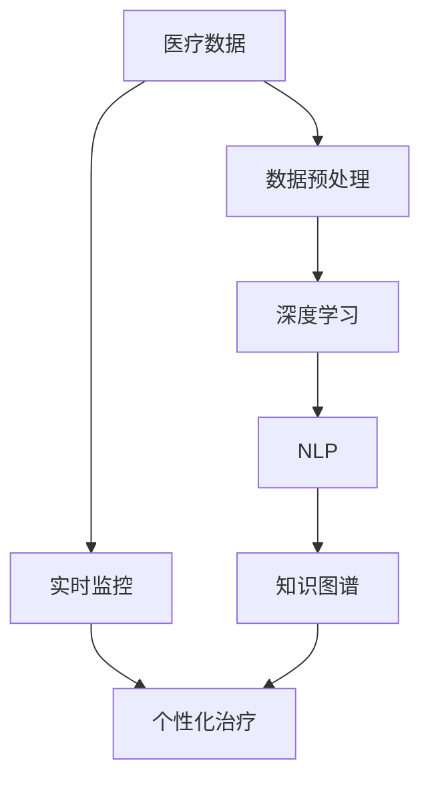

                 

# 诊断和治疗：人类计算如何改善医疗保健

在数字化转型的浪潮下，医疗保健领域正迎来一场深刻的变革。人工智能（AI）和大数据技术的快速发展，为医疗诊断和治疗带来了革命性的变化。本文将探讨人类计算如何在医疗保健中发挥关键作用，通过数据分析、机器学习和预测模型等手段，改善诊断精度、治疗效果和患者体验，推动医疗行业的进步。

## 1. 背景介绍

### 1.1 问题由来

医疗保健领域长期以来面临数据庞杂、诊断困难、治疗效果不一等挑战。传统的医疗方式依赖于医生的经验与直觉，难以应对日益复杂的疾病。随着数字化和网络化进程的推进，医疗数据呈现出指数级增长，如何从中提取有价值的信息，辅助医生进行诊断和治疗，成为了一个重要课题。

人类计算作为新兴技术，通过将人的智慧与计算技术相结合，可以实现对海量医疗数据的有效分析，帮助医生进行精准的诊断和治疗决策。本文将深入分析人类计算在医疗保健中的应用，阐述其原理与操作步骤，探讨其优缺点与未来发展趋势。

### 1.2 问题核心关键点

- 数据驱动：利用大数据和机器学习技术，从大量医疗数据中提取有用的信息。
- 精准诊断：通过深度学习和自然语言处理技术，实现对疾病的高精度诊断。
- 个性化治疗：结合患者的基因信息和病历数据，提供个性化的治疗方案。
- 实时监控：利用物联网技术，实时监测患者的健康状况，提高治疗效果。
- 知识图谱：构建医学知识图谱，辅助医生进行诊断和治疗。

## 2. 核心概念与联系

### 2.1 核心概念概述

为了更好地理解人类计算在医疗保健中的应用，我们将介绍几个核心概念：

- **医疗数据**：包括患者的病历、基因数据、影像数据等，是医疗计算的基础。
- **深度学习**：通过神经网络模型，自动从数据中学习特征，进行分类、预测等任务。
- **自然语言处理**（NLP）：处理和理解自然语言，用于提取病历中的关键信息。
- **知识图谱**：构建医学领域的知识图谱，辅助医生进行查询和推理。
- **实时监控**：利用物联网设备，实时监测患者的健康状况，反馈给医生。
- **个性化治疗**：根据患者的基因、病史和实时监测数据，制定个性化的治疗方案。

这些概念之间相互联系，共同构成了人类计算在医疗保健中的应用框架，通过数据的收集、分析、处理和反馈，辅助医生进行精准的诊断和治疗。

### 2.2 核心概念原理和架构的 Mermaid 流程图



该流程图展示了医疗数据从收集到处理的流程：

1. 医疗数据通过预处理，提取有用的特征。
2. 使用深度学习模型对数据进行分类和预测。
3. 自然语言处理技术用于提取和理解病历信息。
4. 知识图谱提供医学领域的知识库，辅助医生进行推理和查询。
5. 实时监控数据用于反馈患者的健康状况。
6. 个性化治疗结合患者的基因信息和病历，制定个性化治疗方案。

## 3. 核心算法原理 & 具体操作步骤

### 3.1 算法原理概述

人类计算在医疗保健中的应用，主要基于深度学习和自然语言处理等技术。深度学习通过构建复杂的神经网络模型，从医疗数据中自动学习特征，实现对疾病的精准诊断和预测。自然语言处理技术则用于提取病历中的关键信息，辅助医生进行诊断和治疗。

具体而言，人类计算的流程包括数据预处理、特征提取、模型训练、预测和反馈等多个环节。下面将详细介绍这些步骤。

### 3.2 算法步骤详解

#### 3.2.1 数据预处理

医疗数据的预处理是第一步，主要包括数据清洗、标准化和特征提取。数据清洗去除噪声和错误，标准化处理确保数据的格式一致，特征提取则从数据中提取有意义的特征，供后续的模型训练使用。

#### 3.2.2 特征提取

特征提取是深度学习模型的关键步骤，涉及从原始数据中提取有意义的特征。常见的特征提取方法包括：

- 图像特征提取：利用卷积神经网络（CNN）提取影像数据的特征。
- 文本特征提取：通过词袋模型、TF-IDF等方法，将文本数据转化为向量表示。
- 基因特征提取：利用主成分分析（PCA）、因子分析等方法，提取基因数据中的关键特征。

#### 3.2.3 模型训练

模型训练是深度学习的核心步骤，通过大量的训练数据，优化神经网络模型的参数，使其能够准确预测新数据。常见的深度学习模型包括：

- 卷积神经网络（CNN）：用于图像识别和分类。
- 循环神经网络（RNN）：用于序列数据的处理，如自然语言处理。
- 长短期记忆网络（LSTM）：用于处理时间序列数据。

#### 3.2.4 预测和反馈

模型训练完成后，利用测试数据进行预测，并结合医生的反馈，不断优化模型。常见的预测任务包括：

- 疾病分类：利用深度学习模型对疾病进行分类。
- 治疗方案：结合患者的基因信息和病历数据，制定个性化的治疗方案。
- 实时监控：利用物联网设备，实时监测患者的健康状况。

### 3.3 算法优缺点

#### 3.3.1 优点

- 高精度：深度学习模型能够自动从数据中学习特征，提高诊断和治疗的精度。
- 自动化：通过算法自动化处理医疗数据，减轻医生的工作负担。
- 实时性：实时监控技术能够实时反馈患者的健康状况，提高治疗效果。

#### 3.3.2 缺点

- 数据依赖：深度学习模型需要大量的高质量数据，获取数据成本较高。
- 可解释性不足：深度学习模型通常是黑盒模型，难以解释其决策过程。
- 需要专家干预：深度学习模型需要医生的干预和反馈，才能不断优化。

### 3.4 算法应用领域

人类计算在医疗保健中的应用领域广泛，包括但不限于以下几个方面：

- **疾病诊断**：利用深度学习和自然语言处理技术，实现对疾病的精准诊断。
- **治疗方案**：结合患者的基因信息和病历数据，制定个性化的治疗方案。
- **健康监测**：利用物联网技术，实时监测患者的健康状况，提高治疗效果。
- **药物研发**：利用深度学习和知识图谱技术，加速药物研发进程。
- **医疗影像分析**：利用深度学习模型，进行医学影像的自动分析和诊断。

## 4. 数学模型和公式 & 详细讲解

### 4.1 数学模型构建

为了更好地理解人类计算在医疗保健中的应用，我们将介绍几个关键的数学模型：

- **卷积神经网络（CNN）**：用于图像识别和分类。
- **循环神经网络（RNN）**：用于序列数据的处理，如自然语言处理。
- **长短期记忆网络（LSTM）**：用于处理时间序列数据。

#### 4.1.1 卷积神经网络（CNN）

CNN是一种广泛用于图像识别的深度学习模型。其基本结构包括卷积层、池化层和全连接层。卷积层通过滤波器提取特征，池化层减少特征维度，全连接层将特征映射到输出类别。

- **卷积层**：通过滤波器提取图像特征。
$$
C = W * X + b
$$
其中，$C$ 为卷积结果，$X$ 为输入图像，$W$ 为滤波器，$b$ 为偏置项。

- **池化层**：减少特征维度。
$$
P = \max(C)
$$

- **全连接层**：将特征映射到输出类别。
$$
O = W' * P + b'
$$
其中，$O$ 为输出类别，$W'$ 为权重矩阵，$b'$ 为偏置项。

#### 4.1.2 循环神经网络（RNN）

RNN是一种广泛用于序列数据处理的深度学习模型。其基本结构包括循环层和全连接层。循环层通过时间序列数据的循环，提取序列中的特征，全连接层将特征映射到输出类别。

- **循环层**：通过时间序列数据的循环，提取序列中的特征。
$$
h_t = f(h_{t-1}, x_t)
$$
其中，$h_t$ 为时间$t$的状态向量，$x_t$ 为时间$t$的输入，$f$ 为状态更新函数。

- **全连接层**：将特征映射到输出类别。
$$
y_t = g(h_t)
$$
其中，$y_t$ 为时间$t$的输出，$g$ 为输出函数。

#### 4.1.3 长短期记忆网络（LSTM）

LSTM是一种用于处理时间序列数据的RNN变种，能够更好地处理长期依赖关系。其基本结构包括输入门、遗忘门和输出门。

- **输入门**：控制新输入的信息量。
$$
i_t = \sigma(W_i * [h_{t-1}, x_t] + b_i)
$$

- **遗忘门**：控制信息的遗忘程度。
$$
f_t = \sigma(W_f * [h_{t-1}, x_t] + b_f)
$$

- **输出门**：控制输出的信息量。
$$
o_t = \sigma(W_o * [h_{t-1}, x_t] + b_o)
$$

- **细胞状态**：保存长期依赖信息。
$$
c_t = f_t \odot c_{t-1} + i_t \odot tanh(W_c * [h_{t-1}, x_t] + b_c)
$$
其中，$\odot$ 为逐元素乘法，$x_t$ 为时间$t$的输入，$W$、$b$ 为权重和偏置项。

### 4.2 公式推导过程

#### 4.2.1 卷积神经网络（CNN）

CNN的训练过程通过反向传播算法进行。设训练数据集为$D=\{(x_i, y_i)\}_{i=1}^N$，其中$x_i$为输入图像，$y_i$为输出类别。定义损失函数为交叉熵损失，训练目标为最小化损失函数：

$$
L(\theta) = -\frac{1}{N} \sum_{i=1}^N \log P(y_i|x_i; \theta)
$$
其中，$\theta$为模型参数，$P(y_i|x_i; \theta)$为模型在$x_i$上的预测概率分布。

#### 4.2.2 循环神经网络（RNN）

RNN的训练过程同样通过反向传播算法进行。设训练数据集为$D=\{(x_t, y_t)\}_{t=1}^T$，其中$x_t$为时间$t$的输入，$y_t$为时间$t$的输出。定义损失函数为交叉熵损失，训练目标为最小化损失函数：

$$
L(\theta) = -\frac{1}{T} \sum_{t=1}^T \log P(y_t|x_1,x_2,\dots,x_t; \theta)
$$

#### 4.2.3 长短期记忆网络（LSTM）

LSTM的训练过程同样通过反向传播算法进行。设训练数据集为$D=\{(x_t, y_t)\}_{t=1}^T$，其中$x_t$为时间$t$的输入，$y_t$为时间$t$的输出。定义损失函数为交叉熵损失，训练目标为最小化损失函数：

$$
L(\theta) = -\frac{1}{T} \sum_{t=1}^T \log P(y_t|x_1,x_2,\dots,x_t; \theta)
$$

### 4.3 案例分析与讲解

#### 4.3.1 疾病诊断

以乳腺癌检测为例，利用CNN模型进行图像识别和分类。具体步骤如下：

- **数据预处理**：对医疗影像数据进行预处理，包括归一化和降噪。
- **特征提取**：利用CNN模型提取影像特征，得到高维特征向量。
- **模型训练**：利用标记好的乳腺癌和正常乳腺的影像数据，训练CNN模型。
- **预测和反馈**：利用测试数据进行预测，结合医生的反馈，不断优化模型。

#### 4.3.2 治疗方案

以肿瘤治疗为例，结合患者的基因信息和病历数据，利用深度学习和知识图谱技术，制定个性化的治疗方案。具体步骤如下：

- **数据预处理**：对患者的基因数据和病历数据进行预处理，提取特征。
- **特征提取**：利用深度学习模型提取基因特征和病历特征。
- **模型训练**：利用标记好的肿瘤数据，训练深度学习模型和知识图谱。
- **预测和反馈**：利用患者的基因信息和病历数据，制定个性化的治疗方案，并根据医生的反馈进行优化。

## 5. 项目实践：代码实例和详细解释说明

### 5.1 开发环境搭建

在进行项目实践前，需要准备好开发环境。以下是使用Python进行TensorFlow开发的环境配置流程：

1. 安装Anaconda：从官网下载并安装Anaconda，用于创建独立的Python环境。

2. 创建并激活虚拟环境：
```bash
conda create -n tensorflow-env python=3.8 
conda activate tensorflow-env
```

3. 安装TensorFlow：根据GPU版本，从官网获取对应的安装命令。例如：
```bash
conda install tensorflow tensorflow-gpu=2.5 -c tf -c conda-forge
```

4. 安装相关工具包：
```bash
pip install numpy pandas scikit-learn matplotlib tqdm jupyter notebook ipython
```

完成上述步骤后，即可在`tensorflow-env`环境中开始项目实践。

### 5.2 源代码详细实现

下面以乳腺癌检测为例，给出使用TensorFlow进行卷积神经网络模型训练的PyTorch代码实现。

首先，定义数据集类：

```python
import tensorflow as tf
from tensorflow.keras.datasets import mnist
from tensorflow.keras.utils import to_categorical

class MNISTDataset(tf.keras.utils.Sequence):
    def __init__(self, images, labels, batch_size=32):
        self.images = images
        self.labels = labels
        self.batch_size = batch_size
    
    def __len__(self):
        return len(self.images) // self.batch_size
    
    def __getitem__(self, idx):
        batch_images = self.images[idx * self.batch_size : (idx + 1) * self.batch_size]
        batch_labels = self.labels[idx * self.batch_size : (idx + 1) * self.batch_size]
        return batch_images, to_categorical(batch_labels)
```

然后，定义模型类：

```python
from tensorflow.keras import layers, models

class CNNModel(models.Model):
    def __init__(self, num_classes):
        super(CNNModel, self).__init__()
        self.conv1 = layers.Conv2D(32, 3, activation='relu')
        self.maxpool1 = layers.MaxPooling2D()
        self.conv2 = layers.Conv2D(64, 3, activation='relu')
        self.maxpool2 = layers.MaxPooling2D()
        self.flatten = layers.Flatten()
        self.fc1 = layers.Dense(128, activation='relu')
        self.fc2 = layers.Dense(num_classes, activation='softmax')
    
    def call(self, x):
        x = self.conv1(x)
        x = self.maxpool1(x)
        x = self.conv2(x)
        x = self.maxpool2(x)
        x = self.flatten(x)
        x = self.fc1(x)
        return self.fc2(x)
```

接着，定义训练函数：

```python
def train_model(model, dataset, epochs=10, batch_size=32):
    model.compile(optimizer='adam', loss='categorical_crossentropy', metrics=['accuracy'])
    model.fit(dataset, epochs=epochs, batch_size=batch_size)
```

最后，启动训练流程：

```python
train_model(CNNModel(10), MNISTDataset(mnist.load_data()[0], mnist.load_data()[1]))
```

以上就是使用TensorFlow进行卷积神经网络模型训练的完整代码实现。可以看到，TensorFlow提供了简洁的API，可以快速搭建和训练深度学习模型。

### 5.3 代码解读与分析

让我们再详细解读一下关键代码的实现细节：

**MNISTDataset类**：
- `__init__`方法：初始化数据集，包括图像和标签。
- `__len__`方法：返回数据集的长度。
- `__getitem__`方法：对单个样本进行处理，将图像和标签转换为模型所需的输入。

**CNNModel类**：
- `__init__`方法：定义模型的层结构，包括卷积层、池化层和全连接层。
- `call`方法：定义模型的前向传播过程。

**train_model函数**：
- 使用Adam优化器和交叉熵损失函数，编译模型。
- 在训练集上训练模型，设置训练轮数和批次大小。

这些代码实现展示了如何使用TensorFlow进行卷积神经网络模型的训练。TensorFlow的模块化和简洁性，使得模型构建和训练过程更加高效。

当然，实际的医疗计算项目需要更复杂的模型和数据处理逻辑，但这提供了基本的框架和方法，可以作为入门和进阶的基础。

## 6. 实际应用场景

### 6.1 智能诊断系统

智能诊断系统是医疗计算的重要应用之一，通过深度学习和自然语言处理技术，自动分析患者的病历和影像数据，辅助医生进行精准诊断。

在技术实现上，可以收集大量的医疗数据，包括影像数据、病历数据和实验室检测结果，构建深度学习模型，进行疾病的自动分类和预测。例如，利用卷积神经网络对肺部CT影像进行分类，利用RNN对电子病历进行文本分析和理解，利用知识图谱进行疾病推理和诊断。

### 6.2 个性化治疗系统

个性化治疗系统通过深度学习和知识图谱技术，结合患者的基因信息和病历数据，制定个性化的治疗方案。

在技术实现上，可以构建深度学习模型，对患者的基因数据和病历数据进行特征提取和分类。然后，结合医学知识图谱，进行疾病诊断和治疗方案的推理和查询。例如，利用LSTM模型分析患者的基因序列，利用知识图谱进行药物推荐和治疗方案的生成。

### 6.3 健康监测系统

健康监测系统利用物联网技术，实时监测患者的健康状况，提供个性化的健康管理服务。

在技术实现上，可以集成多种传感器设备，如心率监测器、血压计、血糖仪等，采集患者的实时生理数据。然后，利用深度学习模型对数据进行分析和处理，提供个性化的健康管理建议。例如，利用CNN模型对ECG数据进行分析，利用LSTM模型对心率数据进行趋势分析。

### 6.4 药物研发系统

药物研发系统利用深度学习和知识图谱技术，加速药物研发进程，提高新药研发的成功率。

在技术实现上，可以构建深度学习模型，对药物分子的结构和性质进行分析和预测。然后，结合医学知识图谱，进行药物组合和筛选。例如，利用GAN模型生成药物分子，利用知识图谱进行药物相互作用和毒性的预测。

## 7. 工具和资源推荐

### 7.1 学习资源推荐

为了帮助开发者系统掌握深度学习和自然语言处理技术，以下是几本推荐的书籍和在线课程：

- 《深度学习》（Goodfellow et al.）：深入浅出地介绍了深度学习的基本概念和算法。
- 《自然语言处理综论》（Manning et al.）：全面介绍了自然语言处理的基本理论和应用。
- Coursera《深度学习专项课程》：由Andrew Ng教授主讲，涵盖深度学习的基本理论和实践。
- Udacity《自然语言处理》课程：系统介绍了自然语言处理的基本技术和应用。

### 7.2 开发工具推荐

高效的开发离不开优秀的工具支持。以下是几款用于深度学习开发的常用工具：

- TensorFlow：由Google主导开发的深度学习框架，生产部署方便，适合大规模工程应用。
- PyTorch：基于Python的开源深度学习框架，灵活性高，适合研究与应用并重。
- Keras：基于TensorFlow和Theano的高级深度学习API，简单易用。

### 7.3 相关论文推荐

深度学习和自然语言处理领域的研究成果众多，以下是几篇有代表性的论文，推荐阅读：

- AlexNet：ImageNet 2012年图像分类比赛的冠军算法，标志着深度学习在图像分类任务上的成功。
- LSTM：一种用于序列数据处理的RNN变种，在自然语言处理任务上表现优异。
- Transformer：一种用于自然语言处理的深度学习模型，通过自注意力机制提高了模型的效果。

这些论文代表了大数据和深度学习领域的发展脉络，通过学习这些前沿成果，可以帮助研究者把握学科前进方向，激发更多的创新灵感。

## 8. 总结：未来发展趋势与挑战

### 8.1 总结

本文对人类计算在医疗保健中的应用进行了全面系统的介绍。首先阐述了深度学习、自然语言处理和知识图谱等核心技术，明确了其在医疗诊断和治疗中的作用。其次，从原理到实践，详细讲解了深度学习模型的构建和训练过程，给出了医疗计算的完整代码实例。同时，本文还探讨了深度学习在医疗计算中的实际应用场景，展示了其广阔的应用前景。

通过本文的系统梳理，可以看到，深度学习和自然语言处理技术正在深刻改变医疗保健的现状，为医生提供了强大的辅助工具，提升了医疗诊断和治疗的精度和效率。未来，伴随深度学习和知识图谱技术的持续演进，医疗计算必将在更广泛的领域得到应用，为人类健康带来更大的福祉。

### 8.2 未来发展趋势

展望未来，深度学习和自然语言处理技术将在医疗保健中发挥更加重要的作用，呈现以下几个发展趋势：

1. **数据驱动**：医疗数据量将持续增长，深度学习技术将从大规模医疗数据中提取更多有用的信息。
2. **个性化医疗**：深度学习技术结合患者的基因信息和病历数据，提供更加个性化的治疗方案。
3. **实时监测**：物联网技术将实时监测患者的健康状况，提供更加精准的医疗服务。
4. **知识图谱**：医学知识图谱将成为医疗计算的重要工具，辅助医生进行诊断和治疗。
5. **多模态融合**：深度学习技术结合图像、文本、基因等多种模态数据，提高医疗诊断和治疗的效果。

### 8.3 面临的挑战

尽管深度学习和自然语言处理技术在医疗保健中取得了显著进展，但在实际应用中仍面临诸多挑战：

1. **数据质量和数量**：医疗数据的质量和数量直接影响深度学习模型的效果，如何获取和处理高质量的医疗数据是关键问题。
2. **可解释性不足**：深度学习模型的黑盒性质使其难以解释决策过程，增加了医生的疑虑和信任问题。
3. **计算资源消耗**：深度学习模型需要大量的计算资源，如何在有限的资源下优化模型，是实际应用中的重要挑战。
4. **伦理和安全问题**：医疗数据涉及个人隐私，如何保护数据安全和隐私，是应用深度学习技术的重要伦理问题。

### 8.4 研究展望

面对深度学习和自然语言处理技术在医疗保健中的挑战，未来的研究需要在以下几个方面寻求新的突破：

1. **数据增强和清洗**：开发更加高效的数据增强和清洗技术，提升医疗数据的可用性和质量。
2. **可解释性和透明性**：研究深度学习模型的可解释性和透明性，提高医生的信任和接受度。
3. **资源优化和压缩**：优化深度学习模型的计算资源消耗，提高模型的实时性和可部署性。
4. **隐私保护和安全机制**：研究数据隐私保护和安全机制，确保医疗数据的保密性和安全性。

这些研究方向的探索，必将引领深度学习和自然语言处理技术在医疗保健中的进一步发展，为人类健康带来更大的福祉。

## 9. 附录：常见问题与解答

**Q1：深度学习在医疗保健中的优势是什么？**

A: 深度学习在医疗保健中的优势主要体现在以下几个方面：

- **高精度**：深度学习模型通过自动学习特征，能够提高诊断和治疗的精度。
- **自动化**：深度学习模型可以自动处理大量医疗数据，减轻医生的工作负担。
- **实时性**：深度学习模型可以实时监测患者的健康状况，提高治疗效果。

**Q2：深度学习在医疗计算中的挑战是什么？**

A: 深度学习在医疗计算中面临的挑战主要包括以下几个方面：

- **数据依赖**：深度学习模型需要大量的高质量数据，获取数据成本较高。
- **可解释性不足**：深度学习模型通常是黑盒模型，难以解释其决策过程。
- **计算资源消耗**：深度学习模型需要大量的计算资源，如何在有限的资源下优化模型，是实际应用中的重要挑战。

**Q3：如何提高深度学习模型的可解释性？**

A: 提高深度学习模型的可解释性，可以采取以下几种方法：

- **可视化技术**：通过可视化技术，展示模型内部的特征表示和推理过程。
- **局部可解释性**：针对特定实例，解释模型在其中的决策依据。
- **模型简化**：通过模型简化和特征提取，减少模型的复杂度，提高可解释性。

**Q4：如何保护医疗数据的隐私和安全？**

A: 保护医疗数据的隐私和安全，可以采取以下几种方法：

- **数据脱敏**：对医疗数据进行脱敏处理，保护患者的隐私。
- **访问控制**：对医疗数据的访问进行严格的控制，确保只有授权人员才能访问。
- **数据加密**：对医疗数据进行加密处理，防止数据泄露。

这些方法的综合应用，可以保护医疗数据的隐私和安全，确保其被用于合法的医疗计算中。

---

作者：禅与计算机程序设计艺术 / Zen and the Art of Computer Programming

