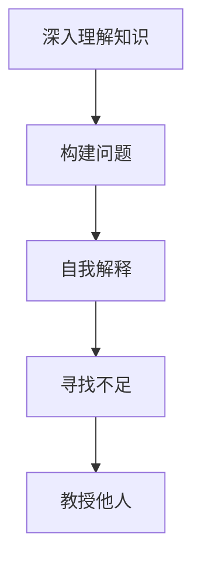

                 

# 费曼提问法：提升思考力和知识掌握

## 1. 背景介绍

### 1.1 问题由来
费曼提问法（Feynman Technique），又称为费曼学习法，由诺贝尔物理学奖得主理查德·费曼（Richard Feynman）提出。这一方法通过将复杂知识“反哺”到实践中去，加深对知识的理解和记忆，是提高学习和思考效率的有效工具。

在现代社会，知识和信息爆炸式增长，如何高效学习、准确理解、深度掌握，成为了每个学习者和知识工作者面临的挑战。费曼提问法正是在这样的背景下，应运而生，并得到广泛应用。它不仅能够帮助个人提升学习效率，还能促进组织内部的知识共享和创新。

### 1.2 问题核心关键点
费曼提问法的核心思想是通过构建简洁、具体的问题，将复杂抽象的概念转化为易于理解和记忆的形式，从而加深对知识的掌握。其核心步骤包括：
1. **深入理解知识**：选择某个概念或主题，深入学习，直至完全掌握。
2. **构建问题**：将学习到的知识转化为问题，使其具体化、可操作化。
3. **自我解释**：尝试回答自己构建的问题，验证理解是否正确。
4. **寻找不足**：在回答问题的过程中，发现并补充知识空白。
5. **教授他人**：将问题以简洁易懂的方式，向他人讲解，检验和巩固知识。

通过这一系列步骤，费曼提问法能够有效提升思考力和知识掌握度，被广泛应用于各领域的学习和工作中。

## 2. 核心概念与联系

### 2.1 核心概念概述

为了更好地理解费曼提问法，本节将介绍几个关键概念：

- **费曼学习法**：通过将复杂知识转化为具体问题，从而加深理解和记忆的方法。
- **概念掌握**：深入理解并能够清晰表达某一概念的能力。
- **简化表达**：将复杂问题简化，使其易于理解和回答。
- **反哺实践**：通过实际操作，加深对理论知识的理解，并将知识应用到实践中去。
- **创新思维**：在理解知识的基础上，探索新的解决思路和方法。

这些核心概念之间的逻辑关系可以通过以下Mermaid流程图来展示：



这个流程图展示了费曼提问法的基本步骤：
1. 首先对某个概念进行深入理解。
2. 将理解转化为具体问题，构建问题描述。
3. 尝试回答构建的问题，进行自我解释。
4. 在回答过程中发现不足，进行补充。
5. 通过教授他人，验证理解是否正确。

## 3. 核心算法原理 & 具体操作步骤

### 3.1 算法原理概述

费曼提问法本质上是一种深度学习方法，其核心原理是通过构建、回答和反思问题的过程，不断提升对知识点的理解深度和广度。它将学习过程分为三个阶段：理解、表达和验证。

1. **理解阶段**：通过阅读、听讲、观察等形式，深入理解某一概念或主题。
2. **表达阶段**：将理解转化为简洁具体的问题，并尝试回答这些问题。
3. **验证阶段**：通过回答问题的过程，发现理解上的不足，并进行补充，最终通过教授他人验证理解是否正确。

通过这三个阶段，费曼提问法能够将复杂的理论知识转化为易于理解和记忆的形式，从而加深对知识的掌握。

### 3.2 算法步骤详解

费曼提问法的具体操作步骤如下：

**Step 1: 选择一个主题或概念**
- 选择某个感兴趣或需要掌握的概念，例如计算机科学中的算法、人工智能中的模型训练等。

**Step 2: 深入理解知识**
- 通过阅读书籍、观看视频、参加课程等方式，深入学习所选主题，直至完全理解。

**Step 3: 构建问题**
- 将学习到的知识转化为具体问题，使其尽可能简洁明了。例如，“什么是机器学习？”可以转化为“机器学习有哪些应用？”、“机器学习模型有哪些？”等。

**Step 4: 自我解释**
- 尝试回答自己构建的问题，将答案记录下来。如果回答不清楚，再次深入理解该问题。

**Step 5: 寻找不足**
- 在自我解释过程中，发现理解上的不足，并查找相关资料进行补充。

**Step 6: 教授他人**
- 将问题以简洁易懂的方式，向他人讲解，检查自己的理解是否准确。如果他人不能理解，继续深入学习和改进。

**Step 7: 重复以上步骤**
- 重复以上步骤，直至对所选主题或概念有了深入理解和清晰表达。

### 3.3 算法优缺点

费曼提问法作为一种深度学习方法，具有以下优点：
1. **深度理解**：通过构建和回答问题的过程，能够深入理解复杂的理论知识。
2. **知识迁移**：通过将知识应用于不同情境，能够提高知识的广度。
3. **自我纠正**：通过反思和补充不足，能够不断优化知识结构和理解深度。

同时，该方法也存在一定的局限性：
1. **耗时耗力**：构建问题和自我解释的过程可能需要较长的时间和精力。
2. **主观性强**：问题构建和表达的合理性依赖于个人的理解深度和表达能力。
3. **实践限制**：对某些抽象概念，可能难以找到实际应用场景。

尽管存在这些局限性，但费曼提问法仍是一种有效的深度学习方法，能够显著提升学习和思考效率，值得广泛应用。

### 3.4 算法应用领域

费曼提问法不仅适用于学术研究和知识掌握，还广泛应用于多个领域：

- **教育培训**：教师可以通过构建具体问题，引导学生深入理解概念，提升课堂效果。
- **软件开发**：开发者可以通过构建技术问题，加深对新技术的理解，促进代码理解和优化。
- **项目管理**：管理者可以通过构建项目问题，明确目标和计划，提高团队协作和效率。
- **个人提升**：个人可以通过构建个人发展问题，提升自身技能和竞争力。

这些应用领域展示了费曼提问法的广泛适用性，能够帮助人们在多个场景下提高学习效果和思维能力。

## 4. 数学模型和公式 & 详细讲解 & 举例说明

### 4.1 数学模型构建

费曼提问法的数学模型主要涉及概念理解和问题构建。其核心数学模型为：

$$
\text{Understanding} = \text{Learn} + \text{Question Construction}
$$

其中，$\text{Understanding}$表示对概念的理解深度，$\text{Learn}$表示通过阅读、听讲等方式获取的知识，$\text{Question Construction}$表示通过构建具体问题进行深入理解。

### 4.2 公式推导过程

为了更好地理解费曼提问法的数学模型，下面将推导一个简单的数学公式：

假设我们要学习数学中的三角函数，我们首先需要深入理解正弦和余弦函数的定义和性质。然后，我们可以构建问题，例如：

1. 正弦和余弦函数的定义是什么？
2. 正弦和余弦函数的基本性质有哪些？

通过这些问题，我们可以加深对正弦和余弦函数的理解，并尝试回答这些问题。如果回答不清，可以再次深入学习相关内容。最后，通过教授他人，验证理解是否正确。

### 4.3 案例分析与讲解

以学习计算机科学中的算法为例，展示费曼提问法的应用过程：

**Step 1: 选择一个主题**
- 选择算法这一主题。

**Step 2: 深入理解知识**
- 通过阅读相关书籍和课程，深入理解算法的基本概念和分类。

**Step 3: 构建问题**
- 构建具体问题，例如：“什么是动态规划算法？”、“动态规划算法的时间复杂度是多少？”等。

**Step 4: 自我解释**
- 尝试回答这些问题，例如，“动态规划算法适用于哪些问题？”、“如何优化动态规划算法的时间复杂度？”

**Step 5: 寻找不足**
- 在自我解释过程中，如果发现理解不足，可以查找相关资料进行补充。

**Step 6: 教授他人**
- 将问题以简洁易懂的方式，向他人讲解，检查自己的理解是否准确。

**Step 7: 重复以上步骤**
- 重复以上步骤，直至对算法有了深入理解和清晰表达。

通过这一过程，我们不仅深入理解了算法的基本概念，还掌握了算法的应用和优化方法。

## 5. 项目实践：代码实例和详细解释说明

### 5.1 开发环境搭建

在实际应用费曼提问法时，通常不需要复杂的环境搭建，只需准备一些基本的工具和资源：

1. **文本编辑器**：如VSCode、Sublime Text等，用于记录问题和答案。
2. **电子笔记本**：如Notion、Evernote等，用于整理和反思学习过程。
3. **在线资源**：如Google Scholar、Coursera等，用于查找相关资料和视频。
4. **交流工具**：如Slack、Zoom等，用于与他人交流和分享学习心得。

### 5.2 源代码详细实现

以下是一个简化的费曼提问法应用示例，通过代码实现学习计算机科学中的算法：

```python
# 定义算法学习函数
def learn_algorithm():
    # 深入理解算法的基本概念和分类
    learn_about_dynamic_programming()
    learn_about_greedy_algorithm()
    learn_about_sorting_algorithm()
    
    # 构建具体问题
    questions = [
        "What is dynamic programming?",
        "What is the time complexity of dynamic programming?",
        "What is the application of dynamic programming?",
        "How to optimize the time complexity of dynamic programming?"
    ]
    
    # 自我解释
    self_explain = []
    for question in questions:
        self_explain.append(self_explain_question(question))
    
    # 寻找不足
    find_insufficiencies(self_explain)
    
    # 教授他人
    teach_others(self_explain)
    
# 深入理解算法函数
def learn_about_dynamic_programming():
    # 深入学习动态规划算法的基本概念和应用
    pass
    
# 构建具体问题函数
def self_explain_question(question):
    # 尝试回答构建的问题
    return self_explain_answer(question)
    
# 寻找不足函数
def find_insufficiencies(explanations):
    # 在解释过程中发现理解上的不足
    pass
    
# 教授他人函数
def teach_others(explanations):
    # 将问题以简洁易懂的方式，向他人讲解
    pass
```

### 5.3 代码解读与分析

在实际应用中，费曼提问法通常不需要复杂的代码实现，更多依赖于手工记录和反思。上述示例代码仅用于展示流程，实际应用中需根据具体情况进行调整和优化。

## 6. 实际应用场景

### 6.1 教育培训

在教育培训领域，费曼提问法能够显著提升学生的学习效果和理解深度。教师可以通过构建具体问题，引导学生深入理解概念，激发学生思考和探索的兴趣。例如，在物理课中，教师可以构建“什么是牛顿第三定律？”、“牛顿第三定律的数学表达式是什么？”等问题，引导学生深入理解和应用牛顿第三定律。

### 6.2 软件开发

在软件开发领域，费曼提问法能够帮助开发者深入理解新技术，提升代码质量和可维护性。开发者可以通过构建技术问题，加深对新技术的理解，促进代码理解和优化。例如，在学习机器学习时，开发者可以构建“什么是卷积神经网络？”、“卷积神经网络的结构是怎样的？”等问题，加深对卷积神经网络的理解，并应用于实际项目中。

### 6.3 项目管理

在项目管理领域，费曼提问法能够帮助管理者明确项目目标和计划，提高团队协作和效率。管理者可以通过构建项目问题，明确项目的关键点和任务分配。例如，在学习项目管理时，管理者可以构建“什么是敏捷开发？”、“敏捷开发的优势是什么？”等问题，明确敏捷开发的基本概念和应用场景，从而更好地管理项目。

### 6.4 个人提升

在个人提升领域，费曼提问法能够帮助个人提升自身技能和竞争力。个人可以通过构建个人发展问题，提升自身技能和知识水平。例如，在学习数据分析时，个人可以构建“什么是数据可视化？”、“数据可视化的应用场景有哪些？”等问题，提升数据分析的能力和应用范围。

## 7. 工具和资源推荐

### 7.1 学习资源推荐

为了帮助学习者系统掌握费曼提问法，以下是一些优质的学习资源：

1. **《费曼学习法》书籍**：一本全面介绍费曼学习法的书籍，详细讲解了费曼学习法的基本原理和操作步骤。
2. **Coursera《费曼学习法》课程**：由斯坦福大学开设的在线课程，讲解费曼学习法的理论基础和实际应用。
3. **YouTube《费曼学习法》视频**：在YouTube上可以找到许多关于费曼学习法的讲解视频，适合快速入门。
4. **博客文章**：在各大博客平台上，有许多关于费曼学习法的文章，提供实用的操作步骤和案例分析。

### 7.2 开发工具推荐

在应用费曼提问法时，通常不需要复杂的开发工具，但以下工具可以提升学习效率和体验：

1. **Notion**：一款电子笔记本工具，支持多种笔记格式，适合记录和整理学习过程。
2. **Evernote**：一款笔记应用，支持多设备同步，适合记录和分享学习心得。
3. **Slack**：一款团队沟通工具，支持实时交流和协作，适合与他人交流和分享学习心得。
4. **Zoom**：一款视频会议工具，支持远程学习和讨论，适合团队学习和交流。

### 7.3 相关论文推荐

以下是几篇关于费曼学习法的经典论文，推荐阅读：

1. **《The Feynman Technique: A Guide to Learning Anything Fast》**：介绍费曼学习法的理论基础和操作步骤。
2. **《The Learning Hypothesis: A Detailed Review of the Feynman Technique》**：对费曼学习法的理论进行详细分析，并提供实际应用案例。
3. **《A Critical Evaluation of the Feynman Technique》**：对费曼学习法的优缺点进行详细评价，并提出改进建议。

## 8. 总结：未来发展趋势与挑战

### 8.1 总结

费曼提问法作为一种深度学习方法，通过构建、回答和反思问题的过程，能够显著提升学习和思考效率，加深对知识点的理解。本文从原理到实践，详细讲解了费曼提问法的核心步骤和操作步骤，并通过示例展示了其应用过程。通过本文的系统梳理，可以看到，费曼提问法不仅适用于学术研究和知识掌握，还广泛应用于多个领域，能够帮助人们在多个场景下提高学习效果和思维能力。

### 8.2 未来发展趋势

展望未来，费曼提问法将呈现以下几个发展趋势：

1. **技术化**：随着技术的发展，费曼提问法将进一步优化，融入更多AI和机器学习技术，提高问题构建和自我解释的效率。
2. **社交化**：通过社交网络平台，将学习心得和问题分享给更多学习者，促进知识传播和交流。
3. **个性化**：根据学习者的兴趣和背景，生成个性化的学习路径和问题，提高学习效果。
4. **自动化**：开发智能学习助手，自动构建和回答问题，减少学习者的时间和精力投入。

这些趋势展示了费曼提问法的广阔前景，能够进一步提升学习和思考效率，为更多人提供深度学习的便利。

### 8.3 面临的挑战

尽管费曼提问法具有诸多优点，但在实际应用中也面临一些挑战：

1. **时间和精力投入**：费曼提问法需要花费大量时间和精力，可能不适合时间紧迫的场景。
2. **主观性强**：问题构建和表达的合理性依赖于个人的理解和表达能力，可能存在主观性较强的局限。
3. **反馈机制不足**：缺乏有效的反馈机制，可能导致学习效果不佳。

### 8.4 研究展望

面对费曼提问法面临的挑战，未来的研究需要在以下几个方面寻求新的突破：

1. **自动化问题构建**：开发智能算法，自动构建简洁具体的问题，减少学习者的时间和精力投入。
2. **智能反馈机制**：建立智能反馈系统，根据学习者的表现，提供个性化的反馈和建议。
3. **跨领域应用**：将费曼提问法应用于更多领域，如医学、法律、金融等，提升在这些领域的知识掌握度。

这些研究方向将进一步拓展费曼提问法的应用范围，提升学习效率和效果，为更多人提供深度学习的便利。

## 9. 附录：常见问题与解答

**Q1：费曼提问法适用于所有学科吗？**

A: 费曼提问法适用于大部分学科，特别是需要深入理解概念和理论的领域。但对于一些以技能训练为主的学科，如体育、音乐等，可能效果有限。

**Q2：费曼提问法是否适用于所有年龄段的学习者？**

A: 费曼提问法适用于所有年龄段的学习者，特别是成人学习者。通过深入理解问题，能够提高自主学习能力和问题解决能力。

**Q3：费曼提问法需要花费大量时间，如何提高效率？**

A: 可以通过自动化问题构建和智能反馈机制，提高学习效率。同时，可以与他人合作学习，互相补充不足，加速学习进程。

**Q4：费曼提问法的应用场景有哪些？**

A: 费曼提问法适用于教育培训、软件开发、项目管理、个人提升等多个领域，能够帮助学习者深入理解知识，提高学习效果和思维能力。

**Q5：费曼提问法是否适用于跨领域学习？**

A: 费曼提问法适用于跨领域学习，通过在不同领域构建问题，能够提升跨领域知识的理解和应用能力。

---

作者：禅与计算机程序设计艺术 / Zen and the Art of Computer Programming

