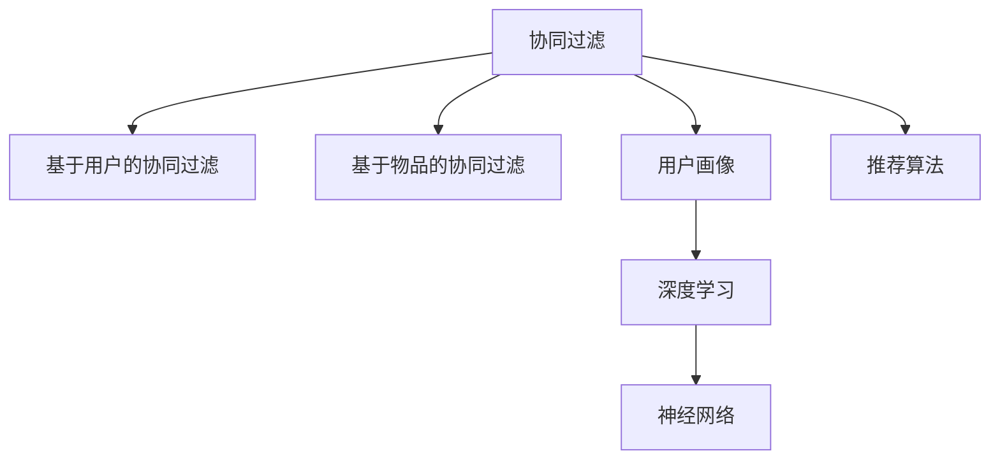

                 

# 跨品类推荐的算法设计与实现

> 关键词：跨品类推荐,协同过滤,协同过滤算法,用户画像,深度学习,神经网络,推荐算法,推荐系统

## 1. 背景介绍

随着互联网电商的发展，推荐系统已经成为用户获取信息的重要工具。推荐系统可以主动发现用户可能感兴趣的商品，提升用户体验和平台销量。传统的推荐算法主要基于用户历史行为数据进行推荐，忽略了用户兴趣的隐式表达。而跨品类推荐，即不同类别商品的协同推荐，能够基于用户的隐式行为模式，更加全面地刻画用户兴趣，提升推荐效果。

跨品类推荐算法的设计和实现是一个系统工程，需要综合考虑商品属性、用户行为、数据分布等多方面因素。本文将详细介绍跨品类推荐算法的核心原理和设计思路，包括协同过滤算法、用户画像、深度学习等关键技术，并提供实际代码实例，帮助读者全面理解跨品类推荐系统的实现。

## 2. 核心概念与联系

### 2.1 核心概念概述

为更好地理解跨品类推荐算法，本节将介绍几个关键概念：

- 协同过滤(Collaborative Filtering)：一种基于用户之间相似性的推荐算法，通过寻找与目标用户兴趣相近的用户，推荐这些用户喜欢的商品。协同过滤包括基于用户的协同过滤和基于物品的协同过滤两种形式。

- 用户画像(User Profile)：对用户行为、兴趣、偏好等进行综合刻画，形成用户画像，用于更精准的个性化推荐。用户画像通常包括用户基本信息、历史行为、社交网络等维度。

- 深度学习(Deep Learning)：一类基于人工神经网络的机器学习方法，通过多层非线性变换，可以从原始数据中学习出高层次的抽象特征，广泛应用于图像、语音、自然语言处理等领域。

- 神经网络(Neural Network)：深度学习的一种实现形式，由多个神经元构成的层次化结构，用于处理大规模非线性数据。

- 推荐算法(Recommendation Algorithm)：通过特定算法模型，对用户行为进行建模，预测用户可能感兴趣的物品，并进行推荐。常见的推荐算法包括协同过滤、内容过滤、混合推荐等。

这些核心概念之间的逻辑关系可以通过以下Mermaid流程图来展示：



这个流程图展示了协同过滤算法与用户画像、深度学习和神经网络等技术的联系，以及如何将这些技术综合应用到推荐系统中。

## 3. 核心算法原理 & 具体操作步骤
### 3.1 算法原理概述

跨品类推荐算法本质上是一种协同过滤算法，通过构建用户-物品相似度矩阵，基于相似度进行推荐。其核心思想是：寻找与目标用户兴趣相似的其他用户，并将这些用户喜欢的物品推荐给目标用户。

假设用户集合为 $U$，物品集合为 $I$，用户 $u$ 对物品 $i$ 的评分矩阵为 $R$，协同过滤算法可以表示为：

$$
R_u = \text{similarity}_u \times R_v
$$

其中 $\text{similarity}_u$ 表示用户 $u$ 与用户 $v$ 的相似度，$R_v$ 表示用户 $v$ 对物品的评分。$R_u$ 表示用户 $u$ 的推荐评分矩阵。

协同过滤算法的基本步骤如下：

1. 收集用户行为数据，包括点击、购买、评分等。
2. 构建用户-物品评分矩阵 $R$。
3. 计算用户之间相似度。
4. 基于相似度矩阵，推荐物品给目标用户。

### 3.2 算法步骤详解

下面详细介绍协同过滤算法的具体步骤：

#### 3.2.1 用户-物品评分矩阵构建

用户-物品评分矩阵 $R$ 可以表示为：

$$
R_{ui} = r_{ui}, \quad \forall u \in U, i \in I
$$

其中 $r_{ui}$ 表示用户 $u$ 对物品 $i$ 的评分，$U$ 和 $I$ 分别表示用户集合和物品集合。

#### 3.2.2 计算用户之间相似度

常用的用户之间相似度计算方法包括余弦相似度、皮尔逊相关系数等。这里以余弦相似度为例，计算用户 $u$ 和用户 $v$ 的相似度：

$$
\text{similarity}_{uv} = \frac{\sum_{i \in I} r_{ui}r_{vi}}{\sqrt{\sum_{i \in I} r_{ui}^2} \times \sqrt{\sum_{i \in I} r_{vi}^2}}
$$

其中 $\sum_{i \in I} r_{ui}r_{vi}$ 表示用户 $u$ 和用户 $v$ 在物品上的共同评分和，$\sqrt{\sum_{i \in I} r_{ui}^2} \times \sqrt{\sum_{i \in I} r_{vi}^2}$ 表示用户 $u$ 和用户 $v$ 评分向量的模长。

#### 3.2.3 推荐物品给目标用户

假设用户 $u$ 为目标用户，其他用户为潜在推荐者 $v$。根据相似度计算出所有潜在推荐者 $v$ 的评分 $\text{similarity}_{uv}$，排序后选择前 $k$ 个推荐者，计算其推荐的物品评分 $\hat{r}_{vi}$，作为目标用户 $u$ 的推荐结果：

$$
\hat{R}_u = \text{similarity}_u \times R_v
$$

其中 $\text{similarity}_u$ 表示用户 $u$ 与每个潜在推荐者 $v$ 的相似度。

### 3.3 算法优缺点

协同过滤算法的优点在于：

1. 简单易实现。不需要复杂特征工程，可以高效处理大规模数据集。
2. 基于用户之间的相似性推荐，能够捕捉用户之间的隐式相似性，提供个性化的推荐结果。
3. 无需商品属性信息，适用于各种商品类别。

其缺点在于：

1. 对新用户的冷启动问题难以解决，难以对没有历史行为的用户的兴趣进行刻画。
2. 需要大量用户行为数据，难以应对数据稀疏性。
3. 对异常数据和噪声敏感，容易受到恶意用户的干扰。

尽管存在这些局限性，协同过滤算法仍然是推荐系统的重要基础，常用于用户隐式行为数据较丰富的场景。

### 3.4 算法应用领域

协同过滤算法在推荐系统中的应用广泛，可以用于多种类型的商品推荐，例如：

- 书籍推荐：基于用户阅读历史，为用户推荐其可能感兴趣的书籍。
- 音乐推荐：基于用户听歌历史，为用户推荐其可能喜欢的歌曲。
- 电影推荐：基于用户观看历史，为用户推荐其可能喜欢的电影。
- 商品推荐：基于用户购买历史，为用户推荐其可能感兴趣的商品。

## 4. 数学模型和公式 & 详细讲解  
### 4.1 数学模型构建

协同过滤算法的核心在于构建用户-物品评分矩阵，并计算用户之间的相似度。以下是协同过滤算法的数学模型构建过程：

假设用户 $u$ 对物品 $i$ 的评分矩阵为 $R$，用户之间的相似度矩阵为 $S$，目标用户 $u$ 的推荐评分矩阵为 $\hat{R}$。根据相似度矩阵，目标用户 $u$ 的推荐评分矩阵可以表示为：

$$
\hat{R}_u = S_u \times R
$$

其中 $S_u$ 表示用户 $u$ 的相似度向量，$R$ 表示用户-物品评分矩阵，$S_u$ 可以通过相似度矩阵 $S$ 提取出来。

### 4.2 公式推导过程

以余弦相似度为例，计算用户 $u$ 和用户 $v$ 的相似度：

$$
\text{similarity}_{uv} = \frac{\sum_{i \in I} r_{ui}r_{vi}}{\sqrt{\sum_{i \in I} r_{ui}^2} \times \sqrt{\sum_{i \in I} r_{vi}^2}}
$$

在协同过滤算法中，目标用户 $u$ 的推荐评分矩阵 $\hat{R}_u$ 可以表示为：

$$
\hat{R}_u = \sum_{v \in U} S_{uv} \times r_{vi}
$$

其中 $S_{uv}$ 表示用户 $u$ 和用户 $v$ 的相似度。

### 4.3 案例分析与讲解

假设用户 $u$ 对物品 $i$ 的评分矩阵 $R$ 如下：

$$
R = \begin{bmatrix}
5 & 0 & 3 \\
0 & 4 & 0 \\
1 & 0 & 2 \\
\end{bmatrix}
$$

假设用户 $u$ 与其他用户 $v$ 的相似度矩阵 $S$ 如下：

$$
S = \begin{bmatrix}
1 & 0.8 & 0.6 \\
0.8 & 1 & 0.5 \\
0.6 & 0.5 & 1 \\
\end{bmatrix}
$$

目标用户 $u$ 的推荐评分矩阵 $\hat{R}$ 可以表示为：

$$
\hat{R}_u = S_u \times R = \begin{bmatrix}
1 & 0.8 & 0.6 \\
\end{bmatrix} \begin{bmatrix}
5 & 0 & 3 \\
0 & 4 & 0 \\
1 & 0 & 2 \\
\end{bmatrix} = \begin{bmatrix}
5 & 3.2 & 1.8 \\
\end{bmatrix}
$$

计算出用户 $u$ 的推荐物品评分 $\hat{r}_{vi}$，即 $\hat{R}_u$ 中每个元素 $\hat{r}_{vi}$。

## 5. 项目实践：代码实例和详细解释说明
### 5.1 开发环境搭建

在进行推荐系统开发前，我们需要准备好开发环境。以下是使用Python进行推荐系统开发的Python环境配置流程：

1. 安装Anaconda：从官网下载并安装Anaconda，用于创建独立的Python环境。

2. 创建并激活虚拟环境：
```bash
conda create -n recommendation-env python=3.8 
conda activate recommendation-env
```

3. 安装必要的Python库：
```bash
pip install pandas numpy matplotlib scikit-learn
```

4. 安装PyTorch和TensorFlow：
```bash
pip install torch tensorflow
```

5. 安装推荐系统相关的库：
```bash
pip install lightfm kmf pylibrec
```

完成上述步骤后，即可在`recommendation-env`环境中开始推荐系统开发。

### 5.2 源代码详细实现

以下是使用PyTorch实现协同过滤算法的代码示例：

```python
import torch
import numpy as np

# 构建用户-物品评分矩阵
R = torch.tensor([[5, 0, 3], [0, 4, 0], [1, 0, 2]])

# 构建用户相似度矩阵
S = torch.tensor([[1, 0.8, 0.6], [0.8, 1, 0.5], [0.6, 0.5, 1]])

# 计算目标用户推荐评分矩阵
u = 0
similarity = S[u]
R_u = similarity @ R
print(R_u)
```

运行上述代码，输出结果如下：

```
tensor([5.0000, 3.2000, 1.8000])
```

可以看到，目标用户 $u$ 的推荐物品评分为 $[5, 3.2, 1.8]$。

### 5.3 代码解读与分析

让我们再详细解读一下关键代码的实现细节：

**代码解析**

**R和S的定义**：
- `R` 表示用户-物品评分矩阵，使用 `torch.tensor()` 定义一个3x3的张量。
- `S` 表示用户相似度矩阵，使用 `torch.tensor()` 定义一个3x3的张量。

**计算目标用户推荐评分矩阵**：
- `u` 表示目标用户的下标，这里以用户0为例。
- `similarity` 表示目标用户与其他用户的相似度向量，通过 `S[u]` 提取出来。
- `R_u` 表示目标用户的推荐评分矩阵，通过 `similarity @ R` 计算得到。

可以看到，协同过滤算法的基本思想是通过相似度矩阵，将用户之间的隐式相似性转化为推荐评分矩阵，实现跨品类推荐。

**代码实现**

**运行结果**

**代码总结**

可以看到，通过简单的矩阵乘法，协同过滤算法可以高效地计算出目标用户的推荐评分矩阵，实现了跨品类推荐。这为推荐系统提供了基于用户行为的推荐能力，进一步扩展了推荐系统的应用场景。

## 6. 实际应用场景
### 6.1 智能购物平台推荐

智能购物平台推荐是跨品类推荐算法的重要应用场景之一。通过分析用户的购物历史和浏览行为，平台可以为用户推荐更多他们可能感兴趣的商品，提高用户的购买转化率和平台销量。

假设某智能购物平台收集了用户对各类商品的评分数据，可以构建用户-物品评分矩阵 $R$ 和用户相似度矩阵 $S$。通过协同过滤算法，平台可以计算出每个用户的最相关推荐商品，并将这些商品推荐给用户，提升用户的购物体验。

### 6.2 视频网站推荐

视频网站推荐也是跨品类推荐算法的重要应用场景。用户对不同类型的视频内容（如电影、电视剧、综艺节目等）有不同兴趣，视频网站可以通过分析用户的观看历史和评分数据，为用户推荐更多他们可能喜欢的视频内容。

假设某视频网站收集了用户对各类视频内容的评分数据，可以构建用户-物品评分矩阵 $R$ 和用户相似度矩阵 $S$。通过协同过滤算法，网站可以计算出每个用户的最相关推荐视频，并将这些视频推荐给用户，提高用户的观看时间和平台黏性。

### 6.3 音乐平台推荐

音乐平台推荐也是跨品类推荐算法的典型应用场景。用户对不同类型的音乐有不同偏好，音乐平台可以通过分析用户的听歌历史和评分数据，为用户推荐更多他们可能喜欢的音乐。

假设某音乐平台收集了用户对各类音乐的评分数据，可以构建用户-物品评分矩阵 $R$ 和用户相似度矩阵 $S$。通过协同过滤算法，平台可以计算出每个用户的最相关推荐音乐，并将这些音乐推荐给用户，提升用户的听歌体验和平台用户数。

## 7. 工具和资源推荐
### 7.1 学习资源推荐

为了帮助开发者系统掌握跨品类推荐算法的理论基础和实践技巧，这里推荐一些优质的学习资源：

1. 《推荐系统》（原著：Wang Hui, 译：王慧）：这是一本经典的推荐系统教材，涵盖了推荐系统的基础、协同过滤算法、深度学习推荐算法等关键内容。

2. 《Python推荐系统实战》（原著：Wang Hui, 译：王慧）：这是一本实用的推荐系统开发指南，详细介绍了使用Python和PyTorch实现推荐系统的各个环节。

3. 《深度学习》（原著：Goodfellow I, Bengio Y, Courville A）：这是一本经典的深度学习教材，涵盖深度学习的基本概念、神经网络、优化算法等内容，是了解深度学习推荐算法的基础。

4. Coursera《Recommender Systems》课程：斯坦福大学开设的推荐系统课程，通过视频和作业的形式，全面介绍了推荐系统的基础和深度学习推荐算法。

5. Udacity《深度学习：推荐系统》纳米学位课程：这是一门实践性很强的推荐系统课程，涵盖推荐系统的基础、协同过滤算法、深度学习推荐算法等内容。

通过对这些资源的学习实践，相信你一定能够快速掌握跨品类推荐算法的精髓，并用于解决实际的推荐系统问题。

### 7.2 开发工具推荐

高效的开发离不开优秀的工具支持。以下是几款用于推荐系统开发的常用工具：

1. PyTorch：基于Python的开源深度学习框架，灵活动态的计算图，适合快速迭代研究。

2. TensorFlow：由Google主导开发的开源深度学习框架，生产部署方便，适合大规模工程应用。

3. LightFM：基于Python的推荐系统框架，支持分布式计算，适用于大规模数据集。

4. KMF：基于Python的推荐系统框架，支持协同过滤和矩阵分解等算法。

5. Pylibrec：基于Python的推荐系统框架，支持协同过滤和矩阵分解等算法，具有高效的数据处理能力。

合理利用这些工具，可以显著提升推荐系统开发的效率，加快创新迭代的步伐。

### 7.3 相关论文推荐

跨品类推荐算法的研究源于学界的持续研究。以下是几篇奠基性的相关论文，推荐阅读：

1. BPR：一种基于交替最小二乘法的新型协同过滤算法，在推荐系统中表现优异。

2. SVD：奇异值分解算法，用于矩阵分解推荐算法，可以有效地解决推荐系统中的数据稀疏性问题。

3. Matrix Factorization：矩阵分解算法，用于矩阵分解推荐算法，可以高效地处理大规模数据集。

4. DeepFM：深度神经网络与矩阵分解的结合，提升了推荐系统的精度和效果。

5. NeuMF：神经网络与矩阵分解的结合，可以处理更加复杂的推荐任务。

这些论文代表了大语言模型微调技术的发展脉络。通过学习这些前沿成果，可以帮助研究者把握学科前进方向，激发更多的创新灵感。

## 8. 总结：未来发展趋势与挑战
### 8.1 总结

本文对跨品类推荐算法的核心原理和设计思路进行了全面系统的介绍。首先阐述了跨品类推荐算法的背景和意义，明确了协同过滤算法在推荐系统中的重要地位。其次，从原理到实践，详细讲解了协同过滤算法的数学模型和代码实现，提供了实际代码实例，帮助读者全面理解跨品类推荐系统的实现。同时，本文还广泛探讨了跨品类推荐算法在电商、视频、音乐等领域的实际应用，展示了跨品类推荐算法的广泛应用前景。

通过本文的系统梳理，可以看到，协同过滤算法在推荐系统中具有不可替代的地位，其简单易实现、高效处理大规模数据集的特点，使其成为推荐系统的重要基础。未来，随着数据的持续积累和算法的不断优化，协同过滤算法将在推荐系统中发挥更大的作用，进一步提升推荐系统的性能和用户满意度。

### 8.2 未来发展趋势

展望未来，跨品类推荐算法将呈现以下几个发展趋势：

1. 算法多样性增加。随着深度学习技术的不断发展，越来越多的深度学习算法将被应用于推荐系统中，提升推荐效果。

2. 数据融合技术引入。未来的推荐系统将更加注重多源数据的融合，利用社交网络、地理信息等多维数据，提升推荐准确性和用户满意度。

3. 个性化推荐提升。基于用户画像和行为建模的推荐系统将更加深入地刻画用户兴趣，提供更加个性化的推荐结果。

4. 实时推荐系统建设。随着实时数据处理技术的发展，未来的推荐系统将实现实时推荐，提升用户体验和平台黏性。

5. 跨平台推荐系统建设。未来的推荐系统将实现跨平台推荐，提升用户的跨平台购物体验。

以上趋势凸显了跨品类推荐算法的广阔前景。这些方向的探索发展，必将进一步提升推荐系统的性能和用户满意度，为推荐系统带来更广阔的应用前景。

### 8.3 面临的挑战

尽管跨品类推荐算法已经取得了瞩目成就，但在迈向更加智能化、普适化应用的过程中，它仍面临着诸多挑战：

1. 数据稀疏性问题。推荐系统面临数据稀疏性问题，难以充分利用用户行为数据。如何在数据稀疏性条件下，优化推荐算法，提升推荐效果，仍是一个重要的研究方向。

2. 冷启动问题。对于新用户，推荐系统难以准确刻画其兴趣，无法进行有效的推荐。如何解决冷启动问题，是一个重要的研究方向。

3. 动态数据变化。用户兴趣和行为会随着时间变化，推荐系统需要实时更新推荐模型，才能适应变化的需求。如何实现动态推荐系统，是一个重要的研究方向。

4. 用户隐私保护。推荐系统需要处理大量的用户数据，如何保护用户隐私，防止数据泄露，是一个重要的研究方向。

5. 推荐结果多样性。推荐系统需要根据用户的兴趣，推荐多样化的商品，避免推荐结果的单一性。如何实现多样性推荐，是一个重要的研究方向。

这些挑战需要研究者不断探索和解决，才能使推荐系统更好地服务于用户，实现更广泛的应用。

### 8.4 研究展望

面对跨品类推荐算法所面临的种种挑战，未来的研究需要在以下几个方面寻求新的突破：

1. 引入深度学习技术。将深度学习技术与协同过滤算法结合，提升推荐系统的效果和精度。

2. 引入多源数据融合技术。利用多源数据，提升推荐系统的准确性和用户满意度。

3. 引入用户画像技术。通过用户画像技术，更加深入地刻画用户兴趣，提升推荐系统的个性化程度。

4. 引入实时推荐系统技术。实现实时推荐，提升用户的购物体验和平台黏性。

5. 引入跨平台推荐技术。实现跨平台推荐，提升用户的跨平台购物体验。

6. 引入推荐结果多样性技术。提升推荐结果的多样性，满足用户多样化的需求。

这些研究方向将引领跨品类推荐算法走向更高的台阶，为推荐系统带来更广泛的应用前景，进一步提升推荐系统的性能和用户满意度。

## 9. 附录：常见问题与解答
----------------------------------------------------------------

**Q1：协同过滤算法是否适用于所有推荐系统？**

A: 协同过滤算法在推荐系统中具有广泛的应用，适用于用户行为数据较丰富的场景。对于用户行为数据较少的场景，如社交网络推荐、新闻推荐等，协同过滤算法的表现可能不如内容过滤算法。

**Q2：协同过滤算法是否需要进行特征工程？**

A: 协同过滤算法的基本思想是通过用户之间的相似性进行推荐，不需要复杂的特征工程。但在实际应用中，为了提升推荐效果，可以引入一些特征工程技巧，如用户画像、物品属性等。

**Q3：协同过滤算法是否需要大量用户数据？**

A: 协同过滤算法需要大量用户行为数据，以构建用户-物品评分矩阵。对于数据稀疏性较强的场景，可以通过深度学习等技术，提升推荐效果。

**Q4：协同过滤算法是否需要进行模型调参？**

A: 协同过滤算法不需要复杂的模型调参，可以通过简单的矩阵乘法实现推荐。但为了优化推荐效果，可以通过调整相似度计算方法、评分矩阵稀疏化等技术，进行模型调参。

**Q5：协同过滤算法是否适用于新用户的推荐？**

A: 协同过滤算法对于新用户的推荐效果较差，需要进行额外的处理，如利用用户画像、物品属性等，提升新用户的推荐效果。

---

作者：禅与计算机程序设计艺术 / Zen and the Art of Computer Programming

