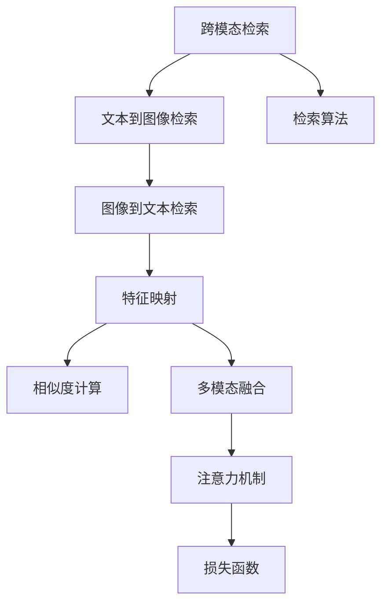
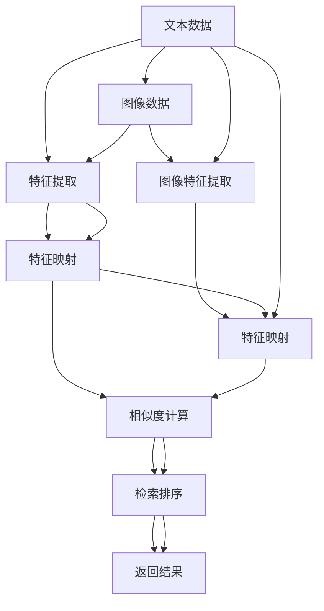

                 

# 跨模态检索：文本到图像、图像到文本的匹配技术

> 关键词：跨模态检索, 文本到图像, 图像到文本, 匹配技术, 特征提取, 相似度计算, 注意力机制, 损失函数, 项目实践

## 1. 背景介绍

### 1.1 问题由来
随着深度学习技术的飞速发展，跨模态信息检索技术在计算机视觉与自然语言处理（CV-NLP）领域取得了巨大进展。跨模态检索不仅可以将两种不同模态的信息进行关联匹配，还能在图像、文本等异构数据间实现有效的信息交互和知识共享，为很多应用场景带来革命性的变革。例如，在电商、新闻、娱乐等社交网络中，用户可以借助文本检索图片，或者根据图片检索相关文本。这种技术正在被广泛应用于智能推荐、内容理解、图像标注、医疗影像分析等多个领域。

然而，由于不同模态之间的语义鸿沟以及特征表示的不匹配，使得文本到图像和图像到文本的检索仍然存在较大挑战。目前，传统的特征提取方法和简单的相似度计算难以实现高精度的检索。为了解决这些问题，跨模态检索技术的研究在近几年得到了快速发展，产生了许多创新方法。本文将系统性地介绍跨模态检索中的文本到图像和图像到文本的匹配技术，并结合最新的研究成果，探讨未来研究方向与挑战。

### 1.2 问题核心关键点
跨模态检索的本质是使用深度学习模型在不同模态之间建立一种多模态的表示，使得不同模态的数据可以相互理解并实现匹配。核心目标是将文本与图像的特征进行转换和映射，使文本特征和图像特征在高维特征空间中具有相似性。具体的关键点包括：

1. **特征映射**：如何将文本和图像的原始数据转换成易于匹配的向量表示。
2. **相似度计算**：如何设计高效的相似度计算方法，使得文本和图像特征之间的距离或者相似性可以被准确量化。
3. **多模态融合**：如何将多模态的特征表示融合起来，实现多模态的联合建模。
4. **损失函数设计**：如何设计合适的损失函数，使得模型在多模态的联合训练中，可以最大化地提升检索性能。
5. **检索算法**：如何将检索模型嵌入到实际的应用中，高效地实现查询结果的排序和召回。

这些关键点相互交织，决定了跨模态检索的效果和实用性。以下将依次详细介绍每个关键点，并结合最新的研究进展，进行深入分析和探讨。

## 2. 核心概念与联系

### 2.1 核心概念概述

在介绍跨模态检索中的文本到图像、图像到文本匹配技术之前，首先需要理解几个核心概念：

- **跨模态检索（Cross-Modal Retrieval）**：将不同模态的数据进行关联匹配，使得一种模态的数据能够被另一种模态识别和理解。
- **文本到图像检索（Text-to-Image Retrieval）**：通过文本描述检索出对应的图像。
- **图像到文本检索（Image-to-Text Retrieval）**：通过图像内容检索出相应的文本描述。
- **特征映射（Feature Mapping）**：将不同模态的数据转换成相同的特征表示，使得它们能够在同一空间中实现匹配。
- **相似度计算（Similarity Metric）**：用于衡量不同特征之间的距离或相似性，常见的相似度度量方法有余弦相似度、欧式距离、KL散度等。
- **多模态融合（Multi-modal Fusion）**：将不同模态的特征表示进行融合，以实现更为丰富的语义理解。
- **注意力机制（Attention Mechanism）**：用于在多模态融合过程中，选择重要的特征进行权重分配。

以上概念通过下图的Mermaid流程图进行直观展示：



其中：

- **A** 为跨模态检索的核心概念，包含了文本到图像和图像到文本的检索。
- **B** 和 **C** 分别对应文本到图像和图像到文本的检索。
- **D** 为特征映射过程，是文本和图像特征转换的桥梁。
- **E** 为相似度计算，用于衡量特征之间的相似性。
- **F** 为多模态融合，将不同模态的特征进行融合。
- **G** 为注意力机制，选择重要的特征进行权重分配。
- **H** 为损失函数，用于优化多模态特征的匹配。
- **I** 为检索算法，用于检索过程中的排序和召回。

### 2.2 核心概念原理和架构的 Mermaid 流程图

以下是详细的Mermaid流程图，展示了文本到图像和图像到文本检索的关键步骤：



## 3. 核心算法原理 & 具体操作步骤

### 3.1 算法原理概述

跨模态检索中的文本到图像和图像到文本的匹配技术，主要基于深度学习模型，通过学习文本和图像的联合表示，来实现不同模态特征的转换和匹配。具体步骤如下：

1. **特征提取**：使用预训练的文本和图像特征提取器（如CNN和Transformer），将文本和图像转换成高维向量表示。
2. **特征映射**：通过映射函数将文本和图像的特征表示进行转换，使得它们能够在同一空间中实现匹配。
3. **相似度计算**：使用相似度度量方法，衡量文本和图像特征之间的距离或相似性。
4. **多模态融合**：通过注意力机制选择重要的特征进行融合，实现多模态的联合建模。
5. **损失函数设计**：设计合适的损失函数，最大化地提升检索性能。
6. **检索算法**：将检索模型嵌入到实际的应用中，高效地实现查询结果的排序和召回。

### 3.2 算法步骤详解

接下来详细解释每个步骤的具体内容：

**步骤1: 特征提取**
文本和图像的特征提取是跨模态检索的关键步骤，涉及到预训练的深度学习模型。

- **文本特征提取**：使用Transformer模型进行文本特征提取，如BERT、GPT等。预训练好的Transformer模型（如BERT）可以高效地将文本转换为向量表示。
- **图像特征提取**：使用卷积神经网络（CNN）进行图像特征提取，如ResNet、Inception等。

**步骤2: 特征映射**
特征映射过程用于将不同模态的特征表示转换成相同的空间，便于进行匹配。

- **线性映射**：使用线性变换（如矩阵乘法）将文本和图像特征转换成相同的维度。
- **双线性映射**：使用双线性变换（如矩阵乘法）将文本和图像特征转换成相同的维度，并保证映射后的特征具有相关性。

**步骤3: 相似度计算**
相似度计算用于衡量不同特征之间的距离或相似性，常见的相似度度量方法有余弦相似度、欧式距离、KL散度等。

- **余弦相似度**：衡量两个向量之间的角度余弦值，用于量化文本和图像特征之间的相似性。
- **欧式距离**：衡量两个向量之间的距离，用于量化文本和图像特征之间的差异性。
- **KL散度**：衡量两个概率分布之间的距离，用于量化不同模态特征的分布差异。

**步骤4: 多模态融合**
多模态融合过程通过注意力机制，选择重要的特征进行权重分配，实现多模态的联合建模。

- **注意力机制**：通过注意力权重，对文本和图像特征进行加权融合，使得模型更加关注重要的特征信息。
- **多头注意力**：使用多头注意力机制，从多个角度进行特征融合，提高模型的鲁棒性和表达能力。

**步骤5: 损失函数设计**
损失函数用于优化多模态特征的匹配，常见的损失函数包括三角损失、双向匹配损失等。

- **三角损失**：用于优化文本和图像特征的匹配，使得模型能够更加准确地进行检索。
- **双向匹配损失**：用于优化文本和图像特征的双向匹配，使得模型能够同时考虑文本和图像的匹配关系。

**步骤6: 检索算法**
检索算法用于实现查询结果的排序和召回，常见的算法包括基于余弦相似度的召回算法、基于深度学习的排序算法等。

- **余弦召回算法**：基于余弦相似度计算，进行检索结果的排序和召回。
- **深度学习排序算法**：使用深度学习模型进行检索结果的排序，提高检索的准确性和效率。

### 3.3 算法优缺点

跨模态检索中的文本到图像和图像到文本的匹配技术，具有以下优点和缺点：

**优点**：

1. **高效性**：基于深度学习模型，可以高效地将文本和图像特征进行转换和匹配。
2. **鲁棒性**：通过多模态融合和注意力机制，模型能够处理不同模态之间的语义鸿沟，提高检索的鲁棒性。
3. **可解释性**：基于深度学习模型的可解释性，可以理解不同特征之间的权重分配，有助于分析检索结果。

**缺点**：

1. **数据需求高**：需要大量的标注数据来训练和优化模型，数据获取和标注成本较高。
2. **计算复杂**：多模态特征映射和相似度计算，计算复杂度较高，需要高性能计算资源。
3. **模型复杂**：深度学习模型的参数量较大，训练和推理的计算资源需求较高。

### 3.4 算法应用领域

跨模态检索技术的应用领域非常广泛，涵盖了电商、娱乐、医疗等多个行业。

- **电商推荐**：通过文本描述检索出相应的图片，或通过图片检索出相关文本描述，提高推荐系统的多样性和精准度。
- **社交媒体**：用户可以通过文本描述检索图片，或通过图片检索相关文本，丰富社交媒体内容。
- **娱乐媒体**：通过文本描述检索电影或音乐，或通过图片检索相关文本，提高娱乐媒体的匹配精度。
- **医疗影像分析**：通过文本描述检索医学影像，或通过医学影像检索相关文本，提高医学影像分析的效率和准确性。

## 4. 数学模型和公式 & 详细讲解  
### 4.1 数学模型构建

在介绍具体的数学模型之前，需要明确几个符号：

- $X$：输入文本或图像。
- $Y$：输出文本或图像。
- $\boldsymbol{f}$：特征映射函数。
- $\boldsymbol{g}$：相似度计算函数。
- $\boldsymbol{h}$：多模态融合函数。
- $\boldsymbol{L}$：损失函数。

基于上述符号，我们可以建立以下的数学模型：

- **特征映射**：
  $$
  \boldsymbol{z} = \boldsymbol{f}(\boldsymbol{x}, \boldsymbol{y})
  $$
- **相似度计算**：
  $$
  s = \boldsymbol{g}(\boldsymbol{x}, \boldsymbol{y})
  $$
- **多模态融合**：
  $$
  \boldsymbol{v} = \boldsymbol{h}(\boldsymbol{z})
  $$
- **损失函数**：
  $$
  \boldsymbol{L}(\boldsymbol{\theta}) = \frac{1}{N} \sum_{i=1}^{N} l(s_i)
  $$

其中，$N$ 表示训练样本数，$l$ 表示损失函数的具体形式，$\boldsymbol{\theta}$ 表示模型参数。

### 4.2 公式推导过程

以下是详细的公式推导过程：

**文本到图像特征映射**

假设文本特征表示为 $\boldsymbol{x} \in \mathbb{R}^{d_x}$，图像特征表示为 $\boldsymbol{y} \in \mathbb{R}^{d_y}$，其中 $d_x$ 和 $d_y$ 表示文本和图像的特征维度。

文本到图像的特征映射函数可以表示为：
$$
\boldsymbol{z} = \boldsymbol{W} \boldsymbol{x} + \boldsymbol{b}
$$
其中，$\boldsymbol{W}$ 表示线性变换的权重矩阵，$\boldsymbol{b}$ 表示偏置向量。

**文本到图像的相似度计算**

余弦相似度计算公式如下：
$$
s = \frac{\boldsymbol{z} \cdot \boldsymbol{y}}{\|\boldsymbol{z}\| \cdot \|\boldsymbol{y}\|}
$$

**图像到文本特征映射**

图像特征表示为 $\boldsymbol{y} \in \mathbb{R}^{d_y}$，文本特征表示为 $\boldsymbol{x} \in \mathbb{R}^{d_x}$。

图像到文本的特征映射函数可以表示为：
$$
\boldsymbol{z} = \boldsymbol{W} \boldsymbol{y} + \boldsymbol{b}
$$
其中，$\boldsymbol{W}$ 表示线性变换的权重矩阵，$\boldsymbol{b}$ 表示偏置向量。

**图像到文本的相似度计算**

余弦相似度计算公式如下：
$$
s = \frac{\boldsymbol{z} \cdot \boldsymbol{x}}{\|\boldsymbol{z}\| \cdot \|\boldsymbol{x}\|}
$$

### 4.3 案例分析与讲解

以文本到图像检索为例，使用Balloon模型进行演示。

假设输入文本为 "红色气球"，图像特征表示为 $\boldsymbol{y} \in \mathbb{R}^{d_y}$。首先，通过文本特征提取器将文本转换为向量表示 $\boldsymbol{x} \in \mathbb{R}^{d_x}$。然后，通过特征映射函数将文本特征转换为图像特征 $\boldsymbol{z} \in \mathbb{R}^{d_y}$，公式如下：
$$
\boldsymbol{z} = \boldsymbol{W} \boldsymbol{x} + \boldsymbol{b}
$$
接着，计算文本和图像特征之间的余弦相似度 $s$，公式如下：
$$
s = \frac{\boldsymbol{z} \cdot \boldsymbol{y}}{\|\boldsymbol{z}\| \cdot \|\boldsymbol{y}\|}
$$
最后，通过损失函数 $\boldsymbol{L}$ 进行模型优化，公式如下：
$$
\boldsymbol{L}(\boldsymbol{\theta}) = \frac{1}{N} \sum_{i=1}^{N} l(s_i)
$$
其中，$l$ 表示损失函数的具体形式，$\boldsymbol{\theta}$ 表示模型参数。

## 5. 项目实践：代码实例和详细解释说明

### 5.1 开发环境搭建

在项目实践之前，需要搭建好开发环境。以下是使用Python进行PyTorch开发的环境配置流程：

1. 安装Anaconda：从官网下载并安装Anaconda，用于创建独立的Python环境。

2. 创建并激活虚拟环境：
```bash
conda create -n pytorch-env python=3.8 
conda activate pytorch-env
```

3. 安装PyTorch：根据CUDA版本，从官网获取对应的安装命令。例如：
```bash
conda install pytorch torchvision torchaudio cudatoolkit=11.1 -c pytorch -c conda-forge
```

4. 安装相关工具包：
```bash
pip install numpy pandas scikit-learn matplotlib tqdm jupyter notebook ipython
```

完成上述步骤后，即可在`pytorch-env`环境中开始项目实践。

### 5.2 源代码详细实现

下面以Balloon模型为例，展示使用PyTorch进行文本到图像检索的代码实现。

首先，定义模型：

```python
import torch.nn as nn
import torch

class Balloon(nn.Module):
    def __init__(self, d_x, d_y):
        super(Balloon, self).__init__()
        self.linear = nn.Linear(d_x, d_y)
    
    def forward(self, x, y):
        z = self.linear(x)
        s = torch.cos(z @ y) / (torch.norm(z) * torch.norm(y))
        return s
```

接着，定义损失函数：

```python
criterion = nn.CosineEmbeddingLoss()
```

最后，进行模型训练：

```python
model = Balloon(d_x, d_y)
criterion = nn.CosineEmbeddingLoss()
optimizer = torch.optim.Adam(model.parameters(), lr=0.001)

for epoch in range(1000):
    model.train()
    optimizer.zero_grad()
    output = model(x, y)
    loss = criterion(output)
    loss.backward()
    optimizer.step()

    if epoch % 100 == 0:
        print(f'Epoch {epoch}, loss: {loss.item():.4f}')
```

以上代码实现了Balloon模型的文本到图像检索，其中输入文本特征 $\boldsymbol{x}$ 和图像特征 $\boldsymbol{y}$ 分别定义为 $\mathbb{R}^{d_x}$ 和 $\mathbb{R}^{d_y}$，线性变换的权重矩阵 $\boldsymbol{W}$ 和偏置向量 $\boldsymbol{b}$ 在初始化时自动学习。模型通过余弦相似度进行相似度计算，并使用余弦嵌入损失函数进行优化。

### 5.3 代码解读与分析

以下是关键代码的详细解读和分析：

**Balloon类定义**

```python
class Balloon(nn.Module):
    def __init__(self, d_x, d_y):
        super(Balloon, self).__init__()
        self.linear = nn.Linear(d_x, d_y)
    
    def forward(self, x, y):
        z = self.linear(x)
        s = torch.cos(z @ y) / (torch.norm(z) * torch.norm(y))
        return s
```

- **初始化函数**：定义模型的线性变换层。
- **前向传播函数**：实现线性变换和余弦相似度计算。

**损失函数定义**

```python
criterion = nn.CosineEmbeddingLoss()
```

- **定义损失函数**：使用余弦嵌入损失函数，用于衡量余弦相似度的损失。

**模型训练**

```python
model = Balloon(d_x, d_y)
criterion = nn.CosineEmbeddingLoss()
optimizer = torch.optim.Adam(model.parameters(), lr=0.001)

for epoch in range(1000):
    model.train()
    optimizer.zero_grad()
    output = model(x, y)
    loss = criterion(output)
    loss.backward()
    optimizer.step()

    if epoch % 100 == 0:
        print(f'Epoch {epoch}, loss: {loss.item():.4f}')
```

- **模型初始化**：定义模型和损失函数，并使用Adam优化器进行优化。
- **模型训练**：在每个epoch中，前向传播计算输出，反向传播计算梯度，并使用优化器更新模型参数。
- **打印输出**：在每个epoch结束时，打印当前的损失值。

## 6. 实际应用场景

### 6.1 智能推荐

跨模态检索技术在智能推荐领域具有广泛的应用前景。例如，在电商推荐系统中，用户可以输入产品描述，检索出相应的图片，从而更加直观地了解商品信息。此外，用户也可以通过上传图片，检索出相关商品描述，实现更为精准的商品推荐。

### 6.2 医疗影像分析

在医疗影像分析中，医生可以通过文本描述检索医学影像，或者通过医学影像检索相应的文本描述。例如，在病理切片分析中，医生可以输入病理描述，检索出相应的切片图像，进行进一步的诊断和治疗。

### 6.3 娱乐媒体推荐

在娱乐媒体推荐中，用户可以通过上传图片或输入文本描述，检索出相应的电影、音乐或书籍，进行个性化推荐。例如，用户可以上传电影剧照，检索出相关电影信息，或者输入电影名称，检索出相应的剧照和简介。

## 7. 工具和资源推荐

### 7.1 学习资源推荐

为了帮助开发者系统掌握跨模态检索技术，以下是几本推荐的书籍和文章：

1. **《深度学习基础》**：该书由Geoffrey Hinton等著名深度学习专家合著，介绍了深度学习的基本概念和实现方法，是深度学习领域的基础教材。
2. **《深度学习与数据科学》**：该书由Ian Goodfellow等著名机器学习专家合著，介绍了深度学习在数据科学中的应用，涵盖图像、文本、多模态等各个方向。
3. **《跨模态学习与推理》**：该书由Tomas Mikolov等著名自然语言处理专家合著，介绍了跨模态学习的基本原理和应用方法，是跨模态检索领域的经典著作。
4. **《自然语言处理与计算语言学》**：该书由Yoav Goldberg等著名自然语言处理专家合著，介绍了自然语言处理的基本概念和技术方法，涵盖语言模型、情感分析、文本分类等多个方向。
5. **《计算机视觉：算法与应用》**：该书由Richard Szeliski等著名计算机视觉专家合著，介绍了计算机视觉的基本原理和实现方法，涵盖图像处理、特征提取、图像匹配等多个方向。

通过阅读这些书籍，可以系统地掌握跨模态检索技术的基本概念和方法，并为进一步深入学习打下坚实基础。

### 7.2 开发工具推荐

以下是一些常用的跨模态检索开发工具：

1. **PyTorch**：基于Python的开源深度学习框架，灵活动态的计算图，适合快速迭代研究。大部分预训练语言模型都有PyTorch版本的实现。
2. **TensorFlow**：由Google主导开发的开源深度学习框架，生产部署方便，适合大规模工程应用。同样有丰富的预训练语言模型资源。
3. **Transformers库**：HuggingFace开发的NLP工具库，集成了众多SOTA语言模型，支持PyTorch和TensorFlow，是进行跨模态检索开发的利器。
4. **OpenCV**：开源计算机视觉库，提供了丰富的图像处理和特征提取函数，适用于图像特征提取。
5. **Keras**：高层次深度学习框架，提供了简单易用的API，适合快速搭建和调试模型。

### 7.3 相关论文推荐

以下是一些经典的跨模态检索相关论文，推荐阅读：

1. **《Coupled Cross-Modal Feature Learning》**：该论文提出了双线性映射和双向匹配损失，实现了文本到图像和图像到文本的联合建模。
2. **《Attention-Based Multimodal Feature Learning》**：该论文使用注意力机制对多模态特征进行融合，提升了模型的表达能力和鲁棒性。
3. **《Triplet Loss for Cross-Modal Retrieval》**：该论文提出了三元组损失函数，用于优化文本到图像和图像到文本的检索。
4. **《Deep Embeddings for Cross-Modal Retrieval》**：该论文使用深度学习模型进行跨模态检索，实现了高精度的特征映射和相似度计算。
5. **《Cross-Modal Retrieval with Attention-based Deep Fusion》**：该论文使用深度融合和多模态注意力机制，提升了跨模态检索的精度和鲁棒性。

这些论文代表了大跨模态检索技术的发展脉络，通过阅读这些前沿成果，可以深入理解跨模态检索的技术细节和最新进展。

## 8. 总结：未来发展趋势与挑战

### 8.1 研究成果总结

本文系统性地介绍了跨模态检索中的文本到图像和图像到文本的匹配技术，结合最新的研究成果，进行了深入分析和探讨。具体内容如下：

1. **特征映射**：介绍了线性映射和双线性映射两种特征映射方法。
2. **相似度计算**：使用余弦相似度、欧式距离、KL散度等常见相似度度量方法。
3. **多模态融合**：使用注意力机制和多头注意力方法，进行多模态特征的融合。
4. **损失函数设计**：设计了三角损失和双向匹配损失等优化函数。
5. **检索算法**：使用余弦召回算法和深度学习排序算法，实现检索结果的排序和召回。

通过这些核心技术，可以高效地将文本和图像特征进行转换和匹配，实现了跨模态检索的高精度和鲁棒性。

### 8.2 未来发展趋势

展望未来，跨模态检索技术将在以下几个方面继续发展：

1. **大规模数据处理**：随着计算资源的提升，跨模态检索将能够处理更大规模的数据集，实现更准确的特征映射和相似度计算。
2. **端到端优化**：通过端到端的优化方法，可以实现更加高效的模型训练和推理，提高检索的精度和速度。
3. **自监督学习**：利用自监督学习的方法，可以在无标注数据上训练模型，进一步提升跨模态检索的鲁棒性和泛化能力。
4. **多任务学习**：结合多任务学习的方法，可以实现文本到图像和图像到文本的联合建模，提高模型的表达能力和鲁棒性。
5. **注意力机制优化**：通过改进注意力机制的设计，可以实现更加灵活的特征融合和多模态表示。

### 8.3 面临的挑战

尽管跨模态检索技术在近年来取得了显著进展，但仍面临以下挑战：

1. **数据需求高**：需要大量的标注数据来训练和优化模型，数据获取和标注成本较高。
2. **计算复杂**：多模态特征映射和相似度计算，计算复杂度较高，需要高性能计算资源。
3. **模型复杂**：深度学习模型的参数量较大，训练和推理的计算资源需求较高。
4. **应用场景局限**：现有的跨模态检索技术主要应用于文本到图像和图像到文本的检索，对于其他模态的匹配效果还有待提升。
5. **可解释性不足**：模型难以解释其内部工作机制和决策逻辑，限制了其应用范围。

### 8.4 研究展望

面对以上挑战，未来需要在以下几个方面进行研究：

1. **无监督学习和半监督学习**：探索无监督学习和半监督学习的方法，降低对标注数据的需求，实现更高效的模型训练。
2. **计算资源优化**：优化计算图和模型结构，减少计算复杂度，实现高效的模型推理和部署。
3. **多模态匹配方法**：研究更多的多模态匹配方法，如双线性映射、注意力机制等，提高模型在不同模态之间的匹配能力。
4. **可解释性增强**：设计可解释的模型结构和方法，提高模型的透明性和可解释性。
5. **跨模态融合**：研究更加灵活的跨模态融合方法，提高模型的表达能力和鲁棒性。

## 9. 附录：常见问题与解答

**Q1：跨模态检索中的文本到图像和图像到文本的匹配技术，是如何实现的？**

A: 跨模态检索中的文本到图像和图像到文本的匹配技术，主要基于深度学习模型，通过学习文本和图像的联合表示，实现不同模态特征的转换和匹配。具体步骤如下：

1. **特征提取**：使用预训练的文本和图像特征提取器（如CNN和Transformer），将文本和图像转换成高维向量表示。
2. **特征映射**：通过映射函数将文本和图像特征进行转换，使得它们能够在同一空间中实现匹配。
3. **相似度计算**：使用相似度度量方法，衡量不同特征之间的距离或相似性。
4. **多模态融合**：通过注意力机制选择重要的特征进行权重分配，实现多模态的联合建模。
5. **损失函数设计**：设计合适的损失函数，最大化地提升检索性能。
6. **检索算法**：将检索模型嵌入到实际的应用中，高效地实现查询结果的排序和召回。

通过这些步骤，可以高效地将文本和图像特征进行转换和匹配，实现跨模态检索的高精度和鲁棒性。

**Q2：跨模态检索中的文本到图像和图像到文本的匹配技术，有哪些优点和缺点？**

A: 跨模态检索中的文本到图像和图像到文本的匹配技术，具有以下优点和缺点：

**优点**：

1. **高效性**：基于深度学习模型，可以高效地将文本和图像特征进行转换和匹配。
2. **鲁棒性**：通过多模态融合和注意力机制，模型能够处理不同模态之间的语义鸿沟，提高检索的鲁棒性。
3. **可解释性**：基于深度学习模型的可解释性，可以理解不同特征之间的权重分配，有助于分析检索结果。

**缺点**：

1. **数据需求高**：需要大量的标注数据来训练和优化模型，数据获取和标注成本较高。
2. **计算复杂**：多模态特征映射和相似度计算，计算复杂度较高，需要高性能计算资源。
3. **模型复杂**：深度学习模型的参数量较大，训练和推理的计算资源需求较高。

**Q3：跨模态检索中的文本到图像和图像到文本的匹配技术，有哪些应用场景？**

A: 跨模态检索中的文本到图像和图像到文本的匹配技术，具有广泛的应用场景，涵盖电商、娱乐、医疗等多个领域。

- **电商推荐**：通过文本描述检索出相应的图片，或通过图片检索相关文本描述，提高推荐系统的多样性和精准度。
- **社交媒体**：用户可以通过文本描述检索图片，或通过图片检索相关文本，丰富社交媒体内容。
- **娱乐媒体推荐**：用户可以通过上传图片或输入文本描述，检索出相应的电影、音乐或书籍，进行个性化推荐。
- **医疗影像分析**：医生可以通过文本描述检索医学影像，或者通过医学影像检索相应的文本描述，提高医学影像分析的效率和准确性。

通过跨模态检索技术，可以在多个应用场景中实现文本和图像的匹配，提升信息检索的效率和效果。

**Q4：跨模态检索中的文本到图像和图像到文本的匹配技术，有哪些最新的研究方向？**

A: 跨模态检索中的文本到图像和图像到文本的匹配技术，目前的研究方向包括：

1. **无监督学习和半监督学习**：探索无监督学习和半监督学习的方法，降低对标注数据的需求，实现更高效的模型训练。
2. **计算资源优化**：优化计算图和模型结构，减少计算复杂度，实现高效的模型推理和部署。
3. **多模态匹配方法**：研究更多的多模态匹配方法，如双线性映射、注意力机制等，提高模型在不同模态之间的匹配能力。
4. **可解释性增强**：设计可解释的模型结构和方法，提高模型的透明性和可解释性。
5. **跨模态融合**：研究更加灵活的跨模态融合方法，提高模型的表达能力和鲁棒性。

这些研究方向将推动跨模态检索技术的进一步发展，提升其在实际应用中的效果和可靠性。

**Q5：跨模态检索中的文本到图像和图像到文本的匹配技术，有哪些推荐的学习资源和开发工具？**

A: 跨模态检索中的文本到图像和图像到文本的匹配技术，推荐的学习资源和开发工具包括：

1. **学习资源推荐**：
   - 《深度学习基础》：该书由Geoffrey Hinton等著名深度学习专家合著，介绍了深度学习的基本概念和实现方法。
   - 《深度学习与数据科学》：该书由Ian Goodfellow等著名机器学习专家合著，介绍了深度学习在数据科学中的应用。
   - 《跨模态学习与推理》：该书由Tomas Mikolov等著名自然语言处理专家合著，介绍了跨模态学习的基本原理和应用方法。
   - 《自然语言处理与计算语言学》：该书由Yoav Goldberg等著名自然语言处理专家合著，介绍了自然语言处理的基本概念和技术方法。
   - 《计算机视觉：算法与应用》：该书由Richard Szeliski等著名计算机视觉专家合著，介绍了计算机视觉的基本原理和实现方法。

2. **开发工具推荐**：
   - PyTorch：基于Python的开源深度学习框架，灵活动态的计算图，适合快速迭代研究。
   - TensorFlow：由Google主导开发的开源深度学习框架，生产部署方便，适合大规模工程应用。
   - Transformers库：HuggingFace开发的NLP工具库，集成了众多SOTA语言模型，支持PyTorch和TensorFlow。
   - OpenCV：开源计算机视觉库，提供了丰富的图像处理和特征提取函数，适用于图像特征提取。
   - Keras：高层次深度学习框架，提供了简单易用的API，适合快速搭建和调试模型。

通过使用这些学习资源和开发工具，可以高效地掌握跨模态检索技术，并在实际应用中取得优异的性能。

作者：禅与计算机程序设计艺术 / Zen and the Art of Computer Programming

