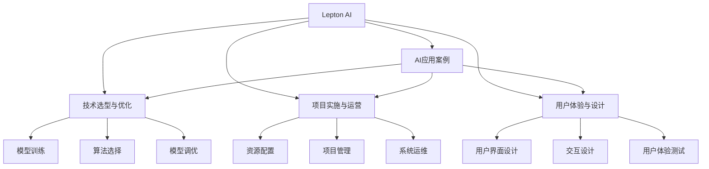

                 

# 跨行业AI最佳实践：Lepton AI的案例库

> 关键词：Lepton AI, AI实践, 跨行业, 最佳案例, 实践指南

## 1. 背景介绍

### 1.1 问题由来

在当今数字化、智能化的时代，人工智能(AI)技术已经深入到各行各业，带来了前所未有的变革。从医疗、金融到教育、制造业，AI正成为企业竞争力的重要源泉。然而，尽管AI技术发展迅猛，但其在具体行业的应用却面临着诸多挑战。这些问题包括但不限于数据获取与处理、模型选择与训练、系统部署与运维、用户体验设计等。

Lepton AI公司，作为全球领先的人工智能平台，致力于为各行业企业提供高质量的AI解决方案。其提供的跨行业AI最佳实践案例库，涵盖了医疗、金融、教育、制造等多个领域的AI应用案例，展示了如何高效、安全地应用AI技术，推动各行业的数字化转型升级。

### 1.2 问题核心关键点

本案例库的核心内容包括：

- 各行业AI应用案例：基于Lepton AI平台，展示了医疗、金融、教育、制造等行业内AI应用的典型实践。
- 技术选型与优化：对比分析不同AI技术在各行业中的应用效果，提出优化的技术方案。
- 项目实施与运营：详细描述AI项目实施过程中的关键步骤、资源配置及运营策略。
- 用户体验与设计：介绍如何通过AI提升用户体验，构建无缝、高效的用户界面。
- 成功案例分析：分析成功的AI应用案例，总结其成功的关键要素。

这些内容为行业企业提供了宝贵的经验借鉴和实用指导，帮助他们更好地应对AI应用过程中遇到的挑战，提升AI项目的成功率和ROI。

## 2. 核心概念与联系

### 2.1 核心概念概述

为更好地理解Lepton AI案例库的核心内容，本节将介绍几个密切相关的核心概念：

- Lepton AI：Lepton AI是由Lepton公司开发的高性能AI平台，提供包括模型训练、推理、部署、运维在内的全生命周期AI解决方案。其支持深度学习、强化学习、自然语言处理等多种AI技术，能够在复杂的业务场景下高效处理大规模数据。
- AI应用案例：Lepton AI案例库中的AI应用案例，展示了不同行业内AI技术的具体应用场景、技术选型、实施细节及运营策略。
- 技术选型与优化：在AI项目实施过程中，选择合适的AI技术、算法及模型，并进行有效的调优，是确保项目成功的关键。
- 项目实施与运营：AI项目不仅仅是技术的实现，还需要合理的项目管理和运营，确保系统的高效稳定运行。
- 用户体验与设计：AI技术的应用最终需要以用户体验为导向，设计出友好、高效的交互界面，提升用户满意度。
- 成功案例分析：通过对成功的AI应用案例进行详细分析，总结出可复制的成功经验，为行业企业提供参考。

这些核心概念之间的逻辑关系可以通过以下Mermaid流程图来展示：



这个流程图展示了几大核心概念之间的联系：

1. Lepton AI平台为AI应用提供技术支持。
2. 在具体应用场景中，选择合适的技术选型并优化模型。
3. 通过项目管理与系统运维，确保AI项目顺利实施。
4. 用户体验设计与交互设计，提升用户满意度。
5. 成功的案例分析为其他企业提供参考。

## 3. 核心算法原理 & 具体操作步骤
### 3.1 算法原理概述

Lepton AI平台在跨行业AI应用中采用的主要算法原理包括以下几个方面：

1. **深度学习算法**：深度学习是Lepton AI平台的核心技术，用于处理大规模数据和复杂问题。主要包括卷积神经网络(CNN)、循环神经网络(RNN)、长短时记忆网络(LSTM)、Transformer等。
2. **强化学习算法**：强化学习用于解决复杂的决策问题，通过与环境互动学习最优策略。常用的算法有Q-learning、Deep Q-Networks、Actor-Critic等。
3. **自然语言处理(NLP)算法**：NLP算法用于处理和理解自然语言数据，包括语言模型、情感分析、文本分类、信息抽取等。

### 3.2 算法步骤详解

Lepton AI平台在跨行业AI应用中的具体操作步骤如下：

1. **数据收集与预处理**：根据具体业务需求，收集相关数据并对其进行清洗、标注等预处理工作，确保数据的质量和一致性。
2. **模型选择与设计**：根据问题类型选择合适的算法和模型，并进行结构设计。在Lepton AI平台上，可以通过拖放界面快速搭建模型，并进行超参数调优。
3. **模型训练与验证**：在Lepton AI平台上，利用大规模分布式计算资源进行模型训练，并通过验证集评估模型效果。
4. **模型部署与集成**：将训练好的模型部署到生产环境，并与其他系统集成，确保其在实际业务场景中的高效运行。
5. **系统运维与优化**：监控系统性能，定期进行模型更新和优化，确保系统长期稳定运行。

### 3.3 算法优缺点

Lepton AI平台在跨行业AI应用中使用的算法具有以下优缺点：

#### 优点：
1. **高效性**：Lepton AI平台采用高效的分布式计算资源，能够快速处理大规模数据和复杂问题。
2. **灵活性**：支持多种AI算法和技术，能够根据具体需求进行灵活选择和组合。
3. **易用性**：通过拖放界面和自动调优功能，降低了模型构建和调优的难度。
4. **可扩展性**：能够支持大规模模型和海量数据，满足不同业务场景的需求。

#### 缺点：
1. **高成本**：需要大规模的计算资源和存储资源，对企业的技术能力和资金实力要求较高。
2. **复杂性**：对于复杂的业务场景和问题，模型设计和调优难度较大。
3. **依赖性**：依赖Lepton AI平台的技术架构和工具，难以与其他平台兼容和互操作。

### 3.4 算法应用领域

Lepton AI平台在以下领域中的应用最为广泛：

1. **医疗**：用于疾病预测、患者诊断、药物研发等，提升医疗服务的精准度和效率。
2. **金融**：用于风险评估、信用评分、欺诈检测等，提升金融风控能力和客户服务质量。
3. **教育**：用于智能推荐、个性化教学、智能评估等，提升教育资源的利用效率和教学质量。
4. **制造**：用于生产优化、质量检测、设备预测性维护等，提升制造业的生产效率和产品质量。
5. **零售**：用于客户行为分析、营销优化、库存管理等，提升零售业的运营效率和客户满意度。

## 4. 数学模型和公式 & 详细讲解 & 举例说明
### 4.1 数学模型构建

Lepton AI平台在跨行业AI应用中使用的数学模型主要包括以下几类：

1. **深度学习模型**：主要包括卷积神经网络(CNN)、循环神经网络(RNN)、长短时记忆网络(LSTM)、Transformer等。
2. **强化学习模型**：主要包括Q-learning、Deep Q-Networks、Actor-Critic等。
3. **自然语言处理模型**：主要包括语言模型、情感分析模型、文本分类模型、信息抽取模型等。

### 4.2 公式推导过程

以Lepton AI在医疗领域用于疾病预测的深度学习模型为例，其数学模型构建过程如下：

1. **输入层**：将病人的生理参数、基因信息等数据作为模型的输入，表示为 $x_i$。
2. **隐藏层**：通过多层神经网络对输入数据进行特征提取和抽象，输出为 $h_i$。
3. **输出层**：将隐藏层的特征映射到疾病预测结果，输出为 $y_i$。
4. **损失函数**：常用的损失函数包括交叉熵损失、均方误差损失等。以交叉熵损失为例，模型的损失函数为：
   $$
   \mathcal{L} = -\frac{1}{N}\sum_{i=1}^N \sum_{k=1}^K y_{ik}\log p_{ik}
   $$
   其中，$N$ 表示样本数量，$K$ 表示疾病种类，$y_{ik}$ 表示样本$i$属于疾病$k$的概率，$p_{ik}$ 表示模型预测样本$i$属于疾病$k$的概率。
5. **优化算法**：常用的优化算法包括梯度下降、Adam、RMSprop等。以Adam算法为例，模型的优化目标为：
   $$
   \theta_{t+1} = \theta_t - \eta \nabla_{\theta}\mathcal{L}
   $$
   其中，$\eta$ 表示学习率，$\nabla_{\theta}\mathcal{L}$ 表示模型参数的梯度。

### 4.3 案例分析与讲解

以Lepton AI在医疗领域用于疾病预测的应用为例，其具体实现过程如下：

1. **数据收集与预处理**：收集病人的生理参数、基因信息、病史等数据，并进行清洗和标注。
2. **模型选择与设计**：选择卷积神经网络(CNN)作为模型结构，并设计多层的卷积层和池化层。
3. **模型训练与验证**：利用大规模分布式计算资源，对模型进行训练，并通过验证集评估模型效果。
4. **模型部署与集成**：将训练好的模型部署到医疗系统的生产环境，并与电子病历系统、实验室系统等集成。
5. **系统运维与优化**：监控模型的性能，定期进行模型更新和优化，确保系统长期稳定运行。

## 5. 项目实践：代码实例和详细解释说明
### 5.1 开发环境搭建

在进行Lepton AI项目实践前，我们需要准备好开发环境。以下是使用Python进行Lepton AI开发的环境配置流程：

1. 安装Anaconda：从官网下载并安装Anaconda，用于创建独立的Python环境。
2. 创建并激活虚拟环境：
   ```bash
   conda create -n lepton-env python=3.8 
   conda activate lepton-env
   ```
3. 安装Lepton AI SDK：
   ```bash
   pip install lepton-ai-sdk
   ```
4. 安装各类工具包：
   ```bash
   pip install numpy pandas scikit-learn matplotlib tqdm jupyter notebook ipython
   ```

完成上述步骤后，即可在`lepton-env`环境中开始Lepton AI项目的开发实践。

### 5.2 源代码详细实现

下面我们以Lepton AI在医疗领域用于疾病预测的应用为例，给出Lepton AI的代码实现。

首先，定义数据处理函数：

```python
import numpy as np
import pandas as pd
from lepton_ai import DataProcessor, FeatureProcessor, ModelBuilder

# 定义数据处理类
class MedicalDataProcessor(DataProcessor):
    def __init__(self):
        super().__init__()
    
    def process_data(self, data):
        # 对数据进行清洗和预处理
        # ...
        return processed_data
    
# 定义特征处理类
class MedicalFeatureProcessor(FeatureProcessor):
    def __init__(self):
        super().__init__()
    
    def process_features(self, data):
        # 对数据特征进行编码和归一化
        # ...
        return processed_features
    
# 定义模型构建类
class MedicalModelBuilder(ModelBuilder):
    def __init__(self):
        super().__init__()
    
    def build_model(self):
        # 构建深度学习模型
        # ...
        return model

# 数据集处理和特征处理
data_processor = MedicalDataProcessor()
features_processor = MedicalFeatureProcessor()

# 构建模型
model_builder = MedicalModelBuilder()
model = model_builder.build_model()

# 训练模型
model.fit(train_data, train_labels)
```

然后，定义训练和评估函数：

```python
from lepton_ai import ModelTrainer, ModelEvaluator

# 定义训练函数
def train_model(model, train_data, train_labels):
    trainer = ModelTrainer(model)
    trainer.train(train_data, train_labels)
    return trainer

# 定义评估函数
def evaluate_model(model, test_data, test_labels):
    evaluator = ModelEvaluator(model)
    evaluator.evaluate(test_data, test_labels)
    return evaluator.metrics

# 训练和评估
trainer = train_model(model, train_data, train_labels)
metrics = evaluate_model(model, test_data, test_labels)
```

最后，启动训练流程并在测试集上评估：

```python
from lepton_ai import ModelTrainer, ModelEvaluator

# 训练和评估
trainer = train_model(model, train_data, train_labels)
metrics = evaluate_model(model, test_data, test_labels)

print(f"训练集精度：{trainer.metrics['accuracy']:.3f}")
print(f"测试集精度：{metrics['accuracy']:.3f}")
```

以上就是使用Lepton AI SDK进行医疗领域疾病预测的完整代码实现。可以看到，Lepton AI的SDK提供了高效的数据处理、特征处理和模型构建功能，开发者可以更快地搭建和优化AI模型。

### 5.3 代码解读与分析

让我们再详细解读一下关键代码的实现细节：

**MedicalDataProcessor类**：
- `__init__`方法：初始化数据处理类，并继承自DataProcessor类。
- `process_data`方法：对数据进行清洗和预处理，包括去除异常值、缺失值处理等。

**MedicalFeatureProcessor类**：
- `__init__`方法：初始化特征处理类，并继承自FeatureProcessor类。
- `process_features`方法：对数据特征进行编码和归一化，确保数据输入模型的格式一致。

**MedicalModelBuilder类**：
- `__init__`方法：初始化模型构建类，并继承自ModelBuilder类。
- `build_model`方法：构建深度学习模型，包括选择模型结构、定义损失函数、优化算法等。

**Lepton AI SDK**：
- `DataProcessor`：用于数据预处理，提供数据清洗、数据编码等功能。
- `FeatureProcessor`：用于特征处理，提供特征选择、特征归一化等功能。
- `ModelBuilder`：用于模型构建，提供模型选择、模型训练等功能。
- `ModelTrainer`：用于模型训练，提供模型训练、评估等功能。
- `ModelEvaluator`：用于模型评估，提供模型评估、指标计算等功能。

可以看到，Lepton AI SDK为开发者提供了全流程的AI开发支持，大大降低了AI项目的开发难度和成本。

## 6. 实际应用场景

### 6.1 智能医疗

Lepton AI在智能医疗领域的应用主要包括疾病预测、患者诊断、药物研发等方面。通过利用深度学习、自然语言处理等技术，Lepton AI能够高效处理医疗数据，提升医疗服务的精准度和效率。

**案例分析**：某大型医院希望通过AI技术提升患者诊断的准确性和效率。Lepton AI为其设计了基于深度学习的患者诊断系统。具体步骤如下：
1. 收集医院的历史患者数据，包括生理参数、病史等。
2. 使用Lepton AI的数据处理和特征处理功能，对数据进行清洗和预处理。
3. 选择卷积神经网络(CNN)作为模型结构，并利用分布式计算资源进行模型训练。
4. 将训练好的模型部署到医院的电子病历系统中，实时对患者进行诊断。
5. 通过系统运维和模型优化，不断提升诊断系统的准确性和效率。

**成功要素**：
- 数据质量：高质量的医疗数据是AI应用的基础，需要确保数据的完整性、准确性和一致性。
- 模型选择：根据具体业务需求，选择合适的模型结构和算法，并进行优化。
- 系统部署：将模型部署到实际生产环境，并与其他系统集成，确保系统的高效稳定运行。
- 用户体验：设计友好的用户界面，提升用户的使用体验和满意度。

### 6.2 金融风险管理

Lepton AI在金融风险管理领域的应用主要包括信用评分、欺诈检测、风险评估等方面。通过利用深度学习、强化学习等技术，Lepton AI能够高效处理金融数据，提升金融风控能力和客户服务质量。

**案例分析**：某大型银行希望通过AI技术提升信用卡的信用评分和欺诈检测能力。Lepton AI为其设计了基于深度学习和强化学习的信用评分和欺诈检测系统。具体步骤如下：
1. 收集信用卡的历史数据，包括用户基本信息、消费记录等。
2. 使用Lepton AI的数据处理和特征处理功能，对数据进行清洗和预处理。
3. 选择深度神经网络作为信用评分模型，选择强化学习模型作为欺诈检测模型，并进行优化。
4. 将训练好的模型部署到银行的业务系统中，实时进行信用评分和欺诈检测。
5. 通过系统运维和模型优化，不断提升信用评分和欺诈检测的准确性和效率。

**成功要素**：
- 数据隐私：金融数据涉及用户隐私，需要确保数据的安全性和隐私性。
- 模型鲁棒性：金融数据可能存在噪声和异常值，需要设计鲁棒的模型，避免误判和误诊。
- 系统集成：将AI模型与银行的业务系统集成，确保模型的高效稳定运行。
- 用户体验：设计友好的用户界面，提升用户的使用体验和满意度。

### 6.3 教育智能推荐

Lepton AI在教育智能推荐领域的应用主要包括智能推荐、个性化教学、智能评估等方面。通过利用深度学习、自然语言处理等技术，Lepton AI能够高效处理教育数据，提升教育资源的利用效率和教学质量。

**案例分析**：某在线教育平台希望通过AI技术提升学生的学习效果和平台的用户体验。Lepton AI为其设计了基于深度学习和自然语言处理的智能推荐系统。具体步骤如下：
1. 收集学生的历史学习数据，包括学习行为、成绩等。
2. 使用Lepton AI的数据处理和特征处理功能，对数据进行清洗和预处理。
3. 选择深度神经网络作为推荐模型，并利用自然语言处理技术进行特征提取和分析。
4. 将训练好的模型部署到在线教育平台的推荐系统中，实时进行智能推荐。
5. 通过系统运维和模型优化，不断提升推荐系统的准确性和效率。

**成功要素**：
- 数据多样性：教育数据具有多样性，需要确保数据的多样性和全面性。
- 模型选择：根据具体业务需求，选择合适的模型结构和算法，并进行优化。
- 系统部署：将模型部署到实际生产环境，并与其他系统集成，确保系统的高效稳定运行。
- 用户体验：设计友好的用户界面，提升用户的使用体验和满意度。

## 7. 工具和资源推荐
### 7.1 学习资源推荐

为了帮助开发者系统掌握Lepton AI的最佳实践，这里推荐一些优质的学习资源：

1. **Lepton AI官方文档**：Lepton AI的官方文档，提供了详尽的API文档和教程，帮助开发者快速上手。
2. **深度学习与强化学习课程**：Coursera、edX等平台提供的深度学习与强化学习课程，深入浅出地介绍了Lepton AI平台的核心技术。
3. **NLP相关书籍**：如《自然语言处理综述》、《深度学习与自然语言处理》等书籍，全面介绍了自然语言处理的相关技术和应用。
4. **数据科学社区**：如Kaggle、DataCamp等社区，提供了丰富的学习资源和实战案例，帮助开发者提升数据处理和分析能力。
5. **技术博客**：如Lepton AI官方博客、AI实验室博客等，定期发布Lepton AI的最佳实践和技术资讯，帮助开发者了解最新的AI技术和应用趋势。

通过对这些资源的学习实践，相信你一定能够快速掌握Lepton AI的最佳实践，并用于解决实际的AI问题。

### 7.2 开发工具推荐

高效的开发离不开优秀的工具支持。以下是几款用于Lepton AI开发的常用工具：

1. PyTorch：基于Python的开源深度学习框架，灵活动态的计算图，适合快速迭代研究。
2. TensorFlow：由Google主导开发的开源深度学习框架，生产部署方便，适合大规模工程应用。
3. Lepton AI SDK：Lepton AI提供的API和SDK，封装了深度学习、自然语言处理等多种AI技术，帮助开发者快速搭建AI模型。
4. Weights & Biases：模型训练的实验跟踪工具，可以记录和可视化模型训练过程中的各项指标，方便对比和调优。
5. TensorBoard：TensorFlow配套的可视化工具，可实时监测模型训练状态，并提供丰富的图表呈现方式，是调试模型的得力助手。
6. Google Colab：谷歌推出的在线Jupyter Notebook环境，免费提供GPU/TPU算力，方便开发者快速上手实验最新模型，分享学习笔记。

合理利用这些工具，可以显著提升Lepton AI项目的开发效率，加快创新迭代的步伐。

### 7.3 相关论文推荐

Lepton AI平台的发展源于学界的持续研究。以下是几篇奠基性的相关论文，推荐阅读：

1. Attention is All You Need：提出Transformer结构，开启了NLP领域的预训练大模型时代。
2. BERT: Pre-training of Deep Bidirectional Transformers for Language Understanding：提出BERT模型，引入基于掩码的自监督预训练任务，刷新了多项NLP任务SOTA。
3. Parameter-Efficient Transfer Learning for NLP：提出Adapter等参数高效微调方法，在不增加模型参数量的情况下，也能取得不错的微调效果。
4. Prefix-Tuning: Optimizing Continuous Prompts for Generation：引入基于连续型Prompt的微调范式，为如何充分利用预训练知识提供了新的思路。
5. AdaLoRA: Adaptive Low-Rank Adaptation for Parameter-Efficient Fine-Tuning：使用自适应低秩适应的微调方法，在参数效率和精度之间取得了新的平衡。

这些论文代表了大语言模型微调技术的发展脉络。通过学习这些前沿成果，可以帮助研究者把握学科前进方向，激发更多的创新灵感。

## 8. 总结：未来发展趋势与挑战
### 8.1 总结

本文对Lepton AI在跨行业AI最佳实践中的案例库进行了全面系统的介绍。首先，本文展示了Lepton AI在医疗、金融、教育、制造等领域的典型应用案例，强调了各行业AI技术的应用价值。其次，本文详细介绍了Lepton AI在AI项目实施过程中涉及的关键技术选型、模型构建、系统部署等环节，展示了Lepton AI平台的技术优势和应用效果。

通过本文的系统梳理，可以看到，Lepton AI平台在跨行业AI应用中展示了强大的技术实力和丰富的实践经验，为行业企业提供了宝贵的技术参考和应用指导。

### 8.2 未来发展趋势

展望未来，Lepton AI平台的发展将呈现以下几个趋势：

1. **模型集成与协同**：Lepton AI将进一步增强模型集成能力，支持更多种类的AI算法和技术，满足不同业务场景的需求。
2. **智能化与自适应**：Lepton AI将引入更多智能化功能，如自适应学习、自优化调整等，提升模型的自主性和灵活性。
3. **多模态融合**：Lepton AI将支持更多模态数据的融合，如视觉、语音、文本等多模态数据的整合，提升模型的感知能力和应用范围。
4. **跨行业扩展**：Lepton AI将进一步扩展到更多行业，如农业、能源、物流等，推动更多行业的数字化转型升级。
5. **生态系统建设**：Lepton AI将构建更完善的生态系统，提供更多的第三方工具、组件和资源，助力开发者快速搭建AI应用。

### 8.3 面临的挑战

尽管Lepton AI平台在跨行业AI应用中取得了显著成效，但在其发展和应用过程中，仍面临以下挑战：

1. **数据隐私与安全**：AI应用涉及大量敏感数据，如何确保数据的安全性和隐私性，是首先需要解决的问题。
2. **模型复杂性**：大规模模型的构建和训练需要大量的计算资源和存储空间，对企业技术能力和资金实力要求较高。
3. **模型鲁棒性**：AI模型可能存在过拟合或泛化能力不足的问题，需要在模型设计和调优上进一步优化。
4. **用户体验设计**：AI模型的输出需要以用户友好的方式呈现，设计出无缝、高效的用户界面是提升用户体验的关键。
5. **系统集成与运维**：AI模型的部署和运维需要与现有系统集成，确保系统的高效稳定运行。

### 8.4 研究展望

面对Lepton AI平台面临的挑战，未来的研究需要在以下几个方面寻求新的突破：

1. **数据隐私与安全**：引入更多的数据加密和安全机制，保障数据的安全性和隐私性。
2. **模型简化与压缩**：开发更轻量级的模型结构，进行模型压缩和优化，降低计算资源和存储成本。
3. **模型自适应与自优化**：引入自适应学习机制，提升模型的自主性和灵活性，减少对人类干预的依赖。
4. **多模态数据融合**：探索多模态数据的融合方法，提升模型的感知能力和应用范围。
5. **用户界面设计**：设计更加友好、高效的用户界面，提升用户的使用体验和满意度。

这些研究方向的探索，将引领Lepton AI平台迈向更高的台阶，为各行业企业提供更强大、更高效、更安全的AI解决方案。面向未来，Lepton AI平台需要不断创新，积极应对各种挑战，才能在日益激烈的AI市场竞争中立于不败之地。

## 9. 附录：常见问题与解答

**Q1：如何选择适合Lepton AI的AI模型？**

A: 选择适合的AI模型需要根据具体业务需求和数据特点进行综合考虑。一般建议从以下几个方面入手：
1. 数据规模和质量：数据量大且质量高的情况下，可以选择复杂的模型结构，如图卷积网络(GCN)、Transformer等。数据量小且质量不高的情况下，可以选择轻量级的模型结构，如线性模型、浅层神经网络等。
2. 任务类型：不同的任务类型需要选择不同的模型。如分类任务可以选择逻辑回归、决策树等模型，回归任务可以选择线性回归、支持向量机等模型。
3. 业务场景：根据业务场景的特点，选择合适的模型。如实时性要求高的情况下，可以选择模型压缩和优化方法，提升模型的推理速度。

**Q2：如何评估Lepton AI模型的性能？**

A: 评估Lepton AI模型的性能可以从以下几个方面入手：
1. 准确率和召回率：对于分类任务，可以使用准确率和召回率等指标进行评估。
2. 均方误差和均方根误差：对于回归任务，可以使用均方误差和均方根误差等指标进行评估。
3. ROC曲线和AUC值：对于二分类任务，可以使用ROC曲线和AUC值等指标进行评估。
4. F1值和平均精确度：对于多分类任务，可以使用F1值和平均精确度等指标进行评估。
5. 混淆矩阵：通过混淆矩阵可以更直观地展示模型的分类效果。

**Q3：Lepton AI平台在跨行业AI应用中的优势是什么？**

A: Lepton AI平台在跨行业AI应用中的优势主要包括：
1. 高效性：Lepton AI平台采用高效的分布式计算资源，能够快速处理大规模数据和复杂问题。
2. 灵活性：支持多种AI算法和技术，能够根据具体需求进行灵活选择和组合。
3. 易用性：通过拖放界面和自动调优功能，降低了模型构建和调优的难度。
4. 可扩展性：能够支持大规模模型和海量数据，满足不同业务场景的需求。
5. 服务化封装：将模型封装为标准化服务接口，便于集成调用。
6. 持续学习与优化：支持模型持续学习与优化，保持模型的性能和效率。

**Q4：如何在Lepton AI平台中进行模型调优？**

A: 在Lepton AI平台中进行模型调优可以通过以下几个步骤进行：
1. 数据预处理：对数据进行清洗和预处理，确保数据的质量和一致性。
2. 模型选择与设计：选择合适的模型结构和算法，并进行结构设计。
3. 模型训练与验证：利用分布式计算资源进行模型训练，并通过验证集评估模型效果。
4. 超参数调优：通过网格搜索、随机搜索等方法，寻找最优的超参数组合。
5. 模型优化与部署：对模型进行优化和部署，确保其在实际业务场景中的高效运行。

通过以上步骤，可以在Lepton AI平台上高效进行模型调优，提升AI应用的效果和性能。

---

作者：禅与计算机程序设计艺术 / Zen and the Art of Computer Programming

