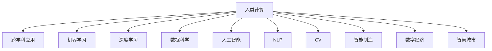
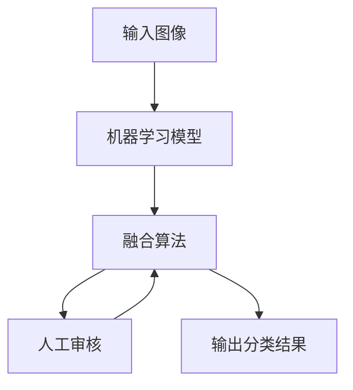

                 

# 跨越学科边界：人类计算的多元化应用

> 关键词：人类计算, 跨学科应用, 机器学习, 深度学习, 数据科学, 人工智能, 自然语言处理(NLP), 计算机视觉(CV), 智能制造, 数字经济, 智慧城市

## 1. 背景介绍

### 1.1 问题由来
当今时代，计算已经深深渗透到各个学科领域。从科学研究到商业决策，从金融交易到医疗健康，计算技术在各个领域的应用正变得越来越广泛和深入。然而，传统计算范式在应对某些复杂问题时，显得力不从心。因此，计算范式的创新迫在眉睫。

### 1.2 问题核心关键点
本文将探讨人类计算的多元化应用，旨在回答以下关键问题：
1. 人类计算的现状和挑战是什么？
2. 人类计算如何跨越学科边界？
3. 人类计算的前沿技术有哪些？
4. 人类计算在实际应用中有哪些挑战和机遇？

### 1.3 问题研究意义
通过深入研究人类计算的多元化应用，可以：
1. 推动各学科领域的创新发展，提升计算技术的实用性。
2. 发掘计算技术与现实需求的结合点，促进技术的落地应用。
3. 提升计算技术在各个学科领域的普及程度和应用水平。
4. 探索新的计算范式，拓展计算技术的应用范围和深度。

## 2. 核心概念与联系

### 2.1 核心概念概述

为了更好地理解人类计算的多元化应用，首先需要介绍几个核心概念：

1. **人类计算(Human Computation)**：指利用人类的认知和计算能力，解决传统计算难以处理的复杂问题。包括众包、人机协作、人类循环计算等多种形式。

2. **跨学科应用(Cross-Disciplinary Applications)**：指计算技术在不同学科之间的交叉应用，以解决特定领域中的复杂问题。

3. **机器学习(Machine Learning, ML)**：指通过算法让计算机从数据中自动学习规律，从而进行预测和决策。

4. **深度学习(Deep Learning, DL)**：指利用多层神经网络对数据进行复杂处理，提取高层次特征的技术。

5. **数据科学(Data Science)**：指通过数据处理、分析、建模等技术，发现数据中的知识和规律，支持决策制定。

6. **人工智能(Artificial Intelligence, AI)**：指通过机器学习和深度学习等技术，使计算机模拟人类智能行为，实现自主学习和决策。

7. **自然语言处理(Natural Language Processing, NLP)**：指使计算机理解和生成自然语言的技术。

8. **计算机视觉(Computer Vision, CV)**：指使计算机理解和处理视觉信息的技术。

9. **智能制造(Smart Manufacturing)**：指通过人工智能和物联网技术，实现智能生产和质量控制。

10. **数字经济(Digital Economy)**：指以数据和信息为核心驱动力的经济形态，包括数字支付、电子商务、在线服务等领域。

11. **智慧城市(Smart City)**：指通过信息技术手段，实现城市管理智能化和居民生活便捷化。

这些概念之间的联系可以通过以下Mermaid流程图来展示：



这个流程图展示了人类计算的核心概念及其之间的联系：

1. 人类计算通过机器学习、深度学习等技术，提取数据中的知识和规律。
2. 提取的知识和规律通过跨学科应用，支撑各个领域的具体应用场景。
3. 人类计算在自然语言处理、计算机视觉、智能制造、数字经济、智慧城市等多个领域都有广泛应用。

## 3. 核心算法原理 & 具体操作步骤
### 3.1 算法原理概述

人类计算的多元化应用，本质上是一种混合智能的方式。通过将计算技术与人类认知能力相结合，实现更高效、更灵活、更智能的计算。其核心思想是：将复杂的计算任务分解成多个子任务，部分由机器完成，部分由人工参与。

以众包为例，假设有一个图像分类任务，需要标注大量图像。可以先使用机器学习模型对图像进行初步分类，然后将分类结果提交给人工审核。人工审核后，将纠正后的结果反馈给机器学习模型，进一步优化分类效果。这种混合智能的方式，可以大大提高任务处理的效率和准确度。

### 3.2 算法步骤详解

人类计算的多元化应用一般包括以下几个关键步骤：

**Step 1: 任务分解**
- 将复杂的计算任务分解成多个子任务，每个子任务适合由机器或人工独立完成。

**Step 2: 任务适配**
- 根据子任务的性质，选择合适的算法和技术，进行任务适配。
- 对于机器任务，可以使用机器学习、深度学习等技术进行处理。
- 对于人工任务，可以使用众包、人机协作等技术进行处理。

**Step 3: 数据收集**
- 收集与任务相关的数据，并对其进行预处理。
- 对于机器任务，需要准备大量标注数据。
- 对于人工任务，需要选择合适的工人，并进行培训。

**Step 4: 任务执行**
- 执行任务分解后的子任务。
- 对于机器任务，使用训练好的模型进行预测和推理。
- 对于人工任务，将任务分发给合适的工人，并监督其完成。

**Step 5: 任务融合**
- 将机器和人工的任务结果进行融合。
- 使用融合算法将不同任务的结果进行整合，得到最终的计算结果。

**Step 6: 评估与优化**
- 对计算结果进行评估，发现问题并进行优化。
- 根据评估结果，调整任务分解、适配、数据收集和融合等环节，提高计算效率和准确度。

### 3.3 算法优缺点

人类计算的多元化应用具有以下优点：
1. 灵活性高：可以根据具体任务的特点，灵活选择机器和人工的组合方式。
2. 可扩展性强：可以动态调整任务分配，适应不同的计算需求。
3. 人机协同：充分发挥机器和人工的优势，提升计算效果和效率。
4. 可解释性好：人工参与可以提高任务处理的可解释性，增强系统信任度。

同时，该方法也存在以下局限性：
1. 依赖人工：对人工的依赖程度较高，人工质量直接影响计算结果。
2. 任务复杂度：复杂任务难以进行有效的任务分解和适配，影响计算效率。
3. 数据隐私：人工参与可能涉及敏感数据，需要严格保护隐私。
4. 任务监控：需要实时监控任务的执行情况，以保证任务质量和进度。

尽管存在这些局限性，但就目前而言，人类计算的多元化应用仍是一种高效、灵活、可解释的计算范式，广泛应用于各个领域。

### 3.4 算法应用领域

人类计算的多元化应用已经在多个领域得到了广泛应用，例如：

- 自然语言处理(NLP)：如机器翻译、情感分析、智能问答等。通过将自然语言处理任务分解为机器和人工的子任务，提高任务处理的效率和准确度。

- 计算机视觉(CV)：如目标检测、图像分类、图像标注等。通过将图像处理任务分解为机器和人工的子任务，提升图像识别的精度和鲁棒性。

- 智能制造：如智能质检、智能调度、供应链优化等。通过将智能制造任务分解为机器和人工的子任务，提升生产效率和质量控制水平。

- 数字经济：如电子商务、在线服务、金融分析等。通过将经济分析任务分解为机器和人工的子任务，提高数据分析的准确性和实时性。

- 智慧城市：如智能交通、智能安防、公共服务优化等。通过将城市管理任务分解为机器和人工的子任务，提升城市管理的智能化和便捷性。

除了上述这些经典领域外，人类计算的多元化应用还在更多场景中得到创新性地应用，如智能家居、智能健康、智能农业等，为各行各业带来变革性影响。

## 4. 数学模型和公式 & 详细讲解 & 举例说明
### 4.1 数学模型构建

人类计算的多元化应用可以通过数学模型进行更严谨的刻画。

假设有一个图像分类任务，使用机器学习模型进行初步分类，人工进行审核和校正。可以将任务表示为一个混合智能系统，如下图所示：



其中，$B$ 表示机器学习模型，$C$ 表示人工审核过程，$D$ 表示融合算法，$E$ 表示最终的分类结果。

### 4.2 公式推导过程

以二分类任务为例，假设机器学习模型对图像的预测概率为 $p$，人工审核后的分类结果为 $y$。融合算法将 $p$ 和 $y$ 进行融合，得到最终的分类结果 $\hat{y}$。常见的融合算法有：

1. 简单平均法（Simple Average）：
   $$
   \hat{y} = \frac{p + y}{2}
   $$

2. 加权平均法（Weighted Average）：
   $$
   \hat{y} = \frac{p + w_1y}{1 + w_1}
   $$
   其中 $w_1$ 为人工审核的权重。

3. 阈值融合法（Thresholding）：
   $$
   \hat{y} = \begin{cases}
   0, & p \leq \theta \\
   1, & p > \theta
   \end{cases}
   $$
   其中 $\theta$ 为融合阈值。

4. 逻辑回归融合法（Logistic Regression）：
   $$
   \hat{y} = \frac{1}{1 + e^{-p + w_2y}}
   $$
   其中 $w_2$ 为人工审核的权重。

### 4.3 案例分析与讲解

以自然语言处理(NLP)中的情感分析任务为例，假设有一个情感分析系统，需要标注大量的电影评论数据。可以使用众包平台将标注任务分发给多个工人，每个工人标注一部分数据。然后，使用机器学习模型对标注结果进行初步分析，人工审核和校正。最后，使用融合算法将机器和人工的结果进行融合，得到最终的情感分析结果。

## 5. 项目实践：代码实例和详细解释说明
### 5.1 开发环境搭建

在进行项目实践前，我们需要准备好开发环境。以下是使用Python进行PyTorch开发的环境配置流程：

1. 安装Anaconda：从官网下载并安装Anaconda，用于创建独立的Python环境。

2. 创建并激活虚拟环境：
```bash
conda create -n pytorch-env python=3.8 
conda activate pytorch-env
```

3. 安装PyTorch：根据CUDA版本，从官网获取对应的安装命令。例如：
```bash
conda install pytorch torchvision torchaudio cudatoolkit=11.1 -c pytorch -c conda-forge
```

4. 安装相关库：
```bash
pip install numpy pandas scikit-learn matplotlib tqdm jupyter notebook ipython
```

完成上述步骤后，即可在`pytorch-env`环境中开始项目实践。

### 5.2 源代码详细实现

这里我们以自然语言处理(NLP)中的情感分析任务为例，给出使用PyTorch进行情感分析任务微调的完整代码实现。

首先，定义情感分析任务的数据处理函数：

```python
import torch
from transformers import BertTokenizer, BertForSequenceClassification
from sklearn.metrics import accuracy_score

def process_data(texts, labels):
    tokenizer = BertTokenizer.from_pretrained('bert-base-cased')
    input_ids = [tokenizer.encode(text, add_special_tokens=True)[0] for text in texts]
    input_ids = torch.tensor(input_ids).unsqueeze(0)
    attention_mask = torch.ones(len(texts)).unsqueeze(0)
    labels = torch.tensor(labels)
    return input_ids, attention_mask, labels

def train_epoch(model, data_loader, optimizer):
    model.train()
    total_loss = 0
    for input_ids, attention_mask, labels in data_loader:
        optimizer.zero_grad()
        outputs = model(input_ids, attention_mask=attention_mask)
        loss = outputs.loss
        total_loss += loss.item()
        loss.backward()
        optimizer.step()
    return total_loss / len(data_loader)

def evaluate(model, data_loader):
    model.eval()
    total_loss = 0
    predictions = []
    labels = []
    with torch.no_grad():
        for input_ids, attention_mask, labels in data_loader:
            outputs = model(input_ids, attention_mask=attention_mask)
            loss = outputs.loss
            total_loss += loss.item()
            predictions.append(outputs.logits.argmax(dim=1).tolist())
            labels.append(labels.tolist())
    predictions = [pred for pred in predictions]
    labels = [lab for lab in labels]
    return total_loss / len(data_loader), accuracy_score(labels, predictions)
```

然后，定义模型和优化器：

```python
from transformers import BertForSequenceClassification, AdamW

model = BertForSequenceClassification.from_pretrained('bert-base-cased', num_labels=2)

optimizer = AdamW(model.parameters(), lr=2e-5)
```

接着，定义训练和评估函数：

```python
from torch.utils.data import DataLoader
from tqdm import tqdm

device = torch.device('cuda') if torch.cuda.is_available() else torch.device('cpu')
model.to(device)

def train(model, train_data, optimizer, batch_size):
    train_loader = DataLoader(train_data, batch_size=batch_size, shuffle=True)
    total_loss = 0
    for epoch in range(3):
        for step, (input_ids, attention_mask, labels) in enumerate(tqdm(train_loader)):
            input_ids = input_ids.to(device)
            attention_mask = attention_mask.to(device)
            labels = labels.to(device)
            model.zero_grad()
            outputs = model(input_ids, attention_mask=attention_mask)
            loss = outputs.loss
            total_loss += loss.item()
            loss.backward()
            optimizer.step()
        print(f'Epoch {epoch+1}, loss: {total_loss/len(train_loader):.4f}')

def evaluate(model, test_data, batch_size):
    test_loader = DataLoader(test_data, batch_size=batch_size)
    total_loss, acc = evaluate(model, test_loader)
    print(f'Test loss: {total_loss:.4f}, accuracy: {acc:.4f}')
```

最后，启动训练流程并在测试集上评估：

```python
from dataset import Dataset
from transformers import BertTokenizer, BertForSequenceClassification

# 准备数据
train_data = Dataset('train.txt', 'train_labels.txt', tokenizer)
test_data = Dataset('test.txt', 'test_labels.txt', tokenizer)

# 训练模型
train(model, train_data, optimizer, batch_size=32)

# 评估模型
evaluate(model, test_data, batch_size=32)
```

以上就是使用PyTorch进行情感分析任务微调的完整代码实现。可以看到，使用Transformer库可以大大简化模型的加载和微调过程。

### 5.3 代码解读与分析

让我们再详细解读一下关键代码的实现细节：

**process_data函数**：
- 定义了数据预处理函数，将文本数据转换为模型所需的格式。
- 使用BertTokenizer将文本分词，并转换为模型所需的输入格式。

**train_epoch函数**：
- 定义了训练函数，用于在一个epoch内对模型进行训练。
- 在每个batch上，前向传播计算损失函数，反向传播更新模型参数。
- 使用平均损失作为该epoch的损失，并返回。

**evaluate函数**：
- 定义了评估函数，用于在测试集上评估模型性能。
- 在每个batch上，前向传播计算损失函数，并记录预测结果和真实标签。
- 返回该epoch的平均损失和准确率。

**训练流程**：
- 定义总的epoch数和batch size，开始循环迭代
- 每个epoch内，先训练模型，输出平均损失
- 在测试集上评估，输出评估结果

可以看到，PyTorch配合Transformer库使得情感分析任务的微调代码实现变得简洁高效。开发者可以将更多精力放在数据处理、模型改进等高层逻辑上，而不必过多关注底层的实现细节。

当然，工业级的系统实现还需考虑更多因素，如模型的保存和部署、超参数的自动搜索、更灵活的任务适配层等。但核心的微调范式基本与此类似。

## 6. 实际应用场景
### 6.1 智能客服系统

基于人类计算的多元化应用，智能客服系统可以充分利用机器和人工的优势，提升客服系统的智能化和客户体验。

在实际应用中，可以将客户咨询转化为多种形式的计算任务，如文本分类、情感分析、意图识别等。通过众包平台将标注任务分发给多个工人，每个工人标注一部分数据。然后，使用机器学习模型对标注结果进行初步分析，人工审核和校正。最后，使用融合算法将机器和人工的结果进行融合，得到最终的客服答复。

### 6.2 金融舆情监测

金融机构需要实时监测市场舆论动向，以便及时应对负面信息传播，规避金融风险。传统的人工监测方式成本高、效率低，难以应对网络时代海量信息爆发的挑战。

利用人类计算的多元化应用，可以将舆情监测任务分解为多个子任务，部分由机器完成，部分由人工参与。使用机器学习模型对舆情数据进行初步分析，人工审核和校正。最后，使用融合算法将机器和人工的结果进行融合，得到最终的舆情分析结果。

### 6.3 个性化推荐系统

当前的推荐系统往往只依赖用户的历史行为数据进行物品推荐，无法深入理解用户的真实兴趣偏好。

利用人类计算的多元化应用，可以将个性化推荐任务分解为多个子任务，部分由机器完成，部分由人工参与。使用机器学习模型对用户行为数据进行初步分析，人工审核和校正。最后，使用融合算法将机器和人工的结果进行融合，得到最终的推荐结果。

### 6.4 未来应用展望

随着人类计算的多元化应用不断发展，未来在更多领域将有广泛的应用前景。

在智慧医疗领域，基于人类计算的疾病诊断、治疗方案推荐等应用将提升医疗服务的智能化水平，辅助医生诊疗，加速新药开发进程。

在智能教育领域，基于人类计算的教育评估、智能辅导等应用将提升教育服务的个性化和智能化水平，因材施教，促进教育公平，提高教学质量。

在智慧城市治理中，基于人类计算的城市事件监测、舆情分析、应急指挥等应用将提高城市管理的自动化和智能化水平，构建更安全、高效的未来城市。

此外，在企业生产、社会治理、文娱传媒等众多领域，基于人类计算的多元化应用也将不断涌现，为各行各业带来变革性影响。

## 7. 工具和资源推荐
### 7.1 学习资源推荐

为了帮助开发者系统掌握人类计算的多元化应用，这里推荐一些优质的学习资源：

1. 《Human Computation and Collaborative Computing》系列博文：由领域专家撰写，深入浅出地介绍了人类计算和协作计算的理论基础和实践技巧。

2. 《Introduction to Human Computation》书籍：详细介绍人类计算的基本概念、方法和应用场景，适合入门学习。

3. CS223《Human-Computer Interaction》课程：斯坦福大学开设的HCI课程，涵盖人机交互的基本理论和实践，适合进阶学习。

4. HCI Sherpa：HCI社区平台，汇集了大量的HCI研究和应用资源，适合查找相关文献和实践案例。

通过对这些资源的学习实践，相信你一定能够快速掌握人类计算的多元化应用，并用于解决实际的计算问题。

### 7.2 开发工具推荐

高效的开发离不开优秀的工具支持。以下是几款用于人类计算的多元化应用开发的常用工具：

1. PyTorch：基于Python的开源深度学习框架，灵活动态的计算图，适合快速迭代研究。大部分预训练语言模型都有PyTorch版本的实现。

2. TensorFlow：由Google主导开发的开源深度学习框架，生产部署方便，适合大规模工程应用。同样有丰富的预训练语言模型资源。

3. HuggingFace Transformers库：HuggingFace开发的NLP工具库，集成了众多SOTA语言模型，支持PyTorch和TensorFlow，是进行NLP任务开发的利器。

4. Amazon SageMaker：AWS的云服务平台，提供了机器学习、深度学习等工具，方便开发者进行模型训练和部署。

5. Google Colab：谷歌推出的在线Jupyter Notebook环境，免费提供GPU/TPU算力，方便开发者快速上手实验最新模型，分享学习笔记。

合理利用这些工具，可以显著提升人类计算的多元化应用开发效率，加快创新迭代的步伐。

### 7.3 相关论文推荐

人类计算的多元化应用不断发展，学术界和产业界也涌现了大量相关论文，以下是几篇奠基性的相关论文，推荐阅读：

1. Crowdsourcing Narrative Data Analysis and Research：探讨众包在数据分析中的应用，并提出一套数据管理和质量控制框架。

2. A Survey of Human-Centered Computing: From Technology to HCI：综述人类计算和协作计算的研究进展和应用场景，提供全面的理论和方法指引。

3. Human-in-the-Loop Machine Learning：探讨人机协作学习的方法和技术，提升机器学习模型的准确性和鲁棒性。

4. A Survey of Human-AI Collaboration in Data Science：综述人机协作在数据科学中的应用，讨论如何利用人类优势提升数据分析效果。

5. Exploring Opportunities and Challenges of Human-Computer Collaboration in AI Development：探讨人机协作在AI开发中的应用，分析面临的挑战和机遇。

这些论文代表了大计算的多元化应用的最新研究进展，通过学习这些前沿成果，可以帮助研究者把握学科前进方向，激发更多的创新灵感。

## 8. 总结：未来发展趋势与挑战
### 8.1 总结

本文对人类计算的多元化应用进行了全面系统的介绍。首先阐述了人类计算的现状和挑战，明确了其应用的多样性和可行性。其次，从原理到实践，详细讲解了人类计算的多元化应用过程，给出了微调任务开发的完整代码实例。同时，本文还广泛探讨了人类计算在智能客服、金融舆情、个性化推荐等多个行业领域的应用前景，展示了其巨大的潜力。此外，本文精选了人类计算的多元化应用的各类学习资源，力求为读者提供全方位的技术指引。

通过本文的系统梳理，可以看到，人类计算的多元化应用正在成为计算技术的最新范式，极大地拓展了计算技术的应用范围和深度。受益于跨学科的协同创新，未来计算技术必将在各个领域大放异彩，深刻影响人类的生产生活方式。

### 8.2 未来发展趋势

展望未来，人类计算的多元化应用将呈现以下几个发展趋势：

1. 任务分解技术不断改进：随着AI技术的发展，任务分解的粒度将更加精细，任务适配将更加高效。

2. 人机协作方式多样化：未来人机协作的方式将更加灵活多样，如自动分配任务、智能审核等。

3. 计算资源日益丰富：计算资源的多样化和丰富化将为人机协作提供更多的可能性，如边缘计算、量子计算等。

4. 人工智能技术融合：未来人类计算将与人工智能技术更加紧密结合，提升计算效果和智能化水平。

5. 伦理道德关注提升：未来计算技术的普及将带来更多的伦理道德问题，如何在设计中考虑伦理、隐私等问题将变得尤为重要。

这些趋势凸显了人类计算的多元化应用的广阔前景。这些方向的探索发展，必将进一步提升计算技术的实用性，加速技术的落地应用。

### 8.3 面临的挑战

尽管人类计算的多元化应用已经取得了瞩目成就，但在迈向更加智能化、普适化应用的过程中，仍面临诸多挑战：

1. 任务分解的准确性：如何更准确地将复杂任务分解为多个子任务，避免任务重叠和遗漏。

2. 人机协作的效率：如何提高人机协作的效率，减少人工审核的工作量。

3. 计算资源的优化：如何优化计算资源的使用，避免资源浪费和过载。

4. 伦理道德的保障：如何在设计中考虑伦理、隐私等问题，确保计算过程的公平性和透明性。

5. 技术融合的复杂性：如何将多模态数据融合到计算过程中，实现更全面、更准确的信息整合。

这些挑战需要学界和产业界共同努力，积极应对并寻求突破，才能让人类计算的多元化应用真正落地，成为计算技术的未来方向。

### 8.4 研究展望

未来研究需要在以下几个方面寻求新的突破：

1. 探索更多任务分解算法：开发更加高效、灵活的任务分解算法，提升任务适配的准确性和效率。

2. 引入更多协同学习算法：引入协同学习、多模态学习等算法，提升人机协作的效果和智能化水平。

3. 优化计算资源管理：开发计算资源管理工具，优化计算过程的资源使用，提高计算效率。

4. 融合更多知识图谱：将知识图谱与人类计算结合，提升计算过程的知识整合能力和推理能力。

5. 考虑更多伦理道德问题：在计算设计中引入伦理导向的评估指标，建立计算行为的监管机制，确保计算过程的公平性和透明性。

这些研究方向的探索，必将引领人类计算的多元化应用技术迈向更高的台阶，为人机协作计算的普及和应用提供新的技术路径。面向未来，人类计算的多元化应用需要与其他人工智能技术进行更深入的融合，共同推动计算技术的进步。只有勇于创新、敢于突破，才能不断拓展计算技术的边界，为人类社会带来更多的福祉。

## 9. 附录：常见问题与解答

**Q1：人类计算的多元化应用是否适用于所有领域？**

A: 人类计算的多元化应用适用于大部分复杂计算任务，特别是对于数据量较小、任务复杂度较高的领域。但对于一些计算过程简单、数据量较大的领域，可能更适合使用传统计算范式。

**Q2：如何选择合适的任务分解方式？**

A: 任务分解需要根据具体任务的性质和需求进行选择。一般分为平行分解和序列分解两种方式。平行分解是将任务分解为多个独立子任务，每个子任务独立完成。序列分解则是将任务分解为多个依赖子任务，按顺序执行。任务分解的粒度需要适中，既要避免过细导致任务复杂度增加，又要避免过粗导致任务处理效率低下。

**Q3：人类计算的多元化应用需要依赖人工吗？**

A: 是的，人类计算的多元化应用需要依赖人工进行任务审核和校正。人工参与可以提高计算结果的准确性和可靠性。

**Q4：人类计算的多元化应用如何保证数据隐私？**

A: 在任务分解和数据收集过程中，需要对敏感数据进行严格的保护。可以使用数据脱敏、匿名化等技术，确保数据隐私。同时，对于需要人工审核的任务，需要签署隐私保护协议，确保人工参与的合法性和隐私性。

**Q5：人类计算的多元化应用面临哪些技术挑战？**

A: 人类计算的多元化应用面临以下技术挑战：

1. 任务分解的准确性：如何更准确地将复杂任务分解为多个子任务，避免任务重叠和遗漏。

2. 人机协作的效率：如何提高人机协作的效率，减少人工审核的工作量。

3. 计算资源的优化：如何优化计算资源的使用，避免资源浪费和过载。

4. 伦理道德的保障：如何在设计中考虑伦理、隐私等问题，确保计算过程的公平性和透明性。

5. 技术融合的复杂性：如何将多模态数据融合到计算过程中，实现更全面、更准确的信息整合。

这些挑战需要学界和产业界共同努力，积极应对并寻求突破，才能让人类计算的多元化应用真正落地，成为计算技术的未来方向。

