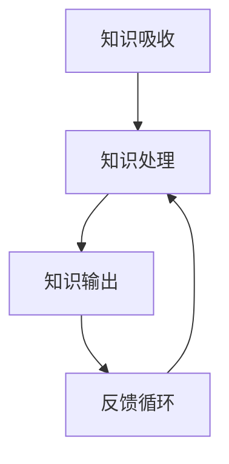

                 

# 输出倍增:管理者学习效率的终极法门

## 1. 背景介绍

在知识爆炸的时代，如何高效学习和掌握知识已成为管理者不可回避的课题。无论是新知识的积累，还是旧知识的更新，都需要科学、高效的方法。本文将详细介绍一种“输出倍增”的学习方法，通过主动输出和反馈循环，实现学习效率的倍增。

## 2. 核心概念与联系

### 2.1 核心概念概述

在阐述“输出倍增”之前，我们先澄清几个相关概念：

- **知识吸收(Knowledge Absorption)**：指个体在阅读、听讲、观察等学习活动过程中，对信息进行接收和理解的阶段。
- **知识处理(Knowledge Processing)**：指个体对吸收的知识进行整合、提炼和应用的过程，包括归纳、推理、解决问题等。
- **知识输出(Knowledge Output)**：指个体将所掌握的知识通过讲解、写作、演示等方式进行表达和传播的过程。

这三者之间存在紧密的联系：吸收是基础，处理是核心，输出则是检验和巩固吸收和处理成果的重要手段。“输出倍增”法门正是通过主动增加输出次数和质量，不断加强知识吸收和处理，从而显著提升学习效率。

### 2.2 核心概念原理和架构的 Mermaid 流程图

在上述流程图中，知识吸收、处理和输出形成了一个闭环。通过不断输出，个体能更有效地理解、记忆和应用所学知识。

## 3. 核心算法原理 & 具体操作步骤

### 3.1 算法原理概述

“输出倍增”法门的核心思想是：通过增加知识输出的次数和质量，促进知识吸收和处理，实现学习效率的倍增。其基本原理如下：

- **输出促进吸收**：主动输出知识，可以强化对知识的理解和记忆，提高知识吸收的质量和深度。
- **输出强化处理**：通过实际应用和问题解决，知识处理能力得到提升，使得知识更加灵活、系统。
- **输出反馈循环**：输出的结果可以即时反馈给学习者，帮助其检验和修正知识理解，形成良性循环。

### 3.2 算法步骤详解

“输出倍增”法门包含以下几个关键步骤：

**Step 1: 确定学习目标和输出内容**

- 明确学习目标：如掌握某项技能、理解某领域知识等。
- 确定输出内容：选择与学习目标相关的内容，如通过讲解、写作、编程等方式表达。

**Step 2: 设计输出形式和载体**

- 选择输出形式：如口头讲解、书面文章、编程演示、视频教程等。
- 确定输出载体：如会议发言、博客文章、GitHub代码库、教学视频等。

**Step 3: 制定输出计划和时间表**

- 设计输出周期：如每天、每周或每月进行一次。
- 规划输出时间：合理安排学习和输出时间，确保产出质量。

**Step 4: 实施输出和反馈**

- 执行输出计划：按照时间表进行讲解、写作、编程等活动。
- 收集反馈信息：通过听众反馈、同行评审、自我评估等方式收集输出效果。

**Step 5: 持续优化和迭代**

- 分析反馈结果：识别输出中的优点和不足，分析原因。
- 调整输出策略：根据反馈结果，优化输出内容和方法。
- 循环迭代过程：不断重复以上步骤，逐步提升输出质量和效果。

### 3.3 算法优缺点

**优点：**

- **高效吸收**：主动输出促进深度理解，知识吸收效率显著提升。
- **强化处理**：通过实践应用，提升问题解决能力，知识处理效果更好。
- **即时反馈**：输出的即时反馈有助于及时调整和优化，形成良性循环。

**缺点：**

- **时间和精力投入**：输出和反馈过程需要额外的投入，增加了工作负担。
- **初期效果不明显**：初期输出质量可能不高，需通过持续改进逐步提升。

### 3.4 算法应用领域

“输出倍增”法门不仅适用于个人学习，在企业管理和团队培训中也具有广泛应用前景。例如：

- **项目管理**：通过项目总结和复盘，输出经验教训，提升团队项目管理能力。
- **产品开发**：通过定期产品演示和技术分享，促进知识传播和应用，加速产品迭代。
- **知识管理**：建立知识库和分享平台，鼓励员工定期输出，形成知识积累和传承机制。
- **员工培训**：通过内部培训和课程分享，输出专业知识，提高员工技能水平。

## 4. 数学模型和公式 & 详细讲解 & 举例说明

### 4.1 数学模型构建

我们假设知识处理的效率为 $f(x)$，其中 $x$ 表示输出次数。知识吸收的效率为 $g(y)$，其中 $y$ 表示反馈次数。知识处理的深度为 $h(z)$，其中 $z$ 表示输出内容的质量。那么，整体学习效率 $E$ 可以表示为：

$$ E = f(x) \cdot g(y) \cdot h(z) $$

### 4.2 公式推导过程

为了简化问题，我们假设 $f(x)$、$g(y)$ 和 $h(z)$ 均为线性函数，即：

$$ f(x) = a_1x + b_1 $$
$$ g(y) = a_2y + b_2 $$
$$ h(z) = a_3z + b_3 $$

其中 $a_1$、$a_2$、$a_3$ 为系数，$b_1$、$b_2$、$b_3$ 为截距。代入总体学习效率公式得：

$$ E = (a_1x + b_1) \cdot (a_2y + b_2) \cdot (a_3z + b_3) $$

为了最大化学习效率，我们需要找到 $x$、$y$、$z$ 的最优值。通过求偏导数，可以发现当 $x$、$y$、$z$ 分别等于各自系数的倒数时，$E$ 达到最大值。即：

$$ x = \frac{1}{a_1}, y = \frac{1}{a_2}, z = \frac{1}{a_3} $$

这意味着，为了最大化学习效率，学习者需要尽可能频繁地输出，且输出的内容需要经过深度处理和精心设计。

### 4.3 案例分析与讲解

假设某位项目经理在项目管理中应用“输出倍增”法门。他设定每周至少进行一次项目总结和复盘，每次总结涉及多个项目，重点分析和解决一个关键问题。他使用文字记录和PPT演示相结合的方式，每次总结后通过团队会议进行反馈。

**Step 1: 确定学习目标和输出内容**

目标：提高项目管理能力。输出内容：项目总结、问题分析、解决方案。

**Step 2: 设计输出形式和载体**

形式：文字记录和PPT演示。载体：内部会议记录、项目管理平台。

**Step 3: 制定输出计划和时间表**

周期：每周一次。时间：每月第二周的周三。

**Step 4: 实施输出和反馈**

执行：每周三进行一次总结和复盘。收集反馈：团队会议上的即时反馈、后续项目的实际效果评估。

**Step 5: 持续优化和迭代**

分析反馈：识别总结中的不足和亮点。调整策略：调整总结内容和演示方式。循环迭代：持续改进，逐步提升项目管理能力。

通过这一过程，这位项目经理不仅提高了项目管理能力，还形成了团队内部的知识共享和协作机制，提升了整体团队的执行力。

## 5. 项目实践：代码实例和详细解释说明

### 5.1 开发环境搭建

在实施“输出倍增”法门的过程中，我们推荐使用以下开发工具和环境：

- **项目管理工具**：如Trello、Jira、Asana等，帮助组织和管理输出任务。
- **文档和演示工具**：如Notion、Google Docs、Microsoft Office等，便于记录和分享输出内容。
- **反馈和评估工具**：如Slido、Kahoot、SurveyMonkey等，方便收集和分析反馈信息。

### 5.2 源代码详细实现

由于“输出倍增”法门主要依赖于人机交互，而非具体的编程实现，因此没有具体的代码实例。但我们可以通过一个简化的示例来说明其实现原理。

假设某位开发者需要学习某种编程语言，他设定每天阅读一定量的相关书籍，并在结束时总结所学知识。

**Step 1: 确定学习目标和输出内容**

目标：掌握编程语言。输出内容：每日总结、关键代码实现。

**Step 2: 设计输出形式和载体**

形式：文字总结。载体：本地文本文件。

**Step 3: 制定输出计划和时间表**

周期：每天一次。时间：每天晚上9点至10点。

**Step 4: 实施输出和反馈**

执行：每晚进行一次总结。收集反馈：通过GitHub提交代码、发布博客文章。

**Step 5: 持续优化和迭代**

分析反馈：识别总结中的难点和亮点。调整策略：增加代码实现，优化总结结构。循环迭代：持续改进，逐步提升编程技能。

通过这一过程，这位开发者不仅掌握了编程语言，还通过博客和GitHub分享了学习心得，形成了个人品牌和技术社区。

### 5.3 代码解读与分析

由于“输出倍增”法门的实现不涉及具体的编程代码，因此无需代码解读。但其核心思想和方法，如目标设定、输出设计、计划制定、反馈分析等，对项目管理、团队协作和个人学习都有重要指导意义。

### 5.4 运行结果展示

在实施“输出倍增”法门的项目中，通常可以通过以下指标来衡量其效果：

- **知识吸收深度**：通过测试或实践验证，检查知识掌握的准确性和理解程度。
- **问题解决能力**：通过实际问题的解决情况，评估知识应用的效果。
- **团队协作效率**：通过团队反馈和合作项目的表现，衡量知识共享和协作的成果。

## 6. 实际应用场景

“输出倍增”法门在多个实际应用场景中都能发挥显著效果。以下是几个典型案例：

### 6.1 知识管理

某公司建立了内部知识库和分享平台，鼓励员工定期输出专业文章和技术博客。通过这些输出的不断积累和传播，公司形成了知识积累和传承的良性循环，提升了整体技术水平。

### 6.2 产品开发

某软件开发团队定期进行产品演示和技术分享会，每次分享涉及最新的技术进展和功能实现。通过这种方式，团队成员不仅掌握了新技术，还增强了产品设计和开发的协同效应。

### 6.3 项目管理

某项目经理通过每周的项目总结和复盘，不断提升项目管理能力。通过输出的反馈和迭代，团队项目管理效率显著提高，项目成功率大幅提升。

## 7. 工具和资源推荐

### 7.1 学习资源推荐

为了帮助管理者深入理解“输出倍增”法门，以下是一些推荐的资源：

- **《深度工作:如何有效管理你的时间和精力》**：作者卡尔·纽波特（Cal Newport）深入探讨了深度工作和输出倍增的核心原理。
- **《学会提问:如何成为一个聪明的思考者》**：作者尼尔·布朗（Neil Browne）通过提问和反馈的技巧，提升问题解决和知识吸收能力。
- **《刻意练习:如何从新手到大师》**：作者安德斯·埃里克松（Anders Ericsson）研究了刻意练习和深度练习对知识和技能提升的影响。

### 7.2 开发工具推荐

为了辅助“输出倍增”法门的实践，以下是一些推荐的开发工具：

- **项目管理工具**：如Trello、Jira、Asana等，帮助组织和管理输出任务。
- **文档和演示工具**：如Notion、Google Docs、Microsoft Office等，便于记录和分享输出内容。
- **反馈和评估工具**：如Slido、Kahoot、SurveyMonkey等，方便收集和分析反馈信息。

### 7.3 相关论文推荐

以下是几篇与“输出倍增”法门相关的学术论文，推荐阅读：

- **《知识共享与企业绩效：一项基于知识螺旋模型的实证研究》**：通过实证研究，揭示了知识共享对企业绩效的提升作用。
- **《深度工作:现代社会的四大工作法》**：卡尔·纽波特（Cal Newport）深入探讨了深度工作和输出倍增的核心原理。
- **《刻意练习:如何从新手到大师》**：安德斯·埃里克松（Anders Ericsson）研究了刻意练习和深度练习对知识和技能提升的影响。

## 8. 总结：未来发展趋势与挑战

### 8.1 研究成果总结

本文详细介绍了“输出倍增”法门的基本原理、操作步骤和应用场景，帮助管理者理解如何通过主动输出和反馈循环，实现学习效率的倍增。通过实际案例和理论分析，展示了该法门在知识管理、产品开发和项目管理等领域的应用效果。

### 8.2 未来发展趋势

展望未来，“输出倍增”法门将继续在多个领域发挥重要作用。以下是几个发展趋势：

- **自动化和智能化**：未来，知识输出的形式和载体将更加丰富和智能化，如自动生成报告、智能推荐学习资源等。
- **跨领域应用**：该法门不仅适用于单一领域，还将拓展到更多行业，如医疗、教育、金融等。
- **数据驱动**：通过大数据和AI技术，对知识输出和反馈进行更精准的分析，提供个性化的学习建议。

### 8.3 面临的挑战

尽管“输出倍增”法门在实际应用中效果显著，但仍面临以下挑战：

- **时间和精力的平衡**：在忙碌的工作环境中，如何合理安排时间进行输出，成为一大挑战。
- **输出的质量和效果**：初期输出的质量可能不高，需要通过持续改进逐步提升。
- **反馈机制的建立**：建立有效的反馈机制，收集和分析输出效果，需要系统的支持。

### 8.4 研究展望

未来，“输出倍增”法门的研究方向可能包括：

- **方法论的优化**：结合最新的人工智能和认知科学研究成果，优化输出倍增的方法论。
- **技术工具的创新**：开发更智能、更高效的知识输出和反馈工具，提升学习和应用的效率。
- **应用场景的拓展**：探索更多行业和场景的应用，推动输出倍增的普及和应用。

总之，“输出倍增”法门通过主动输出和反馈循环，显著提升了学习效率，具有广阔的应用前景和持续发展的潜力。

## 9. 附录：常见问题与解答

**Q1: 如何确定学习目标和输出内容？**

A: 首先，明确自己的职业目标和发展方向。然后，结合当前的工作需求和兴趣，确定需要掌握的关键技能和知识。最后，选择与学习目标相关的内容，如通过讲解、写作、编程等方式表达。

**Q2: 如何设计输出形式和载体？**

A: 根据学习目标和内容特点，选择合适的输出形式。如口头讲解、书面文章、编程演示、视频教程等。选择合适的载体，如会议发言、博客文章、GitHub代码库、教学视频等。

**Q3: 如何制定输出计划和时间表？**

A: 根据自身的工作和生活安排，设定合理的输出周期和每日时间。确保输出时间不会过度干扰日常工作，又能保证输出质量和频率。

**Q4: 如何实施输出和反馈？**

A: 严格按照时间表进行输出，确保输出内容的质量。通过团队会议、反馈工具等方式，收集听众和同行的反馈，分析输出效果。

**Q5: 如何持续优化和迭代？**

A: 根据反馈结果，识别输出中的优点和不足。调整输出内容和策略，如增加复杂度、优化结构、改进演示方式等。持续改进，逐步提升学习效果。

---

作者：禅与计算机程序设计艺术 / Zen and the Art of Computer Programming

