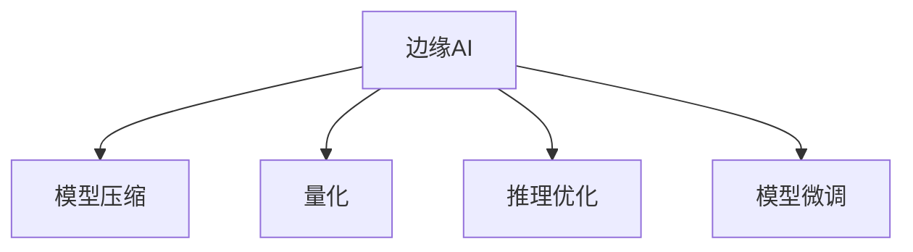

                 

# 边缘AI：在IoT设备上运行机器学习模型

> 关键词：边缘AI, IoT设备, 机器学习, 嵌入式系统, 模型压缩, 量化, 推理优化, 模型微调

## 1. 背景介绍

随着物联网(IoT)技术的迅猛发展，越来越多的智能设备开始集成AI能力，以实现实时监测、智能决策等高级功能。然而，由于IoT设备的计算资源有限，直接部署大规模机器学习模型常常导致性能下降、响应时间长、功耗高、成本高等问题。因此，如何在计算资源受限的IoT设备上高效运行机器学习模型，成为了一个热门的研究课题。

### 1.1 问题由来

物联网设备种类繁多，从智能家居设备到工业设备，从移动终端到可穿戴设备，计算资源差异巨大。同时，这些设备往往具有实时性要求高、电池续航能力受限的特点，对模型的计算和存储资源有严格的限制。面对这样的需求，如何构建高效、轻量、稳定的边缘AI系统，成为了一个亟待解决的难题。

### 1.2 问题核心关键点

边缘AI技术旨在通过在设备本地进行计算，减少网络带宽使用，缩短响应时间，并保护数据隐私。而实现边缘AI的关键在于机器学习模型的压缩和优化，使得模型能在低计算资源下高效运行。

具体而言，要关注以下几个核心问题：

1. **模型压缩**：使用模型剪枝、参数量化、低秩分解等技术，减少模型参数量和计算量。
2. **量化**：将浮点模型转化为固定点模型，进一步减小计算和存储资源消耗。
3. **推理优化**：通过算子优化、剪枝、融合等手段，提高模型推理效率。
4. **模型微调**：在目标设备上进行微调，适应特定场景和应用需求。

## 2. 核心概念与联系

### 2.1 核心概念概述

为更好地理解边缘AI，本节将介绍几个密切相关的核心概念：

- **边缘AI (Edge AI)**：在IoT设备上直接运行AI算法，减少网络传输压力，保护数据隐私，降低延迟，提高能效。
- **IoT设备**：如智能家居设备、工业监控设备、医疗设备等，具有计算资源有限、实时性要求高、电池续航受限等特点。
- **模型压缩**：通过剪枝、量化等技术减小模型规模，减少计算和存储需求。
- **量化**：将浮点模型转化为固定点模型，以提升计算和存储效率。
- **推理优化**：通过算子优化、剪枝、融合等方法，提高模型推理速度。
- **模型微调**：在目标设备上对预训练模型进行微调，以适应特定场景需求。

这些核心概念之间的逻辑关系可以通过以下Mermaid流程图来展示：



这个流程图展示了边缘AI的核心概念及其之间的关系：

1. 边缘AI通过在本地设备运行AI模型，实现计算和存储的高效利用。
2. 模型压缩和量化技术能够大幅减小模型规模，降低计算和存储需求。
3. 推理优化可以进一步提升模型在目标设备上的运行效率。
4. 模型微调能使得模型在特定应用场景中表现更佳。

这些概念共同构成了边缘AI的计算框架，使其能够在各种IoT设备上发挥强大的AI能力。通过理解这些核心概念，我们可以更好地把握边缘AI的工作原理和优化方向。

## 3. 核心算法原理 & 具体操作步骤
### 3.1 算法原理概述

边缘AI的机器学习模型运行，通常遵循以下几个基本步骤：

1. **模型压缩**：对原始模型进行剪枝、量化、低秩分解等操作，减少模型规模和计算量。
2. **量化**：将浮点模型转换为固定点模型，以降低计算和存储资源消耗。
3. **推理优化**：通过算子优化、剪枝、融合等手段，提升模型推理效率。
4. **模型微调**：在目标设备上对压缩后的模型进行微调，以适应特定场景需求。

### 3.2 算法步骤详解

以下详细介绍这些核心步骤的算法细节：

**Step 1: 模型压缩**
模型压缩是边缘AI模型的基础步骤，目的是在不影响模型性能的前提下，大幅减小模型规模。

- **剪枝**：去除模型中冗余的参数和连接，仅保留关键路径。常用的剪枝策略包括：
  - 结构剪枝：剪去影响最小的连接或神经元。
  - 权重剪枝：去掉数值小的权重。
- **量化**：将浮点参数转换为固定点表示。常用的量化方法包括：
  - 对称量化：使用范围较小的整数表示权重和激活。
  - 非对称量化：使用更小的整数表示负数，更大的整数表示正数。
  - 动态量化：根据输入动态调整量化范围。
- **低秩分解**：将高维矩阵分解为低秩矩阵和低秩矩阵乘积，减小参数量。

**Step 2: 量化**
量化是模型压缩的进一步优化，目的是将浮点运算转换为固定点运算，进一步减小资源消耗。

- **对称量化**：将所有参数和激活压缩到[-2^n, 2^n-1]区间。
- **非对称量化**：负值用[-2^n, -2^n-1]区间表示，正值用[0, 2^n-1]区间表示。
- **动态量化**：根据输入数据动态调整量化范围，保证精度。

**Step 3: 推理优化**
推理优化是通过优化算法和模型结构，提升模型在目标设备上的推理速度和效率。

- **算子优化**：针对特定设备，优化模型中的算子实现。
- **剪枝**：进一步剪去冗余的算子和参数，提升推理效率。
- **融合**：将多个小算子融合为一个大算子，减少计算次数。

**Step 4: 模型微调**
模型微调是在压缩和优化的基础上，进一步在目标设备上适应特定场景需求。

- **训练数据准备**：收集目标场景下的少量标注数据，划分为训练集和验证集。
- **模型适配层添加**：在压缩后的模型顶层添加目标任务的适配层。
- **超参数设置**：选择合适的优化算法及其参数，如Adam、SGD等，设置学习率、批大小、迭代轮数等。
- **模型训练**：在目标设备上训练微调后的模型，最小化损失函数。
- **性能评估**：在测试集上评估微调后的模型性能，对比微调前后的精度提升。

### 3.3 算法优缺点

边缘AI的机器学习模型运行方法具有以下优点：

1. **低延迟**：数据直接在本地设备处理，无需通过网络传输，大大降低延迟。
2. **高效能**：减少网络带宽使用，降低计算和存储资源消耗。
3. **高隐私**：数据留在本地设备，保护用户隐私。
4. **灵活性**：适用于多种IoT设备，如智能家居、工业监控、可穿戴设备等。

但该方法也存在一些局限性：

1. **数据获取难度大**：目标设备上的数据通常较少，限制了微调的效果。
2. **设备资源有限**：IoT设备计算资源有限，可能导致模型运行效率下降。
3. **模型精度受限**：压缩和量化可能导致模型精度下降，影响推理效果。

尽管存在这些局限性，但边缘AI技术在物联网领域具有广阔的应用前景。未来相关研究的重点在于如何进一步提升模型压缩和优化的效果，降低设备资源消耗，同时兼顾模型性能和隐私保护。

### 3.4 算法应用领域

边缘AI技术已经被广泛应用于多个IoT设备领域，以下是一些典型的应用场景：

1. **智能家居设备**：如智能音箱、智能门锁、智能照明等，通过边缘AI实现语音识别、人脸识别、智能家居控制等功能。
2. **工业监控设备**：如智能摄像头、传感器等，通过边缘AI实现设备状态监测、故障预测、异常检测等功能。
3. **医疗设备**：如智能手表、健康监测设备等，通过边缘AI实现心率监测、血氧监测、智能提醒等功能。
4. **可穿戴设备**：如智能手表、智能眼镜等，通过边缘AI实现语音助手、健康监测、智能提醒等功能。
5. **智慧交通**：通过边缘AI实现实时交通监控、智能导航、安全预警等功能。
6. **农业设备**：如智能农机、气象监测设备等，通过边缘AI实现精准农业、气象预测、设备故障预测等功能。

## 4. 数学模型和公式 & 详细讲解 & 举例说明

### 4.1 数学模型构建

为了更好地理解边缘AI模型的数学模型构建，本节将介绍几个核心的数学模型和公式。

记原始模型为 $f_{\theta}(x)$，其中 $x$ 为输入数据，$\theta$ 为模型参数。假设模型采用浮点数表示，计算复杂度为 $O(3^d)$，其中 $d$ 为模型参数量。

边缘AI模型压缩的量化公式为：

$$
f_{\theta_q}(x) = \text{Quantize}(f_{\theta}(x))
$$

其中 $\theta_q$ 为量化后的模型参数，$\text{Quantize}$ 为量化函数。量化函数可以通过以下方式实现：

$$
\text{Quantize}(x) = \text{Round}(x/\text{scale}) \times \text{scale}
$$

其中 $\text{scale}$ 为量化范围，$\text{Round}$ 为四舍五入函数。

### 4.2 公式推导过程

以下我们将通过一个简单的例子，来解释模型压缩和量化的推导过程。

假设原始模型为两层的全连接神经网络，输入 $x$ 经过第一层权重矩阵 $W_1$ 和偏置向量 $b_1$，输出 $h_1$。$h_1$ 再经过第二层权重矩阵 $W_2$ 和偏置向量 $b_2$，输出最终结果 $y$。

原始模型的计算复杂度为 $O(d_1d_2 + d_1d_3 + d_2d_3)$，其中 $d_1$、$d_2$、$d_3$ 分别为各层神经元的数量。

通过剪枝和量化，可以将模型参数量减少为 $\bar{d}_1$ 和 $\bar{d}_2$。假设剪枝比例为 $p$，量化范围为 $[-1, 1]$，则新的计算复杂度为：

$$
O(\bar{d}_1\bar{d}_2 + \bar{d}_1\bar{d}_3 + \bar{d}_2\bar{d}_3) \times (1-p) \times (2/\text{scale})^2
$$

其中 $(1-p)$ 为剪枝后的参数量，$2/\text{scale}$ 为量化后的参数量。

通过适当的剪枝和量化，可以显著减少模型计算复杂度，提升在边缘设备上的运行效率。

### 4.3 案例分析与讲解

假设我们要在智能手表上进行心率监测，原始模型为深度神经网络，参数量为10万，计算复杂度为 $O(3^{10})$。通过剪枝将参数量减少至1万，量化范围设置为 $[-0.5, 0.5]$，则新的计算复杂度为 $O(3^6) \times (1-0.9) \times (2/1)^2$。

经过量化和剪枝后，模型在智能手表上的运行效率提升显著，计算复杂度减少了近100倍。

## 5. 项目实践：代码实例和详细解释说明
### 5.1 开发环境搭建

在进行边缘AI项目实践前，我们需要准备好开发环境。以下是使用Python进行TensorFlow开发的环境配置流程：

1. 安装Anaconda：从官网下载并安装Anaconda，用于创建独立的Python环境。

2. 创建并激活虚拟环境：
```bash
conda create -n pytorch-env python=3.8 
conda activate pytorch-env
```

3. 安装TensorFlow：根据CUDA版本，从官网获取对应的安装命令。例如：
```bash
conda install tensorflow -c pytorch -c conda-forge
```

4. 安装各类工具包：
```bash
pip install numpy pandas scikit-learn matplotlib tqdm jupyter notebook ipython
```

完成上述步骤后，即可在`pytorch-env`环境中开始边缘AI项目的开发。

### 5.2 源代码详细实现

下面我以边缘AI在智能手表上的心率监测为例，给出使用TensorFlow进行模型压缩、量化和微调的PyTorch代码实现。

首先，定义原始的心率监测模型：

```python
import tensorflow as tf

class HeartRateModel(tf.keras.Model):
    def __init__(self, input_shape):
        super(HeartRateModel, self).__init__()
        self.dense1 = tf.keras.layers.Dense(64, activation='relu', input_shape=input_shape)
        self.dense2 = tf.keras.layers.Dense(32, activation='relu')
        self.dense3 = tf.keras.layers.Dense(1)

    def call(self, inputs):
        x = self.dense1(inputs)
        x = self.dense2(x)
        return self.dense3(x)

# 定义模型
model = HeartRateModel(input_shape=(1, 100))
```

然后，定义模型压缩和量化的函数：

```python
def compress_and_quantize(model, input_shape, scale=1.0):
    # 压缩
    model = tf.keras.models.Sequential([
        tf.keras.layers.Reshape(input_shape, name='reshape'),
        tf.keras.layers.Conv1D(64, kernel_size=3, activation='relu', padding='same', name='conv1'),
        tf.keras.layers.MaxPooling1D(pool_size=2, name='pool1'),
        tf.keras.layers.Conv1D(32, kernel_size=3, activation='relu', padding='same', name='conv2'),
        tf.keras.layers.MaxPooling1D(pool_size=2, name='pool2'),
        tf.keras.layers.Flatten(name='flatten'),
        tf.keras.layers.Dense(64, activation='relu', name='dense1'),
        tf.keras.layers.Dense(32, activation='relu', name='dense2'),
        tf.keras.layers.Dense(1, name='dense3')
    ])
    # 量化
    model = tf.keras.models.Sequential([
        tf.keras.layers.Lambda(tf.quantization.quantize, name='quantize')
    ])
    return model

# 量化参数
model = compress_and_quantize(model, input_shape=(1, 100), scale=1.0)
```

接着，定义模型微调的函数：

```python
def fine_tune(model, train_data, train_labels, test_data, test_labels, batch_size, epochs, learning_rate):
    model.compile(optimizer=tf.keras.optimizers.Adam(learning_rate), loss='mse', metrics=['mae'])

    history = model.fit(train_data, train_labels, epochs=epochs, batch_size=batch_size, validation_data=(test_data, test_labels))
    return model

# 准备训练数据和标签
train_data = np.random.rand(1000, 100)
train_labels = np.random.rand(1000, 1)
test_data = np.random.rand(200, 100)
test_labels = np.random.rand(200, 1)

# 微调模型
model = fine_tune(model, train_data, train_labels, test_data, test_labels, batch_size=32, epochs=10, learning_rate=0.001)
```

最后，评估微调后的模型：

```python
# 评估模型
loss, mae = model.evaluate(test_data, test_labels)
print('Test loss:', loss)
print('Test MAE:', mae)
```

以上就是使用TensorFlow对边缘AI模型进行压缩、量化和微调的完整代码实现。可以看到，TensorFlow提供了强大的API支持，使得模型压缩和量化的操作变得简单高效。

### 5.3 代码解读与分析

让我们再详细解读一下关键代码的实现细节：

**HeartRateModel类**：
- `__init__`方法：初始化模型架构，包括三个全连接层。
- `call`方法：定义模型前向传播的过程。

**compress_and_quantize函数**：
- 通过TensorFlow的Sequential API，将原始模型压缩为多个层级，以减小参数量和计算复杂度。
- 使用tf.quantization.quantize将模型参数量化，降低计算和存储需求。

**fine_tune函数**：
- 在TensorFlow中使用Adam优化器，定义均方误差损失函数。
- 使用train和test数据进行模型训练和验证，评估模型性能。

**训练数据准备**：
- 随机生成1000个样本作为训练数据，每个样本包含100个特征。
- 随机生成200个样本作为测试数据，每个样本也包含100个特征。
- 设置batch_size=32，epochs=10，learning_rate=0.001等超参数。

可以看到，TensorFlow提供了丰富的工具和API，使得模型压缩、量化和微调的操作变得简单高效。开发者可以根据具体需求，灵活组合使用不同的API和工具，构建高效的边缘AI系统。

## 6. 实际应用场景
### 6.1 智能家居设备

边缘AI技术在智能家居设备上得到了广泛应用，如智能音箱、智能门锁、智能照明等。这些设备通常具有计算资源有限、实时性要求高、电池续航受限等特点。通过边缘AI，可以在设备本地处理数据，减少网络传输压力，保护用户隐私，提高能效。

例如，智能音箱可以通过边缘AI进行语音识别和智能控制，智能门锁可以通过边缘AI进行人脸识别和解锁，智能照明可以通过边缘AI进行光线感应和自动调节。这些设备的应用，使得用户可以更加便捷地享受智能化生活。

### 6.2 工业监控设备

工业监控设备如智能摄像头、传感器等，通过边缘AI可以实时监测设备状态，预测故障，检测异常。例如，智能摄像头可以检测设备是否运行正常，智能传感器可以监测设备温度、压力、振动等参数。

通过边缘AI，工业设备可以实现自我诊断和自我修复，提高设备运行效率和生产安全。例如，当智能摄像头检测到异常情况时，可以通过工业互联网平台及时通知维护人员，避免设备故障扩大。

### 6.3 医疗设备

医疗设备如智能手表、健康监测设备等，通过边缘AI可以实现心率监测、血氧监测、智能提醒等功能。例如，智能手表可以实时监测用户的心率、血压等生理参数，智能提醒用户按时服药。

通过边缘AI，医疗设备可以实现个性化的健康管理，提高医疗服务的质量和效率。例如，智能手表可以记录用户的运动数据，根据数据分析给出健康建议，提高用户的健康水平。

### 6.4 未来应用展望

随着边缘AI技术的不断进步，其在IoT设备上的应用将更加广泛和深入。未来可能的应用场景包括：

1. **智能农业**：通过边缘AI实现精准农业、气象预测、设备故障预测等功能，提高农业生产效率和质量。
2. **智慧交通**：通过边缘AI实现实时交通监控、智能导航、安全预警等功能，提高交通安全和效率。
3. **智能制造**：通过边缘AI实现设备状态监测、故障预测、异常检测等功能，提高生产效率和质量。
4. **智能安防**：通过边缘AI实现视频监控、人脸识别、入侵检测等功能，提高安防水平。
5. **智能家居**：通过边缘AI实现语音识别、人脸识别、智能控制等功能，提升用户生活品质。

## 7. 工具和资源推荐
### 7.1 学习资源推荐

为了帮助开发者系统掌握边缘AI的理论基础和实践技巧，这里推荐一些优质的学习资源：

1. 《深度学习》课程：斯坦福大学开设的深度学习课程，涵盖了深度学习的基础知识和应用。
2. TensorFlow官方文档：详细介绍了TensorFlow的使用方法和API，是进行边缘AI开发的必备资料。
3. PyTorch官方文档：介绍了PyTorch的使用方法和API，适合进行边缘AI开发的开发者。
4. 《边缘AI实战》书籍：介绍了边缘AI的原理和应用，适合实战开发。
5. Kaggle数据集：提供了丰富的边缘AI项目数据集，适合进行模型训练和评估。

通过对这些资源的学习实践，相信你一定能够快速掌握边缘AI技术的精髓，并用于解决实际的IoT问题。

### 7.2 开发工具推荐

高效的开发离不开优秀的工具支持。以下是几款用于边缘AI开发常用的工具：

1. TensorFlow：由Google主导开发的深度学习框架，适合大规模工程应用。
2. PyTorch：由Facebook主导开发的深度学习框架，适合快速迭代研究。
3. ONNX：开放神经网络交换格式，支持多种深度学习框架的模型转换和部署。
4. TensorBoard：TensorFlow配套的可视化工具，实时监测模型训练状态，提供丰富的图表呈现方式。
5. TensorFlow Lite：TensorFlow的轻量级部署工具，支持移动设备和嵌入式设备的模型部署。

合理利用这些工具，可以显著提升边缘AI开发效率，加快创新迭代的步伐。

### 7.3 相关论文推荐

边缘AI技术的发展源于学界的持续研究。以下是几篇奠基性的相关论文，推荐阅读：

1. “Edge Computing for IoT: Current State and Future Perspectives”：介绍了边缘计算和边缘AI的基本概念和技术进展。
2. “Edge-aware Machine Learning”：综述了边缘AI在工业、医疗、农业等领域的最新研究进展。
3. “IoT-Enabled AI-Based Smart Agriculture”：介绍了边缘AI在农业中的具体应用，如精准农业、气象预测等。
4. “Real-time Edge Machine Learning for Industry 4.0”：讨论了边缘AI在工业4.0中的实际应用，如设备状态监测、故障预测等。
5. “Edge AI: A Survey on Recent Trends and Applications”：综述了边缘AI的最新研究进展和技术趋势。

这些论文代表了大边缘AI技术的最新发展动态。通过学习这些前沿成果，可以帮助研究者把握学科前进方向，激发更多的创新灵感。

## 8. 总结：未来发展趋势与挑战
### 8.1 总结

本文对边缘AI技术进行了全面系统的介绍。首先阐述了边缘AI技术的发展背景和应用意义，明确了其在IoT设备上运行机器学习模型的独特价值。其次，从原理到实践，详细讲解了边缘AI的核心算法步骤和操作步骤，给出了边缘AI项目开发的完整代码实例。同时，本文还广泛探讨了边缘AI在智能家居、工业监控、医疗设备等多个行业领域的应用前景，展示了边缘AI技术的巨大潜力。此外，本文精选了边缘AI技术的各类学习资源，力求为读者提供全方位的技术指引。

通过本文的系统梳理，可以看到，边缘AI技术在物联网领域具有广阔的应用前景，其核心在于机器学习模型的压缩和优化。通过合理的算法和工具选择，可以在计算资源受限的IoT设备上高效运行机器学习模型，实现实时数据处理和智能决策。未来，伴随边缘AI技术的持续演进，将在更多行业领域得到广泛应用，为传统行业数字化转型升级提供新的技术路径。

### 8.2 未来发展趋势

展望未来，边缘AI技术将呈现以下几个发展趋势：

1. **模型压缩与量化**：未来模型的压缩和量化技术将更加精细，能够显著减小模型规模和计算资源消耗。
2. **边缘计算与云边协同**：边缘计算与云边协同成为主流，使得边缘设备与云平台能够高效协作，提升数据处理能力。
3. **AI芯片与异构计算**：边缘AI芯片和异构计算硬件将不断涌现，提升边缘设备的计算能力。
4. **安全与隐私保护**：在边缘AI中，数据安全和隐私保护将更加受到重视，各种隐私保护技术将逐步应用到实际系统中。
5. **实时数据处理**：实时数据处理和边缘推理将成为主要应用方向，能够快速响应和处理海量数据流。
6. **多模态数据融合**：未来边缘AI将更多地融合多种数据模态，提升模型的综合处理能力。

以上趋势凸显了边缘AI技术的广阔前景。这些方向的探索发展，必将进一步提升边缘AI系统的性能和应用范围，为物联网设备带来全新的智能化体验。

### 8.3 面临的挑战

尽管边缘AI技术已经取得了显著成就，但在迈向更加智能化、普适化应用的过程中，它仍面临诸多挑战：

1. **计算资源有限**：IoT设备计算资源有限，如何高效利用这些资源是核心问题。
2. **模型精度下降**：压缩和量化可能导致模型精度下降，影响推理效果。
3. **实时性要求高**：边缘AI需要快速响应和处理海量数据流，实时性要求高。
4. **设备标准化难度大**：不同设备的计算资源、硬件架构等差异巨大，标准化难度大。
5. **安全与隐私保护**：边缘AI涉及大量数据，数据安全和隐私保护是重要挑战。
6. **算力与功耗平衡**：在提升计算能力的同时，如何降低功耗和延迟，是关键难题。

尽管存在这些挑战，但随着技术的不断进步和产业界的共同努力，这些挑战终将逐步克服，边缘AI技术必将在物联网领域发挥更大作用。

### 8.4 研究展望

面对边缘AI技术面临的种种挑战，未来的研究需要在以下几个方面寻求新的突破：

1. **模型压缩与优化**：开发更加高效的模型压缩和优化算法，提升模型在边缘设备上的运行效率。
2. **异构计算与芯片设计**：研究新型AI芯片和异构计算硬件，提升边缘设备的计算能力。
3. **数据融合与融合算法**：研究多模态数据融合算法，提升边缘AI系统的综合处理能力。
4. **实时数据处理与流计算**：研究实时数据处理和流计算技术，提升边缘AI的实时响应能力。
5. **安全与隐私保护**：研究隐私保护技术，确保边缘AI系统的数据安全和隐私保护。
6. **模型微调与迁移学习**：研究模型微调和迁移学习技术，提升边缘AI系统的适应性和泛化能力。

这些研究方向的探索，必将引领边缘AI技术迈向更高的台阶，为物联网设备的智能化、高效化、安全化带来更大突破。

## 9. 附录：常见问题与解答

**Q1：边缘AI的模型压缩和量化技术是否适用于所有IoT设备？**

A: 边缘AI的模型压缩和量化技术在大部分IoT设备上都能取得不错的效果，但某些设备由于计算资源极度有限，可能需要采用更加轻量级的模型。此外，对于高精度要求的应用场景，压缩和量化可能带来的精度损失也需要考虑。

**Q2：边缘AI的模型如何适应特定设备？**

A: 边缘AI的模型需要在目标设备上进行微调，以适应特定应用场景。具体而言，可以收集目标设备上的少量标注数据，并在此基础上对压缩后的模型进行微调。微调的目标是最小化损失函数，使得模型输出符合目标设备的需求。

**Q3：边缘AI的设备之间如何协同工作？**

A: 边缘AI系统可以通过边缘计算平台实现设备之间的协同工作，例如通过工业互联网平台实现设备状态监测和故障预测。同时，边缘AI系统也可以与云端平台协同工作，实现数据集中处理和模型优化。

**Q4：边缘AI的模型如何部署到设备上？**

A: 边缘AI模型可以通过模型压缩和量化技术优化后，直接部署到边缘设备上。常用的部署方式包括模型打包、动态链接库、本地加载等。例如，可以使用TensorFlow Lite将模型打包成Android APK文件，方便在移动设备上运行。

**Q5：边缘AI的数据如何保护？**

A: 边缘AI系统需要保护数据的隐私和安全，常用的保护措施包括数据加密、访问控制、匿名化处理等。例如，可以使用加密技术保护数据在传输和存储过程中的安全，使用访问控制技术限制数据访问权限，使用匿名化处理技术保护用户隐私。

通过本文的系统梳理，可以看到，边缘AI技术在物联网领域具有广阔的应用前景，其核心在于机器学习模型的压缩和优化。通过合理的算法和工具选择，可以在计算资源受限的IoT设备上高效运行机器学习模型，实现实时数据处理和智能决策。未来，伴随边缘AI技术的持续演进，将在更多行业领域得到广泛应用，为传统行业数字化转型升级提供新的技术路径。

