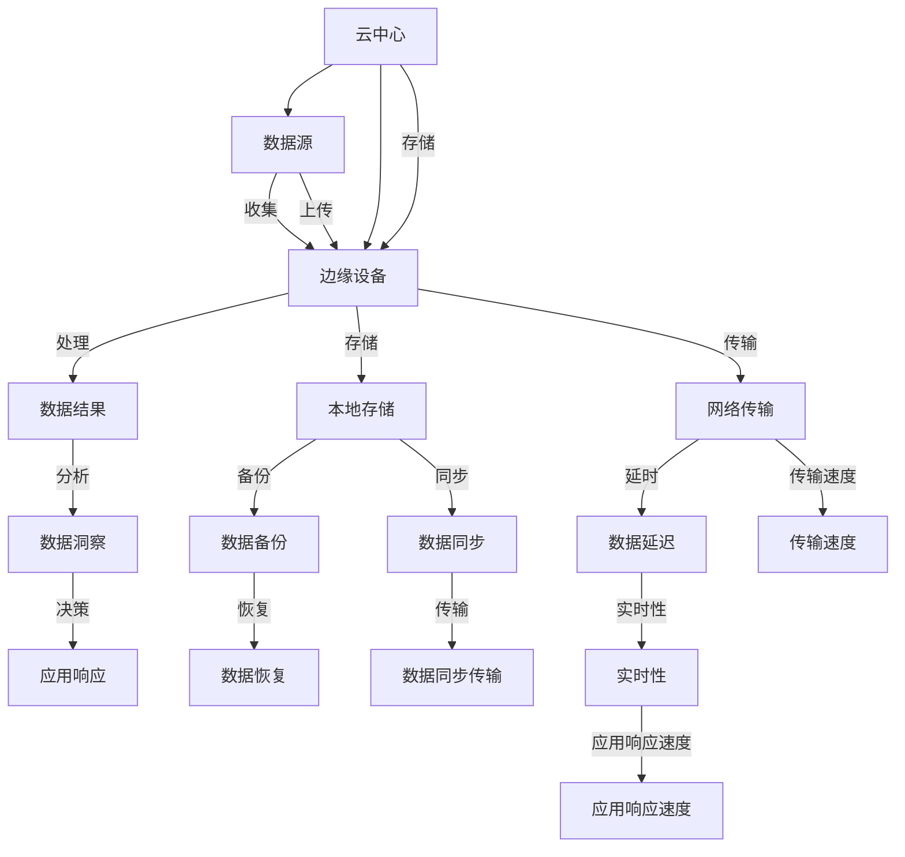

                 

# 边缘计算优势：在设备端进行数据处理

> 关键词：边缘计算, 设备端, 数据处理, 云计算, 物联网, 分布式系统, 实时性, 安全性, 隐私保护

## 1. 背景介绍

在数字化时代的浪潮中，数据逐渐成为推动社会进步和经济增长的重要驱动力。无论是电商交易、社交媒体，还是智能交通、医疗诊断，都离不开海量数据的收集、存储、处理和分析。然而，数据处理的核心任务却越来越集中在云中心，导致云服务提供商面临着巨大的计算资源需求，同时数据在传输过程中也面临着安全风险和效率瓶颈。为了解决这些问题，边缘计算技术应运而生，成为新一代数据处理范式。

### 1.1 数据处理困境

当前数据处理主要依赖于中心化数据中心，这种集中式数据处理模式带来了以下问题：

- **计算资源瓶颈**：随着数据量的不断增加，集中式数据中心需要处理的数据量呈指数级增长。数据中心的计算资源需求越来越高，而云计算服务提供商面临成本和能耗的巨大压力。
- **数据传输延迟**：集中式数据处理需要将数据从本地设备传输到数据中心进行处理，数据传输过程中不可避免地存在延迟。对于实时性要求高的应用场景，数据延迟会严重影响用户体验。
- **数据隐私风险**：集中式数据存储使得数据可能被非法访问和窃取，尤其是在公共云环境中，数据的隐私和安全风险尤为突出。

### 1.2 边缘计算优势

边缘计算通过将数据处理任务分布到靠近数据源的边缘设备上，从根本上缓解了上述困境。边缘计算技术具有以下优势：

- **计算资源分散**：边缘设备通常拥有较强的计算能力，可以就近处理数据，减少对云中心资源的依赖。
- **降低数据传输延迟**：边缘计算减少了数据传输的物理距离，降低了数据传输的延迟，提高了应用的实时性。
- **提升数据隐私安全性**：边缘计算减少了数据传输的环节，减少了数据泄露的风险，提升了数据隐私安全性。
- **增强系统可扩展性**：边缘计算体系可以通过增加边缘设备的数量来扩展系统的计算能力，适应不断增长的数据处理需求。

边缘计算的核心思想是将数据处理任务分布到边缘设备上，使得数据处理更加灵活、高效、安全。本文将从核心概念、算法原理、应用场景和未来趋势等方面，深入探讨边缘计算的优势和应用价值。

## 2. 核心概念与联系

### 2.1 核心概念概述

为了更好地理解边缘计算的优势，本节将介绍几个关键概念及其相互之间的联系。

- **边缘计算(Edge Computing)**：在靠近数据源的地方进行数据处理，即在网络边缘进行计算，使得数据能够更快速地处理和分析，减少延迟，提升实时性。
- **云中心(Cloud Computing)**：集中式数据处理模式，数据全部存储在云端，需要从本地设备传输到云端进行处理。
- **物联网(IoT)**：通过传感器、智能设备等将物理世界数字化，实现数据的收集和传输。
- **分布式系统(Distributed System)**：由多个地理位置分散的计算节点组成，协同处理数据。
- **实时性(Real-time)**：系统能够即时响应外部请求，满足实时性要求。
- **安全性(Security)**：保护系统免受未授权的访问和攻击，保障数据隐私和安全。

这些概念之间通过数据传输、计算资源、数据隐私等纽带紧密相连，共同构成了现代数据处理体系的基础框架。

### 2.2 核心概念原理和架构的 Mermaid 流程图



## 3. 核心算法原理 & 具体操作步骤

### 3.1 算法原理概述

边缘计算的核心算法原理是分布式计算和本地数据处理。其基本思路是将数据处理任务分解成多个子任务，并将这些子任务分布到靠近数据源的边缘设备上进行处理。以下是对边缘计算算法的总体框架描述：

1. **数据收集与传输**：将边缘设备上的数据收集起来，并传输到云中心或其他边缘设备上进行存储和分析。
2. **数据处理与分析**：在边缘设备上执行数据处理任务，如数据清洗、特征提取、机器学习模型训练等。
3. **结果汇聚与共享**：将处理后的结果汇聚到云中心或其他边缘设备，共享给其他应用系统使用。

### 3.2 算法步骤详解

边缘计算的具体操作步骤如下：

1. **数据收集**：边缘设备从本地传感器、智能设备等收集数据，并将其传输到云端或其他边缘设备。
2. **数据预处理**：对收集到的原始数据进行预处理，如去除噪声、缺失值处理等，以便后续分析。
3. **数据存储**：将预处理后的数据存储在云端或其他边缘设备上。
4. **模型训练与推理**：在边缘设备上训练机器学习模型，并使用该模型对数据进行推理和预测。
5. **结果传输**：将模型推理的结果传输到云端或其他边缘设备，供其他应用系统使用。
6. **应用响应**：根据模型推理结果，做出相应的应用响应，如决策、控制等。

### 3.3 算法优缺点

边缘计算算法具有以下优点：

- **高效性**：边缘计算减少了数据传输的延迟，提高了数据处理的实时性和效率。
- **安全性**：边缘计算减少了数据传输环节，降低了数据泄露的风险，提升了数据隐私安全性。
- **可靠性**：边缘计算通过分布式系统设计，提升了系统的可靠性和容错能力。
- **可扩展性**：边缘计算可以通过增加边缘设备来扩展系统的计算能力，适应不断增长的数据处理需求。

同时，边缘计算算法也存在以下缺点：

- **资源限制**：边缘设备的计算资源和存储空间有限，可能无法处理大规模数据集。
- **维护复杂性**：边缘计算系统需要更多的维护和监控，以确保系统的稳定性和安全性。
- **网络带宽需求**：边缘计算需要较高的网络带宽，以支持数据传输和模型推理。

### 3.4 算法应用领域

边缘计算的应用领域非常广泛，包括但不限于以下几个方面：

- **智能制造**：在工厂内部署边缘计算设备，对生产设备进行监控和控制，提升生产效率和质量。
- **智慧城市**：在城市基础设施中部署边缘计算设备，实时监测交通、环境等数据，优化城市管理。
- **医疗健康**：在医疗设备中部署边缘计算设备，实时监测患者健康数据，辅助医生进行诊断和治疗。
- **智能家居**：在智能家居设备中部署边缘计算设备，实现智能化的家居控制和管理。
- **智能农业**：在农业设备中部署边缘计算设备，实时监测土壤、气象等数据，优化农业生产。
- **智慧物流**：在物流设备中部署边缘计算设备，实时监测货物状态，优化物流运输路线和效率。

## 4. 数学模型和公式 & 详细讲解 & 举例说明

### 4.1 数学模型构建

在边缘计算中，数据处理的任务通常可以抽象为分布式优化问题。假设系统中有 $N$ 个边缘设备，每个设备处理的数据量为 $x_i$，处理的损失函数为 $f_i(x_i)$。目标是最小化所有设备的总损失函数 $F(x)=\sum_{i=1}^N f_i(x_i)$。

### 4.2 公式推导过程

为了求解最小化问题 $F(x)=\sum_{i=1}^N f_i(x_i)$，可以使用分布式梯度下降算法。假设系统中的设备具有不同的计算能力和通信延迟，设备 $i$ 的计算速度为 $c_i$，通信延迟为 $d_i$。则设备 $i$ 的更新方程为：

$$
x_i^{t+1} = x_i^t - \alpha \nabla f_i(x_i^t) + \delta_t \quad \text{其中} \quad \delta_t = \frac{1}{N}\sum_{i=1}^N \nabla f_i(x_i^t) - \frac{1}{N}\sum_{i=1}^N c_i \nabla f_i(x_i^t)
$$

其中，$\alpha$ 为学习率，$\delta_t$ 为分布式更新的方向。

### 4.3 案例分析与讲解

以下是一个简单的边缘计算案例，用于说明分布式梯度下降算法的实际应用。

假设系统中有两个边缘设备 A 和 B，处理的数据量分别为 $x_A=10$ 和 $x_B=5$，每个设备的损失函数分别为 $f_A(x)=x_A^2$ 和 $f_B(x)=x_B^2$。目标是最小化总损失函数 $F(x)=f_A(x)+f_B(x)$。

根据上述公式，设备 A 的更新方程为：

$$
x_A^{t+1} = x_A^t - \alpha \nabla f_A(x_A^t) + \delta_t \quad \text{其中} \quad \delta_t = \frac{1}{2}\nabla f_A(x_A^t) + \frac{1}{2}\nabla f_B(x_B^t)
$$

设备 B 的更新方程为：

$$
x_B^{t+1} = x_B^t - \alpha \nabla f_B(x_B^t) + \delta_t \quad \text{其中} \quad \delta_t = \frac{1}{2}\nabla f_A(x_A^t) + \frac{1}{2}\nabla f_B(x_B^t)
$$

通过不断迭代计算，最终两个设备会收敛到相同的最优解 $x_A^*=x_B^*=\frac{1}{2\alpha}$。

## 5. 项目实践：代码实例和详细解释说明

### 5.1 开发环境搭建

边缘计算的开发环境搭建需要考虑以下因素：

- **硬件设备**：选择具有高性能计算能力和大容量存储的硬件设备，如边缘服务器、IoT设备等。
- **软件工具**：选择合适的软件工具和框架，如 TensorFlow、PyTorch、Kubernetes 等，支持分布式计算和边缘计算。
- **云平台**：选择支持边缘计算的云平台，如 AWS IoT、Azure IoT Hub 等，提供边缘设备的管理和调度功能。

### 5.2 源代码详细实现

以下是一个简单的 Python 代码示例，用于在边缘设备上训练一个简单的线性回归模型：

```python
import tensorflow as tf
from tensorflow.keras import layers, models
from tensorflow.keras.optimizers import SGD

# 定义数据集
def load_data():
    x = np.random.random((1000, 10))
    y = np.dot(x, np.random.random((10, 1))) + np.random.normal(0, 1, (1000, 1))
    return x, y

# 定义模型
def build_model():
    model = models.Sequential()
    model.add(layers.Dense(10, input_shape=(10,)))
    model.add(layers.Dense(1))
    model.compile(optimizer=SGD(learning_rate=0.01), loss='mse')
    return model

# 定义边缘计算逻辑
def edge_computing(x, y):
    model = build_model()
    for epoch in range(100):
        x_batch = x[np.random.randint(0, len(x), size=32)]
        y_batch = y[np.random.randint(0, len(y), size=32)]
        loss = model.train_on_batch(x_batch, y_batch)
        print(f"Epoch {epoch+1}, Loss: {loss:.4f}")
    return model

# 运行边缘计算逻辑
x, y = load_data()
model = edge_computing(x, y)
```

### 5.3 代码解读与分析

这段代码展示了边缘计算的基本流程，包括数据加载、模型构建、模型训练等。在实际应用中，边缘计算的实现可能会更加复杂，需要考虑设备的异构性、数据的分布式存储、任务的负载均衡等问题。

## 6. 实际应用场景

### 6.1 智能制造

智能制造是边缘计算的重要应用领域之一。在制造业中，生产设备的监控和控制往往需要实时性要求高、数据量大。通过在工厂内部署边缘计算设备，可以实时监测设备状态，预测设备故障，优化生产流程，提高生产效率和质量。

### 6.2 智慧城市

智慧城市是边缘计算的另一个重要应用领域。在城市基础设施中，实时监控交通流量、环境污染等数据，能够优化交通管理和环境保护。通过在城市基础设施中部署边缘计算设备，可以实时收集和处理数据，实现城市管理的智能化。

### 6.3 医疗健康

在医疗领域，患者健康数据的实时监测和分析是提高医疗服务质量的关键。通过在医疗设备中部署边缘计算设备，可以实时监测患者健康数据，辅助医生进行诊断和治疗，提高医疗服务的效率和质量。

### 6.4 智能家居

智能家居是边缘计算的重要应用场景之一。智能家居设备通常具有数据量大、实时性要求高的特点，通过在智能家居设备中部署边缘计算设备，可以实现智能化的家居控制和管理，提升用户的居住体验。

### 6.5 智能农业

在农业领域，实时监测土壤、气象等数据是优化农业生产的重要手段。通过在农业设备中部署边缘计算设备，可以实时监测数据，优化农业生产流程，提高农业生产的效率和质量。

### 6.6 智慧物流

智慧物流是边缘计算的重要应用场景之一。在物流领域，实时监测货物状态，优化物流运输路线和效率，是提高物流服务质量的关键。通过在物流设备中部署边缘计算设备，可以实现实时监测和数据分析，优化物流运输路线，提高物流效率。

## 7. 工具和资源推荐

### 7.1 学习资源推荐

为了帮助开发者系统掌握边缘计算的理论基础和实践技巧，这里推荐一些优质的学习资源：

1. **《边缘计算入门与实践》系列博客**：深入浅出地介绍了边缘计算的概念、架构和应用案例，适合初学者入门。
2. **《TensorFlow分布式计算》课程**：由Google官方开设的分布式计算课程，涵盖分布式计算的基础知识和边缘计算的应用。
3. **《边缘计算最佳实践》书籍**：总结了边缘计算的实际应用案例和技术细节，适合工程实践。
4. **《边缘计算技术白皮书》**：由边缘计算联盟发布的边缘计算白皮书，介绍了边缘计算的概念、技术和应用场景。

### 7.2 开发工具推荐

边缘计算的开发需要选择合适的开发工具和框架，以下是几款常用的工具：

1. **TensorFlow**：Google开源的深度学习框架，支持分布式计算，适合边缘计算环境。
2. **PyTorch**：Facebook开源的深度学习框架，支持分布式计算，适合边缘计算环境。
3. **Kubernetes**：Google开源的容器编排平台，支持边缘计算设备的调度和管理。
4. **AWS IoT**：亚马逊AWS提供的IoT平台，支持边缘设备的连接和管理。
5. **Azure IoT Hub**：微软提供的IoT平台，支持边缘设备的连接和管理。

### 7.3 相关论文推荐

以下是几篇奠基性的相关论文，推荐阅读：

1. **《Edge Computing: A Computational Paradigm for Smartphone-centric Services》**：提出了边缘计算的概念和应用场景，奠定了边缘计算的基础。
2. **《A Survey on Edge Computing: The Key to Implementing IoT and Industry 4.0》**：总结了边缘计算的技术细节和应用案例，适合深入理解。
3. **《Edge Computing: A New Paradigm for the Internet of Things》**：讨论了边缘计算在物联网中的应用，展示了其潜力。
4. **《Edge Computing: Key Trends and Research Directions》**：总结了边缘计算的研究趋势和方向，适合了解前沿进展。

## 8. 总结：未来发展趋势与挑战

### 8.1 研究成果总结

边缘计算作为一种新型计算范式，已经在多个领域展示了其巨大的潜力和优势。通过将数据处理任务分布到靠近数据源的边缘设备上，边缘计算显著提升了数据处理的效率、实时性和安全性。未来，边缘计算将成为新一代数据处理的核心技术，推动各行各业的数字化转型。

### 8.2 未来发展趋势

边缘计算的未来发展趋势主要包括以下几个方面：

- **更广泛的应用场景**：边缘计算将在更多领域得到应用，如智慧能源、智能交通、智能建筑等，实现各行业的智能化和自动化。
- **更高的计算能力**：随着芯片技术和硬件设备的不断进步，边缘计算设备的计算能力和存储能力将不断提升，支持更大规模、更复杂的数据处理任务。
- **更完善的生态系统**：边缘计算的生态系统将不断完善，包括更多的硬件设备、软件工具和云平台，为开发者提供更便捷的开发和部署环境。
- **更智能的自动化**：通过引入人工智能技术，如机器学习、深度学习等，边缘计算将能够实现更智能的自动化处理，提高系统的决策能力和效率。
- **更强的安全性**：边缘计算系统将具备更强的安全性，通过分布式安全机制和加密技术，保护数据隐私和安全。

### 8.3 面临的挑战

尽管边缘计算技术的发展前景广阔，但在实际应用中仍面临诸多挑战：

- **资源限制**：边缘设备资源有限，可能无法处理大规模数据集。
- **网络带宽需求**：边缘计算需要较高的网络带宽，以支持数据传输和模型推理。
- **设备异构性**：边缘设备具有异构性，可能需要针对不同设备进行差异化处理。
- **数据隐私和安全**：边缘计算中数据传输环节较多，可能存在数据泄露和安全风险。
- **系统维护和管理**：边缘计算系统需要更多的维护和监控，以确保系统的稳定性和安全性。

### 8.4 研究展望

未来的研究需要从以下几个方面进行探索和突破：

- **边缘计算与云计算的融合**：研究边缘计算与云计算的融合技术，实现数据在边缘和云中心之间的无缝流动和协同处理。
- **分布式优化算法**：研究分布式优化算法，提升边缘计算系统的性能和效率。
- **人工智能与边缘计算的结合**：将人工智能技术引入边缘计算，实现更智能的数据处理和决策。
- **边缘计算的安全性和隐私保护**：研究边缘计算系统的安全性和隐私保护技术，提升系统的可靠性和数据隐私安全性。
- **边缘计算的标准化**：制定边缘计算的标准和规范，推动边缘计算技术的普及和应用。

## 9. 附录：常见问题与解答

### Q1：边缘计算和云计算有什么区别？

A：边缘计算和云计算的主要区别在于数据处理的位置。云计算将数据处理任务集中在云端进行，边缘计算则将数据处理任务分布到靠近数据源的边缘设备上进行。云计算适用于对计算资源和存储资源需求较大的场景，而边缘计算适用于实时性要求高、数据量大的场景。

### Q2：边缘计算有哪些应用场景？

A：边缘计算适用于多个领域，如智能制造、智慧城市、医疗健康、智能家居、智能农业、智慧物流等。边缘计算的优势在于能够将数据处理任务分布到靠近数据源的边缘设备上，减少数据传输的延迟和成本，提升系统的实时性和效率。

### Q3：边缘计算的资源限制有哪些？

A：边缘计算的资源限制主要体现在计算能力和存储空间方面。边缘设备的计算资源和存储资源有限，可能无法处理大规模数据集。为了解决这一问题，可以采用分布式计算、数据压缩等技术，优化边缘计算的资源利用率。

### Q4：边缘计算的网络带宽需求有哪些？

A：边缘计算需要较高的网络带宽，以支持数据传输和模型推理。边缘计算设备之间的通信需要较高的带宽，同时边缘计算系统还需要通过云中心进行数据存储和分析，也需要较高的网络带宽。为了降低网络带宽需求，可以采用数据分片、数据压缩等技术，优化数据传输的效率。

### Q5：边缘计算的安全性和隐私保护有哪些措施？

A：边缘计算的安全性和隐私保护可以通过以下措施实现：
- 数据加密：在数据传输过程中对数据进行加密，防止数据被窃取和篡改。
- 访问控制：通过身份验证和授权，限制对边缘计算设备的访问权限。
- 分布式安全：采用分布式安全机制，如区块链、共识机制等，提升系统的安全性和可靠性。
- 数据备份和恢复：定期备份边缘设备上的数据，确保数据的安全性和可用性。

以上这些措施能够提升边缘计算系统的安全性和隐私保护能力，保障数据的安全性和用户的隐私。

---

作者：禅与计算机程序设计艺术 / Zen and the Art of Computer Programming

