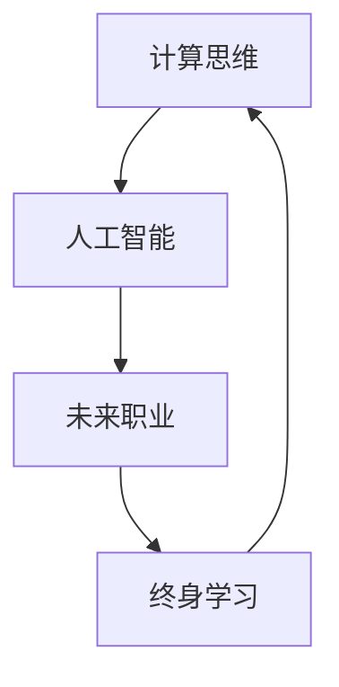

                 

# 迎接未来挑战：人类计算时代的技能需求

> 关键词：人工智能,计算思维,未来职业,技能升级,终身学习

## 1. 背景介绍

### 1.1 问题由来

随着人工智能技术的迅猛发展，人类的计算模式正在发生深刻变革。从传统的基于规则的计算，到基于数据驱动的计算，再到未来的基于智能的计算，计算思维已经在各个层面产生广泛影响。在未来的计算时代，掌握人工智能相关技能将成为各行各业人才的基本需求。

与此同时，全球正处于新一轮科技革命和产业转型的关键时期。以智能制造、物联网、大数据等为代表的现代信息技术，正在引领新一轮工业革命，对劳动者提出了全新的要求。未来的职业角色和岗位要求将更强调创新能力和技术素养，以及跨学科、跨领域的综合能力。

### 1.2 问题核心关键点

为更好地把握未来计算时代的技能需求，本节将从以下几个核心关键点展开讨论：

- **计算思维的培养**：理解计算思维的内涵及其在各个领域的应用，探索如何培养计算思维。
- **人工智能技能**：探讨当前人工智能技术的发展趋势和应用领域，分析未来人工智能技能的需求。
- **未来职业规划**：从全球视角分析未来职业变化趋势，明确未来职场的核心技能需求。
- **终身学习的理念**：强调终身学习的重要性和方法，提出具体学习建议。

## 2. 核心概念与联系

### 2.1 核心概念概述

在探讨未来计算时代的技能需求前，我们需要先了解几个核心概念：

- **计算思维(Computational Thinking)**：指用计算的方式去解决问题，包括算法设计、数据结构、程序设计等。计算思维强调逻辑、结构、抽象等核心素养，培养解决问题的能力。
- **人工智能(Artificial Intelligence, AI)**：指通过算法、模型、数据等技术手段，使计算机能够模拟、延伸或扩展人的智能，完成复杂任务。
- **未来职业(Future Careers)**：随着技术进步和社会发展，新兴职业不断涌现，对劳动者提出了新的要求。
- **终身学习(Lifelong Learning)**：指人在其一生中持续学习、不断进步的理念，强调适应变化、自我提升的重要性。

这些概念之间具有紧密联系，计算思维是人工智能技术的底层逻辑，未来职业要求对人工智能技能有深刻理解，终身学习是适应未来职业变化的关键。

### 2.2 核心概念原理和架构的 Mermaid 流程图



这个流程图展示了计算思维、人工智能、未来职业、终身学习之间的关系：

1. 计算思维是人工智能的基石，提供了算法设计和数据处理的基础。
2. 人工智能技能的掌握是未来职业发展的核心要求，提升了工作效率和创新能力。
3. 终身学习是应对未来职业变化的重要策略，通过不断学习保持技能更新和提升。
4. 未来职业的发展又进一步推动了终身学习的需要，使学习成为职业发展的重要组成部分。

## 3. 核心算法原理 & 具体操作步骤

### 3.1 算法原理概述

在探讨未来计算时代的技能需求时，我们需理解计算思维和人工智能技能的核心算法原理。

计算思维的核心算法包括算法设计、数据结构、程序设计等。算法设计关注问题求解的逻辑步骤和算法效率，数据结构关注数据的存储和检索方式，程序设计关注代码的编写和调试。这些算法和结构是人工智能技术实现的基础。

人工智能的核心算法包括机器学习、深度学习、自然语言处理等。机器学习关注从数据中自动学习规律，深度学习关注通过神经网络模型进行复杂任务处理，自然语言处理关注语言理解和生成等。

### 3.2 算法步骤详解

以下是计算思维和人工智能技能的核心算法步骤详解：

#### 3.2.1 计算思维算法步骤

1. **问题定义**：明确问题的数学模型和目标，如排序、搜索等。
2. **算法设计**：设计算法的基本步骤，如贪心算法、分治算法等。
3. **数据处理**：选择适合的数据结构，如数组、链表、树等，进行数据的存储和操作。
4. **代码实现**：根据算法设计，使用编程语言实现算法逻辑。
5. **测试调试**：通过编写测试用例，验证算法正确性和效率，进行调试。

#### 3.2.2 人工智能算法步骤

1. **数据准备**：收集和处理数据，清洗噪声数据。
2. **模型选择**：根据任务需求选择适合的模型，如线性回归、决策树、神经网络等。
3. **训练优化**：使用训练数据集进行模型训练，调整模型参数，优化模型性能。
4. **验证评估**：在验证集上评估模型效果，调整模型结构和参数。
5. **应用部署**：将训练好的模型部署到实际应用中，进行推理和预测。

### 3.3 算法优缺点

#### 3.3.1 计算思维算法优点

- **逻辑性强**：计算思维强调逻辑推理和数学模型，有助于培养严谨的思维习惯。
- **适用广泛**：计算思维的应用范围广泛，不仅限于计算机科学领域。
- **提升问题解决能力**：通过算法设计和数据结构，提升解决问题的能力。

#### 3.3.2 计算思维算法缺点

- **复杂度高**：某些算法和数据结构设计复杂，需要较高的数学和编程基础。
- **灵活性差**：一旦设计完成，难以进行动态调整。

#### 3.3.3 人工智能算法优点

- **自动化强**：通过机器学习和深度学习算法，自动从数据中学习规律和特征。
- **预测能力强**：人工智能算法能够进行复杂的预测和分类，提升决策的科学性。
- **应用广泛**：人工智能技术已广泛应用于医疗、金融、制造等多个领域。

#### 3.3.4 人工智能算法缺点

- **数据依赖强**：算法的性能很大程度上依赖数据的质量和数量。
- **模型复杂**：某些深度学习模型结构复杂，训练时间长。
- **可解释性差**：某些深度学习模型如神经网络，难以解释其内部工作机制。

### 3.4 算法应用领域

计算思维和人工智能技能的应用领域非常广泛，以下是一些主要领域：

- **软件开发**：软件开发生命周期的各个环节，如需求分析、设计、编码、测试等，都需要计算思维和编程技能。
- **数据分析与建模**：通过机器学习和深度学习算法，从数据中提取规律和特征，进行预测和分类。
- **自然语言处理**：利用自然语言处理技术，实现语言理解和生成，如文本分类、情感分析、机器翻译等。
- **计算机视觉**：利用计算机视觉技术，进行图像识别和处理，如图像分类、目标检测等。
- **智能制造**：通过工业互联网和大数据技术，实现智能生产和管理，如工业物联网、预测性维护等。
- **智能医疗**：利用人工智能技术，提升医疗诊断和治疗的精准性和效率，如医学影像分析、病历分析等。

## 4. 数学模型和公式 & 详细讲解 & 举例说明

### 4.1 数学模型构建

在探讨未来计算时代的技能需求时，我们需构建相关的数学模型和公式。

#### 4.1.1 计算思维数学模型

计算思维的核心数学模型包括算法和数据结构。以下是一些常见算法和数据结构的数学模型构建：

- **排序算法**：冒泡排序、选择排序、快速排序等。
- **查找算法**：线性查找、二分查找、哈希查找等。
- **树结构**：二叉树、AVL树、红黑树等。
- **图结构**：有向图、无向图、最短路径算法等。

#### 4.1.2 人工智能数学模型

人工智能的核心数学模型包括机器学习、深度学习、自然语言处理等。以下是一些常见模型的数学模型构建：

- **线性回归模型**：$$y = wx + b$$
- **决策树模型**：$$D(t) = \begin{cases} D_L & \text{if} x_L \\ D_R & \text{if} x_R \end{cases}$$
- **神经网络模型**：$$y = \sum_i w_ix_i + b$$
- **自然语言处理模型**：使用Transformer结构，$$y = \text{Attention}(x, x')$$

### 4.2 公式推导过程

#### 4.2.1 计算思维公式推导

以下是一些常见算法和数据结构的公式推导过程：

- **冒泡排序算法**：时间复杂度为$$O(n^2)$$，空间复杂度为$$O(1)$$。
- **二叉搜索树查找算法**：平均查找时间为$$O(\log n)$$，空间复杂度为$$O(n)$$。

#### 4.2.2 人工智能公式推导

以下是一些常见模型的公式推导过程：

- **线性回归模型**：通过最小二乘法求解$$\theta = (X^TX)^{-1}X^Ty$$
- **决策树模型**：通过信息增益或信息增益比等指标选择最优特征，$$D(t) = \begin{cases} D_L & \text{if} x_L \\ D_R & \text{if} x_R \end{cases}$$
- **神经网络模型**：通过反向传播算法求解权重和偏置，$$w^{(l)} = \frac{1}{m}\sum_{i=1}^m(x^{(i)}-\hat{y}^{(i)})x^{(i)}$$

### 4.3 案例分析与讲解

#### 4.3.1 计算思维案例

**案例1：排序算法选择**

假设有一组数据$$[3, 5, 1, 6, 4, 7, 2, 8]$$，采用冒泡排序进行升序排序，每次比较相邻元素，将较大元素向右移动，得到排序结果$$[1, 2, 3, 4, 5, 6, 7, 8]$$。

**案例2：二叉搜索树查找**

假设有一个二叉搜索树，包含元素$$[3, 5, 1, 6, 4, 7, 2, 8]$$，查找元素$$7$$，通过递归遍历，找到$$D_R$$，再递归遍历$$D_R$$，最终找到$$7$$。

#### 4.3.2 人工智能案例

**案例3：线性回归模型**

假设有一组数据$$[1, 2, 3, 4, 5]$$和对应的$$[3, 6, 10, 15, 21]$$，使用最小二乘法求解线性回归模型$$y = 2x + 1$$，验证模型效果。

**案例4：神经网络模型**

假设有一组数据$$[1, 2, 3, 4, 5]$$和对应的$$[1, 3, 5, 7, 9]$$，构建一个简单的神经网络模型，使用反向传播算法求解权重和偏置，得到$$y = 2x + 1$$。

## 5. 项目实践：代码实例和详细解释说明

### 5.1 开发环境搭建

在进行计算思维和人工智能技能的项目实践前，我们需要准备好开发环境。以下是使用Python进行PyTorch开发的环境配置流程：

1. 安装Anaconda：从官网下载并安装Anaconda，用于创建独立的Python环境。

2. 创建并激活虚拟环境：
```bash
conda create -n pytorch-env python=3.8 
conda activate pytorch-env
```

3. 安装PyTorch：根据CUDA版本，从官网获取对应的安装命令。例如：
```bash
conda install pytorch torchvision torchaudio cudatoolkit=11.1 -c pytorch -c conda-forge
```

4. 安装TensorFlow：
```bash
conda install tensorflow -c conda-forge
```

5. 安装各类工具包：
```bash
pip install numpy pandas scikit-learn matplotlib tqdm jupyter notebook ipython
```

完成上述步骤后，即可在`pytorch-env`环境中开始项目实践。

### 5.2 源代码详细实现

这里我们以计算思维中的排序算法和人工智能中的线性回归模型为例，给出完整的PyTorch代码实现。

#### 5.2.1 冒泡排序算法

```python
import numpy as np

def bubble_sort(arr):
    n = len(arr)
    for i in range(n-1):
        for j in range(n-i-1):
            if arr[j] > arr[j+1]:
                arr[j], arr[j+1] = arr[j+1], arr[j]
    return arr

arr = np.array([3, 5, 1, 6, 4, 7, 2, 8])
sorted_arr = bubble_sort(arr)
print(sorted_arr)
```

#### 5.2.2 线性回归模型

```python
import numpy as np
import torch
from torch import nn, optim

class LinearRegression(nn.Module):
    def __init__(self, input_dim, output_dim):
        super(LinearRegression, self).__init__()
        self.linear = nn.Linear(input_dim, output_dim)

    def forward(self, x):
        y_pred = self.linear(x)
        return y_pred

# 准备数据
x = torch.tensor([[1], [2], [3], [4], [5]], dtype=torch.float32)
y = torch.tensor([[3], [6], [10], [15], [21]], dtype=torch.float32)

# 定义模型
model = LinearRegression(input_dim=1, output_dim=1)
criterion = nn.MSELoss()
optimizer = optim.SGD(model.parameters(), lr=0.01)

# 训练模型
for epoch in range(1000):
    optimizer.zero_grad()
    y_pred = model(x)
    loss = criterion(y_pred, y)
    loss.backward()
    optimizer.step()

    if (epoch + 1) % 100 == 0:
        print(f'Epoch {epoch+1}, Loss: {loss.item()}')

# 输出模型预测
x_test = torch.tensor([[6]], dtype=torch.float32)
y_pred = model(x_test)
print(y_pred)
```

### 5.3 代码解读与分析

#### 5.3.1 冒泡排序算法

**代码解读**：
- 冒泡排序算法使用双重循环，每次比较相邻元素，将较大元素向右移动，得到排序结果。

**分析**：
- 时间复杂度为$$O(n^2)$$，空间复杂度为$$O(1)$$，适用于小规模数据排序。

#### 5.3.2 线性回归模型

**代码解读**：
- 线性回归模型使用PyTorch定义，包括输入层、线性层和输出层，通过前向传播计算预测输出，通过MSE损失函数计算预测误差。

**分析**：
- 模型参数通过梯度下降优化器进行训练，最小化预测误差。

## 6. 实际应用场景

### 6.1 软件开发

在软件开发中，计算思维和人工智能技能的应用非常广泛。例如：

- **需求分析**：通过算法设计和数据结构，对用户需求进行建模和分析，确定系统架构和技术方案。
- **代码生成**：利用代码生成工具，自动生成重复性代码，提高开发效率。
- **自动化测试**：通过测试框架和自动化测试工具，进行回归测试和性能测试，提升软件质量。
- **持续集成和部署**：通过CI/CD工具，自动化构建、测试和部署软件，提高发布效率。

### 6.2 数据分析与建模

在数据分析与建模中，人工智能技能的应用非常关键。例如：

- **数据预处理**：通过数据清洗和特征工程，提取和处理关键数据特征。
- **模型训练**：利用机器学习和深度学习算法，训练模型进行预测和分类。
- **模型评估**：通过交叉验证和测试集评估模型性能，调整模型参数。
- **模型应用**：将训练好的模型部署到实际应用中，进行实时预测和决策。

### 6.3 自然语言处理

在自然语言处理中，计算思维和人工智能技能的应用非常广泛。例如：

- **文本分类**：利用自然语言处理技术，对文本进行分类，如情感分析、主题分类等。
- **机器翻译**：利用神经网络模型进行语言翻译，实现跨语言交流。
- **文本生成**：利用生成对抗网络等技术，生成高质量文本，如自动摘要、对话生成等。
- **问答系统**：利用信息检索和自然语言处理技术，实现智能问答，提升用户交互体验。

### 6.4 未来应用展望

随着计算思维和人工智能技能的不断进步，未来的应用场景将更加广泛和多样化。以下是一些未来应用展望：

- **智能制造**：通过工业互联网和大数据技术，实现智能生产和管理，如预测性维护、智能调度等。
- **智能医疗**：利用人工智能技术，提升医疗诊断和治疗的精准性和效率，如医学影像分析、病历分析等。
- **智能交通**：利用人工智能技术，实现交通管理和智能出行，如自动驾驶、智能调度等。
- **智能金融**：利用人工智能技术，提升金融决策和风险管理水平，如信用评估、风险预警等。
- **智能教育**：利用人工智能技术，实现个性化教育和智能辅导，如智能推荐、智能答疑等。

## 7. 工具和资源推荐

### 7.1 学习资源推荐

为了帮助开发者系统掌握计算思维和人工智能技能，这里推荐一些优质的学习资源：

1. **《算法导论》**：由MIT教授Thomas H. Cormen等合著的经典算法教材，系统讲解了算法设计和数据结构的基础知识。
2. **《深度学习》**：由Ian Goodfellow等合著的经典深度学习教材，详细介绍了深度学习的基本原理和应用实例。
3. **Coursera**：提供各类计算思维和人工智能课程，涵盖从入门到高级的多个层次。
4. **Kaggle**：提供大量数据科学和机器学习竞赛，实践练习和交流学习的重要平台。
5. **Google Colab**：谷歌提供的免费在线Jupyter Notebook环境，方便开发者进行研究和分享学习笔记。

通过对这些资源的学习实践，相信你一定能够快速掌握计算思维和人工智能技能，并用于解决实际的业务问题。

### 7.2 开发工具推荐

高效的开发离不开优秀的工具支持。以下是几款用于计算思维和人工智能技能开发的常用工具：

1. **PyTorch**：基于Python的开源深度学习框架，灵活动态的计算图，适合快速迭代研究。大部分预训练语言模型都有PyTorch版本的实现。
2. **TensorFlow**：由Google主导开发的开源深度学习框架，生产部署方便，适合大规模工程应用。同样有丰富的预训练语言模型资源。
3. **Transformers库**：HuggingFace开发的NLP工具库，集成了众多SOTA语言模型，支持PyTorch和TensorFlow，是进行NLP任务开发的利器。
4. **Weights & Biases**：模型训练的实验跟踪工具，可以记录和可视化模型训练过程中的各项指标，方便对比和调优。与主流深度学习框架无缝集成。
5. **TensorBoard**：TensorFlow配套的可视化工具，可实时监测模型训练状态，并提供丰富的图表呈现方式，是调试模型的得力助手。
6. **Google Colab**：谷歌提供的免费在线Jupyter Notebook环境，免费提供GPU/TPU算力，方便开发者快速上手实验最新模型，分享学习笔记。

合理利用这些工具，可以显著提升计算思维和人工智能技能项目的开发效率，加快创新迭代的步伐。

### 7.3 相关论文推荐

计算思维和人工智能技能的发展源于学界的持续研究。以下是几篇奠基性的相关论文，推荐阅读：

1. **《计算机程序设计艺术》**：由Donald Knuth撰写的经典著作，详细讲解了计算思维和算法设计的基础理论。
2. **《深度学习》**：由Ian Goodfellow等合著的经典深度学习教材，详细介绍了深度学习的基本原理和应用实例。
3. **《自然语言处理综述》**：由Daniel Jurafsky等合著的综述性论文，全面总结了自然语言处理的研究现状和发展方向。
4. **《Transformer是所有你需要的》**：Google AI团队发表的论文，详细讲解了Transformer模型的原理和应用。
5. **《大语言模型在预训练和微调中的应用》**：OpenAI团队发表的论文，详细介绍了大语言模型的预训练和微调方法。

这些论文代表了大语言模型微调技术的发展脉络。通过学习这些前沿成果，可以帮助研究者把握学科前进方向，激发更多的创新灵感。

## 8. 总结：未来发展趋势与挑战

### 8.1 总结

本文对计算思维和人工智能技能进行了全面系统的介绍。首先阐述了计算思维的内涵及其在各个领域的应用，探讨了人工智能技术的发展趋势和应用领域，分析了未来职业变化趋势和核心技能需求。其次，本文从多个核心概念的联系和架构入手，探讨了计算思维和人工智能技能的深度融合，给出了具体的算法步骤和公式推导，并提供了详细的代码实现和解释。

通过本文的系统梳理，可以看到，计算思维和人工智能技能是未来计算时代的重要基础，广泛应用于软件开发、数据分析、自然语言处理等多个领域。未来职业和技能需求的变化趋势，也对学习者提出了新的要求。终身学习将成为适应未来职业变化的关键策略。

### 8.2 未来发展趋势

展望未来，计算思维和人工智能技能的发展趋势将更加多样化和智能化。以下是一些主要发展趋势：

1. **深度融合**：计算思维和人工智能技能将进一步融合，形成更强大的综合能力，提升解决问题的效率和效果。
2. **跨领域应用**：人工智能技术将广泛应用于各个领域，提升行业智能化水平。
3. **多模态融合**：利用多模态数据进行深度融合，提升系统感知和理解能力。
4. **自动化水平提升**：自动化工具和算法将进一步普及，提升开发和应用效率。
5. **智能化水平提升**：通过深度学习和大数据技术，提升系统的智能化水平，实现更精准的决策和预测。

### 8.3 面临的挑战

尽管计算思维和人工智能技能的发展前景广阔，但在迈向更加智能化、普适化应用的过程中，仍面临诸多挑战：

1. **数据依赖性强**：人工智能算法的性能很大程度上依赖数据的质量和数量。如何获取和处理高质量数据，是一个重要挑战。
2. **算法复杂度高**：某些深度学习算法结构复杂，训练时间长，如何优化算法结构，提高训练效率，是一个重要挑战。
3. **模型可解释性差**：某些深度学习模型如神经网络，难以解释其内部工作机制，如何提升模型的可解释性和可理解性，是一个重要挑战。
4. **安全性问题**：人工智能技术可能带来安全风险，如何保障数据和模型的安全，是一个重要挑战。
5. **伦理道德问题**：人工智能技术的伦理道德问题，如偏见、歧视等，如何避免和解决，是一个重要挑战。

### 8.4 研究展望

面对计算思维和人工智能技能所面临的挑战，未来的研究需要在以下几个方面寻求新的突破：

1. **数据增强**：通过数据增强技术，提高数据多样性和质量，增强算法的鲁棒性和泛化能力。
2. **算法优化**：开发更加高效的算法结构和优化策略，提高算法的训练速度和效果。
3. **可解释性研究**：引入可解释性方法和工具，提升模型的可解释性和可理解性。
4. **安全保障**：通过数据加密、隐私保护等手段，保障数据和模型的安全。
5. **伦理道德**：建立伦理道德规范，避免算法的偏见和歧视，提升社会对人工智能技术的信任。

这些研究方向的探索，将推动计算思维和人工智能技能的发展，为构建智能系统和智能社会奠定坚实基础。面向未来，我们相信计算思维和人工智能技能将在更多领域得到应用，为人类社会的发展带来深远影响。

## 9. 附录：常见问题与解答

**Q1: 如何学习计算思维和人工智能技能？**

A: 学习计算思维和人工智能技能需要系统化的知识体系和实践经验。以下是一些学习建议：

1. **学习基础课程**：参加相关专业课程或MOOC课程，如计算机科学、数据科学、机器学习等。
2. **实践项目**：通过实践项目积累经验，如排序算法、线性回归、神经网络等。
3. **阅读经典书籍**：阅读相关经典书籍，如《算法导论》、《深度学习》等。
4. **参加竞赛**：参加Kaggle、天池等数据科学和机器学习竞赛，提升实战能力。
5. **参加社区**：加入技术社区，如GitHub、Stack Overflow等，与他人交流学习。

**Q2: 如何评估计算思维和人工智能技能？**

A: 评估计算思维和人工智能技能需要多维度衡量，以下是一些评估方法：

1. **项目评估**：通过项目完成度和质量评估技能水平，如算法设计、模型训练、代码实现等。
2. **竞赛成绩**：通过参加Kaggle、天池等数据科学和机器学习竞赛的成绩，评估技能水平。
3. **实际应用**：通过实际应用中的表现，评估技能水平，如问题解决能力、决策能力等。
4. **技能测试**：通过技能测试和面试评估，如编程能力、算法设计能力等。

**Q3: 未来计算思维和人工智能技能的发展方向是什么？**

A: 未来计算思维和人工智能技能的发展方向将更加多样化和智能化，以下是一些主要方向：

1. **深度融合**：计算思维和人工智能技能将进一步融合，形成更强大的综合能力，提升解决问题的效率和效果。
2. **跨领域应用**：人工智能技术将广泛应用于各个领域，提升行业智能化水平。
3. **多模态融合**：利用多模态数据进行深度融合，提升系统感知和理解能力。
4. **自动化水平提升**：自动化工具和算法将进一步普及，提升开发和应用效率。
5. **智能化水平提升**：通过深度学习和大数据技术，提升系统的智能化水平，实现更精准的决策和预测。

**Q4: 未来计算思维和人工智能技能的应用场景是什么？**

A: 未来计算思维和人工智能技能的应用场景将更加广泛和多样化，以下是一些主要场景：

1. **智能制造**：通过工业互联网和大数据技术，实现智能生产和管理，如预测性维护、智能调度等。
2. **智能医疗**：利用人工智能技术，提升医疗诊断和治疗的精准性和效率，如医学影像分析、病历分析等。
3. **智能交通**：利用人工智能技术，实现交通管理和智能出行，如自动驾驶、智能调度等。
4. **智能金融**：利用人工智能技术，提升金融决策和风险管理水平，如信用评估、风险预警等。
5. **智能教育**：利用人工智能技术，实现个性化教育和智能辅导，如智能推荐、智能答疑等。

**Q5: 如何应对计算思维和人工智能技能面临的挑战？**

A: 应对计算思维和人工智能技能面临的挑战需要多方面的努力：

1. **数据处理**：通过数据增强技术，提高数据多样性和质量，增强算法的鲁棒性和泛化能力。
2. **算法优化**：开发更加高效的算法结构和优化策略，提高算法的训练速度和效果。
3. **可解释性研究**：引入可解释性方法和工具，提升模型的可解释性和可理解性。
4. **安全保障**：通过数据加密、隐私保护等手段，保障数据和模型的安全。
5. **伦理道德**：建立伦理道德规范，避免算法的偏见和歧视，提升社会对人工智能技术的信任。

总之，通过不断学习、实践和创新，我们可以更好地应对未来计算思维和人工智能技能所面临的挑战，为构建智能系统和智能社会做出贡献。

