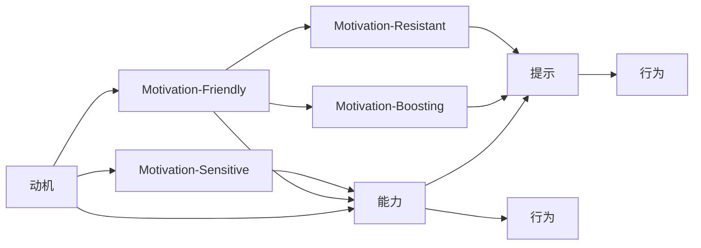

                 

# 运用福格模型培养团队良习惯

> 关键词：团队管理,行为科学,动机激励,行为改变,习惯培养,福格模型

## 1. 背景介绍

### 1.1 问题由来
在当前快速发展的数字化时代，企业不仅面临复杂多变的外部环境，内部的组织管理和团队协作也面临着诸多挑战。如何高效地培养和提升团队成员的行为习惯，以适应数字化转型、提升整体竞争力，成为许多企业的共同课题。然而，实际工作中，许多管理者和团队领导往往缺乏系统性的行为科学知识，在激发和引导员工行为方面常常感到力不从心。

福格模型（Fogg's Model）作为一种行为科学工具，能够为团队管理和行为习惯的培养提供科学的方法论和实用的操作框架。本文将系统介绍福格模型的核心原理，并结合实际案例，探索如何有效应用福格模型，帮助企业提升团队成员的行为习惯，构建高效协作的团队文化。

### 1.2 问题核心关键点
福格模型由斯坦福大学教授B.J.福格提出，旨在揭示行为背后的心理动机，并提出基于动机激励的行为改变策略。模型的核心理念在于将复杂的行为简化为动机、能力、提示三要素的交互作用。

- **动机（Motivation）**：内在的欲望或外部激励驱动人们采取某种行为。
- **能力（Ability）**：执行行为所需的物理和心理资源。
- **提示（Prompts）**：触发行为的外部信号或暗示。

模型的关键在于，通过提升动机、降低能力需求、增加提示的频率和强度，来促进行为习惯的养成。福格模型为团队管理提供了全新的视角，帮助管理者设计科学的行为引导策略，有效提升团队的协作效率和工作质量。

### 1.3 问题研究意义
福格模型的应用，对于提升企业团队协作效率、构建健康的团队文化具有重要意义：

- **提升团队协作效率**：通过科学的行为引导，帮助团队成员形成良好的工作习惯，提升整体的工作效率和产出质量。
- **构建健康团队文化**：促进团队成员之间的沟通和信任，增强团队凝聚力，提升整体的工作氛围。
- **实现业务目标**：通过激励和引导团队成员的行为，确保各项业务目标的顺利达成。
- **推动持续改进**：构建以行为改变为导向的持续改进机制，推动企业不断优化管理方式，适应市场变化。

## 2. 核心概念与联系

### 2.1 核心概念概述

福格模型通过动机、能力和提示三个要素，解释了行为背后的心理机制，并提出了行为改变的操作框架。以下是各要素的具体含义：

- **动机（Motivation）**：内在的欲望或外部激励驱动人们采取某种行为。动机可以来自内部，如好奇心、成就感；也可以来自外部，如奖励、惩罚等。
- **能力（Ability）**：执行行为所需的物理和心理资源。能力越高，行为越容易发生。
- **提示（Prompts）**：触发行为的外部信号或暗示。提示可以是有形的，如电子邮件提醒；也可以是无形的，如时间、地点等。

福格模型认为，行为的形成是一个逐步加强的过程，需要动机、能力和提示三个要素共同作用。这三个要素之间的相互作用，决定了行为的强度和频率。

### 2.2 核心概念原理和架构的 Mermaid 流程图



此图展示了动机、能力和提示之间的关系和交互作用。当动机、能力和提示三个要素的组合达到一定阈值时，行为就会发生。通过增强动机、降低能力需求、增加提示的频率和强度，可以更好地促进行为习惯的形成。

## 3. 核心算法原理 & 具体操作步骤

### 3.1 算法原理概述

福格模型虽然不涉及具体的算法原理，但其核心理念可以应用到各种团队管理和行为引导的场景中。以下是基于福格模型的行为引导策略设计的一般流程：

1. **识别目标行为**：明确需要培养的行为习惯，如定期会议、时间管理、团队协作等。
2. **评估动机强度**：了解团队成员的内在动机和外部激励，识别哪些因素最能驱动他们采取目标行为。
3. **评估行为能力**：评估团队成员执行目标行为所需的能力和资源，找到能力提升的切入点。
4. **设计提示策略**：设计增加提示频率和强度的策略，确保行为能够在合适的时机触发。
5. **实施行为引导**：基于上述分析，设计具体的行为引导策略，逐步推动行为习惯的形成。

### 3.2 算法步骤详解

以下是福格模型在团队管理中的应用步骤详解：

**Step 1: 识别目标行为**
- **目标设定**：明确团队需要达成的具体行为目标，如每周一次的技术分享会、每日站立会、每天完成的工作任务等。
- **行为定义**：将目标行为具体化，明确行为的标准和期望。例如，每日在固定时间进行15分钟的站立会议，记录会议内容并提交至共享文档。

**Step 2: 评估动机强度**
- **内在动机**：了解团队成员的内在动机，如成就感、归属感、个人成长等。例如，通过问卷调查、一对一访谈等方式，了解团队成员对于会议分享的具体期望和需求。
- **外部激励**：设计外部激励机制，以增强团队成员的内在动机。例如，设立最佳分享者奖、优秀工作表现奖励等。

**Step 3: 评估行为能力**
- **资源评估**：评估执行目标行为所需的物理和心理资源。例如，评估团队成员的时间安排、技术水平、会议组织能力等。
- **能力提升**：针对评估出的能力不足，设计能力提升计划。例如，提供培训、分享最佳实践、设立导师制等。

**Step 4: 设计提示策略**
- **高频提示**：设计频繁且易于识别的提示，确保行为能够在合适的时机触发。例如，通过电子邮件提醒、团队公告等方式，定期提醒团队成员进行站立会议。
- **强提示**：设计具有明显标识的提示，增强行为的可识别性。例如，在会议会议室布置会议主题和议程，并在门口放置提示牌。

**Step 5: 实施行为引导**
- **逐步引导**：从简单的提示开始，逐步引导团队成员形成行为习惯。例如，初期只需提醒成员进行站立会议，后期增加记录会议内容和提交会议纪要的要求。
- **激励与反馈**：根据行为表现，及时给予激励和反馈。例如，对于积极参与会议分享的成员给予表彰和奖励，对于表现不足的成员进行私下辅导和激励。

### 3.3 算法优缺点

福格模型的应用具有以下优点：
- **系统性**：提供了科学的行为心理学视角，帮助团队管理更具系统性和科学性。
- **可操作性强**：通过具体的操作流程和策略设计，使得行为引导变得可操作、可执行。
- **灵活性高**：模型灵活性高，适用于多种行为引导场景，如项目管理、团队协作、工作习惯培养等。

同时，福格模型也存在一些局限：
- **动机分析复杂**：动机的分析往往需要深入访谈和问卷调查，工作量较大。
- **行为复杂度高**：复杂行为背后可能涉及多个动机和能力要素，分析难度较高。
- **提示设计难度**：提示的设计需要考虑频次和强度，设计不当可能导致行为难以触发。

尽管存在这些局限性，福格模型依然是一种科学、实用的行为引导工具，能够帮助团队管理者和成员系统性地分析行为背后的动机、能力和提示，从而有效地提升团队协作效率和整体工作质量。

### 3.4 算法应用领域

福格模型不仅在团队管理中应用广泛，还可以应用于各种行为习惯的培养场景：

- **项目管理**：通过设计有效的提示策略，推动团队成员按时完成任务、定期进行项目汇报等行为习惯的形成。
- **工作习惯**：如每日复盘、定期学习、代码审查等，通过提升动机、降低能力需求、增加提示的频率和强度，形成良好的工作习惯。
- **健康管理**：如饮食控制、锻炼习惯、健康监测等，通过设计科学的动机激励和行为提示，提升健康管理的自觉性和持续性。
- **组织变革**：通过设计系统性的行为引导策略，推动组织变革和流程优化，提升组织的适应性和竞争力。

福格模型在多个领域的应用，展示了其广泛的适用性和强大的行为引导能力。

## 4. 数学模型和公式 & 详细讲解 & 举例说明

福格模型虽然不涉及数学公式，但其核心理念可以结合具体情境进行深入讲解。以下通过一个案例来说明福格模型在团队协作中的应用。

### 4.1 数学模型构建

假设一个软件团队需要提升每日的代码审查习惯。根据福格模型，我们首先识别目标行为、评估动机、评估能力，设计提示策略，最后实施行为引导。

**目标行为**：每日提交代码进行同行评审，确保代码质量。

**动机评估**：
- 内在动机：团队成员希望通过代码评审提升技术水平和团队协作效率。
- 外部激励：设立最佳代码评审奖、项目奖金、晋升机会等。

**能力评估**：
- 资源评估：评估团队成员的技术水平、时间安排、会议组织能力等。
- 能力提升：通过技术培训、代码评审工作坊、共享最佳实践等方式提升团队成员的能力。

**提示设计**：
- 高频提示：每日固定时间（如每日早上9:00）提醒团队成员进行代码评审。
- 强提示：通过团队公告、邮件提醒等方式，确保提示的可见性和易识别性。

**实施行为引导**：
- 逐步引导：初期只需提醒成员进行代码评审，后期增加代码评审记录和报告的要求。
- 激励与反馈：对于积极参与代码评审的成员给予表彰和奖励，对于表现不足的成员进行私下辅导和激励。

通过上述步骤，团队可以系统性地提升每日代码评审的习惯，确保代码质量，提升团队协作效率。

### 4.2 公式推导过程

由于福格模型不涉及具体的数学公式，这里不进行推导，但可以结合具体情境设计一些行为引导的策略。例如，可以使用以下公式来评估行为能力：

$$
能力 = \frac{时间安排}{技术水平} \times \frac{会议组织能力}{心理资源}
$$

通过这个公式，可以量化评估团队成员执行代码评审所需的能力，进而设计针对性的能力提升计划。

### 4.3 案例分析与讲解

假设一个项目团队需要在每月的中旬进行一次全员技术分享会。根据福格模型，我们可以设计如下行为引导策略：

**目标行为**：每月15日进行一次全员技术分享会。

**动机评估**：
- 内在动机：团队成员希望通过技术分享提升技术水平，促进知识交流和团队凝聚力。
- 外部激励：设立最佳分享者奖、项目奖金、晋升机会等。

**能力评估**：
- 资源评估：评估团队成员的演讲能力、时间安排、会议组织能力等。
- 能力提升：通过技术培训、分享最佳实践、设立导师制等提升团队成员的能力。

**提示设计**：
- 高频提示：每月固定时间（如每月15日）提醒团队成员进行技术分享。
- 强提示：通过团队公告、邮件提醒等方式，确保提示的可见性和易识别性。

**实施行为引导**：
- 逐步引导：初期只需提醒成员进行技术分享，后期增加分享内容和评估的要求。
- 激励与反馈：对于积极参与技术分享的成员给予表彰和奖励，对于表现不足的成员进行私下辅导和激励。

通过上述步骤，团队可以系统性地提升全员技术分享的习惯，促进知识共享和团队凝聚力，提升整体技术水平。

## 5. 项目实践：代码实例和详细解释说明

福格模型的应用主要依赖于系统的行为分析和策略设计，而不需要具体的代码实现。以下结合实际案例，介绍如何应用福格模型进行团队行为引导。

### 5.1 开发环境搭建

在应用福格模型进行团队行为引导时，通常需要构建一个行为分析和管理平台。以下是一个简单的开发环境搭建流程：

1. **选择开发平台**：选择适合团队使用的开发平台，如JIRA、Trello、Slack等。
2. **设计用户界面**：设计易于使用的用户界面，便于团队成员操作和反馈。
3. **集成行为分析工具**：集成行为分析工具，如问卷调查、访谈记录、任务跟踪等。
4. **开发行为引导策略**：根据团队行为数据，设计具体的行为引导策略。
5. **测试与优化**：通过实际测试，不断优化行为引导策略，确保其有效性和易用性。

### 5.2 源代码详细实现

由于福格模型主要涉及策略设计和行为分析，具体的代码实现并不复杂。以下是一个简化的代码实现示例：

```python
# 定义行为引导策略类
class BehaviorGuideStrategy:
    def __init__(self, target_behavior, motivation, ability, prompt_strategy):
        self.target_behavior = target_behavior
        self.motivation = motivation
        self.ability = ability
        self.prompt_strategy = prompt_strategy

    def set_motivation(self, motivation):
        self.motivation = motivation

    def set_ability(self, ability):
        self.ability = ability

    def set_prompt_strategy(self, prompt_strategy):
        self.prompt_strategy = prompt_strategy

    def guide_behavior(self):
        # 根据动机、能力和提示设计具体行为引导策略
        # 逐步引导和激励反馈
        pass
```

### 5.3 代码解读与分析

上述代码定义了一个行为引导策略类，用于封装动机、能力、提示等行为引导要素。在实际应用中，可以根据具体的行为目标和团队特点，设计不同的策略实例。

### 5.4 运行结果展示

通过实际应用，行为引导策略类可以产生如下运行结果：

1. **行为分析报告**：生成详细的行为分析报告，帮助团队管理者了解团队成员的行为表现和动机需求。
2. **行为引导方案**：根据行为分析结果，生成具体的行为引导方案，包括动机激励、能力提升、提示设计等。
3. **行为跟踪与反馈**：通过行为跟踪和反馈，及时调整行为引导策略，确保其有效性。

## 6. 实际应用场景

福格模型在多个实际应用场景中得到了广泛应用，以下列举几个典型案例：

### 6.1 金融行业

在金融行业，团队协作和知识共享是提升工作效率和风险控制的重要手段。福格模型可以帮助团队管理者设计科学的行为引导策略，提升团队协作效率和知识共享水平。

**案例**：某银行部门通过福格模型，设计了每日技术分享会和每周知识交流会，鼓励团队成员分享最新的业务和技术经验。通过定期的行为引导和激励，该部门在一年内提高了整体工作效率，减少了错误率，增强了团队凝聚力。

### 6.2 零售行业

在零售行业，库存管理、客户服务、销售分析等环节对团队协作和行为习惯有较高要求。福格模型可以帮助零售企业设计有效的行为引导策略，提升整体运营效率。

**案例**：某大型零售公司通过福格模型，设计了每日盘点提示和每周客户服务培训，提升了库存准确率和客户满意度。通过系统性的行为引导和激励，该公司在一年内提高了整体运营效率，提升了客户满意度。

### 6.3 教育行业

在教育行业，教师和学生的协作、学生学习的自主性和自律性对教学效果有重要影响。福格模型可以帮助学校设计科学的行为引导策略，提升整体教学效果和学生自主学习能力。

**案例**：某中学通过福格模型，设计了每日学习任务提示和每周学习分享会，提升了学生的自主学习和知识分享能力。通过定期的行为引导和激励，该中学在一年内提高了整体教学效果，增强了学生自主学习能力。

## 7. 工具和资源推荐

### 7.1 学习资源推荐

为了帮助企业系统掌握福格模型的应用，以下是一些推荐的学习资源：

1. **《Fogg's Model》书籍**：B.J.福格教授的著作，系统介绍了福格模型的核心理念和应用方法。
2. **《Behavior Change and Research》课程**：斯坦福大学的公开课程，涵盖行为科学的基本理论和实际应用案例。
3. **《Behavioral Design》书籍**：唐纳德·诺曼的著作，深入探讨了设计中的行为心理学，适用于企业行为引导的实践。
4. **《Designing Behavioral Experiences》书籍**：Don Tapscott的著作，介绍了如何设计行为导向的体验，提升用户的参与度和忠诚度。

### 7.2 开发工具推荐

福格模型的应用主要依赖于系统的行为分析和策略设计，以下是一些推荐的开发工具：

1. **JIRA**：项目管理工具，支持行为跟踪、任务分配和进度管理。
2. **Trello**：任务管理工具，支持卡片式任务管理和进度跟踪。
3. **Slack**：团队沟通工具，支持实时消息、文件共享和协作。
4. **Microsoft Teams**：团队协作工具，支持视频会议、文件共享和协作。
5. **Google Workspace**：支持邮件、文档、日历等协作工具，方便团队成员进行沟通和协作。

### 7.3 相关论文推荐

福格模型的应用得到了广泛的研究和实践。以下是几篇相关论文，推荐阅读：

1. **《Behavior Change: A Guide to Establishing New Habits》**：B.J.福格的经典论文，系统介绍了如何设计科学的行为引导策略。
2. **《Behavior Change Models and Concepts: Toward an Integrated Theory of Health Behavior》**：一篇综述性论文，介绍了多种行为引导模型的基本原理和应用方法。
3. **《Habit Formation in Organizations: A Behavioral View》**：一篇管理科学论文，探讨了组织行为习惯的形成和管理方法。

## 8. 总结：未来发展趋势与挑战

### 8.1 总结

本文系统介绍了福格模型在团队管理和行为引导中的应用，帮助企业系统性地提升团队协作效率和工作质量。通过动机、能力和提示三个要素，福格模型揭示了行为背后的心理机制，并提供了科学的行为引导策略。

### 8.2 未来发展趋势

展望未来，福格模型的应用将呈现以下几个发展趋势：

1. **数据驱动**：随着数据科学的发展，福格模型的应用将更加依赖于行为数据的深入分析和挖掘。大数据、人工智能等技术将为行为引导提供更多科学依据。
2. **个性化**：未来的行为引导将更加个性化，根据不同团队成员的动机、能力和偏好，设计差异化的引导策略。
3. **集成化**：福格模型将与其他行为导向工具和管理系统集成，形成更加系统化的行为导向解决方案。
4. **自动化**：通过AI和自动化技术，实现行为引导的自动化和智能化，提高效率和准确性。

### 8.3 面临的挑战

尽管福格模型在团队管理和行为引导中具有广泛的应用前景，但在实际应用中也面临一些挑战：

1. **动机分析复杂**：动机的分析往往需要深入访谈和问卷调查，工作量较大。
2. **数据隐私**：行为数据的收集和使用需要严格遵守数据隐私法律法规。
3. **文化差异**：不同文化背景下的团队成员对行为引导的反应和接受度可能存在差异。
4. **激励机制设计**：如何设计科学的激励机制，以最大化激发团队成员的内在动机，仍然是一个难题。

### 8.4 研究展望

未来，福格模型需要在以下几个方面进行进一步研究和创新：

1. **多维动机分析**：结合心理学和社会学的理论，进行多维动机的分析，更好地理解团队成员的内在需求。
2. **实时行为跟踪**：结合实时数据监测和分析，及时调整行为引导策略，确保其有效性。
3. **自动化行为引导**：通过AI技术，实现行为引导的自动化和智能化，提高效率和准确性。
4. **跨文化适应**：研究不同文化背景下行为引导的最佳实践，推动福格模型在全球范围内的应用。

总之，福格模型在团队管理和行为引导中具有广阔的应用前景，但需要结合实际情境进行深入探索和创新，以更好地应对未来复杂多变的管理挑战。通过科学的行为引导，提升团队协作效率和工作质量，推动企业不断创新和发展。

## 9. 附录：常见问题与解答

**Q1：如何衡量团队成员的行为动机？**

A: 团队成员的行为动机可以通过问卷调查、一对一访谈等方式进行评估。问卷调查可以设计多选题、量表题等，了解团队成员对不同行为的内在动机。一对一访谈可以深入了解团队成员的期望、需求和心理状态，更好地理解他们的行为动机。

**Q2：如何设计有效的行为提示？**

A: 设计有效的行为提示需要考虑频次和强度。频次过低或过高都会影响行为的发生概率。一般建议每天或每周设计固定的提示，确保提示的可见性和易识别性。可以通过电子邮件、团队公告、即时消息等方式进行提示。

**Q3：如何评估行为能力？**

A: 行为能力的评估可以通过时间安排、技术水平、会议组织能力等多个维度进行。评估过程中，可以采用行为跟踪工具记录团队成员的行为表现，进行定期分析和反馈。

**Q4：如何设计科学的激励机制？**

A: 设计科学的激励机制需要考虑内在动机和外部激励的平衡。内在动机如成就感、归属感、个人成长等，可以通过公开表扬、团队荣誉等方式进行激励。外部激励如奖金、奖品、晋升机会等，可以根据团队目标和表现进行设计。激励机制的设计需要根据团队特点和行为目标进行灵活调整。

**Q5：如何设计行为引导的退出机制？**

A: 设计行为引导的退出机制需要考虑激励与惩罚的平衡。对于表现优秀的团队成员，可以设计长期激励机制，如年度优秀员工奖、团队领导岗位等。对于表现不足的团队成员，可以进行私下辅导和激励，或者设计逐步淘汰机制，确保团队的整体行为水平。

通过系统性地应用福格模型，团队管理者可以有效提升团队成员的行为习惯，构建高效协作的团队文化，推动企业的持续发展。福格模型不仅是一种科学的行为引导工具，更是一种系统性的管理理念，值得广大管理者深入研究和实践。

