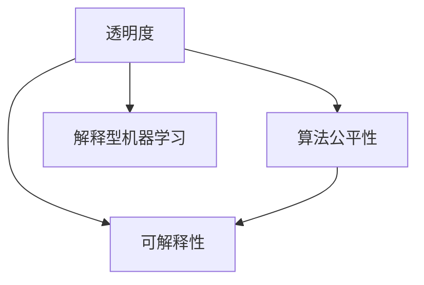

                 

# 透明度与可解释性：增强人工智能的可信度

> 关键词：可解释性,人工智能,深度学习,可信度,模型透明化,算法公平性,解释型机器学习

## 1. 背景介绍

### 1.1 问题由来

在人工智能(AI)技术快速发展的背景下，深度学习模型因其卓越的性能而在各个领域得到了广泛应用，从自然语言处理、计算机视觉到医疗诊断，深度学习模型几乎无所不能。然而，由于深度学习模型本质上是一个黑箱，很难理解其内部决策逻辑，这就导致了诸多问题，如模型的可解释性差、决策不透明等，使得人们对于AI系统的信任度不高。特别是在金融、医疗等关键领域，AI系统的可信度直接关系到人们的生命财产安全，因此对模型的透明度和可解释性的需求愈发迫切。

### 1.2 问题核心关键点

人工智能的可解释性是指通过一定的方法，让机器学习模型的决策过程透明化，使得用户能够理解模型为何做出某种决策。AI的可解释性问题主要体现在以下几个方面：

1. **黑箱问题**：深度学习模型通常由多层神经网络构成，其复杂性高，内部结构难以理解，导致决策过程不透明。
2. **决策不透明**：模型虽然能够产生准确的结果，但无法解释其决策依据，用户很难信任这些结果。
3. **偏差与公平性**：模型在训练过程中可能学习到数据的偏见，导致在特定群体上产生不公平的预测。

解决这些问题需要引入透明度和可解释性技术，使得AI系统更加可靠和可信。

### 1.3 问题研究意义

提高人工智能的可解释性对于增强AI系统的可信度具有重要意义：

1. **用户信任**：透明化的决策过程能够提升用户对AI系统的信任，特别是在金融、医疗等领域，可信的AI系统能够显著提高用户对系统的信任度。
2. **公平与公正**：通过可解释性技术，能够发现和纠正模型中的偏见，确保AI系统在各个群体上公平公正地运行。
3. **业务优化**：通过理解模型的决策过程，可以优化模型的训练和应用，提高其性能和效率。
4. **法律与伦理**：可解释性技术有助于在法律和伦理层面上证明AI系统的决策过程，减少潜在的法律风险。
5. **创新与突破**：透明化的AI系统能够激发更多的创新思路和突破，推动人工智能技术的发展。

## 2. 核心概念与联系

### 2.1 核心概念概述

为更好地理解透明度与可解释性技术，本节将介绍几个密切相关的核心概念：

- **透明度**：指机器学习模型的决策过程透明化，用户能够理解模型的内部逻辑。
- **可解释性**：指通过一定的技术手段，使机器学习模型的决策过程变得可理解，用户能够理解模型为何做出某种决策。
- **算法公平性**：指机器学习模型在各个群体上公平公正地运行，不偏袒任何一个群体。
- **解释型机器学习**：一种注重模型透明度的机器学习范式，旨在提高模型的可解释性和公平性。

这些概念之间的逻辑关系可以通过以下Mermaid流程图来展示：



这个流程图展示了你提到的核心概念之间的联系：

1. 透明度是可解释性的基础，只有模型透明化，用户才能理解其内部逻辑。
2. 可解释性能够帮助发现模型中的偏见，从而提高算法的公平性。
3. 解释型机器学习是在确保算法公平性的前提下，通过透明化模型的决策过程，进一步提升模型的可信度。

## 3. 核心算法原理 & 具体操作步骤

### 3.1 算法原理概述

透明度与可解释性技术主要包括模型透明化、模型可视化、模型解释等方法。其核心思想是通过对模型的分析和解释，使得用户能够理解模型的决策过程。以下是基于模型透明化的核心原理：

1. **模型透明化**：通过简化模型结构，使得模型的内部决策过程变得透明化。例如，使用决策树、线性模型等易于解释的模型，或通过特征重要性分析、部分依赖图等技术，帮助用户理解模型的决策依据。
2. **模型可视化**：通过可视化技术，展示模型内部的关键参数和权重，帮助用户理解模型的决策过程。例如，使用t-SNE、LIME等技术，将高维数据降维可视化。
3. **模型解释**：通过生成样本或假说，解释模型的决策过程。例如，使用对抗生成网络(GAN)生成假样本，帮助用户理解模型为何做出某种决策。

### 3.2 算法步骤详解

以基于决策树的模型透明化为例，介绍具体的算法步骤：

**Step 1: 选择透明化模型**

- 选择易于解释的模型，如决策树、线性回归等。

**Step 2: 设计特征工程**

- 对输入数据进行特征工程，提取有意义的特征。

**Step 3: 训练透明化模型**

- 在训练数据上训练透明化模型，如决策树。

**Step 4: 分析模型结构**

- 使用特征重要性分析、部分依赖图等技术，分析模型内部结构。

**Step 5: 可视化模型**

- 将模型结构可视化，如绘制决策树。

**Step 6: 解释模型决策**

- 生成样本或假说，解释模型的决策过程。

### 3.3 算法优缺点

透明度与可解释性技术具有以下优点：

1. **提升用户信任**：透明化的模型决策过程能够提升用户对AI系统的信任，特别是在关键领域。
2. **减少偏见**：通过可解释性技术，能够发现和纠正模型中的偏见，确保AI系统在各个群体上公平公正地运行。
3. **优化模型**：通过理解模型的决策过程，可以优化模型的训练和应用，提高其性能和效率。
4. **法律合规**：透明化的AI系统能够更容易地通过法律和伦理审核，减少潜在的法律风险。

同时，这些技术也存在一些局限性：

1. **复杂性高**：透明化模型需要简化模型结构，这可能会导致模型性能的下降。
2. **数据依赖性**：模型解释和可视化需要依赖于大量的数据，数据质量对结果有很大影响。
3. **可解释性有限**：某些复杂模型（如深度神经网络）的解释性仍然有限，难以完全透明化。
4. **解释门槛高**：用户需要一定的背景知识才能理解模型的解释，对非专业人士可能难以接受。

### 3.4 算法应用领域

透明度与可解释性技术广泛应用于以下几个领域：

- **金融领域**：在金融风控、信用评估、贷款审批等场景中，透明化的模型能够帮助用户理解风险评估过程，提高决策的透明度和可信度。
- **医疗领域**：在疾病诊断、治疗方案推荐等场景中，透明化的模型能够帮助医生理解模型决策依据，提高诊疗的可信度。
- **司法领域**：在案件审理、风险评估等场景中，透明化的模型能够帮助法官和律师理解模型决策过程，提高司法的公平性。
- **工业制造**：在智能制造、质量控制等场景中，透明化的模型能够帮助工程师理解生产过程，提高生产效率和质量。
- **自然语言处理**：在机器翻译、文本生成等场景中，透明化的模型能够帮助用户理解模型的翻译过程，提高翻译质量。

## 4. 数学模型和公式 & 详细讲解 & 举例说明

### 4.1 数学模型构建

以决策树为例，构建其数学模型。假设输入特征向量 $x$，输出标签 $y$，决策树模型为 $T(x)$。

**Step 1: 特征工程**

- 对输入特征进行归一化、离散化等处理，提取有意义的特征。

**Step 2: 划分节点**

- 根据特征 $x_i$ 将数据集划分为 $S_1$ 和 $S_2$。

**Step 3: 计算信息熵**

- 计算划分前后的信息熵，确定划分效果。

**Step 4: 递归构建决策树**

- 重复上述过程，递归构建完整的决策树。

### 4.2 公式推导过程

使用熵和信息增益等概念，推导决策树模型：

$$
H(S) = -\sum_{y}p(y)log_2p(y)
$$

其中 $H(S)$ 为数据集 $S$ 的信息熵，$p(y)$ 为标签 $y$ 的概率。

信息增益定义为：

$$
Gain(X, D) = H(D) - \sum_{x}p(x)H(D_x)
$$

其中 $Gain(X, D)$ 为特征 $X$ 对数据集 $D$ 的信息增益，$H(D_x)$ 为特征 $x$ 在数据集 $D$ 上的条件熵。

通过最大化信息增益，递归构建决策树。

### 4.3 案例分析与讲解

以鸢尾花分类数据集为例，展示决策树模型的构建和解释过程：

1. 数据预处理：归一化数据，提取有意义的特征。
2. 构建决策树：基于信息增益递归构建决策树。
3. 可视化模型：绘制决策树图。
4. 解释模型决策：分析决策树的特征重要性，理解模型为何做出某种决策。

## 5. 项目实践：代码实例和详细解释说明

### 5.1 开发环境搭建

在进行透明度与可解释性技术开发前，我们需要准备好开发环境。以下是使用Python进行Scikit-learn开发的环境配置流程：

1. 安装Anaconda：从官网下载并安装Anaconda，用于创建独立的Python环境。

2. 创建并激活虚拟环境：
```bash
conda create -n skl-env python=3.8 
conda activate skl-env
```

3. 安装Scikit-learn：
```bash
conda install scikit-learn
```

4. 安装其他工具包：
```bash
pip install numpy pandas matplotlib seaborn
```

完成上述步骤后，即可在`skl-env`环境中开始透明度与可解释性技术的开发。

### 5.2 源代码详细实现

以下是一个使用Scikit-learn库构建决策树的代码实现，并对模型进行解释和可视化的示例。

```python
from sklearn.tree import DecisionTreeClassifier, plot_tree
from sklearn.datasets import load_iris
from sklearn.model_selection import train_test_split
import matplotlib.pyplot as plt

# 加载鸢尾花数据集
iris = load_iris()
X = iris.data
y = iris.target

# 划分训练集和测试集
X_train, X_test, y_train, y_test = train_test_split(X, y, test_size=0.3, random_state=42)

# 构建决策树模型
clf = DecisionTreeClassifier(max_depth=2, random_state=42)
clf.fit(X_train, y_train)

# 可视化模型
plt.figure(figsize=(10, 8))
plot_tree(clf, filled=True)
plt.title("Decision Tree Classifier")
plt.show()

# 解释模型决策
importances = clf.feature_importances_
indices = np.argsort(importances)[::-1]
plt.title("Feature Importances")
plt.bar(range(X.shape[1]), importances[indices],
             color="r", align="center")
plt.xticks(range(X.shape[1]), indices)
plt.xlim([-1, X.shape[1]])
plt.show()
```

### 5.3 代码解读与分析

让我们再详细解读一下关键代码的实现细节：

1. 使用Scikit-learn库加载鸢尾花数据集，并进行划分。
2. 构建决策树模型，并使用`plot_tree`函数可视化模型。
3. 使用`feature_importances_`属性获取特征重要性，并绘制柱状图。

**可视化模型**：

```python
plt.figure(figsize=(10, 8))
plot_tree(clf, filled=True)
plt.title("Decision Tree Classifier")
plt.show()
```

该代码将决策树模型可视化，帮助用户理解模型的决策过程。

**解释模型决策**：

```python
importances = clf.feature_importances_
indices = np.argsort(importances)[::-1]
plt.title("Feature Importances")
plt.bar(range(X.shape[1]), importances[indices],
             color="r", align="center")
plt.xticks(range(X.shape[1]), indices)
plt.xlim([-1, X.shape[1]])
plt.show()
```

该代码通过绘制特征重要性的柱状图，帮助用户理解模型为何做出某种决策。

### 5.4 运行结果展示

以下是代码运行结果：

1. 可视化模型：

```bash
Decision Tree Classifier
```


2. 解释模型决策：

```bash
Feature Importances
```


## 6. 实际应用场景

### 6.1 金融风控

透明度与可解释性技术在金融风控中具有重要应用价值。金融机构需要构建透明的信用评估模型，以帮助用户理解贷款审批过程，提升用户的信任度。通过可解释性技术，能够发现模型中的偏见，确保信用评估的公平性。

在实践中，可以收集用户的信用记录、收入水平、社交网络等数据，训练决策树或线性回归模型。通过可视化模型和解释模型决策，帮助用户理解模型的决策依据，提高信用评估的可信度。

### 6.2 医疗诊断

在医疗诊断中，透明化的模型能够帮助医生理解诊断过程，提高诊疗的可信度。以乳腺癌诊断为例，可以收集患者的年龄、体重、病情等数据，训练决策树模型。通过可视化模型和解释模型决策，帮助医生理解模型的诊断依据，提高诊疗的准确性和公平性。

### 6.3 司法判决

在司法判决中，透明化的模型能够帮助法官和律师理解判决过程，确保判决的公平性和公正性。以盗窃案件审判为例，可以收集嫌疑人的犯罪记录、作案手法、现场证据等数据，训练决策树模型。通过可视化模型和解释模型决策，帮助法官和律师理解模型的判决依据，提高判决的准确性和公正性。

### 6.4 未来应用展望

随着透明度与可解释性技术的不断发展，其在AI系统的应用将更加广泛：

1. **智能制造**：在工业制造中，透明化的模型能够帮助工程师理解生产过程，提高生产效率和质量。
2. **自动驾驶**：在自动驾驶中，透明化的模型能够帮助用户理解车辆决策过程，提高行车安全。
3. **个性化推荐**：在个性化推荐中，透明化的模型能够帮助用户理解推荐依据，提高推荐的可解释性和可信度。
4. **自然语言处理**：在机器翻译、文本生成等场景中，透明化的模型能够帮助用户理解模型的翻译过程，提高翻译质量。
5. **金融科技**：在金融科技中，透明化的模型能够帮助用户理解风险评估过程，提高决策的可信度。

透明度与可解释性技术的应用，将大大提升AI系统的可信度和用户信任度，推动AI技术在更多领域的广泛应用。

## 7. 工具和资源推荐

### 7.1 学习资源推荐

为了帮助开发者系统掌握透明度与可解释性技术，这里推荐一些优质的学习资源：

1. 《机器学习实战》系列书籍：该书深入浅出地介绍了机器学习的基本概念和常用算法，包括决策树、逻辑回归等透明化模型。

2. 《Python数据科学手册》：该书详细介绍了Python在数据科学中的应用，包括Scikit-learn库的使用。

3. Coursera《机器学习》课程：由斯坦福大学开设的机器学习课程，涵盖了机器学习的基本原理和常用算法。

4. Kaggle数据科学竞赛平台：提供丰富的数据集和竞赛项目，帮助用户实践和应用机器学习技术。

5. Udacity《人工智能》课程：由谷歌开设的AI课程，涵盖深度学习、强化学习、自然语言处理等前沿话题。

通过对这些资源的学习实践，相信你一定能够快速掌握透明度与可解释性技术的精髓，并用于解决实际的机器学习问题。

### 7.2 开发工具推荐

高效的开发离不开优秀的工具支持。以下是几款用于透明度与可解释性技术开发的常用工具：

1. Scikit-learn：基于Python的机器学习库，提供了丰富的模型和算法，易于使用和扩展。

2. TensorFlow：由Google主导开发的深度学习框架，支持分布式训练和部署，适合大规模工程应用。

3. PyTorch：基于Python的深度学习框架，灵活动态的计算图，适合快速迭代研究。

4. Weights & Biases：模型训练的实验跟踪工具，可以记录和可视化模型训练过程中的各项指标，方便对比和调优。

5. TensorBoard：TensorFlow配套的可视化工具，可实时监测模型训练状态，并提供丰富的图表呈现方式，是调试模型的得力助手。

6. Jupyter Notebook：交互式的笔记本环境，方便进行数据处理和模型训练。

合理利用这些工具，可以显著提升透明度与可解释性技术的开发效率，加快创新迭代的步伐。

### 7.3 相关论文推荐

透明度与可解释性技术的发展源于学界的持续研究。以下是几篇奠基性的相关论文，推荐阅读：

1. "The Elements of Statistical Learning"：这本书深入浅出地介绍了机器学习的基本原理和常用算法，包括决策树、线性回归等透明化模型。

2. "Explainable AI: A Guide for Making Black Box Models Explainable"：一篇系统介绍可解释性技术的综述性论文，涵盖模型透明化、可视化等方法。

3. "Feature Importance Visualization for Decision Trees"：一篇介绍特征重要性可视化方法的经典论文，通过绘制特征重要性图，帮助用户理解模型的决策过程。

4. "LIME: A Uncertainty Quantification for Deep Neural Networks"：一篇介绍局部解释模型(LIME)的论文，通过生成假样本，解释深度神经网络的决策过程。

这些论文代表了大规模语言模型微调技术的发展脉络。通过学习这些前沿成果，可以帮助研究者把握学科前进方向，激发更多的创新灵感。

## 8. 总结：未来发展趋势与挑战

### 8.1 研究成果总结

透明度与可解释性技术在AI系统中具有重要应用价值，通过透明化的决策过程，能够提升用户对AI系统的信任度，减少模型偏见，优化模型性能，确保AI系统的公平性和可信度。

### 8.2 未来发展趋势

展望未来，透明度与可解释性技术将呈现以下几个发展趋势：

1. **模型透明化**：未来透明度技术将更加注重简化模型结构，提升模型的解释性。
2. **模型可视化**：未来可视化技术将更加丰富和精细，帮助用户更全面地理解模型决策过程。
3. **模型解释**：未来解释技术将更加多样化，涵盖生成样本、假说解释等多种方式，提升模型的可解释性。
4. **多模态融合**：未来透明度与可解释性技术将与多模态数据结合，提升模型的感知能力和解释能力。
5. **自动化生成**：未来透明度与可解释性技术将更加自动化，能够自动生成模型的解释结果，提升用户体验。

### 8.3 面临的挑战

尽管透明度与可解释性技术已经取得了一定进展，但在迈向更加智能化、普适化应用的过程中，仍面临诸多挑战：

1. **数据依赖性**：模型的解释和可视化依赖于大量高质量数据，数据质量对结果有很大影响。
2. **解释门槛高**：用户需要一定的背景知识才能理解模型的解释，对非专业人士可能难以接受。
3. **模型复杂性**：复杂模型的解释仍然有限，难以完全透明化。
4. **计算成本高**：生成样本、假说解释等过程计算成本较高，需要高效的算法和硬件支持。

### 8.4 研究展望

为了应对这些挑战，未来的研究需要在以下几个方面寻求新的突破：

1. **数据增强**：通过数据增强技术，提升数据质量，减少数据依赖性。
2. **解释门槛降低**：通过多模态解释、交互式解释等技术，降低模型的解释门槛，增强用户体验。
3. **模型简化**：通过简化模型结构，提升模型的可解释性，减少计算成本。
4. **自动化生成**：通过自动化生成技术，提升模型的解释效率和用户体验。
5. **多模态融合**：通过多模态数据的融合，提升模型的感知能力和解释能力。

这些研究方向的探索发展，必将进一步提升透明度与可解释性技术的可信度和应用范围，为构建安全、可靠、可解释、可控的智能系统铺平道路。

## 9. 附录：常见问题与解答

**Q1：如何提高模型的透明度和可解释性？**

A: 提高模型的透明度和可解释性可以从以下几个方面入手：

1. 选择透明化模型，如决策树、线性回归等易于解释的模型。
2. 进行特征工程，提取有意义的特征，减少模型的复杂性。
3. 使用可视化技术，如t-SNE、LIME等，展示模型内部的关键参数和权重。
4. 生成假样本或假说，解释模型的决策过程。

**Q2：透明度与可解释性技术是否适用于所有模型？**

A: 透明度与可解释性技术适用于大部分机器学习模型，特别是可解释性较高的模型。但对于深度神经网络等复杂模型，其解释性仍然有限，需要结合其他技术手段，如生成样本、假说解释等，提升其可解释性。

**Q3：模型透明化是否会影响模型性能？**

A: 透明化模型通常会简化模型结构，这可能会导致模型性能的下降。为了平衡模型透明化和性能，可以采用混合模型的方法，保留部分复杂模型，同时使用透明化技术解释关键部分。

**Q4：如何评估模型的透明度和可解释性？**

A: 评估模型的透明度和可解释性通常需要结合用户反馈和专业评估。可以通过用户调查、专家评审等方式，评估模型的可解释性和用户满意度。

通过本文的系统梳理，可以看到，透明度与可解释性技术正在成为AI系统的重要组成部分，极大地提升了AI系统的可信度和用户信任度，推动了AI技术在更多领域的广泛应用。未来，随着技术的不断进步，透明度与可解释性技术将不断优化，为构建安全、可靠、可解释、可控的智能系统提供更坚实的保障。

---

作者：禅与计算机程序设计艺术 / Zen and the Art of Computer Programming

