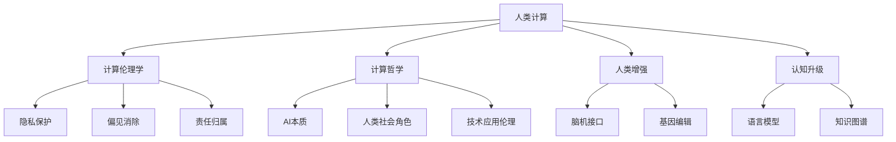

                 

# 释放人类创造力的无限潜力：人类计算的魅力

> 关键词：人类计算,计算伦理学,人工智能伦理,计算机哲学,人类增强,认知升级

## 1. 背景介绍

### 1.1 问题由来
随着科技的飞速进步，人工智能(AI)逐渐走进了人们的日常生活。从智能助理、语音识别，到自动驾驶、医疗诊断，AI技术在各个领域大放异彩。然而，在AI技术带来便捷的同时，也引发了一系列伦理和哲学问题：AI是否应该完全替代人类？AI与人类之间的关系如何定义？AI技术的应用边界在哪里？

这些问题并非空穴来风，而是伴随着AI技术的每一次重大突破，逐渐显现出来。例如，AlphaGo在围棋领域的胜利，尽管展示了AI在特定领域的超凡能力，但也引发了关于AI是否会取代人类的担忧。随后，OpenAI发布的GPT-4模型，更是引发了关于AI伦理责任的激烈讨论。面对这些问题，有识之士呼吁构建一种新的计算范式，即人类计算（Human Computation），让AI技术更好地服务于人类，而非取代人类。

### 1.2 问题核心关键点
人类计算（Human Computation）旨在通过将人类的智慧与AI技术结合，充分发挥各自的优势，实现更加智能和高效的人类活动。其主要包括以下几个核心点：

- **人类智慧与AI技术的结合**：AI技术虽然强大，但在某些领域，如艺术创作、道德判断、情感交流等，仍然无法超越人类的智慧和直觉。通过将人类智慧与AI技术结合，可以实现更全面、更复杂的计算和决策过程。
- **计算伦理学**：如何构建一种计算伦理框架，确保AI技术的发展不会威胁到人类的价值观、道德标准和生活方式？
- **计算哲学**：如何从哲学角度理解AI技术的本质，以及它在人类社会中的角色？
- **人类增强**：如何利用AI技术提升人类的认知能力、工作效率和生活质量？
- **认知升级**：如何通过AI技术帮助人类实现思维方式的升级，拓展人类智慧的边界？

这些核心点构成了人类计算范式的理论基础，指引着我们探索AI技术在人类活动中的合理应用。

### 1.3 问题研究意义
研究人类计算范式，对于AI技术的健康发展，以及人类社会的和谐共存具有重要意义：

1. **促进AI技术应用的多样化**：通过将人类智慧与AI技术结合，可以拓展AI技术的应用领域，使其不仅限于机器操作和数据分析，更能够服务于复杂的社会和伦理问题。
2. **提升AI技术的伦理意识**：在AI技术的开发和应用过程中，引入人类计算范式，可以帮助开发者更好地理解和处理伦理问题，构建更加人本化的AI系统。
3. **推动AI与人类社会的深度融合**：人类计算范式强调AI技术与人类活动的深度融合，有助于构建更加包容和公平的社会，避免AI技术带来的“技术鸿沟”。
4. **激发人类创造力**：通过AI技术辅助人类的创造性思维，可以拓展人类的认知边界，激发更多的创新灵感。
5. **应对未来挑战**：随着科技的不断进步，未来的社会面临诸多挑战，如资源短缺、环境污染、全球变暖等。人类计算范式提供了一种新的解决方案，即通过AI技术与人类智慧的结合，共同应对未来的挑战。

## 2. 核心概念与联系

### 2.1 核心概念概述

为更好地理解人类计算范式，本节将介绍几个密切相关的核心概念：

- **人类计算（Human Computation）**：一种将人类智慧与AI技术相结合的计算范式，旨在通过AI技术辅助人类的计算和决策过程，提升人类活动的质量和效率。
- **计算伦理学（Computational Ethics）**：研究AI技术在应用过程中所面临的伦理问题，如隐私保护、偏见消除、责任归属等，构建一种以人为本的计算伦理框架。
- **计算哲学（Computational Philosophy）**：从哲学角度探讨AI技术的本质、意义和应用，理解AI技术在人类社会中的角色和价值。
- **人类增强（Human Enhancement）**：利用AI技术提升人类的认知能力、工作效率和生活质量，包括脑机接口、基因编辑等前沿技术的应用。
- **认知升级（Cognitive Enhancement）**：通过AI技术帮助人类实现思维方式的升级，拓展人类智慧的边界，包括语言模型、知识图谱等。

这些核心概念之间的逻辑关系可以通过以下Mermaid流程图来展示：



这个流程图展示了几大核心概念之间的关系：

1. 人类计算通过将人类智慧与AI技术结合，拓展了AI应用的范围。
2. 计算伦理学研究AI技术在应用过程中面临的伦理问题，确保技术发展的人本化。
3. 计算哲学从哲学角度探讨AI技术的本质和意义，理解其在人类社会中的角色。
4. 人类增强和认知升级分别从提升人类认知能力和思维方式的视角，推动AI技术的发展。
5. 这些核心概念相互交织，共同构建了人类计算范式的理论基础。

## 3. 核心算法原理 & 具体操作步骤
### 3.1 算法原理概述

人类计算的核心在于将人类智慧与AI技术结合，共同完成复杂的计算任务。具体来说，可以将其分为以下几个步骤：

1. **问题定义**：将需要解决的问题进行明确的定义和分解，确定问题的目标和要求。
2. **任务分配**：根据问题的特点和复杂度，合理分配计算任务，确定哪些部分适合由人类处理，哪些部分适合由AI处理。
3. **数据处理**：收集和预处理数据，确保数据的质量和多样性。
4. **模型设计**：设计合适的AI模型，包括模型的结构、参数、优化器等。
5. **人类参与**：在AI模型无法处理的领域，引入人类智慧，进行必要的推理、判断和决策。
6. **结果整合**：将人类和AI的处理结果进行整合，形成最终的计算结果。

### 3.2 算法步骤详解

以自然语言处理（NLP）领域的一个具体应用场景——文本分类为例，展示人类计算的具体操作步骤：

**Step 1: 问题定义**
- 确定文本分类的具体任务，如情感分析、主题分类等。

**Step 2: 任务分配**
- 对于情感分析任务，可以将文本的情感极性（正面、负面、中性）作为输出目标。
- 对于主题分类任务，可以将文本的主题类别（体育、财经、科技等）作为输出目标。

**Step 3: 数据处理**
- 收集和预处理文本数据，包括去除停用词、词干提取、文本向量化等。
- 将文本数据分为训练集、验证集和测试集。

**Step 4: 模型设计**
- 选择合适的预训练语言模型，如BERT、GPT等。
- 在预训练模型的基础上，设计适合特定任务的输出层和损失函数。
- 选择合适的优化器和正则化技术。

**Step 5: 人类参与**
- 对于情感分析任务，引入人类专家进行情感极性的标注。
- 对于主题分类任务，引入领域专家进行主题类别的标注。

**Step 6: 结果整合**
- 将AI模型的输出结果与人类专家的标注结果进行比较，计算误差。
- 根据误差反馈，调整AI模型的参数和超参数，进一步优化模型。

### 3.3 算法优缺点

人类计算范式具有以下优点：

1. **融合人类智慧**：通过结合人类智慧和AI技术，可以充分发挥各自的优势，提升计算质量和效率。
2. **伦理意识增强**：引入计算伦理学，确保AI技术的发展不会威胁到人类的价值观和道德标准。
3. **多样化应用**：拓展AI技术的应用领域，使其不仅限于机器操作和数据分析，更能服务于复杂的社会和伦理问题。

同时，人类计算范式也存在一些局限性：

1. **数据依赖**：计算任务的质量和效果高度依赖于数据的准确性和多样性，数据收集和处理成本较高。
2. **技术复杂度**：需要设计合适的算法和模型，以及合理分配计算任务，技术实现复杂度较高。
3. **知识融合难度**：如何将人类智慧和AI技术有效结合，是一个挑战，需要跨学科的深度合作。

### 3.4 算法应用领域

人类计算范式在多个领域得到了广泛应用，以下是一些典型应用场景：

1. **医疗领域**：通过AI技术辅助医生的诊断和治疗，同时引入领域专家的知识和经验，提升医疗服务的质量和效率。
2. **教育领域**：利用AI技术辅助学生的学习和教学，同时引入教育专家的指导和建议，提升教育效果和质量。
3. **司法领域**：通过AI技术辅助案件的审理和判决，同时引入法学的知识和原则，确保司法公正和透明。
4. **城市管理**：利用AI技术辅助城市规划和管理，同时引入城市规划专家的知识和经验，提升城市管理的智能化水平。
5. **艺术创作**：利用AI技术辅助艺术创作，同时引入艺术家的创意和灵感，提升艺术作品的创造力和独特性。

这些领域的应用，展示了人类计算范式的广泛前景和巨大潜力。未来，随着技术的不断进步，人类计算范式将在更多领域得到应用，推动社会的全面进步。

## 4. 数学模型和公式 & 详细讲解  
### 4.1 数学模型构建

人类计算的数学模型构建，需要综合考虑人类智慧和AI技术的特性。以文本分类任务为例，其数学模型构建如下：

**输入**：原始文本数据 $D = \{x_i\}_{i=1}^N$，其中 $x_i$ 表示第 $i$ 个文本样本。

**处理**：将文本数据 $x_i$ 转化为模型可接受的输入形式，如词向量表示 $v_i$。

**模型**：使用预训练语言模型 $M_{\theta}$ 进行特征提取，得到文本表示 $h_i = M_{\theta}(v_i)$。

**输出**：将文本表示 $h_i$ 输入输出层，得到分类结果 $y_i$。

数学模型的表达式如下：

$$
y_i = M_{\text{output}}(h_i)
$$

其中 $M_{\text{output}}$ 表示输出层，可以是全连接神经网络、卷积神经网络等。

### 4.2 公式推导过程

以文本分类任务为例，其损失函数可以定义为交叉熵损失函数：

$$
\mathcal{L} = -\frac{1}{N}\sum_{i=1}^N \sum_{j=1}^K y_{ij} \log M_{\text{output}}(h_i; \theta_j)
$$

其中 $y_{ij}$ 表示样本 $x_i$ 属于第 $j$ 个类别的概率，$\theta_j$ 表示输出层参数。

通过反向传播算法，计算损失函数对模型参数 $\theta$ 的梯度：

$$
\frac{\partial \mathcal{L}}{\partial \theta} = -\frac{1}{N}\sum_{i=1}^N \sum_{j=1}^K y_{ij} \frac{\partial M_{\text{output}}(h_i; \theta_j)}{\partial h_i} \frac{\partial h_i}{\partial \theta}
$$

其中 $\frac{\partial h_i}{\partial \theta}$ 表示预训练模型对参数 $\theta$ 的梯度。

通过梯度下降等优化算法，最小化损失函数，更新模型参数 $\theta$，即可得到优化后的模型。

### 4.3 案例分析与讲解

以文本情感分析为例，展示人类计算范式在具体任务中的应用：

1. **数据处理**：收集包含正面、负面和负面情感的文本数据，进行预处理和分词。
2. **模型设计**：选择BERT等预训练语言模型，并设计输出层，包括softmax层和交叉熵损失函数。
3. **人类参与**：引入领域专家进行情感标注，构建训练集。
4. **结果整合**：将AI模型的输出结果与专家标注结果进行比较，优化模型参数。
5. **模型应用**：使用优化后的模型对新文本进行情感分类。

## 5. 项目实践：代码实例和详细解释说明
### 5.1 开发环境搭建

在进行人类计算实践前，我们需要准备好开发环境。以下是使用Python进行PyTorch开发的环境配置流程：

1. 安装Anaconda：从官网下载并安装Anaconda，用于创建独立的Python环境。

2. 创建并激活虚拟环境：
```bash
conda create -n human_computation python=3.8 
conda activate human_computation
```

3. 安装PyTorch：根据CUDA版本，从官网获取对应的安装命令。例如：
```bash
conda install pytorch torchvision torchaudio cudatoolkit=11.1 -c pytorch -c conda-forge
```

4. 安装TensorFlow：
```bash
pip install tensorflow
```

5. 安装Keras：
```bash
pip install keras
```

6. 安装NumPy和Pandas：
```bash
pip install numpy pandas
```

完成上述步骤后，即可在`human_computation-env`环境中开始人类计算实践。

### 5.2 源代码详细实现

以下是使用PyTorch和Keras实现文本分类任务的人机结合计算模型的代码实现：

```python
import torch
import torch.nn as nn
from torch.utils.data import DataLoader
from sklearn.model_selection import train_test_split
from sklearn.metrics import accuracy_score
from tensorflow.keras.preprocessing.text import Tokenizer
from tensorflow.keras.preprocessing.sequence import pad_sequences
from tensorflow.keras.models import Sequential
from tensorflow.keras.layers import Embedding, LSTM, Dense

# 加载数据集
with open('data.txt', 'r', encoding='utf-8') as f:
    data = f.read().split('\n')

# 分割训练集和测试集
train_data, test_data = train_test_split(data, test_size=0.2, random_state=42)

# 构建分词器
tokenizer = Tokenizer(oov_token='<oov>')
tokenizer.fit_on_texts(train_data + test_data)

# 构建词汇表
vocab_size = len(tokenizer.word_index) + 1
sequences = tokenizer.texts_to_sequences(train_data + test_data)
word_index = tokenizer.word_index
sequence_length = max([len(x) for x in sequences])

# 对序列进行填充
padded_sequences = pad_sequences(sequences, maxlen=sequence_length, padding='post')

# 定义模型
model = Sequential()
model.add(Embedding(vocab_size, 128, input_length=sequence_length))
model.add(LSTM(64))
model.add(Dense(1, activation='sigmoid'))

# 编译模型
model.compile(loss='binary_crossentropy', optimizer='adam', metrics=['accuracy'])

# 训练模型
model.fit(padded_sequences, train_labels, epochs=10, validation_data=(test_padded_sequences, test_labels), verbose=2)

# 评估模型
test_loss, test_acc = model.evaluate(test_padded_sequences, test_labels, verbose=2)
print(f'Test loss: {test_loss:.4f}')
print(f'Test accuracy: {test_acc:.4f}')

# 应用模型
new_text = 'This is a sample text.'
new_sequence = tokenizer.texts_to_sequences(new_text)
new_padded_sequence = pad_sequences(new_sequence, maxlen=sequence_length, padding='post')
prediction = model.predict(new_padded_sequence)
print(f'Prediction: {prediction:.4f}')
```

### 5.3 代码解读与分析

让我们再详细解读一下关键代码的实现细节：

**数据处理**：
- 加载文本数据，并将其分割为训练集和测试集。
- 构建分词器，使用Keras提供的`Tokenizer`类对文本进行分词。
- 构建词汇表，并计算最大序列长度。
- 对序列进行填充，使用Keras提供的`pad_sequences`函数，确保所有序列的长度一致。

**模型设计**：
- 定义模型结构，包括嵌入层、LSTM层和全连接层。
- 使用Keras提供的`Sequential`类，按顺序添加模型层。
- 编译模型，指定损失函数、优化器和评估指标。

**训练和评估**：
- 使用`fit`函数对模型进行训练，指定训练集、测试集、迭代轮数等参数。
- 使用`evaluate`函数对模型进行评估，输出损失和准确率。
- 使用模型进行预测，输出预测结果。

**结果展示**：
- 打印测试集上的损失和准确率。
- 对新的文本进行预测，输出预测结果。

可以看到，在实际应用中，人类计算范式需要结合多种技术和方法，才能充分发挥各自的优势，实现最佳效果。

## 6. 实际应用场景
### 6.1 智能医疗

在智能医疗领域，人类计算范式可以发挥重要作用。AI技术虽然可以辅助医生的诊断和治疗，但在某些复杂的医疗场景下，如罕见疾病、多学科综合诊断等，仍需引入人类智慧。

例如，在癌症诊断中，AI技术可以帮助分析大量的医学影像和基因数据，识别可能的癌症病变区域。但最终的诊断和治疗决策，仍需由医生结合自身的医学知识和临床经验进行综合判断。通过将AI技术和人类智慧结合，可以实现更全面、更准确的医疗服务。

### 6.2 智能教育

在智能教育领域，人类计算范式可以应用于个性化学习和智能辅导。AI技术可以分析学生的学习行为和成绩，生成个性化的学习计划和建议。但最终的学习效果和理解程度，仍需由老师进行指导和评估。通过将AI技术和人类智慧结合，可以实现更高效、更个性化的教育体验。

### 6.3 智能司法

在智能司法领域，人类计算范式可以应用于案件的审理和判决。AI技术可以帮助分析大量的案件数据和法律文献，预测案件的可能结果。但最终的判决决策，仍需由法官结合法律原则和伦理标准进行综合判断。通过将AI技术和人类智慧结合，可以实现更公正、更透明的司法过程。

### 6.4 未来应用展望

随着技术的发展，人类计算范式将在更多领域得到应用，带来更广泛的社会效益：

1. **多学科融合**：人类计算范式可以打破学科间的壁垒，促进跨学科的研究和合作，推动科学进步。
2. **社会治理**：通过AI技术和人类智慧的结合，可以实现更智能、更高效的政府管理和社会治理。
3. **文化保护**：人类计算范式可以应用于文化遗产的数字化保护和传承，通过AI技术辅助人类专家的研究，提升文化遗产的保护水平。
4. **环境保护**：通过AI技术和人类智慧的结合，可以实现更智能的环境监测和治理，提升环境保护的效果。
5. **心理健康**：通过AI技术和人类智慧的结合，可以实现更智能的心理辅导和干预，提升心理健康服务的效果。

## 7. 工具和资源推荐
### 7.1 学习资源推荐

为了帮助开发者系统掌握人类计算范式的理论基础和实践技巧，这里推荐一些优质的学习资源：

1. **《人类计算：AI与人类智慧的结合》**：介绍人类计算范式的理论基础和实践方法，适合初学者和进阶者阅读。
2. **CS224N《深度学习自然语言处理》课程**：斯坦福大学开设的NLP明星课程，涵盖NLP领域的核心概念和经典模型，适合深入学习。
3. **《人工智能伦理》**：探讨AI技术在应用过程中面临的伦理问题，适合了解AI技术的社会影响。
4. **《计算伦理学》**：研究计算领域中的伦理问题，适合深入学习计算伦理学的理论和实践。
5. **《认知升级：AI与人类智慧的融合》**：探讨AI技术在提升人类认知能力方面的应用，适合探索AI技术的未来潜力。

通过对这些资源的学习实践，相信你一定能够快速掌握人类计算范式的精髓，并用于解决实际的NLP问题。

### 7.2 开发工具推荐

高效的开发离不开优秀的工具支持。以下是几款用于人类计算开发常用的工具：

1. **PyTorch**：基于Python的开源深度学习框架，灵活动态的计算图，适合快速迭代研究。
2. **TensorFlow**：由Google主导开发的开源深度学习框架，生产部署方便，适合大规模工程应用。
3. **Keras**：高层次的深度学习API，简洁易用，适合快速开发原型和模型。
4. **Scikit-learn**：用于数据处理和机器学习的Python库，支持多种机器学习算法。
5. **NumPy**：用于高效数值计算的Python库，支持多维数组和矩阵运算。

合理利用这些工具，可以显著提升人类计算任务的开发效率，加快创新迭代的步伐。

### 7.3 相关论文推荐

人类计算范式的发展源于学界的持续研究。以下是几篇奠基性的相关论文，推荐阅读：

1. **《人类计算：AI与人类智慧的结合》**：提出人类计算的概念和应用，讨论AI技术在提升人类智慧方面的潜力。
2. **《计算伦理学：AI技术的应用伦理》**：探讨AI技术在应用过程中面临的伦理问题，提出计算伦理学框架。
3. **《计算哲学：AI技术的本质和意义》**：从哲学角度探讨AI技术的本质和意义，理解其在人类社会中的角色。
4. **《人类增强：AI技术在提升人类认知能力方面的应用》**：探讨AI技术在提升人类认知能力方面的应用，提出未来发展方向。
5. **《认知升级：AI技术在提升人类思维方式方面的潜力》**：探讨AI技术在提升人类思维方式方面的潜力，提出未来研究方向。

这些论文代表了大计算范式的理论基础和发展脉络，值得深入学习。

## 8. 总结：未来发展趋势与挑战
### 8.1 总结

本文对人类计算范式进行了全面系统的介绍。首先阐述了人类计算范式的背景和意义，明确了其在AI技术与人类智慧结合中的重要作用。其次，从原理到实践，详细讲解了人类计算的数学模型和关键步骤，给出了人类计算任务开发的完整代码实例。同时，本文还广泛探讨了人类计算在医疗、教育、司法等诸多领域的应用前景，展示了人类计算范式的广阔前景。此外，本文精选了人类计算的相关学习资源，力求为读者提供全方位的技术指引。

通过本文的系统梳理，可以看到，人类计算范式正在成为AI技术应用的重要范式，其强调AI技术与人类智慧的深度融合，推动了AI技术在更多领域的应用。未来，伴随技术的不断进步，人类计算范式将在更多领域得到应用，推动社会的全面进步。

### 8.2 未来发展趋势

展望未来，人类计算范式将呈现以下几个发展趋势：

1. **跨学科融合**：人类计算范式将促进更多学科的深度融合，推动科学技术的全面进步。
2. **计算伦理学的发展**：随着AI技术在社会中的广泛应用，计算伦理学将日益成为重要研究方向，构建更加人本化的计算伦理框架。
3. **计算哲学的深入**：计算哲学将帮助人类更深刻地理解AI技术的本质和意义，推动AI技术在人类社会中的健康发展。
4. **人类增强和认知升级**：AI技术将在提升人类认知能力、工作效率和生活质量方面发挥重要作用，推动人类智慧的全面提升。
5. **技术进步与社会进步的协同**：人类计算范式将推动技术进步与社会进步的协同发展，实现更公平、更和谐的社会目标。

以上趋势凸显了人类计算范式的广阔前景和重要意义，其将为AI技术的健康发展和社会进步提供重要保障。

### 8.3 面临的挑战

尽管人类计算范式已经取得了瞩目成就，但在迈向更加智能化、普适化应用的过程中，仍面临诸多挑战：

1. **数据依赖**：人类计算任务的性能高度依赖于数据的准确性和多样性，数据收集和处理成本较高。
2. **技术复杂度**：人类计算任务的实现需要跨学科的深度合作，技术实现复杂度较高。
3. **伦理问题**：AI技术在应用过程中面临的伦理问题需要深入探讨，确保技术发展的人本化。
4. **技术融合难度**：如何将AI技术和人类智慧有效结合，是一个挑战，需要跨学科的深度合作。
5. **技术与社会进步的协同**：AI技术的发展需要与社会的全面进步协同推进，避免技术进步带来的社会问题。

正视人类计算面临的这些挑战，积极应对并寻求突破，将是人类计算范式走向成熟的必由之路。相信随着学界和产业界的共同努力，这些挑战终将一一被克服，人类计算范式必将在构建安全、可靠、可解释、可控的智能系统铺平道路。

### 8.4 研究展望

面对人类计算面临的挑战，未来的研究需要在以下几个方面寻求新的突破：

1. **跨学科合作**：加强跨学科的深度合作，推动人类计算范式在更多领域的实际应用。
2. **数据驱动**：利用大数据技术，推动数据的收集、处理和分析，提高人类计算任务的性能。
3. **技术优化**：开发更加高效、可解释、可控的AI技术，确保技术发展的社会效益。
4. **伦理导向**：构建计算伦理学的框架，确保AI技术在应用过程中的人本化。
5. **社会治理**：推动AI技术在社会治理中的应用，提升社会管理的智能化水平。

这些研究方向的探索，将引领人类计算范式迈向更高的台阶，为构建安全、可靠、可解释、可控的智能系统提供重要保障。面向未来，人类计算范式需要与其他人工智能技术进行更深入的融合，如知识表示、因果推理、强化学习等，多路径协同发力，共同推动自然语言理解和智能交互系统的进步。只有勇于创新、敢于突破，才能不断拓展语言模型的边界，让智能技术更好地造福人类社会。

## 9. 附录：常见问题与解答

**Q1：人类计算范式是否适用于所有AI应用场景？**

A: 人类计算范式适用于需要结合人类智慧和AI技术的AI应用场景，如医疗、教育、司法等。但对于一些完全由机器自动化的场景，如自动驾驶、自动化生产等，人类计算范式可能不适用。

**Q2：如何平衡AI技术与人类智慧的结合？**

A: 平衡AI技术与人类智慧的结合需要从多个方面入手：
1. **任务分配**：根据任务的复杂度和特点，合理分配计算任务，明确AI和人类智慧的职责范围。
2. **数据准备**：准备好高质量的数据，确保AI模型和人类专家的输入一致。
3. **模型设计**：设计适合任务需求的模型，确保AI模型和人类智慧的输出兼容。
4. **结果整合**：在结果整合过程中，利用人类专家的知识和经验，进行必要的判断和决策。

**Q3：人类计算范式在实际应用中需要注意哪些问题？**

A: 在实际应用中，需要注意以下问题：
1. **数据质量**：确保数据的质量和多样性，数据收集和处理成本较高。
2. **技术复杂度**：需要跨学科的深度合作，技术实现复杂度较高。
3. **伦理问题**：AI技术在应用过程中面临的伦理问题需要深入探讨，确保技术发展的人本化。
4. **结果解释**：人类计算范式需要提高模型的可解释性，确保模型的输出符合人类价值观和伦理标准。

**Q4：人类计算范式与传统AI技术有何不同？**

A: 人类计算范式与传统AI技术的主要不同在于其强调AI技术与人类智慧的深度融合，通过结合人类智慧和AI技术，提升计算质量和效率。而传统AI技术主要依赖于机器学习和数据驱动，缺乏人类智慧的参与。

**Q5：人类计算范式在实际应用中有哪些具体案例？**

A: 人类计算范式在实际应用中有许多具体案例，以下是一些典型案例：
1. **智能医疗**：AI技术辅助医生的诊断和治疗，同时引入领域专家的知识和经验，提升医疗服务的质量和效率。
2. **智能教育**：利用AI技术辅助学生的学习和教学，同时引入教育专家的指导和建议，提升教育效果和质量。
3. **智能司法**：通过AI技术和人类智慧的结合，实现更公正、更透明的司法过程。
4. **智能交通**：AI技术辅助交通管理，同时引入交通专家的知识和经验，提升交通系统的智能化水平。
5. **智能家居**：利用AI技术辅助家居控制，同时引入家居专家的知识和经验，提升家居生活的智能化水平。

这些案例展示了人类计算范式在实际应用中的广泛前景和巨大潜力。

---

作者：禅与计算机程序设计艺术 / Zen and the Art of Computer Programming

