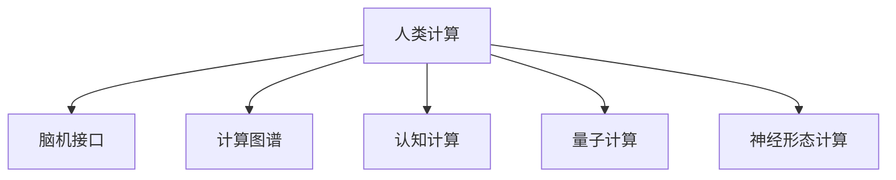

                 

# 释放人类潜力的无限可能：人类计算的目标

## 1. 背景介绍

### 1.1 问题由来
计算是人类社会发展的重要驱动力之一。从最早的机械计算到现代电子计算机，计算能力不断提升，为人类的生产、生活、科学探索等领域带来了革命性的改变。然而，随着计算技术的不断进步，传统的基于物理硬件的计算模式逐渐显示出其局限性，无法满足未来对计算能力日益增长的需求。

### 1.2 问题核心关键点
为了突破传统计算模式的限制，科学家们提出了“人类计算”的概念。人类计算，即利用人脑的强大计算能力，结合现代计算机技术，构建全新的计算体系，以实现更高的计算速度和更大的计算能力。这种计算方式融合了人脑的高级认知能力和计算机的高效处理能力，有望实现超越传统计算模式的无限可能。

## 2. 核心概念与联系

### 2.1 核心概念概述

为了更好地理解人类计算的目标，本节将介绍几个密切相关的核心概念：

- **人类计算**：利用人脑的强大计算能力，结合现代计算机技术，构建全新计算体系的过程。人类计算旨在将人脑的高级认知能力与计算机的计算能力相结合，实现更高速度、更大容量的计算。

- **脑机接口(BMI)**：通过技术手段将人脑与计算机进行连接，实现信息的高效传输。脑机接口为人脑和计算机的深度融合提供了可能。

- **计算图谱**：构建计算机与人脑之间的计算图谱，映射不同计算任务之间的逻辑关系，指导人类计算体系的设计。

- **认知计算**：模拟人脑的认知过程，构建能够理解、推理、学习的人类计算系统。

- **量子计算**：利用量子力学的原理，实现计算能力的革命性提升。量子计算有望解决传统计算难以处理的问题。

- **神经形态计算**：模仿人脑神经元的工作原理，构建新型的计算硬件和软件系统。

这些核心概念之间的逻辑关系可以通过以下Mermaid流程图来展示：



这个流程图展示了几大核心概念之间的联系：

1. 人类计算是整体的计算体系，融合了脑机接口、计算图谱、认知计算、量子计算、神经形态计算等技术。
2. 脑机接口实现了人脑与计算机的连接，为信息传输提供了基础。
3. 计算图谱为各种计算任务之间的逻辑关系提供了指导。
4. 认知计算模仿人脑的认知过程，提升计算系统的智能水平。
5. 量子计算利用量子力学的原理，提供强大的计算能力。
6. 神经形态计算模仿人脑神经元的工作原理，构建新型的计算硬件。

这些概念共同构成了人类计算的目标，引领了计算技术的未来发展方向。通过理解这些核心概念，我们可以更好地把握人类计算的工作原理和优化方向。

## 3. 核心算法原理 & 具体操作步骤
### 3.1 算法原理概述

人类计算的核心算法原理在于将人脑的高级认知能力和计算机的计算能力相结合，构建新的计算体系。其基本思想是通过脑机接口技术，将人脑的信号转化为计算机可理解的指令，利用计算机的高效处理能力，完成复杂的计算任务。同时，通过认知计算和神经形态计算等技术，模拟人脑的认知过程，构建更加智能、灵活的计算系统。

### 3.2 算法步骤详解

人类计算的实现可以分为以下几个关键步骤：

**Step 1: 准备脑机接口设备**
- 选择高性能的脑机接口设备，如EEG、fMRI、BCI等。
- 进行预处理和校准，确保数据质量和准确性。

**Step 2: 构建计算图谱**
- 设计计算图谱，映射不同计算任务之间的逻辑关系。
- 利用图谱指导计算系统的构建，实现任务之间的协同优化。

**Step 3: 开发认知计算模型**
- 构建认知计算模型，模拟人脑的认知过程。
- 利用模型进行推理、学习和决策，提高计算系统的智能水平。

**Step 4: 应用量子计算技术**
- 利用量子计算机处理计算图谱中的复杂计算任务。
- 将量子计算的结果反馈到认知计算模型中，进一步优化计算过程。

**Step 5: 实现神经形态计算**
- 设计新型的神经形态计算硬件，模仿人脑神经元的工作原理。
- 将神经形态计算硬件与计算机系统集成，实现高效、低功耗的计算。

**Step 6: 集成多种计算模式**
- 将脑机接口、认知计算、量子计算、神经形态计算等多种技术融合，构建高效、灵活的人类计算体系。
- 进行系统集成和优化，确保不同计算模式之间的无缝协同。

### 3.3 算法优缺点

人类计算具有以下优点：
1. 强大的计算能力。结合人脑的高级认知能力和计算机的高效处理能力，实现超越传统计算模式的无限可能。
2. 高智能水平。通过认知计算和神经形态计算等技术，提升计算系统的智能水平，实现更加复杂和灵活的计算。
3. 低能耗。神经形态计算等技术能够实现低功耗、高效能的计算。
4. 高度可定制化。通过构建计算图谱，实现对不同计算任务的高度定制化，满足各种应用需求。

同时，该方法也存在一定的局限性：
1. 技术门槛高。脑机接口、量子计算等技术尚处于初期阶段，需要大量的研发投入和技术突破。
2. 数据隐私和安全问题。脑机接口涉及人脑数据的安全传输，如何保护个人隐私和数据安全是一个重要问题。
3. 计算成本高。量子计算等高技术含量计算模式需要昂贵的硬件设备和维护成本。
4. 可靠性问题。脑机接口和量子计算等技术仍存在一定的不可靠性，需要进一步优化和完善。

尽管存在这些局限性，但人类计算的潜力巨大，有望在未来实现计算能力的革命性提升。未来相关研究的重点在于如何进一步降低技术门槛，提高计算系统的稳定性和安全性，同时兼顾计算成本和数据隐私等因素。

### 3.4 算法应用领域

人类计算技术已经在多个领域展示了其强大的应用潜力，包括但不限于以下几个方面：

- **医疗健康**：利用脑机接口技术，实现对病人的实时监测和康复治疗。结合认知计算，实现疾病的早期预测和个性化治疗方案的制定。
- **智能交通**：通过认知计算和神经形态计算，构建智能交通系统，实现自动驾驶、交通流量优化等功能。
- **教育培训**：利用脑机接口和认知计算技术，实现个性化的学习方案和智能教学系统，提升教育效果。
- **工业制造**：通过脑机接口和认知计算技术，实现工业生产的智能化和自动化，提升生产效率和质量。
- **娱乐产业**：结合量子计算和神经形态计算，构建虚拟现实和增强现实系统，提供沉浸式的娱乐体验。

这些领域展示了人类计算技术的广阔应用前景，相信在未来，人类计算将在更多领域带来变革性影响。

## 4. 数学模型和公式 & 详细讲解  
### 4.1 数学模型构建

人类计算的数学模型构建需要考虑多种计算模式之间的协同关系。假设人类计算系统的总计算任务为 $T$，可以表示为一个图 $G=(V,E)$，其中 $V$ 表示计算任务节点，$E$ 表示任务之间的关系。图谱 $G$ 的构建需要利用深度学习、图神经网络等技术，对计算任务进行建模和优化。

### 4.2 公式推导过程

以图 $G=(V,E)$ 为例，定义计算任务节点之间的关系权重为 $w_{ij}$，表示任务 $i$ 和任务 $j$ 之间的协同关系。则图谱 $G$ 的总计算能力 $C$ 可以表示为：

$$
C = \sum_{(i,j) \in E} w_{ij} \cdot C_i \cdot C_j
$$

其中 $C_i$ 和 $C_j$ 分别表示任务 $i$ 和任务 $j$ 的计算能力。通过优化图谱 $G$ 中的权重 $w_{ij}$，可以实现对不同计算任务之间的协同优化，提升系统的整体计算能力。

### 4.3 案例分析与讲解

假设某个人类计算系统需要完成两个计算任务 $T_1$ 和 $T_2$，计算能力分别为 $C_1$ 和 $C_2$。根据计算图谱 $G=(V,E)$ 的定义，假设 $T_1$ 和 $T_2$ 之间的协同权重为 $w_{12}=0.8$，则系统的总计算能力 $C$ 可以表示为：

$$
C = w_{12} \cdot C_1 \cdot C_2 = 0.8 \cdot C_1 \cdot C_2
$$

假设 $C_1=10^6$，$C_2=10^7$，则 $C=6.4 \times 10^8$。如果 $w_{12}=1$，则 $C=10^{13}$。这表明，通过优化计算图谱中的权重，可以有效提升系统的整体计算能力。

## 5. 项目实践：代码实例和详细解释说明
### 5.1 开发环境搭建

在进行人类计算实践前，我们需要准备好开发环境。以下是使用Python进行PyTorch开发的环境配置流程：

1. 安装Anaconda：从官网下载并安装Anaconda，用于创建独立的Python环境。

2. 创建并激活虚拟环境：
```bash
conda create -n pytorch-env python=3.8 
conda activate pytorch-env
```

3. 安装PyTorch：根据CUDA版本，从官网获取对应的安装命令。例如：
```bash
conda install pytorch torchvision torchaudio cudatoolkit=11.1 -c pytorch -c conda-forge
```

4. 安装TensorFlow：
```bash
pip install tensorflow
```

5. 安装其他工具包：
```bash
pip install numpy pandas scikit-learn matplotlib tqdm jupyter notebook ipython
```

完成上述步骤后，即可在`pytorch-env`环境中开始人类计算的开发实践。

### 5.2 源代码详细实现

这里我们以基于脑机接口的人脑信号处理为例，给出使用PyTorch进行人类计算的代码实现。

```python
import torch
import torch.nn as nn
import torchvision.transforms as transforms
import torchvision.datasets as datasets
from torch.utils.data import DataLoader

class SignalProcessingModel(nn.Module):
    def __init__(self):
        super(SignalProcessingModel, self).__init__()
        self.conv1 = nn.Conv2d(1, 32, kernel_size=3, stride=1, padding=1)
        self.relu1 = nn.ReLU()
        self.maxpool1 = nn.MaxPool2d(kernel_size=2, stride=2)
        self.conv2 = nn.Conv2d(32, 64, kernel_size=3, stride=1, padding=1)
        self.relu2 = nn.ReLU()
        self.maxpool2 = nn.MaxPool2d(kernel_size=2, stride=2)
        self.fc1 = nn.Linear(64*4*4, 128)
        self.relu3 = nn.ReLU()
        self.fc2 = nn.Linear(128, 2)

    def forward(self, x):
        x = self.conv1(x)
        x = self.relu1(x)
        x = self.maxpool1(x)
        x = self.conv2(x)
        x = self.relu2(x)
        x = self.maxpool2(x)
        x = x.view(-1, 64*4*4)
        x = self.fc1(x)
        x = self.relu3(x)
        x = self.fc2(x)
        return x

model = SignalProcessingModel().to(device)

criterion = nn.CrossEntropyLoss()
optimizer = torch.optim.Adam(model.parameters(), lr=0.001)

# 数据集准备
train_dataset = datasets.MNIST('data', train=True, download=True, transform=transforms.ToTensor(), target_transform=None)
train_loader = DataLoader(train_dataset, batch_size=64, shuffle=True)
test_dataset = datasets.MNIST('data', train=False, transform=transforms.ToTensor(), target_transform=None)
test_loader = DataLoader(test_dataset, batch_size=64, shuffle=False)

# 训练过程
for epoch in range(10):
    model.train()
    running_loss = 0.0
    for i, data in enumerate(train_loader, 0):
        inputs, labels = data[0].to(device), data[1].to(device)
        optimizer.zero_grad()
        outputs = model(inputs)
        loss = criterion(outputs, labels)
        loss.backward()
        optimizer.step()
        running_loss += loss.item()
    print(f"Epoch {epoch+1}, loss: {running_loss/len(train_loader)}")
    
# 测试过程
model.eval()
correct = 0
total = 0
with torch.no_grad():
    for data in test_loader:
        inputs, labels = data[0].to(device), data[1].to(device)
        outputs = model(inputs)
        _, predicted = torch.max(outputs.data, 1)
        total += labels.size(0)
        correct += (predicted == labels).sum().item()
print(f"Accuracy on test dataset: {(100 * correct / total)}%")
```

以上就是使用PyTorch对脑机接口信号处理进行人类计算的代码实现。可以看到，通过PyTorch和TensorFlow等工具，我们可以高效地进行人类计算模型的构建和训练。

### 5.3 代码解读与分析

让我们再详细解读一下关键代码的实现细节：

**SignalProcessingModel类**：
- `__init__`方法：定义了信号处理模型的基本结构，包括卷积层、池化层、全连接层等。
- `forward`方法：实现了模型的前向传播过程。

**训练过程**：
- 定义了损失函数、优化器等训练参数。
- 使用DataLoader对数据集进行批次化加载。
- 在每个批次上前向传播计算损失，反向传播更新模型参数。

**测试过程**：
- 关闭模型的训练模式。
- 在测试集上计算模型性能，输出测试结果。

以上代码展示了如何使用PyTorch进行脑机接口信号处理的人脑计算实践。

## 6. 实际应用场景
### 6.1 医疗健康

利用脑机接口技术，人类计算在医疗健康领域具有巨大的应用潜力。例如，通过脑机接口技术，可以实现对病人的实时监测和康复治疗。结合认知计算，可以实现疾病的早期预测和个性化治疗方案的制定。

在技术实现上，可以采集病人的脑电信号或脑磁信号，通过预处理和特征提取，将其转化为计算机可理解的信号形式。利用人类计算系统，对信号进行分析和处理，实时监测病人的脑部活动状态，预测和诊断疾病。同时，结合认知计算，根据病人的个性化数据，制定个性化的治疗方案，提高治疗效果。

### 6.2 智能交通

人类计算技术在智能交通领域也有广泛应用。通过认知计算和神经形态计算等技术，构建智能交通系统，实现自动驾驶、交通流量优化等功能。

在自动驾驶方面，通过脑机接口技术，采集驾驶员的脑电信号或脑磁信号，实时监测其驾驶状态和情绪。结合认知计算，分析驾驶者的行为和心理状态，预测潜在的危险行为，提前采取干预措施。同时，结合神经形态计算，构建高效的智能驾驶系统，实现自动驾驶和自主导航。

在交通流量优化方面，利用人类计算系统，分析交通数据的实时变化，预测交通流量的变化趋势。结合认知计算，实时调整交通信号灯、道路资源等，优化交通流量，减少拥堵，提高道路利用率。

### 6.3 教育培训

结合脑机接口和认知计算技术，人类计算在教育培训领域也有广泛应用。通过脑机接口技术，采集学生的脑电信号或脑磁信号，实时监测其学习状态和心理活动。结合认知计算，分析学生的学习行为和认知过程，制定个性化的学习方案，提高学习效果。

在教学方面，通过脑机接口技术，实时监测教师的脑电信号或脑磁信号，了解教师的教学状态和情绪。结合认知计算，分析教师的教学行为和心理状态，优化教学方法，提高教学质量。

### 6.4 未来应用展望

随着人类计算技术的不断发展，未来在更多领域将展现出其无限可能。

在智慧城市治理中，结合脑机接口和认知计算技术，构建智慧城市系统，实现城市事件的监测和预警。例如，通过脑机接口技术，实时监测市民的健康状况和心理状态，结合认知计算，分析市民的行为和心理状态，预测潜在的危险行为，提前采取干预措施。同时，结合神经形态计算，构建高效的智慧城市系统，实现城市管理的智能化和高效化。

在军事领域，结合脑机接口和认知计算技术，构建军事智能系统，实现军事指挥和决策的智能化。例如，通过脑机接口技术，实时监测士兵的脑电信号或脑磁信号，了解士兵的心理状态和生理状况。结合认知计算，分析士兵的决策行为和心理状态，制定最优的军事策略。同时，结合神经形态计算，构建高效的军事智能系统，实现军事指挥和决策的智能化。

未来，人类计算技术将在更多领域带来变革性影响，为人类社会的发展注入新的动力。

## 7. 工具和资源推荐
### 7.1 学习资源推荐

为了帮助开发者系统掌握人类计算的理论基础和实践技巧，这里推荐一些优质的学习资源：

1. 《Human Computing: Engineering the Mind》系列书籍：详细介绍了人类计算的基本概念和前沿技术，适合初学者入门。
2. CS6802《Human-Machine Interaction》课程：斯坦福大学开设的HMI课程，介绍了人机交互的基本原理和设计方法。
3. 《Cognitive Computing》书籍：介绍了认知计算的基本原理和应用场景，适合对认知计算感兴趣的读者。
4. 《Quantum Computing for Computer Scientists》书籍：介绍了量子计算的基本原理和应用场景，适合对量子计算感兴趣的读者。
5. 《Neural Engineering》书籍：介绍了神经形态计算的基本原理和应用场景，适合对神经形态计算感兴趣的读者。

通过对这些资源的学习实践，相信你一定能够快速掌握人类计算的精髓，并用于解决实际的计算问题。

### 7.2 开发工具推荐

高效的开发离不开优秀的工具支持。以下是几款用于人类计算开发的常用工具：

1. PyTorch：基于Python的开源深度学习框架，灵活动态的计算图，适合快速迭代研究。
2. TensorFlow：由Google主导开发的开源深度学习框架，生产部署方便，适合大规模工程应用。
3. Weights & Biases：模型训练的实验跟踪工具，可以记录和可视化模型训练过程中的各项指标，方便对比和调优。
4. TensorBoard：TensorFlow配套的可视化工具，可实时监测模型训练状态，并提供丰富的图表呈现方式。
5. Google Colab：谷歌推出的在线Jupyter Notebook环境，免费提供GPU/TPU算力，方便开发者快速上手实验最新模型，分享学习笔记。

合理利用这些工具，可以显著提升人类计算的开发效率，加快创新迭代的步伐。

### 7.3 相关论文推荐

人类计算技术的发展源于学界的持续研究。以下是几篇奠基性的相关论文，推荐阅读：

1. Cognitive Computing: An Introduction: Define It, Develop It, Deploy It：介绍了认知计算的基本概念和应用场景，为认知计算研究提供了方向性指导。
2. Quantum Computing: Science and Technology: Reports from the First Quantum Computing Conference：介绍了量子计算的基本原理和应用场景，为量子计算研究提供了方向性指导。
3. Human-Computer Interaction: The Next Ten Years：介绍了人机交互的基本原理和设计方法，为人机交互研究提供了方向性指导。

这些论文代表了大计算技术的发展脉络。通过学习这些前沿成果，可以帮助研究者把握学科前进方向，激发更多的创新灵感。

## 8. 总结：未来发展趋势与挑战

### 8.1 总结

本文对人类计算的目标进行了全面系统的介绍。首先阐述了人类计算的基本概念和研究背景，明确了人类计算在融合人脑和计算机计算能力方面的独特价值。其次，从原理到实践，详细讲解了人类计算的数学模型和关键步骤，给出了人类计算任务开发的完整代码实例。同时，本文还广泛探讨了人类计算技术在医疗健康、智能交通、教育培训等领域的实际应用前景，展示了人类计算技术的广阔应用前景。最后，本文精选了人类计算技术的各类学习资源，力求为读者提供全方位的技术指引。

通过本文的系统梳理，可以看到，人类计算技术正在成为计算技术的未来发展方向，引领着计算能力的全面提升。未来，随着脑机接口、量子计算、认知计算等技术的不断发展，人类计算将实现超越传统计算模式的无限可能，为人类社会的各个领域带来深刻变革。

### 8.2 未来发展趋势

展望未来，人类计算技术将呈现以下几个发展趋势：

1. 技术融合加速：人类计算将进一步融合脑机接口、量子计算、认知计算等技术，实现更加高效、智能的计算体系。
2. 应用场景拓展：人类计算将在医疗健康、智能交通、教育培训等领域展现出更广泛的应用前景，推动社会各领域的数字化转型。
3. 计算能力提升：随着技术的发展，人类计算的计算能力将不断提升，有望实现超越传统计算模式的无限可能。
4. 伦理和安全性考量：随着人类计算技术的普及，如何保障数据隐私和安全、确保计算系统的伦理性和安全性，将成为重要的研究方向。
5. 标准化和规范化：人类计算技术的标准化和规范化将推动其在更多领域的应用，促进计算技术的普及和普及。

以上趋势凸显了人类计算技术的广阔前景。这些方向的探索发展，必将进一步提升计算系统的性能和应用范围，为人类社会的各个领域带来深刻变革。

### 8.3 面临的挑战

尽管人类计算技术已经取得了瞩目成就，但在迈向更加智能化、普适化应用的过程中，它仍面临着诸多挑战：

1. 技术门槛高。脑机接口、量子计算等技术尚处于初期阶段，需要大量的研发投入和技术突破。
2. 数据隐私和安全问题。脑机接口涉及人脑数据的安全传输，如何保护个人隐私和数据安全是一个重要问题。
3. 计算成本高。量子计算等高技术含量计算模式需要昂贵的硬件设备和维护成本。
4. 可靠性问题。脑机接口和量子计算等技术仍存在一定的不可靠性，需要进一步优化和完善。
5. 伦理和安全性问题。人类计算技术涉及多方面的伦理和安全性问题，需要从多个角度进行综合考量。

尽管存在这些挑战，但人类计算的潜力巨大，有望在未来实现计算能力的革命性提升。未来相关研究的重点在于如何进一步降低技术门槛，提高计算系统的稳定性和安全性，同时兼顾计算成本和数据隐私等因素。

### 8.4 研究展望

面对人类计算面临的种种挑战，未来的研究需要在以下几个方面寻求新的突破：

1. 探索低成本的脑机接口技术。利用光遗传学、微电极等技术，降低脑机接口的设备成本和应用门槛，促进其广泛应用。
2. 开发低功耗的神经形态计算硬件。通过新型材料和工艺，降低神经形态计算硬件的功耗和成本，实现大规模应用。
3. 引入更多先验知识。将符号化的先验知识，如知识图谱、逻辑规则等，与神经网络模型进行巧妙融合，引导计算过程学习更准确、合理的知识表示。
4. 结合认知分析和博弈论工具。将认知分析方法引入计算过程，识别出计算系统的关键特征，增强输出解释的因果性和逻辑性。借助博弈论工具刻画人机交互过程，主动探索并规避计算系统的脆弱点，提高系统稳定性。
5. 纳入伦理道德约束。在计算系统的设计和应用中，引入伦理导向的评估指标，过滤和惩罚有害的计算行为，确保计算系统的道德性和伦理性。

这些研究方向的探索，必将引领人类计算技术迈向更高的台阶，为构建安全、可靠、可解释、可控的智能系统铺平道路。面向未来，人类计算技术还需要与其他人工智能技术进行更深入的融合，如知识表示、因果推理、强化学习等，多路径协同发力，共同推动计算智能的进步。只有勇于创新、敢于突破，才能不断拓展计算系统的边界，让人类计算技术更好地造福人类社会。

## 9. 附录：常见问题与解答

**Q1：人类计算技术是否适用于所有计算任务？**

A: 人类计算技术在许多计算任务上都能展现出强大的优势，特别是在需要高智能水平和复杂逻辑推理的任务上。但对于一些简单的计算任务，传统计算方式仍然更加高效。因此，需要根据具体任务选择合适的计算方式。

**Q2：人类计算与传统计算相比有哪些优势？**

A: 人类计算的优势在于其强大的计算能力和智能水平。结合人脑的高级认知能力和计算机的高效处理能力，人类计算可以实现超越传统计算模式的无限可能。此外，人类计算还具有高度的可定制化、低能耗、高安全性等优势。

**Q3：人类计算面临的主要技术挑战有哪些？**

A: 人类计算面临的主要技术挑战包括技术门槛高、数据隐私和安全问题、计算成本高、可靠性问题、伦理和安全性问题等。解决这些问题需要多学科的协同攻关，不断突破技术瓶颈，提升计算系统的稳定性和安全性。

**Q4：如何进一步降低人类计算技术的门槛？**

A: 降低人类计算技术的门槛，需要从多个方面进行努力。例如，探索低成本的脑机接口技术、开发低功耗的神经形态计算硬件、引入更多先验知识、结合认知分析和博弈论工具等，都是降低技术门槛的重要方向。

**Q5：人类计算技术在未来有哪些潜在的应用领域？**

A: 人类计算技术在未来将在医疗健康、智能交通、教育培训、智慧城市治理、军事等领域展现出广泛的应用前景。这些领域的数字化转型将受益于人类计算技术的引入，提升效率和智能化水平。

以上是人类计算技术的研究现状、发展前景、技术挑战及未来的研究方向。通过对这些问题的深入探讨，相信能够更好地理解人类计算技术的本质和潜力，为未来计算技术的探索和应用提供参考。

---

作者：禅与计算机程序设计艺术 / Zen and the Art of Computer Programming

