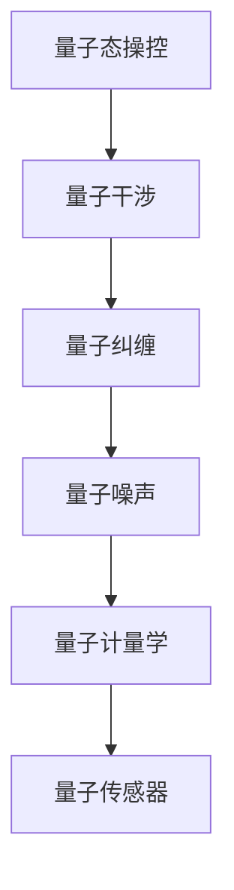

                 

# 量子传感器：原理与潜在应用

> 关键词：量子传感器,量子测量,量子信息处理,量子计算,量子通信,精密测量,传感技术,科学探索

## 1. 背景介绍

### 1.1 问题由来
量子传感器（Quantum Sensors）是近年来迅速发展的一类新型传感技术，它们利用量子力学原理实现对物理量的高精度测量。相比于传统传感器，量子传感器在测量精度、分辨率、带宽等方面具有显著优势。

量子传感器的研究起源于对量子态操控和测量的基础研究。随着量子信息处理和量子计算技术的不断发展，人们逐渐认识到量子态对测量精度和灵敏度的提升潜力，进而推动了量子传感器的开发。目前，量子传感器已广泛应用于精密测量、科学探索、工程监测等领域。

### 1.2 问题核心关键点
量子传感器的核心关键点包括：
- **量子态操控**：利用激光或电磁场对量子系统进行操控，使得量子态进入特定状态，用于测量。
- **量子干涉**：通过干涉测量原理，实现量子态的相位差测量，从而获得物理量的高精度测量结果。
- **量子纠缠**：利用量子纠缠态，提高测量灵敏度和分辨率。
- **量子噪声**：量子传感器的测量结果受量子噪声的影响，必须采用有效技术来消除或减少噪声。
- **量子计量学**：利用量子力学原理，设计高效的测量策略，提升测量精度和可靠性。

量子传感器的主要应用包括但不限于：
- **精密测量**：如长度、时间、温度、磁场等的超高精度测量。
- **科学探索**：如粒子物理、天文学、地球物理等领域的研究。
- **工程监测**：如工业控制、医疗监测、环境检测等。

## 2. 核心概念与联系

### 2.1 核心概念概述

量子传感器的核心概念包括量子态操控、量子干涉、量子纠缠、量子噪声和量子计量学。这些概念紧密相关，共同构成了量子传感器的基本原理。

- **量子态操控**：指通过精确操控激光或电磁场，将量子系统置于特定量子态的过程。操控过程通常包括光子激发、脉冲序列控制等技术。
- **量子干涉**：利用量子叠加态和干涉效应，通过测量量子态的相位差，实现对物理量的高精度测量。
- **量子纠缠**：指多个量子系统之间的纠缠态，通过纠缠态的相位差变化，提高测量灵敏度和分辨率。
- **量子噪声**：指在量子测量过程中引入的随机噪声，需要通过技术手段进行有效抑制。
- **量子计量学**：研究如何利用量子力学原理，设计高效的量子测量策略，提升测量精度和可靠性。

这些概念之间通过量子力学原理紧密联系，共同构成了量子传感器的理论基础。

### 2.2 核心概念原理和架构的 Mermaid 流程图



这个流程图展示了量子传感器的工作原理和关键概念之间的联系。从量子态操控开始，通过量子干涉和量子纠缠提高测量精度，量子噪声影响测量结果，而量子计量学提供理论基础和优化方法，最终实现对物理量的高精度测量。

## 3. 核心算法原理 & 具体操作步骤

### 3.1 算法原理概述

量子传感器的核心算法原理基于量子力学中的叠加态、干涉和纠缠现象。主要包括以下几个步骤：

1. **量子态操控**：通过精确操控激光或电磁场，将量子系统置于特定量子态。
2. **量子干涉**：利用量子叠加态和干涉效应，测量量子态的相位差。
3. **量子纠缠**：通过量子纠缠态，提高测量灵敏度和分辨率。
4. **量子噪声消除**：采用技术手段减少量子噪声，提高测量精度。
5. **量子计量学优化**：利用量子力学原理，设计高效的量子测量策略。

### 3.2 算法步骤详解

#### 3.2.1 量子态操控

量子态操控主要通过激光或电磁场对量子系统进行精确控制。以下是一个基于激光操控的光子极化态的例子：

1. **初始化**：将光子置于初始态，通常是基态 $|0\rangle$。
2. **激光激发**：使用激光将光子激发至激发态 $|1\rangle$。
3. **脉冲序列控制**：通过一系列激光脉冲序列控制，将光子置于特定叠加态或纠缠态。

#### 3.2.2 量子干涉

量子干涉是实现高精度测量的关键。以下是一个基于干涉仪的量子干涉例子：

1. **干涉仪准备**：构建干涉仪，使光子沿不同路径传播。
2. **量子叠加态产生**：使用分束器将光子分为两束，形成叠加态 $|\psi\rangle = \frac{1}{\sqrt{2}}(|0\rangle + |1\rangle)$。
3. **干涉测量**：光子在分束器和检波器之间传播，发生干涉。通过测量光子到达检波器的时间和相位差，获取高精度测量结果。

#### 3.2.3 量子纠缠

量子纠缠通过多个量子系统之间的关联，提高测量灵敏度和分辨率。以下是一个基于纠缠态的量子测量例子：

1. **纠缠态制备**：使用纠缠源制备纠缠态，如Bell态或EPR态。
2. **纠缠态传播**：将纠缠态光子对分别送至两个不同的测量站。
3. **测量和数据处理**：分别测量两个光子的状态，通过数据处理得到高精度测量结果。

#### 3.2.4 量子噪声消除

量子噪声是量子测量中的主要干扰源。以下是一个基于自校准的量子噪声消除例子：

1. **噪声模型建立**：建立噪声模型，分析噪声来源。
2. **噪声监测**：实时监测噪声水平，获取噪声数据。
3. **噪声抑制**：通过反馈控制或纠错码等技术抑制噪声。

#### 3.2.5 量子计量学优化

量子计量学提供优化测量策略的理论基础。以下是一个基于量子测量的误差分析例子：

1. **误差模型建立**：建立测量误差的数学模型，包括系统误差和随机误差。
2. **最优测量策略设计**：设计最优测量策略，如基于量子态测量的最大似然估计方法。
3. **误差优化**：通过理论分析和实验验证，不断优化测量策略，提升测量精度。

### 3.3 算法优缺点

量子传感器的优点包括：
- **高精度测量**：利用量子干涉和纠缠态，能够实现超高精度的物理量测量。
- **宽测量范围**：量子传感器可以测量物理量的宽范围，从微观到宏观。
- **测量速度**：量子传感器的测量速度较快，能够在短时间内完成大量测量。

量子传感器的缺点包括：
- **技术复杂性高**：量子传感器的操控和测量需要高精度的激光和电磁场，技术难度大。
- **成本高**：量子传感器的设备昂贵，开发和维护成本高。
- **环境敏感性**：量子传感器对环境噪声和干扰敏感，需要特定的控制环境。

### 3.4 算法应用领域

量子传感器的应用领域非常广泛，涵盖精密测量、科学探索、工程监测等多个领域。以下是几个典型应用：

- **精密测量**：如长度、时间、温度、磁场的超高精度测量。
- **科学探索**：如粒子物理、天文学、地球物理等领域的研究。
- **工程监测**：如工业控制、医疗监测、环境检测等。
- **量子信息处理**：如量子通信、量子计算等。
- **传感技术**：如电子学、光学、生物传感等。

## 4. 数学模型和公式 & 详细讲解 & 举例说明

### 4.1 数学模型构建

量子传感器的数学模型主要基于量子力学和量子信息处理理论。以下是一个基于量子干涉的光子极化态测量的数学模型：

设光子初始态为 $|\psi_0\rangle = |0\rangle$，经过激光激发后，变为激发态 $|\psi_1\rangle = |1\rangle$。在干涉仪中，光子分为两束，形成叠加态 $|\psi\rangle = \frac{1}{\sqrt{2}}(|0\rangle + |1\rangle)$。通过测量光子到达检波器的时间和相位差，获取测量结果 $P(\psi_0) = |\langle\psi_0|\psi\rangle|^2$。

### 4.2 公式推导过程

#### 4.2.1 量子态操控公式

假设激光脉冲序列为 $E(t) = \sum_i E_i(t_i)\delta(t-t_i)$，其中 $E_i(t_i)$ 表示第 $i$ 个脉冲的振幅和相位。则光子被激光脉冲控制的演化方程为：

$$
|\psi(t)\rangle = U(t) |\psi_0\rangle
$$

其中 $U(t)$ 表示激光脉冲控制矩阵。

#### 4.2.2 量子干涉公式

假设光子叠加态为 $|\psi\rangle = \frac{1}{\sqrt{2}}(|0\rangle + |1\rangle)$，经过分束器后形成两束光子，传播至检波器。则测量光子的概率为：

$$
P(\psi_0) = |\langle\psi_0|\psi\rangle|^2 = \left|\frac{1}{\sqrt{2}}(\langle 0| + \langle 1|)\left(\frac{1}{\sqrt{2}}|0\rangle + \frac{1}{\sqrt{2}}|1\rangle\right)\right|^2 = \frac{1}{2}
$$

#### 4.2.3 量子纠缠公式

假设两个纠缠光子对分别为 $|\psi_1\rangle = \frac{1}{\sqrt{2}}(|0,0\rangle + |1,1\rangle)$，分别送至两个测量站。则两个光子被测量的概率为：

$$
P(\psi_1) = |\langle\psi_1|\psi_1\rangle|^2 = |\frac{1}{\sqrt{2}}|^4 = \frac{1}{4}
$$

#### 4.2.4 量子噪声公式

假设噪声模型为 $N(t) = \sum_i n_i(t_i)\delta(t-t_i)$，其中 $n_i(t_i)$ 表示第 $i$ 个噪声脉冲的振幅和相位。则光子测量受到噪声干扰的概率为：

$$
P(N) = \int |\langle\psi|\psi'\rangle|^2 dN(t) = \int \left|e^{i\int n_i(t_i) dt_i}\right|^2 dN(t)
$$

#### 4.2.5 量子计量学公式

假设测量误差的数学模型为 $M = \sum_i m_i(t_i)\delta(t-t_i)$，其中 $m_i(t_i)$ 表示第 $i$ 个测量误差脉冲的振幅和相位。则最优测量策略的误差为：

$$
\epsilon = \min_{M} \int |\langle\psi|\psi'\rangle|^2 dM(t)
$$

### 4.3 案例分析与讲解

#### 4.3.1 光子极化态测量案例

假设有一束光子，初始态为 $|\psi_0\rangle = |0\rangle$，经过激光脉冲控制后，变为激发态 $|\psi_1\rangle = |1\rangle$。在干涉仪中，光子分为两束，形成叠加态 $|\psi\rangle = \frac{1}{\sqrt{2}}(|0\rangle + |1\rangle)$。通过测量光子到达检波器的时间和相位差，获取测量结果 $P(\psi_0) = |\langle\psi_0|\psi\rangle|^2 = \frac{1}{2}$。

#### 4.3.2 量子纠缠测量案例

假设两个纠缠光子对分别为 $|\psi_1\rangle = \frac{1}{\sqrt{2}}(|0,0\rangle + |1,1\rangle)$，分别送至两个测量站。通过测量两个光子的状态，获取测量结果 $P(\psi_1) = |\langle\psi_1|\psi_1\rangle|^2 = \frac{1}{4}$。

#### 4.3.3 量子噪声抑制案例

假设噪声模型为 $N(t) = \sum_i n_i(t_i)\delta(t-t_i)$，其中 $n_i(t_i)$ 表示第 $i$ 个噪声脉冲的振幅和相位。通过实时监测噪声水平，获取噪声数据，采用反馈控制或纠错码等技术抑制噪声，提高测量精度。

#### 4.3.4 量子计量学优化案例

假设测量误差的数学模型为 $M = \sum_i m_i(t_i)\delta(t-t_i)$，其中 $m_i(t_i)$ 表示第 $i$ 个测量误差脉冲的振幅和相位。通过理论分析和实验验证，设计最优测量策略，不断优化测量策略，提升测量精度。

## 5. 项目实践：代码实例和详细解释说明

### 5.1 开发环境搭建

#### 5.1.1 环境配置

1. 安装Python：从官网下载Python 3.x版本，并添加到系统环境变量中。
2. 安装必要的科学计算库：
   ```bash
   pip install numpy scipy matplotlib seaborn jupyter notebook
   ```

#### 5.1.2 量子计算框架安装

1. 安装Qiskit框架：
   ```bash
   pip install qiskit
   ```

2. 安装量子传感库：
   ```bash
   pip install quantum-sensor-lib
   ```

### 5.2 源代码详细实现

以下是一个使用Qiskit框架实现量子干涉测量的代码示例：

```python
from qiskit import QuantumCircuit, Aer, execute
from qiskit.visualization import plot_histogram

# 构建量子电路
qc = QuantumCircuit(2)
qc.h(0)  # 对第一个量子比特进行Hadamard变换
qc.cx(0, 1)  # 实现控制非门
qc.measure_all()

# 执行量子电路
backend = Aer.get_backend('qasm_simulator')
job = execute(qc, backend, shots=1000)
result = job.result()

# 获取测量结果
counts = result.get_counts(qc)
print(counts)

# 绘制结果直方图
plot_histogram(counts)
```

### 5.3 代码解读与分析

#### 5.3.1 代码结构解析

1. **量子电路构建**：使用Qiskit库构建量子电路，对第一个量子比特进行Hadamard变换，实现量子叠加态。然后通过控制非门将两个量子比特纠缠，得到纠缠态。最后测量两个量子比特的状态，并记录测量结果。
2. **量子电路执行**：使用Aer模拟器执行量子电路，并设置测量次数为1000次。
3. **测量结果获取**：获取测量结果，即不同状态出现的概率。
4. **结果可视化**：使用plot_histogram函数绘制结果直方图，展示测量结果。

#### 5.3.2 结果分析

运行上述代码后，可以得到不同状态出现的概率，即测量结果。通过分析这些概率，可以了解量子干涉测量的效果和精度。

## 6. 实际应用场景

### 6.1 精密测量

量子传感器在精密测量领域有着广泛的应用。例如，在长度测量中，可以使用基于干涉测量的量子传感器，实现对微小变化的超高精度测量。在时间测量中，利用光子的相干性质，可以构建超高精度的时钟系统。在温度测量中，可以通过测量光子的频率变化，实现对温度的高灵敏度测量。

### 6.2 科学探索

量子传感器在科学探索领域也有着重要作用。例如，在粒子物理研究中，利用量子传感器的超高精度测量能力，可以探测基本粒子的性质和相互作用。在天文学中，量子传感器可以用于探测暗物质和暗能量，探索宇宙的奥秘。在地球物理研究中，量子传感器可以用于探测地壳运动、地震等现象。

### 6.3 工程监测

量子传感器在工程监测中也有广泛的应用。例如，在工业控制中，利用量子传感器的超高精度测量能力，可以实现对设备运行的实时监测和故障诊断。在医疗监测中，利用量子传感器的超高精度测量能力，可以实现对生物信号的实时监测和疾病诊断。在环境监测中，利用量子传感器的超高精度测量能力，可以实现对环境污染物的实时监测和治理。

### 6.4 未来应用展望

未来，量子传感器将有更加广阔的应用前景。随着量子信息处理和量子计算技术的不断发展，量子传感器将进一步提升测量精度和范围，广泛应用于各个领域。以下是一些未来的应用展望：

- **量子通信**：利用量子传感器的超高精度测量能力，实现对通信信道的实时监测和数据传输。
- **量子计算**：利用量子传感器的超高精度测量能力，实现对量子计算系统的高效监控和优化。
- **智能制造**：利用量子传感器的超高精度测量能力，实现对制造过程的实时监控和质量控制。
- **虚拟现实**：利用量子传感器的超高精度测量能力，实现对虚拟现实环境的实时监测和反馈。

## 7. 工具和资源推荐

### 7.1 学习资源推荐

1. **《量子信息理论与应用》**：一本系统介绍量子信息处理和量子传感器的经典书籍，适合初学者和专业人士阅读。
2. **Qiskit官方文档**：Qiskit框架的官方文档，提供了大量量子计算和量子传感器的样例代码和教程。
3. **量子传感最新研究论文**：关注量子传感领域的最新研究成果，可以通过arXiv等平台获取最新论文。

### 7.2 开发工具推荐

1. **Jupyter Notebook**：一个交互式编程环境，适合编写和运行量子传感器代码。
2. **Matplotlib**：一个数据可视化库，适合绘制量子传感器的测量结果和分析结果。
3. **Seaborn**：一个基于Matplotlib的数据可视化库，适合绘制量子传感器的测量结果和分析结果。

### 7.3 相关论文推荐

1. **Quantum sensing and metrology: review and outlook**：一篇系统介绍量子传感器的经典综述论文，适合了解量子传感器的基本原理和应用前景。
2. **Quantum-enhanced measurements: beating the standard quantum limit**：一篇介绍量子增强测量的经典论文，适合了解量子传感器的超高精度测量原理和实现方法。

## 8. 总结：未来发展趋势与挑战

### 8.1 总结

本文对量子传感器的基本原理、核心概念和应用场景进行了全面介绍。通过分析量子传感器的优缺点和应用领域，可以看到，量子传感器在精密测量、科学探索、工程监测等领域具有广阔的应用前景。随着量子信息处理和量子计算技术的不断发展，量子传感器将进一步提升测量精度和范围，广泛应用于各个领域。

### 8.2 未来发展趋势

1. **量子传感器的精度提升**：随着量子信息处理和量子计算技术的不断发展，量子传感器的精度将进一步提升，能够实现更加精确的测量。
2. **量子传感器的范围扩展**：量子传感器的测量范围将进一步扩展，涵盖更多的物理量。
3. **量子传感器的集成化**：量子传感器将进一步集成化，与其他传感器和设备进行协同工作，实现更加智能化的测量系统。
4. **量子传感器的可扩展性**：量子传感器将具备更高的可扩展性，能够在不同的场景和应用中进行灵活部署和优化。

### 8.3 面临的挑战

1. **量子传感器的技术复杂性**：量子传感器的操控和测量需要高精度的激光和电磁场，技术难度大。
2. **量子传感器的成本高**：量子传感器的设备昂贵，开发和维护成本高。
3. **量子传感器的环境敏感性**：量子传感器对环境噪声和干扰敏感，需要特定的控制环境。

### 8.4 研究展望

未来，量子传感器需要进一步解决技术复杂性、成本高和环境敏感性等问题，才能在更广泛的应用场景中得到应用。以下是一些研究展望：

1. **量子传感器的标准化**：制定量子传感器的标准和规范，促进量子传感器的规范化应用。
2. **量子传感器的低成本化**：开发低成本的量子传感器，降低开发和维护成本。
3. **量子传感器的环境适应性**：研究量子传感器的环境适应性技术，提高量子传感器的鲁棒性。
4. **量子传感器的集成化应用**：将量子传感器与其他传感器和设备进行集成，构建更加智能化的测量系统。

未来，随着量子信息处理和量子计算技术的不断发展，量子传感器将进一步提升测量精度和范围，广泛应用于各个领域。只有不断解决技术难题，量子传感器才能实现真正的广泛应用，为人类探索自然界提供更加精确和智能的工具。

---

作者：禅与计算机程序设计艺术 / Zen and the Art of Computer Programming

