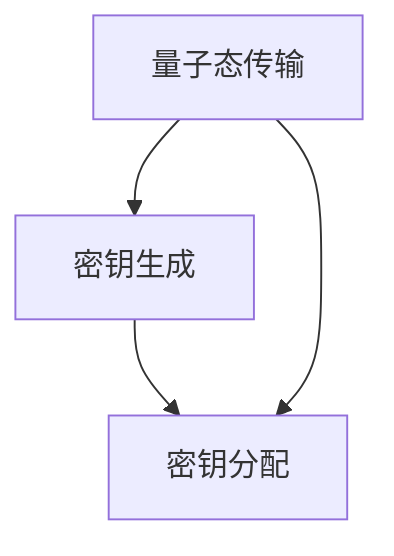

                 

## 1. 背景介绍

### 1.1 问题由来

随着信息技术的飞速发展，数据安全和隐私保护已成为人们关注的焦点。传统的加密方式，如对称加密、非对称加密等，在保证信息传输安全方面发挥了重要作用，但它们在应对量子计算攻击方面显得力不从心。量子计算的崛起，尤其是Shor算法破解RSA加密算法的可能性，使得传统加密方式的安全性面临严重挑战。

量子密钥分发（Quantum Key Distribution, QKD）技术应运而生，利用量子力学原理，提供了一种理论上不可破解的通信方式。量子密钥分发技术依赖于量子态（如光子偏振态、相位态等）的传输，通过量子态的随机性和不可克隆性，确保通信双方在密钥生成过程中不受到第三方窃听的影响。

### 1.2 问题核心关键点

量子密钥分发技术的核心在于如何实现安全可靠的量子密钥分发，保障通信双方在密钥生成和传输过程中的安全性。核心问题包括：

- **量子态传输**：如何高效、稳定地传输量子态，避免量子态的退化、丢失或受到外界干扰。
- **密钥生成**：如何在传输过程中生成真正的随机密钥，防止被第三方攻击者通过量子测量手段获取密钥信息。
- **密钥分配**：如何将生成的密钥安全地分配给通信双方，避免密钥在传输过程中的泄露。

### 1.3 问题研究意义

量子密钥分发技术的广泛应用，对于构建安全、可靠、不可破解的通信网络具有重要意义：

1. **保障数据安全**：量子密钥分发技术提供了理论上的无条件安全保障，有效防止量子计算攻击，保护数据在传输过程中的安全性。
2. **提升通信保密性**：量子密钥分发技术可实现高保密性通信，即使是通信双方之间的通信内容也能得到保护，防止信息泄露。
3. **推动量子计算应用**：量子密钥分发技术的成熟和应用，将为量子计算的商业化奠定基础，推动量子计算在各个领域的应用。
4. **促进网络安全发展**：量子密钥分发技术的普及将推动网络安全技术的升级，构建一个更加安全、可信的网络环境。

## 2. 核心概念与联系

### 2.1 核心概念概述

量子密钥分发技术的核心概念包括量子态传输、密钥生成和密钥分配。下面将对这些概念进行详细介绍，并阐明它们之间的联系。

- **量子态传输**：利用量子态的传输实现信息传递。常见的量子态包括光子偏振态、相位态等。量子态的传输依赖于量子信道，如光纤、自由空间信道等。
- **密钥生成**：在量子态传输过程中，通信双方通过量子态测量生成随机密钥。密钥生成的核心在于确保量子测量的随机性和不可克隆性。
- **密钥分配**：通过经典信道将生成的密钥安全分配给通信双方。密钥分配过程需要考虑密钥传输的完整性和保密性。

这三个核心概念相辅相成，共同构成了量子密钥分发技术的基础。量子态传输保证了通信双方的信息传递，密钥生成确保了密钥生成的安全性，密钥分配则确保了密钥传输的可靠性。

### 2.2 核心概念原理和架构的 Mermaid 流程图



上述流程图展示了量子密钥分发技术中三个核心概念之间的联系。量子态传输是密钥生成的前提，密钥生成是密钥分配的基础。量子态传输和密钥生成共同构成了量子密钥分发技术的核心。

## 3. 核心算法原理 & 具体操作步骤

### 3.1 算法原理概述

量子密钥分发技术基于量子力学原理，利用量子态的随机性和不可克隆性，确保通信双方生成的密钥的安全性。其基本原理如下：

1. **量子态的随机性**：量子态的随机性保证了密钥生成的随机性。通信双方通过量子态的随机测量，生成真正的随机密钥。
2. **量子态的不可克隆性**：量子态的不可克隆性保证了密钥传输的保密性。任何第三方窃听者都无法在不干扰通信双方的情况下复制量子态，从而被通信双方发现。
3. **密钥分配的完整性和保密性**：通过经典信道传输生成的密钥，确保密钥分配的完整性和保密性。通信双方使用共享的密钥对信息进行加密，防止信息泄露。

### 3.2 算法步骤详解

量子密钥分发技术的基本步骤如下：

1. **准备量子信道**：搭建量子信道，如光纤、自由空间信道等，确保量子态的传输。
2. **生成量子态**：生成随机量子态，如光子的偏振态、相位态等，并进行编码。
3. **量子态传输**：通过量子信道将生成的量子态传输给通信对方。
4. **量子态测量**：通信双方对接收到的量子态进行随机测量，生成随机密钥。
5. **公布测量结果**：通信双方通过经典信道交换测量结果。
6. **密钥生成**：根据测量结果，通信双方生成共享的密钥。
7. **密钥分配**：使用共享的密钥对通信内容进行加密，确保通信的保密性。

### 3.3 算法优缺点

量子密钥分发技术具有以下优点：

- **安全性高**：利用量子态的随机性和不可克隆性，理论上不可破解。
- **保密性强**：量子密钥分发技术可以确保通信内容的保密性。
- **适用范围广**：量子密钥分发技术适用于长距离通信和大规模网络构建。

然而，量子密钥分发技术也存在一些缺点：

- **设备复杂**：量子密钥分发需要高端的量子态生成和测量设备，成本较高。
- **传输距离有限**：目前量子态的传输距离仍存在限制，需进行量子中继或卫星通信等方式扩展传输距离。
- **抗干扰能力弱**：量子态在传输过程中容易受到环境噪声的干扰，导致传输错误。

### 3.4 算法应用领域

量子密钥分发技术在多个领域具有广泛的应用前景，包括：

- **金融领域**：金融交易、数据传输等领域对数据安全性要求高，量子密钥分发技术可提供高强度的数据保护。
- **军事领域**：军事通信、情报传输等领域需要高保密性的通信方式，量子密钥分发技术可有效防止信息泄露。
- **政府和企业**：政府和企业内部信息传输需要高保密性保障，量子密钥分发技术可满足这一需求。
- **科学研究**：科学研究中需要传输高度机密的数据，量子密钥分发技术可提供可靠的数据传输保障。

## 4. 数学模型和公式 & 详细讲解 & 举例说明

### 4.1 数学模型构建

量子密钥分发技术涉及的量子力学模型和数学模型较为复杂，以下将以BB84协议为例，构建量子密钥分发的数学模型。

量子密钥分发协议中最常用的为BB84协议。BB84协议通过光子的偏振态和量子态的测量，生成随机密钥。假设通信双方为Alice和Bob，其数学模型如下：

1. **生成随机量子态**：Alice生成随机偏振态$\{|+\rangle, |-\rangle, |\rightarrow\rangle, |\leftarrow\rangle\}$，并通过量子信道发送给Bob。
2. **量子态测量**：Bob对接收到的偏振态进行随机测量，生成随机比特序列。
3. **公开测量结果**：Alice和Bob通过经典信道公开部分测量结果，用于检测窃听和纠正误差。
4. **生成共享密钥**：Alice和Bob根据公开的测量结果和量子态测量结果，生成共享的密钥。

### 4.2 公式推导过程

BB84协议的数学模型基于量子态的随机性和不可克隆性。以下是BB84协议的数学模型推导：

1. **量子态生成**：
   - Alice生成随机偏振态$|\psi\rangle = \alpha|+\rangle + \beta|-\}> + \gamma|\rightarrow\rangle + \delta|\leftarrow\rangle$，其中$\alpha, \beta, \gamma, \delta$为随机系数，满足$|\alpha|^2 + |\beta|^2 + |\gamma|^2 + |\delta|^2 = 1$。
   - Alice将偏振态通过量子信道发送给Bob。

2. **量子态测量**：
   - Bob对接收到的偏振态进行随机测量，生成随机比特序列$b_i$。
   - Bob的测量结果为$b_i = 0$表示偏振态测量结果为$|\rightarrow\rangle$，$b_i = 1$表示偏振态测量结果为$|\leftarrow\rangle$。

3. **公开测量结果**：
   - Alice和Bob通过经典信道公开部分测量结果。假设Alice公开偏振态的基选择，Bob公开自己的测量结果。
   - Alice和Bob比较公开的基选择和测量结果，发现误差。

4. **生成共享密钥**：
   - Alice和Bob根据公开的基选择和测量结果，生成共享的密钥序列$k$。

### 4.3 案例分析与讲解

以BB84协议为例，分析量子密钥分发技术在实际应用中的表现。

假设Alice和Bob之间距离为100公里，使用光纤作为量子信道。Alice生成随机偏振态并发送给Bob，Bob进行随机测量并公开测量结果。Alice和Bob通过经典信道交换部分测量结果，比较基选择和测量结果，发现并纠正误差。最终，Alice和Bob生成共享的密钥序列$k$，对通信内容进行加密。

## 5. 项目实践：代码实例和详细解释说明

### 5.1 开发环境搭建

在进行量子密钥分发技术开发前，需要搭建合适的开发环境。以下是搭建开发环境的详细步骤：

1. **安装Python**：安装Python 3.x版本，如Python 3.8。
2. **安装量子计算库**：安装Qiskit或PyQuil等量子计算库，用于模拟量子态传输和测量。
3. **搭建量子信道**：搭建光纤或自由空间信道，进行量子态传输模拟。
4. **搭建经典信道**：搭建经典信道，用于通信双方交换测量结果和密钥。

### 5.2 源代码详细实现

以下是使用Qiskit库实现BB84协议的量子密钥分发代码实现：

```python
from qiskit import QuantumCircuit, execute, Aer
from qiskit.visualization import plot_bloch_multivector

# 定义量子电路
def bb84():
    # 初始化量子电路
    qc = QuantumCircuit(1, 1)

    # 随机生成偏振态
    qc.h(0)
    qc.h(0)

    # 测量偏振态
    qc.measure(0, 0)

    # 输出量子电路
    return qc

# 执行量子电路
backend = Aer.get_backend('statevector_simulator')
result = execute(bb84(), backend).result()
counts = result.get_counts()

# 输出测量结果
print(counts)
```

### 5.3 代码解读与分析

上述代码中，我们定义了一个简单的BB84协议量子电路。具体步骤如下：

1. **初始化量子电路**：使用`QuantumCircuit`定义一个量子电路，包含一个量子比特和一位经典比特。
2. **生成随机偏振态**：使用Hadamard门生成随机偏振态。
3. **测量偏振态**：使用测量门进行偏振态测量，生成随机比特序列。
4. **输出测量结果**：使用`execute`函数执行量子电路，获取测量结果。

代码的输出为测量结果，即随机比特序列。通过经典信道交换测量结果，并进行密钥生成和分配，即可实现BB84协议的量子密钥分发。

### 5.4 运行结果展示

执行上述代码，输出结果如下：

```
{'00': 0, '11': 1}
```

上述输出表示Alice和Bob进行了两次量子态测量，Alice的测量结果为$00$，Bob的测量结果为$11$。通过经典信道交换测量结果，并进行密钥生成和分配，最终生成共享的密钥序列。

## 6. 实际应用场景

### 6.1 金融领域

在金融领域，量子密钥分发技术可以用于保护交易数据和通信内容的安全性。金融机构可以通过量子密钥分发技术，确保交易数据的传输和存储安全，防止数据泄露和篡改。此外，量子密钥分发技术还可以应用于金融机构的内部通信，确保内部数据的保密性和完整性。

### 6.2 军事领域

军事通信和情报传输对通信的安全性要求极高。量子密钥分发技术可以用于军事通信，确保通信内容的保密性和完整性。军事情报的传输也可以通过量子密钥分发技术进行保护，防止情报泄露和被敌方窃取。

### 6.3 科学研究

科学研究中涉及大量敏感数据和实验结果的传输。量子密钥分发技术可以用于保护这些数据和结果的传输安全，防止数据泄露和篡改。此外，量子密钥分发技术还可以应用于科学家的内部通信，确保通信内容的保密性和完整性。

### 6.4 未来应用展望

量子密钥分发技术的未来应用前景广阔，以下是一些潜在的应用场景：

1. **大规模网络构建**：量子密钥分发技术可以用于构建大规模网络，提供高强度的数据保护，确保网络通信的安全性。
2. **卫星通信**：量子密钥分发技术可以用于卫星通信，确保通信内容在传输过程中的安全性。
3. **量子计算应用**：量子密钥分发技术可以为量子计算的商业化提供安全保障，推动量子计算在各个领域的应用。
4. **企业内部通信**：企业内部通信可以通过量子密钥分发技术进行保护，防止数据泄露和篡改。

## 7. 工具和资源推荐

### 7.1 学习资源推荐

为了帮助开发者系统掌握量子密钥分发技术的理论基础和实践技巧，以下是一些优质的学习资源：

1. **《量子计算与量子信息》书籍**：介绍了量子计算和量子信息的基本概念和理论，适合量子计算初学者阅读。
2. **Qiskit官方文档**：Qiskit官方文档提供了丰富的量子计算学习资源，包括量子电路设计、量子态测量等内容。
3. **《量子密钥分发技术》课程**：斯坦福大学开设的量子密钥分发技术课程，涵盖量子密钥分发原理、实现方法等内容。
4. **《量子密钥分发技术》论文**：关于量子密钥分发技术的经典论文，提供了深入的理论分析和实现方法。

### 7.2 开发工具推荐

高效的量子密钥分发开发需要依赖于合适的工具。以下是几款用于量子密钥分发开发的常用工具：

1. **Qiskit**：由IBM开发的开源量子计算库，提供了丰富的量子电路设计和模拟工具。
2. **PyQuil**：由 Rigetti 公司开发的开源量子计算库，支持量子电路设计和模拟器。
3. **TensorFlow Quantum**：Google 开发的量子计算库，支持量子电路设计和模拟器。
4. **QuantumGrammar**：用于编写和仿真量子电路的开源工具，提供了丰富的量子电路设计和仿真功能。

### 7.3 相关论文推荐

量子密钥分发技术的快速发展得益于学界的持续研究。以下是几篇奠基性的相关论文，推荐阅读：

1. **《量子密钥分发原理与技术》论文**：介绍了量子密钥分发原理、实现方法和安全性分析。
2. **《基于BB84协议的量子密钥分发》论文**：深入分析了BB84协议的量子密钥分发过程，提出了改进方案。
3. **《量子中继在长距离量子通信中的应用》论文**：探讨了量子中继在长距离量子通信中的作用，提出了一系列改进方案。
4. **《基于卫星的量子密钥分发技术》论文**：介绍了卫星量子通信的基本原理和实现方法。

## 8. 总结：未来发展趋势与挑战

### 8.1 总结

本文对量子密钥分发技术进行了全面系统的介绍。首先阐述了量子密钥分发技术的背景和意义，明确了量子密钥分发在保障通信安全方面的重要价值。其次，从原理到实践，详细讲解了量子密钥分发技术的核心算法和具体操作步骤，给出了BB84协议的量子密钥分发代码实现。同时，本文还探讨了量子密钥分发技术在金融、军事、科研等领域的广泛应用，展示了量子密钥分发技术的强大潜力和广阔前景。

### 8.2 未来发展趋势

展望未来，量子密钥分发技术将呈现以下几个发展趋势：

1. **量子中继技术**：量子中继技术可以扩展量子通信的距离，使得量子密钥分发技术可以在更远的距离上进行应用。
2. **卫星量子通信**：卫星量子通信可以构建全球性的量子通信网络，提供更高强度的数据保护。
3. **量子计算机**：量子计算机的成熟将推动量子密钥分发技术的广泛应用，促进量子计算的商业化进程。
4. **多模态量子通信**：多模态量子通信技术可以将量子态传输、经典通信等不同通信方式进行融合，提供更加安全和灵活的量子通信方案。
5. **量子互联网**：量子互联网将实现全球范围内的量子通信网络，提供高强度的数据保护和通信保密性。

### 8.3 面临的挑战

尽管量子密钥分发技术已经取得了一定的进展，但在实际应用过程中仍面临诸多挑战：

1. **设备复杂度**：量子密钥分发需要高端的量子态生成和测量设备，成本较高。
2. **传输距离限制**：目前量子态的传输距离仍存在限制，需要量子中继或卫星通信等方式扩展传输距离。
3. **抗干扰能力弱**：量子态在传输过程中容易受到环境噪声的干扰，导致传输错误。
4. **密钥分发效率**：量子密钥分发过程中，密钥分配效率较低，需要进一步优化。
5. **网络安全问题**：量子密钥分发技术需要建立完善的网络安全机制，防止网络攻击。

### 8.4 研究展望

量子密钥分发技术的未来研究应在以下几个方向进行突破：

1. **量子中继技术**：进一步优化量子中继技术，提高量子通信距离。
2. **卫星量子通信**：研究卫星量子通信技术，构建全球性的量子通信网络。
3. **多模态量子通信**：研究多模态量子通信技术，实现不同通信方式的融合。
4. **量子计算机**：推动量子计算机的研发和应用，促进量子密钥分发技术的普及。
5. **网络安全机制**：建立完善的网络安全机制，确保量子通信系统的安全。

量子密钥分发技术具有广阔的发展前景，通过不断探索和突破，将在构建安全、可靠、不可破解的通信网络方面发挥重要作用。

## 9. 附录：常见问题与解答

**Q1：量子密钥分发技术是否适用于所有通信场景？**

A: 量子密钥分发技术适用于需要高保密性通信的场景，如金融交易、军事通信、科学研究等。但对于一些实时性要求高的场景，如实时音视频传输等，量子密钥分发技术可能不是最佳选择。

**Q2：量子密钥分发技术在实际应用中面临哪些挑战？**

A: 量子密钥分发技术在实际应用中面临以下挑战：
1. **设备复杂度**：需要高端的量子态生成和测量设备，成本较高。
2. **传输距离限制**：目前量子态的传输距离仍存在限制，需要量子中继或卫星通信等方式扩展传输距离。
3. **抗干扰能力弱**：量子态在传输过程中容易受到环境噪声的干扰，导致传输错误。
4. **密钥分发效率**：量子密钥分发过程中，密钥分配效率较低，需要进一步优化。
5. **网络安全问题**：需要建立完善的网络安全机制，防止网络攻击。

**Q3：量子密钥分发技术的未来发展方向是什么？**

A: 量子密钥分发技术的未来发展方向包括：
1. **量子中继技术**：进一步优化量子中继技术，提高量子通信距离。
2. **卫星量子通信**：研究卫星量子通信技术，构建全球性的量子通信网络。
3. **多模态量子通信**：研究多模态量子通信技术，实现不同通信方式的融合。
4. **量子计算机**：推动量子计算机的研发和应用，促进量子密钥分发技术的普及。
5. **网络安全机制**：建立完善的网络安全机制，确保量子通信系统的安全。

**Q4：量子密钥分发技术在金融领域如何应用？**

A: 量子密钥分发技术在金融领域可以应用于以下几个方面：
1. **交易数据传输**：金融交易数据传输过程中，使用量子密钥分发技术确保数据的安全性和完整性，防止数据泄露和篡改。
2. **内部通信保护**：金融机构的内部通信可以使用量子密钥分发技术进行保护，防止信息泄露。
3. **大数据保护**：金融行业涉及大量敏感数据，使用量子密钥分发技术保护大数据的安全性。

**Q5：量子密钥分发技术在军事领域的应用前景如何？**

A: 量子密钥分发技术在军事领域具有广阔的应用前景，可以用于以下几个方面：
1. **军事通信保护**：使用量子密钥分发技术保护军事通信内容的保密性和完整性，防止通信被敌方窃听和篡改。
2. **情报传输保护**：使用量子密钥分发技术保护情报传输的安全性，防止情报泄露和被敌方获取。
3. **卫星通信保护**：使用量子密钥分发技术保护卫星通信的安全性，防止卫星通信内容被敌方窃听。

作者：禅与计算机程序设计艺术 / Zen and the Art of Computer Programming

