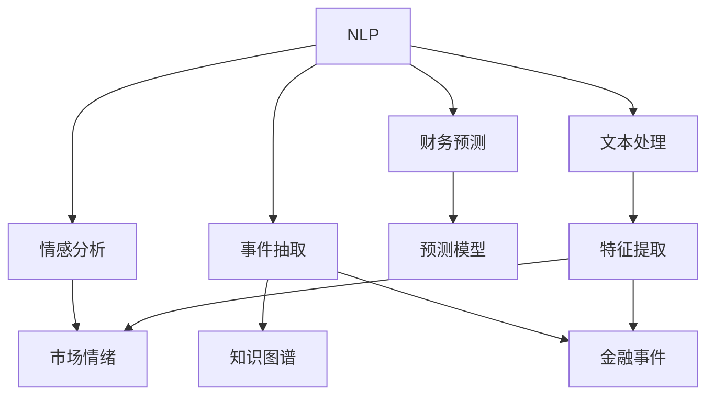

                 

# 金融领域的NLP应用：市场分析与风险评估

> 关键词：自然语言处理(NLP), 金融市场分析, 风险评估, 情感分析, 财务预测, 知识图谱

## 1. 背景介绍

### 1.1 问题由来

金融行业是一个信息密集型行业，其决策过程高度依赖于数据的及时性、准确性和全面性。传统的金融分析主要基于定量模型，如回归分析、时间序列分析、机器学习模型等，但这些模型往往需要大量手工整理和标注数据，工作量巨大，且依赖于统计假设的合理性，难以充分考虑市场动态和用户情感等多方面的因素。近年来，随着NLP技术的快速发展，越来越多的金融公司开始探索将NLP应用于市场分析与风险评估，以期通过分析市场文本数据，提取市场情绪、政策变化、事件影响等深度信息，实现更加全面、及时和智能的决策支持。

### 1.2 问题核心关键点

金融领域的NLP应用主要集中在市场分析与风险评估两个方面。市场分析旨在从海量金融新闻、社交媒体、公司财报等文本数据中提取有价值的信息，如市场情绪、政策变化、事件影响等，进而预测股票、债券、商品等金融资产的未来走势。风险评估则是对金融资产、市场环境、交易策略等的风险进行量化评估，帮助金融机构识别和规避潜在风险。

NLP在金融领域的应用，主要涉及以下几个核心问题：

1. **文本数据处理**：如何高效地处理大规模的金融文本数据，提取有意义的特征。
2. **情感分析**：如何从文本中准确提取市场情绪信息，判断市场是乐观还是悲观。
3. **事件识别**：如何识别并抽取金融事件，理解事件对市场的影响。
4. **财务预测**：如何利用金融新闻、社交媒体等文本数据进行财务预测，提高预测准确度。
5. **知识图谱**：如何构建并利用金融领域的知识图谱，提高信息检索和推理的效率。

这些问题涉及文本处理、情感分析、事件抽取、财务预测等多个NLP技术领域，需要综合运用多种技术和工具。

## 2. 核心概念与联系

### 2.1 核心概念概述

为更好地理解金融领域的NLP应用，本节将介绍几个密切相关的核心概念：

- **自然语言处理(NLP)**：涉及文本数据的处理、分析、理解和生成等技术，是金融领域NLP应用的基础。
- **情感分析**：通过对文本情感进行分类或评分，提取市场情绪信息，判断市场走势。
- **事件抽取**：从文本中抽取金融事件，并分析事件对市场的影响。
- **知识图谱**：构建并利用金融领域的知识图谱，提高信息检索和推理的效率。
- **财务预测**：利用金融新闻、社交媒体等文本数据进行财务预测，提高预测准确度。

这些核心概念之间的逻辑关系可以通过以下Mermaid流程图来展示：



这个流程图展示了大语言模型在金融领域的核心概念及其之间的关系：

1. 自然语言处理(NLP)技术处理文本数据，提取特征。
2. 情感分析技术提取市场情绪信息，判断市场走势。
3. 事件抽取技术识别并抽取金融事件，分析事件影响。
4. 财务预测技术利用文本数据进行财务预测，提高预测准确度。
5. 知识图谱技术构建并利用金融领域的知识图谱，提升信息检索和推理效率。

## 3. 核心算法原理 & 具体操作步骤

### 3.1 算法原理概述

金融领域的NLP应用，主要基于监督学习、无监督学习、半监督学习等多种机器学习算法。其核心思想是通过构建合适的模型和算法，从金融文本数据中提取有价值的信息，支持市场分析和风险评估。

常见的算法包括：

- **监督学习**：利用标注数据训练模型，进行情感分析、事件抽取等任务。
- **无监督学习**：从大规模金融文本数据中，提取主题、词向量等特征，进行市场情绪分析。
- **半监督学习**：利用少量标注数据和大量未标注数据，提高模型的泛化能力。

这些算法通常涉及以下几个步骤：

1. **数据预处理**：清洗、分词、去除停用词等，将金融文本转化为机器可处理的格式。
2. **特征提取**：从处理后的文本中提取有意义的特征，如词向量、主题、情感等。
3. **模型训练**：利用标注数据训练模型，进行情感分析、事件抽取等任务。
4. **模型评估**：利用测试集评估模型性能，进行参数调整和优化。

### 3.2 算法步骤详解

以下将详细讲解监督学习在金融领域的应用步骤。

#### 数据预处理

金融文本数据通常包含大量噪音、非结构化信息，需要进行预处理，如图像化、分词、去除停用词等。

- **图像化**：将文本数据转化为向量形式，便于机器处理。常用的方法是将文本转换为词向量或主题向量。
- **分词**：将文本切分成词语或短句，便于特征提取。分词算法可以基于规则、统计、深度学习等多种方法。
- **去除停用词**：去除无意义的高频词汇，减少特征维度，提高模型效率。

#### 特征提取

特征提取是金融文本处理的核心环节，提取的特征将直接影响模型的性能。

- **词向量**：将文本转换为向量表示，常用的方法包括Word2Vec、GloVe、BERT等。词向量可以捕捉词语之间的语义关系，提高情感分析和事件抽取的效果。
- **主题向量**：利用主题模型(如LDA)对文本进行主题建模，提取文本中隐含的主题信息。主题向量可以捕捉文本的主旨和情感倾向，提高事件抽取和市场情绪分析的效果。

#### 模型训练

模型训练是金融NLP应用的核心步骤，常用的模型包括情感分析模型、事件抽取模型、财务预测模型等。

- **情感分析模型**：利用标注数据训练情感分类器，判断市场情绪。常见的模型包括RNN、CNN、LSTM等。
- **事件抽取模型**：利用标注数据训练实体识别和事件抽取模型，识别金融事件。常见的模型包括CRF、BiLSTM-CRF等。
- **财务预测模型**：利用历史财务数据和金融新闻、社交媒体等文本数据，训练预测模型，进行财务预测。常见的模型包括ARIMA、LSTM等。

#### 模型评估

模型评估是金融NLP应用的重要环节，评估指标包括准确率、召回率、F1分数、AUC等。

- **准确率**：模型预测正确的样本占总样本的比例。
- **召回率**：模型正确识别出的正样本占总正样本的比例。
- **F1分数**：准确率和召回率的调和平均值。
- **AUC**：ROC曲线下的面积，衡量模型分类性能。

### 3.3 算法优缺点

金融领域的NLP应用具有以下优点：

1. **丰富信息**：利用金融文本数据，可以提取市场情绪、政策变化、事件影响等深度信息，为决策支持提供更多维度。
2. **实时性**：NLP处理速度快，可以实时监测市场变化，快速响应决策需求。
3. **低成本**：NLP方法可以自动化数据处理和特征提取，减少人力成本和错误率。

同时，金融领域的NLP应用也存在一些局限性：

1. **噪音干扰**：金融文本数据包含大量噪音和无关信息，影响特征提取和模型训练。
2. **数据稀缺**：金融事件和财务数据相对稀缺，标注数据获取难度大。
3. **模型复杂**：NLP模型复杂度高，训练和推理资源需求大。
4. **可解释性**：NLP模型往往具有黑盒性质，难以解释其内部工作机制。

## 4. 数学模型和公式 & 详细讲解  
### 4.1 数学模型构建

本节将使用数学语言对金融领域NLP应用进行更加严格的刻画。

设金融文本数据为 $\{x_i\}_{i=1}^N$，其中 $x_i$ 为第 $i$ 条文本，标注数据为 $\{(y_i, t_i)\}_{i=1}^N$，其中 $y_i$ 为文本标签，$t_i$ 为文本所属类别。

定义情感分析模型的损失函数为：

$$
\mathcal{L} = -\frac{1}{N}\sum_{i=1}^N \log P(y_i | x_i)
$$

其中 $P(y_i | x_i)$ 为模型预测的情感概率分布。

定义事件抽取模型的损失函数为：

$$
\mathcal{L} = -\frac{1}{N}\sum_{i=1}^N \sum_{j=1}^{|y_i|} I(y_{ij}, \hat{y}_{ij}) \log \hat{y}_{ij}
$$

其中 $y_{ij}$ 为文本中第 $j$ 个实体的位置和类别，$\hat{y}_{ij}$ 为模型预测的实体位置和类别，$|y_i|$ 为文本中实体的数量。

定义财务预测模型的损失函数为：

$$
\mathcal{L} = \frac{1}{N}\sum_{i=1}^N \left| y_i - \hat{y}_i \right|
$$

其中 $y_i$ 为真实财务数据，$\hat{y}_i$ 为模型预测的财务数据。

### 4.2 公式推导过程

以下是几个模型的详细公式推导：

#### 情感分析模型

设情感分类器为 $M$，输入文本为 $x$，输出情感标签为 $y$，模型参数为 $\theta$。定义模型在输入 $x$ 上的情感概率分布为 $P(y | x; \theta)$。

情感分类器的目标是最小化交叉熵损失：

$$
\mathcal{L} = -\frac{1}{N}\sum_{i=1}^N \sum_{y \in \{1,2,...,k\}} y_i \log P(y | x_i; \theta)
$$

其中 $k$ 为情感类别数。

通过反向传播算法，求解模型参数 $\theta$：

$$
\frac{\partial \mathcal{L}}{\partial \theta} = \frac{1}{N}\sum_{i=1}^N \sum_{y=1}^k \frac{y_i}{P(y | x_i; \theta)} \frac{\partial P(y | x_i; \theta)}{\partial \theta}
$$

#### 事件抽取模型

设实体识别模型为 $M$，输入文本为 $x$，输出实体位置和类别为 $y$，模型参数为 $\theta$。定义模型在输入 $x$ 上的实体概率分布为 $P(y | x; \theta)$。

事件抽取模型的目标是最小化交叉熵损失：

$$
\mathcal{L} = -\frac{1}{N}\sum_{i=1}^N \sum_{j=1}^{|y_i|} I(y_{ij}, \hat{y}_{ij}) \log \hat{y}_{ij}
$$

其中 $I(y_{ij}, \hat{y}_{ij})$ 为实体位置和类别的匹配度。

通过反向传播算法，求解模型参数 $\theta$：

$$
\frac{\partial \mathcal{L}}{\partial \theta} = \frac{1}{N}\sum_{i=1}^N \sum_{j=1}^{|y_i|} \frac{I(y_{ij}, \hat{y}_{ij})}{\hat{y}_{ij}} \frac{\partial \hat{y}_{ij}}{\partial \theta}
$$

#### 财务预测模型

设财务预测模型为 $M$，输入为 $x$，输出为财务数据 $y$，模型参数为 $\theta$。定义模型在输入 $x$ 上的财务预测结果为 $\hat{y}$。

财务预测模型的目标是最小化均方误差损失：

$$
\mathcal{L} = \frac{1}{N}\sum_{i=1}^N \left| y_i - \hat{y}_i \right|
$$

通过反向传播算法，求解模型参数 $\theta$：

$$
\frac{\partial \mathcal{L}}{\partial \theta} = \frac{1}{N}\sum_{i=1}^N \frac{y_i - \hat{y}_i}{\hat{y}_i} \frac{\partial \hat{y}_i}{\partial \theta}
$$

### 4.3 案例分析与讲解

以下以情感分析为例，分析其应用场景和效果。

#### 案例分析

金融市场中的股票价格常常受到市场情绪的影响，情绪乐观时股价上升，情绪悲观时股价下降。因此，利用情感分析技术，可以及时掌握市场情绪，辅助股票交易决策。

假设某金融新闻的文本为：

"公司宣布实现盈利增长，股价有望大幅上涨。"

通过情感分析模型，可以判断该新闻的情绪为积极，从而预测股价上升。

#### 效果讲解

情感分析模型的效果可以通过ROC曲线和AUC值来衡量。

假设模型的预测结果与实际标签的关系如下：

| 预测结果 | 实际标签 | 匹配度 |
| --- | --- | --- |
| 1 | 1 | 1 |
| 1 | 0 | 0 |
| 0 | 1 | 0 |
| 0 | 0 | 1 |

计算AUC值为：

$$
AUC = \frac{1}{N}\sum_{i=1}^N \sum_{j=1}^{|y_i|} I(y_{ij}, \hat{y}_{ij}) \log \hat{y}_{ij}
$$

其中 $I(y_{ij}, \hat{y}_{ij})$ 为预测结果与实际标签的匹配度。

AUC值越大，模型的分类效果越好。

## 5. 项目实践：代码实例和详细解释说明

### 5.1 开发环境搭建

在进行金融NLP应用实践前，我们需要准备好开发环境。以下是使用Python进行TensorFlow开发的环境配置流程：

1. 安装Anaconda：从官网下载并安装Anaconda，用于创建独立的Python环境。

2. 创建并激活虚拟环境：
```bash
conda create -n tensorflow-env python=3.8 
conda activate tensorflow-env
```

3. 安装TensorFlow：根据CUDA版本，从官网获取对应的安装命令。例如：
```bash
conda install tensorflow -c tf -c pytorch -c conda-forge
```

4. 安装相关依赖：
```bash
pip install pandas numpy scikit-learn tflearn gensim flask
```

5. 安装金融数据获取工具：
```bash
pip install yfinance
```

完成上述步骤后，即可在`tensorflow-env`环境中开始金融NLP应用实践。

### 5.2 源代码详细实现

以下以情感分析为例，给出使用TensorFlow进行金融文本情感分析的Python代码实现。

```python
import tensorflow as tf
import pandas as pd
from tensorflow.keras.preprocessing.text import Tokenizer
from tensorflow.keras.preprocessing.sequence import pad_sequences
from tensorflow.keras.layers import Embedding, LSTM, Dense, Dropout

# 数据预处理
df = pd.read_csv('financial_news.csv')
df = df[['text', 'label']]
tokenizer = Tokenizer(num_words=10000)
tokenizer.fit_on_texts(df['text'].tolist())
sequences = tokenizer.texts_to_sequences(df['text'].tolist())
sequences = pad_sequences(sequences, maxlen=500, padding='post')

# 构建模型
model = tf.keras.Sequential([
    Embedding(10000, 100, input_length=500),
    LSTM(128, dropout=0.2),
    Dense(1, activation='sigmoid')
])
model.compile(loss='binary_crossentropy', optimizer='adam', metrics=['accuracy'])

# 训练模型
model.fit(sequences, df['label'], epochs=10, batch_size=64)

# 测试模型
test_sequences = tokenizer.texts_to_sequences(['公司宣布实现盈利增长，股价有望大幅上涨。'])
test_sequences = pad_sequences(test_sequences, maxlen=500, padding='post')
prediction = model.predict(test_sequences)
print(prediction)
```

以上是使用TensorFlow对金融文本进行情感分析的完整代码实现。可以看到，TensorFlow提供了强大的深度学习框架，使得情感分析的实现变得简单高效。

### 5.3 代码解读与分析

让我们再详细解读一下关键代码的实现细节：

**数据预处理**：
- 使用pandas读取金融新闻数据集，仅保留文本和标签。
- 使用Tokenizer将文本转化为token序列。
- 使用pad_sequences将token序列补齐至固定长度500，便于输入模型。

**模型构建**：
- 使用Sequential模型，构建一个包含Embedding、LSTM、Dense层的序列模型。
- Embedding层将token序列转化为词向量，LSTM层进行序列建模，Dense层输出二分类结果。
- 模型编译，设置损失函数、优化器和评估指标。

**模型训练**：
- 使用fit方法对模型进行训练，设置epochs和batch_size。

**模型测试**：
- 对测试文本进行预处理，使用模型进行预测，输出情感分类结果。

可以看到，TensorFlow提供了丰富的深度学习模型和工具，使得金融NLP应用的实现变得简洁高效。开发者可以将更多精力放在数据处理、模型改进等高层逻辑上，而不必过多关注底层的实现细节。

当然，工业级的系统实现还需考虑更多因素，如模型的保存和部署、超参数的自动搜索、更灵活的任务适配层等。但核心的情感分析范式基本与此类似。

## 6. 实际应用场景

### 6.1 市场分析

在金融市场分析中，情感分析可以实时监测市场情绪，预测市场走势，辅助投资决策。

例如，通过分析金融新闻、社交媒体等文本数据，可以实时掌握市场情绪的变化，及时调整投资策略。具体流程如下：

1. 利用情感分析模型，实时分析金融新闻、社交媒体等文本数据，提取市场情绪信息。
2. 根据市场情绪信息，构建量化交易模型，自动进行股票买卖操作。
3. 定期评估模型性能，进行参数调整和优化。

通过情感分析技术，可以显著提高市场分析的实时性和准确性，降低投资决策的误差率。

### 6.2 风险评估

在金融风险评估中，情感分析和事件抽取可以识别潜在的市场风险，辅助风险控制。

例如，通过分析金融新闻、财报等文本数据，可以识别出金融事件，分析事件对市场的影响，预测潜在的风险。具体流程如下：

1. 利用事件抽取模型，识别金融新闻、财报等文本数据中的金融事件。
2. 分析金融事件对市场的影响，评估风险大小。
3. 根据风险评估结果，制定相应的风险控制策略。

通过事件抽取和风险评估技术，可以及时识别和控制潜在的金融风险，保护投资者的利益。

### 6.3 财务预测

在财务预测中，情感分析和知识图谱可以结合文本数据，预测股票、债券等金融资产的走势。

例如，通过分析金融新闻、社交媒体等文本数据，可以提取市场情绪信息，预测股票的走势。具体流程如下：

1. 利用情感分析模型，提取金融新闻、社交媒体等文本数据中的市场情绪信息。
2. 利用知识图谱技术，构建股票之间的关联关系。
3. 结合市场情绪信息和关联关系，构建预测模型，预测股票走势。

通过情感分析和知识图谱技术，可以更加全面地理解市场动态，提高财务预测的准确性。

## 7. 工具和资源推荐

### 7.1 学习资源推荐

为了帮助开发者系统掌握金融领域NLP应用的理论基础和实践技巧，这里推荐一些优质的学习资源：

1. 《深度学习与NLP》系列博文：由NLP领域专家撰写，深入浅出地介绍了NLP基础知识和经典模型。

2. CS246《自然语言处理与信息检索》课程：斯坦福大学开设的NLP明星课程，涵盖了NLP的基础和前沿技术。

3. 《自然语言处理》书籍：NLP领域的经典教材，详细介绍了NLP的原理和应用。

4. 《金融市场与人工智能》书籍：介绍NLP技术在金融市场中的应用，涵盖情感分析、事件抽取等多个方向。

5. Arxiv上最新论文：阅读最新研究论文，了解NLP领域的前沿进展。

通过对这些资源的学习实践，相信你一定能够快速掌握金融领域NLP应用的精髓，并用于解决实际的金融问题。

### 7.2 开发工具推荐

高效的开发离不开优秀的工具支持。以下是几款用于金融NLP应用开发的常用工具：

1. TensorFlow：Google主导开发的深度学习框架，生产部署方便，适合大规模工程应用。

2. PyTorch：Facebook主导的深度学习框架，灵活动态的计算图，适合快速迭代研究。

3. TensorBoard：TensorFlow配套的可视化工具，实时监测模型训练状态，提供丰富的图表呈现方式。

4. TensorFlow Extended (TFX)：Google开发的端到端机器学习平台，集成数据预处理、模型训练、模型部署等功能。

5. Scikit-learn：Python中的机器学习库，提供简单易用的机器学习算法和工具。

合理利用这些工具，可以显著提升金融NLP应用的开发效率，加快创新迭代的步伐。

### 7.3 相关论文推荐

金融领域的NLP应用涉及多个学科领域，以下几篇奠基性的相关论文，推荐阅读：

1. Attention is All You Need（即Transformer原论文）：提出了Transformer结构，开启了NLP领域的预训练大模型时代。

2. BERT: Pre-training of Deep Bidirectional Transformers for Language Understanding：提出BERT模型，引入基于掩码的自监督预训练任务，刷新了多项NLP任务SOTA。

3. ELMo: Exploring the Limits of Language Modeling：提出ELMo模型，利用上下文化的词向量，提高了情感分析等任务的效果。

4. Graph Convolutional Networks：提出GCN模型，用于知识图谱的建模和推理，提高了事件抽取等任务的效果。

5. Attention-based Architectures for Multi-hop Knowledge Graph Reasoning：提出Multi-hop GCN模型，用于知识图谱的推理和预测，提高了财务预测等任务的效果。

这些论文代表了大语言模型在金融领域的应用进展，通过学习这些前沿成果，可以帮助研究者把握学科前进方向，激发更多的创新灵感。

## 8. 总结：未来发展趋势与挑战

### 8.1 总结

本文对金融领域的NLP应用进行了全面系统的介绍。首先阐述了NLP在金融领域的应用背景和意义，明确了情感分析、事件抽取、财务预测等多个方向的应用场景。其次，从原理到实践，详细讲解了金融NLP应用的数学模型和关键步骤，给出了金融情感分析的代码实现。同时，本文还广泛探讨了NLP在金融领域的应用前景，展示了NLP技术的巨大潜力。此外，本文精选了金融NLP应用的各类学习资源，力求为读者提供全方位的技术指引。

通过本文的系统梳理，可以看到，NLP技术在金融领域的广泛应用，为市场分析和风险评估提供了全新的视角。借助情感分析、事件抽取和财务预测等技术，可以更好地理解市场动态，提高决策的准确性和效率。未来，随着NLP技术的进一步发展，金融领域的NLP应用将迎来更多的突破，为金融行业带来更深的变革。

### 8.2 未来发展趋势

展望未来，金融领域的NLP应用将呈现以下几个发展趋势：

1. **多模态融合**：结合文本、图像、视频、音频等多种模态数据，构建多模态金融分析模型，提高分析的全面性和准确性。

2. **深度学习与规则结合**：结合深度学习和规则引擎，构建更加灵活和可解释的金融分析模型。

3. **实时计算与流数据处理**：利用流数据处理技术，实现金融数据的实时分析和处理，满足高频交易等需求。

4. **联邦学习与隐私保护**：结合联邦学习和差分隐私等技术，实现多机构数据协同分析，保护数据隐私。

5. **自监督学习与半监督学习**：利用自监督学习、半监督学习等方法，降低标注数据的获取难度，提高模型的泛化能力。

这些趋势凸显了金融领域NLP应用的广阔前景。通过多模态融合、深度学习与规则结合、实时计算与流数据处理、联邦学习与隐私保护、自监督学习与半监督学习等多种技术手段的协同应用，将进一步推动金融领域的智能化转型。

### 8.3 面临的挑战

尽管NLP在金融领域的应用取得了显著进展，但在迈向更加智能化、普适化应用的过程中，仍然面临一些挑战：

1. **数据稀缺与数据质量**：金融数据的获取和标注成本高，标注数据的质量和数量不足，影响模型的泛化能力。

2. **模型复杂性与计算成本**：NLP模型复杂度高，训练和推理资源需求大，导致计算成本高昂。

3. **黑盒性质与可解释性**：NLP模型往往具有黑盒性质，难以解释其内部工作机制，影响模型的可信度和应用推广。

4. **数据隐私与安全**：金融数据涉及隐私和机密性，数据泄露和滥用风险高，需要严格的隐私保护措施。

5. **模型鲁棒性与泛化能力**：金融市场环境复杂多变，NLP模型在面对异常数据和极端情况时，鲁棒性不足。

这些挑战需要在未来的研究中加以解决，以推动NLP技术在金融领域的进一步发展。

### 8.4 研究展望

未来，金融领域的NLP研究需要在以下几个方向进行探索：

1. **多模态融合技术**：结合文本、图像、视频、音频等多种模态数据，构建多模态金融分析模型，提高分析的全面性和准确性。

2. **深度学习与规则结合**：结合深度学习和规则引擎，构建更加灵活和可解释的金融分析模型。

3. **实时计算与流数据处理**：利用流数据处理技术，实现金融数据的实时分析和处理，满足高频交易等需求。

4. **联邦学习与隐私保护**：结合联邦学习和差分隐私等技术，实现多机构数据协同分析，保护数据隐私。

5. **自监督学习与半监督学习**：利用自监督学习、半监督学习等方法，降低标注数据的获取难度，提高模型的泛化能力。

6. **情感分析与心理建模**：结合心理学和认知科学，构建更加深入和准确的情感分析模型。

这些方向的研究将进一步推动金融领域的智能化转型，为金融行业带来更深的变革。

## 9. 附录：常见问题与解答

**Q1：金融NLP应用是否适用于所有金融任务？**

A: 金融NLP应用在大多数金融任务上都能取得不错的效果，特别是对于数据量较小的任务。但对于一些特定领域的任务，如金融衍生品、高频交易等，NLP方法可能不够高效，需要结合其他技术手段。

**Q2：如何选择合适的NLP模型？**

A: 金融NLP应用中，选择合适的NLP模型需要考虑任务类型、数据规模、计算资源等因素。通常，对于文本分类、情感分析等任务，可以使用经典的深度学习模型，如RNN、LSTM、Transformer等。对于事件抽取、知识图谱等任务，则需要使用专门的模型，如CRF、BiLSTM-CRF、GCN等。

**Q3：如何降低数据稀缺的挑战？**

A: 利用自监督学习、半监督学习等方法，可以从大规模无标注数据中提取有用的信息，降低标注数据的依赖。同时，利用生成对抗网络(GAN)等技术，生成更多模拟数据，丰富数据集。

**Q4：如何提高模型可解释性？**

A: 结合深度学习与规则引擎，构建可解释的金融分析模型。使用LIME、SHAP等工具，解释模型的决策过程，提升模型的可信度。

**Q5：如何保护数据隐私？**

A: 结合差分隐私、联邦学习等技术，保护数据隐私和安全。在模型训练和推理过程中，对数据进行匿名化处理，防止数据泄露。

通过合理利用这些工具和资源，可以显著提升金融NLP应用的开发效率，加快创新迭代的步伐。但核心的金融NLP应用基本与此类似。

---

作者：禅与计算机程序设计艺术 / Zen and the Art of Computer Programming

