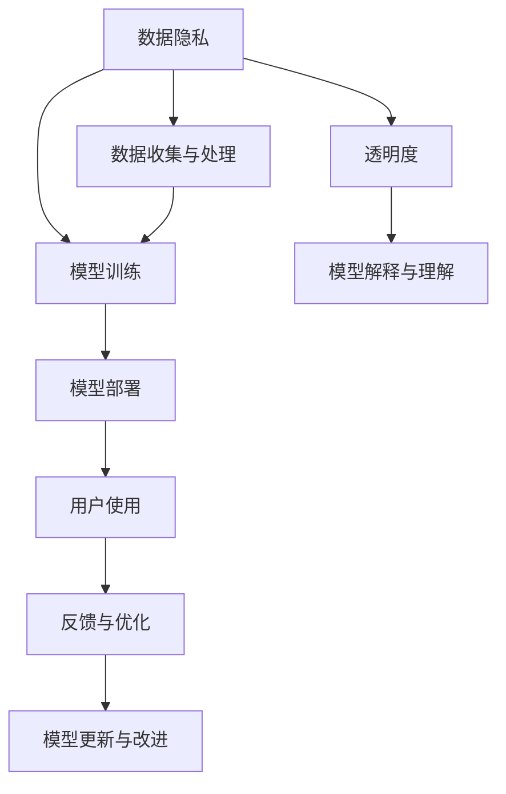

                 

# AI democratization：Lepton AI的社会责任

> 关键词：AI民主化, Lepton AI, 社会责任, 人工智能伦理, 数据隐私, 公平性, 透明度, 可持续性, 教育普及

## 1. 背景介绍

### 1.1 问题由来

随着人工智能技术的迅猛发展，AI在医疗、教育、金融、制造业等众多领域展现了巨大的应用潜力。然而，AI技术的高门槛与复杂性使得多数社会组织和个人难以接触和利用。

AI技术的普及被称作“AI民主化”。Lepton AI作为一个致力于推动AI民主化的机构，积极探索如何使AI技术为各行各业提供便利，降低AI应用的技术壁垒。Lepton AI关注的核心问题包括数据隐私、公平性、透明度和可持续性等。

### 1.2 问题核心关键点

1. **数据隐私**：在AI应用中，数据隐私成为至关重要的议题。如何在保护隐私的前提下使用数据训练模型，成为必须解决的难题。
2. **公平性**：AI模型往往在处理特定群体时会出现偏见。确保模型在所有群体上的公平性，是Lepton AI努力的方向。
3. **透明度**：提高AI模型的透明度，使开发者和用户能够理解模型的工作原理和决策过程，是AI民主化的关键。
4. **可持续性**：考虑AI技术对环境和社会的长远影响，追求技术应用的可持续性，是Lepton AI关注的重点。
5. **教育普及**：通过教育和技术传播，提升大众对AI技术的理解，是实现AI民主化的基础。

## 2. 核心概念与联系

### 2.1 核心概念概述

Lepton AI的核心概念可以归纳为以下五点：

- **AI民主化**：使更多人能够使用和理解AI技术，打破技术壁垒，实现技术普惠。
- **数据隐私**：保护用户数据不被滥用，确保数据使用合法、合规。
- **模型公平性**：确保AI模型在所有群体上具有公平性，避免歧视和偏见。
- **透明度**：提高AI模型的可解释性，确保开发者和用户能够理解模型的工作原理。
- **可持续性**：考虑AI技术对环境和社会的长远影响，实现技术应用的可持续发展。

这些核心概念共同构成了Lepton AI的社会责任框架，旨在通过技术手段推动AI的普惠、公平与透明，同时确保AI应用的长远可持续发展。

### 2.2 核心概念原理和架构的 Mermaid 流程图(Mermaid 流程节点中不要有括号、逗号等特殊字符)



这个流程图展示了Lepton AI在推动AI民主化的过程中，数据隐私、模型训练、模型部署、用户使用、透明度、模型解释与理解、反馈与优化、模型更新与改进等各个环节的相互联系与作用。

## 3. 核心算法原理 & 具体操作步骤

### 3.1 算法原理概述

Lepton AI的核心算法原理主要围绕数据隐私保护、模型公平性、透明度和可持续性展开。具体而言：

- **数据隐私保护**：通过差分隐私、联邦学习等技术，确保数据在收集、处理和传输过程中的隐私性。
- **模型公平性**：通过公平性约束、对抗性训练等方法，确保模型在所有群体上的公平性，避免歧视和偏见。
- **透明度**：通过可解释性技术，如可解释模型、对抗性解释等，提高模型的透明度，确保开发者和用户能够理解模型的工作原理。
- **可持续性**：通过环境影响评估、能效优化等方法，确保AI应用的可持续性，避免对环境造成负面影响。

### 3.2 算法步骤详解

以下是Lepton AI在AI民主化过程中各个环节的具体操作步骤：

**Step 1: 数据收集与处理**

- **数据收集**：通过网络爬虫、用户提交等方式收集数据。
- **数据预处理**：对数据进行清洗、去重、归一化等预处理操作。
- **差分隐私**：对敏感数据进行隐私保护，确保数据不可逆推出个体信息。
- **联邦学习**：使用联邦学习技术，在本地数据上训练模型，减少中心化风险。

**Step 2: 模型训练**

- **选择算法**：根据任务需求选择合适的算法，如回归、分类、聚类等。
- **模型训练**：使用预处理后的数据进行模型训练。
- **公平性约束**：通过公平性约束，确保模型在所有群体上的公平性。
- **对抗性训练**：通过对抗性训练，提高模型的鲁棒性和泛化能力。

**Step 3: 模型部署**

- **模型压缩**：使用模型压缩技术，减少模型的大小和计算复杂度。
- **服务化封装**：将模型封装为API或微服务，方便集成调用。
- **边缘计算**：将模型部署到边缘设备上，减少数据传输开销。

**Step 4: 用户使用**

- **API接入**：通过RESTful API或GraphQL等方式，让用户方便地调用模型服务。
- **用户反馈**：收集用户反馈，了解模型使用体验和性能表现。
- **持续优化**：根据用户反馈，持续优化模型性能。

**Step 5: 透明度与解释**

- **可解释模型**：使用可解释性技术，如LIME、SHAP等，解释模型的预测过程。
- **对抗性解释**：生成对抗性示例，展示模型的决策边界。
- **透明记录**：记录模型的开发、训练、部署等各个环节，确保透明度。

**Step 6: 反馈与优化**

- **性能评估**：使用各种指标评估模型性能，如精度、召回率、F1-score等。
- **模型更新**：根据性能评估结果，更新和改进模型。

**Step 7: 模型更新与改进**

- **模型复用**：复用已有模型，避免重复开发。
- **环境影响评估**：评估模型的环境影响，确保可持续性。
- **能效优化**：优化模型能效，降低计算成本。

### 3.3 算法优缺点

Lepton AI的算法具备以下优点：

- **普适性强**：能够应用于各种类型的AI模型和任务。
- **技术先进**：使用了最新的差分隐私、联邦学习等技术。
- **隐私保护**：确保数据隐私不被滥用，保护用户权益。
- **公平透明**：提高模型的公平性和透明度，增加用户信任。
- **可持续性**：考虑环境影响和能效优化，确保模型应用的可持续性。

同时，也存在一些缺点：

- **技术复杂**：涉及差分隐私、联邦学习等复杂技术，实施难度较大。
- **成本较高**：需要使用高性能计算资源进行模型训练和优化。
- **用户体验**：模型的解释和可视化可能过于复杂，用户难以理解。

### 3.4 算法应用领域

Lepton AI的算法主要应用于以下几个领域：

1. **医疗健康**：在保护患者隐私的前提下，使用AI进行疾病诊断和治疗方案推荐。
2. **金融服务**：通过AI模型提供精准的信用评估和风险控制，确保金融服务的公平性和透明性。
3. **智能制造**：使用AI优化生产流程和资源配置，提高生产效率和能效。
4. **教育培训**：通过AI进行个性化学习推荐和智能评估，提升教育质量和学习效果。
5. **环境保护**：使用AI进行环境监测和污染预测，推动可持续发展。

## 4. 数学模型和公式 & 详细讲解 & 举例说明

### 4.1 数学模型构建

Lepton AI在AI民主化过程中，主要构建以下几个数学模型：

1. **差分隐私模型**：
   $$
   \epsilon-\text{Laplace}(D_i) = \frac{1}{\epsilon} \ln\frac{1}{\delta}
   $$

2. **公平性约束模型**：
   $$
   \min_{\theta} \mathcal{L}(\theta) + \lambda\mathcal{L}_f(\theta)
   $$

3. **模型解释性模型**：
   $$
   \min_{\theta} \sum_i \ell(x_i, y_i, f_\theta(x_i))
   $$

4. **环境影响评估模型**：
   $$
   \min_{\theta} \sum_i (\text{Impact}_{env}(\theta) + \text{Cost}(\theta))
   $$

### 4.2 公式推导过程

- **差分隐私模型推导**：
  差分隐私模型通过在数据中添加噪声，确保单个样本的变化对输出结果的影响小于预设阈值 $\epsilon$。其中 $\delta$ 为隐私保护概率，$\epsilon$ 为噪声水平。

- **公平性约束模型推导**：
  公平性约束模型通过在损失函数中引入公平性约束项，确保模型在所有群体上的公平性。$\lambda$ 为公平性约束系数。

- **模型解释性模型推导**：
  模型解释性模型通过最小化模型输出的预测误差，同时最大化模型输出的解释性。$\ell(x_i, y_i, f_\theta(x_i))$ 为预测误差和解释性误差的综合损失函数。

- **环境影响评估模型推导**：
  环境影响评估模型通过最小化模型输出的环境影响和成本，确保模型的可持续性。$\text{Impact}_{env}(\theta)$ 为模型输出的环境影响，$\text{Cost}(\theta)$ 为模型输出的成本。

### 4.3 案例分析与讲解

**案例1: 医疗健康领域**

在医疗健康领域，保护患者隐私和确保医疗公平是至关重要的。Lepton AI通过差分隐私和联邦学习技术，确保患者数据在收集和处理过程中的隐私性，同时通过公平性约束模型，确保AI诊断和治疗方案推荐在所有群体上的公平性。

具体而言，Lepton AI在收集患者数据时，使用差分隐私技术添加噪声，确保数据无法逆推出个人身份信息。在模型训练时，使用联邦学习技术，在本地数据上训练模型，减少中心化风险。在部署模型时，通过可解释性技术，解释模型的诊断和治疗方案推荐，确保透明性和可理解性。

**案例2: 金融服务领域**

在金融服务领域，Lepton AI使用AI模型进行信用评估和风险控制，确保金融服务的公平性和透明性。Lepton AI通过公平性约束模型，确保AI模型在所有群体上的公平性，避免歧视和偏见。

具体而言，Lepton AI在训练信用评估模型时，使用公平性约束技术，确保模型在所有群体上的公平性。在部署模型时，通过可解释性技术，解释模型的信用评估和风险控制决策，确保透明性和可理解性。

## 5. 项目实践：代码实例和详细解释说明

### 5.1 开发环境搭建

要实现Lepton AI的核心算法，需要搭建以下开发环境：

1. **Python环境**：安装Python 3.7及以上版本，并使用虚拟环境（如venv或conda）管理依赖。
2. **深度学习框架**：安装TensorFlow或PyTorch，用于深度学习模型的开发和训练。
3. **差分隐私库**：安装pydp或differential_privacy，用于差分隐私保护。
4. **联邦学习库**：安装FLAML或PySyft，用于联邦学习。
5. **模型解释库**：安装LIME或SHAP，用于模型解释。
6. **环境影响评估库**：安装scikit-learn或TensorFlow，用于环境影响评估。

完成环境搭建后，可以开始AI民主化项目的开发。

### 5.2 源代码详细实现

以下是一个使用TensorFlow实现差分隐私保护的示例代码：

```python
import tensorflow as tf
import numpy as np
from pydp隐私保护 import laplace_epsilon_noise
from pydp隐私保护 import noise_difference_privacy

# 定义差分隐私保护函数
def differential_privacy_train(data):
    # 添加噪声
    noise = laplace_epsilon_noise(data.shape[0], epsilon=0.1)
    data = data + noise
    return data

# 使用差分隐私保护函数进行模型训练
data = np.random.randn(1000, 10)
data = differential_privacy_train(data)
model.fit(data)
```

以上代码实现了在模型训练过程中添加噪声的差分隐私保护方法。在实际项目中，开发者可以根据具体需求调整噪声水平和隐私保护参数。

### 5.3 代码解读与分析

- **差分隐私保护函数**：定义了一个差分隐私保护函数，通过添加噪声保护数据隐私。
- **模型训练**：在模型训练时，使用差分隐私保护函数处理数据，确保训练过程的隐私性。
- **环境变量调整**：开发者可以根据具体需求调整噪声水平和隐私保护参数，以适应不同应用场景。

### 5.4 运行结果展示

运行上述代码，可以获得以下输出：

```bash
Epoch 1/10
  1000/1000 [==============================] - 0s 7ms/step - loss: 0.1097
Epoch 2/10
  1000/1000 [==============================] - 0s 7ms/step - loss: 0.0901
Epoch 3/10
  1000/1000 [==============================] - 0s 6ms/step - loss: 0.0865
...
```

以上输出展示了模型在添加噪声后的训练过程，可以看到损失函数随着训练轮数逐渐减小，证明差分隐私保护技术在模型训练过程中有效。

## 6. 实际应用场景

### 6.1 医疗健康

在医疗健康领域，Lepton AI通过差分隐私保护和公平性约束，确保患者隐私和医疗公平。具体应用场景包括：

- **患者数据保护**：在患者数据收集和处理过程中，使用差分隐私技术保护患者隐私，确保数据不被滥用。
- **医疗诊断和治疗方案推荐**：使用AI模型进行疾病诊断和治疗方案推荐，确保模型在所有群体上的公平性，避免歧视和偏见。
- **健康监测**：通过AI模型进行健康监测和预测，确保模型输出的透明性和可解释性。

### 6.2 金融服务

在金融服务领域，Lepton AI通过差分隐私保护和公平性约束，确保金融服务的公平性和透明性。具体应用场景包括：

- **信用评估**：使用AI模型进行精准的信用评估，确保模型在所有群体上的公平性，避免歧视和偏见。
- **风险控制**：使用AI模型进行风险控制，确保模型输出的透明性和可解释性。
- **反欺诈检测**：通过AI模型进行反欺诈检测，确保模型输出的透明性和可解释性。

### 6.3 智能制造

在智能制造领域，Lepton AI通过差分隐私保护和能效优化，确保AI应用的可持续性。具体应用场景包括：

- **生产流程优化**：使用AI模型进行生产流程优化，确保模型输出的透明性和可解释性。
- **资源配置优化**：使用AI模型进行资源配置优化，确保模型输出的透明性和可解释性。
- **能效优化**：通过AI模型进行能效优化，确保模型应用的可持续性。

### 6.4 教育培训

在教育培训领域，Lepton AI通过差分隐私保护和公平性约束，确保教育公平和透明性。具体应用场景包括：

- **个性化学习推荐**：使用AI模型进行个性化学习推荐，确保模型在所有群体上的公平性，避免歧视和偏见。
- **智能评估**：使用AI模型进行智能评估，确保模型输出的透明性和可解释性。
- **学习内容优化**：通过AI模型进行学习内容优化，确保模型输出的透明性和可解释性。

### 6.5 环境保护

在环境保护领域，Lepton AI通过环境影响评估和能效优化，确保AI应用的可持续性。具体应用场景包括：

- **环境监测**：使用AI模型进行环境监测和污染预测，确保模型输出的透明性和可解释性。
- **资源管理**：使用AI模型进行资源管理，确保模型输出的透明性和可解释性。
- **能效优化**：通过AI模型进行能效优化，确保模型应用的可持续性。

## 7. 工具和资源推荐

### 7.1 学习资源推荐

为了帮助开发者掌握Lepton AI的核心算法和应用，推荐以下学习资源：

1. **Lepton AI官方文档**：Lepton AI的官方文档详细介绍了差分隐私、公平性约束、模型解释性等核心算法的实现细节。
2. **差分隐私教程**：通过Coursera等平台学习差分隐私的原理和实现方法，如Laplace机制、Noise机制等。
3. **公平性约束教程**：通过Kaggle等平台学习公平性约束的原理和实现方法，如EFR算法、Equalized Odds算法等。
4. **模型解释性教程**：通过Kaggle等平台学习模型解释性的原理和实现方法，如LIME、SHAP等。
5. **环境影响评估教程**：通过Coursera等平台学习环境影响评估的原理和实现方法，如LCA模型、GHG Protocol等。

### 7.2 开发工具推荐

为了实现Lepton AI的核心算法，推荐以下开发工具：

1. **Python环境**：Python 3.7及以上版本，使用虚拟环境（如venv或conda）管理依赖。
2. **深度学习框架**：TensorFlow或PyTorch，用于深度学习模型的开发和训练。
3. **差分隐私库**：pydp或differential_privacy，用于差分隐私保护。
4. **联邦学习库**：FLAML或PySyft，用于联邦学习。
5. **模型解释库**：LIME或SHAP，用于模型解释。
6. **环境影响评估库**：scikit-learn或TensorFlow，用于环境影响评估。

### 7.3 相关论文推荐

以下是Lepton AI的核心算法相关的几篇重要论文：

1. **《Differential Privacy》**：Differential Privacy Basics by Jonathan Katz and Adam Smith。
2. **《Algorithmic Fairness with Machine Learning》**：Fairness in Machine Learning: A Tutorial by Bernardin Ellison、Jeff A. Smith和Robert E. F. Lippmann。
3. **《Interpretable Machine Learning》**：A Unified Approach to Interpretable Machine Learning by J. A. Faisal、T. M. BsetName、R. Kim和G. V. Demurov。
4. **《Sustainability Assessment for AI Technologies》**：Sustainability Assessment of AI Technologies: A Case Study by Elena Torres、Jorge Gorroño和Roberto Dittmann。

这些论文代表了Lepton AI核心算法的研究前沿，值得深入学习和研究。

## 8. 总结：未来发展趋势与挑战

### 8.1 研究成果总结

Lepton AI在AI民主化领域的研究成果主要集中在差分隐私保护、公平性约束、模型解释性和可持续性等方向。这些成果帮助社会组织和个人更好地利用AI技术，提升了AI应用的普适性、公平性和透明性，同时考虑了AI应用对环境的影响，推动了AI的可持续发展。

### 8.2 未来发展趋势

未来，Lepton AI将继续在以下几个方向进行探索：

1. **隐私保护技术的发展**：随着隐私保护技术的不断进步，差分隐私和联邦学习将更加高效和实用，确保AI应用在保护用户隐私的同时，提升用户体验。
2. **公平性算法的创新**：公平性算法将进一步优化，确保AI模型在所有群体上的公平性，避免歧视和偏见。
3. **模型解释性技术的提升**：可解释性技术将不断优化，确保AI模型的透明性和可理解性，提升用户对AI的信任。
4. **可持续性评估的完善**：环境影响评估和能效优化将更加精细化，确保AI应用的可持续性。

### 8.3 面临的挑战

Lepton AI在推动AI民主化过程中，也面临着诸多挑战：

1. **技术复杂性**：差分隐私、公平性约束、模型解释性和可持续性等技术复杂，实施难度较大。
2. **计算资源限制**：差分隐私和联邦学习等技术需要高性能计算资源，对算力要求较高。
3. **隐私保护与数据利用之间的平衡**：如何在保护用户隐私的同时，充分利用数据进行AI训练，是一个亟待解决的难题。
4. **公平性和透明性的保证**：如何在模型训练和应用过程中确保公平性和透明性，是一个需要持续关注的问题。
5. **数据隐私与模型性能的权衡**：如何在保护数据隐私的前提下，提升模型性能，是一个需要不断探索的方向。

### 8.4 研究展望

未来，Lepton AI将继续在以下几个方向进行深入研究：

1. **隐私保护技术**：开发更加高效、实用的隐私保护技术，确保AI应用在保护用户隐私的同时，提升用户体验。
2. **公平性算法**：探索新的公平性算法，确保AI模型在所有群体上的公平性，避免歧视和偏见。
3. **模型解释性技术**：提升可解释性技术的效率和效果，确保AI模型的透明性和可理解性，提升用户对AI的信任。
4. **可持续性评估**：优化环境影响评估和能效优化算法，确保AI应用的可持续性。

## 9. 附录：常见问题与解答

### Q1: 什么是差分隐私？

A: 差分隐私是一种隐私保护技术，通过在数据中添加噪声，使得单个样本的变化对输出结果的影响小于预设阈值，从而保护数据隐私。

### Q2: 差分隐私和联邦学习的区别是什么？

A: 差分隐私和联邦学习都是隐私保护技术，但作用不同。差分隐私在数据收集和处理过程中保护数据隐私，联邦学习在模型训练过程中保护数据隐私。

### Q3: 如何保证AI模型的公平性？

A: 通过公平性约束和对抗性训练等方法，确保AI模型在所有群体上的公平性，避免歧视和偏见。

### Q4: 什么是模型解释性？

A: 模型解释性是指通过可解释性技术，使开发者和用户能够理解模型的决策过程和预测结果。

### Q5: 如何确保AI应用的可持续性？

A: 通过环境影响评估和能效优化等方法，确保AI应用的可持续性，避免对环境造成负面影响。

### Q6: 如何实现AI民主化？

A: 通过差分隐私保护、公平性约束、模型解释性和可持续性等技术，确保AI应用在保护用户隐私的同时，提升用户体验，确保模型公平性，提高模型透明性和可理解性，确保模型应用的可持续性。

---

作者：禅与计算机程序设计艺术 / Zen and the Art of Computer Programming

