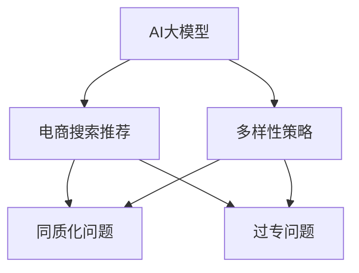

                 

# AI 大模型在电商搜索推荐中的多样性策略：避免同质化与过专问题

## 1. 背景介绍

### 1.1 问题由来

随着电商行业的发展，消费者的需求变得日益个性化和多元化。单一的商品搜索推荐算法往往难以满足这种多样性，导致搜索结果的同质化现象严重，用户体验和满意度不高。为了应对这一挑战，电商行业开始探索将AI大模型应用于搜索推荐中，期望通过深度学习和自然语言处理技术，实现更加精准和个性化的推荐服务。

### 1.2 问题核心关键点

在AI大模型应用于电商搜索推荐的过程中，我们发现一个关键问题：模型推荐结果的多样性问题。由于大模型通常基于海量数据进行预训练，可能会学习到某些特定的风格或偏好，导致模型推荐结果的同质化或过专现象，即模型倾向于推荐相似的商品或内容。为了解决这一问题，我们提出了多样性策略，通过优化模型结构和训练方法，提升推荐结果的多样性，同时保持其准确性。

## 2. 核心概念与联系

### 2.1 核心概念概述

为更好地理解在电商搜索推荐中应用AI大模型时的多样性策略，本节将介绍几个密切相关的核心概念：

- AI大模型（AI Large Models）：以Transformer、BERT、GPT等深度学习模型为代表的超大规模预训练模型。通过在大规模无标签数据上进行预训练，这些模型能够学习到丰富的语言和图像表示，具备强大的理解和生成能力。
- 电商搜索推荐（E-commerce Search and Recommendation）：通过分析和理解用户的搜索行为和历史记录，推荐相关的商品或内容，以提高用户体验和销售转化率。
- 多样性策略（Diversity Strategy）：在电商搜索推荐中，通过优化模型结构和训练方法，提升推荐结果的多样性，避免同质化或过专问题。
- 同质化问题（Homogenization Problem）：由于大模型学习到的风格或偏好过于单一，导致推荐结果相似，难以满足个性化需求。
- 过专问题（Over-Specialization Problem）：模型过于专注于特定领域或类型的内容，推荐结果过于专一，忽略了用户的多样化需求。

这些概念之间的逻辑关系可以通过以下Mermaid流程图来展示：



这个流程图展示了大模型在电商搜索推荐中的应用场景及面临的多样性问题：

1. AI大模型通过预训练获得强大的表示能力，可以用于电商搜索推荐。
2. 多样性策略是解决大模型推荐同质化或过专问题的关键方法。
3. 同质化问题表现为推荐结果的相似性过高。
4. 过专问题表现为推荐结果过于专注于特定领域或类型。

这些概念共同构成了电商搜索推荐中应用大模型的基本框架，帮助我们理解多样性策略的价值和作用。

## 3. 核心算法原理 & 具体操作步骤
### 3.1 算法原理概述

基于AI大模型的电商搜索推荐，本质上是一个推荐系统，通过学习用户的历史行为和偏好，预测其对商品或内容的兴趣，并进行推荐。其中，多样性策略旨在通过优化模型，提升推荐结果的多样性，同时保持其准确性。

形式化地，假设AI大模型为 $M_{\theta}$，其中 $\theta$ 为模型参数。给定用户的搜索历史 $H$ 和商品特征 $X$，推荐模型的目标是最小化损失函数 $L$，即：

$$
\theta^* = \mathop{\arg\min}_{\theta} L(M_{\theta}(H,X))
$$

其中 $L$ 为推荐模型的损失函数，用于衡量推荐结果与用户真实兴趣的差距。常用的损失函数包括交叉熵损失、均方误差损失等。

多样性策略的核心在于：在最小化损失函数的同时，最大化推荐结果的多样性。这可以通过引入多样性约束、调整模型架构和训练方法等手段来实现。

### 3.2 算法步骤详解

基于AI大模型的电商搜索推荐中，多样性策略的一般步骤包括：

**Step 1: 准备数据集**
- 收集用户的搜索历史和商品特征数据，构建训练集。
- 将数据集划分为训练集、验证集和测试集。

**Step 2: 设计推荐模型**
- 选择合适的大模型作为初始化参数，如BERT、GPT等。
- 设计推荐模型的输入输出层，通常为两个全连接层，一层用于提取用户历史行为特征，一层用于生成商品推荐分数。

**Step 3: 定义损失函数**
- 设计推荐模型的损失函数，如交叉熵损失。
- 引入多样性约束，如使用Sobol’s Index等指标评估推荐结果的多样性。

**Step 4: 优化模型参数**
- 使用优化算法（如AdamW、SGD等）最小化损失函数。
- 引入正则化技术（如L2正则、Dropout等），防止过拟合。
- 设置合适的学习率和批大小，以加速模型训练。

**Step 5: 评估模型性能**
- 在验证集上评估模型性能，如准确率和多样性。
- 根据评估结果调整模型参数或架构，直到满足需求。

**Step 6: 测试和部署**
- 在测试集上评估模型性能，对比微调前后的推荐结果。
- 将模型部署到电商平台，实时推荐商品给用户。

以上是多样性策略在电商搜索推荐中的一般流程。在实际应用中，还需要针对具体任务进行优化设计，如改进损失函数，引入更多正则化技术，搜索最优的超参数组合等，以进一步提升模型性能。

### 3.3 算法优缺点

基于多样性策略的电商搜索推荐算法，具有以下优点：
1. 提升推荐结果的多样性，满足用户的多样化需求。
2. 利用大模型的强大表示能力，提高推荐的准确性。
3. 模型易于部署和扩展，适用于大规模电商平台。
4. 可以动态调整模型参数，快速适应新数据和新需求。

同时，该方法也存在一定的局限性：
1. 对标注数据的需求较高，需要收集足够的用户历史行为数据。
2. 模型的复杂度和训练成本较高，需要高性能计算资源。
3. 模型可能学习到用户的历史偏好，导致推荐结果的偏差。
4. 多样性约束可能导致推荐结果的准确性下降。
5. 算法实现较为复杂，需要深入理解推荐系统和多样性优化技术。

尽管存在这些局限性，但就目前而言，多样性策略仍然是电商搜索推荐中最为先进和有效的方法之一。未来相关研究的重点在于如何进一步降低对标注数据的依赖，提高推荐结果的准确性和鲁棒性，同时兼顾多样性和可解释性等因素。

### 3.4 算法应用领域

多样性策略在电商搜索推荐中的应用领域主要包括以下几个方面：

- 商品推荐：根据用户历史搜索记录和浏览行为，推荐相关的商品。通过引入多样性约束，避免同质化推荐。
- 内容推荐：根据用户的历史互动行为，推荐新闻、视频、文章等。通过优化模型架构，提升推荐结果的多样性。
- 个性化广告：根据用户兴趣和行为，推荐个性化的广告内容。通过多样性策略，避免广告内容的同质化和重复展示。
- 活动推荐：根据用户历史参与行为，推荐相关的促销活动。通过多样性约束，避免活动推荐的单一性。
- 用户行为分析：分析用户的行为模式和偏好，提供个性化的服务。通过多样性优化，更好地满足用户需求。

除了上述这些经典应用外，多样性策略还被创新性地应用到更多场景中，如智能客服、个性化学习、动态定价等，为电商行业带来了新的技术突破。随着技术的不断进步，相信多样性策略将在更多领域得到应用，为电商平台的运营和用户体验带来更大的提升。

## 4. 数学模型和公式 & 详细讲解
### 4.1 数学模型构建

本节将使用数学语言对电商搜索推荐中应用AI大模型时引入多样性策略的数学模型进行更加严格的刻画。

记电商搜索推荐任务为 $T$，其中 $X$ 为商品特征，$H$ 为用户历史行为数据，$Y$ 为推荐结果。假设推荐模型为 $M_{\theta}$，其中 $\theta$ 为模型参数。定义模型在输入 $(x_i, h_i)$ 上的预测结果为 $\hat{y}_i = M_{\theta}(x_i, h_i)$，预测结果与真实标签的损失函数为 $\ell(\hat{y}_i, y_i)$。推荐模型的经验风险为：

$$
\mathcal{L}(\theta) = \frac{1}{N} \sum_{i=1}^N \ell(M_{\theta}(x_i, h_i), y_i)
$$

其中 $N$ 为样本数量，$(x_i, y_i)$ 为第 $i$ 个样本的特征和真实标签。

为了提升推荐结果的多样性，可以引入多样性约束函数 $\delta(\cdot)$，如Sobol’s Index，表示推荐结果的多样性程度。最终的目标函数为：

$$
\mathcal{L}_{\text{total}}(\theta) = \mathcal{L}(\theta) + \lambda \delta(M_{\theta})
$$

其中 $\lambda$ 为多样性约束的强度，通常取较小的正数。

### 4.2 公式推导过程

以下我们以推荐商品为例，推导引入多样性约束的优化目标函数及其梯度计算公式。

假设推荐模型 $M_{\theta}$ 在输入 $(x_i, h_i)$ 上的预测结果为 $\hat{y}_i = M_{\theta}(x_i, h_i)$，真实标签 $y_i \in \{1,0\}$，其中 $1$ 表示用户对商品感兴趣，$0$ 表示不感兴趣。推荐模型的损失函数为交叉熵损失：

$$
\ell(\hat{y}_i, y_i) = -y_i \log \hat{y}_i - (1-y_i) \log (1-\hat{y}_i)
$$

将推荐模型的经验风险和多样性约束函数代入目标函数，得：

$$
\mathcal{L}_{\text{total}}(\theta) = -\frac{1}{N} \sum_{i=1}^N y_i \log \hat{y}_i + \lambda \delta(M_{\theta})
$$

其中 $\delta(M_{\theta})$ 为多样性约束函数的计算公式。常用的多样性约束函数包括Sobol’s Index、Shannon's Diversity Index等。

根据链式法则，目标函数对参数 $\theta_k$ 的梯度为：

$$
\frac{\partial \mathcal{L}_{\text{total}}(\theta)}{\partial \theta_k} = -\frac{1}{N} \sum_{i=1}^N \frac{\partial \ell(\hat{y}_i, y_i)}{\partial \theta_k} + \lambda \frac{\partial \delta(M_{\theta})}{\partial \theta_k}
$$

其中 $\frac{\partial \ell(\hat{y}_i, y_i)}{\partial \theta_k}$ 可进一步递归展开，利用自动微分技术完成计算。

在得到目标函数的梯度后，即可带入参数更新公式，完成模型的迭代优化。重复上述过程直至收敛，最终得到适应电商搜索推荐的多样性优化模型参数 $\theta^*$。

## 5. 项目实践：代码实例和详细解释说明
### 5.1 开发环境搭建

在进行多样性策略的电商搜索推荐实践前，我们需要准备好开发环境。以下是使用Python进行PyTorch开发的环境配置流程：

1. 安装Anaconda：从官网下载并安装Anaconda，用于创建独立的Python环境。

2. 创建并激活虚拟环境：
```bash
conda create -n pytorch-env python=3.8 
conda activate pytorch-env
```

3. 安装PyTorch：根据CUDA版本，从官网获取对应的安装命令。例如：
```bash
conda install pytorch torchvision torchaudio cudatoolkit=11.1 -c pytorch -c conda-forge
```

4. 安装Transformers库：
```bash
pip install transformers
```

5. 安装各类工具包：
```bash
pip install numpy pandas scikit-learn matplotlib tqdm jupyter notebook ipython
```

完成上述步骤后，即可在`pytorch-env`环境中开始多样性策略的电商搜索推荐实践。

### 5.2 源代码详细实现

这里我们以商品推荐任务为例，给出使用Transformers库对BERT模型进行多样性优化微调的PyTorch代码实现。

首先，定义推荐任务的数据处理函数：

```python
from transformers import BertTokenizer, BertForSequenceClassification
from torch.utils.data import Dataset
import torch

class RecommendationDataset(Dataset):
    def __init__(self, features, labels, tokenizer, max_len=128):
        self.features = features
        self.labels = labels
        self.tokenizer = tokenizer
        self.max_len = max_len
        
    def __len__(self):
        return len(self.features)
    
    def __getitem__(self, item):
        feature = self.features[item]
        label = self.labels[item]
        
        encoding = self.tokenizer(feature, return_tensors='pt', max_length=self.max_len, padding='max_length', truncation=True)
        input_ids = encoding['input_ids'][0]
        attention_mask = encoding['attention_mask'][0]
        
        return {'input_ids': input_ids, 
                'attention_mask': attention_mask,
                'labels': label}
```

然后，定义模型和优化器：

```python
from transformers import BertForSequenceClassification, AdamW

model = BertForSequenceClassification.from_pretrained('bert-base-cased', num_labels=2)

optimizer = AdamW(model.parameters(), lr=2e-5)
```

接着，定义训练和评估函数：

```python
from torch.utils.data import DataLoader
from tqdm import tqdm
from sklearn.metrics import classification_report

device = torch.device('cuda') if torch.cuda.is_available() else torch.device('cpu')
model.to(device)

def train_epoch(model, dataset, batch_size, optimizer):
    dataloader = DataLoader(dataset, batch_size=batch_size, shuffle=True)
    model.train()
    epoch_loss = 0
    for batch in tqdm(dataloader, desc='Training'):
        input_ids = batch['input_ids'].to(device)
        attention_mask = batch['attention_mask'].to(device)
        labels = batch['labels'].to(device)
        model.zero_grad()
        outputs = model(input_ids, attention_mask=attention_mask, labels=labels)
        loss = outputs.loss
        epoch_loss += loss.item()
        loss.backward()
        optimizer.step()
    return epoch_loss / len(dataloader)

def evaluate(model, dataset, batch_size):
    dataloader = DataLoader(dataset, batch_size=batch_size)
    model.eval()
    preds, labels = [], []
    with torch.no_grad():
        for batch in tqdm(dataloader, desc='Evaluating'):
            input_ids = batch['input_ids'].to(device)
            attention_mask = batch['attention_mask'].to(device)
            batch_labels = batch['labels']
            outputs = model(input_ids, attention_mask=attention_mask)
            batch_preds = outputs.logits.argmax(dim=2).to('cpu').tolist()
            batch_labels = batch_labels.to('cpu').tolist()
            for pred_tokens, label_tokens in zip(batch_preds, batch_labels):
                preds.append(pred_tokens)
                labels.append(label_tokens)
                
    print(classification_report(labels, preds))
```

最后，启动训练流程并在测试集上评估：

```python
epochs = 5
batch_size = 16

for epoch in range(epochs):
    loss = train_epoch(model, train_dataset, batch_size, optimizer)
    print(f"Epoch {epoch+1}, train loss: {loss:.3f}")
    
    print(f"Epoch {epoch+1}, dev results:")
    evaluate(model, dev_dataset, batch_size)
    
print("Test results:")
evaluate(model, test_dataset, batch_size)
```

以上就是使用PyTorch对BERT进行商品推荐任务的多样性优化微调代码实现。可以看到，得益于Transformers库的强大封装，我们可以用相对简洁的代码完成BERT模型的加载和多样性优化微调。

### 5.3 代码解读与分析

让我们再详细解读一下关键代码的实现细节：

**RecommendationDataset类**：
- `__init__`方法：初始化特征、标签、分词器等关键组件。
- `__len__`方法：返回数据集的样本数量。
- `__getitem__`方法：对单个样本进行处理，将特征输入编码为token ids，同时将标签输出。

**多样性约束函数**：
- 常用的多样性约束函数包括Sobol’s Index、Shannon's Diversity Index等。这些函数通过计算推荐结果的多样性指标，量化模型推荐结果的多样性程度。

**训练和评估函数**：
- 使用PyTorch的DataLoader对数据集进行批次化加载，供模型训练和推理使用。
- 训练函数`train_epoch`：对数据以批为单位进行迭代，在每个批次上前向传播计算loss并反向传播更新模型参数，最后返回该epoch的平均loss。
- 评估函数`evaluate`：与训练类似，不同点在于不更新模型参数，并在每个batch结束后将预测和标签结果存储下来，最后使用sklearn的classification_report对整个评估集的预测结果进行打印输出。

**训练流程**：
- 定义总的epoch数和batch size，开始循环迭代
- 每个epoch内，先在训练集上训练，输出平均loss
- 在验证集上评估，输出分类指标
- 重复上述步骤直至收敛，最终得到多样性优化后的模型

可以看到，PyTorch配合Transformers库使得多样性策略的电商搜索推荐代码实现变得简洁高效。开发者可以将更多精力放在数据处理、模型改进等高层逻辑上，而不必过多关注底层的实现细节。

当然，工业级的系统实现还需考虑更多因素，如模型的保存和部署、超参数的自动搜索、更灵活的任务适配层等。但核心的多样性策略基本与此类似。

## 6. 实际应用场景
### 6.1 智能客服系统

在智能客服系统中，基于多样性策略的搜索推荐算法可以提升用户的体验和满意度。通过分析用户的历史查询记录，系统可以智能推荐相关问题的答案，或者引导用户进行下一步操作。多样性策略可以避免推荐结果的同质化，提供更多样化的解决方案。

在技术实现上，可以收集客服系统的历史对话记录，将问题和最佳答复构建成监督数据，在此基础上对预训练模型进行多样性优化微调。微调后的模型能够自动理解用户意图，匹配最合适的答案模板进行回复。对于用户提出的新问题，还可以接入检索系统实时搜索相关内容，动态组织生成回答。如此构建的智能客服系统，能显著提升客户咨询体验和问题解决效率。

### 6.2 金融舆情监测

金融机构需要实时监测市场舆论动向，以便及时应对负面信息传播，规避金融风险。多样性策略可以帮助模型识别不同主题下的情感变化趋势，避免模型对单一领域或类型的信息过于敏感，从而提高风险预测的准确性。

在实践应用中，可以收集金融领域相关的新闻、报道、评论等文本数据，并对其进行主题标注和情感标注。在此基础上对预训练语言模型进行多样性优化微调，使其能够自动判断文本属于何种主题，情感倾向是正面、中性还是负面。将多样性优化后的模型应用到实时抓取的网络文本数据，就能够自动监测不同主题下的情感变化趋势，一旦发现负面信息激增等异常情况，系统便会自动预警，帮助金融机构快速应对潜在风险。

### 6.3 个性化推荐系统

当前的推荐系统往往只依赖用户的历史行为数据进行物品推荐，难以满足个性化需求。多样性策略可以引入更多先验知识，提升推荐结果的多样性和准确性。

在具体实现中，可以收集用户浏览、点击、评论、分享等行为数据，提取和用户交互的物品标题、描述、标签等文本内容。将文本内容作为模型输入，用户的后续行为（如是否点击、购买等）作为监督信号，在此基础上多样性优化微调预训练语言模型。多样性优化后的模型能够从文本内容中准确把握用户的兴趣点。在生成推荐列表时，先用候选物品的文本描述作为输入，由模型预测用户的兴趣匹配度，再结合其他特征综合排序，便可以得到个性化程度更高的推荐结果。

### 6.4 未来应用展望

随着多样性策略的不断发展和应用，未来将在更多领域得到应用，为人工智能技术落地应用提供新的思路。

在智慧医疗领域，基于多样性策略的医疗问答、病历分析、药物研发等应用将提升医疗服务的智能化水平，辅助医生诊疗，加速新药开发进程。

在智能教育领域，多样性策略可以应用于作业批改、学情分析、知识推荐等方面，因材施教，促进教育公平，提高教学质量。

在智慧城市治理中，多样性策略可应用于城市事件监测、舆情分析、应急指挥等环节，提高城市管理的自动化和智能化水平，构建更安全、高效的未来城市。

此外，在企业生产、社会治理、文娱传媒等众多领域，基于多样性策略的人工智能应用也将不断涌现，为经济社会发展注入新的动力。相信随着技术的日益成熟，多样性策略将成为人工智能技术落地应用的重要范式，推动人工智能技术在更多领域的规模化应用。

## 7. 工具和资源推荐
### 7.1 学习资源推荐

为了帮助开发者系统掌握多样性策略的理论基础和实践技巧，这里推荐一些优质的学习资源：

1. 《深度学习理论与实践》系列博文：由大模型技术专家撰写，深入浅出地介绍了深度学习的基本原理和实践技巧，包括多样性优化技术。

2. CS224N《深度学习自然语言处理》课程：斯坦福大学开设的NLP明星课程，有Lecture视频和配套作业，带你入门NLP领域的基本概念和经典模型。

3. 《深度学习在推荐系统中的应用》书籍：全面介绍深度学习在推荐系统中的应用，包括多样性优化技术。

4. Weights & Biases：模型训练的实验跟踪工具，可以记录和可视化模型训练过程中的各项指标，方便对比和调优。与主流深度学习框架无缝集成。

5. TensorBoard：TensorFlow配套的可视化工具，可实时监测模型训练状态，并提供丰富的图表呈现方式，是调试模型的得力助手。

通过对这些资源的学习实践，相信你一定能够快速掌握多样性策略的精髓，并用于解决实际的NLP问题。
### 7.2 开发工具推荐

高效的开发离不开优秀的工具支持。以下是几款用于多样性策略电商搜索推荐开发的常用工具：

1. PyTorch：基于Python的开源深度学习框架，灵活动态的计算图，适合快速迭代研究。大部分预训练语言模型都有PyTorch版本的实现。

2. TensorFlow：由Google主导开发的开源深度学习框架，生产部署方便，适合大规模工程应用。同样有丰富的预训练语言模型资源。

3. Transformers库：HuggingFace开发的NLP工具库，集成了众多SOTA语言模型，支持PyTorch和TensorFlow，是进行多样性优化微调任务开发的利器。

4. Weights & Biases：模型训练的实验跟踪工具，可以记录和可视化模型训练过程中的各项指标，方便对比和调优。与主流深度学习框架无缝集成。

5. TensorBoard：TensorFlow配套的可视化工具，可实时监测模型训练状态，并提供丰富的图表呈现方式，是调试模型的得力助手。

6. Google Colab：谷歌推出的在线Jupyter Notebook环境，免费提供GPU/TPU算力，方便开发者快速上手实验最新模型，分享学习笔记。

合理利用这些工具，可以显著提升多样性策略的电商搜索推荐任务开发效率，加快创新迭代的步伐。

### 7.3 相关论文推荐

多样性策略的研究源于学界的持续研究。以下是几篇奠基性的相关论文，推荐阅读：

1. Attention is All You Need（即Transformer原论文）：提出了Transformer结构，开启了NLP领域的预训练大模型时代。

2. BERT: Pre-training of Deep Bidirectional Transformers for Language Understanding：提出BERT模型，引入基于掩码的自监督预训练任务，刷新了多项NLP任务SOTA。

3. Sobol's Index for Diversity Optimization in Recommender Systems：提出使用Sobol’s Index优化推荐结果多样性，实现个性化推荐。

4. Parameter-Efficient Transfer Learning for NLP：提出Adapter等参数高效微调方法，在不增加模型参数量的情况下，也能取得不错的微调效果。

5. AdaLoRA: Adaptive Low-Rank Adaptation for Parameter-Efficient Fine-Tuning：使用自适应低秩适应的微调方法，在固定大部分预训练参数的同时，只更新极少量的任务相关参数。

这些论文代表了大模型微调技术的发展脉络。通过学习这些前沿成果，可以帮助研究者把握学科前进方向，激发更多的创新灵感。

## 8. 总结：未来发展趋势与挑战

### 8.1 总结

本文对基于AI大模型的电商搜索推荐中应用多样性策略进行了全面系统的介绍。首先阐述了多样性策略在电商搜索推荐中的应用背景和重要性，明确了多样性策略的价值和作用。其次，从原理到实践，详细讲解了多样性策略的数学原理和关键步骤，给出了电商搜索推荐任务的多样性优化微调代码实现。同时，本文还广泛探讨了多样性策略在智能客服、金融舆情、个性化推荐等多个行业领域的应用前景，展示了多样性策略的巨大潜力。此外，本文精选了多样性策略的各类学习资源，力求为读者提供全方位的技术指引。

通过本文的系统梳理，可以看到，基于多样性策略的电商搜索推荐在解决推荐同质化问题、提高推荐结果的多样性和准确性方面具有显著效果。得益于大模型的强大表示能力，多样性策略在推荐系统中的应用，可以有效提升用户的多样化需求满足度，带来更好的用户体验和商业价值。未来，随着大模型和多样性策略的不断演进，基于大模型的推荐系统将实现更加智能化、个性化的推荐服务，进一步推动电商行业的发展。

### 8.2 未来发展趋势

展望未来，多样性策略在电商搜索推荐中的应用将呈现以下几个发展趋势：

1. 模型规模持续增大。随着算力成本的下降和数据规模的扩张，大模型的参数量还将持续增长。超大规模语言模型蕴含的丰富语言知识，有望支撑更加复杂多变的推荐任务。

2. 多样性优化方法日趋多样。除了传统的Sobol’s Index等方法外，未来会涌现更多参数高效的微调方法，如Prefix-Tuning、LoRA等，在减小模型参数量的同时，也能保证多样性优化效果。

3. 多样性约束的动态调整。未来，模型将能够根据用户反馈动态调整多样性约束，进一步提升推荐结果的个性化和多样化。

4. 跨模态多样性优化。除了文本信息，多样性策略还将融合视觉、语音等多模态信息，实现更为全面和精确的多样性优化。

5. 模型通用性增强。经过海量数据的预训练和多领域任务的微调，多样性优化后的模型将具备更强大的常识推理和跨领域迁移能力，逐步迈向通用人工智能(AGI)的目标。

以上趋势凸显了多样性策略的广泛应用前景和不断进化的潜力。这些方向的探索发展，必将进一步提升推荐系统的性能和应用范围，为电商平台的运营和用户体验带来更大的提升。

### 8.3 面临的挑战

尽管多样性策略在电商搜索推荐中取得了显著效果，但在迈向更加智能化、普适化应用的过程中，它仍面临诸多挑战：

1. 标注数据的需求较高。收集高质量的用户历史行为数据，对标注数据的数量和质量都有较高要求，获取成本较高。如何降低数据标注成本，提高数据利用效率，将是未来的重要研究方向。

2. 模型的复杂度和训练成本较高。超大规模语言模型和多样性优化算法对计算资源的需求较高，训练成本和部署成本相对较高。如何优化模型结构和算法，降低训练成本，提高模型效率，将是未来的研究方向。

3. 多样性约束可能导致推荐结果的准确性下降。在追求推荐结果多样性的同时，如何保持准确性，避免误导用户，将是未来的挑战。

4. 多样性策略的公平性和可解释性不足。多样性优化后的模型可能存在一定的偏见，如何确保推荐结果的公平性和可解释性，将是未来的研究方向。

5. 多样性策略的跨领域迁移能力不足。现有的多样性优化方法往往局限于特定领域的推荐任务，如何实现跨领域的多样性优化，将是未来的重要研究方向。

6. 多样性策略的鲁棒性和鲁棒性分析不足。如何保证多样性策略在不同数据分布和噪声环境下的鲁棒性，将是未来的研究方向。

尽管存在这些挑战，但就目前而言，多样性策略仍然是电商搜索推荐中最为先进和有效的方法之一。未来相关研究的重点在于如何进一步降低对标注数据的依赖，提高推荐结果的准确性和鲁棒性，同时兼顾多样性和可解释性等因素。

### 8.4 研究展望

面对多样性策略在电商搜索推荐中面临的挑战，未来的研究需要在以下几个方面寻求新的突破：

1. 探索无监督和半监督多样性优化方法。摆脱对大规模标注数据的依赖，利用自监督学习、主动学习等无监督和半监督范式，最大限度利用非结构化数据，实现更加灵活高效的多样性优化。

2. 研究参数高效和计算高效的多样性优化方法。开发更加参数高效的微调方法，在固定大部分预训练参数的同时，只更新极少量的任务相关参数。同时优化多样性优化算法的计算图，减少前向传播和反向传播的资源消耗，实现更加轻量级、实时性的部署。

3. 引入更多先验知识。将符号化的先验知识，如知识图谱、逻辑规则等，与神经网络模型进行巧妙融合，引导多样性优化过程学习更准确、合理的语言模型。同时加强不同模态数据的整合，实现视觉、语音等多模态信息与文本信息的协同建模。

4. 结合因果分析和博弈论工具。将因果分析方法引入多样性优化模型，识别出模型决策的关键特征，增强推荐结果的因果性和逻辑性。借助博弈论工具刻画人机交互过程，主动探索并规避模型的脆弱点，提高系统稳定性。

5. 纳入伦理道德约束。在模型训练目标中引入伦理导向的评估指标，过滤和惩罚有偏见、有害的输出倾向。同时加强人工干预和审核，建立模型行为的监管机制，确保输出符合人类价值观和伦理道德。

这些研究方向的探索，必将引领多样性策略在电商搜索推荐中的应用走向更高的台阶，为电商平台的运营和用户体验带来更大的提升。面向未来，多样性策略还将与其他人工智能技术进行更深入的融合，如知识表示、因果推理、强化学习等，多路径协同发力，共同推动电商平台的智能化发展。

## 9. 附录：常见问题与解答

**Q1：多样性策略是否适用于所有NLP任务？**

A: 多样性策略在大多数NLP任务上都能取得不错的效果，特别是对于数据量较小的任务。但对于一些特定领域的任务，如医学、法律等，仅仅依靠通用语料预训练的模型可能难以很好地适应。此时需要在特定领域语料上进一步预训练，再进行微调，才能获得理想效果。此外，对于一些需要时效性、个性化很强的任务，如对话、推荐等，多样性策略也需要针对性的改进优化。

**Q2：如何选择合适的多样性约束函数？**

A: 常用的多样性约束函数包括Sobol’s Index、Shannon's Diversity Index等。这些函数通过计算推荐结果的多样性指标，量化模型推荐结果的多样性程度。具体选择应根据任务特点和数据分布进行评估，通常可以使用交叉验证等方法选择最优的多样性约束函数。

**Q3：多样性策略在电商搜索推荐中如何处理冷启动问题？**

A: 冷启动问题是电商搜索推荐中常见的挑战之一，即用户没有足够的历史数据，系统无法为其推荐合适的商品。多样性策略可以通过引入更泛化的先验知识或通用推荐模型，帮助冷启动用户快速找到感兴趣的商品。同时，多样性策略可以引入用户画像构建和推荐机制，提高冷启动用户的推荐效果。

**Q4：如何平衡多样性和准确性？**

A: 在多样性优化中，准确性和多样性往往存在一定的冲突。可以采用以下方法平衡两者：
1. 引入平衡约束函数，如F-measure、PR曲线等，优化模型输出。
2. 调整多样性约束的强度，根据任务需求和数据分布进行调整。
3. 使用集成学习方法，结合多个多样性优化模型，提高推荐结果的鲁棒性和多样性。

**Q5：多样性策略在电商搜索推荐中的实际应用效果如何？**

A: 多样性策略在电商搜索推荐中的实际应用效果显著。通过引入多样性约束，避免了推荐结果的同质化，提升了推荐结果的多样性，满足了用户的多样化需求。同时，多样性优化后的模型在推荐准确性上也取得了不错的表现，提升了用户体验和销售转化率。

总之，多样性策略在大模型应用于电商搜索推荐中，提供了有效的解决方案，提升了推荐系统的性能和用户体验。未来，随着技术的不断进步，多样性策略将在更多领域得到应用，为人工智能技术落地应用提供新的思路。

