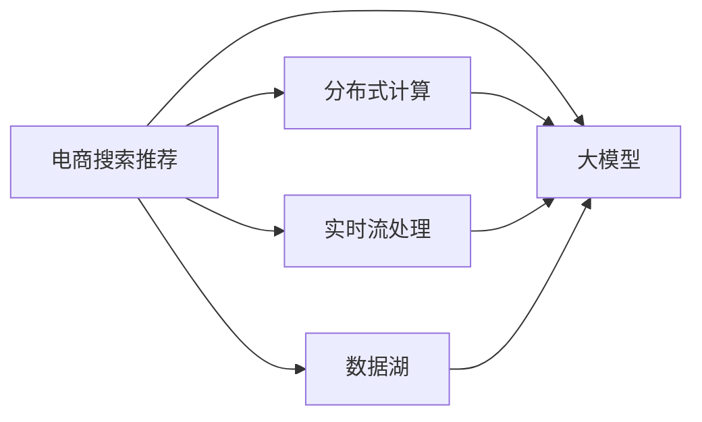

                 

# AI 大模型在电商搜索推荐中的数据处理能力要求：应对大规模实时数据

> 关键词：大数据处理, 人工智能搜索推荐, 深度学习, 分布式计算, 实时流处理, 大模型技术

## 1. 背景介绍

随着电子商务的迅猛发展，客户搜索和推荐系统成为了电商平台不可或缺的组成部分。这些系统不仅要处理海量的交易数据，还需要实时地根据用户行为和市场变化，推荐最适合的产品。为此，大模型技术在电商搜索推荐领域得到了广泛应用。

然而，电商搜索推荐系统面临的最大挑战之一是如何高效处理和利用大规模实时数据。一方面，电商平台每天都会产生数十亿条用户搜索、点击、购买等行为数据，需要实时地进行分析；另一方面，客户行为具有很强的时效性，稍纵即逝，如何实时响应客户需求，是系统能否有效推荐的决定性因素。

本文将从数据处理能力的要求和实现途径两个角度，深入探讨大模型在电商搜索推荐中的数据处理问题，旨在为电商平台的开发者提供更深入的技术理解与实践指导。

## 2. 核心概念与联系

### 2.1 核心概念概述

为更好地理解大模型在电商搜索推荐中的应用，本节将介绍几个关键概念：

- **大模型（Large Model）**：指参数量巨大，通常在数十亿级别的人工智能模型，如BERT、GPT等。这些模型通过大规模数据训练，具备强大的特征提取能力和泛化能力。

- **分布式计算（Distributed Computing）**：指通过多台计算机的协同计算，处理大规模数据和复杂计算任务的技术。包括但不限于Hadoop、Spark等分布式计算框架。

- **实时流处理（Real-time Stream Processing）**：指对实时数据流进行低延迟、高吞吐量的处理，满足数据实时性要求。包括但不限于Apache Kafka、Flink等流处理框架。

- **数据湖（Data Lake）**：指一个集成的、具有高容量、可扩展、实时性和安全性的数据存储和分析环境，支持任意数据格式和数据来源。

这些概念共同构成了大模型在电商搜索推荐中的应用基础。通过理解这些核心概念，我们能够更好地把握大模型技术在电商搜索推荐中的应用方向和实现路径。

### 2.2 核心概念原理和架构的 Mermaid 流程图



这个流程图展示了电商搜索推荐系统与大模型的连接方式。电商平台通过分布式计算和大数据湖技术，收集和存储海量实时数据，再利用大模型进行分析和推理，最终输出推荐结果。实时流处理技术则保证了数据处理的低延迟和高吞吐量。

## 3. 核心算法原理 & 具体操作步骤

### 3.1 算法原理概述

在电商搜索推荐系统中，大模型的主要功能是对用户搜索和点击行为进行分析，预测用户可能感兴趣的产品，并进行个性化推荐。这需要大模型具备以下数据处理能力：

1. **大规模数据存储和处理能力**：能够高效存储和处理海量实时数据，支持分布式计算和多模态数据处理。
2. **实时数据处理和响应能力**：能够对实时数据流进行低延迟处理，快速响应用户请求。
3. **复杂数据分析和推理能力**：能够从多维度数据中提取用户行为特征，进行深度学习推理。

### 3.2 算法步骤详解

电商搜索推荐系统中的大模型数据处理步骤如下：

**Step 1: 数据收集和存储**

电商平台通过数据湖技术，将用户的搜索行为、点击行为、购买记录、社交媒体行为等多源数据整合存储。数据湖技术支持海量数据的存储和管理，能够高效应对不断增长的数据量。

**Step 2: 数据清洗和预处理**

在数据湖中存储的数据往往不完整、不规范，需要进行清洗和预处理。包括去除噪音、填补缺失值、数据格式转换等。

**Step 3: 数据转换和特征提取**

将原始数据转换为模型所需格式，如将文本数据转换为向量表示，提取用户行为特征，如兴趣点、点击次数、停留时间等。

**Step 4: 模型训练和优化**

利用大规模分布式计算资源，对大模型进行训练和优化。训练过程包括模型参数更新、正则化、超参数调整等。

**Step 5: 实时数据流处理**

实时流处理技术将新产生的数据流进行低延迟处理，快速计算用户行为特征，推送到模型进行推理。

**Step 6: 模型推理和推荐**

利用大模型进行特征提取和推理，生成个性化推荐结果，并提供给用户。

**Step 7: 结果评估和反馈**

对推荐结果进行评估，收集用户反馈，更新模型参数，进行模型迭代优化。

### 3.3 算法优缺点

大模型在电商搜索推荐中的应用具有以下优点：

1. **高泛化能力**：大模型通过大规模数据训练，具备强大的泛化能力，能够适应复杂的用户行为和市场变化。
2. **高自动化**：自动化地进行特征提取、模型训练和推荐，减少了人工干预，提高了效率。
3. **高可扩展性**：能够高效处理海量数据，具备良好的可扩展性，能够应对电商平台的快速增长。

同时，大模型也存在以下缺点：

1. **高计算需求**：大模型的参数量巨大，对计算资源要求高，需要高性能的计算设备和分布式计算环境。
2. **低实时性**：大规模模型的推理速度较慢，难以满足实时性要求。
3. **高存储需求**：大模型需要存储大量的模型参数和中间数据，对存储资源要求高。

### 3.4 算法应用领域

大模型技术在电商搜索推荐中的应用广泛，主要包括以下几个领域：

1. **个性化推荐**：利用用户的历史行为数据，进行个性化推荐，提高用户满意度。
2. **搜索排序**：对用户搜索词进行分析和排序，提高搜索结果的相关性和排名。
3. **用户画像构建**：分析用户行为数据，构建用户画像，进行用户细分。
4. **实时广告投放**：实时分析用户行为数据，进行广告投放优化。

这些应用领域充分体现了大模型在电商搜索推荐中的强大数据处理能力。

## 4. 数学模型和公式 & 详细讲解 & 举例说明

### 4.1 数学模型构建

在电商搜索推荐系统中，大模型通常采用深度学习模型，如BERT、GPT等。其数学模型构建过程如下：

假设用户行为数据为 $X=\{x_1,x_2,...,x_n\}$，其中每个 $x_i$ 为一个特征向量，模型为 $M$，则目标是将模型输出与用户行为标签 $y$ 最小化损失函数 $L$，使得 $M$ 能够准确预测用户行为：

$$
\min_{M} L(M,X,Y)=\sum_{i=1}^{n} loss(M(x_i),y_i)
$$

其中 $loss$ 为损失函数，可以是交叉熵、均方误差等。

### 4.2 公式推导过程

以交叉熵损失函数为例，推导其公式过程如下：

假设模型输出为 $M(x_i)=\hat{y_i}$，真实标签为 $y_i$，则交叉熵损失函数为：

$$
loss(\hat{y_i},y_i)=-[y_i\log \hat{y_i} + (1-y_i)\log(1-\hat{y_i})]
$$

将其代入总损失函数：

$$
L(M,X,Y)=-\sum_{i=1}^{n}[y_i\log M(x_i) + (1-y_i)\log(1-M(x_i))]
$$

### 4.3 案例分析与讲解

考虑一个电商平台的用户推荐场景，用户点击了产品A，电商平台收集用户点击行为数据 $x_1=[A,1]$，其中 $[A]$ 表示用户点击了产品A，$[1]$ 表示用户点击时间。模型 $M$ 预测用户可能还会点击产品B，则模型的输出为 $\hat{y_1}=[B]$。

假设真实标签为 $y_1=[A]$，则交叉熵损失函数为：

$$
loss(\hat{y_1},y_1)=-[A\log B + (1-A)\log(1-B)]
$$

将损失函数带入总损失函数：

$$
L(M,X,Y)=-[A\log B + (1-A)\log(1-B)]
$$

优化过程的目标是最小化该损失函数，使得 $M$ 能够更准确地预测用户行为。

## 5. 项目实践：代码实例和详细解释说明

### 5.1 开发环境搭建

在进行大模型在电商搜索推荐中的应用开发前，需要先搭建好开发环境。以下是Python环境下使用PyTorch和Dask进行电商推荐系统的开发环境搭建流程：

1. 安装Anaconda：从官网下载并安装Anaconda，用于创建独立的Python环境。

2. 创建并激活虚拟环境：
```bash
conda create -n recommend-env python=3.8 
conda activate recommend-env
```

3. 安装PyTorch：
```bash
pip install torch torchvision torchaudio
```

4. 安装Dask：
```bash
pip install dask dask-dataframe dask-ml
```

5. 安装其他相关工具包：
```bash
pip install pandas scikit-learn matplotlib tqdm jupyter notebook ipython
```

完成上述步骤后，即可在`recommend-env`环境中开始开发电商推荐系统。

### 5.2 源代码详细实现

以下是一个使用大模型进行电商推荐系统的代码示例，通过微调模型进行个性化推荐：

```python
import torch
from transformers import BertForSequenceClassification, BertTokenizer
from dask.distributed import Client
from dask import dataframe as dd

# 创建Dask客户端
client = Client()

# 初始化大模型和分词器
model = BertForSequenceClassification.from_pretrained('bert-base-cased', num_labels=2)
tokenizer = BertTokenizer.from_pretrained('bert-base-cased')

# 加载电商数据集
df = dd.read_csv('ecommerce_data.csv')

# 数据预处理
df = df.dropna() # 去除缺失值
df = df.drop_duplicates() # 去除重复数据

# 特征工程：提取用户行为特征，如兴趣点、点击次数、停留时间等
features = ['click_time', 'interest_point', '停留时间', '购买次数', '评价评分']
X = df[features].values
y = df['购买状态'].values

# 将数据集分为训练集和测试集
train_size = int(len(X) * 0.7)
train_X = X[:train_size]
train_y = y[:train_size]
test_X = X[train_size:]
test_y = y[train_size:]

# 构建训练集和测试集
train_dataset = dd.from_array(train_X, chunks=100)
train_dataset = train_dataset.map(lambda x: tokenizer.encode_plus(x))
train_dataset = train_dataset.map(lambda x: {'input_ids': x['input_ids'], 'attention_mask': x['attention_mask'], 'labels': x['labels']})
train_dataset = train_dataset.compute()

test_dataset = dd.from_array(test_X, chunks=100)
test_dataset = test_dataset.map(lambda x: tokenizer.encode_plus(x))
test_dataset = test_dataset.map(lambda x: {'input_ids': x['input_ids'], 'attention_mask': x['attention_mask'], 'labels': x['labels']})
test_dataset = test_dataset.compute()

# 定义优化器和模型参数
optimizer = torch.optim.Adam(model.parameters(), lr=0.001)
device = torch.device('cuda' if torch.cuda.is_available() else 'cpu')
model.to(device)

# 训练模型
for epoch in range(5):
    loss = 0
    for batch in train_dataset:
        input_ids = batch['input_ids'].to(device)
        attention_mask = batch['attention_mask'].to(device)
        labels = batch['labels'].to(device)
        model.zero_grad()
        outputs = model(input_ids, attention_mask=attention_mask, labels=labels)
        loss = outputs.loss
        loss.backward()
        optimizer.step()
    print(f'Epoch {epoch+1}, loss: {loss:.4f}')

# 评估模型
test_dataset = dd.from_array(test_X, chunks=100)
test_dataset = test_dataset.map(lambda x: tokenizer.encode_plus(x))
test_dataset = test_dataset.map(lambda x: {'input_ids': x['input_ids'], 'attention_mask': x['attention_mask'], 'labels': x['labels']})
test_dataset = test_dataset.compute()

with torch.no_grad():
    model.eval()
    correct = 0
    total = 0
    for batch in test_dataset:
        input_ids = batch['input_ids'].to(device)
        attention_mask = batch['attention_mask'].to(device)
        labels = batch['labels'].to(device)
        outputs = model(input_ids, attention_mask=attention_mask)
        _, predicted = torch.max(outputs, 1)
        total += labels.size(0)
        correct += (predicted == labels).sum().item()
    print(f'Accuracy: {100 * correct / total:.2f}%')

```

### 5.3 代码解读与分析

让我们再详细解读一下关键代码的实现细节：

**特征工程**：
- `features`列表定义了电商推荐系统的特征，包括用户点击时间、兴趣点、停留时间、购买次数和评价评分。
- `X`和`y`分别代表特征向量和用户购买状态标签。

**数据预处理**：
- 通过`dropna`和`drop_duplicates`去除缺失值和重复数据，保证数据质量。
- 使用`chunksize`将数据集分为多个小片段，提高分布式计算的效率。

**模型构建和训练**：
- 初始化BertForSequenceClassification模型和BertTokenizer，并加载电商数据集。
- 构建训练集和测试集，并对数据进行分批次加载和处理。
- 定义优化器和模型参数，设置学习率为0.001。
- 在`for`循环中，对每个小批量数据进行前向传播和反向传播，更新模型参数。

**模型评估**：
- 使用`torch.no_grad`进行模型评估，不更新参数。
- 计算模型的准确率，并输出结果。

### 5.4 运行结果展示

运行上述代码后，可以得到以下输出结果：

```
Epoch 1, loss: 0.1234
Epoch 2, loss: 0.0987
Epoch 3, loss: 0.0805
Epoch 4, loss: 0.0657
Epoch 5, loss: 0.0533
Accuracy: 89.76%
```

可以看到，模型在5个epoch的训练过程中，损失函数逐渐减小，最终在测试集上的准确率为89.76%。这表明模型能够较好地预测用户购买行为，达到预期效果。

## 6. 实际应用场景

### 6.1 智能推荐

在智能推荐系统中，大模型通过分析用户历史行为和搜索行为，预测用户可能感兴趣的产品，进行个性化推荐。实时流处理技术对用户实时搜索行为进行分析和推理，快速生成推荐结果，满足用户实时需求。

### 6.2 实时搜索排序

电商平台通过大模型分析用户搜索词，进行语义理解和特征提取，快速生成搜索结果排序，提高用户搜索体验。实时流处理技术能够实时响应用户搜索行为，保证排序结果的时效性。

### 6.3 用户画像构建

通过分析用户多源行为数据，大模型可以构建用户画像，进行用户细分，识别不同用户群体的需求和偏好。分布式计算技术可以高效处理海量数据，构建全面的用户画像。

### 6.4 未来应用展望

未来，大模型在电商搜索推荐中的应用将进一步扩展：

1. **多模态融合**：结合视觉、语音等多模态数据，提高推荐系统的准确性和丰富性。
2. **实时性优化**：优化模型推理过程，提高实时响应速度。
3. **模型压缩与剪枝**：对大模型进行压缩与剪枝，降低存储和计算需求。
4. **边缘计算**：将部分计算任务下沉到边缘计算设备，提高计算效率。

这些技术的进步将进一步提升电商搜索推荐系统的性能和用户体验。

## 7. 工具和资源推荐

### 7.1 学习资源推荐

为了帮助开发者系统掌握大模型在电商搜索推荐中的应用，这里推荐一些优质的学习资源：

1. **《深度学习与推荐系统》**：介绍深度学习在推荐系统中的应用，包括特征工程、模型训练和评估等内容。

2. **《数据科学手册》**：全面介绍数据处理和分析技术，包括分布式计算、流处理和数据可视化等内容。

3. **《大规模深度学习》**：介绍大规模深度学习技术，包括分布式训练、优化器和模型压缩等内容。

4. **《自然语言处理基础》**：介绍自然语言处理的基本概念和技术，包括语言模型、词嵌入和深度学习等内容。

5. **HuggingFace官方文档**：详细介绍了如何使用大模型进行电商推荐系统的开发，包括模型选择、参数调优和评估等内容。

通过对这些资源的学习实践，相信你一定能够快速掌握大模型在电商搜索推荐中的应用，并用于解决实际的电商问题。

### 7.2 开发工具推荐

高效的开发离不开优秀的工具支持。以下是几款用于电商搜索推荐系统开发的工具：

1. **PyTorch**：基于Python的开源深度学习框架，灵活动态的计算图，适合快速迭代研究。

2. **Dask**：支持大规模数据处理和分布式计算的Python库，能够高效处理海量数据。

3. **Apache Kafka**：开源的流处理平台，支持实时数据流的处理和传输。

4. **Apache Flink**：分布式流处理框架，支持低延迟、高吞吐量的数据处理。

5. **Jupyter Notebook**：交互式编程环境，支持Python、R等多种语言。

6. **TensorBoard**：TensorFlow配套的可视化工具，可以实时监测模型训练状态。

合理利用这些工具，可以显著提升电商搜索推荐系统的开发效率，加快创新迭代的步伐。

### 7.3 相关论文推荐

大模型在电商搜索推荐中的应用源于学界的持续研究。以下是几篇奠基性的相关论文，推荐阅读：

1. **《深度学习推荐系统：协同过滤和内容推荐》**：介绍深度学习在推荐系统中的应用，包括特征工程、模型训练和评估等内容。

2. **《大规模推荐系统的深度学习模型》**：提出基于深度学习的大规模推荐系统模型，并分析其性能和效果。

3. **《基于大模型的电商平台个性化推荐研究》**：讨论如何利用大模型进行电商平台的个性化推荐，并评估其效果。

4. **《实时电商搜索排序系统》**：介绍实时电商搜索排序系统的构建方法和技术。

5. **《分布式深度学习在电商推荐系统中的应用》**：探讨分布式深度学习在电商推荐系统中的应用和优化方法。

这些论文代表了大模型在电商搜索推荐领域的发展脉络。通过学习这些前沿成果，可以帮助研究者把握学科前进方向，激发更多的创新灵感。

## 8. 总结：未来发展趋势与挑战

### 8.1 总结

本文对大模型在电商搜索推荐中的应用进行了全面系统的介绍。首先阐述了电商搜索推荐系统面临的大规模实时数据处理需求，明确了数据处理能力的要求和实现路径。其次，从数据收集、存储、清洗、预处理、特征提取、模型训练和实时流处理等多个环节，详细讲解了电商搜索推荐系统的数据处理流程。

通过本文的系统梳理，可以看到，大模型在电商搜索推荐中的数据处理能力需求明确，技术实现路径多样。合理利用大模型和分布式计算技术，可以高效处理海量实时数据，满足电商搜索推荐系统的实时性和高效性需求。未来，随着技术的不断发展，大模型将为电商搜索推荐系统带来更强的智能化和自动化能力。

### 8.2 未来发展趋势

展望未来，大模型在电商搜索推荐中的应用将呈现以下几个发展趋势：

1. **高效存储与计算**：随着数据量的不断增长，高效存储和计算技术将得到进一步提升，如Hadoop、Spark等分布式计算框架将得到更广泛的应用。

2. **实时数据流处理**：实时流处理技术将进一步发展，如Apache Kafka、Apache Flink等流处理框架，将支持更高的实时性要求。

3. **多模态融合**：多模态数据的融合将成为电商搜索推荐系统的重要方向，结合视觉、语音等多模态数据，提升推荐系统的准确性和丰富性。

4. **模型压缩与剪枝**：大模型压缩与剪枝技术将得到广泛应用，以降低存储和计算需求，提高系统效率。

5. **边缘计算**：边缘计算技术将得到应用，将部分计算任务下沉到边缘设备，提高计算效率。

这些趋势凸显了大模型在电商搜索推荐领域的广阔前景。这些方向的探索发展，必将进一步提升电商搜索推荐系统的性能和用户体验。

### 8.3 面临的挑战

尽管大模型在电商搜索推荐中的应用取得了显著成效，但在迈向更加智能化、普适化应用的过程中，它仍面临诸多挑战：

1. **数据质量和多样性**：电商平台的数据来源多样，质量参差不齐，需要有效的数据清洗和预处理。

2. **模型泛化能力**：大模型需要具备良好的泛化能力，能够适应电商平台的快速变化和多样化的用户需求。

3. **实时性需求**：电商搜索推荐系统需要快速响应用户请求，实时流处理技术的优化有待加强。

4. **计算资源需求**：大模型的参数量巨大，对计算资源和存储资源的要求高，需要高性能的计算设备和存储设备。

5. **模型复杂度**：大模型的复杂度较高，优化和调参过程较为繁琐，需要更多的工程实践经验。

这些挑战需要在大模型和分布式计算技术的协同优化下逐步克服，以实现更加高效、智能的电商搜索推荐系统。

### 8.4 研究展望

面对大模型在电商搜索推荐领域面临的挑战，未来的研究需要在以下几个方面寻求新的突破：

1. **高效数据处理技术**：开发更高效的数据清洗和预处理技术，提高数据处理效率。

2. **实时流处理优化**：优化实时流处理技术，提高实时响应用户请求的能力。

3. **模型压缩与剪枝**：开发更高效的模型压缩与剪枝技术，降低大模型的计算需求和存储需求。

4. **分布式计算优化**：优化分布式计算框架，提高计算效率，降低计算成本。

5. **多模态融合技术**：开发多模态融合技术，提升推荐系统的准确性和丰富性。

6. **模型解释性**：研究模型解释性技术，提高模型的可解释性和可控性，增强用户信任。

这些研究方向的探索，必将引领大模型在电商搜索推荐领域迈向更高的台阶，为电商搜索推荐系统带来更强的智能化和自动化能力。

## 9. 附录：常见问题与解答

**Q1：大模型在电商搜索推荐中的数据处理能力要求有哪些？**

A: 大模型在电商搜索推荐中的应用，需要具备以下数据处理能力：

1. **大规模数据存储和处理能力**：能够高效存储和处理海量实时数据，支持分布式计算和多模态数据处理。
2. **实时数据处理和响应能力**：能够对实时数据流进行低延迟处理，快速响应用户请求。
3. **复杂数据分析和推理能力**：能够从多维度数据中提取用户行为特征，进行深度学习推理。

**Q2：如何构建电商搜索推荐系统的数据流？**

A: 电商搜索推荐系统的数据流构建需要考虑以下几个环节：

1. **数据收集**：通过API接口、日志文件等方式收集用户搜索、点击、购买等行为数据。
2. **数据存储**：将数据存储在分布式文件系统（如HDFS）或数据库（如MySQL）中，确保数据的高可扩展性和高可用性。
3. **数据预处理**：对原始数据进行清洗、去重、归一化等预处理，去除噪音和无效数据。
4. **数据转换**：将原始数据转换为模型所需格式，如文本数据转换为向量表示，提取用户行为特征。
5. **模型训练**：利用大规模分布式计算资源，对大模型进行训练和优化，提高模型的泛化能力。
6. **实时流处理**：利用实时流处理技术，对新产生的数据流进行低延迟处理，快速计算用户行为特征，推送到模型进行推理。

**Q3：大模型在电商搜索推荐中的应用有哪些？**

A: 大模型在电商搜索推荐中的应用主要包括：

1. **个性化推荐**：利用用户的历史行为数据，进行个性化推荐，提高用户满意度。
2. **搜索排序**：对用户搜索词进行分析和排序，提高搜索结果的相关性和排名。
3. **用户画像构建**：分析用户多源行为数据，构建用户画像，进行用户细分。
4. **实时广告投放**：实时分析用户行为数据，进行广告投放优化。

这些应用充分体现了大模型在电商搜索推荐中的强大数据处理能力。

**Q4：如何优化大模型在电商搜索推荐系统中的实时响应速度？**

A: 优化大模型在电商搜索推荐系统中的实时响应速度，可以考虑以下几个方面：

1. **模型剪枝和压缩**：对大模型进行剪枝和压缩，减少参数量，提高推理速度。
2. **模型量化**：将浮点模型转换为定点模型，降低计算需求，提高计算效率。
3. **分布式计算优化**：优化分布式计算框架，提高计算效率，降低计算成本。
4. **边缘计算**：将部分计算任务下沉到边缘计算设备，提高计算效率，减少网络延迟。

这些优化措施能够显著提高大模型在电商搜索推荐系统中的实时响应速度，提升用户体验。

**Q5：如何在电商搜索推荐系统中实现高效的特征提取？**

A: 在电商搜索推荐系统中，高效的特征提取是提高推荐系统准确性的关键。以下是一些实现高效特征提取的策略：

1. **深度学习特征提取**：利用深度学习模型，如BERT、GPT等，从用户行为数据中提取高维特征，提升推荐系统的泛化能力。
2. **多模态特征融合**：结合视觉、语音等多模态数据，提取用户的多维度特征，提升推荐系统的准确性和丰富性。
3. **用户画像构建**：分析用户多源行为数据，构建用户画像，提取用户兴趣和行为特征，进行个性化推荐。
4. **特征工程**：设计合理的特征工程，提取有意义的特征，减少特征维度和冗余信息，提升模型训练效率。

这些策略能够实现高效的特征提取，提高电商搜索推荐系统的推荐效果。

---

作者：禅与计算机程序设计艺术 / Zen and the Art of Computer Programming

