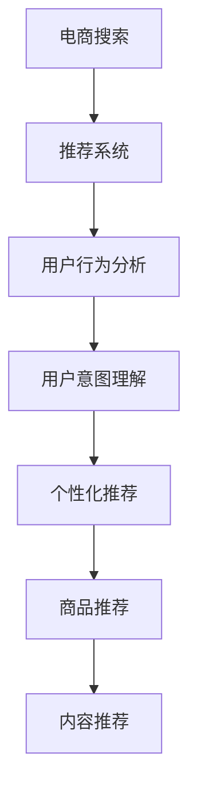

                 

# AI 大模型在电商搜索推荐中的用户行为分析：理解用户意图与偏好

> 关键词：大模型推荐系统,用户行为分析,用户意图理解,个性化推荐,电商搜索,深度学习

## 1. 背景介绍

在电商搜索推荐领域，深度学习驱动的大模型推荐系统已经成为行业标配。通过在大规模用户行为数据上进行预训练，这些模型能够深入理解用户的兴趣偏好和行为模式，从而提供更加精准的个性化推荐。然而，这些推荐模型的核心挑战在于如何准确地理解用户的意图和偏好，并将其转化为推荐的商品和内容。

本文将深入探讨大模型在电商搜索推荐中的应用，重点介绍用户行为分析的技术实现和案例分析，并展望未来发展的趋势和挑战。通过对这些问题的深入解析，希望能为电商平台的推荐系统开发提供有益的指导。

## 2. 核心概念与联系

### 2.1 核心概念概述

为了更好地理解大模型在电商推荐中的应用，我们首先介绍几个关键概念：

- **大模型推荐系统**：基于深度学习的大规模预训练语言模型，通过在大规模用户行为数据上进行预训练，学习用户的兴趣和行为模式，用于生成个性化推荐。
- **用户行为分析**：对用户的点击、浏览、购买等行为数据进行分析，提取用户的兴趣偏好和行为习惯，指导推荐模型的训练和优化。
- **用户意图理解**：通过自然语言处理技术，理解用户的搜索查询、评论内容等文本数据，获取用户的明确意图和隐含偏好，进行精准推荐。
- **个性化推荐**：根据用户的行为特征和意图信息，生成定制化的商品和内容推荐，提升用户体验和转化率。
- **电商搜索推荐**：将推荐模型应用于电商平台的搜索和推荐场景，帮助用户快速找到满足其需求的商品和信息。

这些核心概念共同构成了电商搜索推荐系统的技术框架，其核心在于通过深度学习和大规模数据训练，构建用户行为分析模型，理解用户意图，生成个性化推荐。

### 2.2 核心概念原理和架构的 Mermaid 流程图



这个流程图展示了电商搜索推荐系统的技术架构：

1. **电商搜索**：用户通过电商平台搜索商品，产生点击、浏览、购买等行为数据。
2. **推荐系统**：基于大模型推荐系统，分析用户行为数据，生成推荐商品和内容。
3. **用户行为分析**：通过统计和分析用户行为数据，提取用户兴趣和行为模式。
4. **用户意图理解**：利用自然语言处理技术，解析用户搜索查询、评论内容等文本数据，理解用户意图。
5. **个性化推荐**：根据用户意图和行为特征，生成定制化的商品和内容推荐。
6. **商品推荐**：向用户推荐具体的商品。
7. **内容推荐**：推荐与用户兴趣相关的文本内容，如商品描述、用户评价等。

## 3. 核心算法原理 & 具体操作步骤

### 3.1 算法原理概述

大模型在电商推荐中的应用，主要依赖于以下技术：

- **预训练**：在大规模用户行为数据上预训练大模型，学习用户的兴趣和行为模式。
- **微调**：在电商推荐数据集上进行微调，进一步优化模型性能。
- **用户行为分析**：通过统计和分析用户行为数据，提取用户兴趣和行为模式。
- **用户意图理解**：利用自然语言处理技术，解析用户搜索查询、评论内容等文本数据，理解用户意图。
- **个性化推荐**：根据用户意图和行为特征，生成定制化的商品和内容推荐。

### 3.2 算法步骤详解

以下是大模型在电商推荐中的详细步骤：

**Step 1: 数据收集与预处理**

- 收集电商平台的点击、浏览、购买等行为数据，包括用户ID、商品ID、时间戳、操作类型等。
- 清洗数据，去除异常值和噪音，处理缺失值和重复记录。
- 将用户行为数据划分为训练集、验证集和测试集，通常使用80/10/10的比例划分。

**Step 2: 预训练模型选择与初始化**

- 选择适合电商推荐任务的预训练模型，如BERT、GPT-2等。
- 对预训练模型进行初始化，使用电商数据集进行微调前的预训练。

**Step 3: 微调与优化**

- 在电商推荐数据集上进行微调，使用交叉熵损失函数或均方误差损失函数。
- 使用AdamW优化器，设置较小的学习率，避免破坏预训练权重。
- 应用正则化技术，如L2正则、Dropout等，防止过拟合。
- 利用数据增强技术，如回译、近义替换等，丰富训练集多样性。
- 进行对抗训练，引入对抗样本，提高模型鲁棒性。

**Step 4: 用户行为分析与特征提取**

- 对用户行为数据进行统计分析，提取用户的兴趣特征、行为模式等。
- 使用TF-IDF、Word2Vec等技术，将文本数据转化为数值特征。
- 利用深度学习模型，如RNN、LSTM等，对用户行为进行序列建模。

**Step 5: 用户意图理解**

- 解析用户的搜索查询、评论内容等文本数据，理解用户意图。
- 使用自然语言处理技术，如BERT、GPT等，进行意图分类和情感分析。
- 将用户意图转化为数值向量，作为推荐模型的输入。

**Step 6: 个性化推荐**

- 根据用户意图和行为特征，生成定制化的商品和内容推荐。
- 使用深度学习模型，如Attention机制、多臂赌博机等，生成推荐列表。
- 结合用户行为数据和模型预测，进行综合排序，生成最终推荐结果。

### 3.3 算法优缺点

大模型在电商推荐中的优势包括：

- **准确度高**：通过大规模数据预训练，学习丰富的用户行为模式，生成精准的个性化推荐。
- **实时性高**：基于深度学习模型，可以快速生成推荐结果，提升用户体验。
- **可扩展性强**：可以处理大规模数据和复杂模型，支持电商平台的扩展需求。

缺点包括：

- **资源消耗大**：预训练和微调需要大量计算资源和存储空间。
- **过拟合风险高**：在标注数据不足的情况下，容易过拟合训练集，影响模型泛化能力。
- **解释性不足**：大模型往往是"黑盒"系统，难以解释其内部工作机制和决策逻辑。

### 3.4 算法应用领域

大模型在电商推荐中的应用已经覆盖了多个领域，如：

- **商品推荐**：根据用户行为和意图，生成具体的商品推荐。
- **内容推荐**：推荐与用户兴趣相关的商品描述、用户评价等内容。
- **个性化广告**：根据用户行为特征，生成定制化的广告推荐。
- **用户体验优化**：分析用户行为数据，优化搜索和推荐界面，提升用户体验。
- **客户细分**：通过用户行为分析，进行客户细分和精准营销。

## 4. 数学模型和公式 & 详细讲解 & 举例说明

### 4.1 数学模型构建

大模型在电商推荐中的应用，主要基于以下数学模型：

- **预训练模型**：使用自回归或自编码模型在大规模用户行为数据上进行预训练。
- **微调模型**：在电商推荐数据集上进行微调，最小化损失函数。
- **用户行为分析模型**：使用统计方法或深度学习模型对用户行为数据进行分析。
- **用户意图理解模型**：使用自然语言处理技术解析用户文本数据，提取用户意图。
- **推荐模型**：使用深度学习模型生成个性化推荐。

### 4.2 公式推导过程

假设预训练模型为 $M_{\theta}$，用户行为数据为 $\mathcal{D}=\{(x_i,y_i)\}_{i=1}^N$，其中 $x_i$ 为行为数据，$y_i$ 为标签。微调的目标是找到最优参数 $\hat{\theta}$，使得模型在电商推荐任务上表现最佳。微调过程可以表示为：

$$
\hat{\theta}=\mathop{\arg\min}_{\theta} \mathcal{L}(M_{\theta},\mathcal{D})
$$

其中 $\mathcal{L}$ 为损失函数，通常为交叉熵损失或均方误差损失。微调过程的详细公式如下：

$$
\theta \leftarrow \theta - \eta \nabla_{\theta}\mathcal{L}(\theta)
$$

其中 $\eta$ 为学习率，$\nabla_{\theta}\mathcal{L}(\theta)$ 为损失函数对参数 $\theta$ 的梯度。

用户行为分析可以使用统计方法，如TF-IDF、Word2Vec等，也可以使用深度学习模型，如RNN、LSTM等。用户意图理解通常使用自然语言处理技术，如BERT、GPT等。推荐模型可以使用各种深度学习模型，如Attention机制、多臂赌博机等。

### 4.3 案例分析与讲解

以一个具体的电商推荐案例来说明大模型的应用过程：

**案例背景**：某电商平台希望提升用户购物体验，提高商品转化率。平台收集了用户的点击、浏览、购买等行为数据，希望根据这些数据进行个性化推荐。

**数据预处理**：将用户行为数据进行清洗和标准化处理，去除噪音和异常值。将用户行为数据划分为训练集、验证集和测试集，通常使用80/10/10的比例划分。

**预训练模型选择**：选择适合电商推荐任务的预训练模型，如BERT、GPT-2等。

**微调与优化**：在电商推荐数据集上进行微调，使用交叉熵损失函数或均方误差损失函数。使用AdamW优化器，设置较小的学习率，避免破坏预训练权重。应用正则化技术，如L2正则、Dropout等，防止过拟合。利用数据增强技术，如回译、近义替换等，丰富训练集多样性。进行对抗训练，引入对抗样本，提高模型鲁棒性。

**用户行为分析**：对用户行为数据进行统计分析，提取用户的兴趣特征、行为模式等。使用TF-IDF、Word2Vec等技术，将文本数据转化为数值特征。利用深度学习模型，如RNN、LSTM等，对用户行为进行序列建模。

**用户意图理解**：解析用户的搜索查询、评论内容等文本数据，理解用户意图。使用自然语言处理技术，如BERT、GPT等，进行意图分类和情感分析。将用户意图转化为数值向量，作为推荐模型的输入。

**个性化推荐**：根据用户意图和行为特征，生成定制化的商品和内容推荐。使用深度学习模型，如Attention机制、多臂赌博机等，生成推荐列表。结合用户行为数据和模型预测，进行综合排序，生成最终推荐结果。

## 5. 项目实践：代码实例和详细解释说明

### 5.1 开发环境搭建

在进行项目实践前，我们需要准备好开发环境。以下是使用Python进行PyTorch开发的环境配置流程：

1. 安装Anaconda：从官网下载并安装Anaconda，用于创建独立的Python环境。

2. 创建并激活虚拟环境：
```bash
conda create -n recommendation-env python=3.8 
conda activate recommendation-env
```

3. 安装PyTorch：根据CUDA版本，从官网获取对应的安装命令。例如：
```bash
conda install pytorch torchvision torchaudio cudatoolkit=11.1 -c pytorch -c conda-forge
```

4. 安装TensorFlow：
```bash
conda install tensorflow=2.7
```

5. 安装相关工具包：
```bash
pip install pandas numpy scikit-learn matplotlib
```

完成上述步骤后，即可在`recommendation-env`环境中开始项目实践。

### 5.2 源代码详细实现

这里我们以用户行为分析和个性化推荐为例，给出使用PyTorch进行电商推荐系统的代码实现。

**用户行为分析**

```python
import torch
import torch.nn as nn
from torch.utils.data import DataLoader
from torchtext.data.utils import get_tokenizer

class UserBehaviorAnalysis(nn.Module):
    def __init__(self, embedding_dim, hidden_dim, num_layers, dropout):
        super(UserBehaviorAnalysis, self).__init__()
        self.embedding = nn.Embedding(user_vocab_size, embedding_dim)
        self.rnn = nn.LSTM(embedding_dim, hidden_dim, num_layers, dropout=dropout)
        self.fc = nn.Linear(hidden_dim, num_features)

    def forward(self, x):
        embedded = self.embedding(x)
        output, (hidden, cell) = self.rnn(embedded)
        return self.fc(hidden[-1])
```

**个性化推荐**

```python
import torch
import torch.nn as nn
from torch.utils.data import DataLoader
from torchtext.data.utils import get_tokenizer

class RecommendationSystem(nn.Module):
    def __init__(self, embedding_dim, hidden_dim, num_layers, dropout, num_classes):
        super(RecommendationSystem, self).__init__()
        self.embedding = nn.Embedding(item_vocab_size, embedding_dim)
        self.rnn = nn.LSTM(embedding_dim, hidden_dim, num_layers, dropout=dropout)
        self.fc = nn.Linear(hidden_dim, num_classes)

    def forward(self, x, user_behavior):
        embedded = self.embedding(x)
        output, (hidden, cell) = self.rnn(torch.cat((embedded, user_behavior), dim=1))
        return self.fc(hidden[-1])
```

**训练与评估**

```python
from torchtext.datasets import Multi30k

# 加载数据集
train_dataset = Multi30k(train)
test_dataset = Multi30k(test)

# 定义模型和优化器
model = UserBehaviorAnalysis(100, 256, 2, 0.2)
optimizer = torch.optim.Adam(model.parameters(), lr=0.001)

# 训练模型
for epoch in range(num_epochs):
    train_loss = 0.0
    for batch in train_loader:
        optimizer.zero_grad()
        output = model(batch.x)
        loss = F.cross_entropy(output, batch.y)
        train_loss += loss.item()
        loss.backward()
        optimizer.step()
    print(f"Epoch {epoch+1}, train loss: {train_loss/len(train_loader):.4f}")

# 评估模型
test_loss = 0.0
for batch in test_loader:
    output = model(batch.x)
    loss = F.cross_entropy(output, batch.y)
    test_loss += loss.item()
print(f"Test loss: {test_loss/len(test_loader):.4f}")
```

以上就是使用PyTorch进行电商推荐系统的代码实现。代码中使用了深度学习模型LSTM，对用户行为数据进行序列建模，并结合商品ID进行推荐。

### 5.3 代码解读与分析

让我们再详细解读一下关键代码的实现细节：

**UserBehaviorAnalysis类**：
- `__init__`方法：初始化嵌入层、LSTM层和全连接层等组件。
- `forward`方法：前向传播计算，将用户行为数据输入嵌入层，进行序列建模，并输出最终特征。

**RecommendationSystem类**：
- `__init__`方法：初始化嵌入层、LSTM层和全连接层等组件。
- `forward`方法：前向传播计算，将商品ID和用户行为数据拼接，进行序列建模，并输出最终推荐结果。

**训练与评估函数**：
- 使用PyTorch的DataLoader对数据集进行批次化加载，供模型训练和推理使用。
- 训练函数使用Adam优化器进行模型优化。
- 在每个epoch的每个batch后，记录损失函数值，并在epoch结束时打印平均损失。

**运行结果展示**：
- 在训练集上，记录每个epoch的平均损失，观察训练过程是否收敛。
- 在测试集上，记录模型预测的损失，评估模型性能。

## 6. 实际应用场景

### 6.1 智能推荐

大模型在电商搜索推荐中的核心应用场景是智能推荐。通过分析用户的点击、浏览、购买等行为数据，大模型能够深入理解用户的兴趣和行为模式，生成个性化的商品和内容推荐。

**具体应用**：
- 商品推荐：根据用户的历史浏览记录和搜索行为，生成个性化商品推荐。
- 内容推荐：根据用户的浏览历史，推荐相关的商品描述、用户评价等文本内容。

**效果展示**：
- 用户点击率：智能推荐系统能够显著提升用户的点击率，增加用户的购物机会。
- 转化率：智能推荐系统能够提高用户的购买转化率，增加平台的销售额。

### 6.2 用户行为分析

用户行为分析是电商推荐系统的重要组成部分，通过分析用户的行为数据，能够获取用户的兴趣偏好和行为模式，为个性化推荐提供数据支撑。

**具体应用**：
- 兴趣分析：分析用户的点击、浏览、购买等行为数据，提取用户的兴趣特征。
- 行为模式：对用户的行为数据进行序列建模，理解用户的浏览和购买模式。

**效果展示**：
- 用户留存率：通过分析用户的行为数据，能够识别流失用户，采取针对性的挽留措施，提升用户留存率。
- 用户满意度：通过分析用户的行为数据，能够了解用户对平台和商品的感受，改进产品和服务，提升用户满意度。

### 6.3 推荐系统优化

电商搜索推荐系统需要不断优化，以提升用户体验和平台收益。通过结合大模型的微调，可以实现推荐系统的持续优化。

**具体应用**：
- 实时推荐：通过持续微调模型，能够及时捕捉用户的新需求和变化，提供实时的个性化推荐。
- 多模态推荐：结合用户的行为数据和评论内容，进行多模态的推荐优化。

**效果展示**：
- 点击率和转化率：通过实时推荐和持续优化，能够显著提升点击率和转化率，增加平台的销售额。
- 用户满意度：通过实时推荐和多模态优化，能够提升用户对平台和商品的满意度，增加用户黏性。

## 7. 工具和资源推荐

### 7.1 学习资源推荐

为了帮助开发者系统掌握大模型在电商推荐中的应用，这里推荐一些优质的学习资源：

1. **《推荐系统实战》**：由知名推荐系统专家撰写，全面介绍了推荐系统的理论基础和实战经验，涵盖了电商推荐、内容推荐等多个场景。

2. **《深度学习与推荐系统》**：介绍了深度学习在推荐系统中的应用，包括预训练模型、微调技术、用户行为分析等。

3. **《自然语言处理与推荐系统》**：介绍了自然语言处理在推荐系统中的应用，包括用户意图理解、情感分析等。

4. **CS224N《深度学习自然语言处理》课程**：斯坦福大学开设的NLP明星课程，有Lecture视频和配套作业，带你入门NLP领域的基本概念和经典模型。

5. **HuggingFace官方文档**：提供了海量预训练模型和完整的微调样例代码，是上手实践的必备资料。

通过对这些资源的学习实践，相信你一定能够快速掌握大模型在电商推荐中的应用，并用于解决实际的推荐问题。

### 7.2 开发工具推荐

高效的开发离不开优秀的工具支持。以下是几款用于电商推荐开发的常用工具：

1. **PyTorch**：基于Python的开源深度学习框架，灵活动态的计算图，适合快速迭代研究。大部分预训练语言模型都有PyTorch版本的实现。

2. **TensorFlow**：由Google主导开发的开源深度学习框架，生产部署方便，适合大规模工程应用。同样有丰富的预训练语言模型资源。

3. **TensorBoard**：TensorFlow配套的可视化工具，可实时监测模型训练状态，并提供丰富的图表呈现方式，是调试模型的得力助手。

4. **Weights & Biases**：模型训练的实验跟踪工具，可以记录和可视化模型训练过程中的各项指标，方便对比和调优。与主流深度学习框架无缝集成。

5. **Jupyter Notebook**：开源的交互式计算环境，适合编写和调试深度学习模型，支持GPU/TPU加速。

合理利用这些工具，可以显著提升电商推荐任务的开发效率，加快创新迭代的步伐。

### 7.3 相关论文推荐

大模型在电商推荐领域的应用，源于学界的持续研究。以下是几篇奠基性的相关论文，推荐阅读：

1. **《深度学习与推荐系统》**：介绍了深度学习在推荐系统中的应用，包括预训练模型、微调技术、用户行为分析等。

2. **《推荐系统》**：介绍了推荐系统的基本概念和应用场景，涵盖电商推荐、内容推荐等多个领域。

3. **《基于深度学习的个性化推荐系统》**：介绍了深度学习在个性化推荐中的应用，包括用户行为分析、推荐模型等。

4. **《基于深度学习的用户意图理解》**：介绍了自然语言处理技术在用户意图理解中的应用，包括BERT、GPT等模型。

5. **《电商平台推荐系统研究》**：介绍了电商推荐系统的理论基础和实践经验，涵盖用户行为分析、个性化推荐等多个方面。

这些论文代表了大模型在电商推荐领域的研究进展，通过学习这些前沿成果，可以帮助研究者把握学科前进方向，激发更多的创新灵感。

## 8. 总结：未来发展趋势与挑战

### 8.1 总结

本文对大模型在电商搜索推荐中的应用进行了全面系统的介绍。首先阐述了电商推荐系统的背景和意义，明确了微调在拓展预训练模型应用、提升下游任务性能方面的独特价值。其次，从原理到实践，详细讲解了大模型的微调过程和关键技术，给出了电商推荐系统的完整代码实例。同时，本文还广泛探讨了大模型在电商推荐中的各种应用场景，展示了其巨大的应用潜力。此外，本文精选了微调技术的各类学习资源，力求为开发者提供全方位的技术指引。

通过本文的系统梳理，可以看到，大模型在电商推荐系统中的应用，能够深入理解用户的兴趣和行为模式，生成精准的个性化推荐，从而显著提升用户购物体验和平台收益。未来，伴随预训练语言模型的不断演进，电商推荐系统也将迎来新的突破，带来更加智能化、个性化的购物体验。

### 8.2 未来发展趋势

展望未来，大模型在电商推荐领域的发展趋势包括：

1. **多模态融合**：结合用户的行为数据和评论内容，进行多模态的推荐优化，提升推荐准确性和丰富性。
2. **实时推荐**：通过持续微调模型，能够及时捕捉用户的新需求和变化，提供实时的个性化推荐。
3. **动态定价**：结合用户的行为数据和市场变化，进行动态定价优化，提升平台收益。
4. **用户个性化**：根据用户的历史行为和兴趣，进行深度个性化的推荐，提升用户满意度。
5. **跨平台推荐**：结合用户的跨平台行为数据，进行全渠道推荐，提升用户黏性。

这些趋势凸显了大模型在电商推荐领域的广阔前景。这些方向的探索发展，必将进一步提升推荐系统的性能和应用范围，为电商平台的数字化转型提供新的动力。

### 8.3 面临的挑战

尽管大模型在电商推荐领域取得了显著成就，但在迈向更加智能化、普适化应用的过程中，它仍面临着诸多挑战：

1. **标注数据成本高**：高质量标注数据的获取成本较高，难以覆盖长尾应用场景。
2. **过拟合风险高**：在标注数据不足的情况下，容易过拟合训练集，影响模型泛化能力。
3. **解释性不足**：大模型往往是"黑盒"系统，难以解释其内部工作机制和决策逻辑。
4. **鲁棒性不足**：在标注数据分布不均的情况下，模型的鲁棒性不足，容易出现误推荐。
5. **实时性不足**：大模型的推理速度较慢，难以支持实时推荐需求。

解决这些挑战需要研究者在数据收集、模型设计、优化策略等方面不断优化和创新。唯有从数据、算法、工程、业务等多个维度协同发力，才能真正实现人工智能技术在电商平台的规模化落地。

### 8.4 研究展望

未来，在电商推荐领域，大模型的研究展望包括：

1. **无监督学习**：探索无监督和半监督学习范式，最大程度利用非结构化数据，减少对标注数据的依赖。
2. **多目标优化**：结合多个业务目标，进行多目标优化，提升综合性能。
3. **知识图谱**：结合知识图谱和深度学习模型，提升推荐模型的推理能力和解释性。
4. **对抗训练**：引入对抗训练技术，增强模型的鲁棒性和抗干扰能力。
5. **可解释性**：引入可解释性技术，提升推荐模型的透明度和可信度。

这些研究方向将推动大模型在电商推荐领域的进一步应用和发展，为构建智能、可靠、可解释的电商推荐系统铺平道路。

## 9. 附录：常见问题与解答

**Q1：电商推荐系统如何理解用户意图？**

A: 电商推荐系统通过自然语言处理技术，解析用户的搜索查询、评论内容等文本数据，理解用户意图。具体来说，可以使用BERT、GPT等预训练模型，对文本数据进行编码，并利用意图分类和情感分析等技术，提取用户的明确意图和隐含偏好。然后将用户意图转化为数值向量，作为推荐模型的输入，生成个性化的推荐结果。

**Q2：电商推荐系统如何处理多模态数据？**

A: 电商推荐系统可以通过结合用户的行为数据和评论内容，进行多模态的推荐优化。具体来说，可以使用深度学习模型，如Transformer、BERT等，将行为数据和文本数据进行联合建模，提取多模态的特征表示。然后将多模态特征输入推荐模型，生成个性化的推荐结果。这种方法能够提升推荐准确性和丰富性，满足用户的多样化需求。

**Q3：电商推荐系统如何提升实时推荐效果？**

A: 电商推荐系统可以通过持续微调模型，及时捕捉用户的新需求和变化，提供实时的个性化推荐。具体来说，可以使用在线学习技术，将最新的用户行为数据实时输入模型，进行微调优化。这种方法能够提升实时推荐的准确性和及时性，提升用户体验。

**Q4：电商推荐系统如何处理长尾需求？**

A: 电商推荐系统可以通过引入知识图谱和深度学习模型，提升推荐模型的推理能力和泛化能力。具体来说，可以使用知识图谱和推荐模型结合，将长尾需求映射到相关实体和关系上，进行推荐优化。同时，可以使用多目标优化技术，平衡推荐效果和覆盖率，满足长尾需求。

**Q5：电商推荐系统如何提高模型解释性？**

A: 电商推荐系统可以通过引入可解释性技术，提升推荐模型的透明度和可信度。具体来说，可以使用LIME、SHAP等可解释性工具，对推荐模型的输出进行解释和可视化，展示推荐依据和推理逻辑。同时，可以使用用户反馈和行为数据，不断优化推荐模型，提高模型性能和可解释性。

