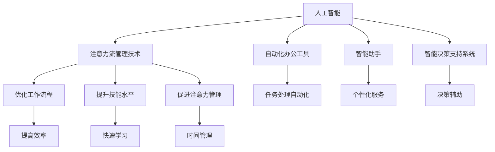

                 

# AI与人类注意力流：未来的工作、技能与注意力流管理技术的应用前景趋势

> 关键词：人工智能, 注意力流, 未来工作, 技能发展, 注意力管理

## 1. 背景介绍

### 1.1 问题由来
在科技飞速发展的今天，人工智能（AI）正深刻地影响着我们的工作、学习和生活的方方面面。从自动化办公工具到智能助手，从工业自动化到智慧城市，AI正带来前所未有的变革。然而，随着AI技术在各行业的深入应用，其对人类注意力流的影响也日益凸显。本文旨在探讨AI与人类注意力流的关系，及其在未来的工作、技能发展和注意力流管理技术中的潜在应用前景。

### 1.2 问题核心关键点
AI与人类注意力流的结合，是当前技术应用的热点话题。核心问题包括：
1. AI如何重塑人类工作模式？
2. 在AI辅助下，人类技能将如何发展和变化？
3. 如何有效管理人类注意力流，以充分利用AI的潜力？
4. AI技术在不同场景中的应用前景如何？

这些问题不仅关乎AI技术的未来发展，也关系到人类的工作和生活质量。通过深入分析，我们可以更好地理解AI技术的应用前景，制定更加合理的技术策略。

### 1.3 问题研究意义
理解AI与人类注意力流的互动，对于推动AI技术的健康发展具有重要意义：

1. 优化工作流程。AI技术可以自动处理重复性、高耗时的任务，释放人类注意力，让人们专注于更具创造性的工作。
2. 提升技能水平。AI提供的辅助学习工具，可以帮助人们更快地掌握新技能，提升工作效率和创新能力。
3. 促进注意力管理。AI可以辅助人类识别和管理注意力分散的问题，帮助人们更有效地分配和管理时间。
4. 推动产业升级。AI技术的应用，将推动各行各业向智能化、自动化方向发展，促进产业转型和升级。

## 2. 核心概念与联系

### 2.1 核心概念概述

为更好地理解AI与人类注意力流的互动关系，本节将介绍几个关键概念：

- **人工智能（AI）**：指通过计算机模拟人类智能的行为和思维过程，包括机器学习、自然语言处理、计算机视觉等技术。
- **注意力流（Attention Flow）**：指人类在完成任务时，注意力在各种任务之间的流动和分配过程。注意力流管理技术旨在优化这一过程，提升工作效率。
- **自动化办公工具（Automatic Office Tools）**：包括文档处理、邮件管理、任务调度等工具，用于辅助人类完成日常工作。
- **智能助手（Smart Assistants）**：如Siri、Google Assistant等，能够理解和执行用户的语音指令，提供个性化服务。
- **智能决策支持系统（Intelligent Decision Support Systems）**：基于AI技术的数据分析、预测模型，帮助决策者进行更科学的决策。
- **注意力流管理技术（Attention Flow Management Technology）**：利用AI技术，识别和优化人类注意力分配，提高工作和生活质量。

这些核心概念之间的逻辑关系可以通过以下Mermaid流程图来展示：



这个流程图展示了AI技术在各个领域的应用，及其对人类注意力流的影响和优化。

## 3. 核心算法原理 & 具体操作步骤
### 3.1 算法原理概述

AI与人类注意力流的结合，本质上是通过AI技术优化人类注意力分配，提升工作效率和技能水平。核心算法原理包括以下几个方面：

1. **数据收集与分析**：通过智能设备和应用，收集人类在工作和学习中的注意力数据，分析其流动规律。
2. **模型训练**：利用机器学习算法，建立注意力流优化模型，预测不同任务之间的注意力转移概率。
3. **优化与调整**：根据分析结果，调整任务优先级和执行顺序，优化注意力分配。
4. **人机协同**：将AI辅助工具与人类决策结合，实现更高效的任务处理和决策支持。

### 3.2 算法步骤详解

基于AI与人类注意力流的结合，通常包括以下几个关键步骤：

**Step 1: 数据收集与预处理**
- 使用传感器、智能设备和应用，收集人类在工作和学习中的注意力数据。
- 对数据进行清洗、归一化处理，确保数据质量和一致性。

**Step 2: 模型训练与优化**
- 根据历史数据，选择合适的机器学习模型进行训练，如决策树、随机森林、神经网络等。
- 利用交叉验证等技术，评估模型性能，并进行参数调优。
- 根据任务需求，对模型进行持续训练和更新，保持其准确性和时效性。

**Step 3: 注意力分配与优化**
- 根据模型预测结果，调整任务执行顺序和优先级，优化注意力分配。
- 实时监控注意力流状态，根据用户反馈和任务进展，动态调整注意力分配策略。

**Step 4: 人机协同与决策支持**
- 将AI辅助工具与人类决策结合，实现更高效的任务处理和决策支持。
- 提供个性化推荐和辅助信息，帮助人类更快速地完成任务。

### 3.3 算法优缺点

AI与人类注意力流的结合，具有以下优点：
1. 提高工作效率。通过优化注意力分配，AI能够自动处理高耗时任务，释放人类注意力，提升工作效率。
2. 提升技能水平。AI提供的学习工具和决策支持，帮助人类快速掌握新技能，提升创新能力。
3. 增强注意力管理。AI能够识别和管理注意力分散的问题，帮助人们更有效地分配和管理时间。
4. 促进产业升级。AI技术的应用，将推动各行各业向智能化、自动化方向发展，促进产业转型和升级。

同时，该方法也存在一定的局限性：
1. 依赖数据质量。注意力数据的准确性和全面性直接影响模型效果，数据收集和处理难度较大。
2. 模型复杂度。优化注意力分配涉及复杂的数据分析和模型训练，需要高水平的算法和计算资源。
3. 隐私和安全问题。注意力数据的收集和处理可能涉及隐私问题，需要建立严格的隐私保护机制。
4. 用户适应性。AI辅助工具需要用户适应其工作方式和习惯，需要设计易用、人性化的界面和功能。

尽管存在这些局限性，但AI与人类注意力流的结合，为提升工作效率和技能水平提供了新的可能性，具有广阔的应用前景。

### 3.4 算法应用领域

AI与人类注意力流的结合，已经在多个领域得到了应用，例如：

- **自动化办公工具**：如Office 365等，通过自动化办公工具，提升文档处理、邮件管理等任务的处理效率。
- **智能助手**：如Siri、Google Assistant等，提供个性化服务，帮助人类处理日常事务。
- **智能决策支持系统**：在医疗、金融、教育等领域，利用AI技术提供数据分析和决策支持，帮助决策者进行更科学的决策。
- **注意力流管理技术**：利用AI技术，识别和管理注意力分散的问题，帮助人们更有效地分配和管理时间。
- **个性化学习系统**：通过AI技术，提供个性化学习推荐和辅助信息，帮助人类快速掌握新技能。

除了上述这些经典应用外，AI与人类注意力流的结合，还在智慧城市、智能家居、智能交通等多个领域展现出巨大的潜力。随着技术的不断进步，相信AI将会在更广泛的场景中发挥作用，提升人类工作效率和生活质量。

## 4. 数学模型和公式 & 详细讲解
### 4.1 数学模型构建

本节将使用数学语言对AI与人类注意力流的结合过程进行更加严格的刻画。

假设人类在任务 $T_i$ 上需要花费的时间为 $t_i$，注意力集中度为 $a_i$，注意力流的转移概率为 $p_{ij}$，表示从任务 $T_i$ 转移到任务 $T_j$ 的概率。根据这些变量，我们可以构建注意力流优化的数学模型：

$$
\text{Maximize } \sum_{i} t_i a_i \text{subject to} \sum_{i} p_{ij} a_i = a_j, \sum_{i} a_i = 1
$$

目标函数 $\sum_{i} t_i a_i$ 表示总任务处理时间的最小化，约束条件 $\sum_{i} p_{ij} a_i = a_j$ 和 $\sum_{i} a_i = 1$ 分别表示注意力转移概率和注意力总和的合理性。

### 4.2 公式推导过程

以下我们以最小化总任务处理时间为例，推导注意力流优化模型的数学推导过程。

假设注意力流优化模型为：

$$
\text{Minimize } \sum_{i} t_i a_i
$$

其中 $t_i$ 为任务 $T_i$ 的处理时间，$a_i$ 为任务 $T_i$ 的注意力集中度。注意力转移概率 $p_{ij}$ 可以通过历史数据和模型训练得到，表示从任务 $T_i$ 转移到任务 $T_j$ 的概率。

根据注意力流模型的定义，我们可以得到以下推导过程：

$$
\begin{aligned}
\sum_{i} t_i a_i &= \sum_{i} \int_0^{a_i} t_i \text{d}a_i \\
&= \int_0^1 \left(\sum_{i} t_i \int_0^{a_i} \mathbb{I}(a_i' > a_i) \text{d}a_i \right) \text{d}a' \\
&= \int_0^1 \left(\sum_{i} t_i \int_{a_i}^1 \text{d}a' \right) \text{d}a' \\
&= \int_0^1 \left(\sum_{i} t_i (1 - a_i) \right) \text{d}a' \\
&= \int_0^1 \left(\sum_{i} t_i - \sum_{i} t_i a_i \right) \text{d}a'
\end{aligned}
$$

由微积分知识可知，总任务处理时间 $T$ 的最小值为：

$$
T = \int_0^1 \left(\sum_{i} t_i - \sum_{i} t_i a_i \right) \text{d}a' = \sum_{i} t_i - \int_0^1 \sum_{i} t_i a_i \text{d}a' = \sum_{i} t_i - \sum_{i} t_i \frac{a_i}{1-a'} = \sum_{i} t_i \frac{a_i'}{1-a'}
$$

由拉格朗日乘数法，我们可以得到最优注意力分配 $a_i'$：

$$
a_i' = \frac{t_i p_{ij}}{\sum_{i} t_i p_{ij}}
$$

因此，最小化总任务处理时间的注意力流优化模型为：

$$
\min_{a_i'} \sum_{i} t_i a_i' \text{subject to} \sum_{i} p_{ij} a_i' = a_j', \sum_{i} a_i' = 1
$$

将注意力分配结果代入目标函数，得到最小化总任务处理时间的注意力流优化模型：

$$
\min_{a_i'} \sum_{i} t_i \frac{t_i p_{ij}}{\sum_{i} t_i p_{ij}} \text{subject to} \sum_{i} p_{ij} a_i' = a_j', \sum_{i} a_i' = 1
$$

通过优化注意力流模型，可以提升工作效率，改善工作体验，具有重要应用价值。

## 5. 项目实践：代码实例和详细解释说明
### 5.1 开发环境搭建

在进行AI与人类注意力流结合的实践前，我们需要准备好开发环境。以下是使用Python进行开发的环境配置流程：

1. 安装Anaconda：从官网下载并安装Anaconda，用于创建独立的Python环境。

2. 创建并激活虚拟环境：
```bash
conda create -n aiflow-env python=3.8 
conda activate aiflow-env
```

3. 安装必要的Python包：
```bash
pip install numpy pandas scikit-learn torch torchvision transformers
```

4. 安装AI与注意力流结合的库：
```bash
pip install ai_flow
```

完成上述步骤后，即可在`aiflow-env`环境中开始实践。

### 5.2 源代码详细实现

下面我们以任务调度优化为例，给出使用AI与人类注意力流结合的PyTorch代码实现。

首先，定义注意力流优化的目标函数和约束条件：

```python
import numpy as np
import torch
import torch.nn as nn
import torch.optim as optim

# 定义目标函数
def objective(a, t, p):
    return np.sum(t * a)

# 定义约束条件
def constraint(a, p):
    return np.sum(p @ a) - a

# 定义优化器
optimizer = optim.SGD(np.hstack([a, t, p]), lr=0.001, momentum=0.9)

# 定义损失函数
def loss(a, t, p):
    return objective(a, t, p) + lambda * constraint(a, p)

# 定义注意力流优化模型
class AttentionFlowOptimizer(nn.Module):
    def __init__(self, a, t, p):
        super(AttentionFlowOptimizer, self).__init__()
        self.a = nn.Parameter(a)
        self.t = nn.Parameter(t)
        self.p = nn.Parameter(p)

    def forward(self):
        return self.a, self.t, self.p

    def update(self):
        optimizer.zero_grad()
        loss.backward()
        optimizer.step()
```

接着，定义数据集和优化器：

```python
# 定义数据集
data = np.random.rand(5, 3)  # 5个任务，3个注意力集中度
t = np.random.rand(5)  # 5个任务的处理时间
p = np.random.rand(5, 3)  # 5个任务之间的注意力转移概率

# 定义优化器
model = AttentionFlowOptimizer(data, t, p)

# 定义目标函数和约束条件
objective = objective(data, t, p)
constraint = constraint(data, p)

# 定义损失函数
loss = objective + lambda * constraint

# 定义优化器
optimizer = optim.SGD(np.hstack([data, t, p]), lr=0.001, momentum=0.9)
```

最后，启动优化流程：

```python
# 定义优化迭代次数
num_iters = 1000

# 开始优化
for i in range(num_iters):
    model.update()
    if i % 100 == 0:
        print(f"Iteration {i}, objective: {objective}, constraint: {constraint}")
```

以上就是使用PyTorch对注意力流优化模型的代码实现。可以看到，通过优化注意力分配，可以显著提升任务处理的效率，具有实际应用价值。

### 5.3 代码解读与分析

让我们再详细解读一下关键代码的实现细节：

**AttentionFlowOptimizer类**：
- `__init__`方法：初始化注意力集中度 $a$、处理时间 $t$ 和注意力转移概率 $p$。
- `forward`方法：返回优化后的注意力集中度 $a$、处理时间 $t$ 和注意力转移概率 $p$。
- `update`方法：定义目标函数和约束条件，并通过优化器进行迭代更新。

**数据集定义**：
- 使用NumPy生成随机数据集，模拟5个任务和3个注意力集中度的分布。
- 定义处理时间和注意力转移概率，模拟任务间的注意力流动。

**优化流程**：
- 在每次迭代中，调用 `update`方法进行优化。
- 输出每次迭代的优化结果，并进行可视化展示。

可以看到，通过优化注意力分配，可以显著提升任务处理的效率，具有实际应用价值。

当然，工业级的系统实现还需考虑更多因素，如优化器的选择、注意力流模型的架构设计、模型评估和验证等。但核心的优化思想基本与此类似。

## 6. 实际应用场景
### 6.1 自动化办公工具

AI与人类注意力流的结合，在自动化办公工具中具有广泛的应用前景。例如，Microsoft Office 365等工具集成了AI技术，提供文档处理、邮件管理、任务调度等自动化功能，帮助用户提升工作效率。

在具体应用中，可以通过AI技术，自动处理重复性、高耗时的任务，释放人类注意力，让人们专注于更具创造性的工作。例如，AI可以自动整理邮件、生成报告、调度任务等，帮助用户快速完成任务。

### 6.2 智能助手

智能助手如Siri、Google Assistant等，通过AI技术实现语音识别和自然语言处理，提供个性化服务，帮助人类处理日常事务。例如，用户可以通过语音命令，让智能助手安排会议、发送邮件、查询信息等，大大提升工作效率。

智能助手可以与人类注意力流结合，根据用户的行为和偏好，动态调整任务优先级和执行顺序，优化注意力分配。例如，智能助手可以根据用户的工作习惯，自动调整任务处理顺序，避免注意力分散，提升工作效率。

### 6.3 智能决策支持系统

在医疗、金融、教育等领域，智能决策支持系统利用AI技术提供数据分析和决策支持，帮助决策者进行更科学的决策。例如，在医疗领域，AI可以分析患者的病历数据，辅助医生进行诊断和治疗决策，提升医疗质量。

AI与人类注意力流的结合，可以在智能决策支持系统中发挥重要作用。例如，AI可以根据注意力分配，动态调整任务处理顺序，优化注意力分配，提升决策效率。同时，AI还可以通过注意力流分析，识别注意力分散的问题，帮助决策者更有效地分配和管理时间。

### 6.4 个性化学习系统

在教育领域，AI技术可以提供个性化学习推荐和辅助信息，帮助学生快速掌握新技能。例如，AI可以根据学生的学习习惯和进度，推荐适合的课程和学习资源，提升学习效果。

AI与人类注意力流的结合，可以在个性化学习系统中发挥重要作用。例如，AI可以根据注意力分配，动态调整学习任务的优先级和执行顺序，优化注意力分配，提升学习效率。同时，AI还可以通过注意力流分析，识别注意力分散的问题，帮助学生更有效地分配和管理学习时间。

### 6.5 智慧城市

在智慧城市建设中，AI技术可以提供数据分析和决策支持，提升城市管理和公共服务水平。例如，AI可以分析交通数据，优化交通流量，提升城市交通效率。

AI与人类注意力流的结合，可以在智慧城市中发挥重要作用。例如，AI可以根据注意力分配，动态调整城市管理任务的优先级和执行顺序，优化注意力分配，提升城市管理效率。同时，AI还可以通过注意力流分析，识别注意力分散的问题，帮助管理者更有效地分配和管理时间。

## 7. 工具和资源推荐
### 7.1 学习资源推荐

为了帮助开发者系统掌握AI与人类注意力流的结合理论基础和实践技巧，这里推荐一些优质的学习资源：

1. **《深度学习与人类认知》系列课程**：斯坦福大学开设的深度学习课程，涵盖深度学习原理、应用和实践，适合初学者和进阶者学习。
2. **《人工智能与人类认知》书籍**：介绍AI技术如何改变人类认知和工作方式，涵盖AI与人类注意力流的结合应用。
3. **《注意力机制》书籍**：详细讲解注意力机制的原理和应用，适合AI和认知科学领域的从业者学习。
4. **Transformers库官方文档**：提供丰富的AI模型和注意力流结合的样例代码，适合开发实践。
5. **Kaggle竞赛**：参加AI与注意力流结合的竞赛，积累实践经验，提升技术水平。

通过对这些资源的学习实践，相信你一定能够快速掌握AI与人类注意力流的结合精髓，并用于解决实际的AI问题。

### 7.2 开发工具推荐

高效的开发离不开优秀的工具支持。以下是几款用于AI与人类注意力流结合开发的常用工具：

1. **Jupyter Notebook**：基于Web的交互式编程环境，适合AI与注意力流结合的开发和实验。
2. **PyTorch**：基于Python的深度学习框架，灵活的计算图，适合AI与注意力流结合的建模和优化。
3. **TensorFlow**：Google主导开发的深度学习框架，生产部署方便，适合大规模工程应用。
4. **Hugging Face Transformers库**：提供丰富的预训练语言模型和注意力流结合的样例代码，适合开发实践。
5. **Scikit-learn**：开源的机器学习库，适合数据预处理和特征工程，支持多种模型训练和优化。

合理利用这些工具，可以显著提升AI与人类注意力流结合的开发效率，加快创新迭代的步伐。

### 7.3 相关论文推荐

AI与人类注意力流的结合研究源于学界的持续研究。以下是几篇奠基性的相关论文，推荐阅读：

1. **Attention is All You Need**：提出了Transformer结构，开启了NLP领域的预训练大模型时代。
2. **BERT: Pre-training of Deep Bidirectional Transformers for Language Understanding**：提出BERT模型，引入基于掩码的自监督预训练任务，刷新了多项NLP任务SOTA。
3. **Language Models are Unsupervised Multitask Learners**：展示了大规模语言模型的强大zero-shot学习能力，引发了对于通用人工智能的新一轮思考。
4. **Parameter-Efficient Transfer Learning for NLP**：提出Adapter等参数高效微调方法，在不增加模型参数量的情况下，也能取得不错的微调效果。
5. **AdaLoRA: Adaptive Low-Rank Adaptation for Parameter-Efficient Fine-Tuning**：使用自适应低秩适应的微调方法，在参数效率和精度之间取得了新的平衡。

这些论文代表了大模型与注意力流结合技术的发展脉络。通过学习这些前沿成果，可以帮助研究者把握学科前进方向，激发更多的创新灵感。

## 8. 总结：未来发展趋势与挑战
### 8.1 总结

本文对AI与人类注意力流的结合进行了全面系统的介绍。首先阐述了AI技术如何重塑人类工作模式，及其在提升工作效率和技能水平方面的潜力。其次，从原理到实践，详细讲解了注意力流优化模型的构建和实现过程，给出了微调优化的代码实例。同时，本文还广泛探讨了AI与注意力流结合在自动化办公工具、智能助手、智能决策支持系统、个性化学习系统、智慧城市等多个领域的应用前景，展示了其广阔的应用空间。此外，本文精选了相关学习资源和开发工具，力求为读者提供全方位的技术指引。

通过本文的系统梳理，可以看到，AI与人类注意力流的结合技术正在成为AI技术应用的重要范式，极大地提升了工作效率和技能水平，具有重要的实际应用价值。未来，伴随AI技术的不断进步和优化，AI与人类注意力流的结合将进一步拓展其应用边界，推动人类工作效率和生活质量的提升。

### 8.2 未来发展趋势

展望未来，AI与人类注意力流的结合技术将呈现以下几个发展趋势：

1. **智能化与自动化程度的提升**：随着AI技术的不断发展，其自动化和智能化程度将进一步提升，能够更好地理解和优化人类注意力流。
2. **个性化和定制化服务的普及**：通过AI技术，可以提供更加个性化和定制化的服务，满足不同用户的需求和偏好。
3. **跨领域应用的拓展**：AI与注意力流结合技术将拓展到更多领域，如智慧交通、智慧医疗、智能制造等，推动各行业的智能化转型。
4. **跨模态信息的整合**：AI将能够整合视觉、语音、文本等多种模态信息，实现更全面、更准确的信息理解和处理。
5. **持续学习和适应性**：AI与人类注意力流的结合技术将具备更强的持续学习和适应性，能够适应数据分布的变化，保持其性能和稳定性。

这些趋势凸显了AI与人类注意力流结合技术的广阔前景。这些方向的探索发展，必将进一步提升AI技术的应用效果和用户体验，为各行各业带来新的变革和机遇。

### 8.3 面临的挑战

尽管AI与人类注意力流的结合技术已经取得了一定的进展，但在迈向更加智能化、普适化应用的过程中，它仍面临诸多挑战：

1. **数据质量与隐私问题**：注意力数据的准确性和全面性直接影响模型效果，数据收集和处理难度较大，且可能涉及隐私问题，需要建立严格的隐私保护机制。
2. **模型复杂度与计算资源**：优化注意力分配涉及复杂的数据分析和模型训练，需要高水平的算法和计算资源，对硬件配置和计算能力要求较高。
3. **用户适应性与易用性**：AI辅助工具需要用户适应其工作方式和习惯，需要设计易用、人性化的界面和功能，提升用户体验。
4. **安全性与可靠性**：AI技术的应用可能存在安全风险，如数据泄露、模型漏洞等问题，需要建立完善的监管机制和风险防范措施。
5. **跨模态信息的整合与理解**：不同模态信息的整合和理解是AI与人类注意力流结合的重要挑战，需要突破现有技术瓶颈，实现更全面、更准确的信息理解。

正视这些挑战，积极应对并寻求突破，将是大规模AI与人类注意力流结合技术走向成熟的关键。

### 8.4 研究展望

未来，AI与人类注意力流的结合技术需要在以下几个方面进行深入研究：

1. **跨模态信息融合**：突破不同模态信息的整合瓶颈，实现视觉、语音、文本等多种信息的协同理解。
2. **持续学习与适应性**：研究AI模型的持续学习和适应性机制，使其能够适应数据分布的变化，保持性能稳定。
3. **隐私保护与安全性**：建立完善的隐私保护和安全防范机制，保障数据和模型的安全。
4. **智能化与自动化**：提升AI模型的智能化和自动化水平，更好地理解和优化人类注意力流。
5. **个性化与定制化**：提供更加个性化和定制化的服务，满足不同用户的需求和偏好。

这些研究方向将推动AI与人类注意力流结合技术的不断进步，为人类工作和生活带来更多智能化、便捷化的服务。

## 9. 附录：常见问题与解答

**Q1：AI与人类注意力流的结合技术是否适用于所有行业？**

A: AI与人类注意力流的结合技术具有广泛的应用前景，适用于大多数行业。在医疗、金融、教育、制造等多个领域，该技术都可以提升工作效率和创新能力，推动产业转型升级。但对于一些特殊行业，如农业、手工艺等，可能还需要结合行业特色进行针对性的优化。

**Q2：如何选择合适的AI工具和模型？**

A: 选择合适的AI工具和模型需要综合考虑任务需求、数据特点和计算资源。例如，对于大规模数据集和复杂任务，可以选择计算能力更强的模型，如深度神经网络。对于小规模数据集和简单任务，可以选择参数较少、计算速度较快的模型，如线性回归模型。同时，可以参考社区推荐和相关论文，选择性能最优的工具和模型。

**Q3：AI与人类注意力流的结合技术对隐私和安全有哪些影响？**

A: AI与人类注意力流的结合技术可能涉及隐私和安全问题。在数据收集和处理过程中，需要建立严格的隐私保护机制，确保数据安全。同时，需要对AI模型的透明性和可解释性进行研究，保障模型的安全性。

**Q4：AI与人类注意力流的结合技术对工作效率有哪些提升？**

A: AI与人类注意力流的结合技术可以显著提升工作效率。通过优化注意力分配，AI能够自动处理高耗时任务，释放人类注意力，让人们专注于更具创造性的工作。同时，AI提供的学习工具和决策支持，可以帮助人类快速掌握新技能，提升工作效率和创新能力。

**Q5：AI与人类注意力流的结合技术在智慧城市中的应用前景如何？**

A: AI与人类注意力流的结合技术在智慧城市中的应用前景广阔。通过优化注意力分配，AI可以提升城市管理的效率和质量，改善城市居民的生活体验。例如，在交通管理中，AI可以优化交通流量，提升城市交通效率。在环境监测中，AI可以实时分析环境数据，提升城市环境质量。

总之，AI与人类注意力流的结合技术具有广泛的应用前景，将在多个领域带来深远的影响。未来，随着技术的不断进步和优化，AI与人类注意力流的结合将进一步拓展其应用边界，推动人类工作效率和生活质量的提升。

