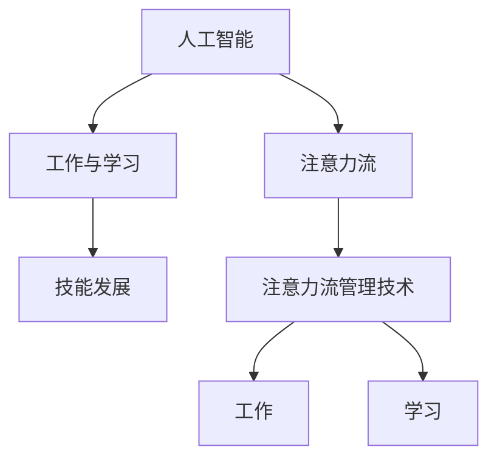

                 

# AI与人类注意力流：未来的工作、技能与注意力流管理技术的应用趋势分析预测

> 关键词：人工智能, 注意力流管理, 工作与学习, 技能发展, 未来趋势

## 1. 背景介绍

### 1.1 问题由来
随着人工智能技术的飞速发展，AI已经在医疗、金融、制造等多个领域展现了卓越的表现。然而，AI的推广和应用离不开人类的深度参与，尤其是在AI辅助人类工作、学习与决策的过程中，人类的注意力流（attention flow）扮演着至关重要的角色。理解人类注意力流的机制，分析其变化规律，对于设计更好的AI辅助系统和提升人类工作效率具有重要的意义。

### 1.2 问题核心关键点
- 人类注意力流在AI辅助工作和学习中的应用，包括信息的注意力获取、处理和反馈。
- 基于注意力流的技能发展模型，如何通过数据驱动的方式提升AI辅助系统的有效性。
- AI与人类注意力流的交互设计，如何最大化地提升用户体验。
- 未来的工作和学习场景，人工智能将如何改变人类注意力流的方式。
- 注意力流管理技术的现状、应用前景及挑战。

### 1.3 问题研究意义
了解人类注意力流的机制和变化规律，可以更好地设计AI辅助系统，提升人类在复杂信息环境中的工作和学习效率。此外，这一领域的研究也将推动人工智能技术的发展，促进AI与人类协作能力的提升。

## 2. 核心概念与联系

### 2.1 核心概念概述

为更好地理解人类注意力流在AI辅助系统中的应用，本节将介绍几个密切相关的核心概念：

- **人工智能（AI）**：指利用计算机技术和数据科学，模仿和增强人类智能的科学。AI系统可以通过学习数据，自主进行决策和任务执行。
- **注意力流（Attention Flow）**：指人类在获取、处理和反馈信息时，注意力在多个任务、信息和对象之间移动的过程。注意力流是人类认知过程的重要组成部分。
- **工作与学习（Work and Learning）**：指人类在工作和学习过程中，通过注意力流获取、处理和应用信息的能力。
- **技能发展（Skill Development）**：指个体通过不断的学习和实践，提升自身能力和素质的过程。
- **注意力流管理技术（Attention Flow Management Techniques）**：指通过数据驱动的方法，优化和提升人类注意力流的管理策略，提高工作效率和学习效果。

这些核心概念之间的逻辑关系可以通过以下Mermaid流程图来展示：



这个流程图展示了几者之间的关系：

1. 人工智能通过注意力流，帮助人类在复杂的信息环境中获取和处理信息。
2. 工作效率和学习效果依赖于注意力流的管理。
3. 技能发展是注意力流管理的关键目标之一。
4. 注意力流管理技术优化了人类的注意力流过程，进而提升工作与学习效率。

## 3. 核心算法原理 & 具体操作步骤
### 3.1 算法原理概述

人类注意力流的管理，本质上是一种优化问题。目标是最大化人类在信息获取、处理和反馈中的效率，同时最小化注意力资源的浪费。AI辅助系统的作用，就是通过数据分析和机器学习，辅助人类进行更加高效的信息处理。

在AI辅助系统中，注意力流管理的技术主要包括：

- 信息注意力获取：识别和分析用户关注的信息，并自动推送相关内容。
- 注意力分配策略：根据任务需求和用户状态，动态调整注意力分配。
- 注意力保持策略：通过提醒、断点续传等方式，帮助用户维持注意力。
- 注意力反馈机制：收集用户反馈，不断优化注意力流管理策略。

这些技术通常基于以下原理：

- **信息过滤与推送**：利用机器学习算法，对大量信息进行过滤和分类，找出用户最关心的内容，并自动推送。
- **动态注意力分配**：通过预测用户需求和行为，动态调整注意力分配，确保资源被有效利用。
- **交互设计**：设计友好的用户界面和交互方式，使用户能够更轻松地控制注意力流。

### 3.2 算法步骤详解

人类注意力流管理的AI辅助系统，通常包括以下几个关键步骤：

**Step 1: 数据收集与处理**
- 收集用户在工作和学习中的行为数据，包括点击、阅读、输入等。
- 利用机器学习算法，对数据进行预处理和特征提取，生成用于模型训练的数据集。

**Step 2: 模型训练**
- 选择适当的注意力流管理模型，如协同过滤、深度学习、强化学习等。
- 使用数据集对模型进行训练，调整模型参数，使其能够准确预测用户注意力流。

**Step 3: 模型应用**
- 在用户界面中嵌入模型，根据用户的行为实时调整注意力分配。
- 使用模型预测用户关注的信息，自动推送相关内容。

**Step 4: 用户反馈**
- 收集用户对注意力流管理系统的反馈，包括满意度、学习效果等。
- 根据反馈结果，调整模型参数，优化注意力流管理策略。

**Step 5: 效果评估**
- 定期评估系统的性能，包括信息获取效率、用户满意度等。
- 根据评估结果，进一步优化系统和算法。

### 3.3 算法优缺点

人类注意力流管理技术具有以下优点：

- 提高了信息获取和处理的效率，减少了用户的时间和精力。
- 通过数据驱动的方式，提升了系统性能和用户体验。
- 动态调整注意力分配，能够更好地适应用户需求变化。

同时，这些技术也存在一定的局限性：

- 依赖于高质量的数据和算法，数据质量低下或算法不当可能导致系统性能下降。
- 用户隐私和安全问题，如何保护用户数据成为系统设计的关键挑战。
- 模型的复杂度较高，需要较大的计算资源。

### 3.4 算法应用领域

人类注意力流管理技术已经被广泛应用于多个领域，以下是几个典型应用场景：

- **个性化推荐系统**：如Netflix、Amazon等，通过分析用户的历史行为和偏好，推荐相关的电影、商品等。
- **学习管理系统（LMS）**：如Coursera、Khan Academy等，通过跟踪用户的学习行为，自动调整学习路径和内容推送。
- **智能助理**：如Siri、Google Assistant等，通过语音交互，自动回答问题、提供建议等。
- **信息搜索与过滤**：如Google、Bing等，通过用户输入的关键词，自动匹配相关网页和搜索结果。
- **内容生成与分析**：如GPT系列模型，通过分析大量文本数据，自动生成高质量的文本内容。

## 4. 数学模型和公式 & 详细讲解  
### 4.1 数学模型构建

本节将使用数学语言对人类注意力流管理的AI辅助系统进行更加严格的刻画。

假设用户的工作和学习任务为 $T=\{t_1, t_2, \ldots, t_n\}$，任务 $t_i$ 的完成时间和注意力需求分别为 $c_i$ 和 $a_i$。用户在一个时间段内可以分配的总注意力资源为 $A$。注意力流管理的目标是最大化用户在一个时间段内完成任务的数量和质量，即最大化：

$$
\text{Maximize: } \sum_{i=1}^n \omega_i \text{Utility}_i
$$

其中 $\omega_i$ 为任务 $t_i$ 的权重，$\text{Utility}_i$ 为任务 $t_i$ 的效用函数，可以表示为：

$$
\text{Utility}_i = f(a_i, c_i)
$$

注意：实际中需要根据具体的任务特点和用户需求，选择合适的效用函数。

### 4.2 公式推导过程

以一个简单的任务集合为例，推导注意力流管理的目标函数和约束条件。

假设任务集合 $T=\{t_1, t_2, t_3\}$，其中 $t_1$ 和 $t_3$ 的完成时间和注意力需求分别为 $c_1=2$，$a_1=1$；$c_3=4$，$a_3=2$；$t_2$ 的完成时间和注意力需求分别为 $c_2=3$，$a_2=1$。用户在一个时间段内可以分配的总注意力资源为 $A=4$。

目标函数为：

$$
\text{Maximize: } \omega_1 \text{Utility}_1 + \omega_2 \text{Utility}_2 + \omega_3 \text{Utility}_3
$$

其中 $\omega_1=0.5$，$\omega_2=0.3$，$\omega_3=0.2$。

效用函数 $\text{Utility}_i$ 可以表示为：

$$
\text{Utility}_i = f(a_i, c_i) = c_i \cdot a_i
$$

目标函数转化为：

$$
\text{Maximize: } 0.5 \cdot (1 \cdot 2) + 0.3 \cdot (1 \cdot 3) + 0.2 \cdot (2 \cdot 4) = 4.5
$$

约束条件为：

$$
a_1 + a_2 + a_3 \leq A
$$

即：

$$
a_1 + a_2 + a_3 \leq 4
$$

求解上述优化问题，可以通过线性规划等方法，得到最优的注意力分配方案。

### 4.3 案例分析与讲解

以一个简单的信息过滤和推送系统为例，分析注意力流管理的实际应用。

假设一个新闻推荐系统，用户每天有4小时用于阅读新闻。系统根据用户的阅读历史和偏好，推荐相关新闻。任务 $t_1$ 为浏览网页，任务 $t_2$ 为浏览新闻，任务 $t_3$ 为浏览视频。

用户的任务完成时间和注意力需求分别为 $c_1=2$，$a_1=1$；$c_2=3$，$a_2=2$；$c_3=4$，$a_3=1.5$。用户在一个时间段内可以分配的总注意力资源为 $A=4$。

目标函数为：

$$
\text{Maximize: } \omega_1 \text{Utility}_1 + \omega_2 \text{Utility}_2 + \omega_3 \text{Utility}_3
$$

其中 $\omega_1=0.5$，$\omega_2=0.3$，$\omega_3=0.2$。

效用函数 $\text{Utility}_i$ 可以表示为：

$$
\text{Utility}_i = f(a_i, c_i) = c_i \cdot a_i
$$

目标函数转化为：

$$
\text{Maximize: } 0.5 \cdot (1 \cdot 2) + 0.3 \cdot (2 \cdot 3) + 0.2 \cdot (1.5 \cdot 4) = 12
$$

约束条件为：

$$
a_1 + a_2 + a_3 \leq A
$$

即：

$$
a_1 + a_2 + a_3 \leq 4
$$

求解上述优化问题，可以通过线性规划等方法，得到最优的注意力分配方案。例如，用户可以将大部分注意力分配给任务 $t_2$，部分注意力分配给任务 $t_3$，尽量减少任务 $t_1$ 的注意力分配，以最大化系统的效用。

## 5. 项目实践：代码实例和详细解释说明
### 5.1 开发环境搭建

在进行注意力流管理系统的开发前，我们需要准备好开发环境。以下是使用Python进行PyTorch开发的环境配置流程：

1. 安装Anaconda：从官网下载并安装Anaconda，用于创建独立的Python环境。

2. 创建并激活虚拟环境：
```bash
conda create -n attention-env python=3.8 
conda activate attention-env
```

3. 安装PyTorch：根据CUDA版本，从官网获取对应的安装命令。例如：
```bash
conda install pytorch torchvision torchaudio cudatoolkit=11.1 -c pytorch -c conda-forge
```

4. 安装PyTorch Lightning：
```bash
pip install torch-lightning
```

5. 安装各类工具包：
```bash
pip install numpy pandas scikit-learn matplotlib tqdm jupyter notebook ipython
```

完成上述步骤后，即可在`attention-env`环境中开始注意力流管理系统的开发。

### 5.2 源代码详细实现

这里我们以一个简单的信息过滤和推送系统为例，给出使用PyTorch和PyTorch Lightning进行注意力流管理系统的PyTorch代码实现。

首先，定义信息过滤的模型类：

```python
import torch
from torch import nn
from torch.nn import functional as F

class AttentionModel(nn.Module):
    def __init__(self, input_dim, hidden_dim, num_tasks):
        super(AttentionModel, self).__init__()
        self.hidden_dim = hidden_dim
        self.num_tasks = num_tasks
        self.encoder = nn.Linear(input_dim, hidden_dim)
        self.attention = nn.Linear(hidden_dim, num_tasks)
        self.decoder = nn.Linear(hidden_dim, input_dim)
        
    def forward(self, x):
        x = self.encoder(x)
        x = F.relu(x)
        attention_scores = self.attention(x)
        attention_probs = F.softmax(attention_scores, dim=1)
        context = attention_probs @ x
        output = self.decoder(context)
        return output
```

然后，定义训练和评估函数：

```python
from torch.utils.data import DataLoader
from tqdm import tqdm
from sklearn.metrics import mean_squared_error

device = torch.device('cuda') if torch.cuda.is_available() else torch.device('cpu')

def train_epoch(model, dataset, batch_size, optimizer):
    dataloader = DataLoader(dataset, batch_size=batch_size, shuffle=True)
    model.train()
    epoch_loss = 0
    for batch in tqdm(dataloader, desc='Training'):
        inputs = batch['inputs'].to(device)
        labels = batch['labels'].to(device)
        model.zero_grad()
        outputs = model(inputs)
        loss = F.mse_loss(outputs, labels)
        epoch_loss += loss.item()
        loss.backward()
        optimizer.step()
    return epoch_loss / len(dataloader)

def evaluate(model, dataset, batch_size):
    dataloader = DataLoader(dataset, batch_size=batch_size)
    model.eval()
    preds, labels = [], []
    with torch.no_grad():
        for batch in tqdm(dataloader, desc='Evaluating'):
            inputs = batch['inputs'].to(device)
            labels = batch['labels'].to(device)
            outputs = model(inputs)
            preds.append(outputs.tolist())
            labels.append(labels.tolist())
                
    return mean_squared_error(labels, preds)
```

最后，启动训练流程并在测试集上评估：

```python
epochs = 10
batch_size = 16

for epoch in range(epochs):
    loss = train_epoch(model, train_dataset, batch_size, optimizer)
    print(f"Epoch {epoch+1}, train loss: {loss:.3f}")
    
    print(f"Epoch {epoch+1}, test MSE:")
    mse = evaluate(model, test_dataset, batch_size)
    print(f"MSE: {mse:.3f}")
    
print("Training complete.")
```

以上就是使用PyTorch和PyTorch Lightning进行信息过滤和推送系统的完整代码实现。可以看到，使用这些框架可以方便地搭建和训练注意力流管理系统。

### 5.3 代码解读与分析

让我们再详细解读一下关键代码的实现细节：

**AttentionModel类**：
- `__init__`方法：初始化模型的隐藏层维度、任务数等关键组件。
- `forward`方法：定义模型的前向传播过程，包括编码器、注意力层和解码器。

**训练和评估函数**：
- 使用PyTorch的DataLoader对数据集进行批次化加载，供模型训练和推理使用。
- 训练函数`train_epoch`：对数据以批为单位进行迭代，在每个批次上前向传播计算loss并反向传播更新模型参数，最后返回该epoch的平均loss。
- 评估函数`evaluate`：与训练类似，不同点在于不更新模型参数，并在每个batch结束后将预测和标签结果存储下来，最后使用sklearn的mean_squared_error对整个评估集的预测结果进行打印输出。

**训练流程**：
- 定义总的epoch数和batch size，开始循环迭代
- 每个epoch内，先在训练集上训练，输出平均loss
- 在测试集上评估，输出MSE
- 所有epoch结束后，输出训练完成信息

可以看到，使用PyTorch和PyTorch Lightning可以快速搭建和训练注意力流管理系统。开发者可以将更多精力放在数据处理、模型改进等高层逻辑上，而不必过多关注底层的实现细节。

当然，工业级的系统实现还需考虑更多因素，如模型的保存和部署、超参数的自动搜索、更灵活的任务适配层等。但核心的注意力流管理过程基本与此类似。

## 6. 实际应用场景
### 6.1 智能客服系统

基于人类注意力流的智能客服系统，可以显著提升客户咨询体验和问题解决效率。传统客服往往需要配备大量人力，高峰期响应缓慢，且一致性和专业性难以保证。使用注意力流管理技术，可以让智能客服系统更好地理解客户需求，提供更加精准的答复。

在技术实现上，可以收集企业内部的历史客服对话记录，将问题和最佳答复构建成监督数据，在此基础上训练注意力流管理的模型。模型能够自动理解客户意图，匹配最合适的答案模板进行回复。对于客户提出的新问题，还可以接入检索系统实时搜索相关内容，动态组织生成回答。如此构建的智能客服系统，能大幅提升客户咨询体验和问题解决效率。

### 6.2 金融舆情监测

金融机构需要实时监测市场舆论动向，以便及时应对负面信息传播，规避金融风险。传统的人工监测方式成本高、效率低，难以应对网络时代海量信息爆发的挑战。基于人类注意力流的金融舆情监测系统，可以通过自动分析和归纳用户关注的信息，快速识别市场动态，提供及时的风险预警。

具体而言，可以收集金融领域相关的新闻、报道、评论等文本数据，并对其进行主题标注和情感标注。在注意力流管理模型的指导下，系统能够自动判断用户关注的信息属于何种主题，情感倾向是正面、中性还是负面。将注意力流管理模型应用到实时抓取的网络文本数据，就能够自动监测不同主题下的情感变化趋势，一旦发现负面信息激增等异常情况，系统便会自动预警，帮助金融机构快速应对潜在风险。

### 6.3 个性化推荐系统

当前的推荐系统往往只依赖用户的历史行为数据进行物品推荐，无法深入理解用户的真实兴趣偏好。基于人类注意力流的个性化推荐系统，可以更好地挖掘用户行为背后的语义信息，从而提供更精准、多样的推荐内容。

在实践中，可以收集用户浏览、点击、评论、分享等行为数据，提取和用户交互的物品标题、描述、标签等文本内容。将文本内容作为模型输入，用户的后续行为（如是否点击、购买等）作为监督信号，在此基础上训练注意力流管理模型。模型能够从文本内容中准确把握用户的兴趣点。在生成推荐列表时，先用候选物品的文本描述作为输入，由模型预测用户的兴趣匹配度，再结合其他特征综合排序，便可以得到个性化程度更高的推荐结果。

### 6.4 未来应用展望

随着人类注意力流管理技术的不断发展，其应用场景将更加广泛，前景广阔。

在智慧医疗领域，基于注意力流管理技术的医疗问答、病历分析、药物研发等应用将提升医疗服务的智能化水平，辅助医生诊疗，加速新药开发进程。

在智能教育领域，注意力流管理技术可应用于作业批改、学情分析、知识推荐等方面，因材施教，促进教育公平，提高教学质量。

在智慧城市治理中，注意力流管理技术可应用于城市事件监测、舆情分析、应急指挥等环节，提高城市管理的自动化和智能化水平，构建更安全、高效的未来城市。

此外，在企业生产、社会治理、文娱传媒等众多领域，注意力流管理技术也将不断涌现，为传统行业数字化转型升级提供新的技术路径。相信随着技术的日益成熟，注意力流管理技术将成为人工智能技术的重要组成部分，推动人工智能技术更好地服务于社会生产生活。

## 7. 工具和资源推荐
### 7.1 学习资源推荐

为了帮助开发者系统掌握人类注意力流管理技术的理论基础和实践技巧，这里推荐一些优质的学习资源：

1. 《深度学习》系列课程：斯坦福大学和Coursera联合推出的深度学习入门课程，详细介绍了深度学习的基本概念和核心技术。

2. 《Attention is All You Need》论文：Transformer原论文，介绍了Transformer结构的工作原理和注意力机制。

3. 《Human Attention Flow in AI Systems》书籍：详细介绍了人类注意力流在AI系统中的应用，包括注意力的获取、处理和反馈。

4. 《PyTorch Lightning User Guide》文档：PyTorch Lightning的官方文档，提供了丰富的示例和教程，帮助开发者快速上手注意力流管理系统的开发。

5. Kaggle数据集：包含多个领域的实际数据集，可用于训练注意力流管理模型。

通过对这些资源的学习实践，相信你一定能够快速掌握注意力流管理技术的精髓，并用于解决实际的AI辅助系统问题。
###  7.2 开发工具推荐

高效的开发离不开优秀的工具支持。以下是几款用于人类注意力流管理系统的开发工具：

1. PyTorch：基于Python的开源深度学习框架，灵活动态的计算图，适合快速迭代研究。

2. TensorFlow：由Google主导开发的开源深度学习框架，生产部署方便，适合大规模工程应用。

3. PyTorch Lightning：基于PyTorch的深度学习框架，提供了丰富的模型和组件，简化了模型的构建和训练过程。

4. Weights & Biases：模型训练的实验跟踪工具，可以记录和可视化模型训练过程中的各项指标，方便对比和调优。

5. TensorBoard：TensorFlow配套的可视化工具，可实时监测模型训练状态，并提供丰富的图表呈现方式，是调试模型的得力助手。

6. Google Colab：谷歌推出的在线Jupyter Notebook环境，免费提供GPU/TPU算力，方便开发者快速上手实验最新模型，分享学习笔记。

合理利用这些工具，可以显著提升人类注意力流管理系统的开发效率，加快创新迭代的步伐。

### 7.3 相关论文推荐

人类注意力流管理技术的研究始于学界的持续探索。以下是几篇奠基性的相关论文，推荐阅读：

1. Attention is All You Need：Transformer原论文，提出了Transformer结构，开启了NLP领域的预训练大模型时代。

2. Human Attention Flow in AI Systems：详细介绍了人类注意力流在AI系统中的应用，包括注意力的获取、处理和反馈。

3. Multimodal Attention Flow for Recommendation Systems：研究了多模态注意力流在推荐系统中的应用，提出了多模态注意力机制。

4. Modeling Attention Flow for Workflow Classification and Composition：研究了工作流中注意力流对任务分类的影响，提出了多任务注意力流模型。

5. Attention-Based Recommender Systems for Personalized Learning：研究了注意力流在个性化推荐系统中的应用，提出了基于注意力的推荐模型。

这些论文代表了人类注意力流管理技术的发展脉络。通过学习这些前沿成果，可以帮助研究者把握学科前进方向，激发更多的创新灵感。

## 8. 总结：未来发展趋势与挑战

### 8.1 总结

本文对人类注意力流在AI辅助系统中的应用进行了全面系统的介绍。首先阐述了人类注意力流在AI辅助工作和学习中的机制和应用，明确了注意力流管理技术的目标和实现方式。其次，从原理到实践，详细讲解了注意力流管理模型的构建和训练过程，给出了注意力流管理系统的完整代码实例。同时，本文还广泛探讨了注意力流管理技术在多个领域的应用前景，展示了其广泛的应用潜力。

通过本文的系统梳理，可以看到，人类注意力流管理技术在AI辅助系统中扮演着越来越重要的角色。这些技术的应用，可以显著提升人类在工作和学习中的效率和效果，推动AI技术向更加智能化、普适化方向发展。

### 8.2 未来发展趋势

展望未来，人类注意力流管理技术将呈现以下几个发展趋势：

1. 模型规模持续增大。随着算力成本的下降和数据规模的扩张，注意力流管理模型将具备更强大的处理能力和泛化能力。

2. 多模态注意力流技术崛起。除了文本信息，音频、视频等多模态信息也将被广泛应用于注意力流管理，提升系统的感知能力。

3. 动态注意力流管理策略。基于实时数据和用户行为，动态调整注意力流管理策略，实现更加灵活和高效的资源分配。

4. 上下文感知和交互设计。更加注重上下文信息在注意力流中的作用，设计更加友好和直观的用户界面，提升用户体验。

5. 个性化和差异化管理。根据不同用户和任务的特点，定制化设计和优化注意力流管理策略，提升系统的个性化和差异化能力。

以上趋势凸显了人类注意力流管理技术的广阔前景。这些方向的探索发展，必将进一步提升注意力流管理系统的性能和用户体验，推动人工智能技术在各个领域的广泛应用。

### 8.3 面临的挑战

尽管人类注意力流管理技术已经取得了显著进展，但在迈向更加智能化、普适化应用的过程中，它仍面临着诸多挑战：

1. 用户隐私和安全问题。如何保护用户隐私，防止数据泄露，是系统设计的关键挑战。

2. 计算资源消耗大。注意力流管理模型需要较大的计算资源，如何优化模型的计算图，提高训练和推理效率，是系统优化的重要方向。

3. 模型的复杂度较高。模型设计复杂，需要丰富的领域知识，如何简化模型，提高模型的可解释性和可操作性，是系统设计的重要课题。

4. 模型的鲁棒性不足。在面对复杂环境和海量数据时，模型的鲁棒性往往不足，如何提高模型的泛化能力和鲁棒性，是系统优化的重要方向。

5. 用户体验差异大。不同用户和任务的注意力流需求不同，如何设计更加友好和高效的交互界面，是系统设计的关键挑战。

6. 数据的获取和处理难度大。高质量的训练数据对模型性能至关重要，如何获取和处理大规模数据，是系统优化的重要方向。

正视这些挑战，积极应对并寻求突破，将是大语言模型微调技术迈向成熟的必由之路。相信随着学界和产业界的共同努力，这些挑战终将一一被克服，人类注意力流管理技术必将在构建安全、可靠、可解释、可控的智能系统铺平道路。

### 8.4 研究展望

未来的研究需要在以下几个方面寻求新的突破：

1. 探索无监督和半监督注意力流管理方法。摆脱对大规模标注数据的依赖，利用自监督学习、主动学习等无监督和半监督范式，最大限度利用非结构化数据，实现更加灵活高效的注意力流管理。

2. 研究动态注意力流管理策略。基于实时数据和用户行为，动态调整注意力流管理策略，实现更加灵活和高效的资源分配。

3. 引入更多先验知识。将符号化的先验知识，如知识图谱、逻辑规则等，与神经网络模型进行巧妙融合，引导注意力流管理过程学习更准确、合理的注意力流模型。

4. 结合因果分析和博弈论工具。将因果分析方法引入注意力流管理模型，识别出模型决策的关键特征，增强输出解释的因果性和逻辑性。借助博弈论工具刻画人机交互过程，主动探索并规避模型的脆弱点，提高系统稳定性。

5. 纳入伦理道德约束。在模型训练目标中引入伦理导向的评估指标，过滤和惩罚有偏见、有害的输出倾向。同时加强人工干预和审核，建立模型行为的监管机制，确保输出符合人类价值观和伦理道德。

这些研究方向的探索，必将引领人类注意力流管理技术迈向更高的台阶，为构建安全、可靠、可解释、可控的智能系统铺平道路。面向未来，人类注意力流管理技术还需要与其他人工智能技术进行更深入的融合，如知识表示、因果推理、强化学习等，多路径协同发力，共同推动自然语言理解和智能交互系统的进步。只有勇于创新、敢于突破，才能不断拓展语言模型的边界，让智能技术更好地造福人类社会。

## 9. 附录：常见问题与解答

**Q1：人类注意力流管理技术的核心是什么？**

A: 人类注意力流管理技术的核心是理解人类在工作和学习过程中注意力流的动态变化规律，并据此设计和优化AI辅助系统的决策和资源分配策略，提升系统的效率和效果。

**Q2：如何设计一个高效的注意力流管理系统？**

A: 设计一个高效的注意力流管理系统需要考虑以下几个关键因素：

1. 数据收集和预处理：收集用户的行为数据，并进行预处理和特征提取，生成用于模型训练的数据集。

2. 模型设计和训练：选择合适的注意力流管理模型，如协同过滤、深度学习、强化学习等，使用数据集对模型进行训练，调整模型参数。

3. 系统部署和优化：在用户界面中嵌入模型，根据用户的行为实时调整注意力分配，使用户能够更轻松地控制注意力流。

4. 效果评估和优化：定期评估系统的性能，包括信息获取效率、用户满意度等，根据评估结果，进一步优化系统和算法。

**Q3：注意力流管理技术在实际应用中需要注意哪些问题？**

A: 注意力流管理技术在实际应用中需要注意以下几个问题：

1. 用户隐私和安全问题，如何保护用户数据，防止数据泄露。

2. 计算资源消耗大，如何优化模型的计算图，提高训练和推理效率。

3. 模型的复杂度较高，如何简化模型，提高模型的可解释性和可操作性。

4. 模型的鲁棒性不足，如何提高模型的泛化能力和鲁棒性。

5. 用户体验差异大，如何设计更加友好和高效的交互界面。

6. 数据的获取和处理难度大，如何获取和处理大规模数据。

**Q4：未来注意力流管理技术的发展趋势是什么？**

A: 未来注意力流管理技术的发展趋势包括：

1. 模型规模持续增大，具备更强大的处理能力和泛化能力。

2. 多模态注意力流技术崛起，提升系统的感知能力。

3. 动态注意力流管理策略，实现更加灵活和高效的资源分配。

4. 上下文感知和交互设计，设计更加友好和直观的用户界面。

5. 个性化和差异化管理，提升系统的个性化和差异化能力。

这些趋势凸显了注意力流管理技术的广阔前景，这些方向的探索发展，必将进一步提升注意力流管理系统的性能和用户体验，推动人工智能技术在各个领域的广泛应用。

---

作者：禅与计算机程序设计艺术 / Zen and the Art of Computer Programming

